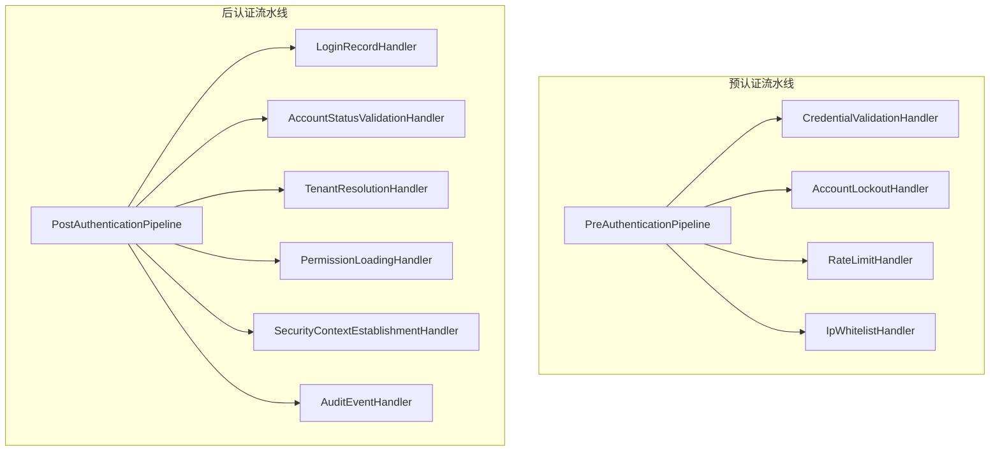
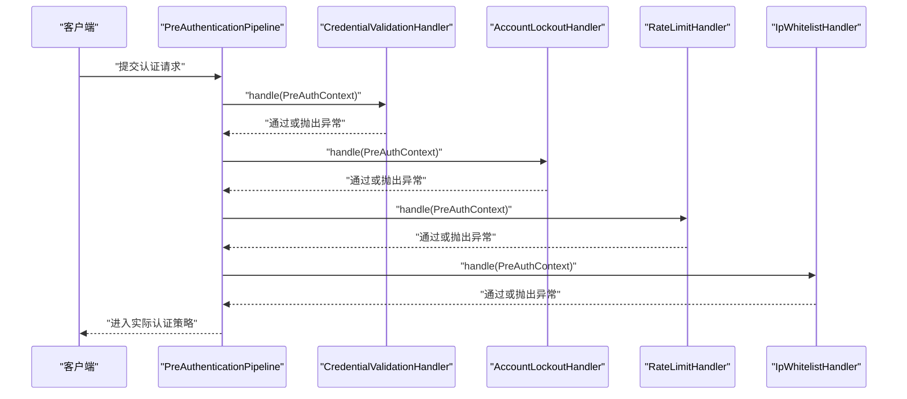
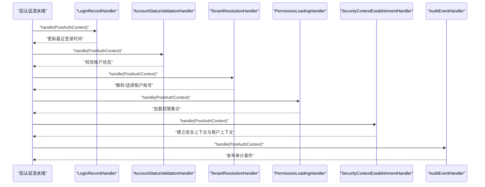
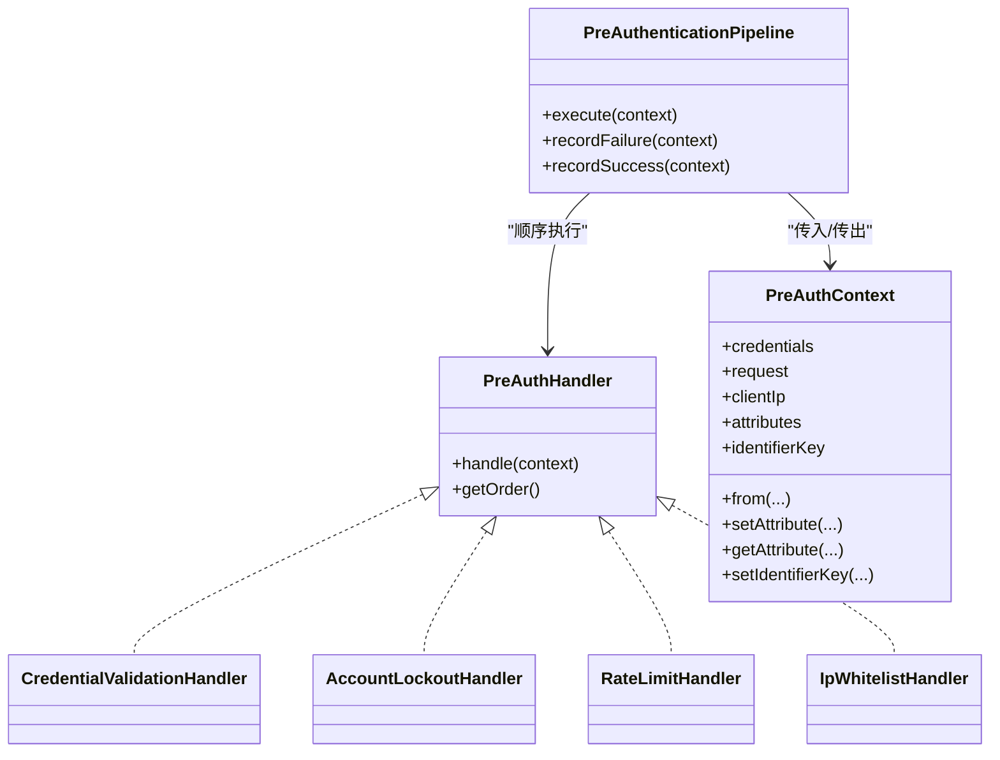
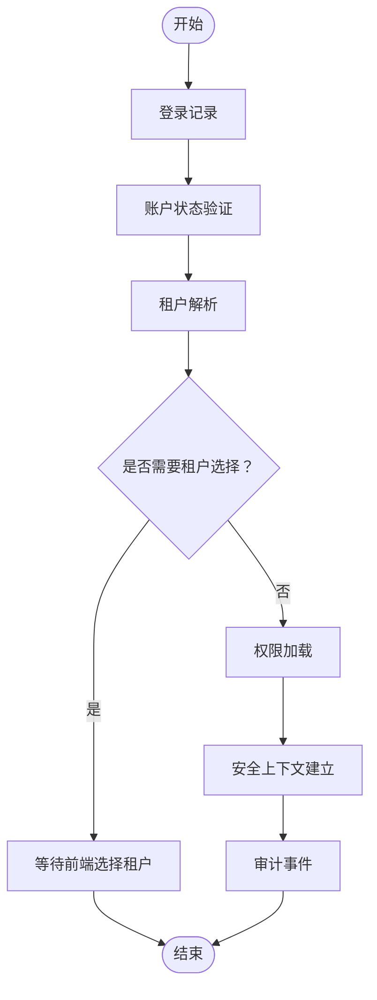
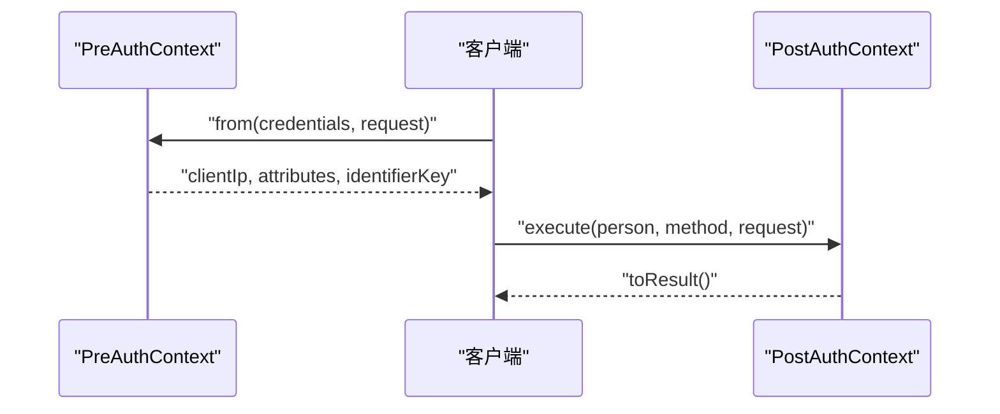
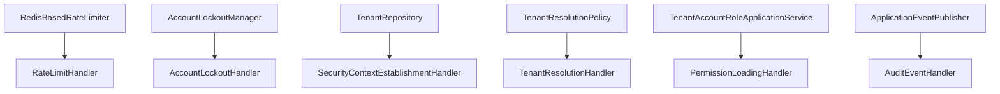

# 认证处理管道

<cite>
**本文引用的文件**
- [PreAuthenticationPipeline.java](file://iam-auth-server/src/main/java/iam/platform/auth/application/service/pipeline/PreAuthenticationPipeline.java)
- [PostAuthenticationPipeline.java](file://iam-auth-server/src/main/java/iam/platform/auth/application/service/pipeline/PostAuthenticationPipeline.java)
- [PreAuthContext.java](file://iam-auth-server/src/main/java/iam/platform/auth/application/service/pipeline/PreAuthContext.java)
- [PostAuthContext.java](file://iam-auth-server/src/main/java/iam/platform/auth/application/service/pipeline/PostAuthContext.java)
- [PreAuthHandler.java](file://iam-auth-server/src/main/java/iam/platform/auth/application/service/pipeline/PreAuthHandler.java)
- [PostAuthHandler.java](file://iam-auth-server/src/main/java/iam/platform/auth/application/service/pipeline/PostAuthHandler.java)
- [PreAuthenticationException.java](file://iam-auth-server/src/main/java/iam/platform/auth/application/service/pipeline/PreAuthenticationException.java)
- [IpWhitelistHandler.java](file://iam-auth-server/src/main/java/iam/platform/auth/application/service/pipeline/IpWhitelistHandler.java)
- [RateLimitHandler.java](file://iam-auth-server/src/main/java/iam/platform/auth/application/service/pipeline/RateLimitHandler.java)
- [AccountLockoutHandler.java](file://iam-auth-server/src/main/java/iam/platform/auth/application/service/pipeline/AccountLockoutHandler.java)
- [CredentialValidationHandler.java](file://iam-auth-server/src/main/java/iam/platform/auth/application/service/pipeline/CredentialValidationHandler.java)
- [SecurityContextEstablishmentHandler.java](file://iam-auth-server/src/main/java/iam/platform/auth/application/service/pipeline/SecurityContextEstablishmentHandler.java)
- [TenantResolutionHandler.java](file://iam-auth-server/src/main/java/iam/platform/auth/application/service/pipeline/TenantResolutionHandler.java)
- [PermissionLoadingHandler.java](file://iam-auth-server/src/main/java/iam/platform/auth/application/service/pipeline/PermissionLoadingHandler.java)
- [AccountStatusValidationHandler.java](file://iam-auth-server/src/main/java/iam/platform/auth/application/service/pipeline/AccountStatusValidationHandler.java)
- [LoginRecordHandler.java](file://iam-auth-server/src/main/java/iam/platform/auth/application/service/pipeline/LoginRecordHandler.java)
- [AuditEventHandler.java](file://iam-auth-server/src/main/java/iam/platform/auth/application/service/pipeline/AuditEventHandler.java)
</cite>

## 目录
1. [引言](#引言)
2. [项目结构](#项目结构)
3. [核心组件](#核心组件)
4. [架构总览](#架构总览)
5. [详细组件分析](#详细组件分析)
6. [依赖分析](#依赖分析)
7. [性能考虑](#性能考虑)
8. [故障排查指南](#故障排查指南)
9. [结论](#结论)
10. [附录](#附录)

## 引言
本文件系统性阐述认证处理管道的设计与实现，覆盖预认证与后认证两条流水线：预认证阶段负责安全前置校验（IP 白名单、速率限制、账户锁定、凭据格式校验等），后认证阶段完成租户解析、权限加载、安全上下文建立与审计记录等。文档重点说明：
- 管道处理器的执行顺序与上下文传递机制
- 各类处理器职责：安全上下文建立、IP 白名单检查、速率限制、账户状态验证、权限加载等
- 管道扩展机制与自定义处理器接入方式
- 认证上下文构建与传递过程（用户、租户、权限）
- 配置示例、实现指南、异常处理策略与实践建议

## 项目结构
认证处理管道位于认证服务模块中，采用“接口 + 多实现 + 管线编排”的分层设计：
- 接口层：定义 PreAuthHandler、PostAuthHandler 及其上下文对象
- 编排层：PreAuthenticationPipeline、PostAuthenticationPipeline 负责按顺序执行处理器
- 实现层：各具体处理器实现各自业务逻辑，并通过上下文在处理器间传递数据
- 异常层：PreAuthenticationException 作为预认证失败的统一异常类型

**图表来源**
- [PreAuthenticationPipeline.java:1-61](file://iam-auth-server/src/main/java/iam/platform/auth/application/service/pipeline/PreAuthenticationPipeline.java#L1-L61)
- [PostAuthenticationPipeline.java:1-31](file://iam-auth-server/src/main/java/iam/platform/auth/application/service/pipeline/PostAuthenticationPipeline.java#L1-L31)
- [PreAuthHandler.java:1-18](file://iam-auth-server/src/main/java/iam/platform/auth/application/service/pipeline/PreAuthHandler.java#L1-L18)
- [PostAuthHandler.java:1-12](file://iam-auth-server/src/main/java/iam/platform/auth/application/service/pipeline/PostAuthHandler.java#L1-L12)

**章节来源**
- [PreAuthenticationPipeline.java:1-61](file://iam-auth-server/src/main/java/iam/platform/auth/application/service/pipeline/PreAuthenticationPipeline.java#L1-L61)
- [PostAuthenticationPipeline.java:1-31](file://iam-auth-server/src/main/java/iam/platform/auth/application/service/pipeline/PostAuthenticationPipeline.java#L1-L31)

## 核心组件
- 预认证流水线编排器：负责按顺序执行所有 PreAuthHandler，并支持失败/成功计数记录
- 后认证流水线编排器：负责按顺序执行所有 PostAuthHandler，并将最终结果封装为不可变的 AuthenticationResult
- 上下文对象：
  - PreAuthContext：携带凭据、请求、客户端 IP、可扩展属性及标识键（用于限流/锁定）
  - PostAuthContext：承载用户、认证方式、请求、目标/可用租户账号、权限集合、是否需要租户选择、最终认证令牌等

**章节来源**
- [PreAuthContext.java:1-75](file://iam-auth-server/src/main/java/iam/platform/auth/application/service/pipeline/PreAuthContext.java#L1-L75)
- [PostAuthContext.java:1-71](file://iam-auth-server/src/main/java/iam/platform/auth/application/service/pipeline/PostAuthContext.java#L1-L71)
- [PreAuthHandler.java:1-18](file://iam-auth-server/src/main/java/iam/platform/auth/application/service/pipeline/PreAuthHandler.java#L1-L18)
- [PostAuthHandler.java:1-12](file://iam-auth-server/src/main/java/iam/platform/auth/application/service/pipeline/PostAuthHandler.java#L1-L12)

## 架构总览
认证处理管道遵循“前置校验 + 完成收尾”的双通道模式：
- 预认证阶段：在进入实际认证策略前，对请求进行多维安全检查，失败即刻中断
- 后认证阶段：在认证通过后，完成租户解析、权限加载、安全上下文建立与审计等收尾工作

**图表来源**
- [PreAuthenticationPipeline.java:26-31](file://iam-auth-server/src/main/java/iam/platform/auth/application/service/pipeline/PreAuthenticationPipeline.java#L26-L31)
- [CredentialValidationHandler.java:22-36](file://iam-auth-server/src/main/java/iam/platform/auth/application/service/pipeline/CredentialValidationHandler.java#L22-L36)
- [AccountLockoutHandler.java:18-21](file://iam-auth-server/src/main/java/iam/platform/auth/application/service/pipeline/AccountLockoutHandler.java#L18-L21)
- [RateLimitHandler.java:18-21](file://iam-auth-server/src/main/java/iam/platform/auth/application/service/pipeline/RateLimitHandler.java#L18-L21)
- [IpWhitelistHandler.java:23-46](file://iam-auth-server/src/main/java/iam/platform/auth/application/service/pipeline/IpWhitelistHandler.java#L23-L46)

**图表来源**
- [PostAuthenticationPipeline.java:22-29](file://iam-auth-server/src/main/java/iam/platform/auth/application/service/pipeline/PostAuthenticationPipeline.java#L22-L29)
- [LoginRecordHandler.java:17-22](file://iam-auth-server/src/main/java/iam/platform/auth/application/service/pipeline/LoginRecordHandler.java#L17-L22)
- [AccountStatusValidationHandler.java:17-20](file://iam-auth-server/src/main/java/iam/platform/auth/application/service/pipeline/AccountStatusValidationHandler.java#L17-L20)
- [TenantResolutionHandler.java:23-46](file://iam-auth-server/src/main/java/iam/platform/auth/application/service/pipeline/TenantResolutionHandler.java#L23-L46)
- [PermissionLoadingHandler.java:20-33](file://iam-auth-server/src/main/java/iam/platform/auth/application/service/pipeline/PermissionLoadingHandler.java#L20-L33)
- [SecurityContextEstablishmentHandler.java:32-79](file://iam-auth-server/src/main/java/iam/platform/auth/application/service/pipeline/SecurityContextEstablishmentHandler.java#L32-L79)
- [AuditEventHandler.java:23-35](file://iam-auth-server/src/main/java/iam/platform/auth/application/service/pipeline/AuditEventHandler.java#L23-L35)

## 详细组件分析

### 预认证流水线与处理器
- 执行顺序与优先级
  - 通过实现 Ordered 接口控制执行顺序，数值越小优先级越高
  - 典型顺序：AccountLockoutHandler(20) → RateLimitHandler(10) → CredentialValidationHandler(30) → IpWhitelistHandler(40)
- 关键处理器职责
  - 凭据校验：校验用户名/密码、手机号/验证码、邮箱/验证码等格式，并设置限流标识键
  - 账户锁定：基于失败次数判断是否锁定账户
  - 速率限制：基于 Redis 的限流器检查/记录尝试
  - IP 白名单：支持精确匹配与 CIDR，黑名单优先于白名单
- 上下文传递
  - PreAuthContext 携带 AuthenticationCredentials、HttpServletRequest、clientIp、可扩展属性与 identifierKey
  - 处理器可通过 setAttribute/getAttribute 在流水线内共享数据

**图表来源**
- [PreAuthHandler.java:1-18](file://iam-auth-server/src/main/java/iam/platform/auth/application/service/pipeline/PreAuthHandler.java#L1-L18)
- [PreAuthContext.java:14-75](file://iam-auth-server/src/main/java/iam/platform/auth/application/service/pipeline/PreAuthContext.java#L14-L75)
- [PreAuthenticationPipeline.java:16-60](file://iam-auth-server/src/main/java/iam/platform/auth/application/service/pipeline/PreAuthenticationPipeline.java#L16-L60)
- [CredentialValidationHandler.java:14-97](file://iam-auth-server/src/main/java/iam/platform/auth/application/service/pipeline/CredentialValidationHandler.java#L14-L97)
- [AccountLockoutHandler.java:14-42](file://iam-auth-server/src/main/java/iam/platform/auth/application/service/pipeline/AccountLockoutHandler.java#L14-L42)
- [RateLimitHandler.java:14-42](file://iam-auth-server/src/main/java/iam/platform/auth/application/service/pipeline/RateLimitHandler.java#L14-L42)
- [IpWhitelistHandler.java:15-107](file://iam-auth-server/src/main/java/iam/platform/auth/application/service/pipeline/IpWhitelistHandler.java#L15-L107)

**章节来源**
- [PreAuthenticationPipeline.java:26-60](file://iam-auth-server/src/main/java/iam/platform/auth/application/service/pipeline/PreAuthenticationPipeline.java#L26-L60)
- [PreAuthContext.java:30-75](file://iam-auth-server/src/main/java/iam/platform/auth/application/service/pipeline/PreAuthContext.java#L30-L75)
- [CredentialValidationHandler.java:22-97](file://iam-auth-server/src/main/java/iam/platform/auth/application/service/pipeline/CredentialValidationHandler.java#L22-L97)
- [AccountLockoutHandler.java:18-42](file://iam-auth-server/src/main/java/iam/platform/auth/application/service/pipeline/AccountLockoutHandler.java#L18-L42)
- [RateLimitHandler.java:18-42](file://iam-auth-server/src/main/java/iam/platform/auth/application/service/pipeline/RateLimitHandler.java#L18-L42)
- [IpWhitelistHandler.java:23-107](file://iam-auth-server/src/main/java/iam/platform/auth/application/service/pipeline/IpWhitelistHandler.java#L23-L107)

### 后认证流水线与处理器
- 执行顺序与优先级
  - LoginRecordHandler(200) → AccountStatusValidationHandler(100) → TenantResolutionHandler(300) → PermissionLoadingHandler(400) → SecurityContextEstablishmentHandler(500) → AuditEventHandler(600)
- 关键处理器职责
  - 登录记录：持久化最近登录时间
  - 账户状态验证：确保用户与租户账号处于允许状态
  - 租户解析：从请求头/参数提取租户编码，调用策略解析自动选择或要求选择
  - 权限加载：根据选中的租户账号加载权限集合
  - 安全上下文建立：构建 TenantAwareAuthenticationToken 并写入 SecurityContext/TenantContext，同时写入会话
  - 审计事件：记录登录审计（预留与审计系统集成）
- 上下文传递
  - PostAuthContext 逐步累积 person、method、request、requestedTenantCode、selectedTenantAccount、availableTenantAccounts、permissions、requiresTenantSelection、resultAuthentication 等字段

**图表来源**
- [PostAuthContext.java:20-71](file://iam-auth-server/src/main/java/iam/platform/auth/application/service/pipeline/PostAuthContext.java#L20-L71)
- [LoginRecordHandler.java:17-22](file://iam-auth-server/src/main/java/iam/platform/auth/application/service/pipeline/LoginRecordHandler.java#L17-L22)
- [AccountStatusValidationHandler.java:17-20](file://iam-auth-server/src/main/java/iam/platform/auth/application/service/pipeline/AccountStatusValidationHandler.java#L17-L20)
- [TenantResolutionHandler.java:23-59](file://iam-auth-server/src/main/java/iam/platform/auth/application/service/pipeline/TenantResolutionHandler.java#L23-L59)
- [PermissionLoadingHandler.java:20-33](file://iam-auth-server/src/main/java/iam/platform/auth/application/service/pipeline/PermissionLoadingHandler.java#L20-L33)
- [SecurityContextEstablishmentHandler.java:32-79](file://iam-auth-server/src/main/java/iam/platform/auth/application/service/pipeline/SecurityContextEstablishmentHandler.java#L32-L79)
- [AuditEventHandler.java:23-35](file://iam-auth-server/src/main/java/iam/platform/auth/application/service/pipeline/AuditEventHandler.java#L23-L35)

**章节来源**
- [PostAuthenticationPipeline.java:18-30](file://iam-auth-server/src/main/java/iam/platform/auth/application/service/pipeline/PostAuthenticationPipeline.java#L18-L30)
- [PostAuthContext.java:20-71](file://iam-auth-server/src/main/java/iam/platform/auth/application/service/pipeline/PostAuthContext.java#L20-L71)
- [LoginRecordHandler.java:17-28](file://iam-auth-server/src/main/java/iam/platform/auth/application/service/pipeline/LoginRecordHandler.java#L17-L28)
- [AccountStatusValidationHandler.java:17-26](file://iam-auth-server/src/main/java/iam/platform/auth/application/service/pipeline/AccountStatusValidationHandler.java#L17-L26)
- [TenantResolutionHandler.java:23-65](file://iam-auth-server/src/main/java/iam/platform/auth/application/service/pipeline/TenantResolutionHandler.java#L23-L65)
- [PermissionLoadingHandler.java:20-39](file://iam-auth-server/src/main/java/iam/platform/auth/application/service/pipeline/PermissionLoadingHandler.java#L20-L39)
- [SecurityContextEstablishmentHandler.java:32-85](file://iam-auth-server/src/main/java/iam/platform/auth/application/service/pipeline/SecurityContextEstablishmentHandler.java#L32-L85)
- [AuditEventHandler.java:23-41](file://iam-auth-server/src/main/java/iam/platform/auth/application/service/pipeline/AuditEventHandler.java#L23-L41)

### 认证上下文构建与传递
- 预认证上下文 PreAuthContext
  - 由 PreAuthContext.from(...) 从 AuthenticationCredentials 与 HttpServletRequest 构建
  - 自动提取 clientIp，支持 X-Forwarded-For、X-Real-IP 与 RemoteAddr
  - 提供 setAttribute/getAttribute 支持跨处理器共享数据
  - setIdentifierKey 用于限流/锁定的标识键（用户名/手机号/邮箱）
- 后认证上下文 PostAuthContext
  - 由 PostAuthenticationPipeline.execute(...) 创建
  - 逐步填充 person、method、request、requestedTenantCode、selectedTenantAccount、availableTenantAccounts、permissions、requiresTenantSelection
  - 最终通过 toResult() 封装为不可变的 AuthenticationResult

**图表来源**
- [PreAuthContext.java:30-75](file://iam-auth-server/src/main/java/iam/platform/auth/application/service/pipeline/PreAuthContext.java#L30-L75)
- [PostAuthContext.java:31-71](file://iam-auth-server/src/main/java/iam/platform/auth/application/service/pipeline/PostAuthContext.java#L31-L71)
- [PostAuthenticationPipeline.java:22-29](file://iam-auth-server/src/main/java/iam/platform/auth/application/service/pipeline/PostAuthenticationPipeline.java#L22-L29)

**章节来源**
- [PreAuthContext.java:14-75](file://iam-auth-server/src/main/java/iam/platform/auth/application/service/pipeline/PreAuthContext.java#L14-L75)
- [PostAuthContext.java:20-71](file://iam-auth-server/src/main/java/iam/platform/auth/application/service/pipeline/PostAuthContext.java#L20-L71)
- [PostAuthenticationPipeline.java:22-29](file://iam-auth-server/src/main/java/iam/platform/auth/application/service/pipeline/PostAuthenticationPipeline.java#L22-L29)

### 管道扩展机制与自定义处理器
- 新增处理器步骤
  - 实现 PreAuthHandler 或 PostAuthHandler 接口，并实现 handle(context) 方法
  - 通过 @Component 注册为 Spring Bean
  - 通过 getOrder() 返回优先级（数值越小越先执行）
- 注意事项
  - 预认证处理器若抛出 PreAuthenticationException 将中断后续执行
  - 后认证处理器应避免破坏已建立的安全上下文
  - 使用上下文的 setAttribute/getAttribute 进行轻量数据共享

**章节来源**
- [PreAuthHandler.java:9-17](file://iam-auth-server/src/main/java/iam/platform/auth/application/service/pipeline/PreAuthHandler.java#L9-L17)
- [PostAuthHandler.java:9-11](file://iam-auth-server/src/main/java/iam/platform/auth/application/service/pipeline/PostAuthHandler.java#L9-L11)

### 异常处理策略
- 预认证异常
  - PreAuthenticationException 作为统一异常类型，用于 IP 黑名单、凭据格式错误、速率限制触发、账户锁定等情况
  - 预认证流水线提供 recordFailure/recordSuccess 以驱动限流与锁定计数
- 后认证异常
  - 后认证阶段通常不抛出中断异常；若出现异常，应在对应处理器中转换为可恢复状态或返回失败结果

**章节来源**
- [PreAuthenticationException.java:8-17](file://iam-auth-server/src/main/java/iam/platform/auth/application/service/pipeline/PreAuthenticationException.java#L8-L17)
- [PreAuthenticationPipeline.java:36-59](file://iam-auth-server/src/main/java/iam/platform/auth/application/service/pipeline/PreAuthenticationPipeline.java#L36-L59)

## 依赖分析
- 组件内聚与耦合
  - 流水线编排器仅依赖接口，低耦合，高扩展
  - 处理器之间通过上下文对象弱耦合传递数据
- 外部依赖
  - RedisRateLimiter：用于速率限制
  - AccountLockoutManager：用于账户锁定管理
  - TenantRepository：用于租户详情查询
  - TenantResolutionPolicy：用于租户解析策略
  - TenantAccountRoleApplicationService：用于权限加载
  - ApplicationEventPublisher：用于审计事件发布（预留）

**图表来源**
- [RateLimitHandler.java:16-21](file://iam-auth-server/src/main/java/iam/platform/auth/application/service/pipeline/RateLimitHandler.java#L16-L21)
- [AccountLockoutHandler.java:16-21](file://iam-auth-server/src/main/java/iam/platform/auth/application/service/pipeline/AccountLockoutHandler.java#L16-L21)
- [SecurityContextEstablishmentHandler.java:30-47](file://iam-auth-server/src/main/java/iam/platform/auth/application/service/pipeline/SecurityContextEstablishmentHandler.java#L30-L47)
- [TenantResolutionHandler.java:21-27](file://iam-auth-server/src/main/java/iam/platform/auth/application/service/pipeline/TenantResolutionHandler.java#L21-L27)
- [PermissionLoadingHandler.java:18-32](file://iam-auth-server/src/main/java/iam/platform/auth/application/service/pipeline/PermissionLoadingHandler.java#L18-L32)
- [AuditEventHandler.java:19-34](file://iam-auth-server/src/main/java/iam/platform/auth/application/service/pipeline/AuditEventHandler.java#L19-L34)

**章节来源**
- [SecurityContextEstablishmentHandler.java:30-79](file://iam-auth-server/src/main/java/iam/platform/auth/application/service/pipeline/SecurityContextEstablishmentHandler.java#L30-L79)
- [TenantResolutionHandler.java:21-46](file://iam-auth-server/src/main/java/iam/platform/auth/application/service/pipeline/TenantResolutionHandler.java#L21-L46)
- [PermissionLoadingHandler.java:18-33](file://iam-auth-server/src/main/java/iam/platform/auth/application/service/pipeline/PermissionLoadingHandler.java#L18-L33)
- [RateLimitHandler.java:16-21](file://iam-auth-server/src/main/java/iam/platform/auth/application/service/pipeline/RateLimitHandler.java#L16-L21)
- [AccountLockoutHandler.java:16-21](file://iam-auth-server/src/main/java/iam/platform/auth/application/service/pipeline/AccountLockoutHandler.java#L16-L21)
- [AuditEventHandler.java:19-34](file://iam-auth-server/src/main/java/iam/platform/auth/application/service/pipeline/AuditEventHandler.java#L19-L34)

## 性能考虑
- 限流与锁定
  - 使用 RedisRateLimiter 与 AccountLockoutManager 降低暴力破解风险，减少数据库压力
- 数据库访问
  - 租户解析与权限加载尽量复用已解析结果，避免重复查询
- 上下文传递
  - 使用上下文属性共享轻量数据，避免额外网络/IO
- 会话存储
  - 安全上下文建立时将租户 ID 写入会话，减少后续请求的解析成本

## 故障排查指南
- 预认证失败
  - 检查 IP 白名单/黑名单配置与请求代理头（X-Forwarded-For、X-Real-IP）
  - 核对凭据格式校验规则与 identifierKey 设置
  - 查看限流/锁定计数是否触发
- 后认证失败
  - 确认租户解析策略是否正确返回可用账号
  - 检查权限加载是否为空且是否符合预期
  - 核对安全上下文建立是否成功写入 SecurityContext/TenantContext
- 审计事件
  - 当前为日志记录，预留与审计系统集成；如需启用，请在处理器中发布审计事件

**章节来源**
- [IpWhitelistHandler.java:25-46](file://iam-auth-server/src/main/java/iam/platform/auth/application/service/pipeline/IpWhitelistHandler.java#L25-L46)
- [CredentialValidationHandler.java:38-90](file://iam-auth-server/src/main/java/iam/platform/auth/application/service/pipeline/CredentialValidationHandler.java#L38-L90)
- [RateLimitHandler.java:18-21](file://iam-auth-server/src/main/java/iam/platform/auth/application/service/pipeline/RateLimitHandler.java#L18-L21)
- [AccountLockoutHandler.java:18-21](file://iam-auth-server/src/main/java/iam/platform/auth/application/service/pipeline/AccountLockoutHandler.java#L18-L21)
- [TenantResolutionHandler.java:24-46](file://iam-auth-server/src/main/java/iam/platform/auth/application/service/pipeline/TenantResolutionHandler.java#L24-L46)
- [PermissionLoadingHandler.java:20-33](file://iam-auth-server/src/main/java/iam/platform/auth/application/service/pipeline/PermissionLoadingHandler.java#L20-L33)
- [SecurityContextEstablishmentHandler.java:64-79](file://iam-auth-server/src/main/java/iam/platform/auth/application/service/pipeline/SecurityContextEstablishmentHandler.java#L64-L79)
- [AuditEventHandler.java:23-35](file://iam-auth-server/src/main/java/iam/platform/auth/application/service/pipeline/AuditEventHandler.java#L23-L35)

## 结论
该认证处理管道通过清晰的前后分流设计、严格的执行顺序与完善的上下文传递机制，实现了从安全前置到上下文收尾的完整闭环。借助 Spring 的 DI 与 Ordered 接口，系统具备良好的扩展性与可维护性。建议在生产环境中结合代理头配置、Redis 限流与锁定策略，以及审计事件集成，进一步提升安全性与可观测性。

## 附录

### 管道配置示例（概念性）
- 预认证处理器顺序（示例）
  - AccountLockoutHandler(20)
  - RateLimitHandler(10)
  - CredentialValidationHandler(30)
  - IpWhitelistHandler(40)
- 后认证处理器顺序（示例）
  - LoginRecordHandler(200)
  - AccountStatusValidationHandler(100)
  - TenantResolutionHandler(300)
  - PermissionLoadingHandler(400)
  - SecurityContextEstablishmentHandler(500)
  - AuditEventHandler(600)

### 处理器实现指南（概念性）
- 预认证处理器
  - 必须实现 handle(PreAuthContext)，在失败时抛出 PreAuthenticationException
  - 如涉及限流/锁定，实现 recordFailure/recordSuccess 以便流水线调用
- 后认证处理器
  - 必须实现 handle(PostAuthContext)，并在必要时设置 requiresTenantSelection
  - 不要直接修改已建立的安全上下文，通过上下文属性传递数据

### 实际代码示例路径（概念性）
- 预认证流水线执行入口：[PreAuthenticationPipeline.execute(...):26-31](file://iam-auth-server/src/main/java/iam/platform/auth/application/service/pipeline/PreAuthenticationPipeline.java#L26-L31)
- 后认证流水线执行入口：[PostAuthenticationPipeline.execute(...):22-29](file://iam-auth-server/src/main/java/iam/platform/auth/application/service/pipeline/PostAuthenticationPipeline.java#L22-L29)
- 预认证上下文构建：[PreAuthContext.from(...):30-33](file://iam-auth-server/src/main/java/iam/platform/auth/application/service/pipeline/PreAuthContext.java#L30-L33)
- 后认证上下文构建与结果封装：[PostAuthContext.toResult(...):64-69](file://iam-auth-server/src/main/java/iam/platform/auth/application/service/pipeline/PostAuthContext.java#L64-L69)