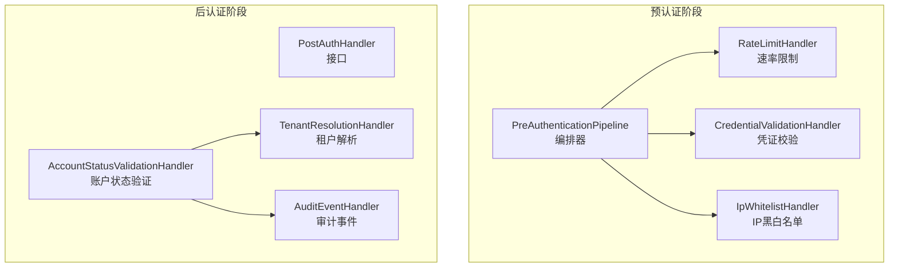
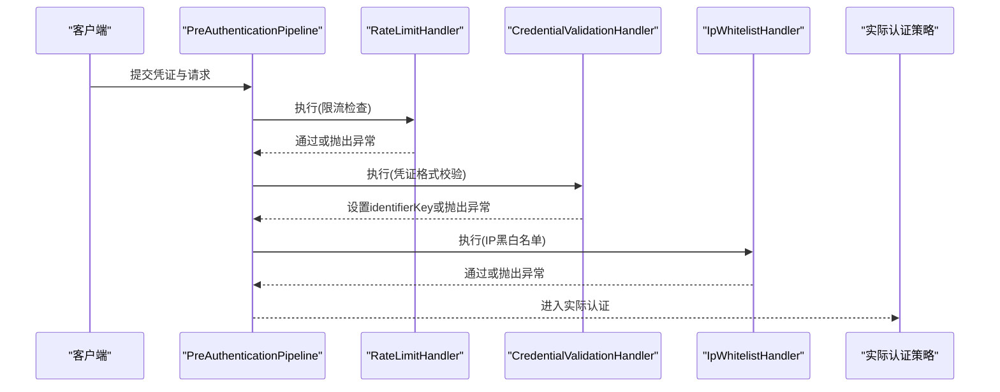
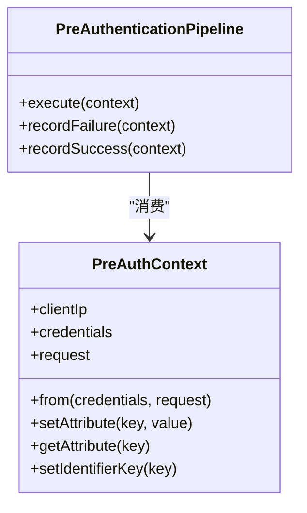
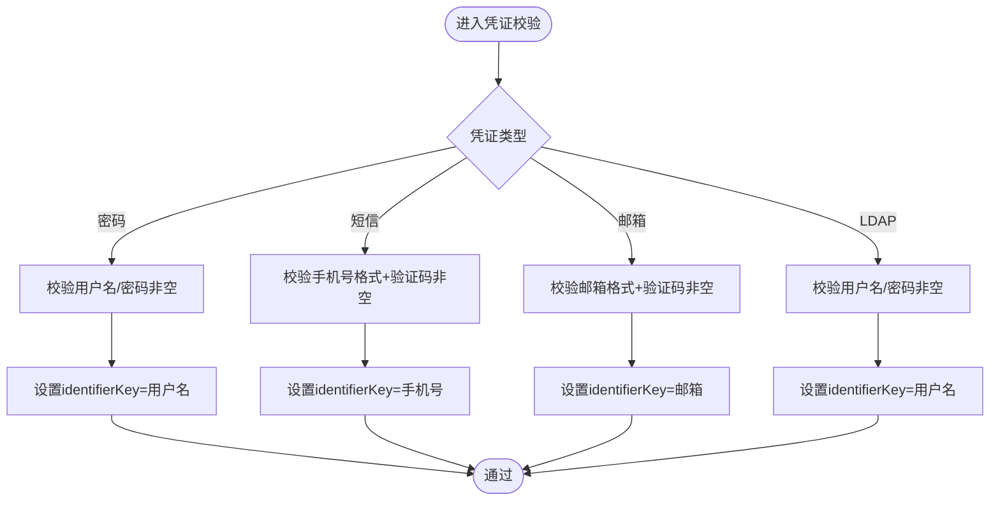
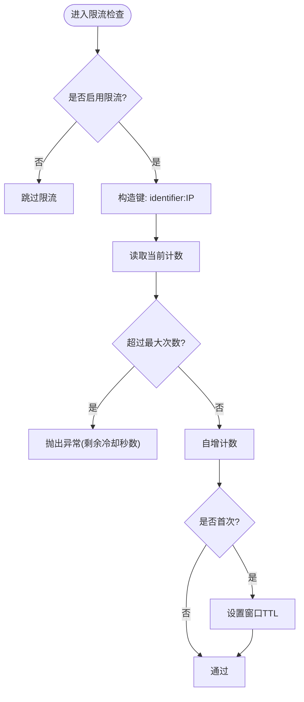
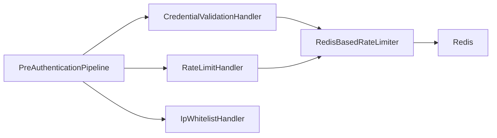

# 预认证管道

<cite>
**本文引用的文件**
- [PreAuthenticationPipeline.java](file://iam-auth-server/src/main/java/iam/platform/auth/application/service/pipeline/PreAuthenticationPipeline.java)
- [PreAuthContext.java](file://iam-auth-server/src/main/java/iam/platform/auth/application/service/pipeline/PreAuthContext.java)
- [PreAuthHandler.java](file://iam-auth-server/src/main/java/iam/platform/auth/application/service/pipeline/PreAuthHandler.java)
- [IpWhitelistHandler.java](file://iam-auth-server/src/main/java/iam/platform/auth/application/service/pipeline/IpWhitelistHandler.java)
- [RateLimitHandler.java](file://iam-auth-server/src/main/java/iam/platform/auth/application/service/pipeline/RateLimitHandler.java)
- [CredentialValidationHandler.java](file://iam-auth-server/src/main/java/iam/platform/auth/application/service/pipeline/CredentialValidationHandler.java)
- [PreAuthenticationException.java](file://iam-auth-server/src/main/java/iam/platform/auth/application/service/pipeline/PreAuthenticationException.java)
- [RedisBasedRateLimiter.java](file://iam-auth-server/src/main/java/iam/platform/auth/infrastructure/security/RedisBasedRateLimiter.java)
- [SecurityPolicyProperties.java](file://iam-auth-server/src/main/java/iam/platform/auth/infrastructure/config/SecurityPolicyProperties.java)
- [PostAuthHandler.java](file://iam-auth-server/src/main/java/iam/platform/auth/application/service/pipeline/PostAuthHandler.java)
- [PostAuthContext.java](file://iam-auth-server/src/main/java/iam/platform/auth/application/service/pipeline/PostAuthContext.java)
- [TenantResolutionHandler.java](file://iam-auth-server/src/main/java/iam/platform/auth/application/service/pipeline/TenantResolutionHandler.java)
- [AccountStatusValidationHandler.java](file://iam-auth-server/src/main/java/iam/platform/auth/application/service/pipeline/AccountStatusValidationHandler.java)
- [AuditEventHandler.java](file://iam-auth-server/src/main/java/iam/platform/auth/application/service/pipeline/AuditEventHandler.java)
</cite>

## 目录
1. [引言](#引言)
2. [项目结构](#项目结构)
3. [核心组件](#核心组件)
4. [架构总览](#架构总览)
5. [详细组件分析](#详细组件分析)
6. [依赖分析](#依赖分析)
7. [性能考虑](#性能考虑)
8. [故障排查指南](#故障排查指南)
9. [结论](#结论)
10. [附录](#附录)

## 引言
本文件系统性阐述 IAM 平台中的“预认证管道”设计与实现，覆盖执行顺序、上下文传递、各处理器职责（IP 白名单、速率限制、凭证校验、租户解析、账户状态验证、审计事件等）、异常处理与失败记录策略，并提供配置示例、实现指南与性能优化建议。目标是帮助开发者在不深入源码的情况下，也能正确理解并扩展该管道。

## 项目结构
预认证管道位于认证服务模块中，采用“处理器接口 + 多个具体处理器 + 管道编排器”的分层设计。处理器通过 Spring 的 Ordered 接口定义执行顺序，管道按顺序执行，遇到异常即中断并进行失败记录。

图表来源
- [PreAuthenticationPipeline.java:26-31](file://iam-auth-server/src/main/java/iam/platform/auth/application/service/pipeline/PreAuthenticationPipeline.java#L26-L31)
- [RateLimitHandler.java:18-21](file://iam-auth-server/src/main/java/iam/platform/auth/application/service/pipeline/RateLimitHandler.java#L18-L21)
- [CredentialValidationHandler.java:22-36](file://iam-auth-server/src/main/java/iam/platform/auth/application/service/pipeline/CredentialValidationHandler.java#L22-L36)
- [IpWhitelistHandler.java:23-46](file://iam-auth-server/src/main/java/iam/platform/auth/application/service/pipeline/IpWhitelistHandler.java#L23-L46)
- [PostAuthHandler.java:9-11](file://iam-auth-server/src/main/java/iam/platform/auth/application/service/pipeline/PostAuthHandler.java#L9-L11)

章节来源
- [PreAuthenticationPipeline.java:16-31](file://iam-auth-server/src/main/java/iam/platform/auth/application/service/pipeline/PreAuthenticationPipeline.java#L16-L31)
- [PreAuthHandler.java:9-17](file://iam-auth-server/src/main/java/iam/platform/auth/application/service/pipeline/PreAuthHandler.java#L9-L17)

## 核心组件
- 预认证上下文 PreAuthContext：承载凭证、请求、客户端 IP、可扩展属性以及用于限流的标识键。
- 后认证上下文 PostAuthContext：承载认证完成后的人员、方法、权限、租户选择状态等结果数据。
- 预认证处理器接口 PreAuthHandler：统一的处理契约，支持通过 getOrder() 控制执行顺序。
- 后认证处理器接口 PostAuthHandler：统一的处理契约，用于构建最终认证结果。
- 预认证管道 PreAuthenticationPipeline：负责按序执行处理器，并在失败时调用记录器进行失败/成功记录。
- 速率限制器 RedisBasedRateLimiter：基于 Redis 的滑动窗口计数器，支持失败记录与成功重置。
- 安全策略配置 SecurityPolicyProperties：集中管理速率限制、账户锁定、IP 黑白名单等策略参数。

章节来源
- [PreAuthContext.java:14-74](file://iam-auth-server/src/main/java/iam/platform/auth/application/service/pipeline/PreAuthContext.java#L14-L74)
- [PostAuthContext.java:20-70](file://iam-auth-server/src/main/java/iam/platform/auth/application/service/pipeline/PostAuthContext.java#L20-L70)
- [PreAuthHandler.java:9-17](file://iam-auth-server/src/main/java/iam/platform/auth/application/service/pipeline/PreAuthHandler.java#L9-L17)
- [PostAuthHandler.java:9-11](file://iam-auth-server/src/main/java/iam/platform/auth/application/service/pipeline/PostAuthHandler.java#L9-L11)
- [PreAuthenticationPipeline.java:16-59](file://iam-auth-server/src/main/java/iam/platform/auth/application/service/pipeline/PreAuthenticationPipeline.java#L16-L59)
- [RedisBasedRateLimiter.java:19-123](file://iam-auth-server/src/main/java/iam/platform/auth/infrastructure/security/RedisBasedRateLimiter.java#L19-L123)
- [SecurityPolicyProperties.java:16-36](file://iam-auth-server/src/main/java/iam/platform/auth/infrastructure/config/SecurityPolicyProperties.java#L16-L36)

## 架构总览
预认证管道在进入实际认证策略前执行一系列前置检查；后认证管道在认证完成后补充租户解析、权限加载、审计等步骤。两者共享“上下文对象 + 处理器 + 顺序控制”的通用模式。

图表来源
- [PreAuthenticationPipeline.java:26-31](file://iam-auth-server/src/main/java/iam/platform/auth/application/service/pipeline/PreAuthenticationPipeline.java#L26-L31)
- [RateLimitHandler.java:18-21](file://iam-auth-server/src/main/java/iam/platform/auth/application/service/pipeline/RateLimitHandler.java#L18-L21)
- [CredentialValidationHandler.java:22-36](file://iam-auth-server/src/main/java/iam/platform/auth/application/service/pipeline/CredentialValidationHandler.java#L22-L36)
- [IpWhitelistHandler.java:23-46](file://iam-auth-server/src/main/java/iam/platform/auth/application/service/pipeline/IpWhitelistHandler.java#L23-L46)

## 详细组件分析

### 预认证管道与上下文
- 上下文 PreAuthContext 负责：
  - 从请求提取客户端 IP（优先 X-Forwarded-For，其次 X-Real-IP，最后远端地址）。
  - 存储 AuthenticationCredentials、HttpServletRequest、可选 attributes。
  - 支持设置 identifierKey，供速率限制器使用。
- 管道 PreAuthenticationPipeline：
  - 按处理器顺序执行 handle()。
  - 对失败调用 recordFailure()，对成功调用 recordSuccess()，内部委托到对应处理器的记录方法。

图表来源
- [PreAuthContext.java:30-74](file://iam-auth-server/src/main/java/iam/platform/auth/application/service/pipeline/PreAuthContext.java#L30-L74)
- [PreAuthenticationPipeline.java:26-59](file://iam-auth-server/src/main/java/iam/platform/auth/application/service/pipeline/PreAuthenticationPipeline.java#L26-L59)

章节来源
- [PreAuthContext.java:14-74](file://iam-auth-server/src/main/java/iam/platform/auth/application/service/pipeline/PreAuthContext.java#L14-L74)
- [PreAuthenticationPipeline.java:16-59](file://iam-auth-server/src/main/java/iam/platform/auth/application/service/pipeline/PreAuthenticationPipeline.java#L16-L59)

### 凭证校验处理器（CredentialValidationHandler）
- 职责：对不同类型的凭证（密码、短信验证码、邮箱验证码、LDAP）进行格式校验，并设置 identifierKey 以支持后续限流。
- 执行顺序：第 30。
- 关键行为：
  - 密码凭证：用户名/密码必填。
  - 短信凭证：手机号格式校验（中国手机号），验证码必填。
  - 邮箱凭证：邮箱格式校验，验证码必填。
  - LDAP 凭证：用户名/密码必填。
- 异常：任一校验失败抛出 PreAuthenticationException。

图表来源
- [CredentialValidationHandler.java:22-96](file://iam-auth-server/src/main/java/iam/platform/auth/application/service/pipeline/CredentialValidationHandler.java#L22-L96)

章节来源
- [CredentialValidationHandler.java:14-96](file://iam-auth-server/src/main/java/iam/platform/auth/application/service/pipeline/CredentialValidationHandler.java#L14-L96)

### 速率限制处理器（RateLimitHandler）与 Redis 实现
- 职责：在预认证阶段检查并更新限流状态；在失败/成功时分别记录。
- 执行顺序：第 10。
- 限流逻辑（RedisBasedRateLimiter）：
  - 使用滑动窗口计数器，键格式为 auth:ratelimit:{identifier}:{clientIp}。
  - 首次访问设置 TTL；超过阈值抛出异常；成功则删除键清零。
  - Redis 不可用时“开窗放行”，保证可用性。
- 失败/成功记录：
  - 失败：自增计数并设置 TTL。
  - 成功：删除计数键。

图表来源
- [RedisBasedRateLimiter.java:32-67](file://iam-auth-server/src/main/java/iam/platform/auth/infrastructure/security/RedisBasedRateLimiter.java#L32-L67)
- [RateLimitHandler.java:18-40](file://iam-auth-server/src/main/java/iam/platform/auth/application/service/pipeline/RateLimitHandler.java#L18-L40)

章节来源
- [RateLimitHandler.java:14-41](file://iam-auth-server/src/main/java/iam/platform/auth/application/service/pipeline/RateLimitHandler.java#L14-L41)
- [RedisBasedRateLimiter.java:19-123](file://iam-auth-server/src/main/java/iam/platform/auth/infrastructure/security/RedisBasedRateLimiter.java#L19-L123)
- [SecurityPolicyProperties.java:24-28](file://iam-auth-server/src/main/java/iam/platform/auth/infrastructure/config/SecurityPolicyProperties.java#L24-L28)

### IP 白名单/黑名单处理器（IpWhitelistHandler）
- 职责：根据安全策略配置的 IP 黑/白名单决定是否允许认证。
- 执行顺序：第 40。
- 行为：
  - 若配置了黑名单且命中，则直接拒绝。
  - 若配置了白名单且未命中，则拒绝。
  - 支持 CIDR 表达式匹配。
- 异常：拒绝时抛出 PreAuthenticationException。

章节来源
- [IpWhitelistHandler.java:15-106](file://iam-auth-server/src/main/java/iam/platform/auth/application/service/pipeline/IpWhitelistHandler.java#L15-L106)
- [SecurityPolicyProperties.java:20-21](file://iam-auth-server/src/main/java/iam/platform/auth/infrastructure/config/SecurityPolicyProperties.java#L20-L21)

### 后认证阶段处理器（示意）
- 账户状态验证（AccountStatusValidationHandler）：在认证完成后校验人员状态。
- 租户解析（TenantResolutionHandler）：从请求头/参数提取租户编码，结合人员账户自动选择或要求选择。
- 审计事件（AuditEventHandler）：记录登录审计（预留与审计系统集成）。

章节来源
- [AccountStatusValidationHandler.java:13-26](file://iam-auth-server/src/main/java/iam/platform/auth/application/service/pipeline/AccountStatusValidationHandler.java#L13-L26)
- [TenantResolutionHandler.java:16-65](file://iam-auth-server/src/main/java/iam/platform/auth/application/service/pipeline/TenantResolutionHandler.java#L16-L65)
- [AuditEventHandler.java:15-41](file://iam-auth-server/src/main/java/iam/platform/auth/application/service/pipeline/AuditEventHandler.java#L15-L41)

## 依赖分析
- 处理器与顺序：
  - RateLimitHandler（10） → CredentialValidationHandler（30） → IpWhitelistHandler（40） → 其他后认证处理器。
- 处理器间耦合：
  - CredentialValidationHandler 通过 PreAuthContext 设置 identifierKey，供 RedisBasedRateLimiter 使用。
  - PreAuthenticationPipeline 在失败/成功时调用对应处理器的记录方法。
- 外部依赖：
  - Redis（StringRedisTemplate）用于限流计数与 TTL。
  - 安全策略配置（SecurityPolicyProperties）集中管理限流阈值、窗口、黑/白名单。

图表来源
- [PreAuthenticationPipeline.java:36-59](file://iam-auth-server/src/main/java/iam/platform/auth/application/service/pipeline/PreAuthenticationPipeline.java#L36-L59)
- [RateLimitHandler.java:16-40](file://iam-auth-server/src/main/java/iam/platform/auth/application/service/pipeline/RateLimitHandler.java#L16-L40)
- [RedisBasedRateLimiter.java:21-107](file://iam-auth-server/src/main/java/iam/platform/auth/infrastructure/security/RedisBasedRateLimiter.java#L21-L107)

章节来源
- [PreAuthenticationPipeline.java:18-59](file://iam-auth-server/src/main/java/iam/platform/auth/application/service/pipeline/PreAuthenticationPipeline.java#L18-L59)
- [RedisBasedRateLimiter.java:19-123](file://iam-auth-server/src/main/java/iam/platform/auth/infrastructure/security/RedisBasedRateLimiter.java#L19-L123)

## 性能考虑
- 限流实现：
  - 使用 Redis 计数器与 TTL，避免内存膨胀；首次访问设置窗口期，后续仅增量。
  - Redis 不可用时“开窗放行”，确保高可用；建议监控 Redis 可用性与延迟。
- IP 匹配：
  - CIDR 计算在命中时触发，建议控制列表规模与命中概率，必要时缓存匹配结果。
- 上下文传递：
  - PreAuthContext 与 PostAuthContext 仅作为可变载体，避免在处理器中做重型计算，保持轻量传递。
- 执行顺序：
  - 将最可能快速失败的检查（如 IP 黑名单）放在前面，减少后续昂贵操作的概率。

## 故障排查指南
- 常见异常类型：
  - PreAuthenticationException：预认证阶段任意处理器抛出的异常，会阻断流程并触发失败记录。
- 失败记录与成功重置：
  - 管道在失败时调用 recordFailure()，在成功时调用 recordSuccess()，由对应处理器实现具体逻辑。
  - 速率限制器在失败时自增计数并在首次访问设置 TTL；在成功时删除键。
- 排查步骤：
  - 检查安全策略配置（最大尝试次数、窗口秒数、黑/白名单）。
  - 检查 Redis 连接与可用性，确认键空间命名与 TTL 设置。
  - 查看处理器日志，定位最先抛出异常的处理器。
  - 验证客户端 IP 是否被正确提取（代理场景需确认 X-Forwarded-For/X-Real-IP）。

章节来源
- [PreAuthenticationException.java:8-17](file://iam-auth-server/src/main/java/iam/platform/auth/application/service/pipeline/PreAuthenticationException.java#L8-L17)
- [PreAuthenticationPipeline.java:36-59](file://iam-auth-server/src/main/java/iam/platform/auth/application/service/pipeline/PreAuthenticationPipeline.java#L36-L59)
- [RedisBasedRateLimiter.java:72-108](file://iam-auth-server/src/main/java/iam/platform/auth/infrastructure/security/RedisBasedRateLimiter.java#L72-L108)

## 结论
预认证管道通过“处理器 + 上下文 + 顺序控制”的模式，将安全与合规检查前置，既保证了系统的安全性，又具备良好的可扩展性。结合 Redis 限流与策略配置，可在不侵入主认证流程的前提下实现灵活的安全控制。建议在生产环境中配合完善的监控与告警体系，持续优化策略参数与处理器实现。

## 附录

### 管道配置示例（YAML）
- 速率限制
  - enabled: true
  - maxAttempts: 5
  - windowSeconds: 300
- 账户锁定（预留）
  - enabled: true
  - threshold: 10
  - lockoutDurationMinutes: 30
- IP 黑/白名单
  - ipBlacklist: []
  - ipWhitelist: []

章节来源
- [SecurityPolicyProperties.java:18-36](file://iam-auth-server/src/main/java/iam/platform/auth/infrastructure/config/SecurityPolicyProperties.java#L18-L36)

### 处理器实现指南
- 新增预认证处理器
  - 实现 PreAuthHandler 接口，重写 handle() 与 getOrder()。
  - 在 handle() 中读取 PreAuthContext，必要时设置 identifierKey。
  - 抛出 PreAuthenticationException 以中断流程并触发失败记录。
- 新增后认证处理器
  - 实现 PostAuthHandler 接口，重写 handle() 与 getOrder()。
  - 在 handle() 中读取 PostAuthContext，逐步构建最终结果。
- 注意事项
  - 顺序至关重要：越靠前的处理器越应快速失败。
  - 上下文属性仅用于处理器间传递，避免在处理器中做重型计算。
  - 异常应语义清晰，便于前端与审计系统识别。

章节来源
- [PreAuthHandler.java:9-17](file://iam-auth-server/src/main/java/iam/platform/auth/application/service/pipeline/PreAuthHandler.java#L9-L17)
- [PostAuthHandler.java:9-11](file://iam-auth-server/src/main/java/iam/platform/auth/application/service/pipeline/PostAuthHandler.java#L9-L11)
- [PreAuthContext.java:38-55](file://iam-auth-server/src/main/java/iam/platform/auth/application/service/pipeline/PreAuthContext.java#L38-L55)
- [PostAuthContext.java:37-59](file://iam-auth-server/src/main/java/iam/platform/auth/application/service/pipeline/PostAuthContext.java#L37-L59)

### 实际代码示例（路径指引）
- 速率限制器实现：[RedisBasedRateLimiter.java:32-108](file://iam-auth-server/src/main/java/iam/platform/auth/infrastructure/security/RedisBasedRateLimiter.java#L32-L108)
- 预认证管道编排：[PreAuthenticationPipeline.java:26-59](file://iam-auth-server/src/main/java/iam/platform/auth/application/service/pipeline/PreAuthenticationPipeline.java#L26-L59)
- 凭证校验处理器：[CredentialValidationHandler.java:22-96](file://iam-auth-server/src/main/java/iam/platform/auth/application/service/pipeline/CredentialValidationHandler.java#L22-L96)
- IP 白名单处理器：[IpWhitelistHandler.java:23-100](file://iam-auth-server/src/main/java/iam/platform/auth/application/service/pipeline/IpWhitelistHandler.java#L23-L100)
- 后认证上下文构建：[PostAuthContext.java:64-69](file://iam-auth-server/src/main/java/iam/platform/auth/application/service/pipeline/PostAuthContext.java#L64-L69)