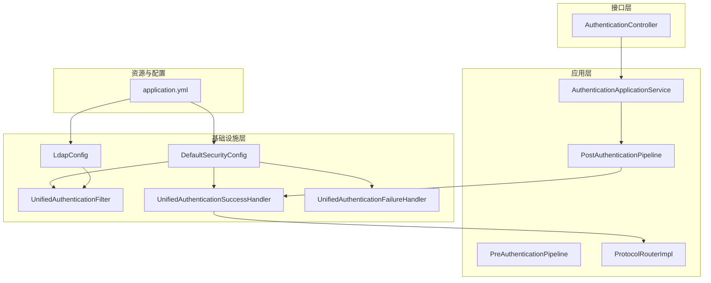
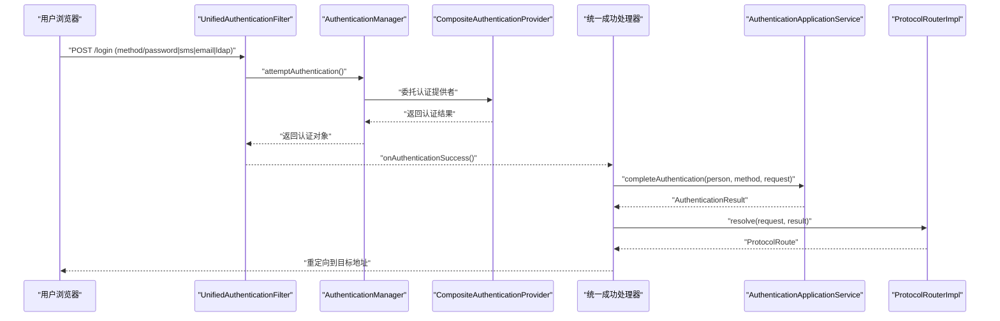
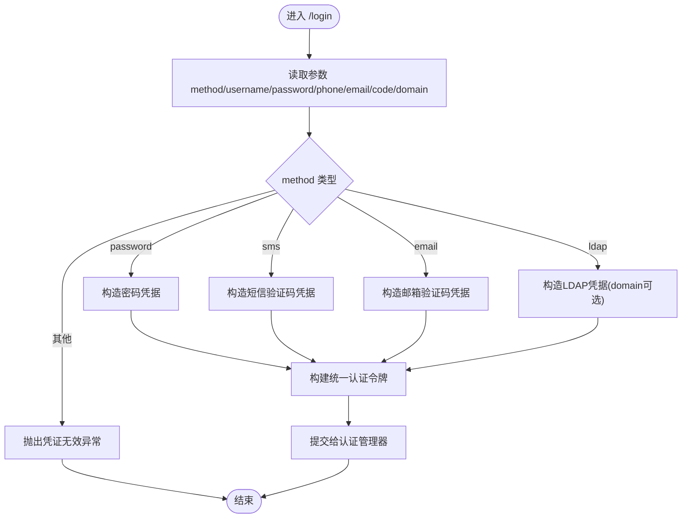
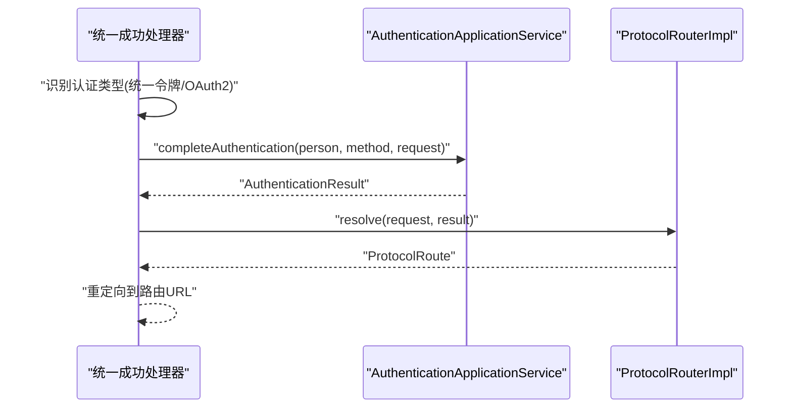
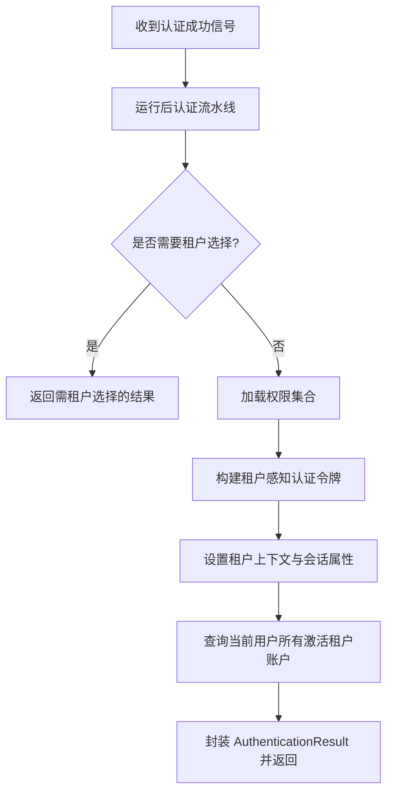
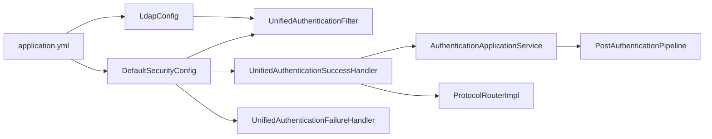

# 认证服务器（iam-auth-server）

<cite>
**本文引用的文件**
- [SsoAuthServerApplication.java](file://iam-auth-server/src/main/java/iam/platform/auth/SsoAuthServerApplication.java)
- [AuthenticationController.java](file://iam-auth-server/src/main/java/iam/platform/auth/interfaces/rest/AuthenticationController.java)
- [AuthenticationApplicationService.java](file://iam-auth-server/src/main/java/iam/platform/auth/application/service/AuthenticationApplicationService.java)
- [PreAuthenticationPipeline.java](file://iam-auth-server/src/main/java/iam/platform/auth/application/service/pipeline/PreAuthenticationPipeline.java)
- [PostAuthenticationPipeline.java](file://iam-auth-server/src/main/java/iam/platform/auth/application/service/pipeline/PostAuthenticationPipeline.java)
- [ProtocolRouterImpl.java](file://iam-auth-server/src/main/java/iam/platform/auth/application/service/routing/ProtocolRouterImpl.java)
- [UnifiedAuthenticationFilter.java](file://iam-auth-server/src/main/java/iam/platform/auth/infrastructure/security/UnifiedAuthenticationFilter.java)
- [UnifiedAuthenticationSuccessHandler.java](file://iam-auth-server/src/main/java/iam/platform/auth/infrastructure/security/UnifiedAuthenticationSuccessHandler.java)
- [UnifiedAuthenticationFailureHandler.java](file://iam-auth-server/src/main/java/iam/platform/auth/infrastructure/security/UnifiedAuthenticationFailureHandler.java)
- [DefaultSecurityConfig.java](file://iam-auth-server/src/main/java/iam/platform/auth/infrastructure/config/DefaultSecurityConfig.java)
- [LdapConfig.java](file://iam-auth-server/src/main/java/iam/platform/auth/infrastructure/config/LdapConfig.java)
- [application.yml](file://iam-auth-server/src/main/resources/application.yml)
- [AuthenticationResult.java](file://iam-auth-server/src/main/java/iam/platform/auth/domain/model/valueobject/AuthenticationResult.java)
</cite>

## 目录
1. [简介](#简介)
2. [项目结构](#项目结构)
3. [核心组件](#核心组件)
4. [架构总览](#架构总览)
5. [详细组件分析](#详细组件分析)
6. [依赖分析](#依赖分析)
7. [性能考虑](#性能考虑)
8. [故障排查指南](#故障排查指南)
9. [结论](#结论)
10. [附录](#附录)

## 简介
本文件为认证服务器（iam-auth-server）的详细技术文档，聚焦于以下目标：
- 深入解释 OAuth2/OIDC 协议实现、SAML/CAS 单点登录支持、LDAP 集成机制
- 详述认证管道设计，包括预认证与后认证处理流程
- 文档化多种认证策略：密码认证、短信验证码、邮箱验证码、第三方 OAuth2 集成
- 阐述安全配置、令牌管理、会话控制等核心能力
- 提供认证端点的 API 规范、错误处理机制与性能优化策略
- 给出示例路径以展示如何扩展新的认证方式与自定义认证逻辑
- 说明与其它模块的集成方式与数据流转过程

## 项目结构
认证服务器采用分层架构与模块化组织，主要分为应用层、领域层、基础设施层与接口层，并通过 Spring Boot 启动入口统一装配。

图表来源
- [SsoAuthServerApplication.java:1-19](file://iam-auth-server/src/main/java/iam/platform/auth/SsoAuthServerApplication.java#L1-L19)
- [DefaultSecurityConfig.java:1-95](file://iam-auth-server/src/main/java/iam/platform/auth/infrastructure/config/DefaultSecurityConfig.java#L1-L95)
- [LdapConfig.java:1-39](file://iam-auth-server/src/main/java/iam/platform/auth/infrastructure/config/LdapConfig.java#L1-L39)
- [UnifiedAuthenticationFilter.java:1-80](file://iam-auth-server/src/main/java/iam/platform/auth/infrastructure/security/UnifiedAuthenticationFilter.java#L1-L80)
- [UnifiedAuthenticationSuccessHandler.java:1-68](file://iam-auth-server/src/main/java/iam/platform/auth/infrastructure/security/UnifiedAuthenticationSuccessHandler.java#L1-L68)
- [UnifiedAuthenticationFailureHandler.java:1-37](file://iam-auth-server/src/main/java/iam/platform/auth/infrastructure/security/UnifiedAuthenticationFailureHandler.java#L1-L37)
- [AuthenticationApplicationService.java:1-139](file://iam-auth-server/src/main/java/iam/platform/auth/application/service/AuthenticationApplicationService.java#L1-L139)
- [PreAuthenticationPipeline.java:1-61](file://iam-auth-server/src/main/java/iam/platform/auth/application/service/pipeline/PreAuthenticationPipeline.java#L1-L61)
- [PostAuthenticationPipeline.java:1-31](file://iam-auth-server/src/main/java/iam/platform/auth/application/service/pipeline/PostAuthenticationPipeline.java#L1-L31)
- [ProtocolRouterImpl.java:1-52](file://iam-auth-server/src/main/java/iam/platform/auth/application/service/routing/ProtocolRouterImpl.java#L1-L52)
- [AuthenticationController.java:1-47](file://iam-auth-server/src/main/java/iam/platform/auth/interfaces/rest/AuthenticationController.java#L1-L47)
- [application.yml:1-144](file://iam-auth-server/src/main/resources/application.yml#L1-L144)

章节来源
- [SsoAuthServerApplication.java:1-19](file://iam-auth-server/src/main/java/iam/platform/auth/SsoAuthServerApplication.java#L1-L19)
- [application.yml:1-144](file://iam-auth-server/src/main/resources/application.yml#L1-L144)

## 核心组件
- 应用服务：统一完成认证收尾与租户上下文建立，负责权限加载与结果封装
- 预认证流水线：在策略执行前进行统一检查（速率限制、账户锁定、IP 白名单、审计等）
- 后认证流水线：在认证完成后执行统一处理（会话写入、审计事件、路由决策等）
- 协议路由器：根据来源请求与认证结果决定重定向目标（租户选择、CAS/OIDC 回调等）
- 安全过滤器链：统一入口 /login 处理密码、短信、邮箱、LDAP 等多策略认证；OAuth2 登录由 Spring Security 自动接管
- LDAP 配置：提供企业 AD 目录认证能力
- 配置中心：集中管理数据库、Redis、OAuth2 客户端、安全策略、CAS、LDAP 等参数

章节来源
- [AuthenticationApplicationService.java:1-139](file://iam-auth-server/src/main/java/iam/platform/auth/application/service/AuthenticationApplicationService.java#L1-L139)
- [PreAuthenticationPipeline.java:1-61](file://iam-auth-server/src/main/java/iam/platform/auth/application/service/pipeline/PreAuthenticationPipeline.java#L1-L61)
- [PostAuthenticationPipeline.java:1-31](file://iam-auth-server/src/main/java/iam/platform/auth/application/service/pipeline/PostAuthenticationPipeline.java#L1-L31)
- [ProtocolRouterImpl.java:1-52](file://iam-auth-server/src/main/java/iam/platform/auth/application/service/routing/ProtocolRouterImpl.java#L1-L52)
- [DefaultSecurityConfig.java:1-95](file://iam-auth-server/src/main/java/iam/platform/auth/infrastructure/config/DefaultSecurityConfig.java#L1-L95)
- [LdapConfig.java:1-39](file://iam-auth-server/src/main/java/iam/platform/auth/infrastructure/config/LdapConfig.java#L1-L39)
- [application.yml:1-144](file://iam-auth-server/src/main/resources/application.yml#L1-L144)

## 架构总览
认证服务器通过统一过滤器接收所有第一方认证请求，OAuth2 社交登录由 Spring Security 的 oauth2Login 自动处理。认证成功后，统一汇聚到统一成功处理器，运行后认证流水线并交由协议路由器决定最终跳转地址。

图表来源
- [DefaultSecurityConfig.java:35-63](file://iam-auth-server/src/main/java/iam/platform/auth/infrastructure/config/DefaultSecurityConfig.java#L35-L63)
- [UnifiedAuthenticationFilter.java:31-38](file://iam-auth-server/src/main/java/iam/platform/auth/infrastructure/security/UnifiedAuthenticationFilter.java#L31-L38)
- [UnifiedAuthenticationSuccessHandler.java:35-66](file://iam-auth-server/src/main/java/iam/platform/auth/infrastructure/security/UnifiedAuthenticationSuccessHandler.java#L35-L66)
- [AuthenticationApplicationService.java:42-45](file://iam-auth-server/src/main/java/iam/platform/auth/application/service/AuthenticationApplicationService.java#L42-L45)
- [ProtocolRouterImpl.java:24-50](file://iam-auth-server/src/main/java/iam/platform/auth/application/service/routing/ProtocolRouterImpl.java#L24-L50)

## 详细组件分析

### 统一认证过滤器（UnifiedAuthenticationFilter）
- 职责：统一入口处理密码、短信、邮箱、LDAP 等第一方认证方法
- 行为：从表单解析 method 字段与对应凭据，封装为统一认证令牌并交由认证管理器处理
- 错误处理：缺失必填参数时抛出凭证无效异常

图表来源
- [UnifiedAuthenticationFilter.java:43-62](file://iam-auth-server/src/main/java/iam/platform/auth/infrastructure/security/UnifiedAuthenticationFilter.java#L43-L62)

章节来源
- [UnifiedAuthenticationFilter.java:1-80](file://iam-auth-server/src/main/java/iam/platform/auth/infrastructure/security/UnifiedAuthenticationFilter.java#L1-L80)

### 统一成功处理器（UnifiedAuthenticationSuccessHandler）
- 职责：汇聚所有认证成功路径（第一方与 OAuth2），运行后认证流水线并决定最终跳转
- 行为：识别统一令牌或 OAuth2 令牌，提取人员与认证方式，调用应用服务完成认证收尾，交由协议路由器决定路由

图表来源
- [UnifiedAuthenticationSuccessHandler.java:35-66](file://iam-auth-server/src/main/java/iam/platform/auth/infrastructure/security/UnifiedAuthenticationSuccessHandler.java#L35-L66)
- [AuthenticationApplicationService.java:42-45](file://iam-auth-server/src/main/java/iam/platform/auth/application/service/AuthenticationApplicationService.java#L42-L45)
- [ProtocolRouterImpl.java:24-50](file://iam-auth-server/src/main/java/iam/platform/auth/application/service/routing/ProtocolRouterImpl.java#L24-L50)

章节来源
- [UnifiedAuthenticationSuccessHandler.java:1-68](file://iam-auth-server/src/main/java/iam/platform/auth/infrastructure/security/UnifiedAuthenticationSuccessHandler.java#L1-L68)

### 统一失败处理器（UnifiedAuthenticationFailureHandler）
- 职责：统一处理认证失败，重定向至带错误参数的登录页
- 行为：默认转发到 /login?error，异常兜底时回退重定向

章节来源
- [UnifiedAuthenticationFailureHandler.java:1-37](file://iam-auth-server/src/main/java/iam/platform/auth/infrastructure/security/UnifiedAuthenticationFailureHandler.java#L1-L37)

### 应用服务：认证收尾与租户选择（AuthenticationApplicationService）
- 职责：完成认证收尾（运行后认证流水线）、选择租户账户、建立租户上下文、加载权限并封装结果
- 行为：selectTenant 将当前用户绑定到指定租户账户，更新上下文与会话，返回包含已激活租户账户列表的结果

图表来源
- [AuthenticationApplicationService.java:42-111](file://iam-auth-server/src/main/java/iam/platform/auth/application/service/AuthenticationApplicationService.java#L42-L111)

章节来源
- [AuthenticationApplicationService.java:1-139](file://iam-auth-server/src/main/java/iam/platform/auth/application/service/AuthenticationApplicationService.java#L1-L139)

### 预认证流水线（PreAuthenticationPipeline）
- 职责：在认证策略执行前统一执行一系列检查与记录（速率限制、账户锁定、审计、IP 白名单等）
- 行为：顺序执行各处理器；失败时记录失败，成功时记录成功

章节来源
- [PreAuthenticationPipeline.java:1-61](file://iam-auth-server/src/main/java/iam/platform/auth/application/service/pipeline/PreAuthenticationPipeline.java#L1-L61)

### 后认证流水线（PostAuthenticationPipeline）
- 职责：认证成功后的统一处理（会话写入、审计事件、路由决策等）
- 行为：按顺序执行处理器并将上下文转换为最终结果

章节来源
- [PostAuthenticationPipeline.java:1-31](file://iam-auth-server/src/main/java/iam/platform/auth/application/service/pipeline/PostAuthenticationPipeline.java#L1-L31)

### 协议路由器（ProtocolRouterImpl）
- 职责：根据保存的来源请求与认证结果决定跳转目标（租户选择、CAS/OIDC 回调、默认重定向）
- 行为：若需租户选择则路由至租户选择页面；否则匹配适配器（SAML/CAS/OIDC 等）并生成路由

章节来源
- [ProtocolRouterImpl.java:1-52](file://iam-auth-server/src/main/java/iam/platform/auth/application/service/routing/ProtocolRouterImpl.java#L1-L52)

### 安全配置（DefaultSecurityConfig）
- 职责：装配统一认证过滤器、OAuth2 登录、登出、密码编码器与认证管理器
- 行为：禁用默认表单登录，启用统一过滤器；配置 OAuth2 登录页与用户信息服务；添加租户感知过滤器

章节来源
- [DefaultSecurityConfig.java:1-95](file://iam-auth-server/src/main/java/iam/platform/auth/infrastructure/config/DefaultSecurityConfig.java#L1-L95)

### LDAP 配置（LdapConfig）
- 职责：提供 LDAP 上下文源与模板 Bean，支持连接池与基础 DN、绑定信息配置
- 行为：基于 application.yml 中的 LDAP 参数动态装配

章节来源
- [LdapConfig.java:1-39](file://iam-auth-server/src/main/java/iam/platform/auth/infrastructure/config/LdapConfig.java#L1-L39)

### 认证结果值对象（AuthenticationResult）
- 职责：不可变值对象，承载认证结果（人员、方式、选中租户、可用租户、权限、是否需租户选择、时间戳）
- 行为：提供多种静态工厂方法用于不同场景的结果构造

章节来源
- [AuthenticationResult.java:1-56](file://iam-auth-server/src/main/java/iam/platform/auth/domain/model/valueobject/AuthenticationResult.java#L1-L56)

### REST 控制器占位（AuthenticationController）
- 职责：保留内部服务直连认证的占位控制器；标准 OAuth2 密码模式请使用 /oauth2/token
- 行为：日志提示与标准端点说明

章节来源
- [AuthenticationController.java:1-47](file://iam-auth-server/src/main/java/iam/platform/auth/interfaces/rest/AuthenticationController.java#L1-L47)

## 依赖分析
- 组件内聚与耦合
  - 统一成功处理器依赖应用服务与协议路由器，体现“成功收敛”职责
  - 过滤器链与安全配置强耦合，确保统一入口与 OAuth2 登录协同工作
  - LDAP 配置独立注入，便于按需启用
- 外部依赖
  - 数据库：PostgreSQL（JPA/Hibernate）
  - 缓存：Redis（会话存储、速率限制、账户锁定状态）
  - OAuth2 客户端：DingTalk 示例
  - SSL：PKCS12 证书
- 可能的循环依赖
  - 当前结构通过应用服务与路由器解耦，未见循环依赖迹象

图表来源
- [DefaultSecurityConfig.java:35-63](file://iam-auth-server/src/main/java/iam/platform/auth/infrastructure/config/DefaultSecurityConfig.java#L35-L63)
- [UnifiedAuthenticationFilter.java:18-38](file://iam-auth-server/src/main/java/iam/platform/auth/infrastructure/security/UnifiedAuthenticationFilter.java#L18-L38)
- [UnifiedAuthenticationSuccessHandler.java:27-31](file://iam-auth-server/src/main/java/iam/platform/auth/infrastructure/security/UnifiedAuthenticationSuccessHandler.java#L27-L31)
- [AuthenticationApplicationService.java:32-45](file://iam-auth-server/src/main/java/iam/platform/auth/application/service/AuthenticationApplicationService.java#L32-L45)
- [PostAuthenticationPipeline.java:18-29](file://iam-auth-server/src/main/java/iam/platform/auth/application/service/pipeline/PostAuthenticationPipeline.java#L18-L29)
- [ProtocolRouterImpl.java:20-50](file://iam-auth-server/src/main/java/iam/platform/auth/application/service/routing/ProtocolRouterImpl.java#L20-L50)
- [LdapConfig.java:12-38](file://iam-auth-server/src/main/java/iam/platform/auth/infrastructure/config/LdapConfig.java#L12-L38)
- [application.yml:104-127](file://iam-auth-server/src/main/resources/application.yml#L104-L127)

章节来源
- [DefaultSecurityConfig.java:1-95](file://iam-auth-server/src/main/java/iam/platform/auth/infrastructure/config/DefaultSecurityConfig.java#L1-L95)
- [application.yml:1-144](file://iam-auth-server/src/main/resources/application.yml#L1-L144)

## 性能考虑
- 连接池与超时
  - 数据库连接池最大 10，空闲与生命周期参数合理，适合中低并发场景
- 会话与缓存
  - 使用 Redis 存储会话，降低内存占用与水平扩展难度
- 速率限制与账户锁定
  - 默认开启，阈值与窗口可配置，建议结合业务调整
- 加密与 SSL
  - 使用 BCrypt 密码编码器；SSL 开关与证书路径可配置，生产环境务必启用
- 日志与监控
  - Jackson 时间格式与时区固定；Prometheus 暴露指标，便于观测

章节来源
- [application.yml:15-39](file://iam-auth-server/src/main/resources/application.yml#L15-L39)
- [application.yml:90-102](file://iam-auth-server/src/main/resources/application.yml#L90-L102)
- [DefaultSecurityConfig.java:90-94](file://iam-auth-server/src/main/java/iam/platform/auth/infrastructure/config/DefaultSecurityConfig.java#L90-L94)

## 故障排查指南
- 认证失败重定向
  - 统一失败处理器默认重定向到 /login?error，若重定向失败会记录错误日志
- 凭证参数缺失
  - 统一过滤器对必填参数进行校验，缺失时抛出凭证无效异常
- 租户上下文不一致
  - 选择租户时会校验归属与状态，不一致或非激活会抛出异常
- OAuth2 登录问题
  - 确认客户端注册与提供商配置正确，回调地址与作用域符合要求

章节来源
- [UnifiedAuthenticationFailureHandler.java:13-35](file://iam-auth-server/src/main/java/iam/platform/auth/infrastructure/security/UnifiedAuthenticationFailureHandler.java#L13-L35)
- [UnifiedAuthenticationFilter.java:64-71](file://iam-auth-server/src/main/java/iam/platform/auth/infrastructure/security/UnifiedAuthenticationFilter.java#L64-L71)
- [AuthenticationApplicationService.java:51-75](file://iam-auth-server/src/main/java/iam/platform/auth/application/service/AuthenticationApplicationService.java#L51-L75)

## 结论
认证服务器通过统一过滤器与处理器实现了“多策略合一”的认证体验，结合预/后认证流水线与协议路由器，形成清晰的认证管道。OAuth2、CAS、SAML 与 LDAP 等能力通过配置与适配器扩展，具备良好的可演进性。建议在生产环境中完善 SSL、速率限制与审计策略，并持续评估数据库与缓存容量。

## 附录

### 认证端点与 API 规范
- 统一登录入口
  - 方法：POST
  - 路径：/login
  - 参数：
    - method：password | sms | email | ldap
    - username/password：密码认证
    - phone/code：短信验证码
    - email/code：邮箱验证码
    - username/password + domain：LDAP
  - 成功：重定向至协议路由器决定的目标
  - 失败：重定向至 /login?error

- OAuth2 密码模式（标准端点）
  - 方法：POST
  - 路径：/oauth2/token
  - 内容类型：application/x-www-form-urlencoded
  - 参数：grant_type=password、username、password、client_id、client_secret
  - 行为：由 Spring Authorization Server 自动处理，验证客户端与用户，运行预/后认证流水线，签发 JWT

- 验证码登录（示例）
  - 路径：/auth/code/**
  - 行为：验证码登录相关端点（具体由验证码服务实现）

章节来源
- [AuthenticationController.java:7-38](file://iam-auth-server/src/main/java/iam/platform/auth/interfaces/rest/AuthenticationController.java#L7-L38)
- [DefaultSecurityConfig.java:39-51](file://iam-auth-server/src/main/java/iam/platform/auth/infrastructure/config/DefaultSecurityConfig.java#L39-L51)

### 扩展新认证方式与自定义逻辑示例（路径指引）
- 新增认证策略提供者
  - 实现认证提供者接口并在 Spring 容器中注册 Bean
  - 在统一过滤器中支持新的 method 值并解析对应凭据
  - 参考路径：
    - [UnifiedAuthenticationFilter.java:43-62](file://iam-auth-server/src/main/java/iam/platform/auth/infrastructure/security/UnifiedAuthenticationFilter.java#L43-L62)

- 自定义预/后认证处理器
  - 实现 PreAuthHandler 或 PostAuthHandler 接口并声明为 Spring Bean
  - 预认证流水线与后认证流水线将自动发现并执行
  - 参考路径：
    - [PreAuthenticationPipeline.java:18-31](file://iam-auth-server/src/main/java/iam/platform/auth/application/service/pipeline/PreAuthenticationPipeline.java#L18-L31)
    - [PostAuthenticationPipeline.java:20-29](file://iam-auth-server/src/main/java/iam/platform/auth/application/service/pipeline/PostAuthenticationPipeline.java#L20-L29)

- 自定义协议适配器
  - 实现 ProtocolAdapter 接口并声明为 Spring Bean
  - 协议路由器将自动匹配并路由
  - 参考路径：
    - [ProtocolRouterImpl.java:40-45](file://iam-auth-server/src/main/java/iam/platform/auth/application/service/routing/ProtocolRouterImpl.java#L40-L45)

- 自定义 LDAP 用户查找
  - 在 LDAP 配置基础上扩展用户查找逻辑（如自定义搜索过滤器）
  - 参考路径：
    - [LdapConfig.java:20-37](file://iam-auth-server/src/main/java/iam/platform/auth/infrastructure/config/LdapConfig.java#L20-L37)

### 与其它模块的集成与数据流
- 与 BFF/网关集成
  - BFF 层负责前端交互与引导式认证；网关负责路由与鉴权转换
- 与管理员后台集成
  - 管理员后台通过 Feign 客户端访问认证服务与授权服务，进行审计与会话管理
- 与外部系统集成
  - OAuth2 客户端注册与提供商配置集中于配置文件；CAS 与 SAML 通过协议适配器接入

章节来源
- [application.yml:54-80](file://iam-auth-server/src/main/resources/application.yml#L54-L80)
- [application.yml:115-127](file://iam-auth-server/src/main/resources/application.yml#L115-L127)