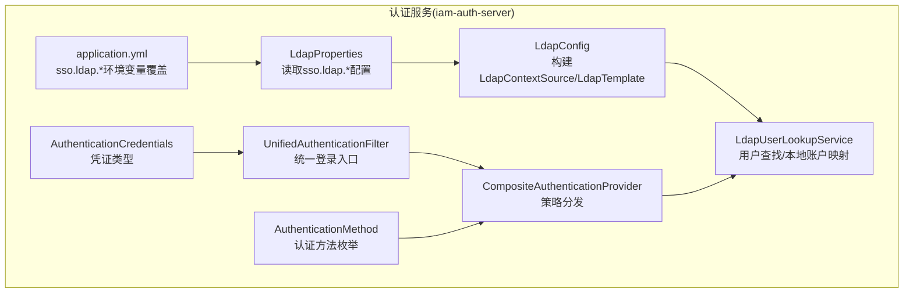
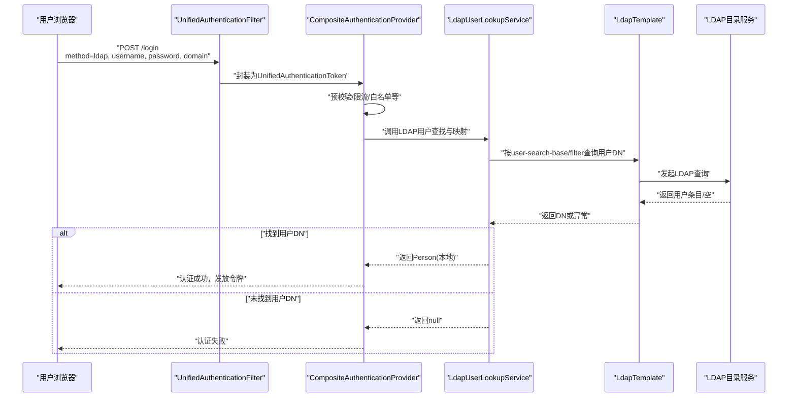
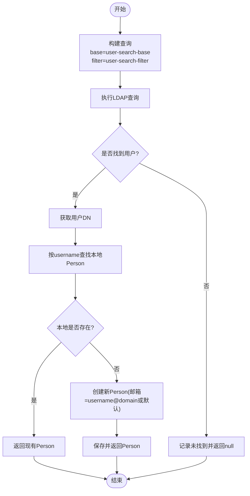
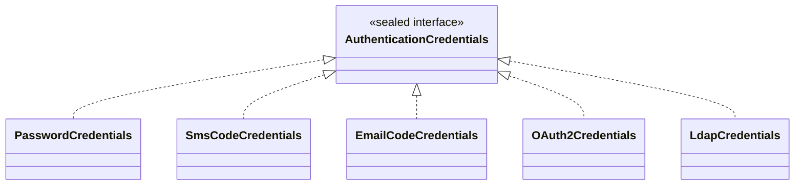
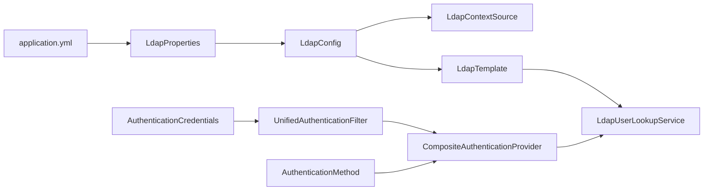

# LDAP认证策略

<cite>
**本文引用的文件**
- [LdapConfig.java](file://iam-auth-server/src/main/java/iam/platform/auth/infrastructure/config/LdapConfig.java)
- [LdapProperties.java](file://iam-auth-server/src/main/java/iam/platform/auth/infrastructure/config/LdapProperties.java)
- [application.yml](file://iam-auth-server/src/main/resources/application.yml)
- [LdapUserLookupService.java](file://iam-auth-server/src/main/java/iam/platform/auth/application/service/LdapUserLookupService.java)
- [UnifiedAuthenticationFilter.java](file://iam-auth-server/src/main/java/iam/platform/auth/interfaces/web/filter/UnifiedAuthenticationFilter.java)
- [CompositeAuthenticationProvider.java](file://iam-auth-server/src/main/java/iam/platform/auth/application/service/CompositeAuthenticationProvider.java)
- [AuthenticationCredentials.java](file://iam-auth-server/src/main/java/iam/platform/auth/domain/model/valueobject/AuthenticationCredentials.java)
- [AuthenticationMethod.java](file://iam-auth-server/src/main/java/iam/platform/auth/domain/model/enums/AuthenticationMethod.java)
</cite>

## 目录
1. [简介](#简介)
2. [项目结构](#项目结构)
3. [核心组件](#核心组件)
4. [架构总览](#架构总览)
5. [详细组件分析](#详细组件分析)
6. [依赖分析](#依赖分析)
7. [性能考虑](#性能考虑)
8. [故障排查指南](#故障排查指南)
9. [结论](#结论)
10. [附录](#附录)

## 简介
本文件系统性阐述IAM平台中与企业LDAP/AD目录服务集成的认证策略与实现细节，覆盖LDAP连接配置、用户绑定验证、用户查找与本地账户映射、查询策略与属性映射、安全机制（SSL/TLS、匿名绑定限制、超时配置）、性能优化（连接池管理）以及故障转移建议。文档以代码为依据，结合架构图与流程图，帮助开发者与运维人员快速完成企业级LDAP对接。

## 项目结构
LDAP认证在认证服务模块中通过Spring LDAP进行集成，主要涉及以下层次：
- 配置层：读取应用配置并构建LDAP上下文与模板
- 应用服务层：执行LDAP用户查找与本地Person实体映射
- 安全过滤与适配层：统一入口解析多方法认证，分发到具体策略
- 枚举与值对象：定义认证方法与凭证类型

图表来源
- [LdapConfig.java:1-39](file://iam-auth-server/src/main/java/iam/platform/auth/infrastructure/config/LdapConfig.java#L1-L39)
- [LdapProperties.java:1-34](file://iam-auth-server/src/main/java/iam/platform/auth/infrastructure/config/LdapProperties.java#L1-L34)
- [application.yml:104-114](file://iam-auth-server/src/main/resources/application.yml#L104-L114)
- [LdapUserLookupService.java:1-87](file://iam-auth-server/src/main/java/iam/platform/auth/application/service/LdapUserLookupService.java#L1-L87)
- [UnifiedAuthenticationFilter.java:1-80](file://iam-auth-server/src/main/java/iam/platform/auth/interfaces/web/filter/UnifiedAuthenticationFilter.java#L1-L80)
- [CompositeAuthenticationProvider.java:1-75](file://iam-auth-server/src/main/java/iam/platform/auth/application/service/CompositeAuthenticationProvider.java#L1-L75)
- [AuthenticationCredentials.java:1-59](file://iam-auth-server/src/main/java/iam/platform/auth/domain/model/valueobject/AuthenticationCredentials.java#L1-L59)
- [AuthenticationMethod.java:1-9](file://iam-auth-server/src/main/java/iam/platform/auth/domain/model/enums/AuthenticationMethod.java#L1-L9)

章节来源
- [LdapConfig.java:1-39](file://iam-auth-server/src/main/java/iam/platform/auth/infrastructure/config/LdapConfig.java#L1-L39)
- [LdapProperties.java:1-34](file://iam-auth-server/src/main/java/iam/platform/auth/infrastructure/config/LdapProperties.java#L1-L34)
- [application.yml:104-114](file://iam-auth-server/src/main/resources/application.yml#L104-L114)

## 核心组件
- LDAP配置与上下文
  - 通过LdapConfig装配LdapContextSource与LdapTemplate，读取LdapProperties中的URL、BaseDN、BindDN、BindPassword，并启用连接池（当pool.maxActive>0时）
  - LdapProperties提供默认值与可由环境变量覆盖的配置项，包括urls、base-dn、bind-dn、bind-password、user-search-base、user-search-filter、use-ssl、connect-timeout、read-timeout、pool.maxActive、pool.maxIdle
- 用户查找与本地映射
  - LdapUserLookupService基于user-search-base与user-search-filter在LDAP中定位用户DN；若未找到则返回null；支持按用户名查找并创建或复用本地Person实体
- 统一认证入口与策略分发
  - UnifiedAuthenticationFilter从表单提取method参数，构造对应AuthenticationCredentials（含LDAP凭证），交由CompositeAuthenticationProvider处理
  - CompositeAuthenticationProvider根据凭证类型选择匹配的AuthenticationStrategy执行认证，并记录成功/失败事件

章节来源
- [LdapConfig.java:20-37](file://iam-auth-server/src/main/java/iam/platform/auth/infrastructure/config/LdapConfig.java#L20-L37)
- [LdapProperties.java:15-32](file://iam-auth-server/src/main/java/iam/platform/auth/infrastructure/config/LdapProperties.java#L15-L32)
- [LdapUserLookupService.java:31-58](file://iam-auth-server/src/main/java/iam/platform/auth/application/service/LdapUserLookupService.java#L31-L58)
- [LdapUserLookupService.java:63-85](file://iam-auth-server/src/main/java/iam/platform/auth/application/service/LdapUserLookupService.java#L63-L85)
- [UnifiedAuthenticationFilter.java:43-62](file://iam-auth-server/src/main/java/iam/platform/auth/interfaces/web/filter/UnifiedAuthenticationFilter.java#L43-L62)
- [CompositeAuthenticationProvider.java:31-68](file://iam-auth-server/src/main/java/iam/platform/auth/application/service/CompositeAuthenticationProvider.java#L31-L68)

## 架构总览
LDAP认证在统一认证流程中的位置如下：

图表来源
- [UnifiedAuthenticationFilter.java:31-62](file://iam-auth-server/src/main/java/iam/platform/auth/interfaces/web/filter/UnifiedAuthenticationFilter.java#L31-L62)
- [CompositeAuthenticationProvider.java:31-68](file://iam-auth-server/src/main/java/iam/platform/auth/application/service/CompositeAuthenticationProvider.java#L31-L68)
- [LdapUserLookupService.java:31-58](file://iam-auth-server/src/main/java/iam/platform/auth/application/service/LdapUserLookupService.java#L31-L58)
- [LdapConfig.java:34-37](file://iam-auth-server/src/main/java/iam/platform/auth/infrastructure/config/LdapConfig.java#L34-L37)

## 详细组件分析

### LDAP连接配置与安全机制
- 连接参数
  - 服务器地址与端口：由urls配置，支持多个地址；可通过环境变量覆盖
  - 搜索基础DN：base-dn用于限定查询范围
  - 绑定DN与密码：bind-dn与bind-password用于建立LDAP会话
  - SSL/TLS：use-ssl控制是否启用SSL；结合application.yml中的server.ssl配置可实现客户端到服务端的TLS
  - 超时配置：connect-timeout与read-timeout分别控制连接建立与读取超时
- 连接池管理
  - 当pool.maxActive>0时启用LDAP连接池；最大活跃数与最大空闲数可调
- 匿名绑定限制
  - 代码通过设置bindDn/bindPassword强制使用服务账号绑定，避免匿名访问

章节来源
- [LdapProperties.java:15-24](file://iam-auth-server/src/main/java/iam/platform/auth/infrastructure/config/LdapProperties.java#L15-L24)
- [LdapProperties.java:26-32](file://iam-auth-server/src/main/java/iam/platform/auth/infrastructure/config/LdapProperties.java#L26-L32)
- [LdapConfig.java:22-31](file://iam-auth-server/src/main/java/iam/platform/auth/infrastructure/config/LdapConfig.java#L22-L31)
- [application.yml:104-114](file://iam-auth-server/src/main/resources/application.yml#L104-L114)

### LDAP查询策略与属性映射
- 查询策略
  - user-search-base：限定查询起始位置（如OU=Users）
  - user-search-filter：标准过滤器，使用占位符匹配用户名（例如sAMAccountName）
  - 查找流程：LdapUserLookupService使用LdapTemplate按base+filter查询，返回第一个匹配用户的DN
- 属性映射与本地账户
  - 若本地不存在同名Person，则按username创建新Person，邮箱为username@domain或默认域，密码字段留空（LDAP用户不存储明文密码）
  - 启用后，后续认证可直接使用本地Person作为主体

图表来源
- [LdapUserLookupService.java:31-58](file://iam-auth-server/src/main/java/iam/platform/auth/application/service/LdapUserLookupService.java#L31-L58)
- [LdapUserLookupService.java:63-85](file://iam-auth-server/src/main/java/iam/platform/auth/application/service/LdapUserLookupService.java#L63-L85)

章节来源
- [LdapUserLookupService.java:31-58](file://iam-auth-server/src/main/java/iam/platform/auth/application/service/LdapUserLookupService.java#L31-L58)
- [LdapUserLookupService.java:63-85](file://iam-auth-server/src/main/java/iam/platform/auth/application/service/LdapUserLookupService.java#L63-L85)

### 认证绑定流程与统一入口
- 统一入口
  - UnifiedAuthenticationFilter拦截POST /login，解析method参数，构造对应AuthenticationCredentials（含LDAP凭证）
  - 支持password/sms/email/ldap等多种方法，默认password
- 策略分发
  - CompositeAuthenticationProvider根据凭证类型选择匹配的AuthenticationStrategy执行认证
  - 认证成功后记录上下文并返回包含Person与方法的认证令牌

图表来源
- [AuthenticationCredentials.java:9-59](file://iam-auth-server/src/main/java/iam/platform/auth/domain/model/valueobject/AuthenticationCredentials.java#L9-L59)

章节来源
- [UnifiedAuthenticationFilter.java:43-62](file://iam-auth-server/src/main/java/iam/platform/auth/interfaces/web/filter/UnifiedAuthenticationFilter.java#L43-L62)
- [CompositeAuthenticationProvider.java:31-68](file://iam-auth-server/src/main/java/iam/platform/auth/application/service/CompositeAuthenticationProvider.java#L31-L68)
- [AuthenticationMethod.java:6-8](file://iam-auth-server/src/main/java/iam/platform/auth/domain/model/enums/AuthenticationMethod.java#L6-L8)

## 依赖分析
LDAP认证相关组件之间的依赖关系如下：

图表来源
- [application.yml:104-114](file://iam-auth-server/src/main/resources/application.yml#L104-L114)
- [LdapProperties.java:12-13](file://iam-auth-server/src/main/java/iam/platform/auth/infrastructure/config/LdapProperties.java#L12-L13)
- [LdapConfig.java:16-18](file://iam-auth-server/src/main/java/iam/platform/auth/infrastructure/config/LdapConfig.java#L16-L18)
- [LdapConfig.java:21-37](file://iam-auth-server/src/main/java/iam/platform/auth/infrastructure/config/LdapConfig.java#L21-L37)
- [LdapUserLookupService.java:24-26](file://iam-auth-server/src/main/java/iam/platform/auth/application/service/LdapUserLookupService.java#L24-L26)
- [UnifiedAuthenticationFilter.java:34-37](file://iam-auth-server/src/main/java/iam/platform/auth/interfaces/web/filter/UnifiedAuthenticationFilter.java#L34-L37)
- [CompositeAuthenticationProvider.java:28-29](file://iam-auth-server/src/main/java/iam/platform/auth/application/service/CompositeAuthenticationProvider.java#L28-L29)
- [AuthenticationCredentials.java:49-57](file://iam-auth-server/src/main/java/iam/platform/auth/domain/model/valueobject/AuthenticationCredentials.java#L49-L57)
- [AuthenticationMethod.java:6-8](file://iam-auth-server/src/main/java/iam/platform/auth/domain/model/enums/AuthenticationMethod.java#L6-L8)

章节来源
- [LdapConfig.java:1-39](file://iam-auth-server/src/main/java/iam/platform/auth/infrastructure/config/LdapConfig.java#L1-L39)
- [LdapProperties.java:1-34](file://iam-auth-server/src/main/java/iam/platform/auth/infrastructure/config/LdapProperties.java#L1-L34)
- [LdapUserLookupService.java:1-87](file://iam-auth-server/src/main/java/iam/platform/auth/application/service/LdapUserLookupService.java#L1-L87)
- [UnifiedAuthenticationFilter.java:1-80](file://iam-auth-server/src/main/java/iam/platform/auth/interfaces/web/filter/UnifiedAuthenticationFilter.java#L1-L80)
- [CompositeAuthenticationProvider.java:1-75](file://iam-auth-server/src/main/java/iam/platform/auth/application/service/CompositeAuthenticationProvider.java#L1-L75)
- [AuthenticationCredentials.java:1-59](file://iam-auth-server/src/main/java/iam/platform/auth/domain/model/valueobject/AuthenticationCredentials.java#L1-L59)
- [AuthenticationMethod.java:1-9](file://iam-auth-server/src/main/java/iam/platform/auth/domain/model/enums/AuthenticationMethod.java#L1-L9)

## 性能考虑
- 连接池管理
  - 通过LdapProperties.pool.maxActive与pool.maxIdle控制LDAP连接池规模；当maxActive>0时启用连接池，减少频繁建立/销毁连接的开销
- 查询范围与过滤器
  - 合理设置user-search-base与user-search-filter，缩小查询范围，提升命中速度
- 超时配置
  - connect-timeout与read-timeout应结合网络状况与目录服务负载进行调优，避免长时间阻塞
- 并发与线程
  - LdapTemplate默认非线程安全，建议在高并发场景下配合连接池与合理的超时策略，必要时对查询路径加锁或限流

章节来源
- [LdapProperties.java:26-32](file://iam-auth-server/src/main/java/iam/platform/auth/infrastructure/config/LdapProperties.java#L26-L32)
- [LdapConfig.java:28-31](file://iam-auth-server/src/main/java/iam/platform/auth/infrastructure/config/LdapConfig.java#L28-L31)

## 故障排查指南
- 常见问题与定位
  - 无法连接LDAP：检查urls、bind-dn、bind-password与use-ssl配置；确认网络连通与防火墙策略
  - 查询无结果：核对user-search-base与user-search-filter；确保用户名格式与目录一致
  - 本地账户未创建：确认LdapUserLookupService在未命中时会创建Person；检查邮箱拼接逻辑与保存流程
  - 认证失败：查看CompositeAuthenticationProvider是否正确选择策略；检查预校验（限流、白名单）是否拦截
- 日志与告警
  - 关注LdapUserLookupService中的“未找到”与“创建新Person”日志级别，便于审计与排错
- 环境变量覆盖
  - 通过application.yml中的${LDAP_*}变量动态覆盖默认值，便于不同环境部署

章节来源
- [LdapUserLookupService.java:48-57](file://iam-auth-server/src/main/java/iam/platform/auth/application/service/LdapUserLookupService.java#L48-L57)
- [LdapUserLookupService.java:73-84](file://iam-auth-server/src/main/java/iam/platform/auth/application/service/LdapUserLookupService.java#L73-L84)
- [CompositeAuthenticationProvider.java:44-67](file://iam-auth-server/src/main/java/iam/platform/auth/application/service/CompositeAuthenticationProvider.java#L44-L67)
- [application.yml:104-114](file://iam-auth-server/src/main/resources/application.yml#L104-L114)

## 结论
该LDAP认证策略通过Spring LDAP实现了与企业AD/LDAP目录的稳定集成：以配置驱动的连接与查询策略、以统一入口与策略分发为核心的认证流程、以及以连接池与超时控制为基础的性能保障。结合本文档的配置要点、流程图与排障建议，可快速完成生产级LDAP对接与运维。

## 附录
- 配置清单（关键键值）
  - sso.ldap.enabled：是否启用LDAP
  - sso.ldap.urls：LDAP服务器地址列表
  - sso.ldap.base-dn：搜索基础DN
  - sso.ldap.bind-dn / bind-password：服务账号绑定凭据
  - sso.ldap.user-search-base：用户搜索起始位置
  - sso.ldap.user-search-filter：用户查找过滤器
  - sso.ldap.use-ssl：是否启用SSL
  - sso.ldap.connect-timeout / read-timeout：连接与读取超时
  - sso.ldap.pool.max-active / max-idle：连接池参数
- 实际对接建议
  - 使用专用服务账号绑定，避免匿名访问
  - 在生产环境开启SSL/TLS并配置强密码与证书校验
  - 对LDAP查询范围与过滤器进行最小权限与高效匹配设计
  - 结合限流与账户锁定策略，增强安全韧性

章节来源
- [LdapProperties.java:15-32](file://iam-auth-server/src/main/java/iam/platform/auth/infrastructure/config/LdapProperties.java#L15-L32)
- [application.yml:104-114](file://iam-auth-server/src/main/resources/application.yml#L104-L114)