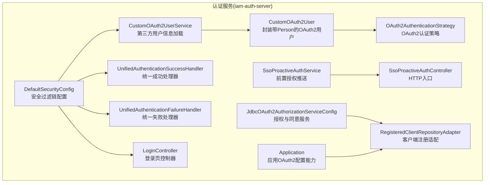
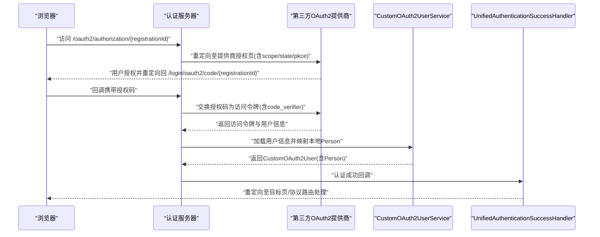
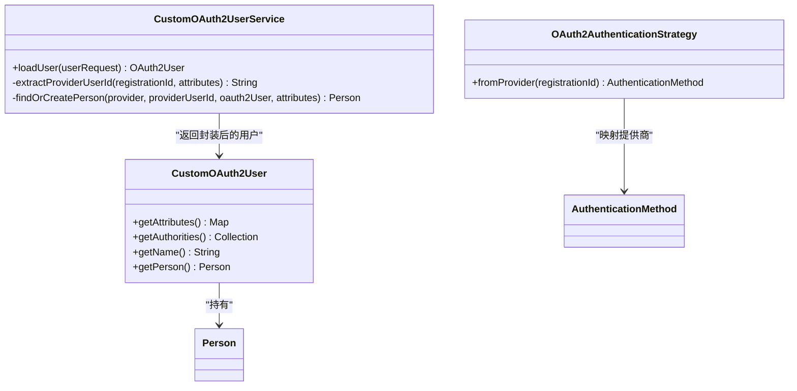
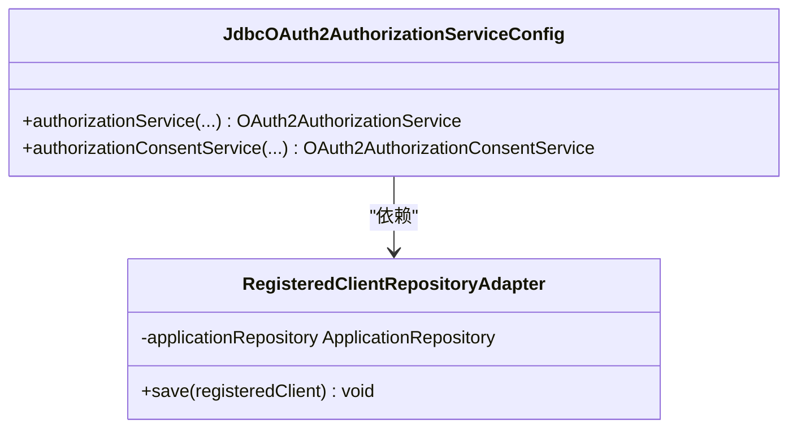
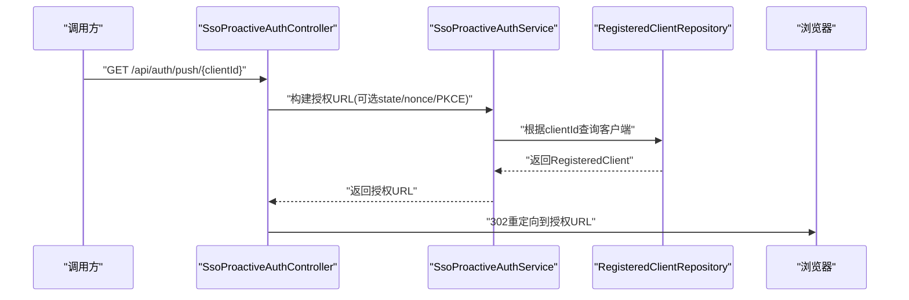
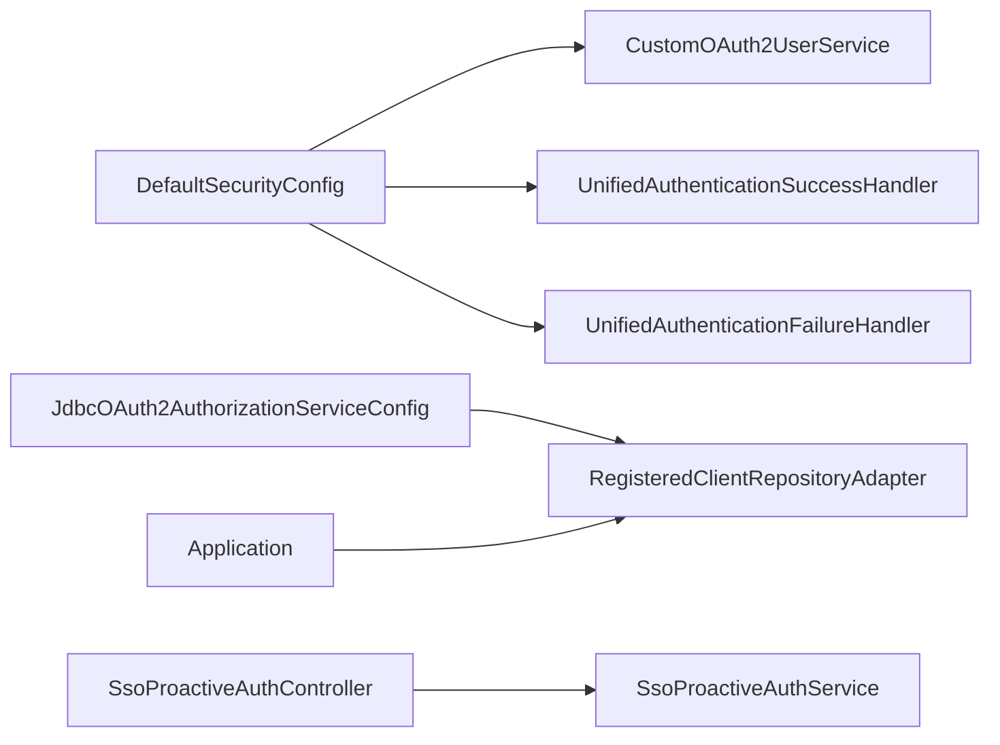

# OAuth2第三方认证

<cite>
**本文引用的文件**
- [application.yml](file://iam-auth-server/src/main/resources/application.yml)
- [application-dev.yml](file://iam-auth-server/src/main/resources/application-dev.yml)
- [CustomOAuth2UserService.java](file://iam-auth-server/src/main/java/iam/platform/auth/infrastructure/security/CustomOAuth2UserService.java)
- [CustomOAuth2User.java](file://iam-auth-server/src/main/java/iam/platform/auth/infrastructure/security/CustomOAuth2User.java)
- [OAuth2AuthenticationStrategy.java](file://iam-auth-server/src/main/java/iam/platform/auth/domain/service/impl/OAuth2AuthenticationStrategy.java)
- [DefaultSecurityConfig.java](file://iam-auth-server/src/main/java/iam/platform/auth/infrastructure/config/DefaultSecurityConfig.java)
- [SsoProactiveAuthService.java](file://iam-auth-server/src/main/java/iam/platform/auth/application/service/SsoProactiveAuthService.java)
- [SsoProactiveAuthController.java](file://iam-auth-server/src/main/java/iam/platform/auth/interfaces/rest/SsoProactiveAuthController.java)
- [JdbcOAuth2AuthorizationServiceConfig.java](file://iam-auth-server/src/main/java/iam/platform/auth/infrastructure/security/JdbcOAuth2AuthorizationServiceConfig.java)
- [RegisteredClientRepositoryAdapter.java](file://iam-auth-server/src/main/java/iam/platform/auth/infrastructure/security/RegisteredClientRepositoryAdapter.java)
- [UnifiedAuthenticationSuccessHandler.java](file://iam-auth-server/src/main/java/iam/platform/auth/interfaces/web/handler/UnifiedAuthenticationSuccessHandler.java)
- [UnifiedAuthenticationFailureHandler.java](file://iam-auth-server/src/main/java/iam/platform/auth/interfaces/web/handler/UnifiedAuthenticationFailureHandler.java)
- [LoginController.java](file://iam-auth-server/src/main/java/iam/platform/auth/interfaces/web/LoginController.java)
- [Application.java](file://iam-auth-server/src/main/java/iam/platform/auth/domain/model/entity/Application.java)
- [统一认证框架.md](file://docs/design/统一认证框架.md)
</cite>

## 目录
1. [简介](#简介)
2. [项目结构](#项目结构)
3. [核心组件](#核心组件)
4. [架构总览](#架构总览)
5. [详细组件分析](#详细组件分析)
6. [依赖关系分析](#依赖关系分析)
7. [性能考量](#性能考量)
8. [故障排查指南](#故障排查指南)
9. [结论](#结论)
10. [附录](#附录)

## 简介
本文件面向OAuth2第三方认证策略的实现与集成，覆盖授权码流程、令牌交换、用户信息获取、配置参数、第三方提供商适配、安全机制（PKCE、CSRF、令牌刷新）、用户体验优化、错误处理与兼容性，以及可扩展到更多第三方提供商的实践方法。文档基于仓库中Spring Security OAuth2与Spring Authorization Server的实际实现进行梳理与可视化。

## 项目结构
围绕OAuth2第三方认证的关键模块分布于认证服务（iam-auth-server），主要涉及：
- 安全配置与过滤链：DefaultSecurityConfig
- OAuth2用户服务与适配：CustomOAuth2UserService、CustomOAuth2User
- 认证策略：OAuth2AuthenticationStrategy
- 授权服务与客户端注册适配：JdbcOAuth2AuthorizationServiceConfig、RegisteredClientRepositoryAdapter
- 前置授权推送：SsoProactiveAuthService、SsoProactiveAuthController
- 应用侧OAuth2配置：application.yml、application-dev.yml
- 登录页面与控制器：LoginController
- 统一认证成功/失败处理器：UnifiedAuthenticationSuccessHandler、UnifiedAuthenticationFailureHandler
- 应用实体的OAuth2配置能力：Application.updateOAuthSettings

图表来源
- [DefaultSecurityConfig.java:35-63](file://iam-auth-server/src/main/java/iam/platform/auth/infrastructure/config/DefaultSecurityConfig.java#L35-L63)
- [CustomOAuth2UserService.java:22-50](file://iam-auth-server/src/main/java/iam/platform/auth/infrastructure/security/CustomOAuth2UserService.java#L22-L50)
- [CustomOAuth2User.java:11-35](file://iam-auth-server/src/main/java/iam/platform/auth/infrastructure/security/CustomOAuth2User.java#L11-L35)
- [OAuth2AuthenticationStrategy.java:15-54](file://iam-auth-server/src/main/java/iam/platform/auth/domain/service/impl/OAuth2AuthenticationStrategy.java#L15-L54)
- [SsoProactiveAuthService.java:22-67](file://iam-auth-server/src/main/java/iam/platform/auth/application/service/SsoProactiveAuthService.java#L22-L67)
- [SsoProactiveAuthController.java:35-62](file://iam-auth-server/src/main/java/iam/platform/auth/interfaces/rest/SsoProactiveAuthController.java#L35-L62)
- [JdbcOAuth2AuthorizationServiceConfig.java:12-27](file://iam-auth-server/src/main/java/iam/platform/auth/infrastructure/security/JdbcOAuth2AuthorizationServiceConfig.java#L12-L27)
- [RegisteredClientRepositoryAdapter.java:17-27](file://iam-auth-server/src/main/java/iam/platform/auth/infrastructure/security/RegisteredClientRepositoryAdapter.java#L17-L27)
- [UnifiedAuthenticationSuccessHandler.java:25-56](file://iam-auth-server/src/main/java/iam/platform/auth/interfaces/web/handler/UnifiedAuthenticationSuccessHandler.java#L25-L56)
- [UnifiedAuthenticationFailureHandler.java:12-36](file://iam-auth-server/src/main/java/iam/platform/auth/interfaces/web/handler/UnifiedAuthenticationFailureHandler.java#L12-L36)
- [LoginController.java:16-58](file://iam-auth-server/src/main/java/iam/platform/auth/interfaces/web/LoginController.java#L16-L58)
- [Application.java:149-174](file://iam-auth-server/src/main/java/iam/platform/auth/domain/model/entity/Application.java#L149-L174)

章节来源
- [DefaultSecurityConfig.java:35-63](file://iam-auth-server/src/main/java/iam/platform/auth/infrastructure/config/DefaultSecurityConfig.java#L35-L63)
- [application.yml:54-88](file://iam-auth-server/src/main/resources/application.yml#L54-L88)

## 核心组件
- OAuth2用户服务与适配
  - CustomOAuth2UserService：从第三方提供商拉取用户信息，按providerUserId与邮箱匹配或创建本地Person，并持久化外部登录映射，最终返回CustomOAuth2User以携带Person上下文。
  - CustomOAuth2User：实现OAuth2User接口，将Spring Security的OAuth2User委托给业务Person，便于后续统一认证流程使用。
- 认证策略
  - OAuth2AuthenticationStrategy：将不同OAuth2提供商映射为统一的认证方法枚举，支撑后续审计与策略分支。
- 安全配置
  - DefaultSecurityConfig：启用oauth2Login，绑定自定义用户服务与统一成功处理器；替换默认表单登录过滤器为统一认证过滤器，统一处理多源认证。
- 授权与客户端注册
  - JdbcOAuth2AuthorizationServiceConfig：提供授权与授权同意服务的JDBC实现。
  - RegisteredClientRepositoryAdapter：将应用模型与RegisteredClient解耦，禁止直接保存，改由应用管理API更新。
- 前置授权推送
  - SsoProactiveAuthService/SsoProactiveAuthController：校验客户端配置并构造标准授权URL，用于内部主动推送授权码场景。
- 应用OAuth2配置
  - Application.updateOAuthSettings：集中维护回调地址、注销后跳转、允许的作用域、是否要求PKCE与同意授权等。

章节来源
- [CustomOAuth2UserService.java:22-90](file://iam-auth-server/src/main/java/iam/platform/auth/infrastructure/security/CustomOAuth2UserService.java#L22-L90)
- [CustomOAuth2User.java:11-35](file://iam-auth-server/src/main/java/iam/platform/auth/infrastructure/security/CustomOAuth2User.java#L11-L35)
- [OAuth2AuthenticationStrategy.java:15-54](file://iam-auth-server/src/main/java/iam/platform/auth/domain/service/impl/OAuth2AuthenticationStrategy.java#L15-L54)
- [DefaultSecurityConfig.java:35-63](file://iam-auth-server/src/main/java/iam/platform/auth/infrastructure/config/DefaultSecurityConfig.java#L35-L63)
- [JdbcOAuth2AuthorizationServiceConfig.java:12-27](file://iam-auth-server/src/main/java/iam/platform/auth/infrastructure/security/JdbcOAuth2AuthorizationServiceConfig.java#L12-L27)
- [RegisteredClientRepositoryAdapter.java:17-27](file://iam-auth-server/src/main/java/iam/platform/auth/infrastructure/security/RegisteredClientRepositoryAdapter.java#L17-L27)
- [SsoProactiveAuthService.java:22-67](file://iam-auth-server/src/main/java/iam/platform/auth/application/service/SsoProactiveAuthService.java#L22-L67)
- [SsoProactiveAuthController.java:35-62](file://iam-auth-server/src/main/java/iam/platform/auth/interfaces/rest/SsoProactiveAuthController.java#L35-L62)
- [Application.java:149-174](file://iam-auth-server/src/main/java/iam/platform/auth/domain/model/entity/Application.java#L149-L174)

## 架构总览
下图展示OAuth2第三方认证从浏览器发起到完成登录的端到端流程，涵盖授权码交换、用户信息获取、本地账户映射与统一认证成功处理。

图表来源
- [DefaultSecurityConfig.java:37-51](file://iam-auth-server/src/main/java/iam/platform/auth/infrastructure/config/DefaultSecurityConfig.java#L37-L51)
- [CustomOAuth2UserService.java:27-50](file://iam-auth-server/src/main/java/iam/platform/auth/infrastructure/security/CustomOAuth2UserService.java#L27-L50)
- [UnifiedAuthenticationSuccessHandler.java:35-56](file://iam-auth-server/src/main/java/iam/platform/auth/interfaces/web/handler/UnifiedAuthenticationSuccessHandler.java#L35-L56)

## 详细组件分析

### OAuth2用户服务与适配
- 用户信息加载
  - 通过DefaultOAuth2UserService获取第三方用户属性，依据registrationId提取providerUserId（如钉钉unionId、企业微信/微信openid、默认id），优先通过外部登录记录匹配本地Person，否则按邮箱或默认规则创建新Person并建立映射。
- 用户对象封装
  - CustomOAuth2User将Person注入到OAuth2User上下文中，使后续统一处理器能读取Person信息，实现“第三方登录=本地账户”的无缝衔接。

图表来源
- [CustomOAuth2UserService.java:22-90](file://iam-auth-server/src/main/java/iam/platform/auth/infrastructure/security/CustomOAuth2UserService.java#L22-L90)
- [CustomOAuth2User.java:11-35](file://iam-auth-server/src/main/java/iam/platform/auth/infrastructure/security/CustomOAuth2User.java#L11-L35)
- [OAuth2AuthenticationStrategy.java:44-54](file://iam-auth-server/src/main/java/iam/platform/auth/domain/service/impl/OAuth2AuthenticationStrategy.java#L44-L54)

章节来源
- [CustomOAuth2UserService.java:27-90](file://iam-auth-server/src/main/java/iam/platform/auth/infrastructure/security/CustomOAuth2UserService.java#L27-L90)
- [CustomOAuth2User.java:17-35](file://iam-auth-server/src/main/java/iam/platform/auth/infrastructure/security/CustomOAuth2User.java#L17-L35)
- [OAuth2AuthenticationStrategy.java:19-54](file://iam-auth-server/src/main/java/iam/platform/auth/domain/service/impl/OAuth2AuthenticationStrategy.java#L19-L54)

### 授权与客户端注册适配
- 授权服务
  - 使用JdbcOAuth2AuthorizationService与JdbcOAuth2AuthorizationConsentService持久化授权与同意状态，确保授权码与同意信息可追踪。
- 客户端注册适配
  - RegisteredClientRepositoryAdapter将应用模型与RegisteredClient解耦，禁止直接保存，改为通过应用管理API更新，保证配置一致性与审计可控。

图表来源
- [JdbcOAuth2AuthorizationServiceConfig.java:12-27](file://iam-auth-server/src/main/java/iam/platform/auth/infrastructure/security/JdbcOAuth2AuthorizationServiceConfig.java#L12-L27)
- [RegisteredClientRepositoryAdapter.java:17-27](file://iam-auth-server/src/main/java/iam/platform/auth/infrastructure/security/RegisteredClientRepositoryAdapter.java#L17-L27)

章节来源
- [JdbcOAuth2AuthorizationServiceConfig.java:12-27](file://iam-auth-server/src/main/java/iam/platform/auth/infrastructure/security/JdbcOAuth2AuthorizationServiceConfig.java#L12-L27)
- [RegisteredClientRepositoryAdapter.java:17-27](file://iam-auth-server/src/main/java/iam/platform/auth/infrastructure/security/RegisteredClientRepositoryAdapter.java#L17-L27)

### 前置授权推送（Proactive Authorization Code Push）
- 用途
  - 在内部系统主动触发授权码流程，绕过用户手动点击，提升自动化与用户体验。
- 流程
  - 校验客户端配置（client_id、redirect_uri、scopes），构造标准授权URL（含state、nonce、code_challenge等），重定向至应用回调地址。

图表来源
- [SsoProactiveAuthController.java:35-62](file://iam-auth-server/src/main/java/iam/platform/auth/interfaces/rest/SsoProactiveAuthController.java#L35-L62)
- [SsoProactiveAuthService.java:37-67](file://iam-auth-server/src/main/java/iam/platform/auth/application/service/SsoProactiveAuthService.java#L37-L67)
- [DefaultSecurityConfig.java:37-51](file://iam-auth-server/src/main/java/iam/platform/auth/infrastructure/config/DefaultSecurityConfig.java#L37-L51)

章节来源
- [SsoProactiveAuthController.java:35-62](file://iam-auth-server/src/main/java/iam/platform/auth/interfaces/rest/SsoProactiveAuthController.java#L35-L62)
- [SsoProactiveAuthService.java:22-67](file://iam-auth-server/src/main/java/iam/platform/auth/application/service/SsoProactiveAuthService.java#L22-L67)

### OAuth2配置参数与第三方提供商适配
- 配置参数
  - 客户端ID/密钥、授权授予类型、重定向URI、作用域、提供商授权/令牌/用户信息端点、用户名属性等。
- 当前内置提供商
  - 钉钉（dingtalk）：已在配置中定义授权、令牌、用户信息端点及用户名属性。
- 扩展新提供商
  - 在application.yml中新增registration与provider节点，遵循Spring Security OAuth2 Client约定；CustomOAuth2UserService中可根据registrationId扩展providerUserId提取逻辑。

章节来源
- [application.yml:54-88](file://iam-auth-server/src/main/resources/application.yml#L54-L88)
- [application-dev.yml:9-22](file://iam-auth-server/src/main/resources/application-dev.yml#L9-L22)
- [CustomOAuth2UserService.java:52-58](file://iam-auth-server/src/main/java/iam/platform/auth/infrastructure/security/CustomOAuth2UserService.java#L52-L58)

### 安全机制
- PKCE（Proof Key for Code Exchange）
  - 在授权请求时携带code_challenge，换取令牌时使用code_verifier，有效防范授权码拦截。
- CSRF防护
  - 授权URL支持state参数，建议在应用层对state进行签名校验与一次性使用控制。
- 令牌刷新策略
  - 通过授权服务持久化refresh_token（若提供商返回），结合应用侧令牌TTL与刷新窗口策略实现安全轮换。
- 统一认证与会话
  - 统一成功/失败处理器负责重定向与错误传播，结合会话与租户上下文保障一致性。

章节来源
- [统一认证框架.md:440-484](file://docs/design/统一认证框架.md#L440-L484)
- [SsoProactiveAuthService.java:37-67](file://iam-auth-server/src/main/java/iam/platform/auth/application/service/SsoProactiveAuthService.java#L37-L67)
- [UnifiedAuthenticationSuccessHandler.java:35-56](file://iam-auth-server/src/main/java/iam/platform/auth/interfaces/web/handler/UnifiedAuthenticationSuccessHandler.java#L35-L56)
- [UnifiedAuthenticationFailureHandler.java:12-36](file://iam-auth-server/src/main/java/iam/platform/auth/interfaces/web/handler/UnifiedAuthenticationFailureHandler.java#L12-L36)

### 用户体验优化与错误处理
- 登录页与提示
  - LoginController提供基础登录页渲染，支持错误与退出提示参数。
- 统一认证处理器
  - 成功：根据认证类型（密码/短信/LDAP/第三方）选择目标路径与协议路由。
  - 失败：统一重定向到登录页并附带错误参数，便于前端展示。
- 一致的错误传播
  - 失败处理器捕获异常并兜底重定向，避免异常穿透。

章节来源
- [LoginController.java:16-58](file://iam-auth-server/src/main/java/iam/platform/auth/interfaces/web/LoginController.java#L16-L58)
- [UnifiedAuthenticationSuccessHandler.java:35-56](file://iam-auth-server/src/main/java/iam/platform/auth/interfaces/web/handler/UnifiedAuthenticationSuccessHandler.java#L35-L56)
- [UnifiedAuthenticationFailureHandler.java:12-36](file://iam-auth-server/src/main/java/iam/platform/auth/interfaces/web/handler/UnifiedAuthenticationFailureHandler.java#L12-L36)

## 依赖关系分析
- 过滤链与OAuth2登录
  - DefaultSecurityConfig启用oauth2Login并绑定自定义用户服务与统一成功处理器，替换默认表单登录过滤器。
- 授权服务与客户端注册
  - JdbcOAuth2AuthorizationServiceConfig提供授权与同意服务；RegisteredClientRepositoryAdapter隔离应用模型与RegisteredClient。
- 前置推送
  - SsoProactiveAuthController依赖SsoProactiveAuthService校验客户端并构造授权URL。
- 应用配置
  - Application.updateOAuthSettings集中维护应用的OAuth2相关配置项，供授权服务与路由使用。

图表来源
- [DefaultSecurityConfig.java:35-63](file://iam-auth-server/src/main/java/iam/platform/auth/infrastructure/config/DefaultSecurityConfig.java#L35-L63)
- [JdbcOAuth2AuthorizationServiceConfig.java:12-27](file://iam-auth-server/src/main/java/iam/platform/auth/infrastructure/security/JdbcOAuth2AuthorizationServiceConfig.java#L12-L27)
- [RegisteredClientRepositoryAdapter.java:17-27](file://iam-auth-server/src/main/java/iam/platform/auth/infrastructure/security/RegisteredClientRepositoryAdapter.java#L17-L27)
- [SsoProactiveAuthController.java:35-62](file://iam-auth-server/src/main/java/iam/platform/auth/interfaces/rest/SsoProactiveAuthController.java#L35-L62)
- [SsoProactiveAuthService.java:22-67](file://iam-auth-server/src/main/java/iam/platform/auth/application/service/SsoProactiveAuthService.java#L22-L67)
- [Application.java:149-174](file://iam-auth-server/src/main/java/iam/platform/auth/domain/model/entity/Application.java#L149-L174)

章节来源
- [DefaultSecurityConfig.java:35-63](file://iam-auth-server/src/main/java/iam/platform/auth/infrastructure/config/DefaultSecurityConfig.java#L35-L63)
- [JdbcOAuth2AuthorizationServiceConfig.java:12-27](file://iam-auth-server/src/main/java/iam/platform/auth/infrastructure/security/JdbcOAuth2AuthorizationServiceConfig.java#L12-L27)
- [RegisteredClientRepositoryAdapter.java:17-27](file://iam-auth-server/src/main/java/iam/platform/auth/infrastructure/security/RegisteredClientRepositoryAdapter.java#L17-L27)
- [SsoProactiveAuthController.java:35-62](file://iam-auth-server/src/main/java/iam/platform/auth/interfaces/rest/SsoProactiveAuthController.java#L35-L62)
- [SsoProactiveAuthService.java:22-67](file://iam-auth-server/src/main/java/iam/platform/auth/application/service/SsoProactiveAuthService.java#L22-L67)
- [Application.java:149-174](file://iam-auth-server/src/main/java/iam/platform/auth/domain/model/entity/Application.java#L149-L174)

## 性能考量
- 数据库与缓存
  - 使用Redis存储会话与速率限制，减少数据库压力；授权服务采用JDBC持久化，注意索引与连接池配置。
- 并发与超时
  - 合理设置连接超时、空闲超时与最大连接数，避免高并发下的连接争用。
- 日志与监控
  - 开启必要的调试日志与指标采集，定位第三方调用延迟与失败原因。

## 故障排查指南
- 授权失败
  - 检查回调URI是否与应用配置一致；确认state参数是否正确传递与校验；核对提供商端的应用配置。
- 用户信息缺失
  - 确认第三方提供商的用户信息端点与scope设置；CustomOAuth2UserService中providerUserId提取逻辑是否匹配当前提供商。
- 令牌交换失败
  - 核对客户端ID/密钥与提供商端配置；确认PKCE参数（code_challenge/code_verifier）是否正确传递。
- 会话与重定向问题
  - 查看统一成功/失败处理器的重定向行为；确认登录页控制器的错误参数传递。

章节来源
- [UnifiedAuthenticationFailureHandler.java:12-36](file://iam-auth-server/src/main/java/iam/platform/auth/interfaces/web/handler/UnifiedAuthenticationFailureHandler.java#L12-L36)
- [LoginController.java:16-58](file://iam-auth-server/src/main/java/iam/platform/auth/interfaces/web/LoginController.java#L16-L58)
- [SsoProactiveAuthService.java:37-67](file://iam-auth-server/src/main/java/iam/platform/auth/application/service/SsoProactiveAuthService.java#L37-L67)

## 结论
该实现以Spring Security OAuth2与Spring Authorization Server为核心，结合自定义用户服务与统一认证处理器，提供了可扩展、可审计、可运维的OAuth2第三方认证方案。通过JDBC授权服务与客户端注册适配，配合应用级OAuth2配置能力，既满足通用授权码流程，又为前置授权推送与多提供商适配预留了清晰扩展点。

## 附录

### OAuth2配置参数清单（摘自配置文件）
- 客户端注册
  - registration.{provider}.client-id
  - registration.{provider}.client-secret
  - registration.{provider}.authorization-grant-type
  - registration.{provider}.redirect-uri
  - registration.{provider}.scope
  - registration.{provider}.client-name
- 提供商端点
  - provider.{provider}.authorization-uri
  - provider.{provider}.token-uri
  - provider.{provider}.user-info-uri
  - provider.{provider}.user-name-attribute

章节来源
- [application.yml:54-88](file://iam-auth-server/src/main/resources/application.yml#L54-L88)

### 第三方提供商适配步骤（示例：新增一个提供商）
- 在配置文件中添加registration与provider节点，确保授权/令牌/用户信息端点与用户名属性正确。
- 如需特殊providerUserId提取逻辑，在CustomOAuth2UserService中扩展extractProviderUserId分支。
- 若需要同意授权或PKCE，可在应用侧通过Application.updateOAuthSettings开启相应选项。

章节来源
- [application.yml:54-88](file://iam-auth-server/src/main/resources/application.yml#L54-L88)
- [CustomOAuth2UserService.java:52-58](file://iam-auth-server/src/main/java/iam/platform/auth/infrastructure/security/CustomOAuth2UserService.java#L52-L58)
- [Application.java:149-174](file://iam-auth-server/src/main/java/iam/platform/auth/domain/model/entity/Application.java#L149-L174)