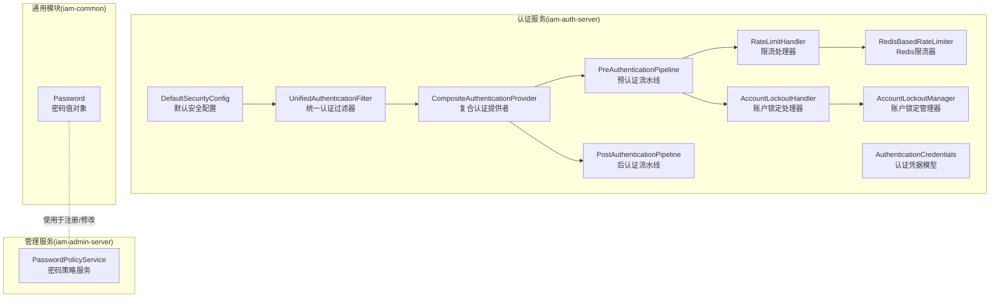
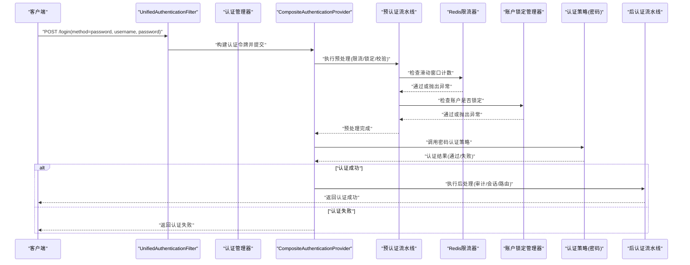
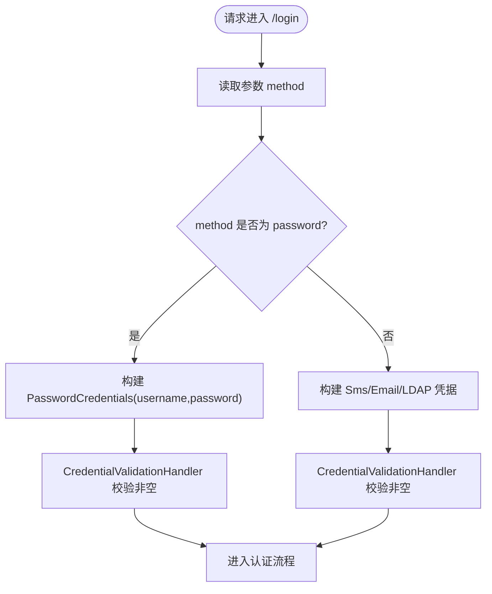
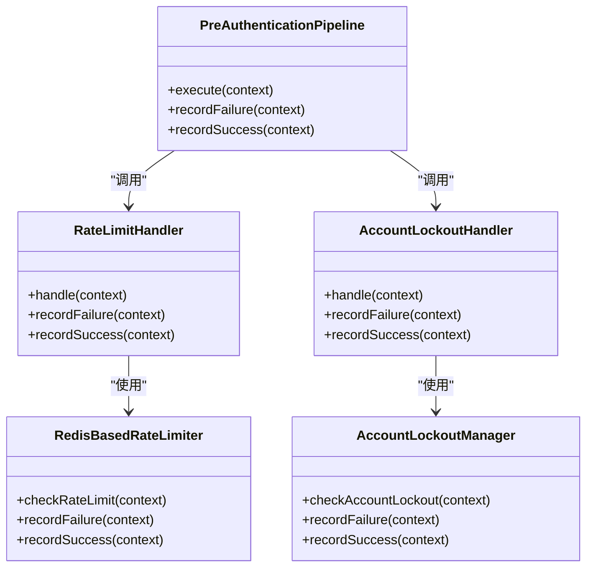
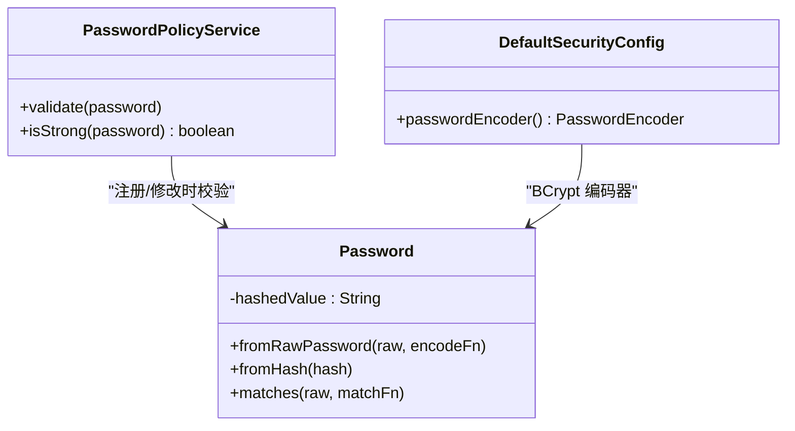
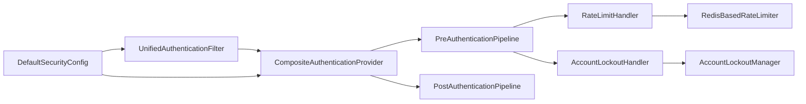

# 密码认证策略

<cite>
**本文引用的文件**
- [UnifiedAuthenticationFilter.java](file://iam-auth-server/src/main/java/iam/platform/auth/interfaces/web/filter/UnifiedAuthenticationFilter.java)
- [AuthenticationCredentials.java](file://iam-auth-server/src/main/java/iam/platform/auth/domain/model/valueobject/AuthenticationCredentials.java)
- [CompositeAuthenticationProvider.java](file://iam-auth-server/src/main/java/iam/platform/auth/application/service/CompositeAuthenticationProvider.java)
- [DefaultSecurityConfig.java](file://iam-auth-server/src/main/java/iam/platform/auth/infrastructure/config/DefaultSecurityConfig.java)
- [CredentialValidationHandler.java](file://iam-auth-server/src/main/java/iam/platform/auth/application/service/pipeline/CredentialValidationHandler.java)
- [PreAuthenticationPipeline.java](file://iam-auth-server/src/main/java/iam/platform/auth/application/service/pipeline/PreAuthenticationPipeline.java)
- [PostAuthenticationPipeline.java](file://iam-auth-server/src/main/java/iam/platform/auth/application/service/pipeline/PostAuthenticationPipeline.java)
- [RateLimitHandler.java](file://iam-auth-server/src/main/java/iam/platform/auth/application/service/pipeline/RateLimitHandler.java)
- [AccountLockoutHandler.java](file://iam-auth-server/src/main/java/iam/platform/auth/application/service/pipeline/AccountLockoutHandler.java)
- [RedisBasedRateLimiter.java](file://iam-auth-server/src/main/java/iam/platform/auth/infrastructure/security/RedisBasedRateLimiter.java)
- [AccountLockoutManager.java](file://iam-auth-server/src/main/java/iam/platform/auth/infrastructure/security/AccountLockoutManager.java)
- [application.yml](file://iam-auth-server/src/main/resources/application.yml)
- [Password.java](file://iam-common/src/main/java/iam/platform/common/model/valueobject/Password.java)
- [PasswordPolicyService.java](file://iam-admin-server/src/main/java/iam/platform/admin/domain/service/PasswordPolicyService.java)
- [EncryptedStringConverter.java](file://iam-auth-server/src/main/java/iam/platform/auth/infrastructure/persistence/converter/EncryptedStringConverter.java)
- [EncryptionProperties.java](file://iam-auth-server/src/main/java/iam/platform/auth/infrastructure/config/EncryptionProperties.java)
- [AccountStatusPolicy.java](file://iam-auth-server/src/main/java/iam/platform/auth/domain/service/AccountStatusPolicy.java)
</cite>

## 目录
1. [引言](#引言)
2. [项目结构](#项目结构)
3. [核心组件](#核心组件)
4. [架构总览](#架构总览)
5. [详细组件分析](#详细组件分析)
6. [依赖分析](#依赖分析)
7. [性能考虑](#性能考虑)
8. [故障排查指南](#故障排查指南)
9. [结论](#结论)
10. [附录](#附录)

## 引言
本文件系统性地文档化基于用户名/密码的认证策略在 IAM 平台中的实现与配置，覆盖以下关键主题：
- 密码验证算法与盐值处理：采用 BCrypt 编码器进行哈希与校验，确保不可逆存储与高效匹配。
- 密码强度检查：统一在通用模型中定义最小长度与字符集要求，并在注册/修改场景由管理端策略服务执行。
- 认证触发条件与输入参数校验：统一登录入口解析 method 参数选择认证方式，对必填字段进行严格校验。
- 错误处理机制：预认证阶段抛出异常，结合限流与账户锁定策略，保障抗暴力破解能力。
- 配置项说明：密码复杂度、速率限制、账户锁定阈值、锁定期时长等。
- 加密存储与验证流程：数据库中存储哈希值；读取时通过匹配函数完成验证。
- 性能优化与安全防护：Redis 滑动窗口计数、失败重试冷却、IP 白名单/黑名单扩展点。
- 实际集成与配置示例：通过配置文件与过滤器链集成到 Spring Security。

## 项目结构
围绕密码认证的关键模块分布于认证服务与通用模块：
- 认证服务（iam-auth-server）：负责统一认证过滤器、认证提供者、预/后置认证流水线、限流与账户锁定、安全配置与密码编码器装配。
- 通用模块（iam-common）：定义密码值对象，封装哈希与策略校验，避免对 Spring Security 的直接耦合。
- 管理服务（iam-admin-server）：提供密码策略校验与强弱判断的服务接口，供注册/修改流程调用。

图表来源
- [DefaultSecurityConfig.java:35-93](file://iam-auth-server/src/main/java/iam/platform/auth/infrastructure/config/DefaultSecurityConfig.java#L35-L93)
- [UnifiedAuthenticationFilter.java:18-79](file://iam-auth-server/src/main/java/iam/platform/auth/interfaces/web/filter/UnifiedAuthenticationFilter.java#L18-L79)
- [CompositeAuthenticationProvider.java:24-74](file://iam-auth-server/src/main/java/iam/platform/auth/application/service/CompositeAuthenticationProvider.java#L24-L74)
- [PreAuthenticationPipeline.java:14-60](file://iam-auth-server/src/main/java/iam/platform/auth/application/service/pipeline/PreAuthenticationPipeline.java#L14-L60)
- [PostAuthenticationPipeline.java:16-30](file://iam-auth-server/src/main/java/iam/platform/auth/application/service/pipeline/PostAuthenticationPipeline.java#L16-L30)
- [RateLimitHandler.java:12-41](file://iam-auth-server/src/main/java/iam/platform/auth/application/service/pipeline/RateLimitHandler.java#L12-L41)
- [AccountLockoutHandler.java:11-41](file://iam-auth-server/src/main/java/iam/platform/auth/application/service/pipeline/AccountLockoutHandler.java#L11-L41)
- [RedisBasedRateLimiter.java:16-123](file://iam-auth-server/src/main/java/iam/platform/auth/infrastructure/security/RedisBasedRateLimiter.java#L16-L123)
- [AccountLockoutManager.java:13-134](file://iam-auth-server/src/main/java/iam/platform/auth/infrastructure/security/AccountLockoutManager.java#L13-L134)
- [AuthenticationCredentials.java:9-58](file://iam-auth-server/src/main/java/iam/platform/auth/domain/model/valueobject/AuthenticationCredentials.java#L9-L58)
- [Password.java:10-89](file://iam-common/src/main/java/iam/platform/common/model/valueobject/Password.java#L10-L89)
- [PasswordPolicyService.java:6-34](file://iam-admin-server/src/main/java/iam/platform/admin/domain/service/PasswordPolicyService.java#L6-L34)

章节来源
- [DefaultSecurityConfig.java:24-93](file://iam-auth-server/src/main/java/iam/platform/auth/infrastructure/config/DefaultSecurityConfig.java#L24-L93)
- [UnifiedAuthenticationFilter.java:18-79](file://iam-auth-server/src/main/java/iam/platform/auth/interfaces/web/filter/UnifiedAuthenticationFilter.java#L18-L79)
- [AuthenticationCredentials.java:9-58](file://iam-auth-server/src/main/java/iam/platform/auth/domain/model/valueobject/AuthenticationCredentials.java#L9-L58)

## 核心组件
- 统一认证过滤器：从表单提取 method 字段，解析为 PasswordCredentials/SmsCodeCredentials/EmailCodeCredentials/LdapCredentials，构建认证令牌交由认证管理器处理。
- 复合认证提供者：根据凭据类型选择对应 AuthenticationStrategy，执行预认证流水线，再调用策略认证，最后产出已认证令牌。
- 预认证流水线：按顺序执行限流、账户锁定、凭证格式校验等处理器，失败时记录失败事件。
- 后认证流水线：认证成功后执行审计、会话、协议路由等后续处理。
- 密码值对象：封装哈希存储与策略校验，提供 matches 匹配函数，避免在通用层引入 Spring Security 依赖。
- 密码策略服务：在管理端提供密码强度校验与强弱判断，用于注册/修改流程。

章节来源
- [CompositeAuthenticationProvider.java:24-74](file://iam-auth-server/src/main/java/iam/platform/auth/application/service/CompositeAuthenticationProvider.java#L24-L74)
- [PreAuthenticationPipeline.java:14-60](file://iam-auth-server/src/main/java/iam/platform/auth/application/service/pipeline/PreAuthenticationPipeline.java#L14-L60)
- [PostAuthenticationPipeline.java:16-30](file://iam-auth-server/src/main/java/iam/platform/auth/application/service/pipeline/PostAuthenticationPipeline.java#L16-L30)
- [Password.java:10-89](file://iam-common/src/main/java/iam/platform/common/model/valueobject/Password.java#L10-L89)
- [PasswordPolicyService.java:6-34](file://iam-admin-server/src/main/java/iam/platform/admin/domain/service/PasswordPolicyService.java#L6-L34)

## 架构总览
下图展示了密码认证从请求进入、参数解析、预处理、策略执行到结果返回的完整链路。

图表来源
- [UnifiedAuthenticationFilter.java:31-78](file://iam-auth-server/src/main/java/iam/platform/auth/interfaces/web/filter/UnifiedAuthenticationFilter.java#L31-L78)
- [CompositeAuthenticationProvider.java:31-67](file://iam-auth-server/src/main/java/iam/platform/auth/application/service/CompositeAuthenticationProvider.java#L31-L67)
- [PreAuthenticationPipeline.java:26-31](file://iam-auth-server/src/main/java/iam/platform/auth/application/service/pipeline/PreAuthenticationPipeline.java#L26-L31)
- [RedisBasedRateLimiter.java:32-67](file://iam-auth-server/src/main/java/iam/platform/auth/infrastructure/security/RedisBasedRateLimiter.java#L32-L67)
- [AccountLockoutManager.java:34-58](file://iam-auth-server/src/main/java/iam/platform/auth/infrastructure/security/AccountLockoutManager.java#L34-L58)

## 详细组件分析

### 统一认证过滤器与凭据模型
- 过滤器职责：解析表单参数，依据 method 选择 PasswordCredentials 或其他凭据类型，构造认证令牌并交由认证管理器。
- 凭据模型：PasswordCredentials 要求 username 与 password 非空；其他类型对相应字段进行非空校验。
- 触发条件：仅当 method 为 password 时进入密码认证路径；否则走短信/邮箱验证码或 LDAP。

图表来源
- [UnifiedAuthenticationFilter.java:43-71](file://iam-auth-server/src/main/java/iam/platform/auth/interfaces/web/filter/UnifiedAuthenticationFilter.java#L43-L71)
- [AuthenticationCredentials.java:11-19](file://iam-auth-server/src/main/java/iam/platform/auth/domain/model/valueobject/AuthenticationCredentials.java#L11-L19)
- [CredentialValidationHandler.java:38-48](file://iam-auth-server/src/main/java/iam/platform/auth/application/service/pipeline/CredentialValidationHandler.java#L38-L48)

章节来源
- [UnifiedAuthenticationFilter.java:18-79](file://iam-auth-server/src/main/java/iam/platform/auth/interfaces/web/filter/UnifiedAuthenticationFilter.java#L18-L79)
- [AuthenticationCredentials.java:9-58](file://iam-auth-server/src/main/java/iam/platform/auth/domain/model/valueobject/AuthenticationCredentials.java#L9-L58)
- [CredentialValidationHandler.java:12-96](file://iam-auth-server/src/main/java/iam/platform/auth/application/service/pipeline/CredentialValidationHandler.java#L12-L96)

### 预认证流水线与安全策略
- 流水线顺序：限流处理器 → 账户锁定处理器 → 凭证格式校验。
- 限流策略：基于 Redis 的滑动窗口计数，支持按用户标识+客户端 IP 双维度统计，超限则拒绝。
- 账户锁定：累计失败次数超过阈值后设置临时锁定键，期间禁止登录。
- 成功/失败记录：认证成功重置计数；失败递增计数并在达到阈值时加锁。

图表来源
- [PreAuthenticationPipeline.java:14-60](file://iam-auth-server/src/main/java/iam/platform/auth/application/service/pipeline/PreAuthenticationPipeline.java#L14-L60)
- [RateLimitHandler.java:12-41](file://iam-auth-server/src/main/java/iam/platform/auth/application/service/pipeline/RateLimitHandler.java#L12-L41)
- [AccountLockoutHandler.java:11-41](file://iam-auth-server/src/main/java/iam/platform/auth/application/service/pipeline/AccountLockoutHandler.java#L11-L41)
- [RedisBasedRateLimiter.java:16-123](file://iam-auth-server/src/main/java/iam/platform/auth/infrastructure/security/RedisBasedRateLimiter.java#L16-L123)
- [AccountLockoutManager.java:13-134](file://iam-auth-server/src/main/java/iam/platform/auth/infrastructure/security/AccountLockoutManager.java#L13-L134)

章节来源
- [PreAuthenticationPipeline.java:14-60](file://iam-auth-server/src/main/java/iam/platform/auth/application/service/pipeline/PreAuthenticationPipeline.java#L14-L60)
- [RedisBasedRateLimiter.java:16-123](file://iam-auth-server/src/main/java/iam/platform/auth/infrastructure/security/RedisBasedRateLimiter.java#L16-L123)
- [AccountLockoutManager.java:13-134](file://iam-auth-server/src/main/java/iam/platform/auth/infrastructure/security/AccountLockoutManager.java#L13-L134)

### 密码哈希与强度策略
- 哈希算法：BCryptPasswordEncoder 提供自适应成本因子与随机盐值，保证安全性与性能平衡。
- 存储模型：Password 值对象保存哈希字符串；注册/修改时由通用模块生成并持久化。
- 强度校验：最小长度、大小写字母、数字要求；管理端策略服务提供强弱判断。
- 匹配流程：读取数据库中的哈希值，使用 matches 函数与明文密码进行验证。

图表来源
- [Password.java:10-89](file://iam-common/src/main/java/iam/platform/common/model/valueobject/Password.java#L10-L89)
- [PasswordPolicyService.java:6-34](file://iam-admin-server/src/main/java/iam/platform/admin/domain/service/PasswordPolicyService.java#L6-L34)
- [DefaultSecurityConfig.java:90-93](file://iam-auth-server/src/main/java/iam/platform/auth/infrastructure/config/DefaultSecurityConfig.java#L90-L93)

章节来源
- [Password.java:10-89](file://iam-common/src/main/java/iam/platform/common/model/valueobject/Password.java#L10-L89)
- [PasswordPolicyService.java:6-34](file://iam-admin-server/src/main/java/iam/platform/admin/domain/service/PasswordPolicyService.java#L6-L34)
- [DefaultSecurityConfig.java:90-93](file://iam-auth-server/src/main/java/iam/platform/auth/infrastructure/config/DefaultSecurityConfig.java#L90-L93)

### 数据库映射与加密存储
- 密码字段映射：数据库中存储的是哈希后的密码字符串；原始明文不落库。
- 加密转换器：提供可选的字符串级 AES-GCM 加密转换器，适用于敏感文本字段；密码字段采用 BCrypt 哈希存储，两者职责分离。
- 配置开关：通过安全配置属性控制加密转换器启用条件（密钥长度校验）。

章节来源
- [EncryptedStringConverter.java:16-31](file://iam-auth-server/src/main/java/iam/platform/auth/infrastructure/persistence/converter/EncryptedStringConverter.java#L16-L31)
- [EncryptionProperties.java:11-14](file://iam-auth-server/src/main/java/iam/platform/auth/infrastructure/config/EncryptionProperties.java#L11-L14)

### 配置选项与策略
- 密码复杂度：最小长度、大小写字母、数字要求由通用模块与管理端策略共同约束。
- 速率限制：最大尝试次数、时间窗口秒数，支持按用户+IP维度计数。
- 账户锁定：失败阈值、锁定时长（分钟），锁定期间禁止登录。
- 其他：LDAP 开关与基础配置、CAS 集成参数、会话存储至 Redis 等。

章节来源
- [application.yml:90-126](file://iam-auth-server/src/main/resources/application.yml#L90-L126)
- [PasswordPolicyService.java:9-24](file://iam-admin-server/src/main/java/iam/platform/admin/domain/service/PasswordPolicyService.java#L9-L24)
- [Password.java:20-83](file://iam-common/src/main/java/iam/platform/common/model/valueobject/Password.java#L20-L83)

## 依赖分析
- 组件内聚与解耦：认证过滤器与提供者通过抽象凭据模型与策略接口解耦；预/后认证流水线以处理器插件化组织。
- 外部依赖：Spring Security、Spring Data Redis、BCrypt 编码器；配置来源于 application.yml。
- 循环依赖：未见循环依赖迹象；各模块边界清晰。

图表来源
- [DefaultSecurityConfig.java:35-93](file://iam-auth-server/src/main/java/iam/platform/auth/infrastructure/config/DefaultSecurityConfig.java#L35-L93)
- [CompositeAuthenticationProvider.java:24-74](file://iam-auth-server/src/main/java/iam/platform/auth/application/service/CompositeAuthenticationProvider.java#L24-L74)
- [PreAuthenticationPipeline.java:14-60](file://iam-auth-server/src/main/java/iam/platform/auth/application/service/pipeline/PreAuthenticationPipeline.java#L14-L60)
- [PostAuthenticationPipeline.java:16-30](file://iam-auth-server/src/main/java/iam/platform/auth/application/service/pipeline/PostAuthenticationPipeline.java#L16-L30)
- [RedisBasedRateLimiter.java:16-123](file://iam-auth-server/src/main/java/iam/platform/auth/infrastructure/security/RedisBasedRateLimiter.java#L16-L123)
- [AccountLockoutManager.java:13-134](file://iam-auth-server/src/main/java/iam/platform/auth/infrastructure/security/AccountLockoutManager.java#L13-L134)

## 性能考虑
- 编码器成本：BCrypt 成本因子影响 CPU 时间，建议在生产环境评估并固定成本因子以稳定性能。
- Redis 操作：限流与锁定均依赖 Redis，应确保连接池与网络延迟可控；Redis 不可用时采用“失败放行”策略，避免阻塞业务。
- 滑动窗口计数：使用原子自增与 TTL 控制内存占用；合理设置窗口与阈值，避免热点账户产生大量键。
- 会话与缓存：会话存储于 Redis，减少数据库压力；模板与静态资源缓存关闭便于开发调试，生产可按需开启。

## 故障排查指南
- 常见错误与定位
  - “缺少必需参数”：确认表单包含 method、username/password 等字段。
  - “未知认证方式”：method 必须为 password/sms/email/ldap 之一。
  - “Too many authentication attempts”：触发速率限制，等待窗口到期或联系管理员。
  - “Account is temporarily locked”：失败次数过多被锁定，等待锁定结束或联系管理员。
- 排查步骤
  - 查看预认证处理器日志，确认限流与锁定是否生效。
  - 检查 Redis 中是否存在对应键（如 auth:ratelimit:、auth:lockout: 前缀）。
  - 核对 application.yml 中的安全策略配置是否符合预期。
  - 确认 BCrypt 编码器是否正确装配，匹配函数是否传入正确的哈希值。

章节来源
- [UnifiedAuthenticationFilter.java:59-71](file://iam-auth-server/src/main/java/iam/platform/auth/interfaces/web/filter/UnifiedAuthenticationFilter.java#L59-L71)
- [RedisBasedRateLimiter.java:44-50](file://iam-auth-server/src/main/java/iam/platform/auth/infrastructure/security/RedisBasedRateLimiter.java#L44-L50)
- [AccountLockoutManager.java:44-50](file://iam-auth-server/src/main/java/iam/platform/auth/infrastructure/security/AccountLockoutManager.java#L44-L50)
- [DefaultSecurityConfig.java:90-93](file://iam-auth-server/src/main/java/iam/platform/auth/infrastructure/config/DefaultSecurityConfig.java#L90-L93)

## 结论
该密码认证策略通过统一过滤器、预/后认证流水线与 Redis 安全策略，实现了高可用、可扩展且安全的登录体验。BCrypt 哈希与严格的密码策略配合限流与账户锁定，有效抵御暴力破解攻击。配置灵活，易于在不同环境中部署与调优。

## 附录
- 集成与配置要点
  - 在 Spring Security 过滤器链中注册统一认证过滤器，替换默认表单登录。
  - 确保 Redis 连通性与密钥配置（如启用 AES-GCM 字段加密）。
  - 在注册/修改流程中调用管理端密码策略服务进行强度校验。
  - 根据业务需求调整速率限制与账户锁定阈值。

章节来源
- [DefaultSecurityConfig.java:35-93](file://iam-auth-server/src/main/java/iam/platform/auth/infrastructure/config/DefaultSecurityConfig.java#L35-L93)
- [application.yml:90-126](file://iam-auth-server/src/main/resources/application.yml#L90-L126)
- [PasswordPolicyService.java:6-34](file://iam-admin-server/src/main/java/iam/platform/admin/domain/service/PasswordPolicyService.java#L6-L34)