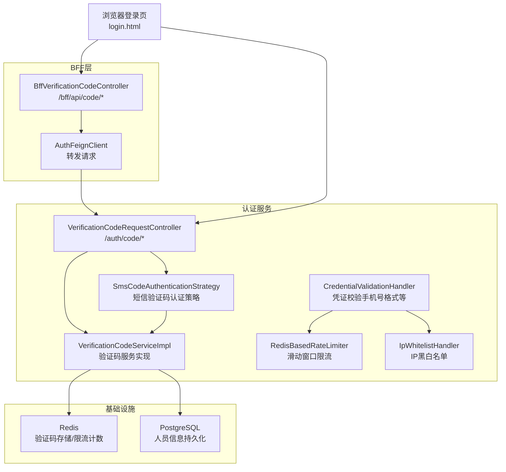
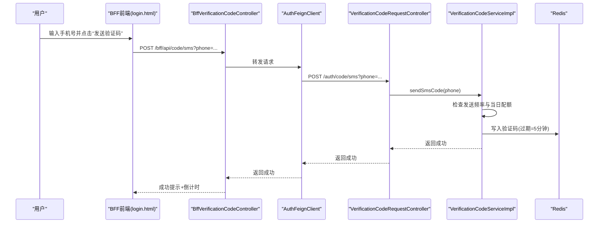
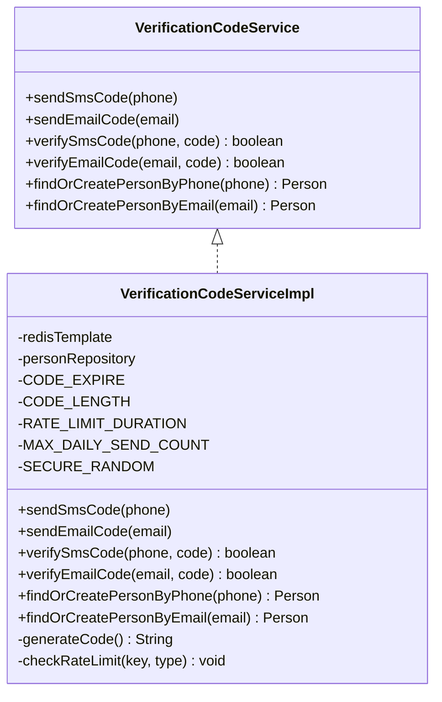
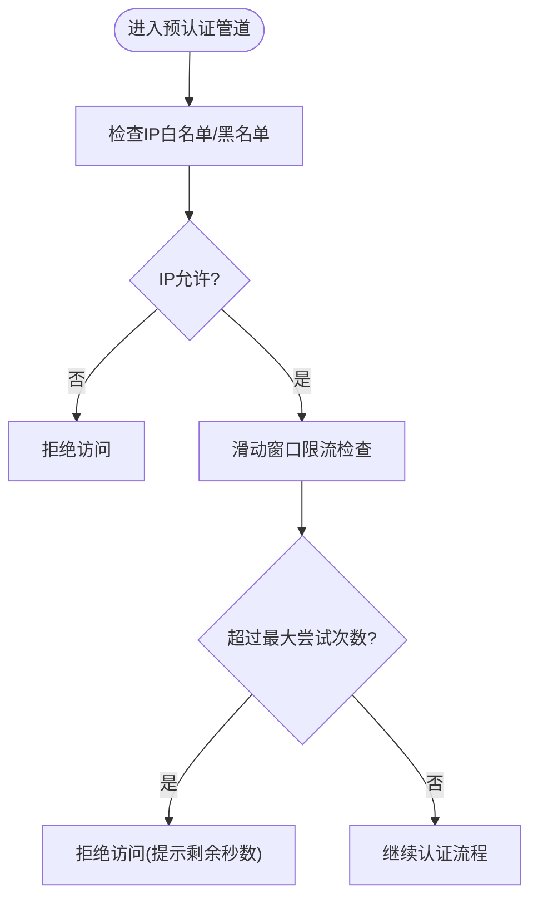
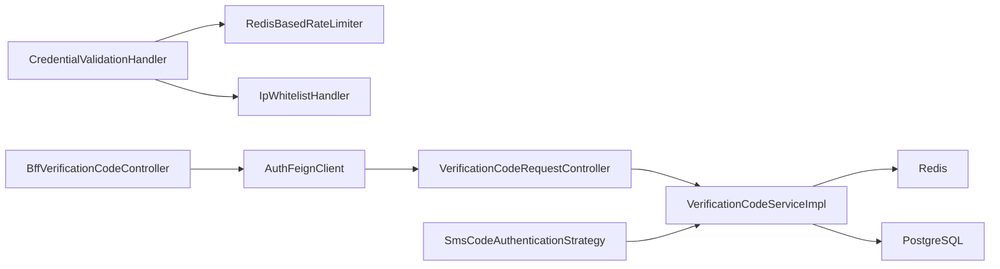

# 短信验证码认证

<cite>
**本文引用的文件**
- [VerificationCodeService.java](file://iam-auth-server/src/main/java/iam/platform/auth/domain/service/VerificationCodeService.java)
- [VerificationCodeServiceImpl.java](file://iam-auth-server/src/main/java/iam/platform/auth/domain/service/impl/VerificationCodeServiceImpl.java)
- [VerificationCodeRequestController.java](file://iam-auth-server/src/main/java/iam/platform/auth/interfaces/rest/VerificationCodeRequestController.java)
- [SmsCodeAuthenticationStrategy.java](file://iam-auth-server/src/main/java/iam/platform/auth/domain/service/impl/SmsCodeAuthenticationStrategy.java)
- [CredentialValidationHandler.java](file://iam-auth-server/src/main/java/iam/platform/auth/application/service/pipeline/CredentialValidationHandler.java)
- [RedisBasedRateLimiter.java](file://iam-auth-server/src/main/java/iam/platform/auth/infrastructure/security/RedisBasedRateLimiter.java)
- [SecurityPolicyProperties.java](file://iam-auth-server/src/main/java/iam/platform/auth/infrastructure/config/SecurityPolicyProperties.java)
- [IpWhitelistHandler.java](file://iam-auth-server/src/main/java/iam/platform/auth/application/service/pipeline/IpWhitelistHandler.java)
- [BffVerificationCodeController.java](file://iam-bff-server/src/main/java/iam/platform/bff/interfaces/rest/BffVerificationCodeController.java)
- [AuthFeignClient.java](file://iam-bff-server/src/main/java/iam/platform/bff/infrastructure/client/AuthFeignClient.java)
- [application.yml（认证服务）](file://iam-auth-server/src/main/resources/application.yml)
- [application.yml（BFF服务）](file://iam-bff-server/src/main/resources/application.yml)
- [login.html（认证服务前端）](file://iam-auth-server/src/main/resources/templates/login.html)
- [login.html（BFF前端）](file://iam-bff-server/src/main/resources/templates/login.html)
- [AuthenticationCredentials.java](file://iam-auth-server/src/main/java/iam/platform/auth/domain/model/valueobject/AuthenticationCredentials.java)
- [AuthenticationMethod.java](file://iam-auth-server/src/main/java/iam/platform/auth/domain/model/enums/AuthenticationMethod.java)
</cite>

## 目录
1. [简介](#简介)
2. [项目结构](#项目结构)
3. [核心组件](#核心组件)
4. [架构总览](#架构总览)
5. [详细组件分析](#详细组件分析)
6. [依赖分析](#依赖分析)
7. [性能考虑](#性能考虑)
8. [故障排查指南](#故障排查指南)
9. [结论](#结论)
10. [附录：配置与示例路径](#附录配置与示例路径)

## 简介
本文件系统性地文档化了基于短信验证码的身份认证策略在IAM平台中的实现。内容涵盖验证码生成算法、发送机制、有效期管理、触发条件、手机号验证、验证码校验流程、短信服务集成配置、安全机制（防刷策略、重试次数限制、IP白名单）、性能与成本控制以及故障恢复机制，并通过图示与路径指引帮助读者快速定位实现位置。

## 项目结构
该能力由“认证服务”和“BFF服务”协作完成：
- BFF层负责接收前端请求并转发至认证服务；
- 认证服务负责验证码生成、存储、校验、用户查找/创建、安全策略执行；
- 前端登录页提供“短信验证码登录”的交互入口与倒计时提示。

图表来源
- [BffVerificationCodeController.java:1-39](file://iam-bff-server/src/main/java/iam/platform/bff/interfaces/rest/BffVerificationCodeController.java#L1-L39)
- [AuthFeignClient.java:1-50](file://iam-bff-server/src/main/java/iam/platform/bff/infrastructure/client/AuthFeignClient.java#L1-L50)
- [VerificationCodeRequestController.java:1-31](file://iam-auth-server/src/main/java/iam/platform/auth/interfaces/rest/VerificationCodeRequestController.java#L1-L31)
- [VerificationCodeServiceImpl.java:1-153](file://iam-auth-server/src/main/java/iam/platform/auth/domain/service/impl/VerificationCodeServiceImpl.java#L1-L153)
- [SmsCodeAuthenticationStrategy.java:1-39](file://iam-auth-server/src/main/java/iam/platform/auth/domain/service/impl/SmsCodeAuthenticationStrategy.java#L1-L39)
- [CredentialValidationHandler.java:1-58](file://iam-auth-server/src/main/java/iam/platform/auth/application/service/pipeline/CredentialValidationHandler.java#L1-L58)
- [RedisBasedRateLimiter.java:1-123](file://iam-auth-server/src/main/java/iam/platform/auth/infrastructure/security/RedisBasedRateLimiter.java#L1-L123)
- [IpWhitelistHandler.java:1-107](file://iam-auth-server/src/main/java/iam/platform/auth/application/service/pipeline/IpWhitelistHandler.java#L1-L107)

章节来源
- [application.yml（认证服务）:1-144](file://iam-auth-server/src/main/resources/application.yml#L1-L144)
- [application.yml（BFF服务）:1-54](file://iam-bff-server/src/main/resources/application.yml#L1-L54)
- [login.html（认证服务前端）:260-343](file://iam-auth-server/src/main/resources/templates/login.html#L260-L343)
- [login.html（BFF前端）:260-341](file://iam-bff-server/src/main/resources/templates/login.html#L260-L341)

## 核心组件
- 验证码服务接口与实现：负责生成、发送、校验验证码，以及按手机号/邮箱查找或创建用户。
- 验证码请求控制器：对外暴露发送短信/邮件验证码的REST接口。
- 短信验证码认证策略：在认证流程中识别并处理短信验证码登录。
- 凭证校验处理器：对手机号格式进行校验，为限流提供标识键。
- 限流与IP策略：基于Redis的滑动窗口限流与IP白名单/黑名单。
- BFF转发控制器与Feign客户端：BFF侧统一入口，转发到认证服务。

章节来源
- [VerificationCodeService.java:1-21](file://iam-auth-server/src/main/java/iam/platform/auth/domain/service/VerificationCodeService.java#L1-L21)
- [VerificationCodeServiceImpl.java:1-153](file://iam-auth-server/src/main/java/iam/platform/auth/domain/service/impl/VerificationCodeServiceImpl.java#L1-L153)
- [VerificationCodeRequestController.java:1-31](file://iam-auth-server/src/main/java/iam/platform/auth/interfaces/rest/VerificationCodeRequestController.java#L1-L31)
- [SmsCodeAuthenticationStrategy.java:1-39](file://iam-auth-server/src/main/java/iam/platform/auth/domain/service/impl/SmsCodeAuthenticationStrategy.java#L1-L39)
- [CredentialValidationHandler.java:1-58](file://iam-auth-server/src/main/java/iam/platform/auth/application/service/pipeline/CredentialValidationHandler.java#L1-L58)
- [RedisBasedRateLimiter.java:1-123](file://iam-auth-server/src/main/java/iam/platform/auth/infrastructure/security/RedisBasedRateLimiter.java#L1-L123)
- [SecurityPolicyProperties.java:1-37](file://iam-auth-server/src/main/java/iam/platform/auth/infrastructure/config/SecurityPolicyProperties.java#L1-L37)
- [IpWhitelistHandler.java:1-107](file://iam-auth-server/src/main/java/iam/platform/auth/application/service/pipeline/IpWhitelistHandler.java#L1-L107)
- [BffVerificationCodeController.java:1-39](file://iam-bff-server/src/main/java/iam/platform/bff/interfaces/rest/BffVerificationCodeController.java#L1-L39)
- [AuthFeignClient.java:1-50](file://iam-bff-server/src/main/java/iam/platform/bff/infrastructure/client/AuthFeignClient.java#L1-L50)

## 架构总览
短信验证码登录的整体流程如下：
- 前端输入手机号，点击“发送验证码”，BFF层转发请求到认证服务；
- 认证服务执行限流检查与每日配额检查，生成6位数字验证码并写入Redis，设置过期时间；
- 发送逻辑当前为开发模式下的日志输出，生产需接入真实短信服务商；
- 用户提交登录表单时，认证策略调用验证码校验，成功则按手机号查找或创建用户。

图表来源
- [BffVerificationCodeController.java:1-39](file://iam-bff-server/src/main/java/iam/platform/bff/interfaces/rest/BffVerificationCodeController.java#L1-L39)
- [AuthFeignClient.java:1-50](file://iam-bff-server/src/main/java/iam/platform/bff/infrastructure/client/AuthFeignClient.java#L1-L50)
- [VerificationCodeRequestController.java:1-31](file://iam-auth-server/src/main/java/iam/platform/auth/interfaces/rest/VerificationCodeRequestController.java#L1-L31)
- [VerificationCodeServiceImpl.java:1-153](file://iam-auth-server/src/main/java/iam/platform/auth/domain/service/impl/VerificationCodeServiceImpl.java#L1-L153)

## 详细组件分析

### 验证码服务接口与实现
- 接口职责：提供发送短信/邮件验证码、校验短信/邮件验证码、按手机号/邮箱查找或创建用户的能力。
- 实现要点：
  - 验证码长度固定为6位数字，使用安全随机数生成；
  - 使用Redis存储验证码，键前缀区分短信/邮件，过期时间为5分钟；
  - 发送频率限制：同一手机号/邮箱每60秒仅允许一次请求；
  - 当日发送上限：默认每天最多10次；
  - 校验成功后立即删除对应键，避免重复使用；
  - 用户查找或创建：按手机号/邮箱查询，不存在则自动创建新用户并标记已验证。

图表来源
- [VerificationCodeService.java:1-21](file://iam-auth-server/src/main/java/iam/platform/auth/domain/service/VerificationCodeService.java#L1-L21)
- [VerificationCodeServiceImpl.java:1-153](file://iam-auth-server/src/main/java/iam/platform/auth/domain/service/impl/VerificationCodeServiceImpl.java#L1-L153)

章节来源
- [VerificationCodeService.java:1-21](file://iam-auth-server/src/main/java/iam/platform/auth/domain/service/VerificationCodeService.java#L1-L21)
- [VerificationCodeServiceImpl.java:1-153](file://iam-auth-server/src/main/java/iam/platform/auth/domain/service/impl/VerificationCodeServiceImpl.java#L1-L153)

### 验证码请求控制器
- 对外提供REST接口：
  - POST /auth/code/sms?phone=...：发送短信验证码；
  - POST /auth/code/email?email=...：发送邮件验证码；
- 返回统一响应对象，成功即无错误。

章节来源
- [VerificationCodeRequestController.java:1-31](file://iam-auth-server/src/main/java/iam/platform/auth/interfaces/rest/VerificationCodeRequestController.java#L1-L31)

### 短信验证码认证策略
- 识别与支持：当凭证类型为短信验证码时，策略生效；
- 认证流程：调用验证码服务校验手机号+验证码；校验失败抛出凭据错误；成功则按手机号查找或创建用户。

章节来源
- [SmsCodeAuthenticationStrategy.java:1-39](file://iam-auth-server/src/main/java/iam/platform/auth/domain/service/impl/SmsCodeAuthenticationStrategy.java#L1-L39)
- [AuthenticationMethod.java:1-9](file://iam-auth-server/src/main/java/iam/platform/auth/domain/model/enums/AuthenticationMethod.java#L1-L9)
- [AuthenticationCredentials.java:1-59](file://iam-auth-server/src/main/java/iam/platform/auth/domain/model/valueobject/AuthenticationCredentials.java#L1-L59)

### 凭证校验与手机号格式验证
- 支持多种凭证类型，其中短信验证码需要校验手机号格式；
- 使用正则表达式校验手机号格式；
- 为后续限流提供标识键（手机号/邮箱/用户名）。

章节来源
- [CredentialValidationHandler.java:1-58](file://iam-auth-server/src/main/java/iam/platform/auth/application/service/pipeline/CredentialValidationHandler.java#L1-L58)

### 限流与IP策略
- 滑动窗口限流（Redis）：基于“标识键+客户端IP”组合的计数器，超过阈值则拒绝请求；
- 失败/成功记录：失败尝试会递增计数器，成功则清零；
- IP白名单/黑名单：优先检查黑名单，再在启用白名单时仅允许白名单IP访问；
- CIDR支持：白名单/黑名单可配置CIDR网段。

图表来源
- [IpWhitelistHandler.java:1-107](file://iam-auth-server/src/main/java/iam/platform/auth/application/service/pipeline/IpWhitelistHandler.java#L1-L107)
- [RedisBasedRateLimiter.java:1-123](file://iam-auth-server/src/main/java/iam/platform/auth/infrastructure/security/RedisBasedRateLimiter.java#L1-L123)
- [SecurityPolicyProperties.java:1-37](file://iam-auth-server/src/main/java/iam/platform/auth/infrastructure/config/SecurityPolicyProperties.java#L1-L37)

章节来源
- [RedisBasedRateLimiter.java:1-123](file://iam-auth-server/src/main/java/iam/platform/auth/infrastructure/security/RedisBasedRateLimiter.java#L1-L123)
- [IpWhitelistHandler.java:1-107](file://iam-auth-server/src/main/java/iam/platform/auth/application/service/pipeline/IpWhitelistHandler.java#L1-L107)
- [SecurityPolicyProperties.java:1-37](file://iam-auth-server/src/main/java/iam/platform/auth/infrastructure/config/SecurityPolicyProperties.java#L1-L37)

### BFF转发与前端交互
- BFF层提供统一入口：/bff/api/code/sms 与 /bff/api/code/email；
- 前端登录页内置交互：点击“发送验证码”后发起请求，成功显示倒计时与提示；
- 认证服务配置了短信开关与邮件来源地址，便于在不同环境启用/禁用。

章节来源
- [BffVerificationCodeController.java:1-39](file://iam-bff-server/src/main/java/iam/platform/bff/interfaces/rest/BffVerificationCodeController.java#L1-L39)
- [AuthFeignClient.java:1-50](file://iam-bff-server/src/main/java/iam/platform/bff/infrastructure/client/AuthFeignClient.java#L1-L50)
- [login.html（认证服务前端）:260-343](file://iam-auth-server/src/main/resources/templates/login.html#L260-L343)
- [login.html（BFF前端）:260-341](file://iam-bff-server/src/main/resources/templates/login.html#L260-L341)
- [application.yml（认证服务）:72-80](file://iam-auth-server/src/main/resources/application.yml#L72-L80)

## 依赖分析
- 组件耦合：
  - 控制器依赖验证码服务；
  - 策略依赖验证码服务与领域模型；
  - 限流与IP策略作为预认证处理器参与统一认证流水线；
  - BFF通过Feign客户端调用认证服务；
- 外部依赖：
  - Redis用于验证码存储与限流计数；
  - PostgreSQL用于人员信息持久化；
  - 前端模板提供验证码发送交互。

图表来源
- [VerificationCodeRequestController.java:1-31](file://iam-auth-server/src/main/java/iam/platform/auth/interfaces/rest/VerificationCodeRequestController.java#L1-L31)
- [VerificationCodeServiceImpl.java:1-153](file://iam-auth-server/src/main/java/iam/platform/auth/domain/service/impl/VerificationCodeServiceImpl.java#L1-L153)
- [SmsCodeAuthenticationStrategy.java:1-39](file://iam-auth-server/src/main/java/iam/platform/auth/domain/service/impl/SmsCodeAuthenticationStrategy.java#L1-L39)
- [CredentialValidationHandler.java:1-58](file://iam-auth-server/src/main/java/iam/platform/auth/application/service/pipeline/CredentialValidationHandler.java#L1-L58)
- [RedisBasedRateLimiter.java:1-123](file://iam-auth-server/src/main/java/iam/platform/auth/infrastructure/security/RedisBasedRateLimiter.java#L1-L123)
- [IpWhitelistHandler.java:1-107](file://iam-auth-server/src/main/java/iam/platform/auth/application/service/pipeline/IpWhitelistHandler.java#L1-L107)
- [BffVerificationCodeController.java:1-39](file://iam-bff-server/src/main/java/iam/platform/bff/interfaces/rest/BffVerificationCodeController.java#L1-L39)
- [AuthFeignClient.java:1-50](file://iam-bff-server/src/main/java/iam/platform/bff/infrastructure/client/AuthFeignClient.java#L1-L50)

## 性能考虑
- 缓存与限流：
  - Redis存储验证码与限流计数，具备高吞吐与低延迟特性；
  - 滑动窗口计数器在失败时递增，在成功时清零，避免热点累积。
- 连接池与超时：
  - 认证服务数据库连接池参数合理配置，避免长事务与连接泄漏；
  - BFF侧Feign客户端设置了连接与读取超时，降低下游抖动影响。
- 日志与可观测性：
  - 关键路径均记录日志，便于追踪与审计；
  - 开启Prometheus指标与Zipkin链路追踪，便于性能分析。

章节来源
- [application.yml（认证服务）:15-33](file://iam-auth-server/src/main/resources/application.yml#L15-L33)
- [application.yml（BFF服务）:25-32](file://iam-bff-server/src/main/resources/application.yml#L25-L32)

## 故障排查指南
- 验证码未收到：
  - 检查发送频率与当日配额是否达到上限；
  - 确认Redis可用且键值正确写入；
  - 生产环境需接入真实短信服务商，开发模式仅输出日志。
- 验证码无效或过期：
  - 校验失败会记录告警日志，确认验证码是否被提前删除；
  - 确认过期时间（5分钟）与客户端倒计时一致。
- 登录被拒绝：
  - 检查IP白名单/黑名单配置；
  - 检查滑动窗口限流是否触发；
  - 查看失败计数器与剩余冷却时间。
- BFF转发异常：
  - 检查Feign客户端超时与认证服务可达性；
  - 查看BFF与认证服务的日志链路。

章节来源
- [VerificationCodeServiceImpl.java:125-151](file://iam-auth-server/src/main/java/iam/platform/auth/domain/service/impl/VerificationCodeServiceImpl.java#L125-L151)
- [RedisBasedRateLimiter.java:32-67](file://iam-auth-server/src/main/java/iam/platform/auth/infrastructure/security/RedisBasedRateLimiter.java#L32-L67)
- [IpWhitelistHandler.java:23-46](file://iam-auth-server/src/main/java/iam/platform/auth/application/service/pipeline/IpWhitelistHandler.java#L23-L46)
- [BffVerificationCodeController.java:21-37](file://iam-bff-server/src/main/java/iam/platform/bff/interfaces/rest/BffVerificationCodeController.java#L21-L37)

## 结论
该短信验证码认证策略以清晰的分层设计实现了从凭证校验、验证码生成与存储、校验与用户创建，到安全策略与BFF转发的完整闭环。通过Redis实现高性能缓存与限流，结合IP白名单/黑名单与滑动窗口策略，有效提升了系统的安全性与稳定性。生产落地时建议完善短信服务商集成与邮件服务配置，并持续监控与优化性能与成本。

## 附录：配置与示例路径
- 启用短信验证码登录
  - 在认证服务配置文件中开启短信开关与服务商参数
  - 示例路径：[application.yml（认证服务）:72-79](file://iam-auth-server/src/main/resources/application.yml#L72-L79)
- 邮件验证码来源
  - 配置发件人地址
  - 示例路径：[application.yml（认证服务）:77-79](file://iam-auth-server/src/main/resources/application.yml#L77-L79)
- 发送短信验证码接口
  - BFF转发：POST /bff/api/code/sms?phone=...
  - 认证服务直连：POST /auth/code/sms?phone=...
  - 示例路径：
    - [BffVerificationCodeController.java:21-28](file://iam-bff-server/src/main/java/iam/platform/bff/interfaces/rest/BffVerificationCodeController.java#L21-L28)
    - [VerificationCodeRequestController.java:19-23](file://iam-auth-server/src/main/java/iam/platform/auth/interfaces/rest/VerificationCodeRequestController.java#L19-L23)
- 前端交互
  - 登录页内置“发送验证码”按钮与倒计时逻辑
  - 示例路径：
    - [login.html（认证服务前端）:270-325](file://iam-auth-server/src/main/resources/templates/login.html#L270-L325)
    - [login.html（BFF前端）:267-322](file://iam-bff-server/src/main/resources/templates/login.html#L267-L322)
- 安全策略
  - 速率限制、账户锁定、IP白名单/黑名单
  - 示例路径：
    - [SecurityPolicyProperties.java:1-37](file://iam-auth-server/src/main/java/iam/platform/auth/infrastructure/config/SecurityPolicyProperties.java#L1-L37)
    - [RedisBasedRateLimiter.java:1-123](file://iam-auth-server/src/main/java/iam/platform/auth/infrastructure/security/RedisBasedRateLimiter.java#L1-L123)
    - [IpWhitelistHandler.java:1-107](file://iam-auth-server/src/main/java/iam/platform/auth/application/service/pipeline/IpWhitelistHandler.java#L1-L107)