# 认证策略实现

<cite>
**本文引用的文件**
- [AuthenticationApplicationService.java](file://iam-auth-server/src/main/java/iam/platform/auth/application/service/AuthenticationApplicationService.java)
- [AuthenticationStrategy.java](file://iam-auth-server/src/main/java/iam/platform/auth/domain/service/AuthenticationStrategy.java)
- [CompositeAuthenticationProvider.java](file://iam-auth-server/src/main/java/iam/platform/auth/application/service/CompositeAuthenticationProvider.java)
- [PreAuthenticationPipeline.java](file://iam-auth-server/src/main/java/iam/platform/auth/application/service/pipeline/PreAuthenticationPipeline.java)
- [PostAuthenticationPipeline.java](file://iam-auth-server/src/main/java/iam/platform/auth/application/service/pipeline/PostAuthenticationPipeline.java)
- [UnifiedAuthenticationToken.java](file://iam-auth-server/src/main/java/iam/platform/auth/domain/model/valueobject/UnifiedAuthenticationToken.java)
- [UnifiedAuthenticationFilter.java](file://iam-auth-server/src/main/java/iam/platform/auth/interfaces/web/filter/UnifiedAuthenticationFilter.java)
- [AuthenticationMethod.java](file://iam-auth-server/src/main/java/iam/platform/auth/domain/model/enums/AuthenticationMethod.java)
- [PasswordAuthenticationStrategy.java](file://iam-auth-server/src/main/java/iam/platform/auth/domain/service/impl/PasswordAuthenticationStrategy.java)
- [SmsCodeAuthenticationStrategy.java](file://iam-auth-server/src/main/java/iam/platform/auth/domain/service/impl/SmsCodeAuthenticationStrategy.java)
- [EmailCodeAuthenticationStrategy.java](file://iam-auth-server/src/main/java/iam/platform/auth/domain/service/impl/EmailCodeAuthenticationStrategy.java)
- [LdapAuthenticationStrategy.java](file://iam-auth-server/src/main/java/iam/platform/auth/domain/service/impl/LdapAuthenticationStrategy.java)
- [OAuth2AuthenticationStrategy.java](file://iam-auth-server/src/main/java/iam/platform/auth/domain/service/impl/OAuth2AuthenticationStrategy.java)
- [ProtocolRouter.java](file://iam-auth-server/src/main/java/iam/platform/auth/application/service/routing/ProtocolRouter.java)
</cite>

## 目录
1. [引言](#引言)
2. [项目结构](#项目结构)
3. [核心组件](#核心组件)
4. [架构总览](#架构总览)
5. [详细组件分析](#详细组件分析)
6. [依赖分析](#依赖分析)
7. [性能考虑](#性能考虑)
8. [故障排查指南](#故障排查指南)
9. [结论](#结论)
10. [附录](#附录)

## 引言
本文件系统性梳理 IAM 平台的认证策略实现，覆盖密码认证、短信验证码、邮箱验证码、LDAP 集成、第三方 OAuth2 等多种认证方式。文档从架构设计、数据流、处理逻辑、扩展接口到安全机制进行深入说明，并给出选择逻辑、优先级机制、配置示例、错误处理与安全防护建议，以及自定义认证策略的开发规范与集成步骤。

## 项目结构
认证子系统位于 iam-auth-server 模块，采用“统一入口 + 策略分发 + 管线处理”的分层架构：
- 统一过滤器与令牌：统一接收请求、解析凭据、封装为统一令牌。
- 策略分发：复合提供者根据凭据类型选择具体认证策略。
- 策略实现：各认证方法独立策略类，负责凭据校验与用户解析。
- 预/后置管线：预认证检查（限流、锁账号、白名单等）与后置处理（权限加载、审计、会话建立等）。
- 应用服务：完成租户选择、权限装配与最终认证结果返回。

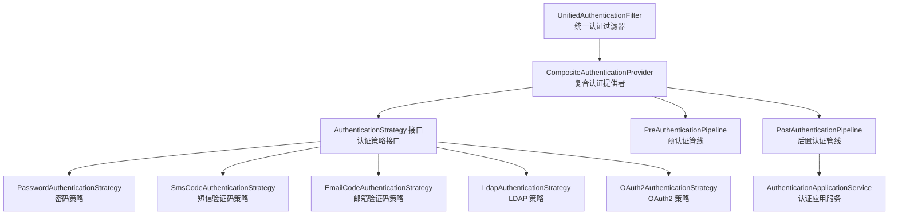

图表来源
- [UnifiedAuthenticationFilter.java:18-79](file://iam-auth-server/src/main/java/iam/platform/auth/interfaces/web/filter/UnifiedAuthenticationFilter.java#L18-L79)
- [CompositeAuthenticationProvider.java:24-74](file://iam-auth-server/src/main/java/iam/platform/auth/application/service/CompositeAuthenticationProvider.java#L24-L74)
- [AuthenticationStrategy.java:11-40](file://iam-auth-server/src/main/java/iam/platform/auth/domain/service/AuthenticationStrategy.java#L11-L40)
- [PreAuthenticationPipeline.java:16-60](file://iam-auth-server/src/main/java/iam/platform/auth/application/service/pipeline/PreAuthenticationPipeline.java#L16-L60)
- [PostAuthenticationPipeline.java:18-30](file://iam-auth-server/src/main/java/iam/platform/auth/application/service/pipeline/PostAuthenticationPipeline.java#L18-L30)
- [AuthenticationApplicationService.java:30-111](file://iam-auth-server/src/main/java/iam/platform/auth/application/service/AuthenticationApplicationService.java#L30-L111)

章节来源
- [UnifiedAuthenticationFilter.java:18-79](file://iam-auth-server/src/main/java/iam/platform/auth/interfaces/web/filter/UnifiedAuthenticationFilter.java#L18-L79)
- [CompositeAuthenticationProvider.java:24-74](file://iam-auth-server/src/main/java/iam/platform/auth/application/service/CompositeAuthenticationProvider.java#L24-L74)
- [AuthenticationStrategy.java:11-40](file://iam-auth-server/src/main/java/iam/platform/auth/domain/service/AuthenticationStrategy.java#L11-L40)
- [PreAuthenticationPipeline.java:16-60](file://iam-auth-server/src/main/java/iam/platform/auth/application/service/pipeline/PreAuthenticationPipeline.java#L16-L60)
- [PostAuthenticationPipeline.java:18-30](file://iam-auth-server/src/main/java/iam/platform/auth/application/service/pipeline/PostAuthenticationPipeline.java#L18-L30)
- [AuthenticationApplicationService.java:30-111](file://iam-auth-server/src/main/java/iam/platform/auth/application/service/AuthenticationApplicationService.java#L30-L111)

## 核心组件
- 统一认证令牌：承载未认证态的原始凭据或认证态的人员信息与认证方式。
- 统一认证过滤器：统一入口，解析表单参数，构造统一令牌并交由认证管理器处理。
- 复合认证提供者：按凭据类型选择对应策略，执行预认证管线，调用策略认证，产出统一认证令牌。
- 认证策略接口：定义方法枚举、支持判定、认证执行与是否重定向型方法的约定。
- 预/后置认证管线：预认证阶段执行限流、锁账号、白名单等；后置阶段装配权限、写入上下文、生成结果。
- 认证应用服务：完成租户选择、权限装载、上下文注入与最终认证结果组装。

章节来源
- [UnifiedAuthenticationToken.java:17-67](file://iam-auth-server/src/main/java/iam/platform/auth/domain/model/valueobject/UnifiedAuthenticationToken.java#L17-L67)
- [UnifiedAuthenticationFilter.java:31-78](file://iam-auth-server/src/main/java/iam/platform/auth/interfaces/web/filter/UnifiedAuthenticationFilter.java#L31-L78)
- [CompositeAuthenticationProvider.java:31-68](file://iam-auth-server/src/main/java/iam/platform/auth/application/service/CompositeAuthenticationProvider.java#L31-L68)
- [AuthenticationStrategy.java:11-40](file://iam-auth-server/src/main/java/iam/platform/auth/domain/service/AuthenticationStrategy.java#L11-L40)
- [PreAuthenticationPipeline.java:26-59](file://iam-auth-server/src/main/java/iam/platform/auth/application/service/pipeline/PreAuthenticationPipeline.java#L26-L59)
- [PostAuthenticationPipeline.java:22-29](file://iam-auth-server/src/main/java/iam/platform/auth/application/service/pipeline/PostAuthenticationPipeline.java#L22-L29)
- [AuthenticationApplicationService.java:42-111](file://iam-auth-server/src/main/java/iam/platform/auth/application/service/AuthenticationApplicationService.java#L42-L111)

## 架构总览
统一认证流程概览如下：

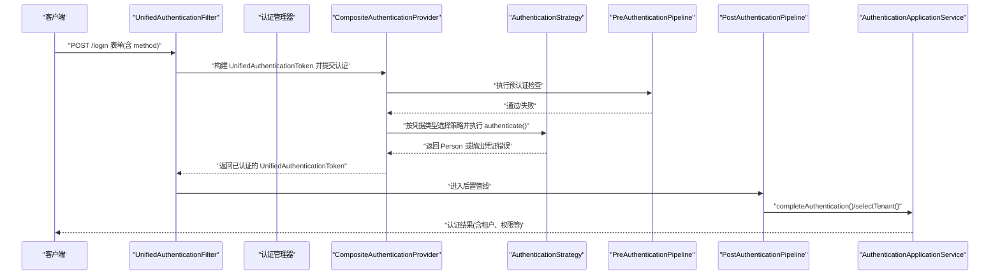

图表来源
- [UnifiedAuthenticationFilter.java:31-38](file://iam-auth-server/src/main/java/iam/platform/auth/interfaces/web/filter/UnifiedAuthenticationFilter.java#L31-L38)
- [CompositeAuthenticationProvider.java:31-68](file://iam-auth-server/src/main/java/iam/platform/auth/application/service/CompositeAuthenticationProvider.java#L31-L68)
- [PreAuthenticationPipeline.java:26-31](file://iam-auth-server/src/main/java/iam/platform/auth/application/service/pipeline/PreAuthenticationPipeline.java#L26-L31)
- [PostAuthenticationPipeline.java:22-29](file://iam-auth-server/src/main/java/iam/platform/auth/application/service/pipeline/PostAuthenticationPipeline.java#L22-L29)
- [AuthenticationApplicationService.java:42-111](file://iam-auth-server/src/main/java/iam/platform/auth/application/service/AuthenticationApplicationService.java#L42-L111)

## 详细组件分析

### 统一认证令牌与过滤器
- 统一令牌在未认证态持有原始凭据，在已认证态持有 Person、认证方式与权限集合。
- 统一过滤器解析表单参数，依据 method 字段构造不同类型的凭据对象，封装为统一令牌并提交认证。

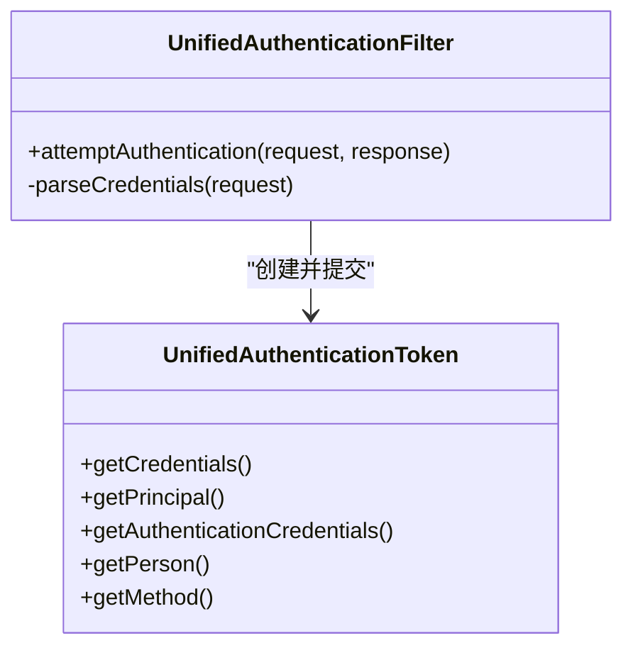

图表来源
- [UnifiedAuthenticationToken.java:17-67](file://iam-auth-server/src/main/java/iam/platform/auth/domain/model/valueobject/UnifiedAuthenticationToken.java#L17-L67)
- [UnifiedAuthenticationFilter.java:31-78](file://iam-auth-server/src/main/java/iam/platform/auth/interfaces/web/filter/UnifiedAuthenticationFilter.java#L31-L78)

章节来源
- [UnifiedAuthenticationToken.java:17-67](file://iam-auth-server/src/main/java/iam/platform/auth/domain/model/valueobject/UnifiedAuthenticationToken.java#L17-L67)
- [UnifiedAuthenticationFilter.java:31-78](file://iam-auth-server/src/main/java/iam/platform/auth/interfaces/web/filter/UnifiedAuthenticationFilter.java#L31-L78)

### 复合认证提供者与策略分发
- 复合提供者收集所有策略 Bean，按凭据类型匹配首个支持的策略，执行预认证管线，调用策略认证，记录成功/失败并返回统一令牌。
- 支持判定由各策略实现的 supports 方法决定。

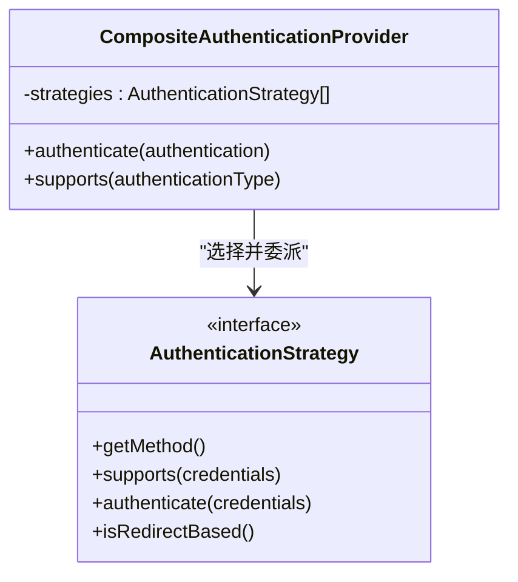

图表来源
- [CompositeAuthenticationProvider.java:24-74](file://iam-auth-server/src/main/java/iam/platform/auth/application/service/CompositeAuthenticationProvider.java#L24-L74)
- [AuthenticationStrategy.java:11-40](file://iam-auth-server/src/main/java/iam/platform/auth/domain/service/AuthenticationStrategy.java#L11-L40)

章节来源
- [CompositeAuthenticationProvider.java:31-68](file://iam-auth-server/src/main/java/iam/platform/auth/application/service/CompositeAuthenticationProvider.java#L31-L68)
- [AuthenticationStrategy.java:11-40](file://iam-auth-server/src/main/java/iam/platform/auth/domain/service/AuthenticationStrategy.java#L11-L40)

### 预/后置认证管线
- 预认证管线顺序执行各处理器，用于限流、账户锁定、IP 白名单、状态校验等。
- 后置管线顺序执行处理器，用于权限加载、审计事件、会话建立、上下文注入与结果组装。

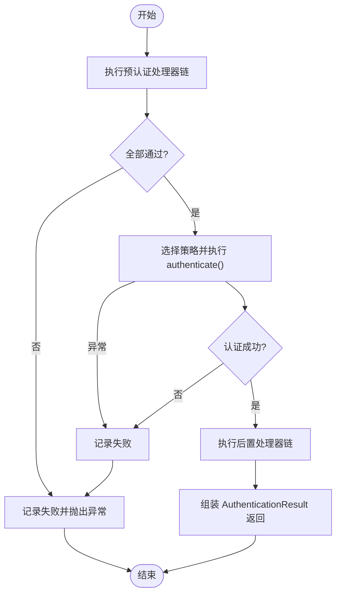

图表来源
- [PreAuthenticationPipeline.java:26-59](file://iam-auth-server/src/main/java/iam/platform/auth/application/service/pipeline/PreAuthenticationPipeline.java#L26-L59)
- [PostAuthenticationPipeline.java:22-29](file://iam-auth-server/src/main/java/iam/platform/auth/application/service/pipeline/PostAuthenticationPipeline.java#L22-L29)

章节来源
- [PreAuthenticationPipeline.java:26-59](file://iam-auth-server/src/main/java/iam/platform/auth/application/service/pipeline/PreAuthenticationPipeline.java#L26-L59)
- [PostAuthenticationPipeline.java:22-29](file://iam-auth-server/src/main/java/iam/platform/auth/application/service/pipeline/PostAuthenticationPipeline.java#L22-L29)

### 密码认证策略
- 触发条件：method=password，表单包含 username 与 password。
- 验证流程：按用户名查询人员，比对 BCrypt 密码哈希，成功则返回 Person。
- 安全机制：密码不落地存储，仅保存哈希；仅适用于高信任客户端；OAuth2 场景推荐 authorization_code + PKCE。

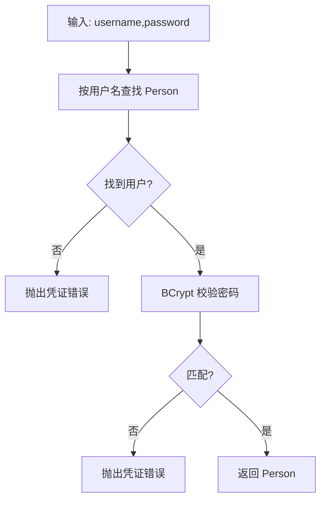

图表来源
- [PasswordAuthenticationStrategy.java:42-62](file://iam-auth-server/src/main/java/iam/platform/auth/domain/service/impl/PasswordAuthenticationStrategy.java#L42-L62)

章节来源
- [PasswordAuthenticationStrategy.java:26-62](file://iam-auth-server/src/main/java/iam/platform/auth/domain/service/impl/PasswordAuthenticationStrategy.java#L26-L62)
- [AuthenticationMethod.java:6-8](file://iam-auth-server/src/main/java/iam/platform/auth/domain/model/enums/AuthenticationMethod.java#L6-L8)

### 短信验证码认证策略
- 触发条件：method=sms，表单包含 phone 与 code。
- 验证流程：调用验证码服务校验短信验证码有效性，校验通过则按手机号查找或创建 Person。
- 安全机制：验证码时效控制、失败计数与限流联动。

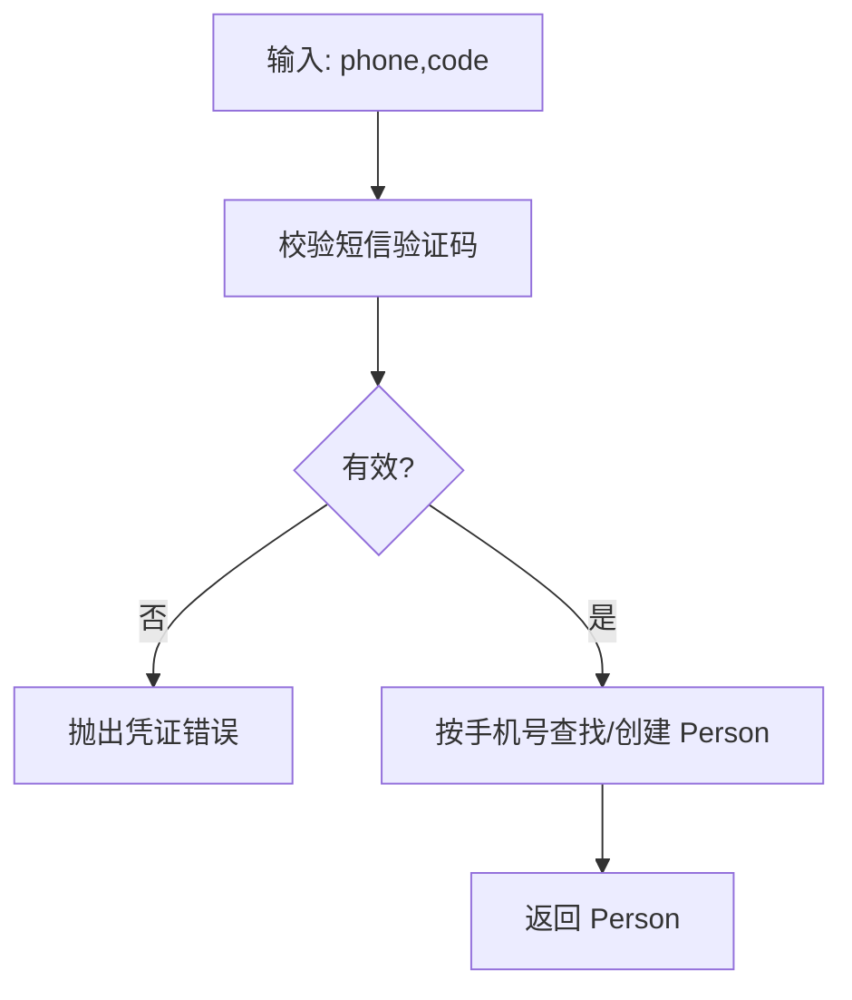

图表来源
- [SmsCodeAuthenticationStrategy.java:28-38](file://iam-auth-server/src/main/java/iam/platform/auth/domain/service/impl/SmsCodeAuthenticationStrategy.java#L28-L38)

章节来源
- [SmsCodeAuthenticationStrategy.java:14-39](file://iam-auth-server/src/main/java/iam/platform/auth/domain/service/impl/SmsCodeAuthenticationStrategy.java#L14-L39)
- [AuthenticationMethod.java:6-8](file://iam-auth-server/src/main/java/iam/platform/auth/domain/model/enums/AuthenticationMethod.java#L6-L8)

### 邮箱验证码认证策略
- 触发条件：method=email，表单包含 email 与 code。
- 验证流程：调用验证码服务校验邮箱验证码有效性，校验通过则按邮箱查找或创建 Person。
- 安全机制：验证码时效控制、失败计数与限流联动。

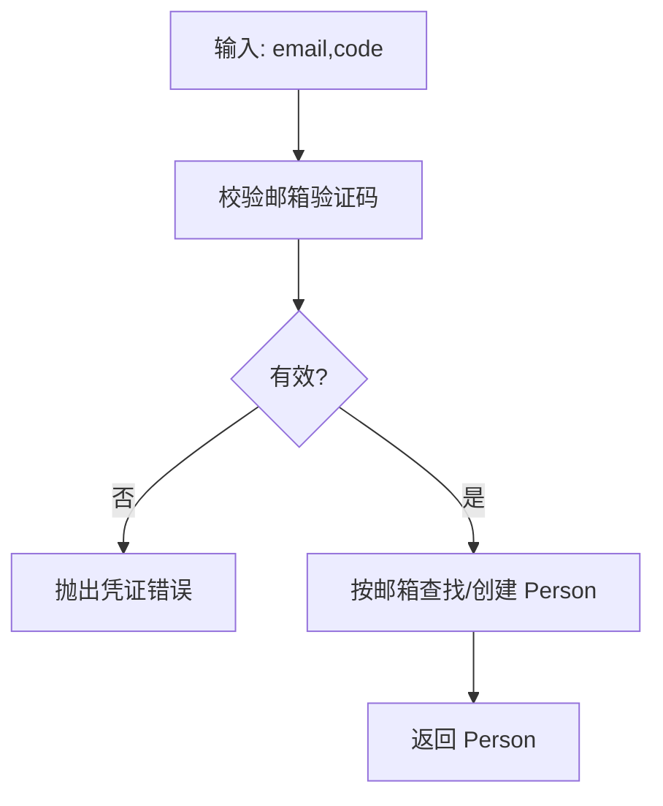

图表来源
- [EmailCodeAuthenticationStrategy.java:28-38](file://iam-auth-server/src/main/java/iam/platform/auth/domain/service/impl/EmailCodeAuthenticationStrategy.java#L28-L38)

章节来源
- [EmailCodeAuthenticationStrategy.java:14-39](file://iam-auth-server/src/main/java/iam/platform/auth/domain/service/impl/EmailCodeAuthenticationStrategy.java#L14-L39)
- [AuthenticationMethod.java:6-8](file://iam-auth-server/src/main/java/iam/platform/auth/domain/model/enums/AuthenticationMethod.java#L6-L8)

### LDAP 集成策略
- 触发条件：method=ldap，表单包含 username、password、可选 domain。
- 验证流程：根据配置构建用户 DN，使用 LDAPS/SSL 执行绑定认证；成功后在本地查找或创建 Person。
- 安全机制：生产环境必须使用 LDAPS；密码不落库，每次均与目录服务器校验；遵循域账户策略。

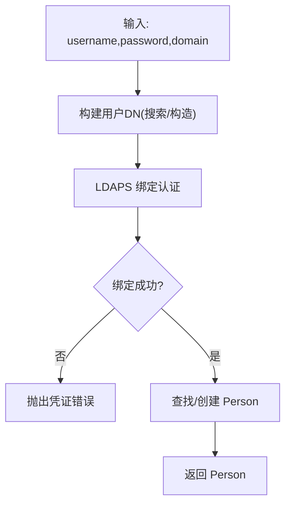

图表来源
- [LdapAuthenticationStrategy.java:46-75](file://iam-auth-server/src/main/java/iam/platform/auth/domain/service/impl/LdapAuthenticationStrategy.java#L46-L75)
- [LdapAuthenticationStrategy.java:77-101](file://iam-auth-server/src/main/java/iam/platform/auth/domain/service/impl/LdapAuthenticationStrategy.java#L77-L101)
- [LdapAuthenticationStrategy.java:103-130](file://iam-auth-server/src/main/java/iam/platform/auth/domain/service/impl/LdapAuthenticationStrategy.java#L103-L130)

章节来源
- [LdapAuthenticationStrategy.java:27-136](file://iam-auth-server/src/main/java/iam/platform/auth/domain/service/impl/LdapAuthenticationStrategy.java#L27-L136)
- [AuthenticationMethod.java:6-8](file://iam-auth-server/src/main/java/iam/platform/auth/domain/model/enums/AuthenticationMethod.java#L6-L8)

### 第三方 OAuth2 策略
- 触发条件：外部回调携带授权码，解析为 OAuth2Credentials。
- 验证流程：由外部 OAuth2 提供商完成凭证校验，此处仅映射提供商与 Person。
- 选择逻辑：根据 registrationId 动态映射至 OAUTH2_DINGTALK 或 OAUTH2_WECOM。
- 安全机制：基于已认证的外部身份源，内部仅做映射与上下文装配。

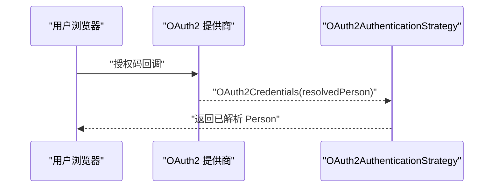

图表来源
- [OAuth2AuthenticationStrategy.java:30-37](file://iam-auth-server/src/main/java/iam/platform/auth/domain/service/impl/OAuth2AuthenticationStrategy.java#L30-L37)
- [OAuth2AuthenticationStrategy.java:47-53](file://iam-auth-server/src/main/java/iam/platform/auth/domain/service/impl/OAuth2AuthenticationStrategy.java#L47-L53)

章节来源
- [OAuth2AuthenticationStrategy.java:15-54](file://iam-auth-server/src/main/java/iam/platform/auth/domain/service/impl/OAuth2AuthenticationStrategy.java#L15-L54)
- [AuthenticationMethod.java:6-8](file://iam-auth-server/src/main/java/iam/platform/auth/domain/model/enums/AuthenticationMethod.java#L6-L8)

### 租户选择与认证结果
- 在统一成功处理器中调用认证应用服务完成租户选择与权限装配，构建带租户与权限的认证结果。
- 将当前人员、租户、租户账户写入上下文并可写入会话。

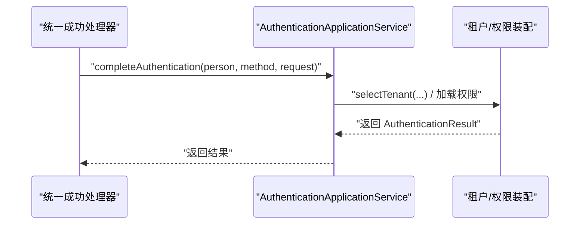

图表来源
- [AuthenticationApplicationService.java:42-111](file://iam-auth-server/src/main/java/iam/platform/auth/application/service/AuthenticationApplicationService.java#L42-L111)

章节来源
- [AuthenticationApplicationService.java:42-111](file://iam-auth-server/src/main/java/iam/platform/auth/application/service/AuthenticationApplicationService.java#L42-L111)

## 依赖分析
- 组件内聚与耦合
  - 统一过滤器与令牌解耦于具体策略，通过策略接口与管线实现松耦合。
  - 复合提供者依赖策略集合，预/后置管线依赖处理器集合，具备良好扩展性。
- 外部依赖
  - LDAP 策略依赖目录服务与配置；验证码策略依赖验证码服务；OAuth2 策略依赖外部身份提供商。
- 可能的循环依赖
  - 当前结构以接口与抽象类为主，未见直接循环依赖迹象。

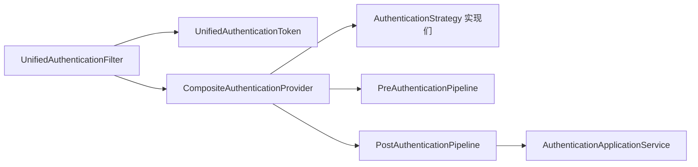

图表来源
- [UnifiedAuthenticationFilter.java:31-38](file://iam-auth-server/src/main/java/iam/platform/auth/interfaces/web/filter/UnifiedAuthenticationFilter.java#L31-L38)
- [CompositeAuthenticationProvider.java:28-62](file://iam-auth-server/src/main/java/iam/platform/auth/application/service/CompositeAuthenticationProvider.java#L28-L62)
- [PostAuthenticationPipeline.java:20-29](file://iam-auth-server/src/main/java/iam/platform/auth/application/service/pipeline/PostAuthenticationPipeline.java#L20-L29)
- [AuthenticationApplicationService.java:32-45](file://iam-auth-server/src/main/java/iam/platform/auth/application/service/AuthenticationApplicationService.java#L32-L45)

章节来源
- [CompositeAuthenticationProvider.java:24-74](file://iam-auth-server/src/main/java/iam/platform/auth/application/service/CompositeAuthenticationProvider.java#L24-L74)
- [PostAuthenticationPipeline.java:18-30](file://iam-auth-server/src/main/java/iam/platform/auth/application/service/pipeline/PostAuthenticationPipeline.java#L18-L30)
- [AuthenticationApplicationService.java:30-45](file://iam-auth-server/src/main/java/iam/platform/auth/application/service/AuthenticationApplicationService.java#L30-L45)

## 性能考虑
- 策略选择与认证
  - 使用流式筛选策略，确保策略注册顺序合理，避免不必要的尝试。
  - 预认证管线中的限流与锁账号应尽量轻量且可缓存。
- 数据访问
  - 用户查询与权限加载应使用缓存与批量查询减少数据库压力。
- 外部集成
  - LDAP/验证码/第三方 OAuth2 调用需设置超时与熔断，避免阻塞主流程。
- 令牌与会话
  - 统一令牌仅在必要时携带敏感信息，会话中存储最小上下文。

## 故障排查指南
- 常见错误与定位
  - 凭证缺失或格式错误：统一过滤器会校验必填参数，缺失时报错。
  - 无匹配策略：当 method 不被识别或策略未注册时，报“无认证策略”。
  - 凭证无效：密码错误、验证码过期、LDAP 绑定失败等均抛出凭证错误。
  - 账户状态异常：预认证管线可能因账户锁定、禁用等前置失败。
- 日志与审计
  - 预/后置管线记录成功/失败，便于追踪认证路径与失败原因。
- 快速修复建议
  - 检查 method 参数与表单字段是否正确。
  - 核对策略 Bean 是否被 Spring 发现与加载。
  - 核对验证码服务可用性与有效期配置。
  - 核对 LDAP 连接地址、SSL 与搜索基 DN 配置。

章节来源
- [UnifiedAuthenticationFilter.java:43-71](file://iam-auth-server/src/main/java/iam/platform/auth/interfaces/web/filter/UnifiedAuthenticationFilter.java#L43-L71)
- [CompositeAuthenticationProvider.java:48-52](file://iam-auth-server/src/main/java/iam/platform/auth/application/service/CompositeAuthenticationProvider.java#L48-L52)
- [PreAuthenticationPipeline.java:36-59](file://iam-auth-server/src/main/java/iam/platform/auth/application/service/pipeline/PreAuthenticationPipeline.java#L36-L59)

## 结论
该认证体系通过统一入口、策略接口与管线处理实现了高扩展性与安全性。密码、短信、邮箱、LDAP 与 OAuth2 等多种认证方式均可无缝接入，配合预/后置管线完成完整的认证生命周期管理。建议在生产环境中严格启用限流、锁账号、白名单与审计等安全措施，并针对外部依赖设置合理的超时与熔断策略。

## 附录

### 认证策略选择逻辑与优先级
- 选择逻辑
  - 统一过滤器根据 method 参数确定凭据类型。
  - 复合提供者按注册顺序筛选首个 supports(credentials) 的策略。
- 优先级建议
  - 将最常用策略置于前面，减少匹配轮询次数。
  - 对高风险策略（如密码）与低风险策略（如验证码）区分对待，分别配置预认证规则。

章节来源
- [UnifiedAuthenticationFilter.java:43-62](file://iam-auth-server/src/main/java/iam/platform/auth/interfaces/web/filter/UnifiedAuthenticationFilter.java#L43-L62)
- [CompositeAuthenticationProvider.java:48-52](file://iam-auth-server/src/main/java/iam/platform/auth/application/service/CompositeAuthenticationProvider.java#L48-L52)

### 扩展接口与自定义策略开发规范
- 开发步骤
  - 实现 AuthenticationStrategy 接口，定义 getMethod()、supports()、authenticate()。
  - 在 authenticate() 中完成凭据校验与用户解析，必要时抛出凭证错误。
  - 如为重定向型（如 OAuth2），覆写 isRedirectBased() 返回 true。
  - 将实现注册为 Spring Bean，确保被自动发现。
- 最佳实践
  - 明确 method 枚举值与前端 method 参数一致。
  - 在预认证管线中补充必要的前置检查（限流、白名单、状态校验）。
  - 对外部依赖设置超时与降级策略。
  - 记录关键日志以便审计与排障。

章节来源
- [AuthenticationStrategy.java:11-40](file://iam-auth-server/src/main/java/iam/platform/auth/domain/service/AuthenticationStrategy.java#L11-L40)
- [OAuth2AuthenticationStrategy.java:39-42](file://iam-auth-server/src/main/java/iam/platform/auth/domain/service/impl/OAuth2AuthenticationStrategy.java#L39-L42)

### 配置示例与安全防护要点
- 配置要点（示意）
  - 统一登录端点与表单字段：method、username/password、phone/code、email/code、domain。
  - OAuth2 回调与提供商注册 ID：与策略映射一致。
  - LDAP 连接：URL、SSL、基础 DN、用户搜索基与过滤器。
  - 验证码服务：有效期、发送通道与校验阈值。
- 安全防护
  - 生产环境强制 LDAPS；密码使用强哈希；验证码时效与失败阈值。
  - 限制登录尝试频率，启用账户锁定与白名单。
  - 审计日志记录认证路径与结果，保留足够上下文信息。

章节来源
- [UnifiedAuthenticationFilter.java:43-62](file://iam-auth-server/src/main/java/iam/platform/auth/interfaces/web/filter/UnifiedAuthenticationFilter.java#L43-L62)
- [LdapAuthenticationStrategy.java:106-130](file://iam-auth-server/src/main/java/iam/platform/auth/domain/service/impl/LdapAuthenticationStrategy.java#L106-L130)
- [OAuth2AuthenticationStrategy.java:47-53](file://iam-auth-server/src/main/java/iam/platform/auth/domain/service/impl/OAuth2AuthenticationStrategy.java#L47-L53)