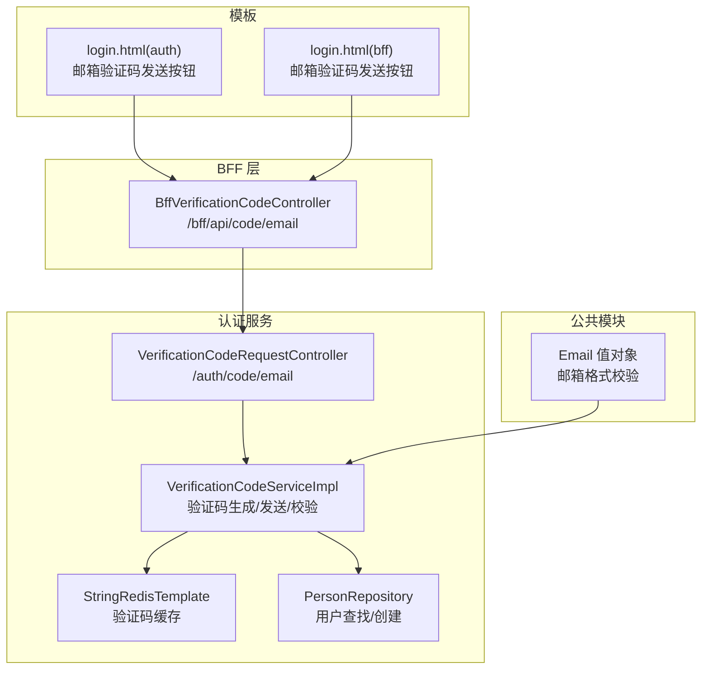
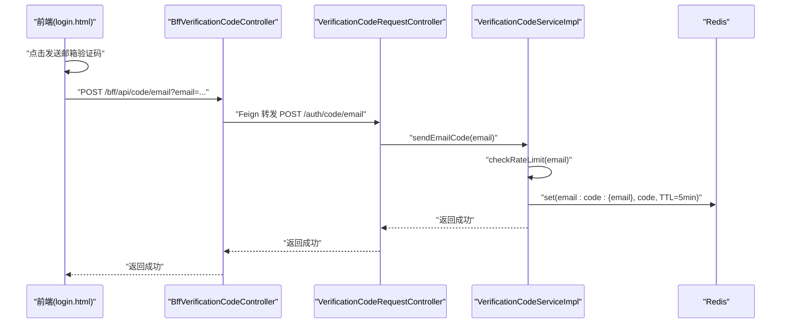
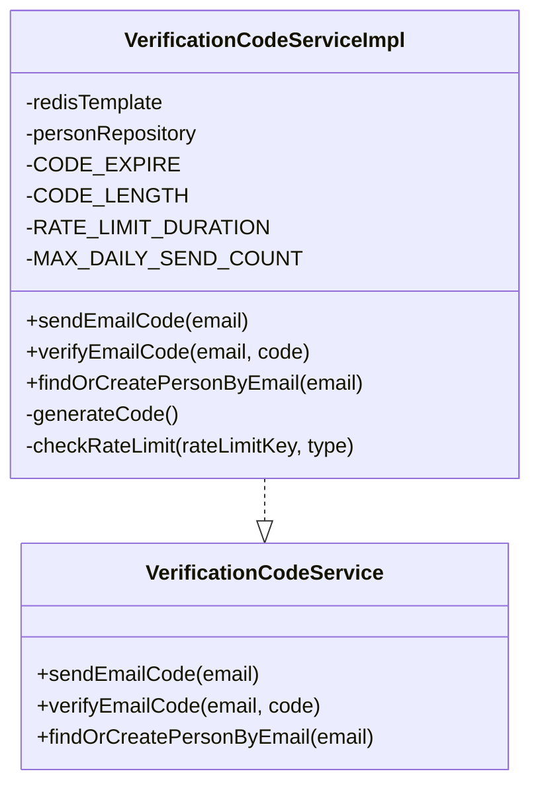
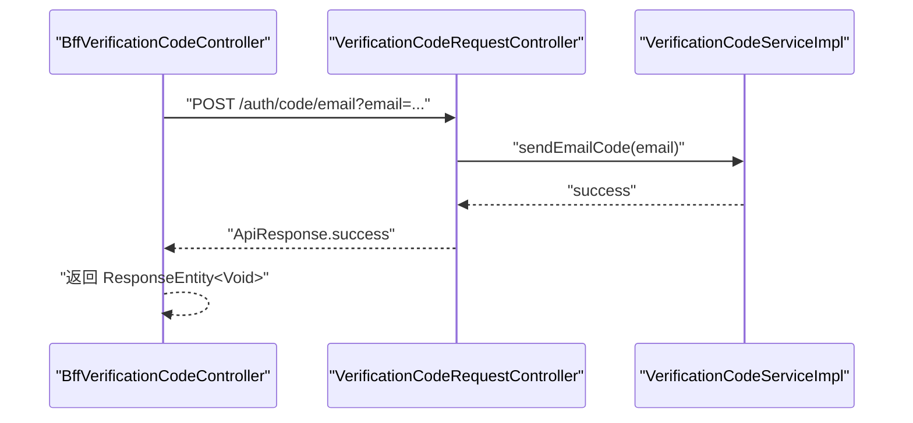
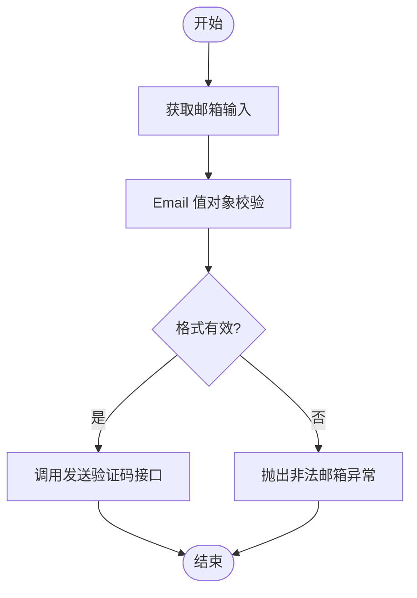
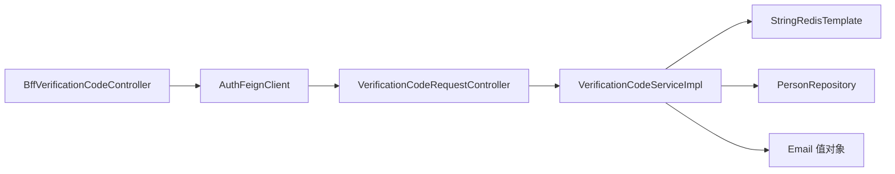

# 邮箱验证码认证

<cite>
**本文引用的文件**
- [VerificationCodeService.java](file://iam-auth-server/src/main/java/iam/platform/auth/domain/service/VerificationCodeService.java)
- [VerificationCodeServiceImpl.java](file://iam-auth-server/src/main/java/iam/platform/auth/domain/service/impl/VerificationCodeServiceImpl.java)
- [VerificationCodeRequestController.java](file://iam-auth-server/src/main/java/iam/platform/auth/interfaces/rest/VerificationCodeRequestController.java)
- [BffVerificationCodeController.java](file://iam-bff-server/src/main/java/iam/platform/bff/interfaces/rest/BffVerificationCodeController.java)
- [application.yml](file://iam-auth-server/src/main/resources/application.yml)
- [application-dev.yml](file://iam-auth-server/src/main/resources/application-dev.yml)
- [Email.java](file://iam-common/src/main/java/iam/platform/common/model/valueobject/Email.java)
- [login.html（auth）](file://iam-auth-server/src/main/resources/templates/login.html)
- [login.html（bff）](file://iam-bff-server/src/main/resources/templates/login.html)
- [RedisConfig.java](file://iam-auth-server/src/main/java/iam/platform/auth/infrastructure/config/RedisConfig.java)
- [RedisBasedRateLimiter.java](file://iam-auth-server/src/main/java/iam/platform/auth/infrastructure/security/RedisBasedRateLimiter.java)
- [SecurityPolicyProperties.java](file://iam-auth-server/src/main/java/iam/platform/auth/infrastructure/config/SecurityPolicyProperties.java)
- [LoginController.java](file://iam-auth-server/src/main/java/iam/platform/auth/interfaces/web/LoginController.java)
- [AuthenticationController.java](file://iam-auth-server/src/main/java/iam/platform/auth/interfaces/rest/AuthenticationController.java)
- [redis.conf](file://redis/redis.conf)
</cite>

## 目录
1. [简介](#简介)
2. [项目结构](#项目结构)
3. [核心组件](#核心组件)
4. [架构总览](#架构总览)
5. [详细组件分析](#详细组件分析)
6. [依赖关系分析](#依赖关系分析)
7. [性能考虑](#性能考虑)
8. [故障排查指南](#故障排查指南)
9. [结论](#结论)
10. [附录](#附录)

## 简介
本文件系统性地文档化了基于邮箱验证码的身份认证策略与实现，覆盖以下关键主题：
- 邮箱验证码的触发条件与前端交互流程
- 邮箱格式校验与验证码生成、存储、有效期管理
- SMTP 集成与邮件模板设计（当前为开发态日志输出，生产需接入真实邮件服务）
- 发送频率限制、每日上限与验证码生命周期管理
- 安全机制：防垃圾邮件、重复发送防护、账户安全策略联动
- 性能优化、失败重试与监控告警建议
- 实际代码示例路径，便于快速定位与落地

## 项目结构
围绕邮箱验证码认证的关键模块分布如下：
- 认证服务（iam-auth-server）
  - 领域服务：验证码生成、发送、校验与用户查找/创建
  - 接口层：REST 控制器对外暴露获取验证码接口
  - 配置：应用配置、Redis 配置、安全策略
- BFF 层（iam-bff-server）
  - 对外暴露 BFF 接口，并通过 Feign 转发至认证服务
- 公共模块（iam-common）
  - 邮箱值对象与通用模型
- 模板资源（Thymeleaf）
  - 登录页包含邮箱验证码发送按钮与切换逻辑

**图表来源**
- [BffVerificationCodeController.java:1-39](file://iam-bff-server/src/main/java/iam/platform/bff/interfaces/rest/BffVerificationCodeController.java#L1-L39)
- [VerificationCodeRequestController.java:1-31](file://iam-auth-server/src/main/java/iam/platform/auth/interfaces/rest/VerificationCodeRequestController.java#L1-L31)
- [VerificationCodeServiceImpl.java:1-153](file://iam-auth-server/src/main/java/iam/platform/auth/domain/service/impl/VerificationCodeServiceImpl.java#L1-L153)
- [RedisConfig.java:26-35](file://iam-auth-server/src/main/java/iam/platform/auth/infrastructure/config/RedisConfig.java#L26-L35)
- [Email.java:1-30](file://iam-common/src/main/java/iam/platform/common/model/valueobject/Email.java#L1-L30)
- [login.html（auth）:270-343](file://iam-auth-server/src/main/resources/templates/login.html#L270-L343)
- [login.html（bff）:267-340](file://iam-bff-server/src/main/resources/templates/login.html#L267-L340)

**章节来源**
- [VerificationCodeRequestController.java:1-31](file://iam-auth-server/src/main/java/iam/platform/auth/interfaces/rest/VerificationCodeRequestController.java#L1-L31)
- [BffVerificationCodeController.java:1-39](file://iam-bff-server/src/main/java/iam/platform/bff/interfaces/rest/BffVerificationCodeController.java#L1-L39)
- [VerificationCodeServiceImpl.java:1-153](file://iam-auth-server/src/main/java/iam/platform/auth/domain/service/impl/VerificationCodeServiceImpl.java#L1-L153)
- [application.yml:72-80](file://iam-auth-server/src/main/resources/application.yml#L72-L80)
- [application-dev.yml:17-22](file://iam-auth-server/src/main/resources/application-dev.yml#L17-L22)
- [Email.java:1-30](file://iam-common/src/main/java/iam/platform/common/model/valueobject/Email.java#L1-L30)
- [login.html（auth）:270-343](file://iam-auth-server/src/main/resources/templates/login.html#L270-L343)
- [login.html（bff）:267-340](file://iam-bff-server/src/main/resources/templates/login.html#L267-L340)

## 核心组件
- 验证码服务接口与实现
  - 提供发送邮箱验证码、校验邮箱验证码、按邮箱查找或创建用户等能力
  - 内置验证码长度、过期时间、发送频率限制与每日上限
- BFF 控制器
  - 对外暴露 /bff/api/code/email 接口，内部通过 Feign 调用认证服务
- 应用配置
  - verification-code.email.enabled 与 from 字段控制邮箱验证码开关与发件人
- 邮箱值对象
  - 提供邮箱格式校验，非法格式直接抛异常
- 登录模板
  - 前端提供“发送邮箱验证码”按钮与方法切换逻辑

**章节来源**
- [VerificationCodeService.java:1-21](file://iam-auth-server/src/main/java/iam/platform/auth/domain/service/VerificationCodeService.java#L1-L21)
- [VerificationCodeServiceImpl.java:1-153](file://iam-auth-server/src/main/java/iam/platform/auth/domain/service/impl/VerificationCodeServiceImpl.java#L1-L153)
- [BffVerificationCodeController.java:1-39](file://iam-bff-server/src/main/java/iam/platform/bff/interfaces/rest/BffVerificationCodeController.java#L1-L39)
- [application.yml:72-80](file://iam-auth-server/src/main/resources/application.yml#L72-L80)
- [application-dev.yml:17-22](file://iam-auth-server/src/main/resources/application-dev.yml#L17-L22)
- [Email.java:1-30](file://iam-common/src/main/java/iam/platform/common/model/valueobject/Email.java#L1-L30)
- [login.html（auth）:270-343](file://iam-auth-server/src/main/resources/templates/login.html#L270-L343)
- [login.html（bff）:267-340](file://iam-bff-server/src/main/resources/templates/login.html#L267-L340)

## 架构总览
邮箱验证码认证的整体流程如下：
- 前端在登录页点击“发送邮箱验证码”，选择邮箱方式
- BFF 接收请求并转发至认证服务
- 认证服务执行频率限制与每日上限检查
- 生成 6 位数字验证码并写入 Redis（默认 5 分钟过期）
- 当前为开发态：记录日志；生产态：应通过真实邮件服务发送
- 用户输入验证码后，提交统一登录表单完成认证

**图表来源**
- [login.html（auth）:270-343](file://iam-auth-server/src/main/resources/templates/login.html#L270-L343)
- [login.html（bff）:267-340](file://iam-bff-server/src/main/resources/templates/login.html#L267-L340)
- [BffVerificationCodeController.java:1-39](file://iam-bff-server/src/main/java/iam/platform/bff/interfaces/rest/BffVerificationCodeController.java#L1-L39)
- [VerificationCodeRequestController.java:1-31](file://iam-auth-server/src/main/java/iam/platform/auth/interfaces/rest/VerificationCodeRequestController.java#L1-L31)
- [VerificationCodeServiceImpl.java:44-55](file://iam-auth-server/src/main/java/iam/platform/auth/domain/service/impl/VerificationCodeServiceImpl.java#L44-L55)

## 详细组件分析

### 验证码服务接口与实现
- 功能职责
  - 发送邮箱验证码：执行频率限制与每日上限检查，生成验证码并写入 Redis
  - 校验邮箱验证码：读取 Redis 中的验证码并与用户输入比对，匹配则删除键
  - 用户查找/创建：按邮箱查找或创建用户实体
- 关键参数
  - 验证码长度：6 位数字
  - 过期时间：5 分钟
  - 单次发送频率限制：每分钟仅允许一次
  - 每日上限：默认 10 次
- 安全要点
  - 验证码过期即失效，避免重放
  - 成功校验后立即删除键，降低泄露风险
  - 结合统一认证的失败计数与锁定策略，形成多层防护

**图表来源**
- [VerificationCodeService.java:1-21](file://iam-auth-server/src/main/java/iam/platform/auth/domain/service/VerificationCodeService.java#L1-L21)
- [VerificationCodeServiceImpl.java:1-153](file://iam-auth-server/src/main/java/iam/platform/auth/domain/service/impl/VerificationCodeServiceImpl.java#L1-L153)

**章节来源**
- [VerificationCodeService.java:1-21](file://iam-auth-server/src/main/java/iam/platform/auth/domain/service/VerificationCodeService.java#L1-L21)
- [VerificationCodeServiceImpl.java:22-27](file://iam-auth-server/src/main/java/iam/platform/auth/domain/service/impl/VerificationCodeServiceImpl.java#L22-L27)
- [VerificationCodeServiceImpl.java:44-55](file://iam-auth-server/src/main/java/iam/platform/auth/domain/service/impl/VerificationCodeServiceImpl.java#L44-L55)
- [VerificationCodeServiceImpl.java:77-95](file://iam-auth-server/src/main/java/iam/platform/auth/domain/service/impl/VerificationCodeServiceImpl.java#L77-L95)
- [VerificationCodeServiceImpl.java:125-151](file://iam-auth-server/src/main/java/iam/platform/auth/domain/service/impl/VerificationCodeServiceImpl.java#L125-L151)

### BFF 控制器与认证服务控制器
- BFF 层
  - 对外暴露 /bff/api/code/email，内部通过 Feign 调用认证服务
- 认证服务层
  - 对外暴露 /auth/code/email，接收邮箱参数并调用领域服务
- 交互流程
  - BFF 将请求转发至认证服务，认证服务执行业务规则并返回结果

**图表来源**
- [BffVerificationCodeController.java:24-37](file://iam-bff-server/src/main/java/iam/platform/bff/interfaces/rest/BffVerificationCodeController.java#L24-L37)
- [VerificationCodeRequestController.java:25-29](file://iam-auth-server/src/main/java/iam/platform/auth/interfaces/rest/VerificationCodeRequestController.java#L25-L29)
- [VerificationCodeServiceImpl.java:44-55](file://iam-auth-server/src/main/java/iam/platform/auth/domain/service/impl/VerificationCodeServiceImpl.java#L44-L55)

**章节来源**
- [BffVerificationCodeController.java:1-39](file://iam-bff-server/src/main/java/iam/platform/bff/interfaces/rest/BffVerificationCodeController.java#L1-L39)
- [VerificationCodeRequestController.java:1-31](file://iam-auth-server/src/main/java/iam/platform/auth/interfaces/rest/VerificationCodeRequestController.java#L1-L31)

### 邮箱格式验证与模板交互
- 邮箱格式验证
  - 使用 Email 值对象进行正则校验，非法格式直接抛出异常
- 前端交互
  - 登录页提供“发送邮箱验证码”按钮，支持在邮箱与手机号之间切换
  - 切换时更新隐藏字段标识当前验证码类型

**图表来源**
- [Email.java:19-24](file://iam-common/src/main/java/iam/platform/common/model/valueobject/Email.java#L19-L24)
- [login.html（auth）:280-288](file://iam-auth-server/src/main/resources/templates/login.html#L280-L288)
- [login.html（bff）:277-285](file://iam-bff-server/src/main/resources/templates/login.html#L277-L285)

**章节来源**
- [Email.java:1-30](file://iam-common/src/main/java/iam/platform/common/model/valueobject/Email.java#L1-L30)
- [login.html（auth）:270-343](file://iam-auth-server/src/main/resources/templates/login.html#L270-L343)
- [login.html（bff）:267-340](file://iam-bff-server/src/main/resources/templates/login.html#L267-L340)

### 配置与集成要点
- 验证码开关与发件人
  - verification-code.email.enabled 控制是否启用邮箱验证码
  - verification-code.email.from 设置发件人地址
- Redis 配置
  - 认证服务使用 StringRedisTemplate 存储验证码键值
  - Redis 作为验证码缓存与限流计数器
- 安全策略
  - 统一认证失败计数与锁定策略可与验证码发送策略协同
  - Redis 基于速率限制器用于失败尝试计数与窗口控制

**章节来源**
- [application.yml:72-80](file://iam-auth-server/src/main/resources/application.yml#L72-L80)
- [application-dev.yml:17-22](file://iam-auth-server/src/main/resources/application-dev.yml#L17-L22)
- [RedisConfig.java:26-35](file://iam-auth-server/src/main/java/iam/platform/auth/infrastructure/config/RedisConfig.java#L26-L35)
- [SecurityPolicyProperties.java:1-36](file://iam-auth-server/src/main/java/iam/platform/auth/infrastructure/config/SecurityPolicyProperties.java#L1-L36)
- [RedisBasedRateLimiter.java:66-123](file://iam-auth-server/src/main/java/iam/platform/auth/infrastructure/security/RedisBasedRateLimiter.java#L66-L123)

## 依赖关系分析
- 组件耦合
  - BFF 控制器依赖 Feign 客户端访问认证服务
  - 认证服务控制器依赖验证码服务实现
  - 验证码服务实现依赖 Redis 与用户仓储
- 外部依赖
  - Redis 用于验证码存储与限流
  - 邮件服务当前为开发态日志输出，生产需接入 SMTP

**图表来源**
- [BffVerificationCodeController.java:1-39](file://iam-bff-server/src/main/java/iam/platform/bff/interfaces/rest/BffVerificationCodeController.java#L1-L39)
- [VerificationCodeRequestController.java:1-31](file://iam-auth-server/src/main/java/iam/platform/auth/interfaces/rest/VerificationCodeRequestController.java#L1-L31)
- [VerificationCodeServiceImpl.java:1-153](file://iam-auth-server/src/main/java/iam/platform/auth/domain/service/impl/VerificationCodeServiceImpl.java#L1-L153)
- [Email.java:1-30](file://iam-common/src/main/java/iam/platform/common/model/valueobject/Email.java#L1-L30)

**章节来源**
- [BffVerificationCodeController.java:1-39](file://iam-bff-server/src/main/java/iam/platform/bff/interfaces/rest/BffVerificationCodeController.java#L1-L39)
- [VerificationCodeRequestController.java:1-31](file://iam-auth-server/src/main/java/iam/platform/auth/interfaces/rest/VerificationCodeRequestController.java#L1-L31)
- [VerificationCodeServiceImpl.java:1-153](file://iam-auth-server/src/main/java/iam/platform/auth/domain/service/impl/VerificationCodeServiceImpl.java#L1-L153)
- [Email.java:1-30](file://iam-common/src/main/java/iam/platform/common/model/valueobject/Email.java#L1-L30)

## 性能考虑
- 缓存与限流
  - 验证码使用 Redis 缓存，过期时间短，避免持久化压力
  - 发送频率限制与每日上限减少滥用与系统负载
- Redis 配置建议
  - 保证连接池大小与超时合理，避免阻塞
  - 针对验证码键设置合适的过期策略
- 日志与监控
  - 生产环境建议将验证码发送改为异步队列或消息中间件，结合监控指标（成功率、延迟、失败原因）进行告警
- 安全策略联动
  - 结合统一认证的失败计数与锁定策略，防止暴力破解

[本节为通用指导，不直接分析具体文件]

## 故障排查指南
- 常见问题与定位
  - 验证码未收到：确认 verification-code.email.enabled 与 email.from 是否正确配置；检查 Redis 连接与权限
  - 频繁发送被限制：检查 Redis 中是否存在 rate/daily 键；确认一分钟内是否重复请求
  - 验证码无效：确认验证码是否过期（默认 5 分钟）；核对用户输入是否一致
  - 邮箱格式错误：Email 值对象会直接抛出异常，检查输入格式
- 建议的日志与监控
  - 记录验证码生成、发送、校验、过期与失败事件
  - 对 Redis 操作失败、Feign 调用异常进行告警

**章节来源**
- [VerificationCodeServiceImpl.java:44-55](file://iam-auth-server/src/main/java/iam/platform/auth/domain/service/impl/VerificationCodeServiceImpl.java#L44-L55)
- [VerificationCodeServiceImpl.java:77-95](file://iam-auth-server/src/main/java/iam/platform/auth/domain/service/impl/VerificationCodeServiceImpl.java#L77-L95)
- [VerificationCodeServiceImpl.java:125-151](file://iam-auth-server/src/main/java/iam/platform/auth/domain/service/impl/VerificationCodeServiceImpl.java#L125-L151)
- [Email.java:19-24](file://iam-common/src/main/java/iam/platform/common/model/valueobject/Email.java#L19-L24)

## 结论
该邮箱验证码认证方案以简洁的领域服务为核心，结合 Redis 实现验证码存储与限流，具备良好的扩展性与安全性。当前实现以开发态日志输出替代邮件发送，生产环境只需替换为真实邮件服务即可无缝接入。配合统一认证的失败计数与锁定策略，可有效抵御暴力破解与滥用行为。

[本节为总结性内容，不直接分析具体文件]

## 附录

### 配置清单与示例路径
- 验证码开关与发件人
  - [application.yml:72-80](file://iam-auth-server/src/main/resources/application.yml#L72-L80)
  - [application-dev.yml:17-22](file://iam-auth-server/src/main/resources/application-dev.yml#L17-L22)
- Redis 配置
  - [RedisConfig.java:26-35](file://iam-auth-server/src/main/java/iam/platform/auth/infrastructure/config/RedisConfig.java#L26-L35)
  - [redis.conf:1-32](file://redis/redis.conf#L1-L32)
- 安全策略
  - [SecurityPolicyProperties.java:1-36](file://iam-auth-server/src/main/java/iam/platform/auth/infrastructure/config/SecurityPolicyProperties.java#L1-L36)
  - [RedisBasedRateLimiter.java:66-123](file://iam-auth-server/src/main/java/iam/platform/auth/infrastructure/security/RedisBasedRateLimiter.java#L66-L123)
- 接口与模板
  - [VerificationCodeRequestController.java:1-31](file://iam-auth-server/src/main/java/iam/platform/auth/interfaces/rest/VerificationCodeRequestController.java#L1-L31)
  - [BffVerificationCodeController.java:1-39](file://iam-bff-server/src/main/java/iam/platform/bff/interfaces/rest/BffVerificationCodeController.java#L1-L39)
  - [login.html（auth）:270-343](file://iam-auth-server/src/main/resources/templates/login.html#L270-L343)
  - [login.html（bff）:267-340](file://iam-bff-server/src/main/resources/templates/login.html#L267-L340)

### 实际使用流程示例（步骤说明）
- 步骤 1：用户在登录页输入邮箱并点击“发送邮箱验证码”
  - 参考前端交互：[login.html（auth）:280-288](file://iam-auth-server/src/main/resources/templates/login.html#L280-L288)、[login.html（bff）:277-285](file://iam-bff-server/src/main/resources/templates/login.html#L277-L285)
- 步骤 2：BFF 接收请求并转发至认证服务
  - 参考 BFF 控制器：[BffVerificationCodeController.java:24-37](file://iam-bff-server/src/main/java/iam/platform/bff/interfaces/rest/BffVerificationCodeController.java#L24-L37)
- 步骤 3：认证服务执行频率限制与验证码生成
  - 参考服务实现：[VerificationCodeServiceImpl.java:44-55](file://iam-auth-server/src/main/java/iam/platform/auth/domain/service/impl/VerificationCodeServiceImpl.java#L44-L55)
- 步骤 4：用户输入验证码并提交统一登录表单
  - 参考登录控制器与统一认证入口：[LoginController.java:1-58](file://iam-auth-server/src/main/java/iam/platform/auth/interfaces/web/LoginController.java#L1-L58)、[AuthenticationController.java:1-47](file://iam-auth-server/src/main/java/iam/platform/auth/interfaces/rest/AuthenticationController.java#L1-L47)