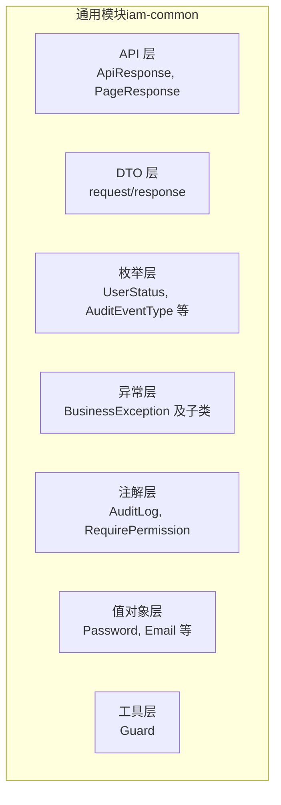
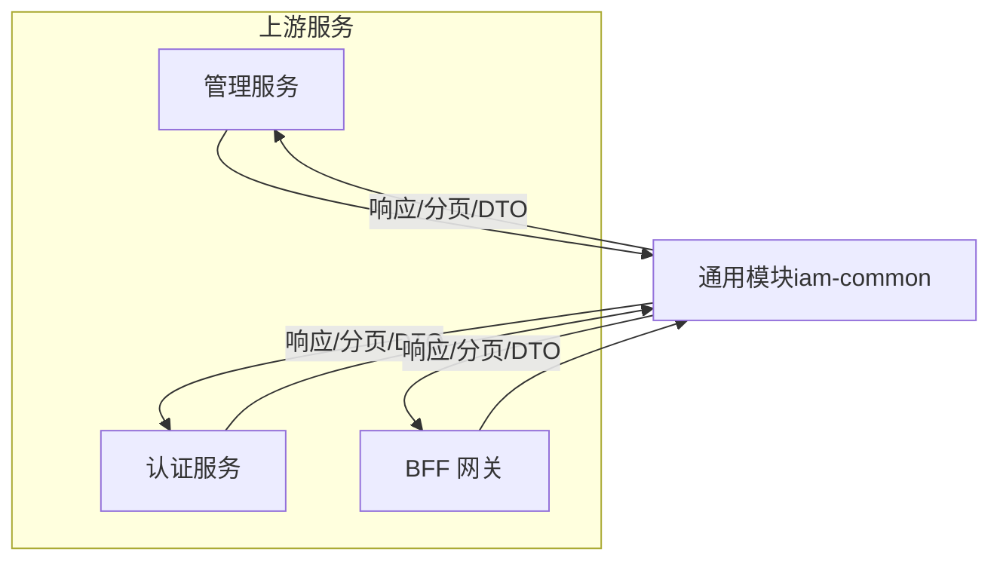
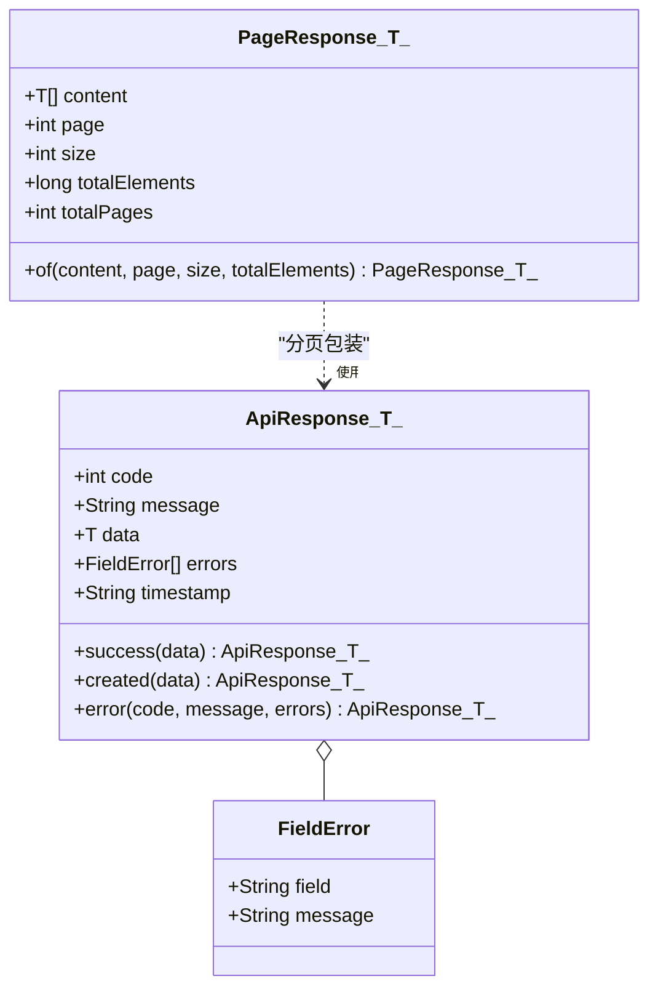
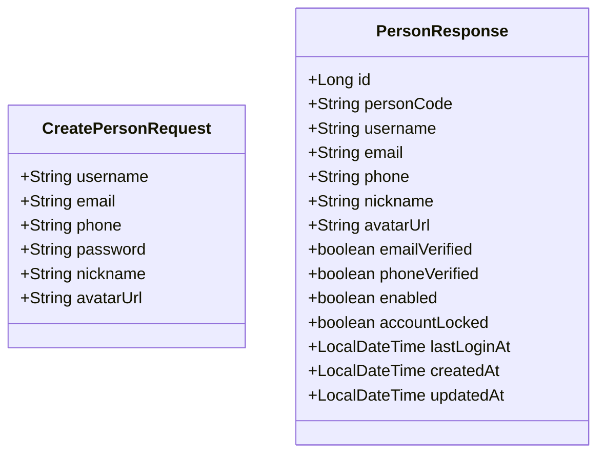
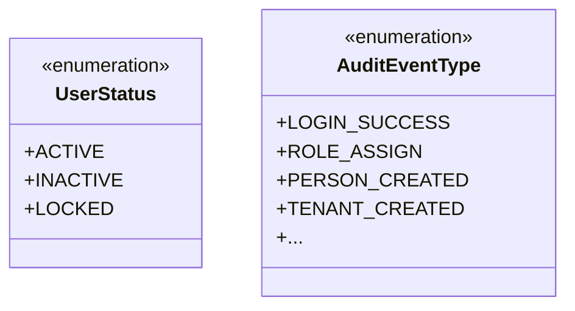
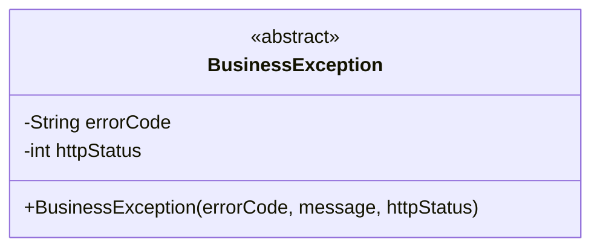
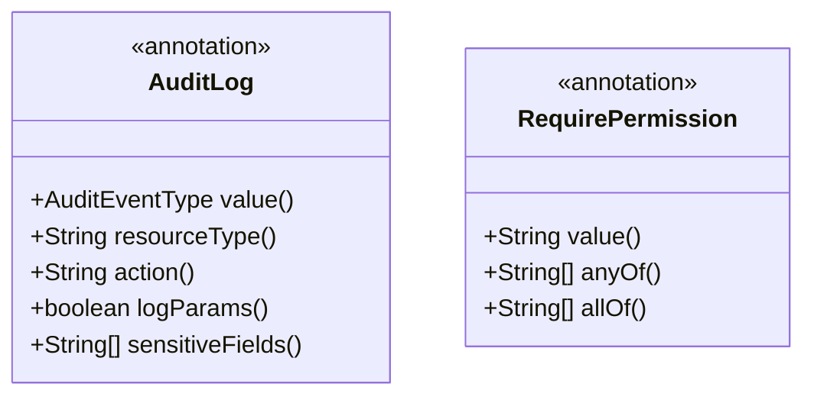
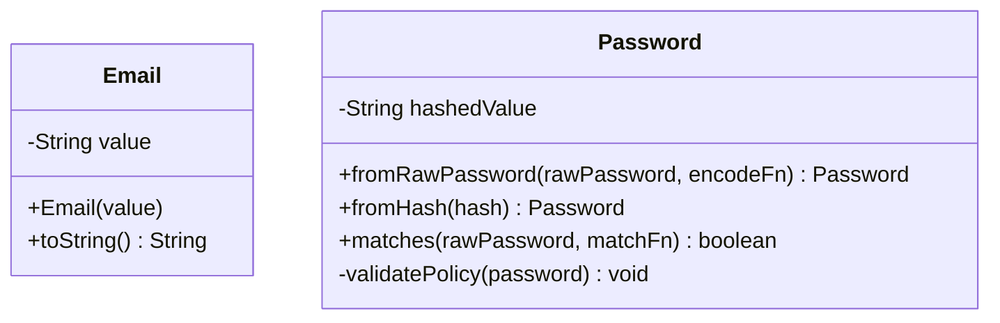
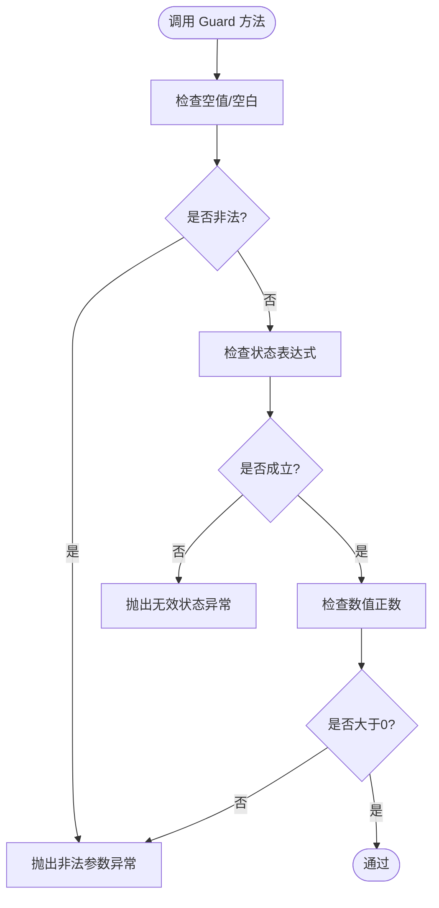
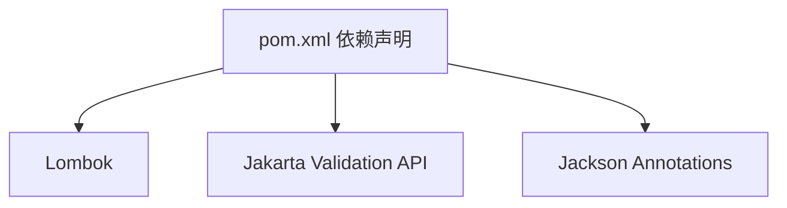

# 通用模块（iam-common）

<cite>
**本文档引用的文件**
- [ApiResponse.java](file://iam-common/src/main/java/iam/platform/common/api/ApiResponse.java)
- [PageResponse.java](file://iam-common/src/main/java/iam/platform/common/api/PageResponse.java)
- [CreatePersonRequest.java](file://iam-common/src/main/java/iam/platform/common/dto/request/CreatePersonRequest.java)
- [PersonResponse.java](file://iam-common/src/main/java/iam/platform/common/dto/response/PersonResponse.java)
- [BusinessException.java](file://iam-common/src/main/java/iam/platform/common/model/exception/BusinessException.java)
- [UserStatus.java](file://iam-common/src/main/java/iam/platform/common/model/enums/UserStatus.java)
- [AuditEventType.java](file://iam-common/src/main/java/iam/platform/common/model/enums/AuditEventType.java)
- [AuditLog.java](file://iam-common/src/main/java/iam/platform/common/model/annotation/AuditLog.java)
- [RequirePermission.java](file://iam-common/src/main/java/iam/platform/common/model/annotation/RequirePermission.java)
- [Password.java](file://iam-common/src/main/java/iam/platform/common/model/valueobject/Password.java)
- [Email.java](file://iam-common/src/main/java/iam/platform/common/model/valueobject/Email.java)
- [Guard.java](file://iam-common/src/main/java/iam/platform/common/util/Guard.java)
- [pom.xml](file://iam-common/pom.xml)
</cite>

## 目录
1. [简介](#简介)
2. [项目结构](#项目结构)
3. [核心组件](#核心组件)
4. [架构总览](#架构总览)
5. [详细组件分析](#详细组件分析)
6. [依赖分析](#依赖分析)
7. [性能考虑](#性能考虑)
8. [故障排查指南](#故障排查指南)
9. [结论](#结论)
10. [附录](#附录)

## 简介
本文件为通用模块（iam-common）的系统化技术文档，聚焦于统一的数据传输对象（DTO）、枚举类型、异常模型、注解与值对象等共享能力，以及标准化的 API 响应格式、分页响应与错误码规范。文档同时阐述业务异常体系、自定义异常处理机制、错误信息国际化支持建议、通用工具类与校验/安全注解的使用方式，并给出模块间依赖关系、版本兼容性与升级策略，以及在微服务架构中的支撑作用与设计原则。

## 项目结构
通用模块采用按职责分层的组织方式：API 响应与分页封装、请求/响应 DTO、领域枚举、异常体系、注解（审计与权限）、值对象（密码、邮箱等）与通用工具类。该结构确保了跨服务复用的一致性与低耦合。

图表来源
- [ApiResponse.java:1-61](file://iam-common/src/main/java/iam/platform/common/api/ApiResponse.java#L1-L61)
- [PageResponse.java:1-32](file://iam-common/src/main/java/iam/platform/common/api/PageResponse.java#L1-L32)
- [CreatePersonRequest.java:1-37](file://iam-common/src/main/java/iam/platform/common/dto/request/CreatePersonRequest.java#L1-L37)
- [PersonResponse.java:1-30](file://iam-common/src/main/java/iam/platform/common/dto/response/PersonResponse.java#L1-L30)
- [BusinessException.java:1-17](file://iam-common/src/main/java/iam/platform/common/model/exception/BusinessException.java#L1-L17)
- [UserStatus.java:1-8](file://iam-common/src/main/java/iam/platform/common/model/enums/UserStatus.java#L1-L8)
- [AuditEventType.java:1-59](file://iam-common/src/main/java/iam/platform/common/model/enums/AuditEventType.java#L1-L59)
- [AuditLog.java:1-46](file://iam-common/src/main/java/iam/platform/common/model/annotation/AuditLog.java#L1-L46)
- [RequirePermission.java:1-35](file://iam-common/src/main/java/iam/platform/common/model/annotation/RequirePermission.java#L1-L35)
- [Password.java:1-90](file://iam-common/src/main/java/iam/platform/common/model/valueobject/Password.java#L1-L90)
- [Email.java:1-31](file://iam-common/src/main/java/iam/platform/common/model/valueobject/Email.java#L1-L31)
- [Guard.java:1-37](file://iam-common/src/main/java/iam/platform/common/util/Guard.java#L1-L37)

章节来源
- [pom.xml:1-47](file://iam-common/pom.xml#L1-L47)

## 核心组件
- API 响应与分页封装：提供统一的响应体结构与分页容器，便于前端与网关统一解析。
- DTO：请求与响应的数据载体，配合 Jakarta Bean Validation 注解进行参数校验。
- 枚举：用户状态、审计事件类型等跨域语义标识。
- 异常体系：抽象业务异常基类，便于上层统一捕获与转换。
- 注解：审计日志与权限控制的声明式能力。
- 值对象：密码与邮箱等强约束的领域值对象，保障数据一致性。
- 工具类：Guard 提供前置条件与状态断言，降低重复校验代码。

章节来源
- [ApiResponse.java:1-61](file://iam-common/src/main/java/iam/platform/common/api/ApiResponse.java#L1-L61)
- [PageResponse.java:1-32](file://iam-common/src/main/java/iam/platform/common/api/PageResponse.java#L1-L32)
- [CreatePersonRequest.java:1-37](file://iam-common/src/main/java/iam/platform/common/dto/request/CreatePersonRequest.java#L1-L37)
- [PersonResponse.java:1-30](file://iam-common/src/main/java/iam/platform/common/dto/response/PersonResponse.java#L1-L30)
- [BusinessException.java:1-17](file://iam-common/src/main/java/iam/platform/common/model/exception/BusinessException.java#L1-L17)
- [UserStatus.java:1-8](file://iam-common/src/main/java/iam/platform/common/model/enums/UserStatus.java#L1-L8)
- [AuditEventType.java:1-59](file://iam-common/src/main/java/iam/platform/common/model/enums/AuditEventType.java#L1-L59)
- [AuditLog.java:1-46](file://iam-common/src/main/java/iam/platform/common/model/annotation/AuditLog.java#L1-L46)
- [RequirePermission.java:1-35](file://iam-common/src/main/java/iam/platform/common/model/annotation/RequirePermission.java#L1-L35)
- [Password.java:1-90](file://iam-common/src/main/java/iam/platform/common/model/valueobject/Password.java#L1-L90)
- [Email.java:1-31](file://iam-common/src/main/java/iam/platform/common/model/valueobject/Email.java#L1-L31)
- [Guard.java:1-37](file://iam-common/src/main/java/iam/platform/common/util/Guard.java#L1-L37)

## 架构总览
通用模块作为平台级共享库，向上游各服务（如管理端、认证端、BFF 网关）提供统一的响应格式、数据模型、校验规则与安全注解。其设计遵循“低耦合、高内聚、可复用”的原则，避免在公共模块引入具体框架依赖，确保跨服务稳定演进。

图表来源
- [ApiResponse.java:1-61](file://iam-common/src/main/java/iam/platform/common/api/ApiResponse.java#L1-L61)
- [PageResponse.java:1-32](file://iam-common/src/main/java/iam/platform/common/api/PageResponse.java#L1-L32)
- [CreatePersonRequest.java:1-37](file://iam-common/src/main/java/iam/platform/common/dto/request/CreatePersonRequest.java#L1-L37)
- [PersonResponse.java:1-30](file://iam-common/src/main/java/iam/platform/common/dto/response/PersonResponse.java#L1-L30)
- [BusinessException.java:1-17](file://iam-common/src/main/java/iam/platform/common/model/exception/BusinessException.java#L1-L17)
- [AuditLog.java:1-46](file://iam-common/src/main/java/iam/platform/common/model/annotation/AuditLog.java#L1-L46)
- [RequirePermission.java:1-35](file://iam-common/src/main/java/iam/platform/common/model/annotation/RequirePermission.java#L1-L35)
- [Password.java:1-90](file://iam-common/src/main/java/iam/platform/common/model/valueobject/Password.java#L1-L90)
- [Email.java:1-31](file://iam-common/src/main/java/iam/platform/common/model/valueobject/Email.java#L1-L31)
- [Guard.java:1-37](file://iam-common/src/main/java/iam/platform/common/util/Guard.java#L1-L37)

## 详细组件分析

### API 响应与分页封装
- ApiResponse：统一响应体字段（状态码、消息、数据、错误列表、时间戳），提供成功、创建、错误三类静态工厂方法；内部嵌套 FieldError 表示字段级错误。
- PageResponse：统一分页返回结构（内容、页码、大小、总数、总页数），提供 of 工厂方法自动计算总页数。

图表来源
- [ApiResponse.java:1-61](file://iam-common/src/main/java/iam/platform/common/api/ApiResponse.java#L1-L61)
- [PageResponse.java:1-32](file://iam-common/src/main/java/iam/platform/common/api/PageResponse.java#L1-L32)

章节来源
- [ApiResponse.java:1-61](file://iam-common/src/main/java/iam/platform/common/api/ApiResponse.java#L1-L61)
- [PageResponse.java:1-32](file://iam-common/src/main/java/iam/platform/common/api/PageResponse.java#L1-L32)

### DTO 设计与校验
- 请求 DTO：以 CreatePersonRequest 为例，使用 Jakarta Bean Validation 注解对字段进行非空、长度、格式等约束，保证入参合法性。
- 响应 DTO：以 PersonResponse 为例，统一输出字段集合，便于前后端契约一致。

图表来源
- [CreatePersonRequest.java:1-37](file://iam-common/src/main/java/iam/platform/common/dto/request/CreatePersonRequest.java#L1-L37)
- [PersonResponse.java:1-30](file://iam-common/src/main/java/iam/platform/common/dto/response/PersonResponse.java#L1-L30)

章节来源
- [CreatePersonRequest.java:1-37](file://iam-common/src/main/java/iam/platform/common/dto/request/CreatePersonRequest.java#L1-L37)
- [PersonResponse.java:1-30](file://iam-common/src/main/java/iam/platform/common/dto/response/PersonResponse.java#L1-L30)

### 枚举类型
- 用户状态枚举：UserStatus 定义账户可用性状态，用于统一状态表达。
- 审计事件类型：AuditEventType 将审计事件按类别分组，便于统计与过滤。

图表来源
- [UserStatus.java:1-8](file://iam-common/src/main/java/iam/platform/common/model/enums/UserStatus.java#L1-L8)
- [AuditEventType.java:1-59](file://iam-common/src/main/java/iam/platform/common/model/enums/AuditEventType.java#L1-L59)

章节来源
- [UserStatus.java:1-8](file://iam-common/src/main/java/iam/platform/common/model/enums/UserStatus.java#L1-L8)
- [AuditEventType.java:1-59](file://iam-common/src/main/java/iam/platform/common/model/enums/AuditEventType.java#L1-L59)

### 异常体系与错误码规范
- 抽象业务异常：BusinessException 提供 errorCode 与 httpStatus 字段，便于上层统一映射到 API 响应码与 HTTP 状态码。
- 错误码规范建议：采用“模块前缀 + 功能位 + 顺序号”或“领域 + 子域 + 操作 + 结果”的层次化命名，确保全局唯一且可读。
- 错误信息国际化：建议在上层控制器或全局异常处理器中结合 Locale 解析消息模板，通用模块不直接依赖具体国际化实现。

图表来源
- [BusinessException.java:1-17](file://iam-common/src/main/java/iam/platform/common/model/exception/BusinessException.java#L1-L17)

章节来源
- [BusinessException.java:1-17](file://iam-common/src/main/java/iam/platform/common/model/exception/BusinessException.java#L1-L17)

### 审计与权限注解
- 审计注解：@AuditLog 标记方法以记录审计事件，支持事件类型、资源类型、动作描述模板、是否记录参数及敏感字段掩码。
- 权限注解：@RequirePermission 支持单个权限、任一满足（OR）与全部满足（AND）组合，便于细粒度授权控制。

图表来源
- [AuditLog.java:1-46](file://iam-common/src/main/java/iam/platform/common/model/annotation/AuditLog.java#L1-L46)
- [RequirePermission.java:1-35](file://iam-common/src/main/java/iam/platform/common/model/annotation/RequirePermission.java#L1-L35)

章节来源
- [AuditLog.java:1-46](file://iam-common/src/main/java/iam/platform/common/model/annotation/AuditLog.java#L1-L46)
- [RequirePermission.java:1-35](file://iam-common/src/main/java/iam/platform/common/model/annotation/RequirePermission.java#L1-L35)

### 值对象
- 邮箱值对象：Email 对输入进行正则校验，保证邮箱格式合法。
- 密码值对象：Password 负责密码策略校验与哈希存储，通过函数式接口与外部编码器解耦，避免在通用模块引入 Spring Security 依赖。

图表来源
- [Email.java:1-31](file://iam-common/src/main/java/iam/platform/common/model/valueobject/Email.java#L1-L31)
- [Password.java:1-90](file://iam-common/src/main/java/iam/platform/common/model/valueobject/Password.java#L1-L90)

章节来源
- [Email.java:1-31](file://iam-common/src/main/java/iam/platform/common/model/valueobject/Email.java#L1-L31)
- [Password.java:1-90](file://iam-common/src/main/java/iam/platform/common/model/valueobject/Password.java#L1-L90)

### 通用工具类
- Guard：提供 notNull、notBlank、state、positive 等断言方法，统一前置条件与状态检查，减少重复校验逻辑。

图表来源
- [Guard.java:1-37](file://iam-common/src/main/java/iam/platform/common/util/Guard.java#L1-L37)

章节来源
- [Guard.java:1-37](file://iam-common/src/main/java/iam/platform/common/util/Guard.java#L1-L37)

## 依赖分析
- 外部依赖：Lombok（生成 POJO 辅助代码）、Jakarta Validation API（校验注解）、Jackson Annotations（JSON 序列化注解）。
- 内部依赖：各组件之间保持松耦合，无循环依赖风险；注解与值对象不依赖具体框架实现，便于跨服务复用。

图表来源
- [pom.xml:1-47](file://iam-common/pom.xml#L1-L47)

章节来源
- [pom.xml:1-47](file://iam-common/pom.xml#L1-L47)

## 性能考虑
- 响应序列化：ApiResponse 使用 Jackson 注解排除空字段，减少冗余数据传输。
- 分页计算：PageResponse 的总页数计算为 O(1)，避免额外查询开销。
- 校验注解：在 DTO 上使用注解进行参数校验，可在进入业务逻辑前快速失败，降低后续处理成本。
- 值对象策略：Password 仅保存哈希值，避免在通用模块引入加密实现细节，降低耦合与运行时开销。

## 故障排查指南
- 参数校验失败：检查请求 DTO 的注解配置与客户端传参是否符合约束。
- 审计日志未记录：确认方法已标注 @AuditLog，且拦截器/切面已在运行环境中启用。
- 权限拒绝：核对 @RequirePermission 的权限表达式与当前用户权限集合。
- 密码匹配失败：确认使用 Password 的 matches 方法并传入正确的匹配函数。
- 异常未统一处理：在上层控制器或全局异常处理器中捕获 BusinessException 并映射到 ApiResponse。

章节来源
- [CreatePersonRequest.java:1-37](file://iam-common/src/main/java/iam/platform/common/dto/request/CreatePersonRequest.java#L1-L37)
- [AuditLog.java:1-46](file://iam-common/src/main/java/iam/platform/common/model/annotation/AuditLog.java#L1-L46)
- [RequirePermission.java:1-35](file://iam-common/src/main/java/iam/platform/common/model/annotation/RequirePermission.java#L1-L35)
- [Password.java:1-90](file://iam-common/src/main/java/iam/platform/common/model/valueobject/Password.java#L1-L90)
- [BusinessException.java:1-17](file://iam-common/src/main/java/iam/platform/common/model/exception/BusinessException.java#L1-L17)

## 结论
通用模块通过统一的响应格式、DTO、枚举、异常与注解，构建了平台级的共享基础设施，显著提升了跨服务的一致性与可维护性。其设计强调“零框架依赖、强契约约束、可国际化扩展”，在微服务架构中发挥着承上启下的关键作用。

## 附录

### API 响应与分页使用示例（路径指引）
- 成功响应：参考 [ApiResponse.success(...):25-32](file://iam-common/src/main/java/iam/platform/common/api/ApiResponse.java#L25-L32)
- 创建响应：参考 [ApiResponse.created(...):34-41](file://iam-common/src/main/java/iam/platform/common/api/ApiResponse.java#L34-L41)
- 错误响应：参考 [ApiResponse.error(...):43-50](file://iam-common/src/main/java/iam/platform/common/api/ApiResponse.java#L43-L50)
- 分页构造：参考 [PageResponse.of(...):21-30](file://iam-common/src/main/java/iam/platform/common/api/PageResponse.java#L21-L30)

### DTO 使用示例（路径指引）
- 请求 DTO 校验：参考 [CreatePersonRequest:1-37](file://iam-common/src/main/java/iam/platform/common/dto/request/CreatePersonRequest.java#L1-L37)
- 响应 DTO 输出：参考 [PersonResponse:1-30](file://iam-common/src/main/java/iam/platform/common/dto/response/PersonResponse.java#L1-L30)

### 异常与国际化建议（路径指引）
- 抽象异常基类：参考 [BusinessException:1-17](file://iam-common/src/main/java/iam/platform/common/model/exception/BusinessException.java#L1-L17)
- 国际化集成：在上层控制器或全局异常处理器中根据 errorCode 与 Locale 解析消息模板。

### 注解与安全（路径指引）
- 审计注解：参考 [@AuditLog:1-46](file://iam-common/src/main/java/iam/platform/common/model/annotation/AuditLog.java#L1-L46)
- 权限注解：参考 [@RequirePermission:1-35](file://iam-common/src/main/java/iam/platform/common/model/annotation/RequirePermission.java#L1-L35)

### 值对象与工具（路径指引）
- 邮箱值对象：参考 [Email:1-31](file://iam-common/src/main/java/iam/platform/common/model/valueobject/Email.java#L1-L31)
- 密码值对象：参考 [Password:1-90](file://iam-common/src/main/java/iam/platform/common/model/valueobject/Password.java#L1-L90)
- 断言工具：参考 [Guard:1-37](file://iam-common/src/main/java/iam/platform/common/util/Guard.java#L1-L37)