# 验证代码认证系统

<cite>
**本文档引用的文件**
- [SsoOidcApplication.java](file://sso-auth-server/src/main/java/sso/oidc/auth/SsoAuthServerApplication.java)
- [AuthorizationServerConfig.java](file://sso-auth-server/src/main/java/sso/oidc/auth/infrastructure/config/AuthorizationServerConfig.java)
- [DefaultSecurityConfig.java](file://sso-auth-server/src/main/java/sso/oidc/auth/infrastructure/config/DefaultSecurityConfig.java)
- [VerificationCodeService.java](file://sso-auth-server/src/main/java/sso/oidc/auth/domain/service/VerificationCodeService.java)
- [VerificationCodeServiceImpl.java](file://sso-auth-server/src/main/java/sso/oidc/auth/domain/service/impl/VerificationCodeServiceImpl.java)
- [AuthenticationApplicationService.java](file://sso-auth-server/src/main/java/sso/oidc/auth/application/service/AuthenticationApplicationService.java)
- [UnifiedAuthenticationFilter.java](file://sso-auth-server/src/main/java/sso/oidc/auth/infrastructure/security/UnifiedAuthenticationFilter.java)
- [UnifiedAuthenticationSuccessHandler.java](file://sso-auth-server/src/main/java/sso/oidc/auth/infrastructure/security/UnifiedAuthenticationSuccessHandler.java)
- [VerificationCodeRequestController.java](file://sso-auth-server/src/main/java/sso/oidc/auth/interfaces/rest/VerificationCodeRequestController.java)
- [AuthenticationController.java](file://sso-auth-server/src/main/java/sso/oidc/auth/interfaces/rest/AuthenticationController.java)
- [AuthenticationCredentials.java](file://sso-auth-server/src/main/java/sso/oidc/auth/domain/model/valueobject/AuthenticationCredentials.java)
- [PasswordAuthenticationStrategy.java](file://sso-auth-server/src/main/java/sso/oidc/auth/domain/service/impl/PasswordAuthenticationStrategy.java)
- [SmsCodeAuthenticationStrategy.java](file://sso-auth-server/src/main/java/sso/oidc/auth/domain/service/impl/SmsCodeAuthenticationStrategy.java)
- [EmailCodeAuthenticationStrategy.java](file://sso-auth-server/src/main/java/sso/oidc/auth/domain/service/impl/EmailCodeAuthenticationStrategy.java)
- [LdapAuthenticationStrategy.java](file://sso-auth-server/src/main/java/sso/oidc/auth/domain/service/impl/LdapAuthenticationStrategy.java)
- [CompositeAuthenticationProvider.java](file://sso-auth-server/src/main/java/sso/oidc/auth/infrastructure/security/CompositeAuthenticationProvider.java)
- [VerificationCodeLoginRequest.java](file://sso-common/src/main/java/sso/oidc/common/dto/request/VerificationCodeLoginRequest.java)
- [User.java](file://sso-auth-server/src/main/java/sso/oidc/auth/domain/model/entity/Person.java)
- [OAuth2Client.java](file://sso-auth-server/src/main/java/sso/oidc/auth/domain/model/entity/Application.java)
- [application.yml](file://sso-auth-server/src/main/resources/application.yml)
- [TOKEN_VALIDATION_TEST.md](file://TOKEN_VALIDATION_TEST.md)
- [JwkProperties.java](file://sso-auth-server/src/main/java/sso/oidc/auth/infrastructure/config/JwkProperties.java)
- [PersonRepository.java](file://sso-auth-server/src/main/java/sso/oidc/auth/domain/repository/PersonRepository.java)
- [PersonRepositoryImpl.java](file://sso-auth-server/src/main/java/sso/oidc/auth/infrastructure/persistence/impl/PersonRepositoryImpl.java)
</cite>

## 更新摘要
**所做更改**
- 更新了验证码认证系统的架构说明，反映从独立的VerificationCodeApplicationService和VerificationCodeController向统一认证框架的迁移
- 新增了统一认证过滤器和认证策略模式的详细说明
- 更新了认证流程图，展示新的统一认证架构
- 添加了新的验证码请求控制器和认证凭证模型
- 更新了系统架构图以反映新的认证框架结构

## 目录
1. [项目概述](#项目概述)
2. [系统架构](#系统架构)
3. [核心组件分析](#核心组件分析)
4. [认证流程详解](#认证流程详解)
5. [JWT令牌验证机制](#jwt令牌验证机制)
6. [统一认证框架](#统一认证框架)
7. [验证码认证系统](#验证码认证系统)
8. [OAuth2第三方登录](#oauth2第三方登录)
9. [数据模型设计](#数据模型设计)
10. [配置管理](#配置管理)
11. [测试验证方案](#测试验证方案)
12. [故障排除指南](#故障排除指南)
13. [总结](#总结)

## 项目概述

本项目是一个基于Spring Boot和Spring Security的SSO/OIDC认证系统，提供了完整的单点登录和开放身份认证功能。系统支持多种认证方式，包括传统的用户名密码认证、短信验证码认证、邮箱验证码认证、LDAP企业认证以及OAuth2第三方登录。

### 主要特性

- **统一认证框架**：全新的统一认证架构，支持多种认证方式的一致处理
- **多认证方式支持**：用户名密码、短信验证码、邮箱验证码、LDAP企业认证、OAuth2第三方登录
- **标准OIDC协议**：完全兼容OpenID Connect 1.0标准
- **JWT令牌管理**：使用RSA-256算法进行令牌签名和验证
- **灵活的权限控制**：基于角色的访问控制(RBAC)
- **安全的密钥管理**：动态JWK密钥轮换和稳定的KeyID生成

## 系统架构

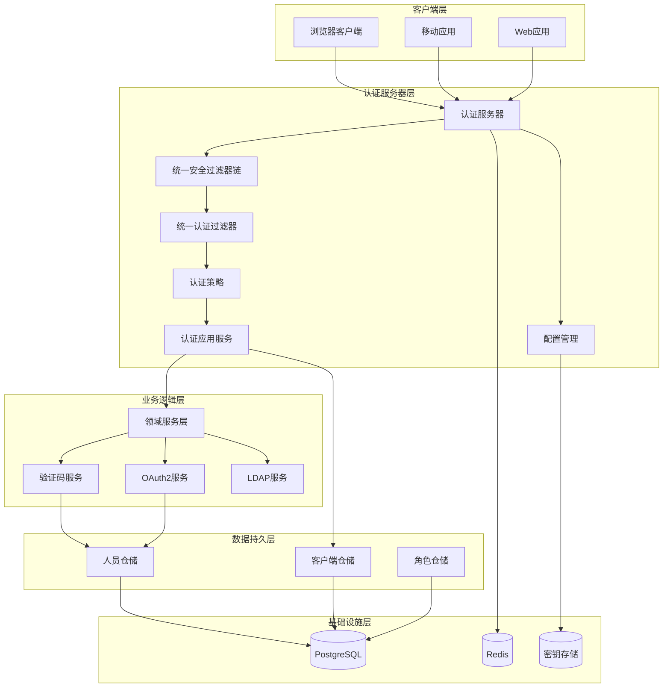

**图表来源**
- [DefaultSecurityConfig.java:36-64](file://sso-auth-server/src/main/java/sso/oidc/auth/infrastructure/config/DefaultSecurityConfig.java#L36-L64)
- [UnifiedAuthenticationFilter.java:18-80](file://sso-auth-server/src/main/java/sso/oidc/auth/infrastructure/security/UnifiedAuthenticationFilter.java#L18-L80)
- [AuthenticationApplicationService.java:24-45](file://sso-auth-server/src/main/java/sso/oidc/auth/application/service/AuthenticationApplicationService.java#L24-L45)

## 核心组件分析

### 应用入口类

应用的启动入口位于`SsoAuthServerApplication`类，这是认证服务器的标准Spring Boot应用程序入口点。

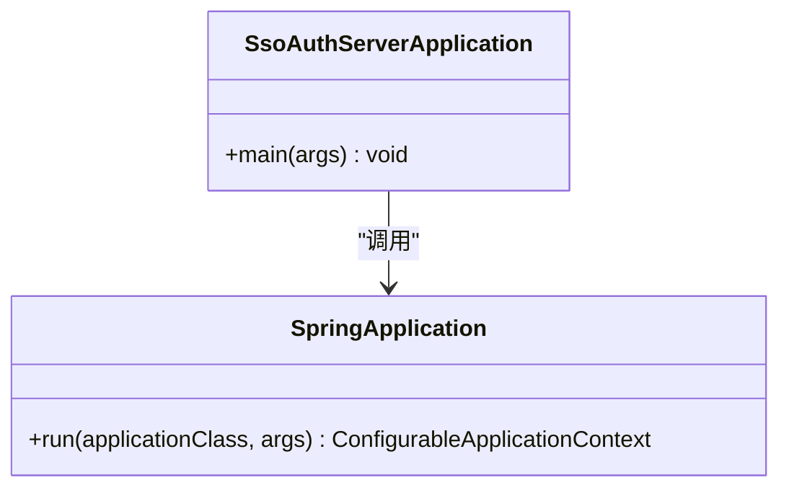

**图表来源**
- [SsoOidcApplication.java:1-13](file://sso-auth-server/src/main/java/sso/oidc/auth/SsoAuthServerApplication.java#L1-L13)

### 统一安全配置架构

系统采用统一的安全配置策略，通过统一认证过滤器处理所有认证请求。

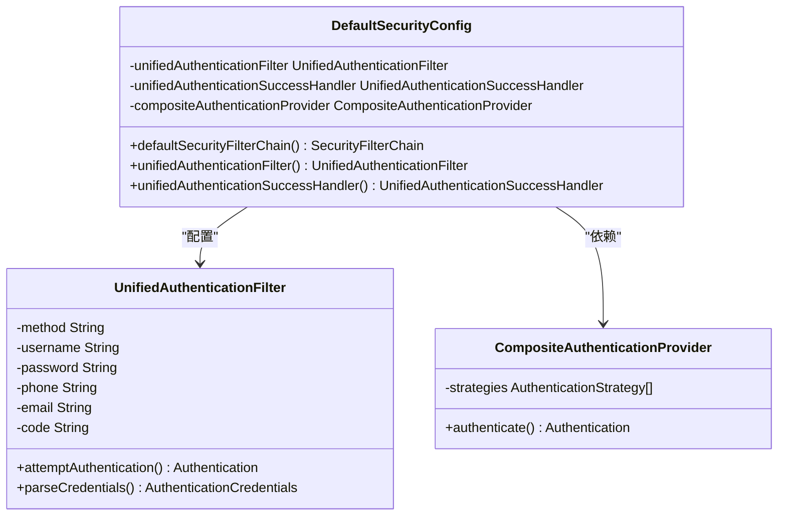

**图表来源**
- [DefaultSecurityConfig.java:25-96](file://sso-auth-server/src/main/java/sso/oidc/auth/infrastructure/config/DefaultSecurityConfig.java#L25-L96)
- [UnifiedAuthenticationFilter.java:18-80](file://sso-auth-server/src/main/java/sso/oidc/auth/infrastructure/security/UnifiedAuthenticationFilter.java#L18-L80)

**章节来源**
- [SsoOidcApplication.java:1-13](file://sso-auth-server/src/main/java/sso/oidc/auth/SsoAuthServerApplication.java#L1-L13)
- [DefaultSecurityConfig.java:25-96](file://sso-auth-server/src/main/java/sso/oidc/auth/infrastructure/config/DefaultSecurityConfig.java#L25-L96)

## 认证流程详解

### 整体认证流程

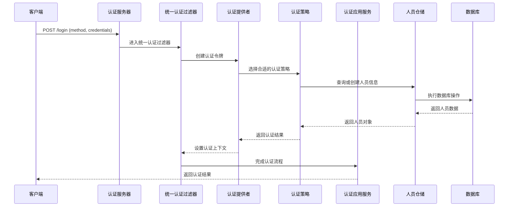

**图表来源**
- [UnifiedAuthenticationFilter.java:31-38](file://sso-auth-server/src/main/java/sso/oidc/auth/infrastructure/security/UnifiedAuthenticationFilter.java#L31-L38)
- [CompositeAuthenticationProvider.java:1-200](file://sso-auth-server/src/main/java/sso/oidc/auth/infrastructure/security/CompositeAuthenticationProvider.java)
- [AuthenticationApplicationService.java:42-45](file://sso-auth-server/src/main/java/sso/oidc/auth/application/service/AuthenticationApplicationService.java#L42-L45)

### 统一认证流程

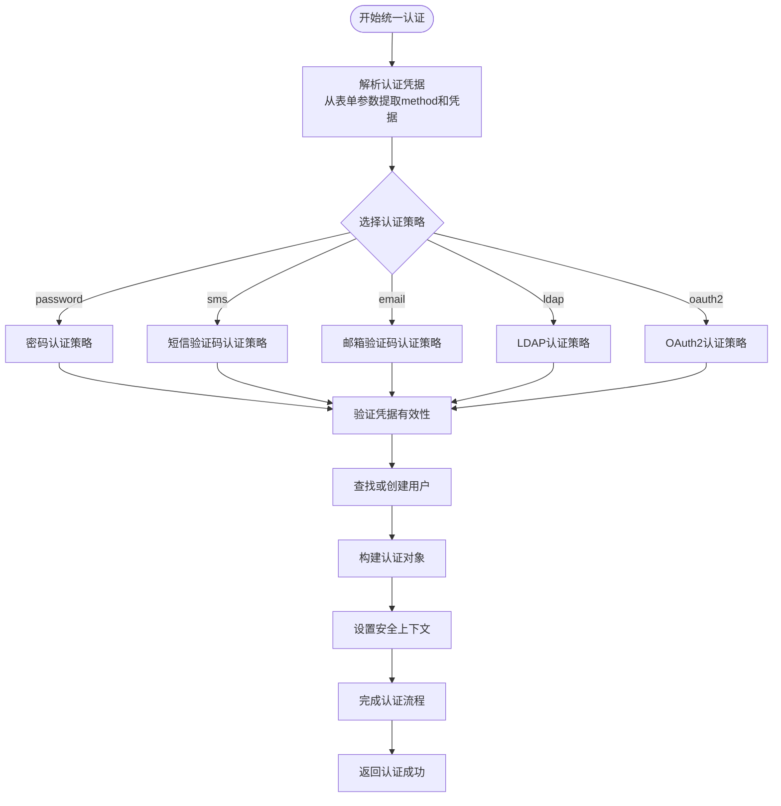

**图表来源**
- [UnifiedAuthenticationFilter.java:43-62](file://sso-auth-server/src/main/java/sso/oidc/auth/infrastructure/security/UnifiedAuthenticationFilter.java#L43-L62)
- [AuthenticationCredentials.java:9-59](file://sso-auth-server/src/main/java/sso/oidc/auth/domain/model/valueobject/AuthenticationCredentials.java#L9-L59)

**章节来源**
- [UnifiedAuthenticationFilter.java:1-80](file://sso-auth-server/src/main/java/sso/oidc/auth/infrastructure/security/UnifiedAuthenticationFilter.java#L1-L80)
- [AuthenticationCredentials.java:1-59](file://sso-auth-server/src/main/java/sso/oidc/auth/domain/model/valueobject/AuthenticationCredentials.java#L1-L59)

## JWT令牌验证机制

### JWT解码器配置

系统使用Spring Security OAuth2 Authorization Server提供的JWT解码器，支持RSA-256签名算法。

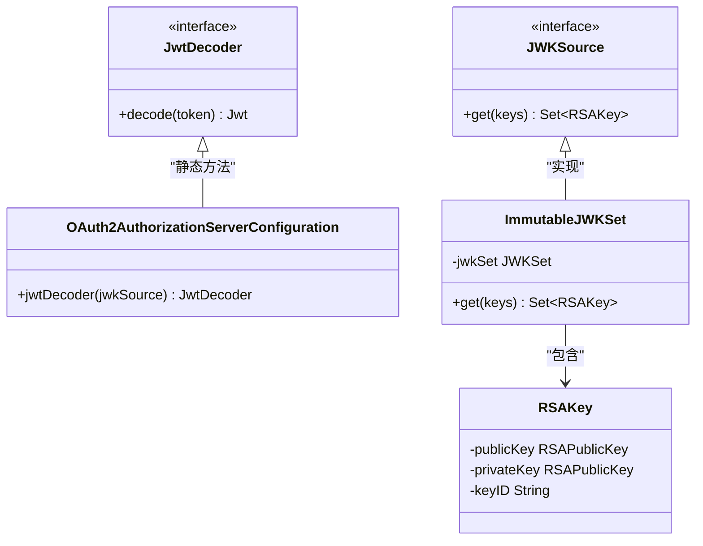

**图表来源**
- [AuthorizationServerConfig.java:84-86](file://sso-auth-server/src/main/java/sso/oidc/auth/infrastructure/config/AuthorizationServerConfig.java#L84-L86)
- [AuthorizationServerConfig.java:60-81](file://sso-auth-server/src/main/java/sso/oidc/auth/infrastructure/config/AuthorizationServerConfig.java#L60-L81)

### JWKS密钥分发

系统提供JWKS(JSON Web Key Set)端点，用于分发RSA公钥供客户端验证JWT令牌签名。

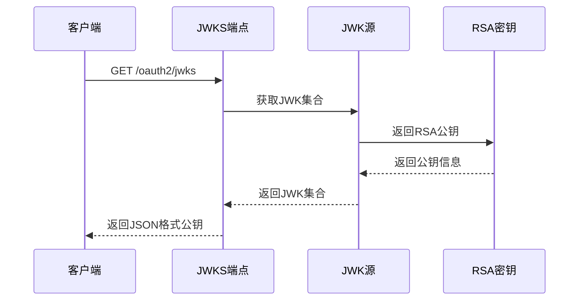

**图表来源**
- [AuthorizationServerConfig.java:59-81](file://sso-auth-server/src/main/java/sso/oidc/auth/infrastructure/config/AuthorizationServerConfig.java#L59-L81)

**章节来源**
- [AuthorizationServerConfig.java:59-92](file://sso-auth-server/src/main/java/sso/oidc/auth/infrastructure/config/AuthorizationServerConfig.java#L59-L92)

## 统一认证框架

### 认证策略模式

系统采用策略模式实现多种认证方式的统一处理。

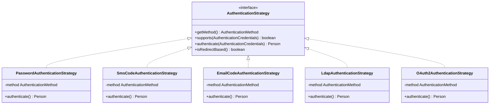

**图表来源**
- [AuthenticationStrategy.java:11-41](file://sso-auth-server/src/main/java/sso/oidc/auth/domain/service/AuthenticationStrategy.java#L11-L41)
- [PasswordAuthenticationStrategy.java:26-64](file://sso-auth-server/src/main/java/sso/oidc/auth/domain/service/impl/PasswordAuthenticationStrategy.java#L26-L64)
- [SmsCodeAuthenticationStrategy.java:14-39](file://sso-auth-server/src/main/java/sso/oidc/auth/domain/service/impl/SmsCodeAuthenticationStrategy.java#L14-L39)
- [EmailCodeAuthenticationStrategy.java:14-39](file://sso-auth-server/src/main/java/sso/oidc/auth/domain/service/impl/EmailCodeAuthenticationStrategy.java#L14-L39)
- [LdapAuthenticationStrategy.java:30-137](file://sso-auth-server/src/main/java/sso/oidc/auth/domain/service/impl/LdapAuthenticationStrategy.java#L30-L137)

### 统一认证应用服务

认证应用服务作为统一的认证处理中心，协调各种认证策略和后续流程。

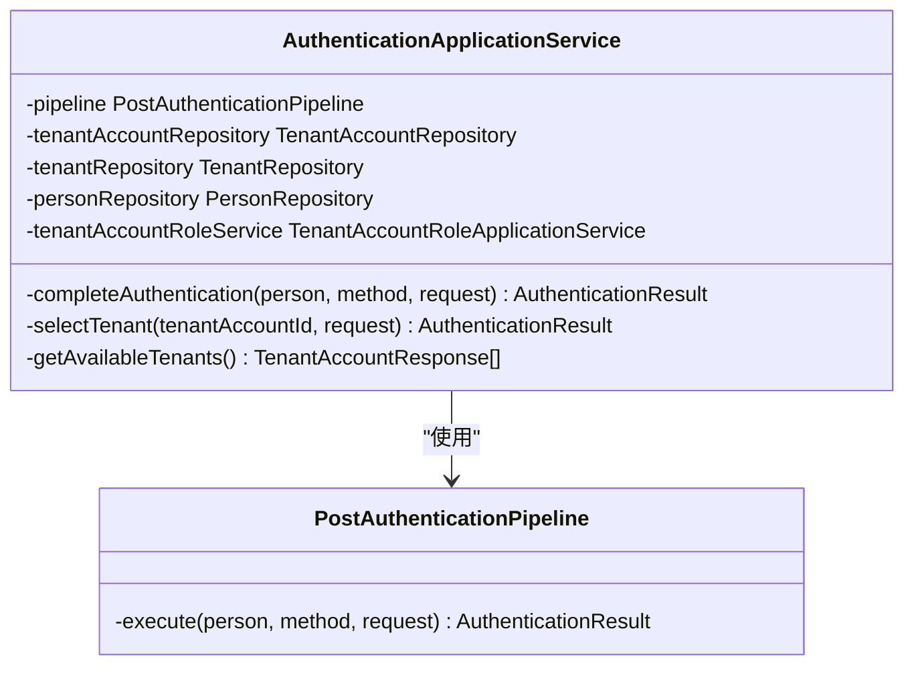

**图表来源**
- [AuthenticationApplicationService.java:24-139](file://sso-auth-server/src/main/java/sso/oidc/auth/application/service/AuthenticationApplicationService.java#L24-L139)

**章节来源**
- [AuthenticationStrategy.java:1-41](file://sso-auth-server/src/main/java/sso/oidc/auth/domain/service/AuthenticationStrategy.java#L1-L41)
- [AuthenticationApplicationService.java:1-139](file://sso-auth-server/src/main/java/sso/oidc/auth/application/service/AuthenticationApplicationService.java#L1-L139)

## 验证码认证系统

### 验证码服务实现

验证码服务现在作为认证策略的一部分，提供短信和邮箱验证码的生成、验证和用户管理功能。

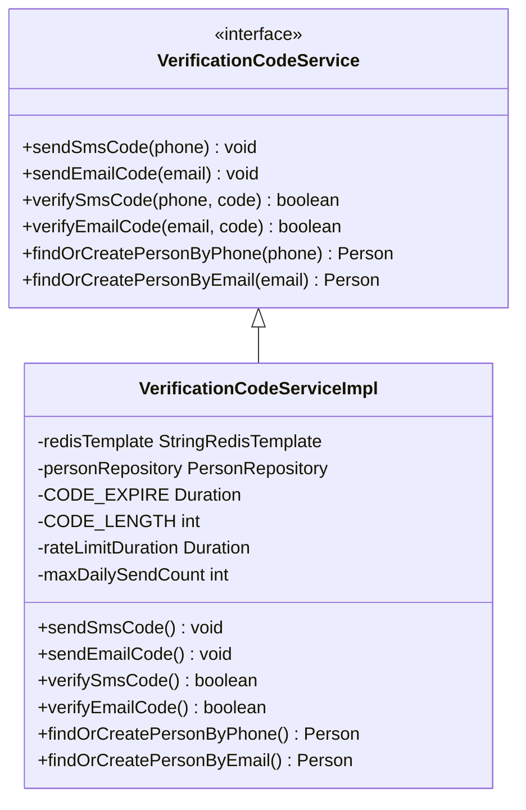

**图表来源**
- [VerificationCodeService.java:5-21](file://sso-auth-server/src/main/java/sso/oidc/auth/domain/service/VerificationCodeService.java#L5-L21)
- [VerificationCodeServiceImpl.java:17-36](file://sso-auth-server/src/main/java/sso/oidc/auth/domain/service/impl/VerificationCodeServiceImpl.java#L17-L36)

### 验证码请求控制器

验证码请求控制器提供独立的API端点，用于发送短信和邮箱验证码。

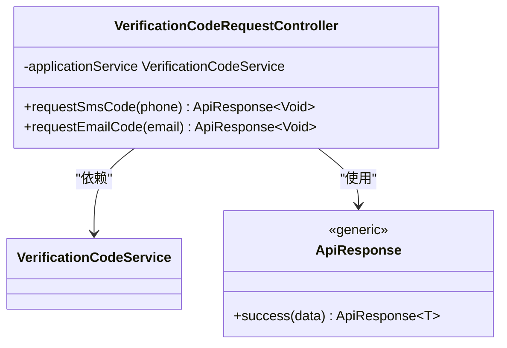

**图表来源**
- [VerificationCodeRequestController.java:15-30](file://sso-auth-server/src/main/java/sso/oidc/auth/interfaces/rest/VerificationCodeRequestController.java#L15-L30)

### 验证码认证策略

短信和邮箱验证码认证现在通过专门的认证策略实现，与统一认证框架集成。

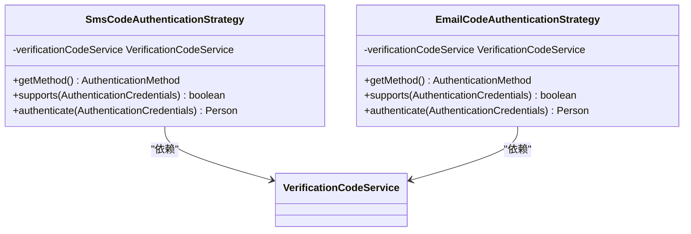

**图表来源**
- [SmsCodeAuthenticationStrategy.java:14-39](file://sso-auth-server/src/main/java/sso/oidc/auth/domain/service/impl/SmsCodeAuthenticationStrategy.java#L14-L39)
- [EmailCodeAuthenticationStrategy.java:14-39](file://sso-auth-server/src/main/java/sso/oidc/auth/domain/service/impl/EmailCodeAuthenticationStrategy.java#L14-L39)

**章节来源**
- [VerificationCodeService.java:1-21](file://sso-auth-server/src/main/java/sso/oidc/auth/domain/service/VerificationCodeService.java#L1-L21)
- [VerificationCodeServiceImpl.java:1-36](file://sso-auth-server/src/main/java/sso/oidc/auth/domain/service/impl/VerificationCodeServiceImpl.java#L1-L36)
- [VerificationCodeRequestController.java:1-30](file://sso-auth-server/src/main/java/sso/oidc/auth/interfaces/rest/VerificationCodeRequestController.java#L1-L30)
- [SmsCodeAuthenticationStrategy.java:1-39](file://sso-auth-server/src/main/java/sso/oidc/auth/domain/service/impl/SmsCodeAuthenticationStrategy.java#L1-L39)
- [EmailCodeAuthenticationStrategy.java:1-39](file://sso-auth-server/src/main/java/sso/oidc/auth/domain/service/impl/EmailCodeAuthenticationStrategy.java#L1-L39)

## OAuth2第三方登录

### OAuth2用户服务

系统集成了Spring Security OAuth2客户端，支持钉钉、微信等第三方平台的登录。

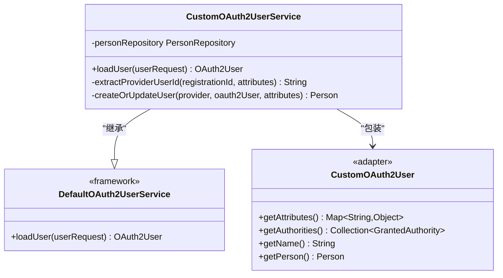

**图表来源**
- [CustomOAuth2UserService.java:15-82](file://sso-auth-server/src/main/java/sso/oidc/auth/infrastructure/security/CustomOAuth2UserService.java#L15-L82)

### 支持的第三方平台

系统配置支持以下第三方登录平台：

| 平台名称 | 注册ID | 用户ID属性 | 登录URL |
|---------|--------|------------|---------|
| 钉钉 | dingtalk | unionId | https://login.dingtalk.com/oauth2/auth |
| 微信 | wechat | openid | https://open.weixin.qq.com/connect/qrconnect |

**章节来源**
- [CustomOAuth2UserService.java:1-83](file://sso-auth-server/src/main/java/sso/oidc/auth/infrastructure/security/CustomOAuth2UserService.java#L1-L83)

## 数据模型设计

### 人员实体模型

系统使用清晰的数据模型来表示用户信息和相关属性。

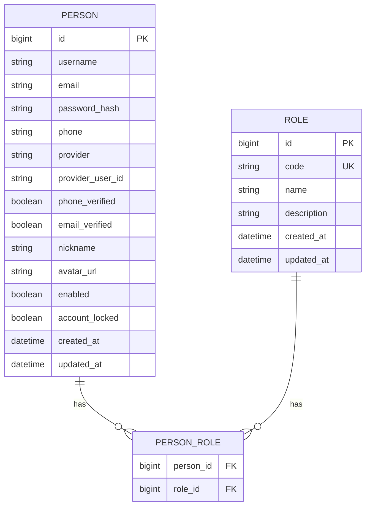

**图表来源**
- [User.java:12-40](file://sso-auth-server/src/main/java/sso/oidc/auth/domain/model/entity/Person.java#L12-L40)
- [PersonRepositoryImpl.java:139-147](file://sso-auth-server/src/main/java/sso/oidc/auth/infrastructure/persistence/impl/PersonRepositoryImpl.java#L139-L147)

### OAuth2客户端模型

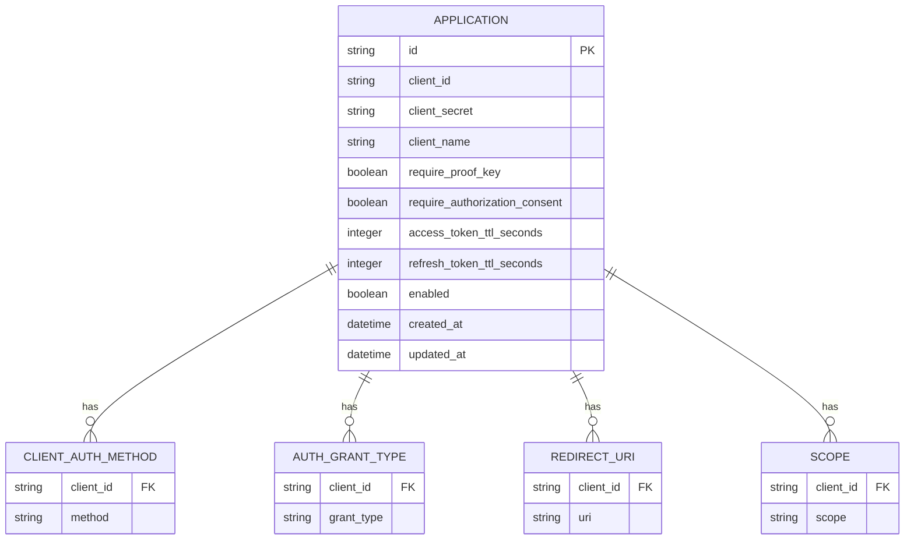

**图表来源**
- [OAuth2Client.java:12-68](file://sso-auth-server/src/main/java/sso/oidc/auth/domain/model/entity/Application.java#L12-L68)

**章节来源**
- [User.java:1-41](file://sso-auth-server/src/main/java/sso/oidc/auth/domain/model/entity/Person.java#L1-L41)
- [OAuth2Client.java:1-69](file://sso-auth-server/src/main/java/sso/oidc/auth/domain/model/entity/Application.java#L1-L69)

## 配置管理

### 应用配置结构

系统采用YAML格式的配置文件，支持多环境配置。

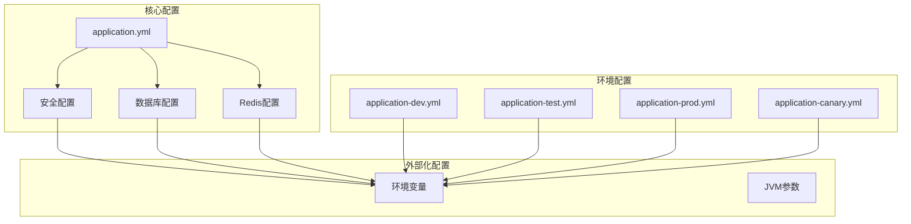

**图表来源**
- [application.yml:1-106](file://sso-auth-server/src/main/resources/application.yml#L1-L106)

### 关键配置项

| 配置类别 | 配置项 | 默认值 | 用途 |
|---------|--------|--------|------|
| 数据库 | spring.datasource.url | jdbc:postgresql://localhost:5432/sso_auth | PostgreSQL连接地址 |
| Redis | spring.data.redis.host | localhost | Redis服务器地址 |
| 安全 | security.issuer-uri | http://localhost:9000 | JWT签发者URI |
| 验证码 | verification-code.sms.enabled | false | 短信验证开关 |
| 验证码 | verification-code.email.enabled | true | 邮箱验证开关 |

**章节来源**
- [application.yml:1-106](file://sso-auth-server/src/main/resources/application.yml#L1-L106)

## 测试验证方案

### Token验证测试流程

系统提供了完整的Token验证测试指南，涵盖从JWKS端点到受保护资源访问的全流程测试。

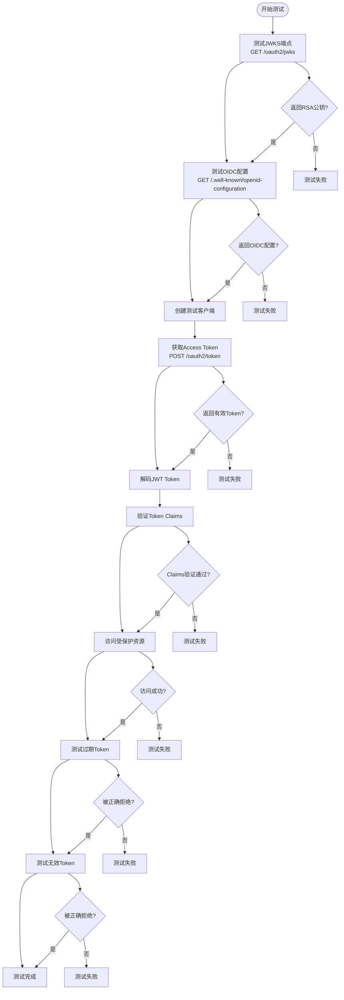

**图表来源**
- [TOKEN_VALIDATION_TEST.md:13-235](file://TOKEN_VALIDATION_TEST.md#L13-L235)

### 测试检查清单

- [ ] JWKS端点返回有效的RSA公钥
- [ ] OIDC配置端点返回正确的端点信息
- [ ] 能够成功创建OAuth2客户端
- [ ] 能够使用Client Credentials获取Token
- [ ] Token是正确的JWT格式
- [ ] Token包含必需的Claims（iss, exp, aud, sub）
- [ ] Token包含自定义Claims（roles, email, nickname）
- [ ] 使用有效Token可以访问受保护资源
- [ ] 使用无效Token被正确拒绝（401）
- [ ] 使用过期Token被正确拒绝（401）
- [ ] Token签名验证通过RSA公钥

**章节来源**
- [TOKEN_VALIDATION_TEST.md:1-235](file://TOKEN_VALIDATION_TEST.md#L1-L235)

## 故障排除指南

### 常见问题及解决方案

#### 1. 服务启动问题

**问题症状**：服务无法启动，端口占用

**解决步骤**：
1. 检查端口占用情况：`netstat -ano | findstr :9000`
2. 修改配置文件中的端口号
3. 检查数据库连接配置
4. 查看启动日志获取详细错误信息

#### 2. 数据库连接失败

**问题症状**：应用启动时报数据库连接错误

**解决步骤**：
1. 确认PostgreSQL服务正在运行
2. 检查数据库连接字符串配置
3. 验证用户名和密码设置
4. 确认数据库存在且可访问

#### 3. Redis连接失败

**问题症状**：验证码存储和会话功能异常

**解决步骤**：
1. 确认Redis服务正在运行
2. 检查Redis连接配置
3. 验证网络连通性
4. 确认Redis密码设置正确

#### 5. 统一认证失败

**问题症状**：统一认证过滤器无法处理认证请求

**诊断步骤**：
1. 检查统一认证过滤器配置
2. 验证认证凭据参数是否正确传递
3. 确认认证策略注册和加载正常
4. 查看认证提供者的认证流程
5. 检查认证应用服务的执行结果

#### 6. 验证码认证失败

**问题症状**：验证码登录无法通过

**排查步骤**：
1. 检查验证码服务配置
2. 验证短信/邮箱服务提供商设置
3. 确认验证码存储和读取正常
4. 查看验证码过期时间设置
5. 验证认证策略的执行流程

**章节来源**
- [TOKEN_VALIDATION_TEST.md:200-221](file://TOKEN_VALIDATION_TEST.md#L200-L221)

## 总结

本SSO/OIDC认证系统提供了完整的企业级身份认证解决方案，具有以下特点：

### 技术优势

1. **统一认证架构**：全新的统一认证框架，支持多种认证方式的一致处理
2. **策略模式设计**：灵活的认证策略模式，便于扩展新的认证方式
3. **标准合规**：完全符合OpenID Connect和OAuth2.0标准
4. **安全可靠**：采用JWT令牌和RSA-256签名算法
5. **扩展性强**：支持多种认证方式和第三方登录
6. **配置灵活**：多环境配置支持和外部化配置
7. **监控完善**：集成Spring Boot Actuator进行健康检查

### 架构特色

1. **分层设计**：清晰的领域驱动设计分层
2. **接口隔离**：良好的接口抽象和依赖注入
3. **安全分离**：认证服务器与资源服务器分离
4. **数据持久化**：完整的数据模型和仓储模式
5. **统一处理**：所有认证方式通过统一过滤器处理

### 应用价值

该系统适用于需要统一身份认证的企业应用场景，能够有效提升系统的安全性、可维护性和用户体验。通过标准化的OIDC协议和灵活的配置选项，系统能够满足不同规模和复杂度的认证需求。新的统一认证框架为未来的功能扩展和维护提供了更好的基础。