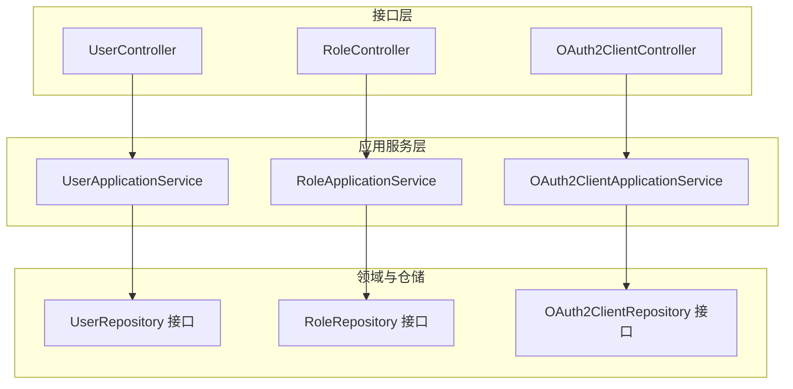
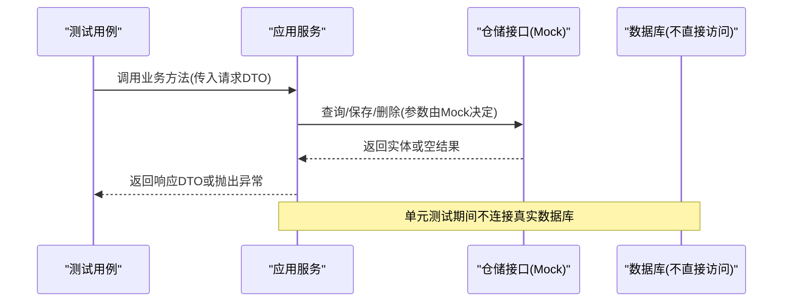
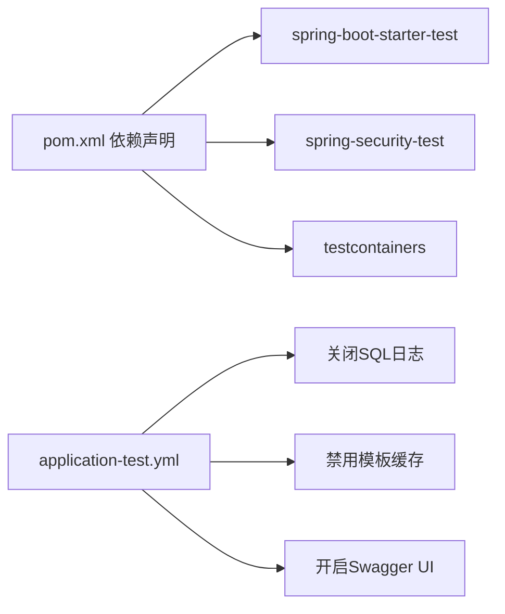

# 单元测试

<cite>
**本文引用的文件**
- [SsoOidcApplication.java](file://src/main/java/sso/oidc/SsoOidcApplication.java)
- [pom.xml](file://pom.xml)
- [application-test.yml](file://src/main/resources/application-test.yml)
- [UserApplicationService.java](file://src/main/java/sso/oidc/application/service/UserApplicationService.java)
- [OAuth2ClientApplicationService.java](file://src/main/java/sso/oidc/application/service/OAuth2ClientApplicationService.java)
- [RoleApplicationService.java](file://src/main/java/sso/oidc/application/service/RoleApplicationService.java)
- [UserRepository.java](file://src/main/java/sso/oidc/domain/repository/UserRepository.java)
- [RoleRepository.java](file://src/main/java/sso/oidc/domain/repository/RoleRepository.java)
- [OAuth2ClientRepository.java](file://src/main/java/sso/oidc/domain/repository/OAuth2ClientRepository.java)
</cite>

## 目录
1. [引言](#引言)
2. [项目结构](#项目结构)
3. [核心组件](#核心组件)
4. [架构总览](#架构总览)
5. [详细组件分析](#详细组件分析)
6. [依赖分析](#依赖分析)
7. [性能考虑](#性能考虑)
8. [故障排查指南](#故障排查指南)
9. [结论](#结论)
10. [附录](#附录)

## 引言
本文件面向IAM Platform认证服务的单元测试设计与实现，系统性阐述测试设计原则、断言方法、测试数据准备、Spring Boot Test注解（如扩展与MockBean）的使用方式，并针对领域模型、应用服务、仓储接口分别给出可落地的测试策略与最佳实践。同时，结合项目实际代码结构，提供Mock对象的使用场景、测试覆盖率与代码质量建议，以及覆盖用户管理、OAuth2客户端管理、角色管理等核心功能的测试示例路径。

## 项目结构
本项目采用分层架构：接口层（REST/Web）、应用服务层（Application Service）、领域模型与仓储接口、基础设施持久化与安全配置。单元测试应聚焦于应用服务层与仓储接口层，通过Mock外部依赖与数据库访问，确保测试快速、稳定、可重复。

图表来源
- [UserApplicationService.java:1-165](file://src/main/java/sso/oidc/application/service/UserApplicationService.java#L1-L165)
- [RoleApplicationService.java:1-63](file://src/main/java/sso/oidc/application/service/RoleApplicationService.java#L1-L63)
- [OAuth2ClientApplicationService.java:1-170](file://src/main/java/sso/oidc/application/service/OAuth2ClientApplicationService.java#L1-L170)
- [UserRepository.java:1-26](file://src/main/java/sso/oidc/domain/repository/UserRepository.java#L1-L26)
- [RoleRepository.java:1-19](file://src/main/java/sso/oidc/domain/repository/RoleRepository.java#L1-L19)
- [OAuth2ClientRepository.java:1-20](file://src/main/java/sso/oidc/domain/repository/OAuth2ClientRepository.java#L1-L20)

章节来源
- [SsoOidcApplication.java:1-13](file://src/main/java/sso/oidc/SsoOidcApplication.java#L1-L13)
- [pom.xml:117-139](file://pom.xml#L117-L139)
- [application-test.yml:1-16](file://src/main/resources/application-test.yml#L1-L16)

## 核心组件
- 应用服务层：封装业务用例，协调仓储与外部服务，负责事务边界与日志记录。
- 领域模型与仓储接口：定义实体与查询/保存契约，便于在单元测试中以Mock方式替换真实实现。
- 测试环境配置：通过测试配置文件关闭SQL日志、禁用模板缓存、开启OpenAPI UI，提升测试可读性与稳定性。

章节来源
- [UserApplicationService.java:1-165](file://src/main/java/sso/oidc/application/service/UserApplicationService.java#L1-L165)
- [RoleApplicationService.java:1-63](file://src/main/java/sso/oidc/application/service/RoleApplicationService.java#L1-L63)
- [OAuth2ClientApplicationService.java:1-170](file://src/main/java/sso/oidc/application/service/OAuth2ClientApplicationService.java#L1-L170)
- [UserRepository.java:1-26](file://src/main/java/sso/oidc/domain/repository/UserRepository.java#L1-L26)
- [RoleRepository.java:1-19](file://src/main/java/sso/oidc/domain/repository/RoleRepository.java#L1-L19)
- [OAuth2ClientRepository.java:1-20](file://src/main/java/sso/oidc/domain/repository/OAuth2ClientRepository.java#L1-L20)
- [application-test.yml:1-16](file://src/main/resources/application-test.yml#L1-L16)

## 架构总览
下图展示单元测试视角下的典型调用链：控制器调用应用服务，应用服务调用仓储接口，仓储接口被Mock替代，从而隔离外部依赖。

图表来源
- [UserApplicationService.java:36-63](file://src/main/java/sso/oidc/application/service/UserApplicationService.java#L36-L63)
- [OAuth2ClientApplicationService.java:29-72](file://src/main/java/sso/oidc/application/service/OAuth2ClientApplicationService.java#L29-L72)
- [RoleApplicationService.java:21-31](file://src/main/java/sso/oidc/application/service/RoleApplicationService.java#L21-L31)

## 详细组件分析

### 用户管理应用服务单元测试
目标：验证用户创建、更新、删除、列表、密码变更、角色分配/移除等流程；校验异常分支与事务语义。

- 测试设计原则
  - 使用@ExtendWith(MockitoExtension.class)启用Mockito对字段级@Mock/@Spy进行注入。
  - 使用@MockBean替换Spring上下文中的仓储与外部服务（如PasswordEncoder、PasswordPolicyService），避免真实依赖。
  - 使用@Import或测试配置加载application-test.yml，降低日志噪声，提升可读性。
  - 断言策略：对返回值、异常类型、仓储交互次数与参数、日志输出进行断言。
  - 数据准备：构造CreateUserRequest/UpdateUserRequest/AssignRoleRequest等请求对象，准备默认角色与用户实体的期望状态。

- 关键流程断言点
  - 创建用户：断言默认角色已赋值、密码经编码器处理、仓储save被调用且返回正确实体。
  - 更新用户：断言邮箱唯一性检查、邮箱冲突时抛出异常、仓储save被调用。
  - 删除用户：断言不存在时抛异常，存在时仓储delete被调用。
  - 列表分页：断言分页参数传递、映射到响应对象。
  - 密码变更：断言旧密码匹配失败抛异常、新密码经策略校验、编码后保存。
  - 角色分配/移除：断言角色存在性、集合操作后保存。

- 示例路径参考
  - 用户创建流程：[UserApplicationService.createUser:36-63](file://src/main/java/sso/oidc/application/service/UserApplicationService.java#L36-L63)
  - 用户更新流程：[UserApplicationService.updateUser:71-92](file://src/main/java/sso/oidc/application/service/UserApplicationService.java#L71-L92)
  - 用户删除流程：[UserApplicationService.deleteUser:94-101](file://src/main/java/sso/oidc/application/service/UserApplicationService.java#L94-L101)
  - 列表分页：[UserApplicationService.listUsers:103-110](file://src/main/java/sso/oidc/application/service/UserApplicationService.java#L103-L110)
  - 密码变更：[UserApplicationService.changePassword:112-125](file://src/main/java/sso/oidc/application/service/UserApplicationService.java#L112-L125)
  - 角色分配/移除：[UserApplicationService.assignRole/removeRole:127-149](file://src/main/java/sso/oidc/application/service/UserApplicationService.java#L127-L149)

- Mock对象最佳实践
  - 对UserRepository、RoleRepository、PasswordEncoder、PasswordPolicyService进行@MockBean。
  - 使用when(...).thenReturn(...)预设仓储查询结果；使用verify(...).times(n)断言调用次数。
  - 对异常场景，使用assertThrows断言具体异常类型与消息。

- 事务与异常
  - 所有写操作均在@Transactional中执行，测试需确保异常发生时不会提交数据。
  - 对不存在资源的场景，断言抛出UserNotFoundException等业务异常。

章节来源
- [UserApplicationService.java:1-165](file://src/main/java/sso/oidc/application/service/UserApplicationService.java#L1-L165)
- [UserRepository.java:1-26](file://src/main/java/sso/oidc/domain/repository/UserRepository.java#L1-L26)
- [RoleRepository.java:1-19](file://src/main/java/sso/oidc/domain/repository/RoleRepository.java#L1-L19)

### OAuth2客户端管理应用服务单元测试
目标：验证客户端注册、查询、更新、删除、列表、密钥轮换等流程；校验默认参数与令牌有效期设置。

- 测试设计原则
  - 使用@MockBean替换OAuth2ClientRepository，构造UUID生成策略的可控行为。
  - 断言响应对象字段与请求字段映射一致，断言仓储save调用与参数。
  - 密钥轮换：断言新密钥生成、更新时间戳、仓储保存。

- 关键流程断言点
  - 注册客户端：断言生成clientId/clientSecret、默认授权方式、默认有效期、仓储保存。
  - 更新客户端：断言部分字段可选更新、仓储保存。
  - 删除客户端：断言不存在时抛异常，存在时仓储删除。
  - 列表分页：断言分页参数与映射。
  - 密钥轮换：断言新密钥生成、更新时间戳、仓储保存。

- 示例路径参考
  - 客户端注册：[OAuth2ClientApplicationService.registerClient:29-72](file://src/main/java/sso/oidc/application/service/OAuth2ClientApplicationService.java#L29-L72)
  - 客户端更新：[OAuth2ClientApplicationService.updateClient:80-108](file://src/main/java/sso/oidc/application/service/OAuth2ClientApplicationService.java#L80-L108)
  - 客户端删除：[OAuth2ClientApplicationService.deleteClient:110-117](file://src/main/java/sso/oidc/application/service/OAuth2ClientApplicationService.java#L110-L117)
  - 列表分页：[OAuth2ClientApplicationService.listClients:119-126](file://src/main/java/sso/oidc/application/service/OAuth2ClientApplicationService.java#L119-L126)
  - 密钥轮换：[OAuth2ClientApplicationService.rotateClientSecret:128-153](file://src/main/java/sso/oidc/application/service/OAuth2ClientApplicationService.java#L128-L153)

- Mock对象最佳实践
  - 对OAuth2ClientRepository进行@MockBean，使用when(...).thenReturn(...)模拟查询与保存。
  - 对UUID生成逻辑进行可控mock，确保断言可复现。

章节来源
- [OAuth2ClientApplicationService.java:1-170](file://src/main/java/sso/oidc/application/service/OAuth2ClientApplicationService.java#L1-L170)
- [OAuth2ClientRepository.java:1-20](file://src/main/java/sso/oidc/domain/repository/OAuth2ClientRepository.java#L1-L20)

### 角色管理应用服务单元测试
目标：验证角色创建、查询、列表、删除等流程；校验异常分支。

- 测试设计原则
  - 使用@MockBean替换RoleRepository，断言保存与查询行为。
  - 删除前检查是否存在，不存在则抛异常；存在则删除。

- 关键流程断言点
  - 创建角色：断言保存成功、返回响应对象。
  - 查询角色：断言不存在时抛异常，存在时返回响应。
  - 列表角色：断言映射到响应列表。
  - 删除角色：断言不存在时抛异常，存在时删除。

- 示例路径参考
  - 创建角色：[RoleApplicationService.createRole:21-31](file://src/main/java/sso/oidc/application/service/RoleApplicationService.java#L21-L31)
  - 查询角色：[RoleApplicationService.getRole:33-37](file://src/main/java/sso/oidc/application/service/RoleApplicationService.java#L33-L37)
  - 列表角色：[RoleApplicationService.listRoles:39-41](file://src/main/java/sso/oidc/application/service/RoleApplicationService.java#L39-L41)
  - 删除角色：[RoleApplicationService.deleteRole:43-50](file://src/main/java/sso/oidc/application/service/RoleApplicationService.java#L43-L50)

- Mock对象最佳实践
  - 对RoleRepository进行@MockBean，使用when(...).thenReturn(...)模拟查询与保存。
  - 对异常场景，使用assertThrows断言具体异常类型。

章节来源
- [RoleApplicationService.java:1-63](file://src/main/java/sso/oidc/application/service/RoleApplicationService.java#L1-L63)
- [RoleRepository.java:1-19](file://src/main/java/sso/oidc/domain/repository/RoleRepository.java#L1-L19)

### 仓储接口测试策略
- 目标：验证仓储接口契约与分页行为，通常通过集成测试或Mock测试完成。
- 策略：
  - 单元测试：对应用服务进行Mock测试，仓储接口作为依赖被@MockBean替换。
  - 集成测试：使用@Testcontainers启动PostgreSQL，执行真实SQL迁移与数据校验。
- 建议：
  - 优先在应用服务层进行Mock测试，减少对数据库的依赖。
  - 如需验证复杂查询或分页，可在集成测试中进行。

章节来源
- [UserRepository.java:1-26](file://src/main/java/sso/oidc/domain/repository/UserRepository.java#L1-L26)
- [RoleRepository.java:1-19](file://src/main/java/sso/oidc/domain/repository/RoleRepository.java#L1-L19)
- [OAuth2ClientRepository.java:1-20](file://src/main/java/sso/oidc/domain/repository/OAuth2ClientRepository.java#L1-L20)
- [pom.xml:129-139](file://pom.xml#L129-L139)

## 依赖分析
- 测试依赖
  - spring-boot-starter-test：提供JUnit、Mockito、AssertJ等测试工具。
  - spring-security-test：提供安全相关测试支持。
  - testcontainers：用于集成测试阶段启动PostgreSQL容器。
- 配置依赖
  - application-test.yml：关闭SQL日志、禁用模板缓存、开启Swagger UI，提升测试可读性与调试效率。

图表来源
- [pom.xml:117-139](file://pom.xml#L117-L139)
- [application-test.yml:1-16](file://src/main/resources/application-test.yml#L1-L16)

章节来源
- [pom.xml:117-139](file://pom.xml#L117-L139)
- [application-test.yml:1-16](file://src/main/resources/application-test.yml#L1-L16)

## 性能考虑
- 单元测试应避免真实数据库访问，优先使用Mock与内存态断言，保证测试速度与稳定性。
- 对复杂业务流程，可拆分为多个小用例，分别断言关键分支与异常路径。
- 合理使用@ParameterizedTest与CSV源，减少重复代码，提升覆盖率。

## 故障排查指南
- 常见问题
  - Mock未生效：确认使用@ExtendWith(MockitoExtension.class)与@MockBean，且作用域正确。
  - 事务未回滚：确保异常场景使用断言捕获异常，避免吞掉异常导致提交。
  - 分页断言失败：核对PageRequest参数与PageResponse映射逻辑。
- 日志与配置
  - application-test.yml已关闭SQL日志，便于聚焦测试输出。
  - 可临时调整日志级别以辅助定位问题。

章节来源
- [application-test.yml:1-16](file://src/main/resources/application-test.yml#L1-L16)

## 结论
通过在应用服务层进行Mock测试、在仓储接口层进行契约验证，可以高效构建高覆盖率、高可维护性的单元测试体系。配合合理的断言策略与测试数据准备，能够稳定地覆盖用户管理、OAuth2客户端管理、角色管理等核心功能的关键路径与异常分支。

## 附录
- 测试注解与最佳实践速查
  - @ExtendWith(MockitoExtension.class)：启用字段级@Mock/@Spy注入。
  - @MockBean：替换Spring上下文中的Bean，常用于仓储与外部服务。
  - @Import(TestConfig.class) 或加载application-test.yml：统一测试配置。
  - 断言：使用assertThat/assertThrows/verify等组合，确保行为与异常均被验证。
  - 测试数据：构造最小必要数据集，避免跨用例耦合。
- 覆盖率与质量标准建议
  - 行为覆盖率：核心业务路径（创建/更新/删除/查询/异常）达到100%。
  - 分支覆盖率：关键条件分支（如邮箱唯一性、角色存在性）覆盖。
  - 代码质量：保持单测函数短小、命名清晰、断言明确，避免“上帝测试”。