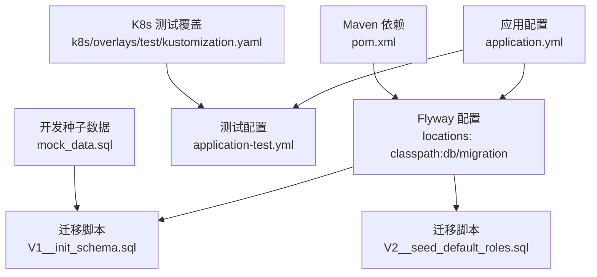
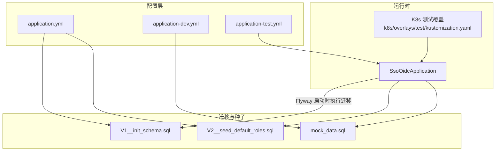
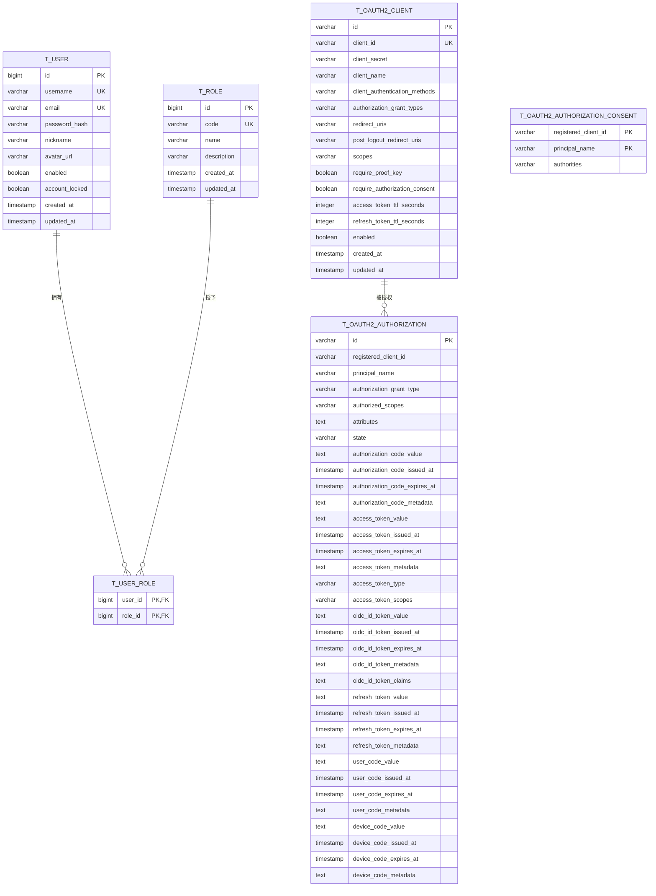
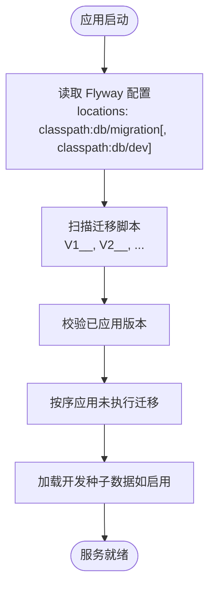
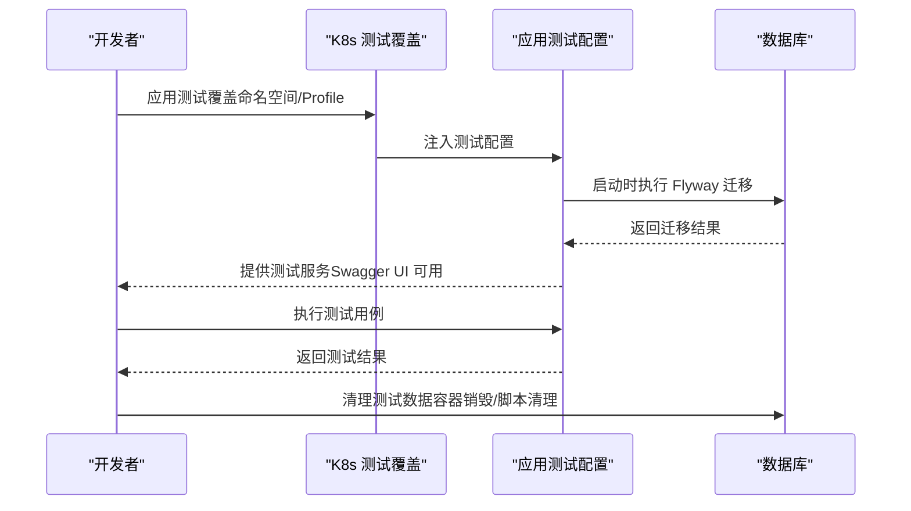
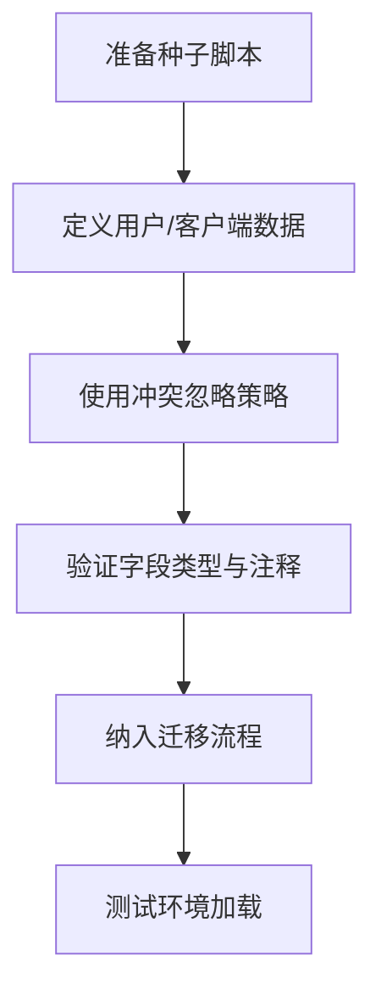
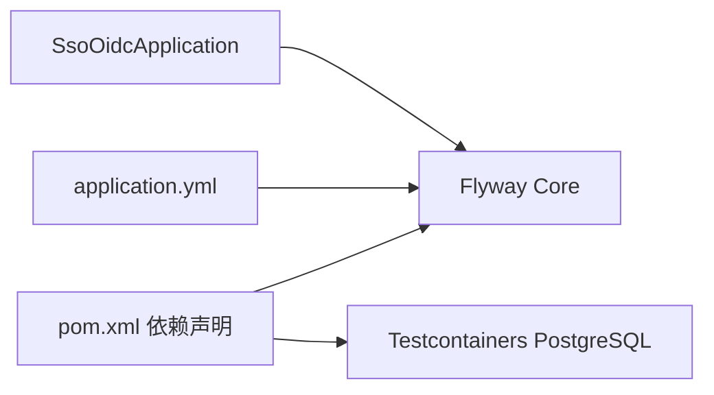
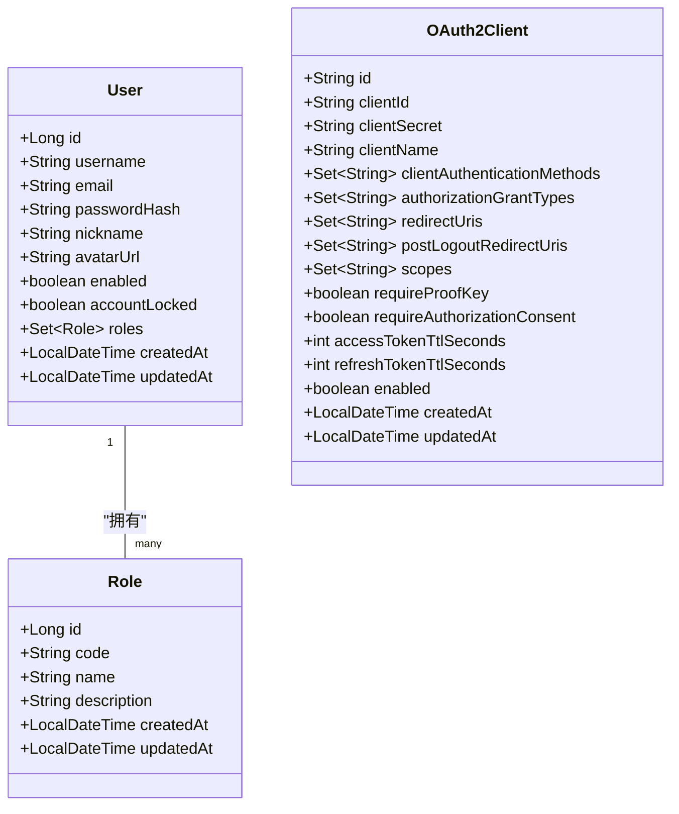

# 测试数据管理

<cite>
**本文引用的文件**
- [application.yml](file://src/main/resources/application.yml)
- [application-test.yml](file://src/main/resources/application-test.yml)
- [application-dev.yml](file://src/main/resources/application-dev.yml)
- [V1__init_schema.sql](file://src/main/resources/db/migration/V1__init_schema.sql)
- [V2__seed_default_roles.sql](file://src/main/resources/db/migration/V2__seed_default_roles.sql)
- [mock_data.sql](file://src/main/resources/db/dev/mock_data.sql)
- [kustomization.yaml（测试）](file://k8s/overlays/test/kustomization.yaml)
- [pom.xml](file://pom.xml)
- [SsoOidcApplication.java](file://src/main/java/sso/oidc/SsoOidcApplication.java)
- [User.java](file://src/main/java/sso/oidc/domain/model/entity/User.java)
- [Role.java](file://src/main/java/sso/oidc/domain/model/entity/Role.java)
- [OAuth2Client.java](file://src/main/java/sso/oidc/domain/model/entity/OAuth2Client.java)
</cite>

## 目录
1. [引言](#引言)
2. [项目结构](#项目结构)
3. [核心组件](#核心组件)
4. [架构总览](#架构总览)
5. [详细组件分析](#详细组件分析)
6. [依赖分析](#依赖分析)
7. [性能考量](#性能考量)
8. [故障排查指南](#故障排查指南)
9. [结论](#结论)
10. [附录](#附录)

## 引言
本文件聚焦于IAM Platform认证服务的“测试数据管理”，围绕以下目标展开：测试数据的结构设计与一致性保障、Flyway在测试中的迁移与版本管理、测试环境隔离与执行后清理、Mock数据的生成与管理、安全性考虑（敏感数据脱敏）、以及在不同测试环境中的准备与维护实践。本文所有技术细节均基于仓库中实际存在的配置与脚本进行说明。

## 项目结构
测试数据管理涉及的关键位置包括：
- Flyway迁移脚本：db/migration（初始化与默认数据）
- 开发环境种子数据：db/dev/mock_data.sql
- 应用配置：application.yml（全局）、application-dev.yml（开发）、application-test.yml（测试）
- Kubernetes测试覆盖：k8s/overlays/test/kustomization.yaml
- Maven依赖：pom.xml（Flyway、Testcontainers等）

**图示来源**
- [application.yml:32-34](file://src/main/resources/application.yml#L32-L34)
- [application-dev.yml:7-8](file://src/main/resources/application-dev.yml#L7-L8)
- [application-test.yml:1-16](file://src/main/resources/application-test.yml#L1-L16)
- [V1__init_schema.sql:1-180](file://src/main/resources/db/migration/V1__init_schema.sql#L1-L180)
- [V2__seed_default_roles.sql:1-9](file://src/main/resources/db/migration/V2__seed_default_roles.sql#L1-L9)
- [mock_data.sql:1-38](file://src/main/resources/db/dev/mock_data.sql#L1-L38)
- [kustomization.yaml（测试）:15-23](file://k8s/overlays/test/kustomization.yaml#L15-L23)
- [pom.xml:76-78](file://pom.xml#L76-L78)

**章节来源**
- [application.yml:1-78](file://src/main/resources/application.yml#L1-L78)
- [application-dev.yml:1-21](file://src/main/resources/application-dev.yml#L1-L21)
- [application-test.yml:1-16](file://src/main/resources/application-test.yml#L1-L16)
- [V1__init_schema.sql:1-180](file://src/main/resources/db/migration/V1__init_schema.sql#L1-L180)
- [V2__seed_default_roles.sql:1-9](file://src/main/resources/db/migration/V2__seed_default_roles.sql#L1-L9)
- [mock_data.sql:1-38](file://src/main/resources/db/dev/mock_data.sql#L1-L38)
- [kustomization.yaml（测试）:1-23](file://k8s/overlays/test/kustomization.yaml#L1-L23)
- [pom.xml:1-225](file://pom.xml#L1-L225)

## 核心组件
- 数据库模式与默认数据
  - 初始化脚本定义了角色、用户、用户角色、OAuth2客户端及授权表等核心结构，并建立索引与更新触发器，确保时间戳一致性。
  - 默认角色迁移脚本插入基础角色，使用冲突忽略策略以避免重复。
  - 开发环境种子数据提供演示用用户与客户端，便于本地联调。
- 测试配置与隔离
  - application-test.yml启用OpenAPI UI，关闭SQL日志，降低噪声。
  - K8s测试覆盖通过Kustomize设置命名空间与profile激活，确保测试环境独立运行。
- 迁移与版本管理
  - application.yml启用Flyway，指定迁移脚本目录；开发环境额外加载开发种子数据目录。
  - 迁移脚本采用标准命名规则（V1__、V2__），便于版本演进与回滚。
- 安全性与Mock数据
  - 用户密码采用哈希存储；客户端密钥采用加密存储；迁移脚本注释明确字段用途。
  - Mock数据仅用于演示与开发，不包含真实生产敏感信息。

**章节来源**
- [V1__init_schema.sql:1-180](file://src/main/resources/db/migration/V1__init_schema.sql#L1-L180)
- [V2__seed_default_roles.sql:1-9](file://src/main/resources/db/migration/V2__seed_default_roles.sql#L1-L9)
- [mock_data.sql:1-38](file://src/main/resources/db/dev/mock_data.sql#L1-L38)
- [application-test.yml:1-16](file://src/main/resources/application-test.yml#L1-L16)
- [kustomization.yaml（测试）:4-23](file://k8s/overlays/test/kustomization.yaml#L4-L23)
- [application.yml:32-34](file://src/main/resources/application.yml#L32-L34)
- [application-dev.yml:7-8](file://src/main/resources/application-dev.yml#L7-L8)

## 架构总览
下图展示了测试数据管理在系统中的位置与交互：

**图示来源**
- [application.yml:32-34](file://src/main/resources/application.yml#L32-L34)
- [application-dev.yml:7-8](file://src/main/resources/application-dev.yml#L7-L8)
- [application-test.yml:1-16](file://src/main/resources/application-test.yml#L1-L16)
- [V1__init_schema.sql:1-180](file://src/main/resources/db/migration/V1__init_schema.sql#L1-L180)
- [V2__seed_default_roles.sql:1-9](file://src/main/resources/db/migration/V2__seed_default_roles.sql#L1-L9)
- [mock_data.sql:1-38](file://src/main/resources/db/dev/mock_data.sql#L1-L38)
- [SsoOidcApplication.java:1-13](file://src/main/java/sso/oidc/SsoOidcApplication.java#L1-L13)
- [kustomization.yaml（测试）:4-23](file://k8s/overlays/test/kustomization.yaml#L4-L23)

## 详细组件分析

### 测试数据结构与一致性
- 表结构与约束
  - 角色表、用户表、用户角色关联表、OAuth2客户端表、授权表与授权同意表均定义主键、唯一约束与索引，确保查询效率与数据完整性。
  - 更新触发器统一维护updated_at字段，保证审计一致性。
- 默认数据与冲突处理
  - 默认角色迁移脚本使用冲突忽略策略，避免重复执行导致异常。
  - 种子数据脚本同样采用冲突忽略，确保幂等性。
- 关系模型
  - 用户与角色多对多通过用户角色表维护；OAuth2客户端与授权状态由授权表与授权同意表支撑。

**图示来源**
- [V1__init_schema.sql:19-179](file://src/main/resources/db/migration/V1__init_schema.sql#L19-L179)

**章节来源**
- [V1__init_schema.sql:19-179](file://src/main/resources/db/migration/V1__init_schema.sql#L19-L179)

### Flyway在测试中的应用
- 迁移启用与路径
  - 全局配置启用Flyway并指向db/migration目录；开发环境追加db/dev目录，以便加载种子数据。
- 版本管理
  - 使用V1__、V2__等命名规范，清晰表达迁移顺序与职责。
- 执行时机
  - 应用启动时由Spring Boot自动执行，无需手动干预。

**图示来源**
- [application.yml:32-34](file://src/main/resources/application.yml#L32-L34)
- [application-dev.yml:7-8](file://src/main/resources/application-dev.yml#L7-L8)
- [V1__init_schema.sql:1-180](file://src/main/resources/db/migration/V1__init_schema.sql#L1-L180)
- [V2__seed_default_roles.sql:1-9](file://src/main/resources/db/migration/V2__seed_default_roles.sql#L1-L9)
- [mock_data.sql:1-38](file://src/main/resources/db/dev/mock_data.sql#L1-L38)

**章节来源**
- [application.yml:32-34](file://src/main/resources/application.yml#L32-L34)
- [application-dev.yml:7-8](file://src/main/resources/application-dev.yml#L7-L8)
- [pom.xml:76-78](file://pom.xml#L76-L78)

### 测试数据隔离机制
- 环境隔离
  - K8s测试覆盖通过命名空间与profile切换，确保测试资源与其他环境物理分离。
  - application-test.yml启用Swagger UI，便于测试访问API。
- 执行后清理
  - 建议在集成测试中使用容器化数据库（Testcontainers）并在测试结束后销毁容器，实现彻底隔离与清理。
- 数据隔离
  - 迁移脚本与种子数据采用冲突忽略策略，避免跨环境污染；测试中可按需编写临时数据清理脚本或在事务中回滚。

**图示来源**
- [kustomization.yaml（测试）:4-23](file://k8s/overlays/test/kustomization.yaml#L4-L23)
- [application-test.yml:13-16](file://src/main/resources/application-test.yml#L13-L16)
- [application.yml:32-34](file://src/main/resources/application.yml#L32-L34)

**章节来源**
- [kustomization.yaml（测试）:1-23](file://k8s/overlays/test/kustomization.yaml#L1-L23)
- [application-test.yml:1-16](file://src/main/resources/application-test.yml#L1-L16)

### Mock数据的生成与管理
- 演示用户与客户端
  - 开发种子数据提供演示用户与OAuth2客户端，便于本地联调与UI测试。
- 幂等性与一致性
  - 使用冲突忽略策略，确保多次执行不会产生重复数据。
- 字段安全
  - 密码与客户端密钥采用哈希/加密存储，迁移脚本注释明确字段含义。

**图示来源**
- [mock_data.sql:6-37](file://src/main/resources/db/dev/mock_data.sql#L6-L37)
- [V2__seed_default_roles.sql:5-8](file://src/main/resources/db/migration/V2__seed_default_roles.sql#L5-L8)

**章节来源**
- [mock_data.sql:1-38](file://src/main/resources/db/dev/mock_data.sql#L1-L38)
- [V2__seed_default_roles.sql:1-9](file://src/main/resources/db/migration/V2__seed_default_roles.sql#L1-L9)

### 测试数据的安全性考虑
- 敏感数据处理
  - 用户密码采用哈希存储；客户端密钥采用加密存储；迁移脚本注释明确字段用途。
- 环境区分
  - 开发与测试环境使用不同的配置与种子数据，避免真实敏感信息进入非生产环境。
- 最小暴露
  - 测试数据仅包含必要字段与最小化示例，避免泄露真实业务数据。

**章节来源**
- [V1__init_schema.sql:63,108](file://src/main/resources/db/migration/V1__init_schema.sql#L63,L108)
- [mock_data.sql:7-37](file://src/main/resources/db/dev/mock_data.sql#L7-L37)

### 测试数据管理示例
- 准备测试环境
  - 应用测试覆盖（命名空间与profile），确保测试服务独立运行。
  - 启动应用后，Flyway自动执行迁移与种子数据加载。
- 维护测试数据
  - 在db/migration中新增版本化迁移；在db/dev中补充或调整种子数据。
  - 通过application-test.yml控制日志级别与功能开关，提升测试可观测性。

**章节来源**
- [kustomization.yaml（测试）:4-23](file://k8s/overlays/test/kustomization.yaml#L4-L23)
- [application-test.yml:1-16](file://src/main/resources/application-test.yml#L1-L16)
- [application.yml:32-34](file://src/main/resources/application.yml#L32-L34)

## 依赖分析
- 外部依赖
  - Flyway核心：用于数据库迁移与版本管理。
  - Testcontainers：用于测试阶段的数据库容器化，便于隔离与清理。
- 内部耦合
  - 应用启动时加载配置并执行Flyway迁移，迁移脚本与种子数据共同构成测试数据基线。

**图示来源**
- [pom.xml:76-78](file://pom.xml#L76-L78)
- [pom.xml:135-139](file://pom.xml#L135-L139)
- [application.yml:32-34](file://src/main/resources/application.yml#L32-L34)
- [SsoOidcApplication.java:1-13](file://src/main/java/sso/oidc/SsoOidcApplication.java#L1-L13)

**章节来源**
- [pom.xml:1-225](file://pom.xml#L1-L225)
- [application.yml:32-34](file://src/main/resources/application.yml#L32-L34)
- [SsoOidcApplication.java:1-13](file://src/main/java/sso/oidc/SsoOidcApplication.java#L1-L13)

## 性能考量
- 索引与触发器
  - 授权表建立多处索引，有助于高并发场景下的查询性能；更新触发器统一维护时间戳，减少业务代码负担。
- 迁移幂等
  - 冲突忽略策略避免重复执行带来的性能损耗与异常风险。
- 测试隔离
  - 使用容器化数据库与独立命名空间，避免资源争用，提升测试稳定性。

**章节来源**
- [V1__init_schema.sql:53,56,102,161-165](file://src/main/resources/db/migration/V1__init_schema.sql#L53,L56,L102,L161-L165)
- [mock_data.sql:11,17,37](file://src/main/resources/db/dev/mock_data.sql#L11,L17,L37)

## 故障排查指南
- 迁移失败
  - 检查Flyway配置与脚本路径是否正确；确认数据库连接参数与权限。
- 冲突与重复
  - 若出现重复数据错误，检查冲突忽略策略是否生效；确认迁移版本是否正确。
- 测试环境异常
  - 校验K8s测试覆盖的命名空间与profile；查看测试配置的日志级别与功能开关。
- 容器化测试
  - 如使用Testcontainers，请确认容器镜像与网络配置；测试结束后清理容器与卷。

**章节来源**
- [application.yml:32-34](file://src/main/resources/application.yml#L32-L34)
- [kustomization.yaml（测试）:4-23](file://k8s/overlays/test/kustomization.yaml#L4-L23)
- [application-test.yml:1-16](file://src/main/resources/application-test.yml#L1-L16)
- [pom.xml:135-139](file://pom.xml#L135-L139)

## 结论
本项目通过标准化的迁移脚本、冲突忽略策略与环境隔离配置，实现了测试数据的结构化、幂等化与可维护性。结合Flyway的版本管理与K8s测试覆盖，能够在不同测试环境中稳定地准备与清理测试数据。建议在后续迭代中持续完善迁移脚本与种子数据，确保测试数据与业务需求同步演进。

## 附录
- 数据模型类概览（领域模型）
  - 用户实体：包含用户名、邮箱、密码哈希、昵称、头像、启用状态、锁定状态、角色集合与时间戳。
  - 角色实体：包含角色编码、名称、描述与时间戳。
  - OAuth2客户端实体：包含客户端标识、密钥、名称、认证方式、授权类型、重定向URI、作用域、TTL与启用状态等。

**图示来源**
- [User.java:1-36](file://src/main/java/sso/oidc/domain/model/entity/User.java#L1-L36)
- [Role.java:1-22](file://src/main/java/sso/oidc/domain/model/entity/Role.java#L1-L22)
- [OAuth2Client.java:1-69](file://src/main/java/sso/oidc/domain/model/entity/OAuth2Client.java#L1-L69)