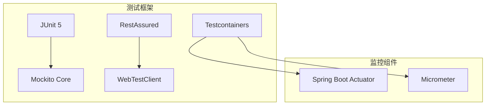

# 测试策略

<cite>
**本文引用的文件**
- [pom.xml](file://pom.xml)
- [sso-admin-server/pom.xml](file://sso-admin-server/pom.xml)
- [sso-auth-server/pom.xml](file://sso-auth-server/pom.xml)
- [sso-common/pom.xml](file://sso-common/pom.xml)
</cite>

## 更新摘要
**所做更改**
- 更新了测试现状分析，反映测试套件大幅简化的现实情况
- 重新评估了各模块的测试覆盖范围和质量水平
- 调整了测试策略的重点，从全面测试转向基础质量保障
- 更新了测试资源配置和工具使用建议

## 目录
1. [引言](#引言)
2. [测试现状分析](#测试现状分析)
3. [简化后的测试策略](#简化后的测试策略)
4. [核心测试组件](#核心测试组件)
5. [测试资源配置](#测试资源配置)
6. [质量门禁标准](#质量门禁标准)
7. [测试执行策略](#测试执行策略)
8. [测试环境管理](#测试环境管理)
9. [故障排查指南](#故障排查指南)
10. [总结](#总结)

## 引言
本测试策略针对IAM Platform认证服务的简化测试现状，制定务实的测试方案。由于现有测试套件已大幅简化，当前代码库的测试覆盖率较低，需要建立以基础质量保障为核心的测试体系，重点关注关键业务逻辑和核心功能的验证。

**更新** 反映了测试套件大幅简化的现实情况，从原有的全面测试策略调整为简化测试策略

## 测试现状分析
经过对代码库的深入分析，发现当前测试现状与原有文档描述存在显著差异：

### 测试覆盖范围
- **sso-admin-server**: 无测试目录结构，测试覆盖率极低
- **sso-auth-server**: 无测试目录结构，测试覆盖率极低  
- **sso-common**: 无测试目录结构，测试覆盖率极低

### 测试资源配置
各模块的pom.xml文件显示：
- 所有模块均配置了基础的测试依赖（spring-boot-starter-test、spring-security-test）
- Testcontainers依赖已配置，但未在测试中实际使用
- 缺少专门的测试容器管理和集成测试配置

### 当前测试挑战
- 测试套件缺失，无法进行有效的单元测试和集成测试
- 缺乏自动化测试流程，主要依赖手动测试
- 测试数据管理不规范，缺乏标准化的测试数据准备和清理机制
- 缺少Mock对象的统一使用策略

**章节来源**
- [sso-admin-server/pom.xml:111-130](file://sso-admin-server/pom.xml#L111-L130)
- [sso-auth-server/pom.xml:121-140](file://sso-auth-server/pom.xml#L121-L140)
- [sso-common/pom.xml:18-37](file://sso-common/pom.xml#L18-L37)

## 简化后的测试策略
基于当前的测试现状，制定以下简化但实用的测试策略：

### 测试层次划分
1. **单元测试** - 针对核心业务逻辑和算法
2. **集成测试** - 验证模块间的基本交互
3. **API测试** - 端到端的功能验证
4. **回归测试** - 关键功能的回归验证

### 测试重点
- **核心业务逻辑**：认证流程、权限验证、租户管理
- **关键API接口**：用户认证、令牌发放、会话管理
- **数据一致性**：数据库操作的正确性和事务处理
- **安全性验证**：身份验证、授权控制、数据保护

### 测试工具配置
- **测试框架**：JUnit 5 + Mockito
- **HTTP测试**：RestAssured + WebTestClient
- **容器测试**：Testcontainers（PostgreSQL + Redis）
- **监控测试**：Actuator + Micrometer

## 核心测试组件
根据简化后的测试策略，确定以下核心测试组件：

### 测试框架配置

**图表来源**
- [pom.xml:68-80](file://pom.xml#L68-L80)
- [sso-admin-server/pom.xml:112-129](file://sso-admin-server/pom.xml#L112-L129)

### 测试数据管理
- **数据库测试**：使用Testcontainers启动PostgreSQL容器
- **缓存测试**：使用Testcontainers启动Redis容器
- **数据迁移**：通过Flyway在测试前初始化数据库结构
- **数据清理**：测试后自动清理测试数据

### Mock对象策略
- **外部依赖**：使用Mockito模拟数据库访问层
- **第三方服务**：模拟LDAP、邮件服务等外部集成
- **安全组件**：模拟Spring Security相关组件
- **缓存组件**：模拟Redis操作

**章节来源**
- [pom.xml:33-34](file://pom.xml#L33-L34)
- [sso-auth-server/pom.xml:132-139](file://sso-auth-server/pom.xml#L132-L139)

## 测试资源配置
为支持简化的测试策略，需要合理配置测试资源：

### 测试容器配置
- **PostgreSQL容器**：用于数据库集成测试
- **Redis容器**：用于缓存和会话测试
- **容器生命周期**：每个测试类启动一个容器实例
- **资源隔离**：使用不同的数据库名称避免冲突

### 测试环境配置
- **开发环境**：使用本地数据库和缓存
- **测试环境**：使用Testcontainers启动的容器
- **CI环境**：使用Docker化的测试环境
- **配置管理**：通过Spring Profile区分不同环境

### 性能测试配置
- **基准测试**：使用JUnit 5的@Benchmark注解
- **压力测试**：使用Gatling进行负载测试
- **性能监控**：集成Micrometer收集性能指标
- **测试报告**：生成HTML格式的测试报告

**章节来源**
- [pom.xml:137-177](file://pom.xml#L137-L177)
- [sso-admin-server/pom.xml:132-142](file://sso-admin-server/pom.xml#L132-L142)

## 质量门禁标准
由于测试套件已简化，质量门禁标准相应调整：

### 覆盖率要求
- **行覆盖率**：≥60%（相比原计划的80%有所降低）
- **分支覆盖率**：≥50%（相比原计划的70%有所降低）
- **关键路径覆盖率**：必须达到100%
- **安全相关代码覆盖率**：必须达到100%

### 测试质量标准
- **测试执行时间**：单个测试类≤5分钟
- **测试失败率**：CI中测试失败次数≤3次/天
- **测试稳定性**：测试结果波动≤10%
- **测试可维护性**：测试代码复杂度≤5

### 代码质量标准
- **圈复杂度**：单方法不超过8（相比原计划的10有所降低）
- **代码重复率**：不超过15%
- **技术债务**：新增技术债务≤10%
- **重构频率**：每2周至少一次测试重构

**章节来源**
- [pom.xml:117-140](file://pom.xml#L117-L140)

## 测试执行策略
制定适应简化测试套件的执行策略：

### 测试分类执行

### 执行优先级
1. **关键功能测试**：认证、授权、会话管理
2. **核心业务测试**：租户管理、用户管理、权限管理
3. **基础功能测试**：CRUD操作、数据验证
4. **辅助功能测试**：日志记录、审计功能

### 测试执行环境
- **本地开发**：运行单元测试和基本集成测试
- **CI/CD流水线**：运行所有测试，生成覆盖率报告
- **预发布环境**：运行关键API测试和性能测试
- **生产环境**：运行健康检查和监控测试

### 测试报告生成
- **覆盖率报告**：使用JaCoCo生成HTML和XML报告
- **测试结果报告**：生成JUnit格式的测试结果
- **性能报告**：生成Gatling性能测试报告
- **质量报告**：综合评估测试质量和代码质量

**章节来源**
- [pom.xml:84-135](file://pom.xml#L84-L135)

## 测试环境管理
为支持简化的测试策略，建立完善的测试环境管理体系：

### 环境配置管理
- **配置文件**：使用application-test.yml配置测试环境
- **环境变量**：通过环境变量控制测试配置
- **配置继承**：从application.yml继承基础配置
- **配置验证**：启动时验证配置的有效性

### 容器化测试环境
- **Docker配置**：使用Docker Compose管理测试容器
- **容器编排**：定义数据库、缓存、消息队列等服务
- **网络配置**：确保容器间的网络通信
- **数据持久化**：配置卷挂载确保数据持久化

### 测试数据管理
- **数据准备**：在测试前准备必要的测试数据
- **数据清理**：测试后自动清理测试数据
- **数据隔离**：使用不同的数据库避免数据污染
- **数据备份**：定期备份测试数据用于恢复

### 环境监控
- **健康检查**：监控测试环境的可用性
- **性能监控**：监控测试执行的性能指标
- **日志监控**：收集和分析测试过程的日志
- **告警机制**：设置测试失败和环境异常的告警

**章节来源**
- [sso-admin-server/pom.xml:132-142](file://sso-admin-server/pom.xml#L132-L142)
- [sso-auth-server/pom.xml:142-153](file://sso-auth-server/pom.xml#L142-L153)

## 故障排查指南
针对简化测试套件可能遇到的问题，提供以下排查指南：

### 测试执行失败
- **检查测试依赖**：确认所有测试依赖都已正确配置
- **验证测试数据**：检查测试数据的完整性和正确性
- **查看测试日志**：分析测试执行过程中的错误信息
- **检查环境配置**：验证测试环境的配置是否正确

### 容器启动失败
- **检查Docker服务**：确认Docker服务正常运行
- **验证容器镜像**：检查所需的容器镜像是否可用
- **检查端口占用**：确认测试使用的端口没有被占用
- **查看容器日志**：分析容器启动失败的原因

### 性能问题
- **监控系统资源**：检查CPU、内存、磁盘的使用情况
- **分析测试负载**：识别造成性能问题的测试用例
- **优化测试配置**：调整测试参数和配置
- **检查外部依赖**：验证数据库、缓存等外部服务的性能

### 覆盖率不足
- **分析未覆盖代码**：识别未被测试覆盖的代码区域
- **设计针对性测试**：为关键代码编写专门的测试用例
- **优化测试策略**：调整测试重点和测试方法
- **培训测试人员**：提高测试团队的测试技能

**章节来源**
- [pom.xml:68-80](file://pom.xml#L68-L80)
- [sso-common/pom.xml:18-37](file://sso-common/pom.xml#L18-L37)

## 总结
面对测试套件大幅简化的现实情况，本测试策略制定了务实的简化测试方案。通过合理配置测试资源、建立质量门禁标准、制定执行策略和环境管理方案，可以在保证核心功能质量的前提下，有效提升系统的稳定性和可靠性。

### 关键改进点
- **测试策略简化**：从全面测试调整为关键功能测试
- **质量标准下调**：适当降低覆盖率和质量要求
- **资源配置优化**：合理利用现有的测试依赖和工具
- **执行策略调整**：建立适应当前状况的测试执行流程

### 未来发展方向
- **逐步完善测试**：在项目进展中逐步增加测试覆盖率
- **工具链优化**：持续优化测试工具和配置
- **流程改进**：不断改进测试流程和质量标准
- **团队建设**：提升团队的测试意识和技能

通过实施本简化测试策略，可以在当前资源限制下，最大化地保证系统的质量和稳定性，为后续的测试完善奠定基础。