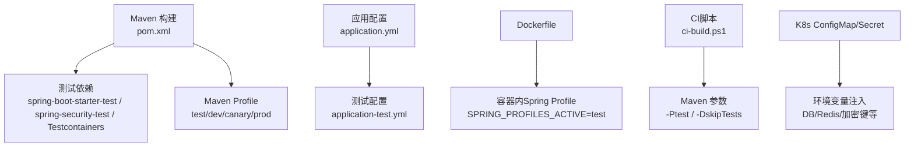
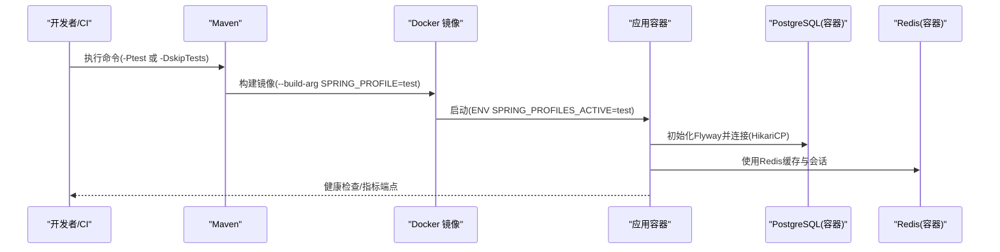
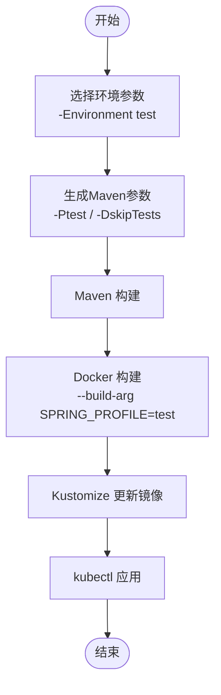
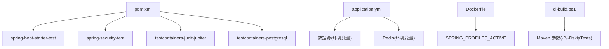

# 测试配置

<cite>
**本文引用的文件**
- [pom.xml](file://pom.xml)
- [application-test.yml](file://src/main/resources/application-test.yml)
- [application.yml](file://src/main/resources/application.yml)
- [RedisConfig.java](file://src/main/java/sso/oidc/infrastructure/config/RedisConfig.java)
- [ci-build.ps1](file://ci-build.ps1)
- [Dockerfile](file://Dockerfile)
- [k8s/base/configmap.yaml](file://k8s/base/configmap.yaml)
- [k8s/base/secret.yaml](file://k8s/base/secret.yaml)
- [DEPLOYMENT.md](file://DEPLOYMENT.md)
</cite>

## 目录
1. [简介](#简介)
2. [项目结构](#项目结构)
3. [核心组件](#核心组件)
4. [架构总览](#架构总览)
5. [详细组件分析](#详细组件分析)
6. [依赖分析](#依赖分析)
7. [性能考虑](#性能考虑)
8. [故障排查指南](#故障排查指南)
9. [结论](#结论)
10. [附录](#附录)

## 简介
本文件面向IAM Platform认证服务的测试配置，系统性说明以下内容：
- Maven测试依赖与插件配置
- 测试资源配置与环境隔离
- 测试工具链（JUnit、Mockito、Testcontainers）的引入与使用要点
- 测试报告与覆盖率统计的可选方案
- 持续集成环境中的测试执行策略与参数化
- 不同环境下的测试执行参数与输出格式示例

## 项目结构
围绕测试的相关文件与配置分布如下：
- Maven构建与测试：在POM中声明测试依赖与编译插件；通过Maven Profile激活测试环境
- 应用配置：application.yml定义通用配置；application-test.yml覆盖测试环境差异化项
- 容器与CI：Dockerfile支持按Spring Profile运行；ci-build.ps1控制CI/CD流水线中的测试开关
- Kubernetes：基础ConfigMap/Secret用于注入环境变量，支撑测试环境隔离

图表来源
- [pom.xml](file://pom.xml)
- [application.yml](file://src/main/resources/application.yml)
- [application-test.yml](file://src/main/resources/application-test.yml)
- [Dockerfile](file://Dockerfile)
- [ci-build.ps1](file://ci-build.ps1)
- [k8s/base/configmap.yaml](file://k8s/base/configmap.yaml)
- [k8s/base/secret.yaml](file://k8s/base/secret.yaml)

章节来源
- [pom.xml](file://pom.xml)
- [application.yml](file://src/main/resources/application.yml)
- [application-test.yml](file://src/main/resources/application-test.yml)
- [Dockerfile](file://Dockerfile)
- [ci-build.ps1](file://ci-build.ps1)
- [k8s/base/configmap.yaml](file://k8s/base/configmap.yaml)
- [k8s/base/secret.yaml](file://k8s/base/secret.yaml)

## 核心组件
- 测试依赖与版本
  - Spring Boot测试启动器、Spring Security测试模块、Testcontainers JUnit Jupiter与PostgreSQL模块
  - Testcontainers版本统一由属性管理
- 测试插件
  - Maven Compiler Plugin启用告警与注解处理器
  - Spring Boot Maven Plugin用于打包与排除Lombok
- 测试环境Profile
  - 通过Maven Profile设置spring.profiles.active=test，并映射镜像标签后缀
- 测试配置
  - application-test.yml开启Swagger UI，关闭SQL日志，降低日志级别，便于测试时观察

章节来源
- [pom.xml](file://pom.xml)
- [application-test.yml](file://src/main/resources/application-test.yml)

## 架构总览
测试执行的关键路径与交互如下：

图表来源
- [ci-build.ps1](file://ci-build.ps1)
- [Dockerfile](file://Dockerfile)
- [application.yml](file://src/main/resources/application.yml)
- [application-test.yml](file://src/main/resources/application-test.yml)

## 详细组件分析

### Maven测试配置
- 测试依赖
  - Spring Boot测试启动器：提供测试所需的基础组件与断言
  - Spring Security测试：提供安全上下文与Web测试支持
  - Testcontainers：以Jupiter扩展与PostgreSQL模块形式引入，便于集成测试
- 编译与插件
  - 编译插件开启告警与注解处理器，确保代码质量
  - Spring Boot插件排除Lombok，避免打包冗余
- Profile与镜像标签
  - test Profile将spring.profiles.active设为test，并在Docker镜像标签中追加-test后缀

章节来源
- [pom.xml](file://pom.xml)
- [Dockerfile](file://Dockerfile)

### 测试环境配置管理
- application-test.yml
  - 关闭JPA SQL日志，提升测试输出可读性
  - 关闭Thymeleaf缓存，便于模板变更即时生效
  - 开启SpringDoc Swagger UI，便于接口验证
  - 设置根日志级别为INFO，业务包为DEBUG，安全包为DEBUG，便于问题定位
- application.yml
  - 数据源与Redis连接通过环境变量注入，支持本地与Kubernetes环境
  - Hikari连接池参数、JPA方言、Jackson时区与日期格式等统一配置
  - Session存储类型为Redis，结合RedisConfig进行缓存管理

章节来源
- [application-test.yml](file://src/main/resources/application-test.yml)
- [application.yml](file://src/main/resources/application.yml)
- [RedisConfig.java](file://src/main/java/sso/oidc/infrastructure/config/RedisConfig.java)

### 测试工具配置与使用
- JUnit与Spring Boot测试
  - 使用Spring Boot测试启动器提供的注解与测试上下文，简化集成测试编写
- Mockito
  - 可通过添加依赖在测试中进行Mock对象与行为模拟，提升单元测试可控性
- Testcontainers
  - 引入junit-jupiter与postgresql模块，可在测试中自动拉起PostgreSQL容器，实现数据库集成测试
  - 建议在测试类上使用容器生命周期注解，确保测试前后容器的正确启动与清理

章节来源
- [pom.xml](file://pom.xml)

### 测试资源处理
- 资源隔离
  - 通过Maven Profile与Spring Profile切换测试配置文件，避免与开发/生产配置冲突
- 资源加载
  - application-test.yml仅在test Profile下生效，确保测试时的最小化配置集

章节来源
- [pom.xml](file://pom.xml)
- [application-test.yml](file://src/main/resources/application-test.yml)

### 测试报告与覆盖率统计
- 测试报告
  - 可通过Maven Surefire/Failsafe插件配置测试报告输出格式与目录
- 覆盖率统计
  - 可引入JaCoCo插件在CI中生成覆盖率报告，并与制品一起归档
- 建议
  - 在POM中增加插件配置，确保报告与覆盖率在CI中稳定产出

章节来源
- [pom.xml](file://pom.xml)

### 持续集成中的测试配置
- CI/CD流水线参数
  - ci-build.ps1支持通过参数选择环境(dev/test/canary/prod)，并可选择跳过测试
  - Maven阶段通过-P参数选择Profile，-DskipTests可跳过测试阶段
- 容器与配置
  - Dockerfile通过ARG SPRING_PROFILE与ENV SPRING_PROFILES_ACTIVE将Profile注入容器
  - K8s ConfigMap/Secret注入数据库、Redis与加密密钥等敏感信息，保障测试环境一致性

图表来源
- [ci-build.ps1](file://ci-build.ps1)
- [Dockerfile](file://Dockerfile)
- [k8s/base/configmap.yaml](file://k8s/base/configmap.yaml)
- [k8s/base/secret.yaml](file://k8s/base/secret.yaml)

章节来源
- [ci-build.ps1](file://ci-build.ps1)
- [Dockerfile](file://Dockerfile)
- [k8s/base/configmap.yaml](file://k8s/base/configmap.yaml)
- [k8s/base/secret.yaml](file://k8s/base/secret.yaml)

### 不同环境下的测试执行参数与输出格式示例
- 开发环境(dev)
  - Profile：dev
  - 建议：启用测试，输出详细日志，便于本地调试
- 测试环境(test)
  - Profile：test
  - 建议：启用测试，关闭SQL日志，开启Swagger UI，便于接口验证
- 预发布(canary)
  - Profile：canary
  - 建议：启用测试，适度放宽日志级别，关注性能指标
- 生产(prod)
  - Profile：prod
  - 建议：谨慎启用测试，优先通过CI流水线保证质量

章节来源
- [pom.xml](file://pom.xml)
- [application-test.yml](file://src/main/resources/application-test.yml)
- [DEPLOYMENT.md](file://DEPLOYMENT.md)

## 依赖分析
测试相关依赖与外部系统的耦合关系如下：

图表来源
- [pom.xml](file://pom.xml)
- [application.yml](file://src/main/resources/application.yml)
- [Dockerfile](file://Dockerfile)
- [ci-build.ps1](file://ci-build.ps1)

章节来源
- [pom.xml](file://pom.xml)
- [application.yml](file://src/main/resources/application.yml)
- [Dockerfile](file://Dockerfile)
- [ci-build.ps1](file://ci-build.ps1)

## 性能考虑
- 测试执行性能
  - 使用Testcontainers时建议复用容器或限制并发，减少冷启动开销
  - 在CI中启用并行测试与分片，缩短整体耗时
- 资源占用
  - 测试数据库与缓存服务应限制最大连接数与超时时间，避免资源争用
- 输出与报告
  - 控制日志级别与SQL输出，避免测试报告被噪声淹没

## 故障排查指南
- 测试无法启动或连接失败
  - 检查Spring Profile是否正确激活(test)
  - 核对环境变量(DB_HOST/DB_PORT/REDIS_HOST等)是否注入
  - 确认容器健康检查与端口暴露正常
- 测试报告缺失
  - 确认已配置Surefire/Failsafe与JaCoCo插件
  - 检查CI脚本是否传递了正确的Maven参数
- 配置不生效
  - 确认application-test.yml位于正确路径且被test Profile加载
  - 检查K8s ConfigMap/Secret是否正确注入

章节来源
- [application-test.yml](file://src/main/resources/application-test.yml)
- [application.yml](file://src/main/resources/application.yml)
- [ci-build.ps1](file://ci-build.ps1)
- [k8s/base/configmap.yaml](file://k8s/base/configmap.yaml)
- [k8s/base/secret.yaml](file://k8s/base/secret.yaml)

## 结论
本测试配置以Maven Profile与Spring Profile为核心，结合Docker与Kubernetes实现环境隔离；通过Testcontainers提供数据库集成测试能力；配合CI脚本实现可配置的测试执行策略。建议在现有基础上补充测试报告与覆盖率插件配置，进一步完善CI质量门禁。

## 附录
- 常用Maven测试命令
  - 激活test Profile并执行测试：mvn -Ptest
  - 跳过测试：mvn -DskipTests
  - 清理并打包：mvn clean package
- CI参数参考
  - -Environment test：选择测试环境
  - -SkipTests：跳过测试阶段
  - -Push/-Deploy：推送镜像并部署

章节来源
- [ci-build.ps1](file://ci-build.ps1)
- [pom.xml](file://pom.xml)