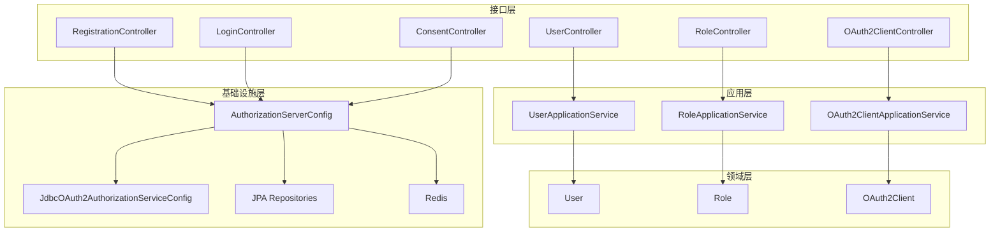
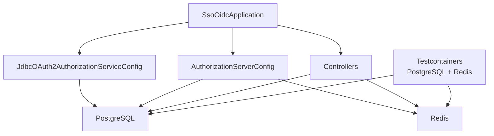
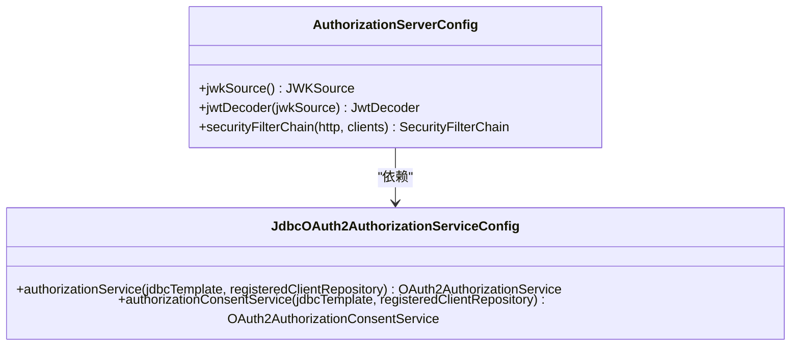
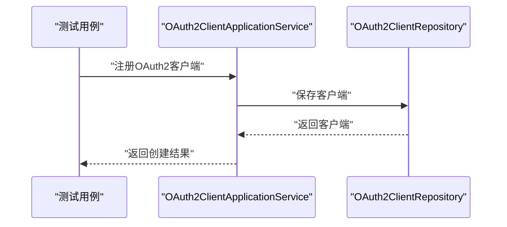
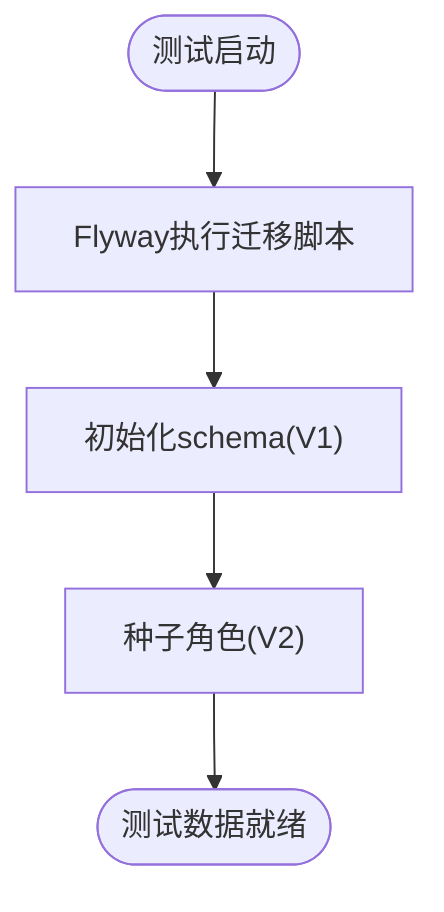
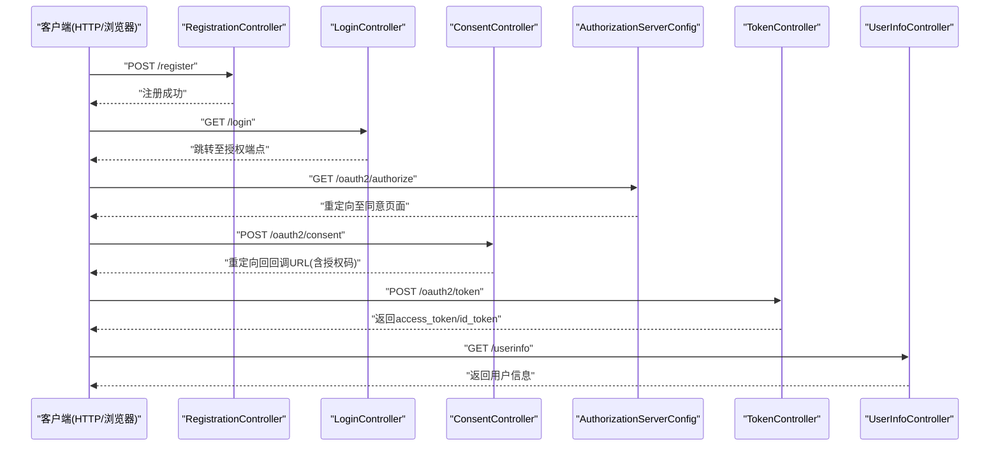
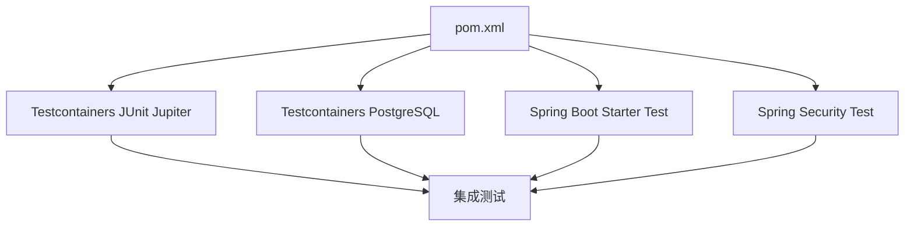

# 集成测试

<cite>
**本文引用的文件**   
- [pom.xml](file://pom.xml)
- [application.yml](file://src/main/resources/application.yml)
- [application-test.yml](file://src/main/resources/application-test.yml)
- [V1__init_schema.sql](file://src/main/resources/db/migration/V1__init_schema.sql)
- [V2__seed_default_roles.sql](file://src/main/resources/db/migration/V2__seed_default_roles.sql)
- [AuthorizationServerConfig.java](file://src/main/java/sso/oidc/infrastructure/config/AuthorizationServerConfig.java)
- [JdbcOAuth2AuthorizationServiceConfig.java](file://src/main/java/sso/oidc/infrastructure/security/JdbcOAuth2AuthorizationServiceConfig.java)
- [OAuth2ClientApplicationService.java](file://src/main/java/sso/oidc/application/service/OAuth2ClientApplicationService.java)
- [SsoOidcApplication.java](file://src/main/java/sso/oidc/SsoOidcApplication.java)
- [README.md](file://README.md)
</cite>

## 目录
1. [引言](#引言)
2. [项目结构](#项目结构)
3. [核心组件](#核心组件)
4. [架构总览](#架构总览)
5. [详细组件分析](#详细组件分析)
6. [依赖分析](#依赖分析)
7. [性能考虑](#性能考虑)
8. [故障排查指南](#故障排查指南)
9. [结论](#结论)
10. [附录](#附录)

## 引言
本文件面向IAM Platform认证服务的集成测试，目标是提供一套完整的设计理念与实现策略，覆盖系统组件间交互测试与端到端流程测试；重点阐述Testcontainers在集成测试中的使用，包括PostgreSQL与Redis测试容器的配置与运行；说明测试环境搭建（数据库初始化、测试数据准备、容器生命周期管理）；给出API集成测试方法（REST API测试、OAuth2授权流程测试、OIDC协议测试）；明确测试数据隔离与清理策略；并通过具体示例展示如何测试完整的用户注册登录流程与OAuth2客户端授权流程等关键业务场景。

## 项目结构
项目采用分层架构，核心模块包括应用层、领域层、基础设施层与接口层。集成测试关注接口层对外暴露的REST API与Web页面，以及基础设施层中与外部系统的交互（数据库、缓存、OIDC授权服务器）。测试环境通过Spring Profile与Kubernetes Overlay进行隔离，测试容器负责提供独立的数据库与缓存实例，确保测试的可重复性与隔离性。

图表来源
- [AuthorizationServerConfig.java:42-119](file://src/main/java/sso/oidc/infrastructure/config/AuthorizationServerConfig.java#L42-L119)
- [JdbcOAuth2AuthorizationServiceConfig.java:12-26](file://src/main/java/sso/oidc/infrastructure/security/JdbcOAuth2AuthorizationServiceConfig.java#L12-L26)
- [OAuth2ClientApplicationService.java:33-81](file://src/main/java/sso/oidc/application/service/OAuth2ClientApplicationService.java#L33-L81)
- [SsoOidcApplication.java:1-13](file://src/main/java/sso/oidc/SsoOidcApplication.java#L1-L13)

章节来源
- [README.md:104-139](file://README.md#L104-L139)

## 核心组件
- OIDC授权服务器配置：负责加载JWK密钥、配置授权服务器设置、构建JwtDecoder与SecurityFilterChain，支撑OAuth2授权码流程与OIDC发现端点。
- 授权服务持久化配置：通过JDBC实现授权记录与授权同意的持久化，确保授权状态在测试中可被正确读取与清理。
- OAuth2客户端应用服务：提供客户端注册、查询、更新等能力，用于测试客户端生命周期管理。
- 测试环境配置：通过application-test.yml启用Swagger UI与调试日志，便于集成测试过程中的问题定位。

章节来源
- [AuthorizationServerConfig.java:42-119](file://src/main/java/sso/oidc/infrastructure/config/AuthorizationServerConfig.java#L42-L119)
- [JdbcOAuth2AuthorizationServiceConfig.java:12-26](file://src/main/java/sso/oidc/infrastructure/security/JdbcOAuth2AuthorizationServiceConfig.java#L12-L26)
- [OAuth2ClientApplicationService.java:33-81](file://src/main/java/sso/oidc/application/service/OAuth2ClientApplicationService.java#L33-L81)
- [application-test.yml:1-16](file://src/main/resources/application-test.yml#L1-L16)

## 架构总览
下图展示了集成测试中涉及的关键组件与交互路径，包括数据库、Redis、OIDC授权服务器、Web控制器与测试容器之间的关系。

图表来源
- [SsoOidcApplication.java:1-13](file://src/main/java/sso/oidc/SsoOidcApplication.java#L1-L13)
- [AuthorizationServerConfig.java:42-119](file://src/main/java/sso/oidc/infrastructure/config/AuthorizationServerConfig.java#L42-L119)
- [JdbcOAuth2AuthorizationServiceConfig.java:12-26](file://src/main/java/sso/oidc/infrastructure/security/JdbcOAuth2AuthorizationServiceConfig.java#L12-L26)
- [application.yml:9-46](file://src/main/resources/application.yml#L9-L46)

## 详细组件分析

### 组件A：OIDC授权服务器配置与测试容器集成
该组件负责在测试环境中加载JWK密钥、配置授权服务器端点与过滤链，确保OIDC发现、授权码、令牌签发、用户信息、JWKS与撤销等端点可用。结合Testcontainers，可在测试中启动独立的PostgreSQL与Redis实例，避免与开发/生产环境冲突。

图表来源
- [AuthorizationServerConfig.java:42-119](file://src/main/java/sso/oidc/infrastructure/config/AuthorizationServerConfig.java#L42-L119)
- [JdbcOAuth2AuthorizationServiceConfig.java:12-26](file://src/main/java/sso/oidc/infrastructure/security/JdbcOAuth2AuthorizationServiceConfig.java#L12-L26)

章节来源
- [AuthorizationServerConfig.java:42-119](file://src/main/java/sso/oidc/infrastructure/config/AuthorizationServerConfig.java#L42-L119)
- [JdbcOAuth2AuthorizationServiceConfig.java:12-26](file://src/main/java/sso/oidc/infrastructure/security/JdbcOAuth2AuthorizationServiceConfig.java#L12-L26)

### 组件B：OAuth2客户端应用服务与集成测试
该组件提供OAuth2客户端的注册、查询与更新能力，常用于测试客户端生命周期管理与授权流程。在集成测试中，可通过该服务注册测试客户端，再驱动浏览器或HTTP客户端发起授权码流程，验证回调、令牌发放与用户同意等环节。

图表来源
- [OAuth2ClientApplicationService.java:33-81](file://src/main/java/sso/oidc/application/service/OAuth2ClientApplicationService.java#L33-L81)

章节来源
- [OAuth2ClientApplicationService.java:33-81](file://src/main/java/sso/oidc/application/service/OAuth2ClientApplicationService.java#L33-L81)

### 组件C：数据库初始化与测试数据准备
数据库迁移脚本初始化了OIDC授权服务器所需的表结构，并在测试环境中通过Flyway执行。迁移脚本包含用户、角色、OAuth2客户端、授权记录与授权同意等表，确保测试具备完整的数据基础。

图表来源
- [V1__init_schema.sql:1-180](file://src/main/resources/db/migration/V1__init_schema.sql#L1-L180)
- [V2__seed_default_roles.sql:1-9](file://src/main/resources/db/migration/V2__seed_default_roles.sql#L1-L9)

章节来源
- [V1__init_schema.sql:1-180](file://src/main/resources/db/migration/V1__init_schema.sql#L1-L180)
- [V2__seed_default_roles.sql:1-9](file://src/main/resources/db/migration/V2__seed_default_roles.sql#L1-L9)

### 组件D：API集成测试流程（端到端）
以下序列图展示了典型的端到端测试流程：注册用户、注册OAuth2客户端、发起授权码流程、处理同意页面、接收授权码并换取令牌、调用用户信息端点。

图表来源
- [AuthorizationServerConfig.java:42-119](file://src/main/java/sso/oidc/infrastructure/config/AuthorizationServerConfig.java#L42-L119)
- [application.yml:48-55](file://src/main/resources/application.yml#L48-L55)

章节来源
- [AuthorizationServerConfig.java:42-119](file://src/main/java/sso/oidc/infrastructure/config/AuthorizationServerConfig.java#L42-L119)
- [application.yml:48-55](file://src/main/resources/application.yml#L48-L55)

## 依赖分析
集成测试依赖Testcontainers提供的PostgreSQL与Redis容器，以及Spring Boot测试与Spring Security测试模块。Maven依赖中声明了Testcontainers的JUnit Jupiter与PostgreSQL容器依赖，确保测试生命周期内的容器管理与资源隔离。

图表来源
- [pom.xml:117-140](file://pom.xml#L117-L140)

章节来源
- [pom.xml:117-140](file://pom.xml#L117-L140)

## 性能考虑
- 测试容器启动成本：PostgreSQL与Redis容器启动时间较长，建议在CI流水线中复用容器或使用更小的基础镜像以缩短启动时间。
- 并发测试：多个测试并发访问同一容器时，注意数据库连接池大小与Redis键空间隔离，避免竞争条件。
- 数据清理：每个测试用例结束后清理授权记录与会话，防止跨用例污染。
- 日志级别：测试环境开启DEBUG日志有助于定位问题，但应避免在CI中长期保留高噪声日志。

## 故障排查指南
- OIDC端点不可用：检查授权服务器配置与JWK密钥加载，确认测试容器网络连通性。
- 授权码无法换取令牌：核对客户端配置、回调地址、PKCE参数与授权状态。
- 用户信息端点失败：确认JWT签名算法、issuer URI与JWKS端点可达。
- 数据库迁移失败：检查Flyway迁移脚本与数据库权限，确保测试容器内PostgreSQL已初始化。
- Redis会话异常：确认Redis连接配置与会话存储类型，避免跨测试污染。

## 结论
通过Testcontainers在集成测试中提供独立且可控的数据库与缓存环境，结合Spring Profile与Kubernetes Overlay实现配置隔离，能够有效保障测试的稳定性与可重复性。配合OIDC授权服务器配置与JDBC授权服务持久化配置，可以完整覆盖从用户注册、OAuth2授权到令牌签发与用户信息获取的端到端流程。建议在CI中引入容器复用与数据清理策略，持续提升测试效率与质量。

## 附录
- 测试环境搭建步骤
  - 启动PostgreSQL与Redis测试容器，确保端口映射与网络可达。
  - 设置Spring Profile为test，加载application-test.yml，启用Swagger UI与调试日志。
  - 执行Flyway迁移脚本，初始化OIDC授权服务器所需表结构与默认角色。
  - 在测试中注册OAuth2客户端，准备测试用户与授权范围。
- 测试数据隔离与清理
  - 使用事务或测试容器重启保证每条用例的数据隔离。
  - 在测试结束时清理授权记录、会话与临时数据，避免跨用例影响。
- 关键业务场景示例
  - 用户注册登录流程：注册用户、登录、触发授权码流程、同意授权、换取令牌、获取用户信息。
  - OAuth2客户端授权流程：注册客户端、配置回调地址与PKCE、发起授权、处理同意、校验令牌与用户信息。