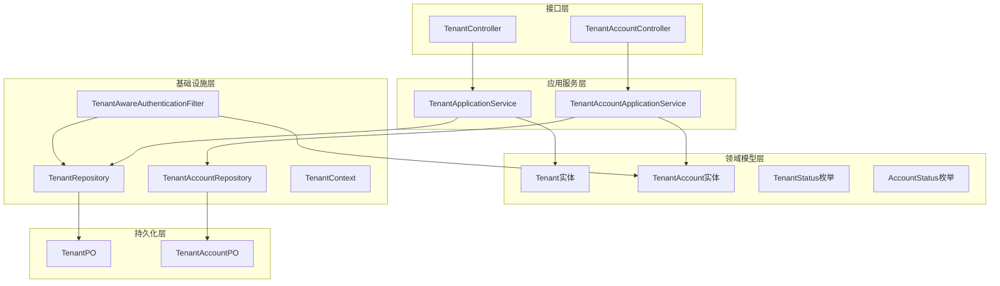
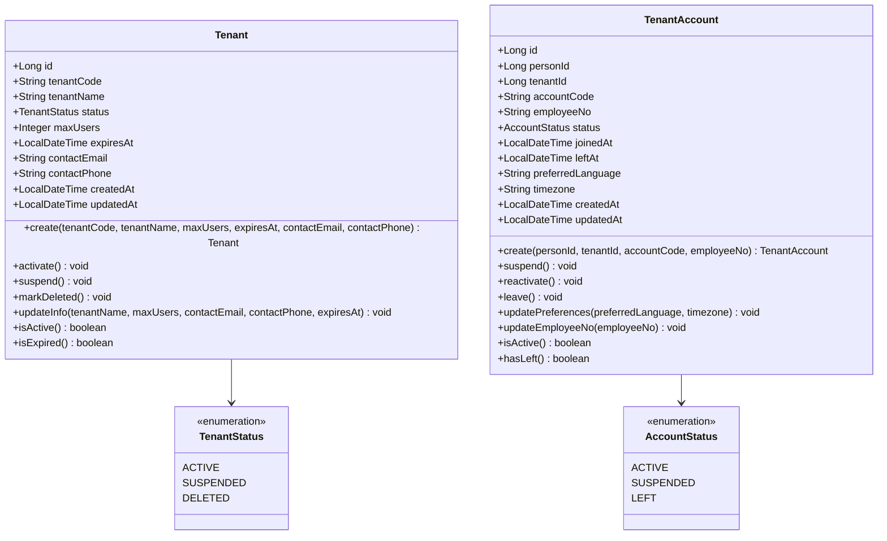
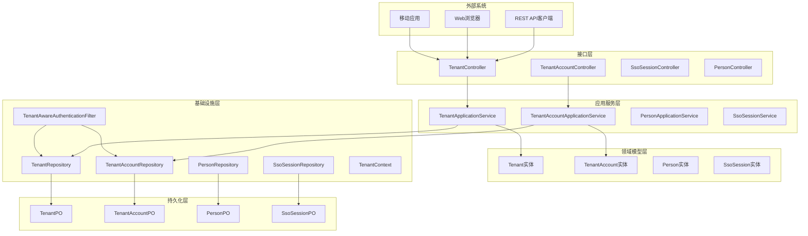
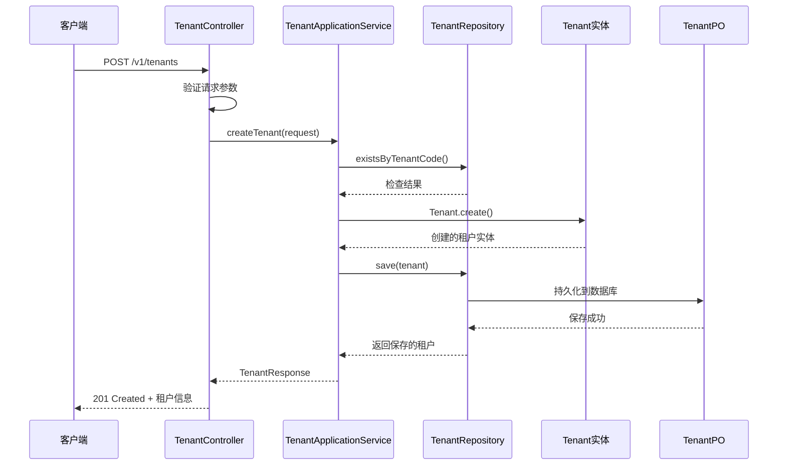
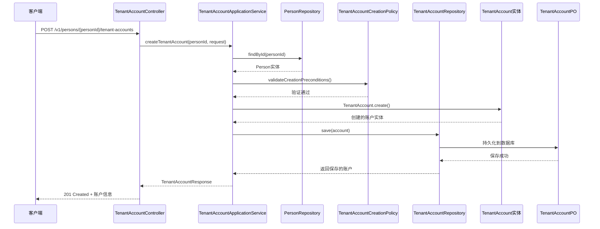
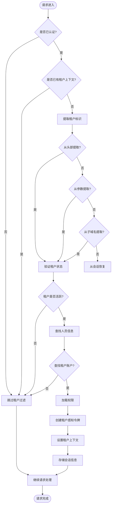
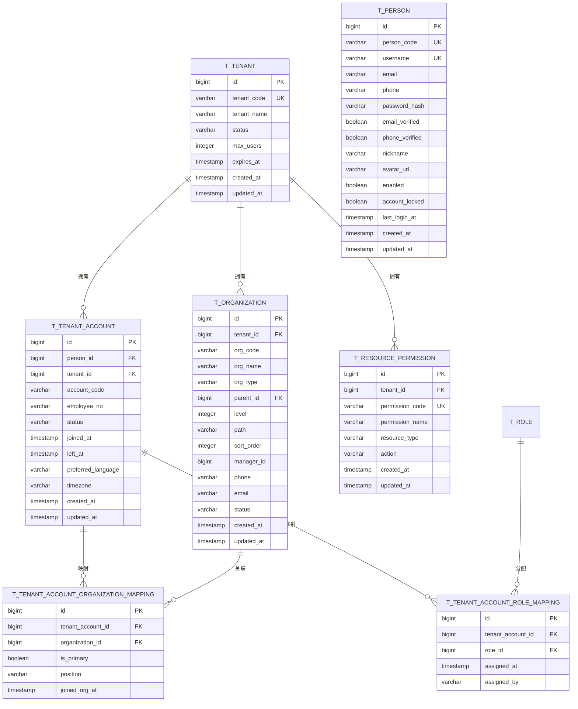
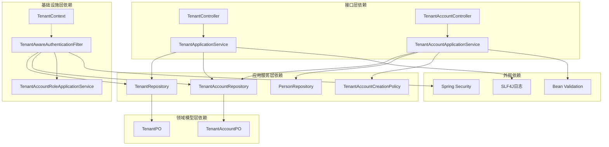

# 租户管理

<cite>
**本文档引用的文件**
- [Tenant.java](file://src/main/java/sso/oidc/domain/model/entity/Tenant.java)
- [TenantAccount.java](file://src/main/java/sso/oidc/domain/model/entity/TenantAccount.java)
- [TenantStatus.java](file://src/main/java/sso/oidc/domain/model/enums/TenantStatus.java)
- [AccountStatus.java](file://src/main/java/sso/oidc/domain/model/enums/AccountStatus.java)
- [TenantApplicationService.java](file://src/main/java/sso/oidc/application/service/TenantApplicationService.java)
- [TenantAccountApplicationService.java](file://src/main/java/sso/oidc/application/service/TenantAccountApplicationService.java)
- [TenantController.java](file://src/main/java/sso/oidc/interfaces/rest/TenantController.java)
- [TenantAccountController.java](file://src/main/java/sso/oidc/interfaces/rest/TenantAccountController.java)
- [TenantRepository.java](file://src/main/java/sso/oidc/domain/repository/TenantRepository.java)
- [TenantAccountRepository.java](file://src/main/java/sso/oidc/domain/repository/TenantAccountRepository.java)
- [TenantPO.java](file://src/main/java/sso/oidc/infrastructure/persistence/entity/TenantPO.java)
- [TenantAccountPO.java](file://src/main/java/sso/oidc/infrastructure/persistence/entity/TenantAccountPO.java)
- [TenantAwareAuthenticationFilter.java](file://src/main/java/sso/oidc/infrastructure/security/TenantAwareAuthenticationFilter.java)
- [TenantContext.java](file://src/main/java/sso/oidc/infrastructure/security/TenantContext.java)
- [V3__add_multi_tenant_support.sql](file://src/main/resources/db/migration/V3__add_multi_tenant_support.sql)
- [V5__upgrade_rbac_with_tenant_and_permissions.sql](file://src/main/resources/db/migration/V5__upgrade_rbac_with_tenant_and_permissions.sql)
</cite>

## 目录
1. [简介](#简介)
2. [项目结构](#项目结构)
3. [核心组件](#核心组件)
4. [架构概览](#架构概览)
5. [详细组件分析](#详细组件分析)
6. [依赖关系分析](#依赖关系分析)
7. [性能考虑](#性能考虑)
8. [故障排除指南](#故障排除指南)
9. [结论](#结论)

## 简介

本项目是一个基于Spring Authorization Server的SSO/OIDC解决方案，实现了完整的多租户管理体系。系统通过租户（Tenant）和租户账户（TenantAccount）模型，为每个租户提供独立的用户管理和权限控制能力。

多租户架构的核心价值在于：
- **隔离性**：不同租户间的数据完全隔离
- **可扩展性**：支持无限量租户增长
- **灵活性**：每个租户可独立配置和管理
- **安全性**：强制的租户上下文验证

## 项目结构

系统采用分层架构设计，主要分为以下层次：

**图表来源**
- [TenantController.java:30-90](file://src/main/java/sso/oidc/interfaces/rest/TenantController.java#L30-L90)
- [TenantAccountController.java:30-94](file://src/main/java/sso/oidc/interfaces/rest/TenantAccountController.java#L30-L94)
- [TenantApplicationService.java:24-130](file://src/main/java/sso/oidc/application/service/TenantApplicationService.java#L24-L130)
- [TenantAccountApplicationService.java:29-188](file://src/main/java/sso/oidc/application/service/TenantAccountApplicationService.java#L29-L188)

**章节来源**
- [TenantController.java:26-90](file://src/main/java/sso/oidc/interfaces/rest/TenantController.java#L26-L90)
- [TenantAccountController.java:26-94](file://src/main/java/sso/oidc/interfaces/rest/TenantAccountController.java#L26-L94)

## 核心组件

### 租户实体模型

租户实体是多租户系统的核心，定义了租户的基本属性和行为：

**图表来源**
- [Tenant.java:16-117](file://src/main/java/sso/oidc/domain/model/entity/Tenant.java#L16-L117)
- [TenantAccount.java:17-131](file://src/main/java/sso/oidc/domain/model/entity/TenantAccount.java#L17-L131)
- [TenantStatus.java:3-5](file://src/main/java/sso/oidc/domain/model/enums/TenantStatus.java#L3-L5)
- [AccountStatus.java:3-5](file://src/main/java/sso/oidc/domain/model/enums/AccountStatus.java#L3-L5)

### 应用服务层

应用服务层负责协调领域模型和基础设施，提供业务逻辑封装：

**章节来源**
- [TenantApplicationService.java:24-130](file://src/main/java/sso/oidc/application/service/TenantApplicationService.java#L24-L130)
- [TenantAccountApplicationService.java:29-188](file://src/main/java/sso/oidc/application/service/TenantAccountApplicationService.java#L29-L188)

## 架构概览

系统采用经典的六边形架构（端口和适配器），通过清晰的分层实现关注点分离：

**图表来源**
- [TenantController.java:26-90](file://src/main/java/sso/oidc/interfaces/rest/TenantController.java#L26-L90)
- [TenantAccountController.java:26-94](file://src/main/java/sso/oidc/interfaces/rest/TenantAccountController.java#L26-L94)
- [TenantAwareAuthenticationFilter.java:36-215](file://src/main/java/sso/oidc/infrastructure/security/TenantAwareAuthenticationFilter.java#L36-L215)

## 详细组件分析

### 租户管理API

租户管理API提供了完整的租户生命周期管理功能：

**图表来源**
- [TenantController.java:34-40](file://src/main/java/sso/oidc/interfaces/rest/TenantController.java#L34-L40)
- [TenantApplicationService.java:31-48](file://src/main/java/sso/oidc/application/service/TenantApplicationService.java#L31-L48)
- [TenantRepository.java:19-19](file://src/main/java/sso/oidc/domain/repository/TenantRepository.java#L19-L19)

### 租户账户管理流程

租户账户管理涉及人员、租户和账户之间的复杂关系：

**图表来源**
- [TenantAccountController.java:34-41](file://src/main/java/sso/oidc/interfaces/rest/TenantAccountController.java#L34-L41)
- [TenantAccountApplicationService.java:37-63](file://src/main/java/sso/oidc/application/service/TenantAccountApplicationService.java#L37-L63)

### 租户认证过滤器

系统通过认证过滤器实现租户上下文的自动识别和注入：

**图表来源**
- [TenantAwareAuthenticationFilter.java:50-128](file://src/main/java/sso/oidc/infrastructure/security/TenantAwareAuthenticationFilter.java#L50-L128)

**章节来源**
- [TenantAwareAuthenticationFilter.java:36-215](file://src/main/java/sso/oidc/infrastructure/security/TenantAwareAuthenticationFilter.java#L36-L215)

### 数据模型设计

系统使用PostgreSQL作为数据存储，通过迁移脚本实现数据结构演进：

**图表来源**
- [V3__add_multi_tenant_support.sql:12-315](file://src/main/resources/db/migration/V3__add_multi_tenant_support.sql#L12-L315)
- [V5__upgrade_rbac_with_tenant_and_permissions.sql:27-149](file://src/main/resources/db/migration/V5__upgrade_rbac_with_tenant_and_permissions.sql#L27-L149)

**章节来源**
- [V3__add_multi_tenant_support.sql:1-315](file://src/main/resources/db/migration/V3__add_multi_tenant_support.sql#L1-L315)
- [V5__upgrade_rbac_with_tenant_and_permissions.sql:1-149](file://src/main/resources/db/migration/V5__upgrade_rbac_with_tenant_and_permissions.sql#L1-L149)

## 依赖关系分析

系统各层之间的依赖关系清晰明确，遵循依赖倒置原则：

**图表来源**
- [TenantController.java:32-32](file://src/main/java/sso/oidc/interfaces/rest/TenantController.java#L32-L32)
- [TenantAccountController.java:32-32](file://src/main/java/sso/oidc/interfaces/rest/TenantAccountController.java#L32-L32)
- [TenantAwareAuthenticationFilter.java:45-48](file://src/main/java/sso/oidc/infrastructure/security/TenantAwareAuthenticationFilter.java#L45-L48)

**章节来源**
- [TenantApplicationService.java:26-27](file://src/main/java/sso/oidc/application/service/TenantApplicationService.java#L26-L27)
- [TenantAccountApplicationService.java:31-34](file://src/main/java/sso/oidc/application/service/TenantAccountApplicationService.java#L31-L34)

## 性能考虑

### 查询优化策略

1. **索引设计**
   - 租户代码唯一索引：支持快速租户查找
   - 人员ID和租户ID组合索引：加速租户账户查询
   - 状态字段索引：支持按状态过滤

2. **分页查询**
   - 所有列表查询都支持分页，避免大数据集一次性加载

3. **延迟加载**
   - 角色信息采用延迟加载，减少不必要的数据传输

### 缓存策略

1. **会话缓存**
   - 租户上下文信息存储在HTTP会话中，避免重复查询

2. **权限缓存**
   - 用户权限信息在会话中缓存，减少权限检查开销

### 并发控制

1. **乐观锁**
   - 使用版本字段防止并发更新冲突

2. **事务边界**
   - 关键业务操作都在事务中执行，保证数据一致性

## 故障排除指南

### 常见问题及解决方案

**1. 租户创建失败**
- 检查租户代码是否唯一
- 验证必填字段是否完整
- 确认租户状态符合要求

**2. 租户账户创建异常**
- 确认人员是否存在
- 检查账户代码和员工号的唯一性
- 验证租户创建策略

**3. 认证失败**
- 检查租户上下文是否正确设置
- 验证用户在目标租户中的账户状态
- 确认权限加载是否成功

**章节来源**
- [TenantApplicationService.java:32-34](file://src/main/java/sso/oidc/application/service/TenantApplicationService.java#L32-L34)
- [TenantAccountApplicationService.java:39-41](file://src/main/java/sso/oidc/application/service/TenantAccountApplicationService.java#L39-L41)

## 结论

本多租户管理系统通过清晰的分层架构、完善的领域建模和严格的业务规则，为SSO/OIDC平台提供了强大的租户管理能力。系统的主要优势包括：

1. **架构清晰**：严格遵循DDD原则，职责分离明确
2. **扩展性强**：支持无限量租户增长和灵活的业务扩展
3. **安全可靠**：强制的租户上下文验证和细粒度权限控制
4. **易于维护**：模块化设计，便于测试和维护

通过持续的代码审查和性能优化，该系统能够满足企业级应用对多租户管理的各种需求。