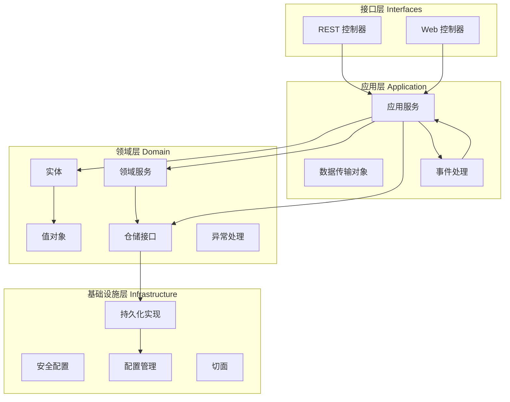
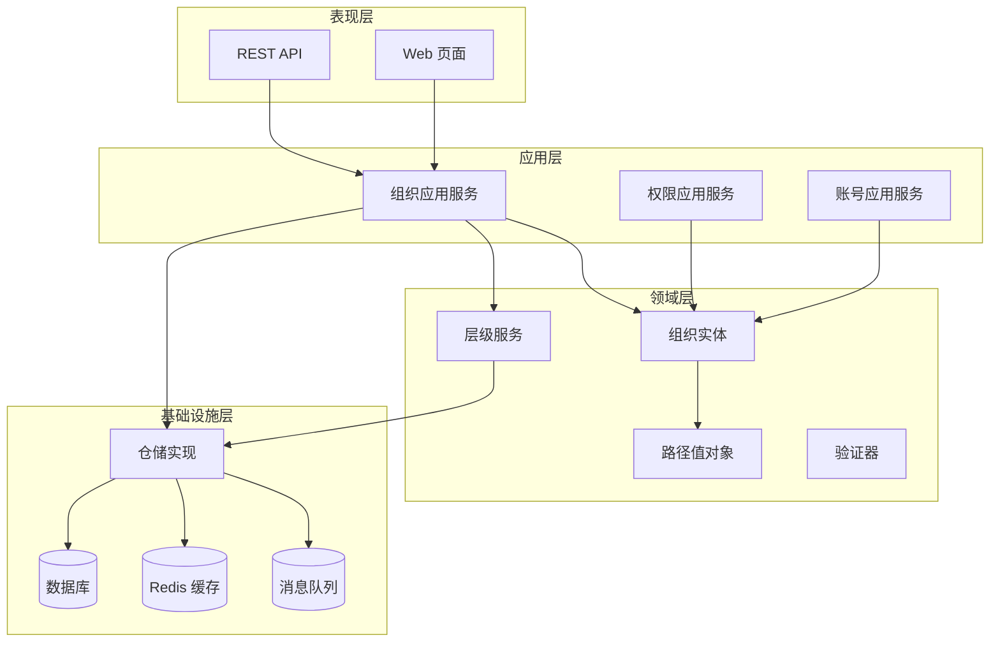
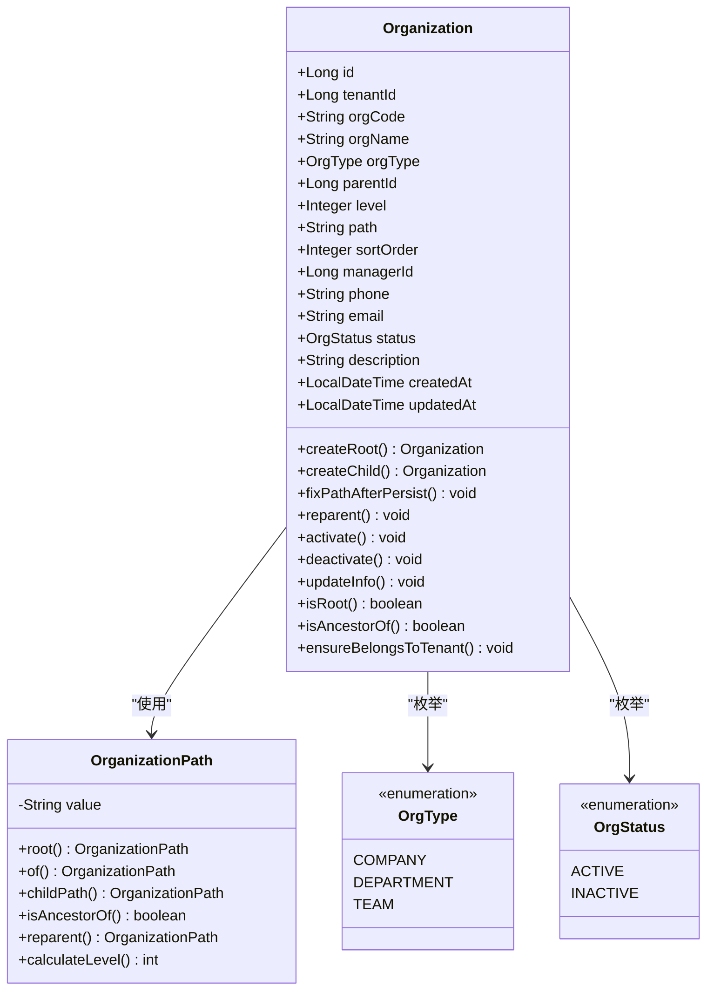
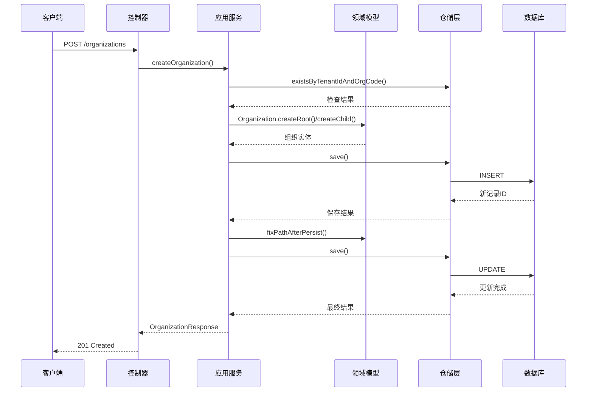
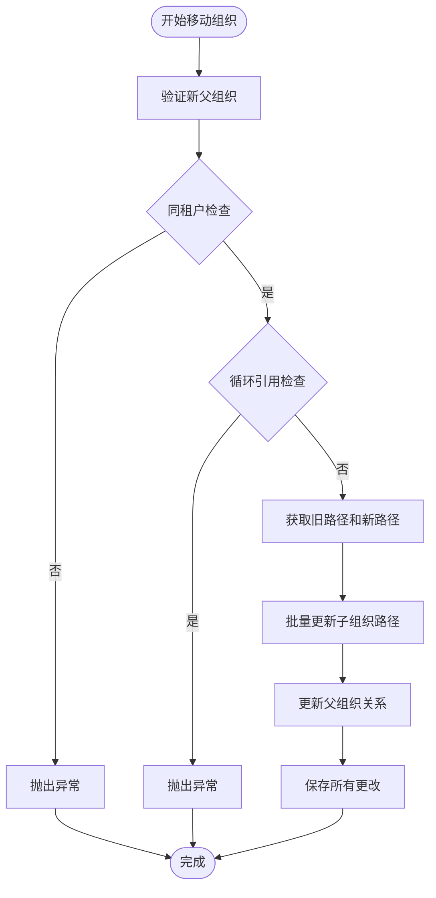
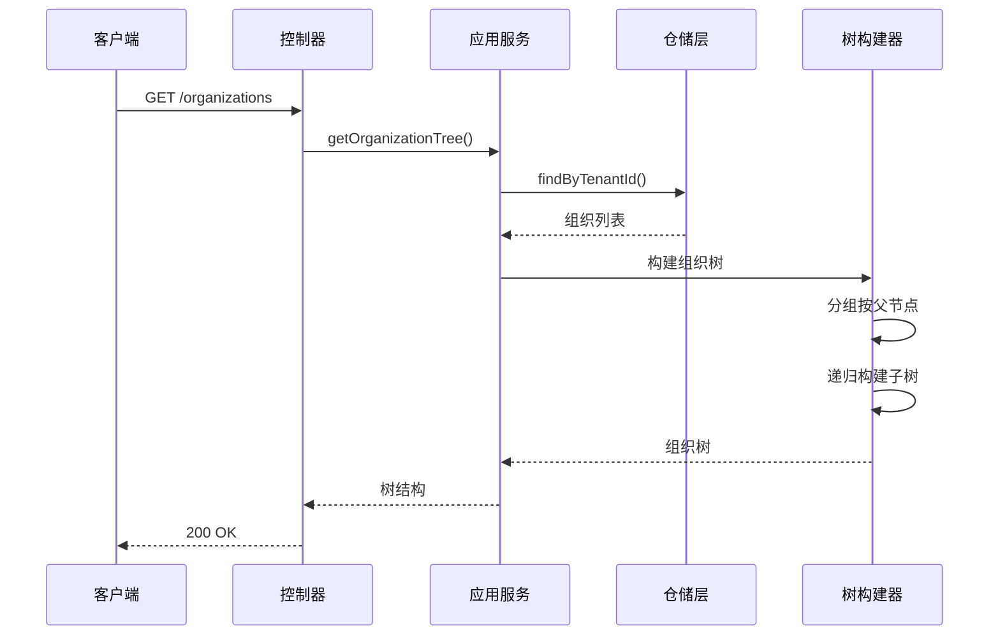
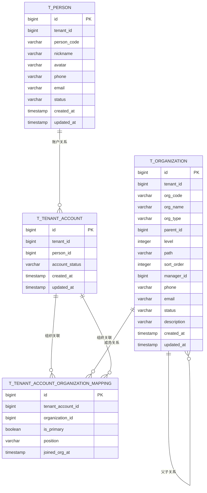
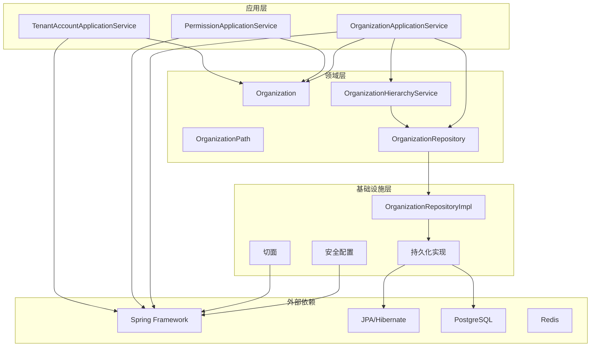

# 组织管理

<cite>
**本文档引用的文件**
- [OrganizationApplicationService.java](file://src/main/java/sso/oidc/application/service/OrganizationApplicationService.java)
- [Organization.java](file://src/main/java/sso/oidc/domain/model/entity/Organization.java)
- [OrganizationController.java](file://src/main/java/sso/oidc/interfaces/rest/OrganizationController.java)
- [OrganizationHierarchyService.java](file://src/main/java/sso/oidc/domain/service/OrganizationHierarchyService.java)
- [OrganizationHierarchyServiceImpl.java](file://src/main/java/sso/oidc/domain/service/impl/OrganizationHierarchyServiceImpl.java)
- [OrganizationPath.java](file://src/main/java/sso/oidc/domain/model/valueobject/OrganizationPath.java)
- [OrganizationRepository.java](file://src/main/java/sso/oidc/domain/repository/OrganizationRepository.java)
- [CreateOrganizationRequest.java](file://src/main/java/sso/oidc/application/dto/request/CreateOrganizationRequest.java)
- [OrganizationResponse.java](file://src/main/java/sso/oidc/application/dto/response/OrganizationResponse.java)
- [OrganizationPO.java](file://src/main/java/sso/oidc/infrastructure/persistence/entity/OrganizationPO.java)
- [OrganizationRepositoryImpl.java](file://src/main/java/sso/oidc/infrastructure/persistence/impl/OrganizationRepositoryImpl.java)
- [organization-management-design.md](file://docs/questplan/organization-management-design.md)
- [README.md](file://README.md)
</cite>

## 目录
1. [简介](#简介)
2. [项目结构](#项目结构)
3. [核心组件](#核心组件)
4. [架构概览](#架构概览)
5. [详细组件分析](#详细组件分析)
6. [依赖关系分析](#依赖关系分析)
7. [性能考量](#性能考量)
8. [故障排除指南](#故障排除指南)
9. [结论](#结论)

## 简介

本项目是一个基于 OpenID Connect 1.0 协议的统一身份认证服务（SSO），为微服务架构提供集中式认证授权能力。组织管理作为系统的核心功能之一，实现了完整的组织架构树管理，支持多租户环境下的组织层级关系维护、数据权限隔离和用户组织关联管理。

系统采用 Clean Architecture + Domain-Driven Design 架构模式，将业务逻辑与基础设施分离，确保代码的可维护性和可扩展性。组织管理功能涵盖了从基础的组织 CRUD 操作到复杂的层级关系处理，包括组织树的构建、路径管理、权限控制等多个方面。

## 项目结构

项目采用分层架构设计，按照 Clean Architecture 的原则将系统划分为四个主要层次：

**图表来源**
- [README.md:95-106](file://README.md#L95-L106)

**章节来源**
- [README.md:95-106](file://README.md#L95-L106)
- [README.md:16-32](file://README.md#L16-L32)

## 核心组件

组织管理系统的核心组件包括以下关键模块：

### 1. 应用服务层
- **OrganizationApplicationService**: 组织管理的核心业务逻辑，负责组织的创建、更新、删除、激活、停用等操作
- **PermissionApplicationService**: 权限管理服务，处理组织相关的权限分配和验证
- **TenantAccountOrganizationApplicationService**: 租户账号与组织关联管理

### 2. 领域模型层
- **Organization**: 组织实体，包含组织的基本属性和行为方法
- **OrganizationPath**: 组织路径值对象，实现物化路径算法
- **OrganizationHierarchyService**: 组织层级关系服务接口

### 3. 基础设施层
- **OrganizationRepository**: 组织仓储接口，定义数据访问方法
- **OrganizationRepositoryImpl**: 仓储接口实现，处理数据库操作
- **OrganizationPO**: JPA 实体类，映射数据库表结构

### 4. 接口层
- **OrganizationController**: REST API 控制器，提供组织管理的 HTTP 接口
- **CreateOrganizationRequest**: 组织创建请求 DTO
- **OrganizationResponse**: 组织响应 DTO

**章节来源**
- [OrganizationApplicationService.java:24-27](file://src/main/java/sso/oidc/application/service/OrganizationApplicationService.java#L24-L27)
- [Organization.java:14-18](file://src/main/java/sso/oidc/domain/model/entity/Organization.java#L14-L18)
- [OrganizationController.java:25-29](file://src/main/java/sso/oidc/interfaces/rest/OrganizationController.java#L25-L29)

## 架构概览

组织管理系统的整体架构采用分层设计，各层职责清晰分离：

**图表来源**
- [OrganizationApplicationService.java:29-30](file://src/main/java/sso/oidc/application/service/OrganizationApplicationService.java#L29-L30)
- [OrganizationRepositoryImpl.java:16-21](file://src/main/java/sso/oidc/infrastructure/persistence/impl/OrganizationRepositoryImpl.java#L16-L21)

系统的核心设计特点：

1. **物化路径算法**: 使用路径前缀匹配实现高效的子树查询和层级关系判断
2. **租户隔离**: 每个组织都绑定到特定租户，确保数据隔离
3. **事务一致性**: 关键操作使用数据库事务保证数据一致性
4. **审计日志**: 所有重要操作都记录审计日志
5. **缓存策略**: 组织树和用户组织关系使用 Redis 缓存提升性能

**章节来源**
- [organization-management-design.md:69-91](file://docs/questplan/organization-management-design.md#L69-L91)
- [OrganizationApplicationService.java:32-66](file://src/main/java/sso/oidc/application/service/OrganizationApplicationService.java#L32-L66)

## 详细组件分析

### 组织实体分析

组织实体是系统的核心领域模型，采用值对象和实体相结合的设计：

**图表来源**
- [Organization.java:18-35](file://src/main/java/sso/oidc/domain/model/entity/Organization.java#L18-L35)
- [OrganizationPath.java:15-23](file://src/main/java/sso/oidc/domain/model/valueobject/OrganizationPath.java#L15-L23)

#### 组织创建流程

组织创建过程涉及多个步骤和验证：

**图表来源**
- [OrganizationApplicationService.java:32-66](file://src/main/java/sso/oidc/application/service/OrganizationApplicationService.java#L32-L66)
- [Organization.java:38-96](file://src/main/java/sso/oidc/domain/model/entity/Organization.java#L38-L96)

#### 组织层级管理

系统支持复杂的组织层级关系管理，包括父子关系验证和路径更新：

**图表来源**
- [OrganizationHierarchyServiceImpl.java:19-33](file://src/main/java/sso/oidc/domain/service/impl/OrganizationHierarchyServiceImpl.java#L19-L33)
- [OrganizationHierarchyServiceImpl.java:35-71](file://src/main/java/sso/oidc/domain/service/impl/OrganizationHierarchyServiceImpl.java#L35-L71)

**章节来源**
- [Organization.java:38-216](file://src/main/java/sso/oidc/domain/model/entity/Organization.java#L38-L216)
- [OrganizationHierarchyServiceImpl.java:19-71](file://src/main/java/sso/oidc/domain/service/impl/OrganizationHierarchyServiceImpl.java#L19-L71)

### API 接口设计

系统提供了完整的 REST API 来管理组织：

| 方法 | 路径 | 功能描述 |
|------|------|----------|
| POST | `/v1/tenants/{tenantId}/organizations` | 创建组织 |
| GET | `/v1/tenants/{tenantId}/organizations/{id}` | 获取组织详情 |
| PUT | `/v1/tenants/{tenantId}/organizations/{id}` | 更新组织信息 |
| DELETE | `/v1/tenants/{tenantId}/organizations/{id}` | 删除组织 |
| POST | `/v1/tenants/{tenantId}/organizations/{id}/activate` | 激活组织 |
| POST | `/v1/tenants/{tenantId}/organizations/{id}/deactivate` | 停用组织 |
| GET | `/v1/tenants/{tenantId}/organizations` | 获取组织树 |

#### 组织树查询流程

**图表来源**
- [OrganizationApplicationService.java:153-177](file://src/main/java/sso/oidc/application/service/OrganizationApplicationService.java#L153-L177)
- [OrganizationController.java:78-82](file://src/main/java/sso/oidc/interfaces/rest/OrganizationController.java#L78-L82)

**章节来源**
- [OrganizationController.java:33-82](file://src/main/java/sso/oidc/interfaces/rest/OrganizationController.java#L33-L82)
- [OrganizationApplicationService.java:153-177](file://src/main/java/sso/oidc/application/service/OrganizationApplicationService.java#L153-L177)

### 数据持久化设计

系统采用 JPA 实体类映射数据库表结构，支持完整的 CRUD 操作：

**图表来源**
- [OrganizationPO.java:17-97](file://src/main/java/sso/oidc/infrastructure/persistence/entity/OrganizationPO.java#L17-L97)
- [organization-management-design.md:41-56](file://docs/questplan/organization-management-design.md#L41-L56)

**章节来源**
- [OrganizationPO.java:17-97](file://src/main/java/sso/oidc/infrastructure/persistence/entity/OrganizationPO.java#L17-L97)
- [OrganizationRepositoryImpl.java:67-96](file://src/main/java/sso/oidc/infrastructure/persistence/impl/OrganizationRepositoryImpl.java#L67-L96)

## 依赖关系分析

系统各组件之间的依赖关系清晰明确，遵循依赖倒置原则：

**图表来源**
- [OrganizationApplicationService.java:1-27](file://src/main/java/sso/oidc/application/service/OrganizationApplicationService.java#L1-L27)
- [OrganizationRepositoryImpl.java:16-21](file://src/main/java/sso/oidc/infrastructure/persistence/impl/OrganizationRepositoryImpl.java#L16-L21)

### 关键依赖特性

1. **接口隔离**: 领域层定义接口，基础设施层提供实现
2. **依赖注入**: 使用 Spring 容器管理依赖关系
3. **事务管理**: 应用服务层管理业务事务边界
4. **异常处理**: 统一的异常处理机制
5. **审计日志**: 基于注解的审计日志记录

**章节来源**
- [OrganizationApplicationService.java:1-27](file://src/main/java/sso/oidc/application/service/OrganizationApplicationService.java#L1-L27)
- [OrganizationRepositoryImpl.java:16-21](file://src/main/java/sso/oidc/infrastructure/persistence/impl/OrganizationRepositoryImpl.java#L16-L21)

## 性能考量

系统在设计时充分考虑了性能优化：

### 1. 查询优化策略

- **物化路径索引**: 在 path 字段上建立索引，支持高效的子树查询
- **复合索引**: 在 tenant_id 和 parent_id 上建立复合索引
- **缓存策略**: 组织树和用户组织关系使用 Redis 缓存
- **分页查询**: 大型组织树支持分页查询避免内存溢出

### 2. 写入性能优化

- **批量更新**: 组织移动时批量更新子组织路径
- **事务优化**: 合理的事务边界减少锁竞争
- **异步处理**: 审计日志和缓存更新采用异步方式

### 3. 内存使用优化

- **流式处理**: 大数据量查询使用流式处理
- **延迟加载**: 避免不必要的关联加载
- **对象池**: 复用常用的值对象实例

## 故障排除指南

### 常见问题及解决方案

#### 1. 组织创建失败

**问题症状**: 创建组织时报错，提示组织编码已存在

**可能原因**:
- 同租户下组织编码重复
- 数据库约束冲突

**解决步骤**:
1. 验证租户 ID 是否正确
2. 检查组织编码是否唯一
3. 查看数据库约束错误信息

**章节来源**
- [OrganizationApplicationService.java:36-39](file://src/main/java/sso/oidc/application/service/OrganizationApplicationService.java#L36-L39)

#### 2. 组织移动异常

**问题症状**: 组织移动时报错，提示循环引用

**可能原因**:
- 尝试将组织移动到其子组织下
- 路径前缀验证失败

**解决步骤**:
1. 检查目标父组织是否为当前组织的后代
2. 验证路径前缀的正确性
3. 确认组织层级关系的合法性

**章节来源**
- [OrganizationHierarchyServiceImpl.java:20-33](file://src/main/java/sso/oidc/domain/service/impl/OrganizationHierarchyServiceImpl.java#L20-L33)

#### 3. 组织删除失败

**问题症状**: 删除组织时报错，提示组织仍有子组织

**可能原因**:
- 组织下存在子组织
- 组织仍有成员关联

**解决步骤**:
1. 先删除所有子组织
2. 解除组织与成员的关联
3. 删除组织本身

**章节来源**
- [OrganizationApplicationService.java:122-125](file://src/main/java/sso/oidc/application/service/OrganizationApplicationService.java#L122-L125)

#### 4. 组织树查询性能问题

**问题症状**: 组织树查询响应缓慢

**优化建议**:
1. 检查数据库索引是否正确创建
2. 考虑启用 Redis 缓存
3. 实施分页查询策略
4. 优化前端渲染逻辑

**章节来源**
- [organization-management-design.md:276-292](file://docs/questplan/organization-management-design.md#L276-L292)

## 结论

组织管理系统作为 SSO/OIDC 认证服务的重要组成部分，展现了良好的架构设计和实现质量。系统采用了 Clean Architecture 和 DDD 的最佳实践，实现了业务逻辑与基础设施的有效分离。

### 主要优势

1. **清晰的架构设计**: 分层架构确保了代码的可维护性和可扩展性
2. **完善的领域建模**: 组织实体和路径值对象的设计体现了深厚的领域理解
3. **高性能的实现**: 物化路径算法和缓存策略保证了系统的性能表现
4. **全面的功能覆盖**: 从基础 CRUD 到复杂的层级关系管理应有尽有
5. **可靠的错误处理**: 完善的异常处理和审计日志机制

### 技术亮点

- **物化路径算法**: 实现了高效的子树查询和层级关系判断
- **租户隔离机制**: 确保多租户环境下的数据安全和隔离
- **事务一致性保证**: 关键操作使用数据库事务确保数据一致性
- **缓存策略优化**: Redis 缓存显著提升了查询性能
- **审计日志系统**: 完整的操作记录便于追踪和审计

### 发展建议

1. **监控指标完善**: 增加更多的性能监控和业务指标
2. **测试覆盖扩展**: 提升单元测试和集成测试的覆盖率
3. **文档持续更新**: 保持技术文档与代码同步更新
4. **性能持续优化**: 定期评估和优化系统性能瓶颈

该组织管理系统为企业的多租户身份认证和权限管理提供了坚实的技术基础，具备良好的扩展性和维护性，能够满足企业级应用的各种需求。