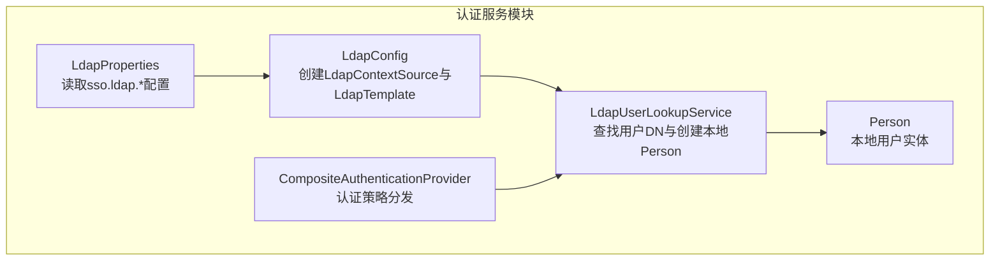
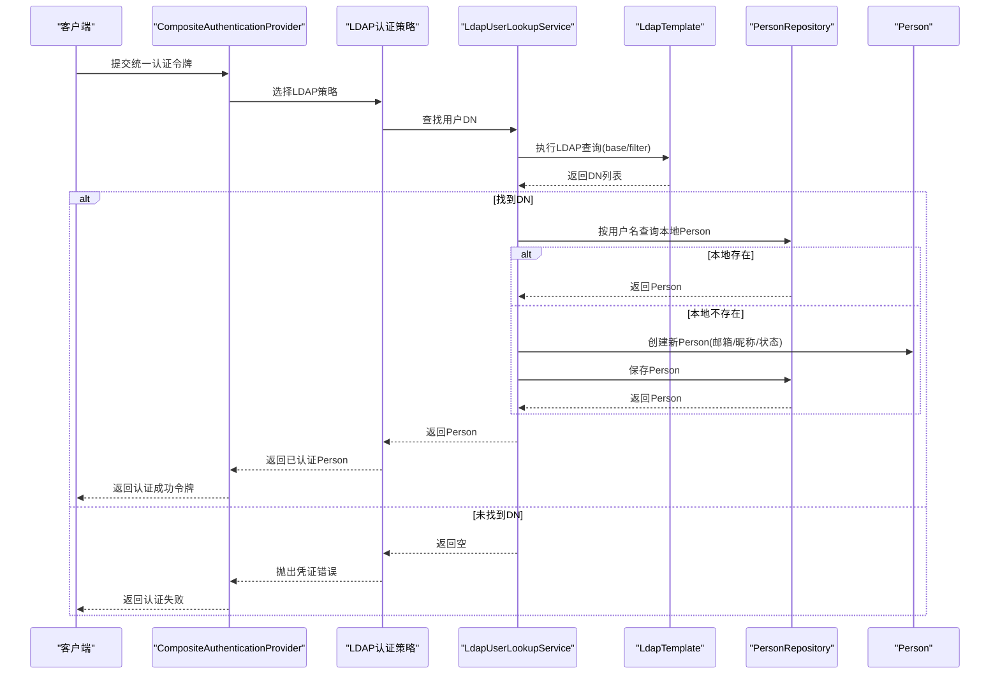
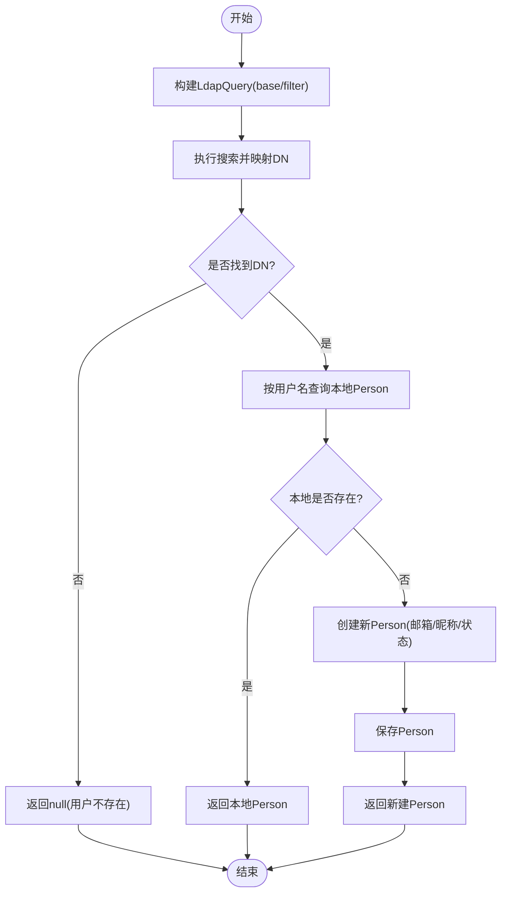
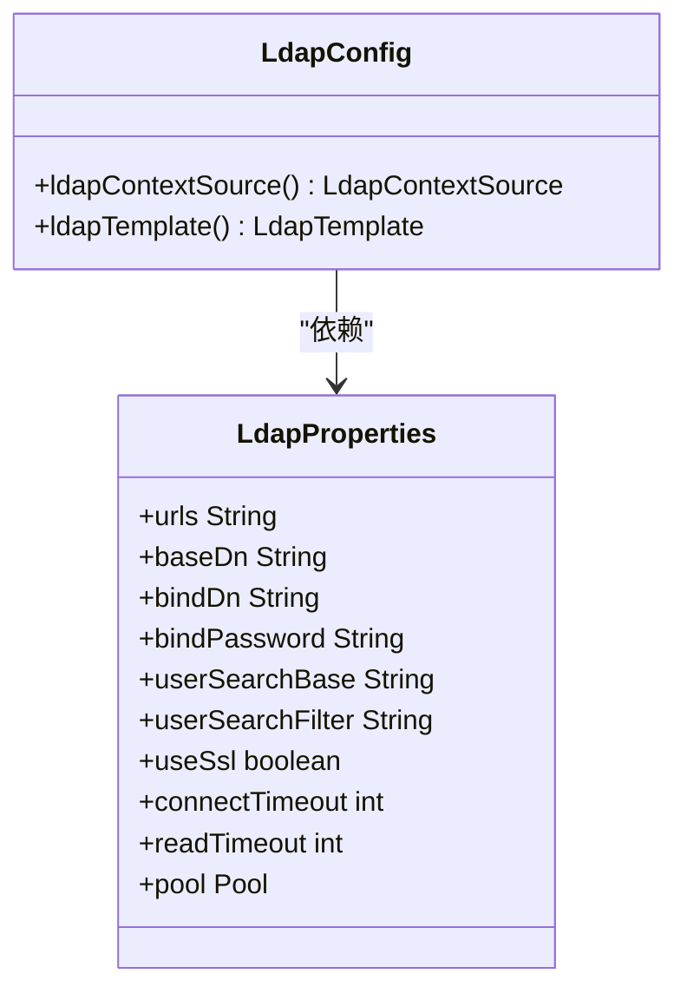
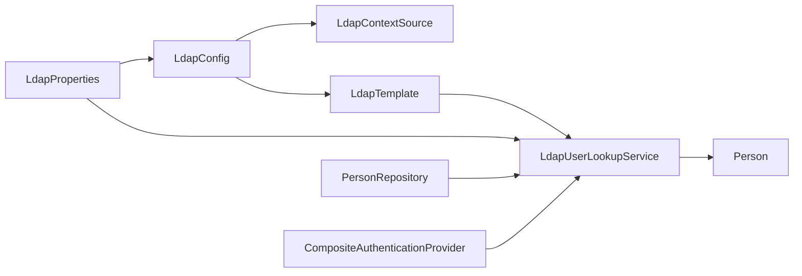

# LDAP集成

<cite>
**本文引用的文件**
- [LdapUserLookupService.java](file://iam-auth-server/src/main/java/iam/platform/auth/application/service/LdapUserLookupService.java)
- [LdapConfig.java](file://iam-auth-server/src/main/java/iam/platform/auth/infrastructure/config/LdapConfig.java)
- [LdapProperties.java](file://iam-auth-server/src/main/java/iam/platform/auth/infrastructure/config/LdapProperties.java)
- [application.yml](file://iam-auth-server/src/main/resources/application.yml)
- [Person.java](file://iam-auth-server/src/main/java/iam/platform/auth/domain/model/entity/Person.java)
- [CompositeAuthenticationProvider.java](file://iam-auth-server/src/main/java/iam/platform/auth/infrastructure/security/CompositeAuthenticationProvider.java)
</cite>

## 目录
1. [简介](#简介)
2. [项目结构](#项目结构)
3. [核心组件](#核心组件)
4. [架构总览](#架构总览)
5. [详细组件分析](#详细组件分析)
6. [依赖分析](#依赖分析)
7. [性能考虑](#性能考虑)
8. [故障排查指南](#故障排查指南)
9. [结论](#结论)
10. [附录](#附录)

## 简介
本文件面向IAM平台中的LDAP集成实现，聚焦于LDAP用户查找服务的设计与实现，覆盖连接管理、查询构建、结果解析、配置参数、认证策略集成、用户属性映射、目录结构最佳实践、安全配置以及与常见LDAP服务器（Active Directory、OpenLDAP）的差异注意事项。目标是帮助开发者与运维人员快速理解并正确部署与维护LDAP集成。

## 项目结构
LDAP相关能力主要集中在认证服务模块中，采用“配置类 + 属性类 + 应用服务 + 领域模型”的分层设计：
- 配置层：负责基于属性创建LDAP上下文与模板，统一管理连接池与基础参数
- 应用服务层：封装LDAP用户查找与本地Person实体的映射逻辑
- 领域模型层：Person实体承载用户基本信息与状态
- 安全层：复合认证提供者根据凭证类型选择合适的认证策略（含LDAP）

图表来源
- [LdapConfig.java:1-39](file://iam-auth-server/src/main/java/iam/platform/auth/infrastructure/config/LdapConfig.java#L1-L39)
- [LdapProperties.java:1-34](file://iam-auth-server/src/main/java/iam/platform/auth/infrastructure/config/LdapProperties.java#L1-L34)
- [LdapUserLookupService.java:1-87](file://iam-auth-server/src/main/java/iam/platform/auth/application/service/LdapUserLookupService.java#L1-L87)
- [Person.java:1-158](file://iam-auth-server/src/main/java/iam/platform/auth/domain/model/entity/Person.java#L1-L158)
- [CompositeAuthenticationProvider.java:1-75](file://iam-auth-server/src/main/java/iam/platform/auth/infrastructure/security/CompositeAuthenticationProvider.java#L1-L75)

章节来源
- [LdapConfig.java:1-39](file://iam-auth-server/src/main/java/iam/platform/auth/infrastructure/config/LdapConfig.java#L1-L39)
- [LdapProperties.java:1-34](file://iam-auth-server/src/main/java/iam/platform/auth/infrastructure/config/LdapProperties.java#L1-L34)
- [LdapUserLookupService.java:1-87](file://iam-auth-server/src/main/java/iam/platform/auth/application/service/LdapUserLookupService.java#L1-L87)
- [Person.java:1-158](file://iam-auth-server/src/main/java/iam/platform/auth/domain/model/entity/Person.java#L1-L158)
- [CompositeAuthenticationProvider.java:1-75](file://iam-auth-server/src/main/java/iam/platform/auth/infrastructure/security/CompositeAuthenticationProvider.java#L1-L75)

## 核心组件
- 连接与模板
  - LdapContextSource：从LdapProperties读取URL、基础DN、绑定DN与密码，并启用连接池
  - LdapTemplate：基于上下文源创建，用于执行LDAP查询与操作
- 用户查找服务
  - 根据用户名在指定搜索基础下执行过滤查询，返回用户DN
  - 若本地不存在同名Person，则按约定规则创建新Person（邮箱、昵称、默认状态）
- 配置属性
  - sso.ldap.*：开关、服务器地址、基础DN、绑定凭据、用户搜索基础、过滤器、SSL、超时、连接池等
- 认证策略集成
  - 复合认证提供者根据凭证类型选择具体策略；LDAP作为其中一种可选策略（由上层策略实现决定）

章节来源
- [LdapConfig.java:20-37](file://iam-auth-server/src/main/java/iam/platform/auth/infrastructure/config/LdapConfig.java#L20-L37)
- [LdapUserLookupService.java:31-58](file://iam-auth-server/src/main/java/iam/platform/auth/application/service/LdapUserLookupService.java#L31-L58)
- [LdapUserLookupService.java:63-85](file://iam-auth-server/src/main/java/iam/platform/auth/application/service/LdapUserLookupService.java#L63-L85)
- [LdapProperties.java:15-32](file://iam-auth-server/src/main/java/iam/platform/auth/infrastructure/config/LdapProperties.java#L15-L32)
- [CompositeAuthenticationProvider.java:28-68](file://iam-auth-server/src/main/java/iam/platform/auth/infrastructure/security/CompositeAuthenticationProvider.java#L28-L68)

## 架构总览
LDAP集成在认证流程中的位置如下：统一认证令牌进入复合认证提供者后，依据凭证类型选择相应策略；当为LDAP策略时，应用服务通过LdapTemplate执行查询，定位用户DN并完成本地Person映射或创建。

图表来源
- [CompositeAuthenticationProvider.java:32-68](file://iam-auth-server/src/main/java/iam/platform/auth/infrastructure/security/CompositeAuthenticationProvider.java#L32-L68)
- [LdapUserLookupService.java:31-58](file://iam-auth-server/src/main/java/iam/platform/auth/application/service/LdapUserLookupService.java#L31-L58)
- [LdapUserLookupService.java:63-85](file://iam-auth-server/src/main/java/iam/platform/auth/application/service/LdapUserLookupService.java#L63-L85)
- [LdapConfig.java:35-37](file://iam-auth-server/src/main/java/iam/platform/auth/infrastructure/config/LdapConfig.java#L35-L37)

## 详细组件分析

### LdapUserLookupService：LDAP用户查找与本地映射
- 职责
  - 通过用户名在LDAP中查找用户DN
  - 将LDAP用户映射到本地Person实体，若不存在则创建
- 查询构建
  - 使用LdapQueryBuilder构造查询：base为用户搜索基础，filter为用户搜索过滤器（支持占位符替换用户名）
- 结果解析
  - 使用ContextMapper提取上下文的DN字符串
- 本地映射
  - 若本地存在同名Person直接返回
  - 否则创建Person，邮箱按“用户名@域名”生成，昵称为用户名，密码字段留空（LDAP用户不存储明文密码），账户默认启用且未锁定

图表来源
- [LdapUserLookupService.java:31-58](file://iam-auth-server/src/main/java/iam/platform/auth/application/service/LdapUserLookupService.java#L31-L58)
- [LdapUserLookupService.java:63-85](file://iam-auth-server/src/main/java/iam/platform/auth/application/service/LdapUserLookupService.java#L63-L85)

章节来源
- [LdapUserLookupService.java:16-85](file://iam-auth-server/src/main/java/iam/platform/auth/application/service/LdapUserLookupService.java#L16-L85)

### LdapConfig：LDAP连接与模板配置
- 责任
  - 基于LdapProperties创建LdapContextSource与LdapTemplate
  - 设置URL、基础DN、绑定DN、密码、连接池开关
- 连接池
  - 当pool.maxActive大于0时启用连接池，提升并发查询效率

图表来源
- [LdapConfig.java:20-37](file://iam-auth-server/src/main/java/iam/platform/auth/infrastructure/config/LdapConfig.java#L20-L37)
- [LdapProperties.java:15-32](file://iam-auth-server/src/main/java/iam/platform/auth/infrastructure/config/LdapProperties.java#L15-L32)

章节来源
- [LdapConfig.java:1-39](file://iam-auth-server/src/main/java/iam/platform/auth/infrastructure/config/LdapConfig.java#L1-L39)
- [LdapProperties.java:1-34](file://iam-auth-server/src/main/java/iam/platform/auth/infrastructure/config/LdapProperties.java#L1-L34)

### LdapProperties：LDAP配置参数
- 关键参数
  - enabled：是否启用LDAP
  - urls：LDAP服务器地址（支持多个）
  - base-dn：目录树基础DN
  - bind-dn/bind-password：绑定DN与密码
  - user-search-base：用户搜索基础
  - user-search-filter：用户搜索过滤器（支持占位符）
  - use-ssl：是否启用SSL/TLS
  - connect/read-timeout：连接与读取超时
  - pool.max-active/pool.max-idle：连接池最大活跃数与最大空闲数
- 环境变量覆盖
  - application.yml中以${...}形式注入，便于不同环境差异化配置

章节来源
- [LdapProperties.java:15-32](file://iam-auth-server/src/main/java/iam/platform/auth/infrastructure/config/LdapProperties.java#L15-L32)
- [application.yml:104-114](file://iam-auth-server/src/main/resources/application.yml#L104-L114)

### Person：本地用户实体
- 字段要点
  - username、email、nickname、passwordHash、enabled、accountLocked等
- 行为方法
  - 登录记录、启停、加锁解锁、修改资料、修改密码等
- 与LDAP集成
  - LDAP用户创建时设置默认状态与邮箱格式，后续可由本地策略或同步机制完善

章节来源
- [Person.java:18-158](file://iam-auth-server/src/main/java/iam/platform/auth/domain/model/entity/Person.java#L18-L158)

### 复合认证提供者：认证策略分发
- 职责
  - 在收到统一认证令牌后，先执行预认证流水线，再根据凭证类型选择匹配的认证策略
  - 成功后记录成功事件，失败记录失败事件
- 与LDAP的关系
  - 作为认证入口，LDAP作为其中一种可选策略被发现并调用

章节来源
- [CompositeAuthenticationProvider.java:28-68](file://iam-auth-server/src/main/java/iam/platform/auth/infrastructure/security/CompositeAuthenticationProvider.java#L28-L68)

## 依赖分析
- 组件耦合
  - LdapUserLookupService依赖LdapTemplate、LdapProperties与PersonRepository
  - LdapConfig依赖LdapProperties，创建LdapContextSource与LdapTemplate
- 外部依赖
  - Spring LDAP（LdapTemplate、LdapContextSource、LdapQueryBuilder）
  - Spring Security（认证提供者接口）
- 可能的循环依赖
  - 当前结构清晰，无明显循环依赖迹象

图表来源
- [LdapConfig.java:14-37](file://iam-auth-server/src/main/java/iam/platform/auth/infrastructure/config/LdapConfig.java#L14-L37)
- [LdapUserLookupService.java:24-26](file://iam-auth-server/src/main/java/iam/platform/auth/application/service/LdapUserLookupService.java#L24-L26)
- [CompositeAuthenticationProvider.java:28-29](file://iam-auth-server/src/main/java/iam/platform/auth/infrastructure/security/CompositeAuthenticationProvider.java#L28-L29)

章节来源
- [LdapConfig.java:14-37](file://iam-auth-server/src/main/java/iam/platform/auth/infrastructure/config/LdapConfig.java#L14-L37)
- [LdapUserLookupService.java:24-26](file://iam-auth-server/src/main/java/iam/platform/auth/application/service/LdapUserLookupService.java#L24-L26)
- [CompositeAuthenticationProvider.java:28-29](file://iam-auth-server/src/main/java/iam/platform/auth/infrastructure/security/CompositeAuthenticationProvider.java#L28-L29)

## 性能考虑
- 连接池
  - 通过pool.max-active启用LDAP连接池，减少频繁建立/断开连接的开销
- 查询优化
  - 合理设置user-search-base与user-search-filter，缩小搜索范围
  - 控制超时时间（connect-timeout、read-timeout），避免阻塞
- 并发控制
  - 结合业务流量评估max-active与max-idle，避免过度占用资源

章节来源
- [LdapProperties.java:29-32](file://iam-auth-server/src/main/java/iam/platform/auth/infrastructure/config/LdapProperties.java#L29-L32)
- [LdapConfig.java:29](file://iam-auth-server/src/main/java/iam/platform/auth/infrastructure/config/LdapConfig.java#L29)

## 故障排查指南
- 无法连接LDAP
  - 检查urls、base-dn、bind-dn、bind-password是否正确
  - 如启用SSL，确认use-ssl与证书配置
- 查询无结果
  - 校验user-search-base与user-search-filter是否匹配实际目录结构
  - 确认用户名大小写与目录字段一致（例如sAMAccountName大小写敏感）
- 本地Person未创建
  - 确认LdapUserLookupService的findOrCreatePersonByLdap逻辑是否触发
  - 检查PersonRepository是否可用
- 认证失败
  - 查看复合认证提供者的预认证流水线与策略选择日志
  - 关注LDAP查询异常与DN解析错误

章节来源
- [LdapConfig.java:22-26](file://iam-auth-server/src/main/java/iam/platform/auth/infrastructure/config/LdapConfig.java#L22-L26)
- [LdapUserLookupService.java:31-58](file://iam-auth-server/src/main/java/iam/platform/auth/application/service/LdapUserLookupService.java#L31-L58)
- [LdapUserLookupService.java:63-85](file://iam-auth-server/src/main/java/iam/platform/auth/application/service/LdapUserLookupService.java#L63-L85)
- [CompositeAuthenticationProvider.java:44-66](file://iam-auth-server/src/main/java/iam/platform/auth/infrastructure/security/CompositeAuthenticationProvider.java#L44-L66)

## 结论
该LDAP集成以Spring LDAP为核心，通过配置类与属性类解耦参数与连接，应用服务封装查询与本地映射，配合复合认证提供者实现策略化认证。整体设计清晰、扩展性强，适合在企业级环境中部署与维护。建议结合业务场景进一步完善用户属性映射、目录结构设计与安全加固。

## 附录

### LDAP配置参数清单与说明
- enabled：是否启用LDAP登录
- urls：LDAP服务器地址（可配置多个）
- base-dn：目录树根DN
- bind-dn / bind-password：服务账号DN与密码
- user-search-base：用户对象所在OU/容器
- user-search-filter：用户过滤器（支持占位符）
- use-ssl：是否启用SSL/TLS
- connect-timeout / read-timeout：连接与读取超时
- pool.max-active / pool.max-idle：连接池参数

章节来源
- [LdapProperties.java:15-32](file://iam-auth-server/src/main/java/iam/platform/auth/infrastructure/config/LdapProperties.java#L15-L32)
- [application.yml:104-114](file://iam-auth-server/src/main/resources/application.yml#L104-L114)

### LDAP认证策略与本地系统的集成
- 入口
  - 复合认证提供者接收统一认证令牌，选择LDAP策略
- 流程
  - LDAP策略调用LdapUserLookupService查找用户DN
  - 若本地无对应Person则创建，否则复用
  - 认证成功后记录流水线事件并返回认证令牌

章节来源
- [CompositeAuthenticationProvider.java:32-68](file://iam-auth-server/src/main/java/iam/platform/auth/infrastructure/security/CompositeAuthenticationProvider.java#L32-L68)
- [LdapUserLookupService.java:31-85](file://iam-auth-server/src/main/java/iam/platform/auth/application/service/LdapUserLookupService.java#L31-L85)

### LDAP用户属性映射建议
- 用户名：使用sAMAccountName或uid等唯一标识
- 邮箱：使用mail字段；若无则按“用户名@域名”生成
- 显示名称：使用displayName或cn字段
- 其他：可根据需要映射电话、头像等字段（当前实现以邮箱与昵称为主）

章节来源
- [LdapUserLookupService.java:75-79](file://iam-auth-server/src/main/java/iam/platform/auth/application/service/LdapUserLookupService.java#L75-L79)

### 目录结构最佳实践
- 组织单元设计
  - 建议按“部门/团队/角色”分层组织，便于搜索与权限收敛
- 用户分类
  - 区分正式员工、外包、临时工等，便于策略与配额管理
- 组管理
  - 使用groupOfNames或groupOfUniqueNames等标准对象类，配合ACL控制访问

（本节为通用实践建议，不直接对应特定代码文件）

### 安全配置要点
- TLS加密
  - 启用use-ssl并确保证书有效
- 匿名绑定限制
  - 使用专用服务账号(bind-dn/bind-password)，避免匿名访问
- 超时与限流
  - 合理设置connect/read-timeout，结合系统级限流策略
- 日志与审计
  - 开启必要日志以便排查，注意脱敏敏感信息

章节来源
- [LdapProperties.java:22-24](file://iam-auth-server/src/main/java/iam/platform/auth/infrastructure/config/LdapProperties.java#L22-L24)
- [LdapConfig.java:22-26](file://iam-auth-server/src/main/java/iam/platform/auth/infrastructure/config/LdapConfig.java#L22-L26)

### 常见LDAP服务器差异与注意事项
- Active Directory
  - 用户字段常用sAMAccountName、mail、displayName
  - 组策略使用全局/本地域/通用组，注意嵌套组处理
- OpenLDAP
  - 用户字段常用uid、mail、cn
  - 对象类多用inetOrgPerson、posixAccount等，注意schema差异
- 通用注意事项
  - 绑定DN需具备最小权限
  - 过滤器语法与字段名可能不同，需按实际目录校准

（本节为通用实践建议，不直接对应特定代码文件）