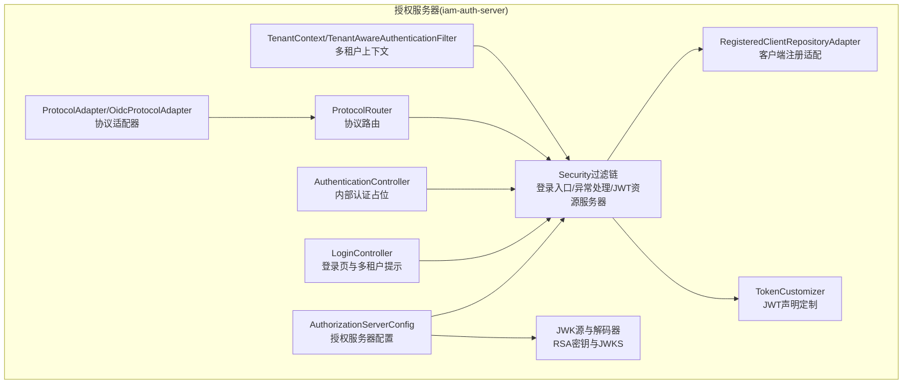
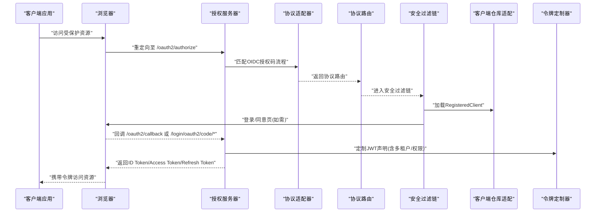
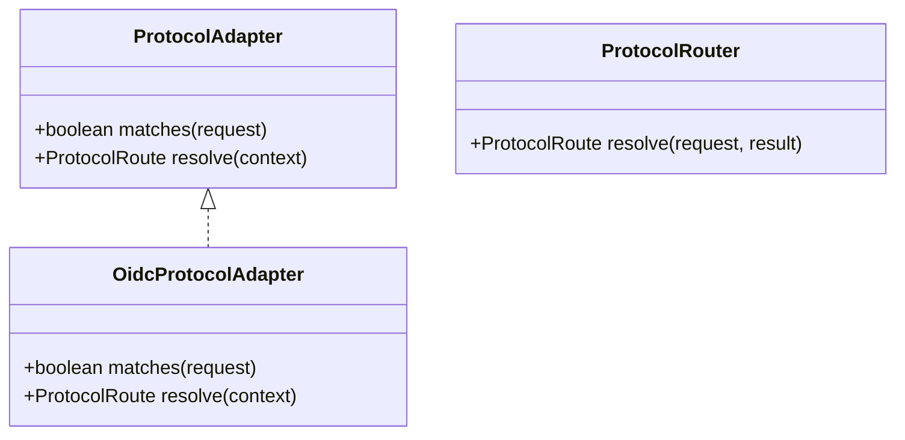
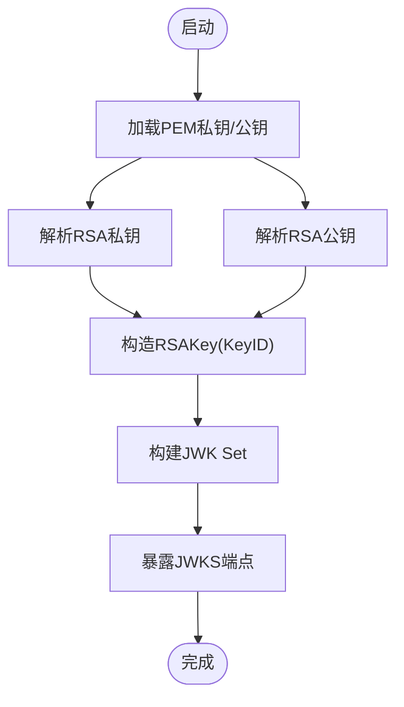
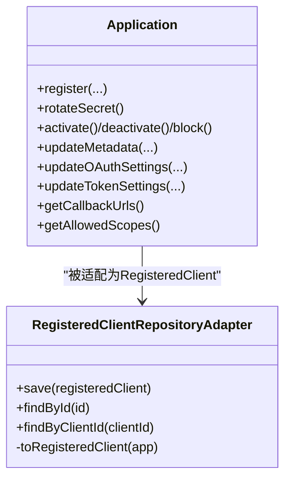
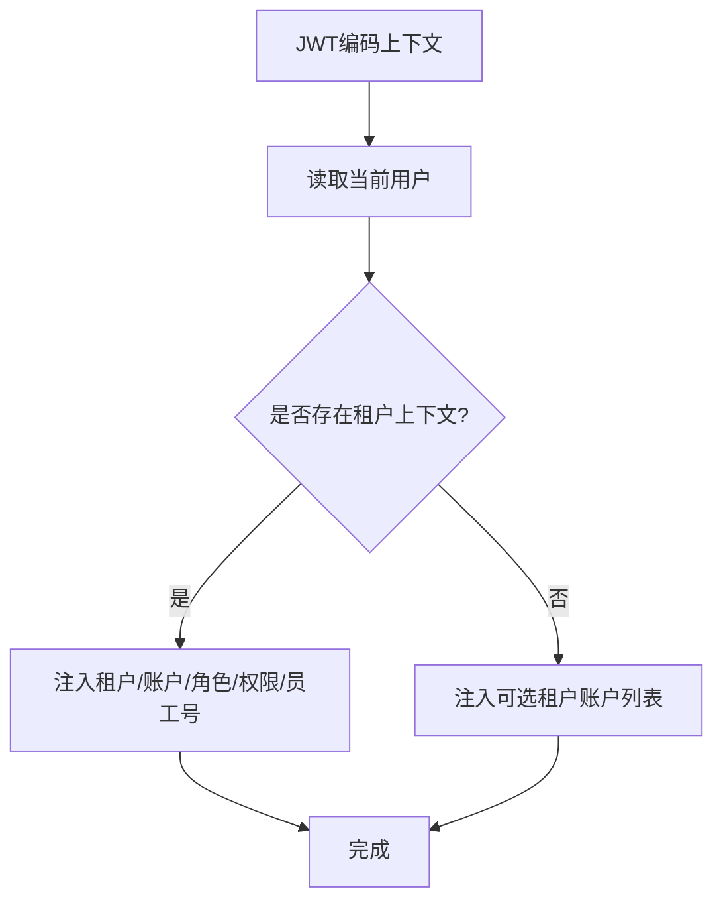
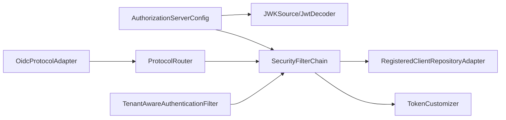

# OAuth2与OpenID Connect协议

<cite>
**本文引用的文件**
- [ProtocolAdapter.java](file://iam-auth-server/src/main/java/iam/platform/auth/application/service/routing/ProtocolAdapter.java)
- [OidcProtocolAdapter.java](file://iam-auth-server/src/main/java/iam/platform/auth/application/service/routing/OidcProtocolAdapter.java)
- [ProtocolRouter.java](file://iam-auth-server/src/main/java/iam/platform/auth/application/service/routing/ProtocolRouter.java)
- [RegisteredClientRepositoryAdapter.java](file://iam-auth-server/src/main/java/iam/platform/auth/infrastructure/security/RegisteredClientRepositoryAdapter.java)
- [AuthorizationServerConfig.java](file://iam-auth-server/src/main/java/iam/platform/auth/infrastructure/config/AuthorizationServerConfig.java)
- [TokenCustomizer.java](file://iam-auth-server/src/main/java/iam/platform/auth/infrastructure/security/TokenCustomizer.java)
- [LoginController.java](file://iam-auth-server/src/main/java/iam/platform/auth/interfaces/web/LoginController.java)
- [AuthenticationController.java](file://iam-auth-server/src/main/java/iam/platform/auth/interfaces/rest/AuthenticationController.java)
- [Application.java](file://iam-auth-server/src/main/java/iam/platform/auth/domain/model/entity/Application.java)
- [TenantAwareAuthenticationFilter.java](file://iam-auth-server/src/main/java/iam/platform/auth/infrastructure/security/TenantAwareAuthenticationFilter.java)
- [TenantContext.java](file://iam-auth-server/src/main/java/iam/platform/auth/infrastructure/security/TenantContext.java)
- [application.yml](file://iam-auth-server/src/main/resources/application.yml)
</cite>

## 目录
1. [引言](#引言)
2. [项目结构](#项目结构)
3. [核心组件](#核心组件)
4. [架构总览](#架构总览)
5. [详细组件分析](#详细组件分析)
6. [依赖分析](#依赖分析)
7. [性能考量](#性能考量)
8. [故障排查指南](#故障排查指南)
9. [结论](#结论)
10. [附录](#附录)

## 引言
本文件系统性梳理并解释该IAM平台中OAuth2.0与OpenID Connect（OIDC）协议的实现与设计。重点覆盖：
- OAuth2授权框架核心流程：授权码、客户端凭证、隐式、密码凭证等
- OIDC在OAuth2基础上的扩展：ID Token生成、用户信息端点、标准化声明
- 授权服务器配置与实现：客户端注册、作用域管理、令牌颁发策略
- 协议适配器设计模式：通过ProtocolAdapter接口支持多协议路由
- 完整流程示例：前端登录、后端处理、令牌发放与验证
- 安全考量、最佳实践与常见问题

## 项目结构
本项目采用多模块分层架构，认证授权相关能力集中在授权服务器模块（iam-auth-server），围绕Spring Authorization Server构建，结合自定义适配器与上下文管理实现多租户与OIDC扩展。

图表来源
- [AuthorizationServerConfig.java:44-64](file://iam-auth-server/src/main/java/iam/platform/auth/infrastructure/config/AuthorizationServerConfig.java#L44-L64)
- [RegisteredClientRepositoryAdapter.java:20-99](file://iam-auth-server/src/main/java/iam/platform/auth/infrastructure/security/RegisteredClientRepositoryAdapter.java#L20-L99)
- [TokenCustomizer.java:25-61](file://iam-auth-server/src/main/java/iam/platform/auth/infrastructure/security/TokenCustomizer.java#L25-L61)
- [LoginController.java:16-47](file://iam-auth-server/src/main/java/iam/platform/auth/interfaces/web/LoginController.java#L16-L47)
- [AuthenticationController.java:39-46](file://iam-auth-server/src/main/java/iam/platform/auth/interfaces/rest/AuthenticationController.java#L39-L46)
- [ProtocolAdapter.java:9-18](file://iam-auth-server/src/main/java/iam/platform/auth/application/service/routing/ProtocolAdapter.java#L9-L18)
- [OidcProtocolAdapter.java:10-38](file://iam-auth-server/src/main/java/iam/platform/auth/application/service/routing/OidcProtocolAdapter.java#L10-L38)
- [ProtocolRouter.java:9-17](file://iam-auth-server/src/main/java/iam/platform/auth/application/service/routing/ProtocolRouter.java#L9-L17)
- [TenantAwareAuthenticationFilter.java:23-44](file://iam-auth-server/src/main/java/iam/platform/auth/infrastructure/security/TenantAwareAuthenticationFilter.java#L23-L44)
- [TenantContext.java:7-44](file://iam-auth-server/src/main/java/iam/platform/auth/infrastructure/security/TenantContext.java#L7-L44)

章节来源
- [AuthorizationServerConfig.java:36-130](file://iam-auth-server/src/main/java/iam/platform/auth/infrastructure/config/AuthorizationServerConfig.java#L36-L130)
- [application.yml:1-144](file://iam-auth-server/src/main/resources/application.yml#L1-L144)

## 核心组件
- 授权服务器配置与安全过滤链：启用默认OAuth2/OIDC安全策略、HTML登录入口、JWT资源服务器、JWK源与解码器、租户感知过滤器
- 客户端注册适配：将应用实体映射为RegisteredClient，支持授权码与密码两种授权类型、回调地址、作用域、PKCE与同意页要求、令牌TTL
- 令牌定制器：在JWT中注入多租户上下文与权限声明，支持未选择租户时返回可选账户列表
- 登录控制器：提供登录页，支持子域名/参数/头部识别租户，统一错误与登出提示
- 协议适配器与路由：基于请求匹配OIDC授权码流程，解析协议路由
- 多租户上下文：线程本地存储当前人员、租户与租户账户ID，并在请求结束后清理

章节来源
- [AuthorizationServerConfig.java:44-99](file://iam-auth-server/src/main/java/iam/platform/auth/infrastructure/config/AuthorizationServerConfig.java#L44-L99)
- [RegisteredClientRepositoryAdapter.java:20-99](file://iam-auth-server/src/main/java/iam/platform/auth/infrastructure/security/RegisteredClientRepositoryAdapter.java#L20-L99)
- [TokenCustomizer.java:25-126](file://iam-auth-server/src/main/java/iam/platform/auth/infrastructure/security/TokenCustomizer.java#L25-L126)
- [LoginController.java:16-57](file://iam-auth-server/src/main/java/iam/platform/auth/interfaces/web/LoginController.java#L16-L57)
- [ProtocolAdapter.java:9-18](file://iam-auth-server/src/main/java/iam/platform/auth/application/service/routing/ProtocolAdapter.java#L9-L18)
- [OidcProtocolAdapter.java:10-38](file://iam-auth-server/src/main/java/iam/platform/auth/application/service/routing/OidcProtocolAdapter.java#L10-L38)
- [ProtocolRouter.java:9-17](file://iam-auth-server/src/main/java/iam/platform/auth/application/service/routing/ProtocolRouter.java#L9-L17)
- [TenantAwareAuthenticationFilter.java:23-66](file://iam-auth-server/src/main/java/iam/platform/auth/infrastructure/security/TenantAwareAuthenticationFilter.java#L23-L66)
- [TenantContext.java:7-44](file://iam-auth-server/src/main/java/iam/platform/auth/infrastructure/security/TenantContext.java#L7-L44)

## 架构总览
下图展示从HTTP请求到令牌发放的整体流程，涵盖OIDC授权码流程与多租户上下文注入。

图表来源
- [OidcProtocolAdapter.java:14-38](file://iam-auth-server/src/main/java/iam/platform/auth/application/service/routing/OidcProtocolAdapter.java#L14-L38)
- [ProtocolRouter.java:10-17](file://iam-auth-server/src/main/java/iam/platform/auth/application/service/routing/ProtocolRouter.java#L10-L17)
- [AuthorizationServerConfig.java:46-64](file://iam-auth-server/src/main/java/iam/platform/auth/infrastructure/config/AuthorizationServerConfig.java#L46-L64)
- [RegisteredClientRepositoryAdapter.java:25-45](file://iam-auth-server/src/main/java/iam/platform/auth/infrastructure/security/RegisteredClientRepositoryAdapter.java#L25-L45)
- [TokenCustomizer.java:33-61](file://iam-auth-server/src/main/java/iam/platform/auth/infrastructure/security/TokenCustomizer.java#L33-L61)

## 详细组件分析

### 协议适配器与路由
- ProtocolAdapter接口定义了“请求匹配”和“路由解析”的职责，便于扩展OIDC、SAML、CAS等协议
- OidcProtocolAdapter基于Referer与回调路径判断是否为OIDC授权码流程，并据此返回对应路由
- ProtocolRouter根据认证结果与请求来源解析最终路由

图表来源
- [ProtocolAdapter.java:9-18](file://iam-auth-server/src/main/java/iam/platform/auth/application/service/routing/ProtocolAdapter.java#L9-L18)
- [OidcProtocolAdapter.java:10-38](file://iam-auth-server/src/main/java/iam/platform/auth/application/service/routing/OidcProtocolAdapter.java#L10-L38)
- [ProtocolRouter.java:9-17](file://iam-auth-server/src/main/java/iam/platform/auth/application/service/routing/ProtocolRouter.java#L9-L17)

章节来源
- [ProtocolAdapter.java:9-18](file://iam-auth-server/src/main/java/iam/platform/auth/application/service/routing/ProtocolAdapter.java#L9-L18)
- [OidcProtocolAdapter.java:10-38](file://iam-auth-server/src/main/java/iam/platform/auth/application/service/routing/OidcProtocolAdapter.java#L10-L38)
- [ProtocolRouter.java:9-17](file://iam-auth-server/src/main/java/iam/platform/auth/application/service/routing/ProtocolRouter.java#L9-L17)

### 授权服务器配置与JWK
- 启用OAuth2/OIDC默认安全策略，配置HTML登录入口、JWT资源服务器
- 加载RSA私钥/公钥，生成稳定KeyID（SHA-256指纹前16字节），构建JWK Set并暴露给JWKS端点
- 配置AuthorizationServerSettings中的issuer URI

图表来源
- [AuthorizationServerConfig.java:67-93](file://iam-auth-server/src/main/java/iam/platform/auth/infrastructure/config/AuthorizationServerConfig.java#L67-L93)
- [AuthorizationServerConfig.java:101-128](file://iam-auth-server/src/main/java/iam/platform/auth/infrastructure/config/AuthorizationServerConfig.java#L101-L128)

章节来源
- [AuthorizationServerConfig.java:44-99](file://iam-auth-server/src/main/java/iam/platform/auth/infrastructure/config/AuthorizationServerConfig.java#L44-L99)

### 客户端注册与令牌设置
- RegisteredClientRepositoryAdapter将应用实体映射为RegisteredClient：
  - 客户端ID/名称/密钥（支持明文或编码存储）
  - 授权方式：授权码（推荐）、密码（仅限高信任）
  - 回调地址、作用域、PKCE与同意页要求
  - 令牌TTL：访问令牌与刷新令牌
- 应用实体提供工厂方法与更新方法，支持回调地址、作用域、令牌TTL等配置

图表来源
- [Application.java:45-178](file://iam-auth-server/src/main/java/iam/platform/auth/domain/model/entity/Application.java#L45-L178)
- [RegisteredClientRepositoryAdapter.java:25-99](file://iam-auth-server/src/main/java/iam/platform/auth/infrastructure/security/RegisteredClientRepositoryAdapter.java#L25-L99)

章节来源
- [RegisteredClientRepositoryAdapter.java:20-99](file://iam-auth-server/src/main/java/iam/platform/auth/infrastructure/security/RegisteredClientRepositoryAdapter.java#L20-L99)
- [Application.java:45-210](file://iam-auth-server/src/main/java/iam/platform/auth/domain/model/entity/Application.java#L45-L210)

### 令牌定制与声明注入
- TokenCustomizer在JWT中注入：
  - 基础用户信息：邮箱、昵称、人员ID
  - 租户上下文：当已建立租户上下文时，注入租户ID、账户ID、租户编码、员工号、角色与权限
  - 未选择租户：注入可选租户账户列表，以及空的租户/角色/权限占位
- 多租户上下文通过TenantContext与TenantAwareAuthenticationFilter在请求生命周期内维护

图表来源
- [TokenCustomizer.java:33-125](file://iam-auth-server/src/main/java/iam/platform/auth/infrastructure/security/TokenCustomizer.java#L33-L125)
- [TenantAwareAuthenticationFilter.java:49-66](file://iam-auth-server/src/main/java/iam/platform/auth/infrastructure/security/TenantAwareAuthenticationFilter.java#L49-L66)
- [TenantContext.java:15-43](file://iam-auth-server/src/main/java/iam/platform/auth/infrastructure/security/TenantContext.java#L15-L43)

章节来源
- [TokenCustomizer.java:25-126](file://iam-auth-server/src/main/java/iam/platform/auth/infrastructure/security/TokenCustomizer.java#L25-L126)
- [TenantAwareAuthenticationFilter.java:23-66](file://iam-auth-server/src/main/java/iam/platform/auth/infrastructure/security/TenantAwareAuthenticationFilter.java#L23-L66)
- [TenantContext.java:7-44](file://iam-auth-server/src/main/java/iam/platform/auth/infrastructure/security/TenantContext.java#L7-L44)

### 登录与多租户支持
- LoginController提供登录页，支持从子域名、查询参数或头部识别租户；未识别时引导用户选择租户
- 租户上下文在认证后由管道写入会话，后续请求通过TenantAwareAuthenticationFilter恢复

章节来源
- [LoginController.java:16-57](file://iam-auth-server/src/main/java/iam/platform/auth/interfaces/web/LoginController.java#L16-L57)
- [TenantAwareAuthenticationFilter.java:28-66](file://iam-auth-server/src/main/java/iam/platform/auth/infrastructure/security/TenantAwareAuthenticationFilter.java#L28-L66)

### 内部认证与密码凭证
- AuthenticationController为内部服务保留REST端点占位，明确密码凭证应走标准/oauth2/token端点
- 密码凭证流程由Spring Authorization Server自动处理，包含客户端校验、用户认证、预/后置管道、令牌生成与声明定制

章节来源
- [AuthenticationController.java:39-46](file://iam-auth-server/src/main/java/iam/platform/auth/interfaces/rest/AuthenticationController.java#L39-L46)

## 依赖分析
- 授权服务器配置依赖JWK属性与租户过滤器，构建安全过滤链
- 安全过滤链依赖RegisteredClientRepositoryAdapter进行客户端解析
- 令牌定制依赖用户与租户账户仓储及角色权限服务
- 协议适配器与路由用于区分OIDC授权码流程与其他协议

图表来源
- [AuthorizationServerConfig.java:44-99](file://iam-auth-server/src/main/java/iam/platform/auth/infrastructure/config/AuthorizationServerConfig.java#L44-L99)
- [RegisteredClientRepositoryAdapter.java:20-99](file://iam-auth-server/src/main/java/iam/platform/auth/infrastructure/security/RegisteredClientRepositoryAdapter.java#L20-L99)
- [TokenCustomizer.java:25-126](file://iam-auth-server/src/main/java/iam/platform/auth/infrastructure/security/TokenCustomizer.java#L25-L126)
- [OidcProtocolAdapter.java:10-38](file://iam-auth-server/src/main/java/iam/platform/auth/application/service/routing/OidcProtocolAdapter.java#L10-L38)
- [ProtocolRouter.java:9-17](file://iam-auth-server/src/main/java/iam/platform/auth/application/service/routing/ProtocolRouter.java#L9-L17)
- [TenantAwareAuthenticationFilter.java:23-44](file://iam-auth-server/src/main/java/iam/platform/auth/infrastructure/security/TenantAwareAuthenticationFilter.java#L23-L44)

章节来源
- [AuthorizationServerConfig.java:36-130](file://iam-auth-server/src/main/java/iam/platform/auth/infrastructure/config/AuthorizationServerConfig.java#L36-L130)
- [RegisteredClientRepositoryAdapter.java:20-99](file://iam-auth-server/src/main/java/iam/platform/auth/infrastructure/security/RegisteredClientRepositoryAdapter.java#L20-L99)
- [TokenCustomizer.java:25-126](file://iam-auth-server/src/main/java/iam/platform/auth/infrastructure/security/TokenCustomizer.java#L25-L126)
- [OidcProtocolAdapter.java:10-38](file://iam-auth-server/src/main/java/iam/platform/auth/application/service/routing/OidcProtocolAdapter.java#L10-L38)
- [ProtocolRouter.java:9-17](file://iam-auth-server/src/main/java/iam/platform/auth/application/service/routing/ProtocolRouter.java#L9-L17)
- [TenantAwareAuthenticationFilter.java:23-66](file://iam-auth-server/src/main/java/iam/platform/auth/infrastructure/security/TenantAwareAuthenticationFilter.java#L23-L66)

## 性能考量
- JWK KeyID稳定性：基于公钥SHA-256指纹生成KeyID，避免重启导致客户端缓存失效
- 令牌TTL：按应用维度配置访问令牌与刷新令牌有效期，平衡安全性与用户体验
- 连接池与会话：数据库连接池、Redis会话存储，减少连接争用与延迟
- 多租户上下文：线程本地存储，避免跨请求泄露，请求结束及时清理

章节来源
- [AuthorizationServerConfig.java:117-128](file://iam-auth-server/src/main/java/iam/platform/auth/infrastructure/config/AuthorizationServerConfig.java#L117-L128)
- [RegisteredClientRepositoryAdapter.java:90-96](file://iam-auth-server/src/main/java/iam/platform/auth/infrastructure/security/RegisteredClientRepositoryAdapter.java#L90-L96)
- [application.yml:15-53](file://iam-auth-server/src/main/resources/application.yml#L15-L53)
- [TenantAwareAuthenticationFilter.java:38-43](file://iam-auth-server/src/main/java/iam/platform/auth/infrastructure/security/TenantAwareAuthenticationFilter.java#L38-L43)

## 故障排查指南
- 登录失败/账号锁定
  - 检查安全策略配置（速率限制、账户锁定阈值）
  - 查看认证过滤器日志与异常入口
- 回调地址不匹配
  - 确认应用注册的回调地址与前端配置一致
- 令牌无效/无法解码
  - 校验JWK密钥加载与KeyID稳定性
  - 确认issuer URI与客户端配置一致
- 多租户上下文缺失
  - 检查TenantAwareAuthenticationFilter是否正确恢复会话
  - 确认认证后是否写入租户上下文

章节来源
- [application.yml:90-127](file://iam-auth-server/src/main/resources/application.yml#L90-L127)
- [AuthorizationServerConfig.java:44-99](file://iam-auth-server/src/main/java/iam/platform/auth/infrastructure/config/AuthorizationServerConfig.java#L44-L99)
- [TenantAwareAuthenticationFilter.java:28-44](file://iam-auth-server/src/main/java/iam/platform/auth/infrastructure/security/TenantAwareAuthenticationFilter.java#L28-L44)

## 结论
该实现以Spring Authorization Server为核心，结合自定义客户端注册适配、令牌定制与协议适配器，提供了完整的OAuth2/OIDC能力，并通过多租户上下文增强企业级场景下的灵活性与安全性。建议在生产环境启用BCrypt存储客户端密钥、开启PKCE与授权同意页、合理配置令牌TTL与安全策略。

## 附录

### OAuth2授权流程与OIDC扩展要点
- 授权码流程（Authorization Code）
  - 客户端引导用户至授权端点，回调后换取令牌
  - 支持PKCE增强移动/桌面应用安全性
- 客户端凭证流程（Client Credentials）
  - 用于服务到服务调用，无需用户参与
- 隐式流程（Implicit）
  - 已不推荐，存在令牌暴露风险
- 密码凭证流程（Resource Owner Password）
  - 仅适用于高度信任的遗留系统，严格限制使用范围

章节来源
- [RegisteredClientRepositoryAdapter.java:74-78](file://iam-auth-server/src/main/java/iam/platform/auth/infrastructure/security/RegisteredClientRepositoryAdapter.java#L74-L78)
- [AuthenticationController.java:10-31](file://iam-auth-server/src/main/java/iam/platform/auth/interfaces/rest/AuthenticationController.java#L10-L31)

### OIDC扩展与标准化声明
- ID Token生成：由授权服务器在授权码流程中签发，包含sub、iat、exp、iss等标准声明
- 用户信息端点：通过Spring Authorization Server的OIDC配置启用
- 标准化声明：用户基本信息（邮箱、昵称等）由TokenCustomizer注入

章节来源
- [AuthorizationServerConfig.java:50-51](file://iam-auth-server/src/main/java/iam/platform/auth/infrastructure/config/AuthorizationServerConfig.java#L50-L51)
- [TokenCustomizer.java:44-48](file://iam-auth-server/src/main/java/iam/platform/auth/infrastructure/security/TokenCustomizer.java#L44-L48)

### 前端集成与后端处理要点
- 前端：配置回调地址、发起授权请求、接收并存储ID Token/Access Token
- 后端：使用AuthorizationServerConfig提供的JWT解码器验证令牌，结合TokenCustomizer注入的声明进行鉴权与授权

章节来源
- [AuthorizationServerConfig.java:90-93](file://iam-auth-server/src/main/java/iam/platform/auth/infrastructure/config/AuthorizationServerConfig.java#L90-L93)
- [TokenCustomizer.java:33-61](file://iam-auth-server/src/main/java/iam/platform/auth/infrastructure/security/TokenCustomizer.java#L33-L61)