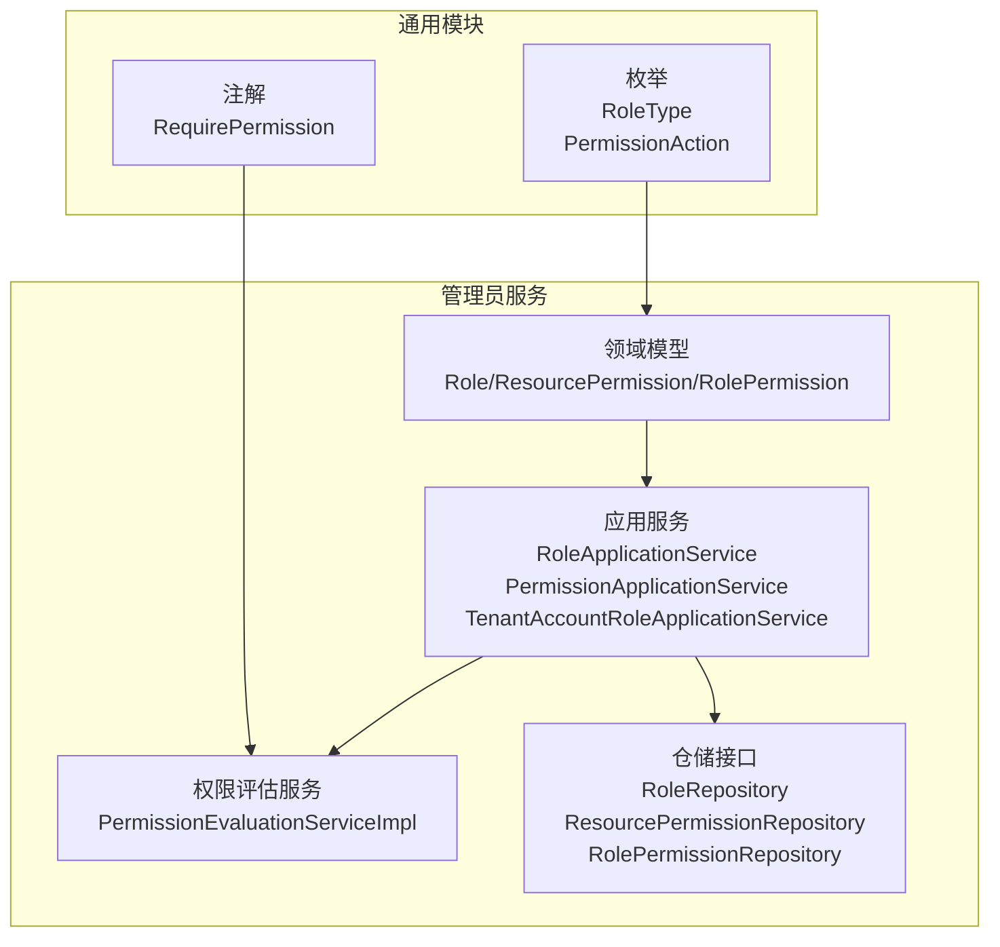
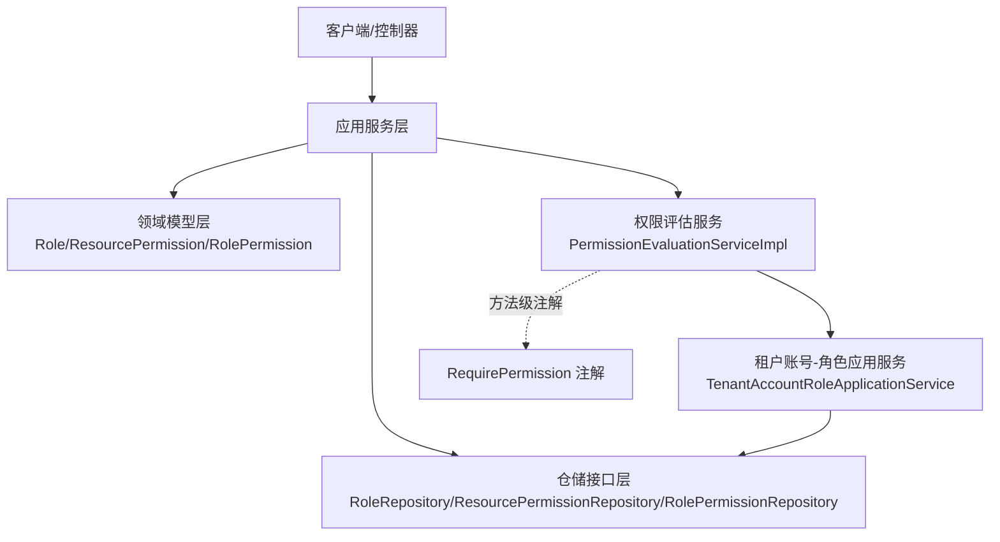
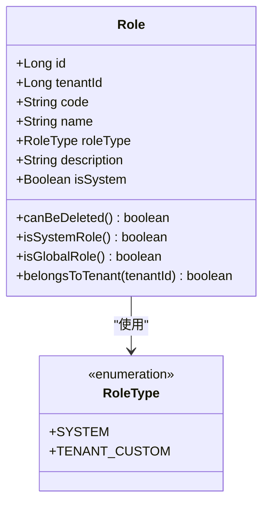
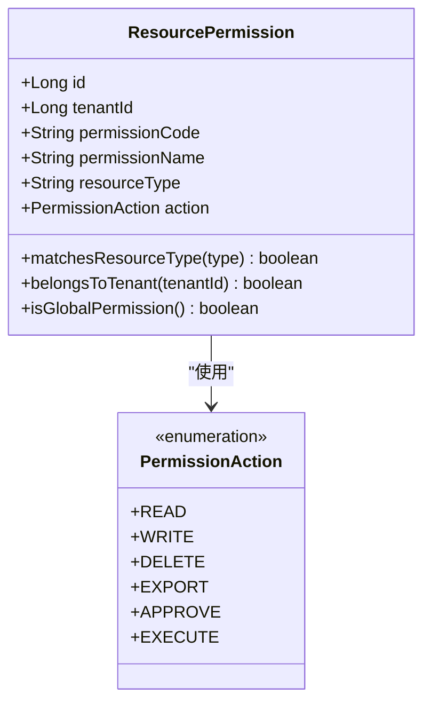
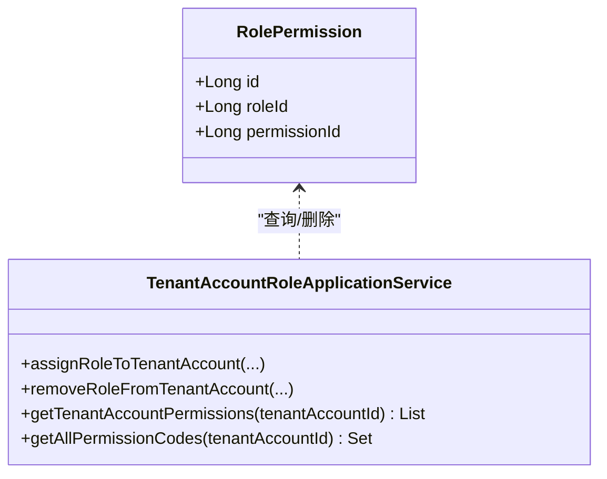
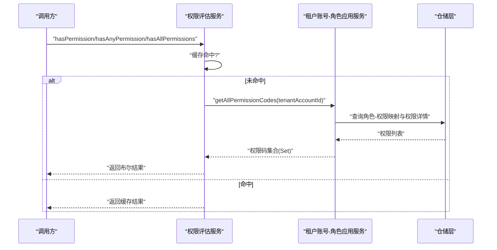
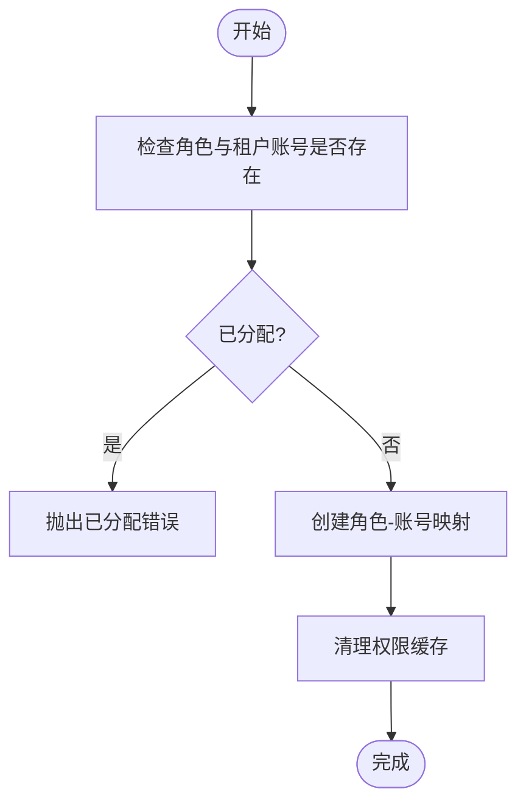
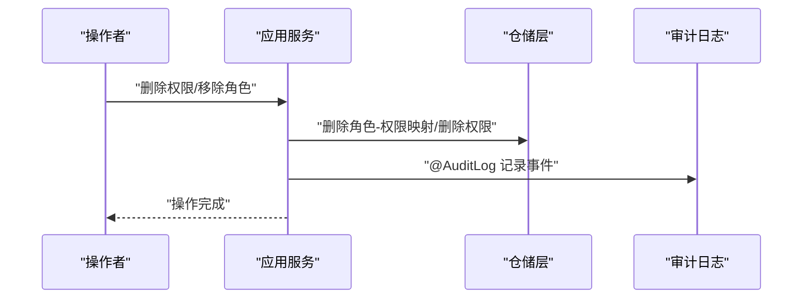
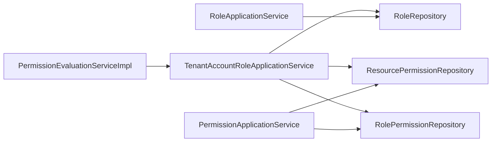

# RBAC权限模型

<cite>
**本文引用的文件**
- [Role.java](file://iam-admin-server/src/main/java/iam/platform/admin/domain/model/entity/Role.java)
- [ResourcePermission.java](file://iam-admin-server/src/main/java/iam/platform/admin/domain/model/entity/ResourcePermission.java)
- [RolePermission.java](file://iam-admin-server/src/main/java/iam/platform/admin/domain/model/entity/RolePermission.java)
- [PermissionEvaluationServiceImpl.java](file://iam-admin-server/src/main/java/iam/platform/admin/domain/service/impl/PermissionEvaluationServiceImpl.java)
- [RoleApplicationService.java](file://iam-admin-server/src/main/java/iam/platform/admin/application/service/RoleApplicationService.java)
- [PermissionApplicationService.java](file://iam-admin-server/src/main/java/iam/platform/admin/application/service/PermissionApplicationService.java)
- [TenantAccountRoleApplicationService.java](file://iam-admin-server/src/main/java/iam/platform/admin/application/service/TenantAccountRoleApplicationService.java)
- [RoleRepository.java](file://iam-admin-server/src/main/java/iam/platform/admin/domain/repository/RoleRepository.java)
- [ResourcePermissionRepository.java](file://iam-admin-server/src/main/java/iam/platform/admin/domain/repository/ResourcePermissionRepository.java)
- [RolePermissionRepository.java](file://iam-admin-server/src/main/java/iam/platform/admin/domain/repository/RolePermissionRepository.java)
- [RoleType.java](file://iam-common/src/main/java/iam/platform/common/model/enums/RoleType.java)
- [PermissionAction.java](file://iam-common/src/main/java/iam/platform/common/model/enums/PermissionAction.java)
- [RequirePermission.java](file://iam-common/src/main/java/iam/platform/common/model/annotation/RequirePermission.java)
</cite>

## 目录
1. [简介](#简介)
2. [项目结构](#项目结构)
3. [核心组件](#核心组件)
4. [架构总览](#架构总览)
5. [详细组件分析](#详细组件分析)
6. [依赖分析](#依赖分析)
7. [性能考量](#性能考量)
8. [故障排查指南](#故障排查指南)
9. [结论](#结论)
10. [附录](#附录)

## 简介
本文件系统化梳理该IAM平台的基于角色的访问控制（RBAC）权限模型，覆盖用户-角色-权限三元关系、角色与权限实体设计、权限评估与校验机制、资源权限模型、权限分配流程、权限缓存与性能优化、安全与合规、以及权限审计与回收等管理能力。文档以代码为依据，结合可视化图示帮助读者快速理解与落地实施。

## 项目结构
RBAC相关代码主要分布在“管理员服务”与“通用模块”中：
- 管理员服务（iam-admin-server）：负责角色、权限、租户账号角色映射、权限评估与应用层编排。
- 通用模块（iam-common）：提供枚举、注解、异常等跨模块共享能力。

图表来源
- [Role.java:1-83](file://iam-admin-server/src/main/java/iam/platform/admin/domain/model/entity/Role.java#L1-L83)
- [ResourcePermission.java:1-77](file://iam-admin-server/src/main/java/iam/platform/admin/domain/model/entity/ResourcePermission.java#L1-L77)
- [RolePermission.java:1-20](file://iam-admin-server/src/main/java/iam/platform/admin/domain/model/entity/RolePermission.java#L1-L20)
- [RoleApplicationService.java:1-84](file://iam-admin-server/src/main/java/iam/platform/admin/application/service/RoleApplicationService.java#L1-L84)
- [PermissionApplicationService.java:1-135](file://iam-admin-server/src/main/java/iam/platform/admin/application/service/PermissionApplicationService.java#L1-L135)
- [TenantAccountRoleApplicationService.java:1-145](file://iam-admin-server/src/main/java/iam/platform/admin/application/service/TenantAccountRoleApplicationService.java#L1-L145)
- [PermissionEvaluationServiceImpl.java:1-53](file://iam-admin-server/src/main/java/iam/platform/admin/domain/service/impl/PermissionEvaluationServiceImpl.java#L1-L53)
- [RoleRepository.java:1-29](file://iam-admin-server/src/main/java/iam/platform/admin/domain/repository/RoleRepository.java#L1-L29)
- [ResourcePermissionRepository.java:1-27](file://iam-admin-server/src/main/java/iam/platform/admin/domain/repository/ResourcePermissionRepository.java#L1-L27)
- [RolePermissionRepository.java:1-22](file://iam-admin-server/src/main/java/iam/platform/admin/domain/repository/RolePermissionRepository.java#L1-L22)
- [RoleType.java:1-7](file://iam-common/src/main/java/iam/platform/common/model/enums/RoleType.java#L1-L7)
- [PermissionAction.java:1-6](file://iam-common/src/main/java/iam/platform/common/model/enums/PermissionAction.java#L1-L6)
- [RequirePermission.java:1-35](file://iam-common/src/main/java/iam/platform/common/model/annotation/RequirePermission.java#L1-L35)

章节来源
- [Role.java:1-83](file://iam-admin-server/src/main/java/iam/platform/admin/domain/model/entity/Role.java#L1-L83)
- [ResourcePermission.java:1-77](file://iam-admin-server/src/main/java/iam/platform/admin/domain/model/entity/ResourcePermission.java#L1-L77)
- [RolePermission.java:1-20](file://iam-admin-server/src/main/java/iam/platform/admin/domain/model/entity/RolePermission.java#L1-L20)
- [RoleApplicationService.java:1-84](file://iam-admin-server/src/main/java/iam/platform/admin/application/service/RoleApplicationService.java#L1-L84)
- [PermissionApplicationService.java:1-135](file://iam-admin-server/src/main/java/iam/platform/admin/application/service/PermissionApplicationService.java#L1-L135)
- [TenantAccountRoleApplicationService.java:1-145](file://iam-admin-server/src/main/java/iam/platform/admin/application/service/TenantAccountRoleApplicationService.java#L1-L145)
- [PermissionEvaluationServiceImpl.java:1-53](file://iam-admin-server/src/main/java/iam/platform/admin/domain/service/impl/PermissionEvaluationServiceImpl.java#L1-L53)
- [RoleRepository.java:1-29](file://iam-admin-server/src/main/java/iam/platform/admin/domain/repository/RoleRepository.java#L1-L29)
- [ResourcePermissionRepository.java:1-27](file://iam-admin-server/src/main/java/iam/platform/admin/domain/repository/ResourcePermissionRepository.java#L1-L27)
- [RolePermissionRepository.java:1-22](file://iam-admin-server/src/main/java/iam/platform/admin/domain/repository/RolePermissionRepository.java#L1-L22)
- [RoleType.java:1-7](file://iam-common/src/main/java/iam/platform/common/model/enums/RoleType.java#L1-L7)
- [PermissionAction.java:1-6](file://iam-common/src/main/java/iam/platform/common/model/enums/PermissionAction.java#L1-L6)
- [RequirePermission.java:1-35](file://iam-common/src/main/java/iam/platform/common/model/annotation/RequirePermission.java#L1-L35)

## 核心组件
- 角色实体：封装角色标识、归属租户、角色类型（系统内置/租户自定义）、描述与系统标志位，并提供工厂方法与行为判断（可删除、是否系统角色、是否全局角色、是否属于某租户）。
- 资源权限实体：封装权限编码、名称、资源类型、操作动作、描述及租户归属；提供工厂方法生成标准权限编码（资源类型:动作小写），并支持匹配资源类型、归属租户与是否全局权限判断。
- 角色-权限关联：通过角色-权限映射实体建立多对多关系，支撑角色继承与权限聚合。
- 应用服务：
  - 角色应用服务：负责角色创建、查询、列表、删除等生命周期管理。
  - 权限应用服务：负责资源权限创建、查询、删除、角色授权/回收等。
  - 租户账号-角色应用服务：负责租户账号的角色分配/回收、权限聚合与权限码导出。
- 权限评估服务：提供单个/任一/全部权限校验、统一权限检查与权限集合缓存。
- 仓储接口：抽象角色、资源权限、角色-权限映射的持久化能力。
- 枚举与注解：角色类型、权限动作、方法级权限注解（单个、任一、全部）。

章节来源
- [Role.java:1-83](file://iam-admin-server/src/main/java/iam/platform/admin/domain/model/entity/Role.java#L1-L83)
- [ResourcePermission.java:1-77](file://iam-admin-server/src/main/java/iam/platform/admin/domain/model/entity/ResourcePermission.java#L1-L77)
- [RolePermission.java:1-20](file://iam-admin-server/src/main/java/iam/platform/admin/domain/model/entity/RolePermission.java#L1-L20)
- [RoleApplicationService.java:1-84](file://iam-admin-server/src/main/java/iam/platform/admin/application/service/RoleApplicationService.java#L1-L84)
- [PermissionApplicationService.java:1-135](file://iam-admin-server/src/main/java/iam/platform/admin/application/service/PermissionApplicationService.java#L1-L135)
- [TenantAccountRoleApplicationService.java:1-145](file://iam-admin-server/src/main/java/iam/platform/admin/application/service/TenantAccountRoleApplicationService.java#L1-L145)
- [PermissionEvaluationServiceImpl.java:1-53](file://iam-admin-server/src/main/java/iam/platform/admin/domain/service/impl/PermissionEvaluationServiceImpl.java#L1-L53)
- [RoleRepository.java:1-29](file://iam-admin-server/src/main/java/iam/platform/admin/domain/repository/RoleRepository.java#L1-L29)
- [ResourcePermissionRepository.java:1-27](file://iam-admin-server/src/main/java/iam/platform/admin/domain/repository/ResourcePermissionRepository.java#L1-L27)
- [RolePermissionRepository.java:1-22](file://iam-admin-server/src/main/java/iam/platform/admin/domain/repository/RolePermissionRepository.java#L1-L22)
- [RoleType.java:1-7](file://iam-common/src/main/java/iam/platform/common/model/enums/RoleType.java#L1-L7)
- [PermissionAction.java:1-6](file://iam-common/src/main/java/iam/platform/common/model/enums/PermissionAction.java#L1-L6)
- [RequirePermission.java:1-35](file://iam-common/src/main/java/iam/platform/common/model/annotation/RequirePermission.java#L1-L35)

## 架构总览
下图展示RBAC在系统中的分层与交互：应用服务协调领域模型与仓储接口，权限评估服务提供统一校验入口，注解驱动方法级权限拦截。

图表来源
- [PermissionEvaluationServiceImpl.java:1-53](file://iam-admin-server/src/main/java/iam/platform/admin/domain/service/impl/PermissionEvaluationServiceImpl.java#L1-L53)
- [TenantAccountRoleApplicationService.java:1-145](file://iam-admin-server/src/main/java/iam/platform/admin/application/service/TenantAccountRoleApplicationService.java#L1-L145)
- [RequirePermission.java:1-35](file://iam-common/src/main/java/iam/platform/common/model/annotation/RequirePermission.java#L1-L35)

## 详细组件分析

### 角色实体设计
- 角色类型：系统内置（不可删除）与租户自定义两类，通过枚举区分。
- 角色层级与继承：当前模型未显式建模“角色层级/继承链”，而是通过“角色-权限映射”实现权限聚合；若需继承，可在映射阶段将父角色权限合并到子角色。
- 关键行为：
  - 工厂方法：创建系统角色、租户自定义角色，统一设置时间戳与系统标志。
  - 行为判断：是否可删除、是否系统角色、是否全局角色、是否属于某租户。

图表来源
- [Role.java:1-83](file://iam-admin-server/src/main/java/iam/platform/admin/domain/model/entity/Role.java#L1-L83)
- [RoleType.java:1-7](file://iam-common/src/main/java/iam/platform/common/model/enums/RoleType.java#L1-L7)

章节来源
- [Role.java:1-83](file://iam-admin-server/src/main/java/iam/platform/admin/domain/model/entity/Role.java#L1-L83)
- [RoleType.java:1-7](file://iam-common/src/main/java/iam/platform/common/model/enums/RoleType.java#L1-L7)

### 权限实体与资源权限模型
- 权限编码规范：由“资源类型:动作小写”组成，确保权限表达清晰且可程序化解析。
- 资源类型与动作：资源类型用于语义分组，动作枚举覆盖读取、写入、删除、导出、审批、执行等。
- 全局与租户权限：权限可归属租户或全局，查询时支持按租户或全局过滤。

图表来源
- [ResourcePermission.java:1-77](file://iam-admin-server/src/main/java/iam/platform/admin/domain/model/entity/ResourcePermission.java#L1-L77)
- [PermissionAction.java:1-6](file://iam-common/src/main/java/iam/platform/common/model/enums/PermissionAction.java#L1-L6)

章节来源
- [ResourcePermission.java:1-77](file://iam-admin-server/src/main/java/iam/platform/admin/domain/model/entity/ResourcePermission.java#L1-L77)
- [PermissionAction.java:1-6](file://iam-common/src/main/java/iam/platform/common/model/enums/PermissionAction.java#L1-L6)

### 角色-权限映射与权限聚合
- 映射关系：角色-权限为多对多，通过中间实体记录映射关系与时间戳。
- 权限聚合：租户账号的权限集合来自其所有角色所授予的权限并集；应用服务提供“获取账号权限列表”与“导出权限码集合”。

图表来源
- [RolePermission.java:1-20](file://iam-admin-server/src/main/java/iam/platform/admin/domain/model/entity/RolePermission.java#L1-L20)
- [TenantAccountRoleApplicationService.java:1-145](file://iam-admin-server/src/main/java/iam/platform/admin/application/service/TenantAccountRoleApplicationService.java#L1-L145)

章节来源
- [RolePermission.java:1-20](file://iam-admin-server/src/main/java/iam/platform/admin/domain/model/entity/RolePermission.java#L1-L20)
- [TenantAccountRoleApplicationService.java:1-145](file://iam-admin-server/src/main/java/iam/platform/admin/application/service/TenantAccountRoleApplicationService.java#L1-L145)

### 权限评估服务与方法级校验
- 评估逻辑：提供单权限、任一权限、全部权限三种校验模式；统一抛出拒绝异常。
- 缓存策略：对“获取账号所有权限码集合”启用缓存，变更角色或权限映射时主动清理缓存。
- 方法级注解：通过注解声明所需权限（单个、任一、全部），由切面拦截并在执行前校验。

图表来源
- [PermissionEvaluationServiceImpl.java:1-53](file://iam-admin-server/src/main/java/iam/platform/admin/domain/service/impl/PermissionEvaluationServiceImpl.java#L1-L53)
- [TenantAccountRoleApplicationService.java:1-145](file://iam-admin-server/src/main/java/iam/platform/admin/application/service/TenantAccountRoleApplicationService.java#L1-L145)

章节来源
- [PermissionEvaluationServiceImpl.java:1-53](file://iam-admin-server/src/main/java/iam/platform/admin/domain/service/impl/PermissionEvaluationServiceImpl.java#L1-L53)
- [RequirePermission.java:1-35](file://iam-common/src/main/java/iam/platform/common/model/annotation/RequirePermission.java#L1-L35)

### 权限分配流程（角色授权、继承、条件）
- 角色授权：将角色分配给租户账号，触发权限聚合与缓存失效。
- 权限继承：当前模型通过“角色-权限映射”实现继承效果；若需显式层级继承，可在映射阶段将父角色权限注入子角色。
- 条件权限：当前模型未提供条件表达式；如需条件权限，可在权限码中携带上下文信息并在业务侧解析。

图表来源
- [TenantAccountRoleApplicationService.java:1-145](file://iam-admin-server/src/main/java/iam/platform/admin/application/service/TenantAccountRoleApplicationService.java#L1-L145)

章节来源
- [TenantAccountRoleApplicationService.java:1-145](file://iam-admin-server/src/main/java/iam/platform/admin/application/service/TenantAccountRoleApplicationService.java#L1-L145)

### 权限回收与审计
- 回收流程：从租户账号移除角色会触发缓存失效；删除权限会先清理角色-权限映射再删除权限。
- 审计日志：应用服务广泛使用审计注解，记录角色创建/删除、权限创建/删除、角色分配/撤销等关键事件。

图表来源
- [PermissionApplicationService.java:1-135](file://iam-admin-server/src/main/java/iam/platform/admin/application/service/PermissionApplicationService.java#L1-L135)
- [TenantAccountRoleApplicationService.java:1-145](file://iam-admin-server/src/main/java/iam/platform/admin/application/service/TenantAccountRoleApplicationService.java#L1-L145)

章节来源
- [PermissionApplicationService.java:1-135](file://iam-admin-server/src/main/java/iam/platform/admin/application/service/PermissionApplicationService.java#L1-L135)
- [TenantAccountRoleApplicationService.java:1-145](file://iam-admin-server/src/main/java/iam/platform/admin/application/service/TenantAccountRoleApplicationService.java#L1-L145)

## 依赖分析
- 组件耦合：
  - 应用服务依赖领域模型与仓储接口，职责清晰。
  - 权限评估服务依赖租户账号-角色应用服务，形成“评估-聚合”的依赖链。
- 外部依赖：
  - Spring Cache注解用于权限集合缓存。
  - 方法级权限注解配合切面实现横切校验。

图表来源
- [RoleApplicationService.java:1-84](file://iam-admin-server/src/main/java/iam/platform/admin/application/service/RoleApplicationService.java#L1-L84)
- [PermissionApplicationService.java:1-135](file://iam-admin-server/src/main/java/iam/platform/admin/application/service/PermissionApplicationService.java#L1-L135)
- [TenantAccountRoleApplicationService.java:1-145](file://iam-admin-server/src/main/java/iam/platform/admin/application/service/TenantAccountRoleApplicationService.java#L1-L145)
- [PermissionEvaluationServiceImpl.java:1-53](file://iam-admin-server/src/main/java/iam/platform/admin/domain/service/impl/PermissionEvaluationServiceImpl.java#L1-L53)
- [RoleRepository.java:1-29](file://iam-admin-server/src/main/java/iam/platform/admin/domain/repository/RoleRepository.java#L1-L29)
- [ResourcePermissionRepository.java:1-27](file://iam-admin-server/src/main/java/iam/platform/admin/domain/repository/ResourcePermissionRepository.java#L1-L27)
- [RolePermissionRepository.java:1-22](file://iam-admin-server/src/main/java/iam/platform/admin/domain/repository/RolePermissionRepository.java#L1-L22)

章节来源
- [RoleApplicationService.java:1-84](file://iam-admin-server/src/main/java/iam/platform/admin/application/service/RoleApplicationService.java#L1-L84)
- [PermissionApplicationService.java:1-135](file://iam-admin-server/src/main/java/iam/platform/admin/application/service/PermissionApplicationService.java#L1-L135)
- [TenantAccountRoleApplicationService.java:1-145](file://iam-admin-server/src/main/java/iam/platform/admin/application/service/TenantAccountRoleApplicationService.java#L1-L145)
- [PermissionEvaluationServiceImpl.java:1-53](file://iam-admin-server/src/main/java/iam/platform/admin/domain/service/impl/PermissionEvaluationServiceImpl.java#L1-L53)
- [RoleRepository.java:1-29](file://iam-admin-server/src/main/java/iam/platform/admin/domain/repository/RoleRepository.java#L1-L29)
- [ResourcePermissionRepository.java:1-27](file://iam-admin-server/src/main/java/iam/platform/admin/domain/repository/ResourcePermissionRepository.java#L1-L27)
- [RolePermissionRepository.java:1-22](file://iam-admin-server/src/main/java/iam/platform/admin/domain/repository/RolePermissionRepository.java#L1-L22)

## 性能考量
- 缓存策略：
  - 对“获取账号所有权限码集合”进行缓存，避免重复聚合。
  - 在角色分配/回收、权限删除等变更操作后主动清理缓存，保证一致性。
- 复杂度分析：
  - 权限聚合涉及多角色权限并集，复杂度与角色数与每角色权限数线性相关；建议限制单账号角色上限或分页聚合。
- 并发与事务：
  - 分配/回收角色与权限均在事务内执行，防止不一致状态。
- 索引与查询：
  - 仓储接口提供多维度查询（租户/全局、资源类型、权限码唯一性），应确保数据库索引覆盖常用过滤字段。

章节来源
- [PermissionEvaluationServiceImpl.java:1-53](file://iam-admin-server/src/main/java/iam/platform/admin/domain/service/impl/PermissionEvaluationServiceImpl.java#L1-L53)
- [TenantAccountRoleApplicationService.java:1-145](file://iam-admin-server/src/main/java/iam/platform/admin/application/service/TenantAccountRoleApplicationService.java#L1-L145)
- [RoleRepository.java:1-29](file://iam-admin-server/src/main/java/iam/platform/admin/domain/repository/RoleRepository.java#L1-L29)
- [ResourcePermissionRepository.java:1-27](file://iam-admin-server/src/main/java/iam/platform/admin/domain/repository/ResourcePermissionRepository.java#L1-L27)
- [RolePermissionRepository.java:1-22](file://iam-admin-server/src/main/java/iam/platform/admin/domain/repository/RolePermissionRepository.java#L1-L22)

## 故障排查指南
- 常见问题与定位：
  - “角色/权限不存在”：通常由应用服务在分配/授权前校验失败引发，检查ID有效性与租户范围。
  - “权限已分配/角色已分配”：重复分配导致异常，确认映射表是否已存在。
  - “权限不足被拒绝”：权限评估服务会抛出拒绝异常并记录告警日志，核对账号权限码集合与请求权限。
- 排查步骤：
  - 确认租户账号-角色映射是否存在。
  - 核对角色-权限映射是否正确。
  - 清理权限缓存后重试。
  - 查看审计日志定位操作时间线。

章节来源
- [PermissionApplicationService.java:1-135](file://iam-admin-server/src/main/java/iam/platform/admin/application/service/PermissionApplicationService.java#L1-L135)
- [TenantAccountRoleApplicationService.java:1-145](file://iam-admin-server/src/main/java/iam/platform/admin/application/service/TenantAccountRoleApplicationService.java#L1-L145)
- [PermissionEvaluationServiceImpl.java:1-53](file://iam-admin-server/src/main/java/iam/platform/admin/domain/service/impl/PermissionEvaluationServiceImpl.java#L1-L53)

## 结论
该RBAC模型以“角色-权限映射”为核心，通过应用服务实现权限聚合与管理，借助权限评估服务与方法级注解实现统一校验与缓存优化。当前模型未显式建模角色层级，但可通过映射聚合实现继承效果；若需更复杂的继承与条件权限，可在映射阶段扩展策略或引入条件表达式。整体架构清晰、职责分离良好，具备良好的扩展性与可维护性。

## 附录
- 术语
  - 角色：权限的载体，分为系统内置与租户自定义。
  - 权限：资源与动作的组合，采用“资源类型:动作小写”的编码规范。
  - 租户账号：平台用户的租户维度身份，拥有多个角色并获得相应权限。
- 最佳实践
  - 优先使用“任一/全部”注解组合满足灵活授权需求。
  - 控制单账号角色数量，避免权限聚合开销过大。
  - 变更角色/权限后及时清理缓存，确保实时性。
  - 使用审计日志追踪关键操作，满足合规要求。