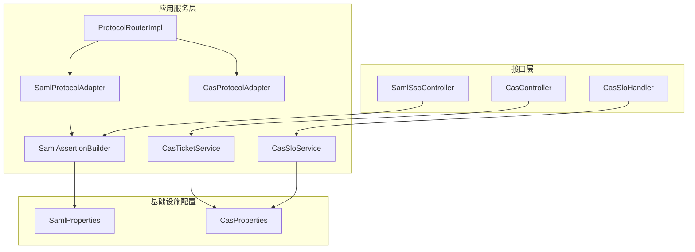
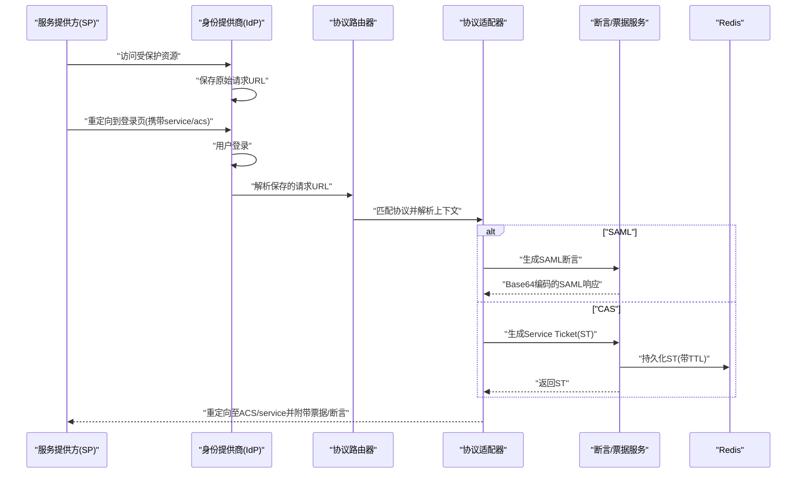
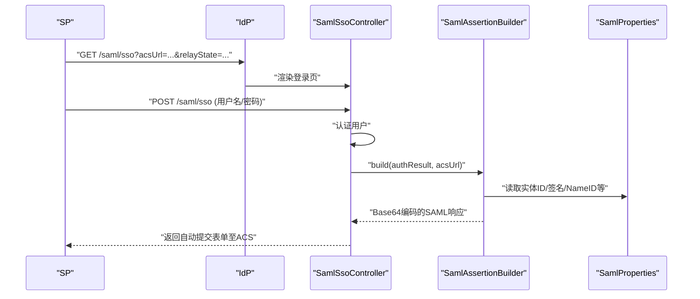
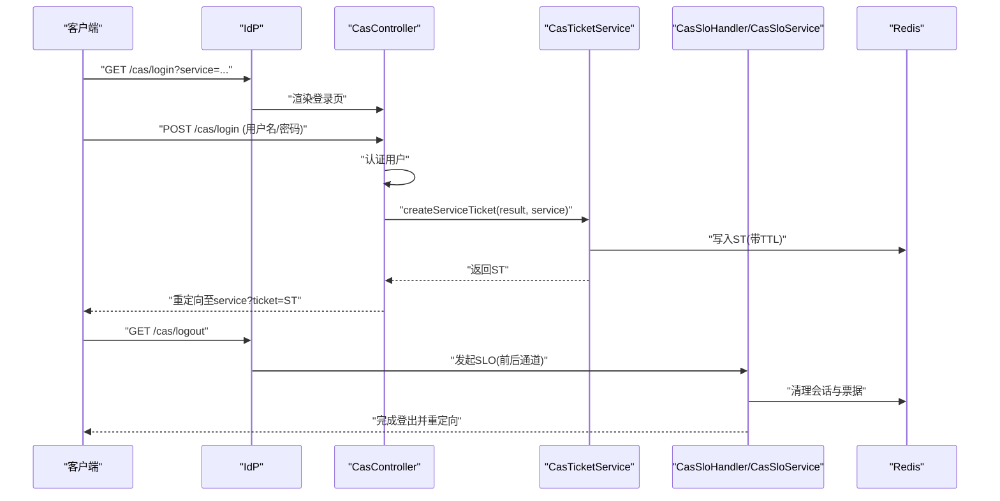
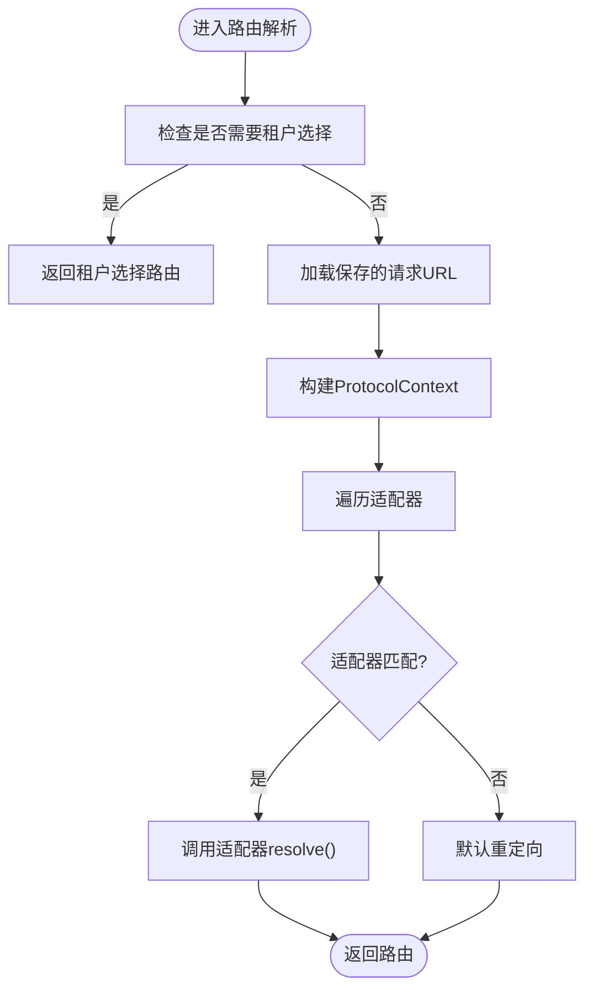
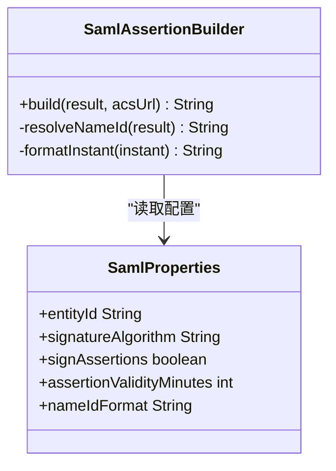
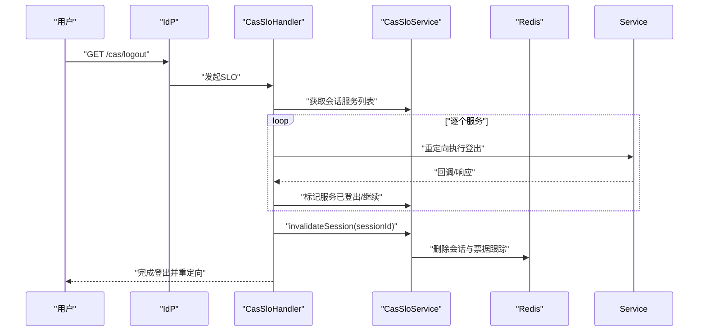
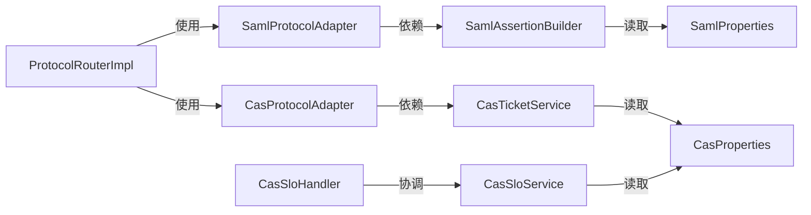

# SAML与CAS认证

<cite>
**本文引用的文件**
- [SamlProtocolAdapter.java](file://iam-auth-server/src/main/java/iam/platform/auth/application/service/routing/SamlProtocolAdapter.java)
- [CasProtocolAdapter.java](file://iam-auth-server/src/main/java/iam/platform/auth/application/service/routing/CasProtocolAdapter.java)
- [ProtocolAdapter.java](file://iam-auth-server/src/main/java/iam/platform/auth/application/service/routing/ProtocolAdapter.java)
- [ProtocolRouter.java](file://iam-auth-server/src/main/java/iam/platform/auth/application/service/routing/ProtocolRouter.java)
- [ProtocolRouterImpl.java](file://iam-auth-server/src/main/java/iam/platform/auth/application/service/routing/ProtocolRouterImpl.java)
- [ProtocolRoute.java](file://iam-auth-server/src/main/java/iam/platform/auth/application/service/routing/ProtocolRoute.java)
- [ProtocolContext.java](file://iam-auth-server/src/main/java/iam/platform/auth/application/service/routing/ProtocolContext.java)
- [SamlAssertionBuilder.java](file://iam-auth-server/src/main/java/iam/platform/auth/application/service/SamlAssertionBuilder.java)
- [CasTicketService.java](file://iam-auth-server/src/main/java/iam/platform/auth/application/service/CasTicketService.java)
- [SamlSsoController.java](file://iam-auth-server/src/main/java/iam/platform/auth/interfaces/web/SamlSsoController.java)
- [CasController.java](file://iam-auth-server/src/main/java/iam/platform/auth/interfaces/web/CasController.java)
- [CasSloHandler.java](file://iam-auth-server/src/main/java/iam/platform/auth/interfaces/web/CasSloHandler.java)
- [CasSloService.java](file://iam-auth-server/src/main/java/iam/platform/auth/application/service/CasSloService.java)
- [CasProperties.java](file://iam-auth-server/src/main/java/iam/platform/auth/infrastructure/config/CasProperties.java)
- [SamlProperties.java](file://iam-auth-server/src/main/java/iam/platform/auth/infrastructure/config/SamlProperties.java)
</cite>

## 目录
1. [简介](#简介)
2. [项目结构](#项目结构)
3. [核心组件](#核心组件)
4. [架构总览](#架构总览)
5. [详细组件分析](#详细组件分析)
6. [依赖分析](#依赖分析)
7. [性能考虑](#性能考虑)
8. [故障排查指南](#故障排查指南)
9. [结论](#结论)
10. [附录](#附录)

## 简介
本文件面向IAM平台中的SAML与CAS单点登录协议实现，系统性阐述以下内容：
- SAML断言消费者服务（ACS）与身份提供商（IdP）的交互机制：元数据交换、断言生成、签名策略设计要点。
- CAS协议的单点登录流程：服务票据（ST）颁发、票据校验、单点登出（SLO）的前后通道实现与会话清理。
- 协议适配器的实现细节：如何根据请求路径匹配不同协议，并在认证结果基础上生成目标路由。
- SAML断言构建器的设计：属性断言、认证断言、受众限制、NameID格式与有效期控制。
- CAS单点登出的完整实现：会话跟踪、服务注册、前后通道回调、广播通知与清理。
- 协议配置、安全设置与集成示例：基于配置类的参数化与可扩展性。
- 常见问题排查与性能优化建议。

## 项目结构
本项目采用分层与按功能域划分的组织方式，认证相关的核心位于iam-auth-server模块中，围绕“接口层-应用服务层-基础设施配置层”展开。SAML与CAS分别通过各自的控制器、断言构建器、票据服务与SLO服务协同工作；协议路由通过适配器模式统一入口，依据保存的请求上下文决定后续行为。

图表来源
- [SamlSsoController.java:1-151](file://iam-auth-server/src/main/java/iam/platform/auth/interfaces/web/SamlSsoController.java#L1-L151)
- [CasController.java:1-170](file://iam-auth-server/src/main/java/iam/platform/auth/interfaces/web/CasController.java#L1-L170)
- [CasSloHandler.java:1-198](file://iam-auth-server/src/main/java/iam/platform/auth/interfaces/web/CasSloHandler.java#L1-L198)
- [SamlProtocolAdapter.java:1-47](file://iam-auth-server/src/main/java/iam/platform/auth/application/service/routing/SamlProtocolAdapter.java#L1-L47)
- [CasProtocolAdapter.java:1-80](file://iam-auth-server/src/main/java/iam/platform/auth/application/service/routing/CasProtocolAdapter.java#L1-L80)
- [ProtocolRouterImpl.java:1-52](file://iam-auth-server/src/main/java/iam/platform/auth/application/service/routing/ProtocolRouterImpl.java#L1-L52)
- [SamlAssertionBuilder.java:1-115](file://iam-auth-server/src/main/java/iam/platform/auth/application/service/SamlAssertionBuilder.java#L1-L115)
- [CasTicketService.java:1-127](file://iam-auth-server/src/main/java/iam/platform/auth/application/service/CasTicketService.java#L1-L127)
- [CasSloService.java:1-303](file://iam-auth-server/src/main/java/iam/platform/auth/application/service/CasSloService.java#L1-L303)
- [SamlProperties.java:1-39](file://iam-auth-server/src/main/java/iam/platform/auth/infrastructure/config/SamlProperties.java#L1-L39)
- [CasProperties.java:1-45](file://iam-auth-server/src/main/java/iam/platform/auth/infrastructure/config/CasProperties.java#L1-L45)

章节来源
- [SamlSsoController.java:1-151](file://iam-auth-server/src/main/java/iam/platform/auth/interfaces/web/SamlSsoController.java#L1-L151)
- [CasController.java:1-170](file://iam-auth-server/src/main/java/iam/platform/auth/interfaces/web/CasController.java#L1-L170)
- [CasSloHandler.java:1-198](file://iam-auth-server/src/main/java/iam/platform/auth/interfaces/web/CasSloHandler.java#L1-L198)
- [ProtocolRouterImpl.java:1-52](file://iam-auth-server/src/main/java/iam/platform/auth/application/service/routing/ProtocolRouterImpl.java#L1-L52)

## 核心组件
- 协议适配器与路由
  - ProtocolAdapter：定义协议匹配与路由解析接口。
  - SamlProtocolAdapter：匹配以/saml或/ssso/saml开头的请求，从上下文中提取ACS与RelayState，调用断言构建器生成SAML响应并返回SAML_ASSERTION路由。
  - CasProtocolAdapter：匹配以/cas开头的请求，从保存的请求URL中解析service参数，生成CAS Service Ticket并返回CAS_TICKET路由。
  - ProtocolRouter与ProtocolRouterImpl：读取保存的请求URL，构造ProtocolContext，遍历适配器进行匹配，否则默认重定向。
  - ProtocolRoute：封装路由类型（SAML_ASSERTION、CAS_TICKET、DEFAULT_REDIRECT等）、目标URL与附加参数。
  - ProtocolContext：承载认证结果、保存的请求URL与默认URL。
- 断言与票据
  - SamlAssertionBuilder：基于SamlProperties生成符合SAML 2.0规范的断言XML，填充Issuer、Subject、Conditions、AuthnStatement、AttributeStatement等，最终Base64编码返回。
  - CasTicketService：生成ST并写入Redis（带TTL），支持降级到内存存储；验证时一次性消费并返回用户信息。
  - CasSloService：维护会话-服务集合、前后通道SLO流程、注销请求构建与响应处理、会话失效标记与清理。
- 控制器
  - SamlSsoController：提供SAML登录页、处理登录、生成SAML响应并通过自动提交表单回传至SP的ACS。
  - CasController：提供CAS登录页、处理登录、生成ST并重定向至service；提供ST校验端点；健康检查。
  - CasSloHandler：前端通道登出发起、后端通道登出接收、前端通道回调、登出响应处理与完成登出。

章节来源
- [ProtocolAdapter.java:1-20](file://iam-auth-server/src/main/java/iam/platform/auth/application/service/routing/ProtocolAdapter.java#L1-L20)
- [SamlProtocolAdapter.java:1-47](file://iam-auth-server/src/main/java/iam/platform/auth/application/service/routing/SamlProtocolAdapter.java#L1-L47)
- [CasProtocolAdapter.java:1-80](file://iam-auth-server/src/main/java/iam/platform/auth/application/service/routing/CasProtocolAdapter.java#L1-L80)
- [ProtocolRouter.java:1-19](file://iam-auth-server/src/main/java/iam/platform/auth/application/service/routing/ProtocolRouter.java#L1-L19)
- [ProtocolRouterImpl.java:1-52](file://iam-auth-server/src/main/java/iam/platform/auth/application/service/routing/ProtocolRouterImpl.java#L1-L52)
- [ProtocolRoute.java:1-74](file://iam-auth-server/src/main/java/iam/platform/auth/application/service/routing/ProtocolRoute.java#L1-L74)
- [ProtocolContext.java:1-21](file://iam-auth-server/src/main/java/iam/platform/auth/application/service/routing/ProtocolContext.java#L1-L21)
- [SamlAssertionBuilder.java:1-115](file://iam-auth-server/src/main/java/iam/platform/auth/application/service/SamlAssertionBuilder.java#L1-L115)
- [CasTicketService.java:1-127](file://iam-auth-server/src/main/java/iam/platform/auth/application/service/CasTicketService.java#L1-L127)
- [CasSloService.java:1-303](file://iam-auth-server/src/main/java/iam/platform/auth/application/service/CasSloService.java#L1-L303)
- [SamlSsoController.java:1-151](file://iam-auth-server/src/main/java/iam/platform/auth/interfaces/web/SamlSsoController.java#L1-L151)
- [CasController.java:1-170](file://iam-auth-server/src/main/java/iam/platform/auth/interfaces/web/CasController.java#L1-L170)
- [CasSloHandler.java:1-198](file://iam-auth-server/src/main/java/iam/platform/auth/interfaces/web/CasSloHandler.java#L1-L198)

## 架构总览
下图展示SAML与CAS在认证服务器中的交互路径与职责分工：

图表来源
- [ProtocolRouterImpl.java:24-50](file://iam-auth-server/src/main/java/iam/platform/auth/application/service/routing/ProtocolRouterImpl.java#L24-L50)
- [SamlProtocolAdapter.java:26-45](file://iam-auth-server/src/main/java/iam/platform/auth/application/service/routing/SamlProtocolAdapter.java#L26-L45)
- [CasProtocolAdapter.java:28-50](file://iam-auth-server/src/main/java/iam/platform/auth/application/service/routing/CasProtocolAdapter.java#L28-L50)
- [SamlAssertionBuilder.java:32-100](file://iam-auth-server/src/main/java/iam/platform/auth/application/service/SamlAssertionBuilder.java#L32-L100)
- [CasTicketService.java:36-58](file://iam-auth-server/src/main/java/iam/platform/auth/application/service/CasTicketService.java#L36-L58)

## 详细组件分析

### SAML协议实现
- 元数据交换
  - IdP元数据由SamlSsoController的元数据端点提供，供SP侧导入配置。
- 断言生成与签名策略
  - 断言构建器依据SamlProperties生成断言XML，包含Issuer、Subject、Conditions、AuthnStatement、AttributeStatement等；断言最终被Base64编码返回给SP。
  - 配置项如签名算法、是否签名、NameID格式、断言有效期等集中于SamlProperties，便于统一管理与扩展。
- 与SP的交互
  - 登录页与处理流程由SamlSsoController负责，登录成功后生成断言并通过自动提交表单回传至SP的ACS，同时携带RelayState用于状态恢复。

图表来源
- [SamlSsoController.java:42-93](file://iam-auth-server/src/main/java/iam/platform/auth/interfaces/web/SamlSsoController.java#L42-L93)
- [SamlAssertionBuilder.java:32-100](file://iam-auth-server/src/main/java/iam/platform/auth/application/service/SamlAssertionBuilder.java#L32-L100)
- [SamlProperties.java:15-38](file://iam-auth-server/src/main/java/iam/platform/auth/infrastructure/config/SamlProperties.java#L15-L38)

章节来源
- [SamlSsoController.java:1-151](file://iam-auth-server/src/main/java/iam/platform/auth/interfaces/web/SamlSsoController.java#L1-L151)
- [SamlAssertionBuilder.java:1-115](file://iam-auth-server/src/main/java/iam/platform/auth/application/service/SamlAssertionBuilder.java#L1-L115)
- [SamlProperties.java:1-39](file://iam-auth-server/src/main/java/iam/platform/auth/infrastructure/config/SamlProperties.java#L1-L39)

### CAS协议实现
- 登录与票据颁发
  - 登录页与处理由CasController提供；登录成功后若存在service参数，则生成ST并持久化到Redis（带TTL），随后重定向至service并附带ticket参数。
- 票据校验
  - 提供/serviceTicket端点，接收ST并一次性消费，返回CAS 3.0兼容的XML响应，包含用户信息与属性。
- 单点登出（SLO）
  - 前后通道结合：前端通道逐个重定向服务执行登出，后端通道接收来自其他服务的注销请求，完成后清理会话与票据。
  - CasSloService维护会话-服务集合、注销请求构建与响应处理、会话失效标记与清理。

图表来源
- [CasController.java:61-107](file://iam-auth-server/src/main/java/iam/platform/auth/interfaces/web/CasController.java#L61-L107)
- [CasTicketService.java:36-106](file://iam-auth-server/src/main/java/iam/platform/auth/application/service/CasTicketService.java#L36-L106)
- [CasSloHandler.java:42-196](file://iam-auth-server/src/main/java/iam/platform/auth/interfaces/web/CasSloHandler.java#L42-L196)
- [CasSloService.java:43-279](file://iam-auth-server/src/main/java/iam/platform/auth/application/service/CasSloService.java#L43-L279)

章节来源
- [CasController.java:1-170](file://iam-auth-server/src/main/java/iam/platform/auth/interfaces/web/CasController.java#L1-L170)
- [CasTicketService.java:1-127](file://iam-auth-server/src/main/java/iam/platform/auth/application/service/CasTicketService.java#L1-L127)
- [CasSloHandler.java:1-198](file://iam-auth-server/src/main/java/iam/platform/auth/interfaces/web/CasSloHandler.java#L1-L198)
- [CasSloService.java:1-303](file://iam-auth-server/src/main/java/iam/platform/auth/application/service/CasSloService.java#L1-L303)

### 协议适配器与路由
- 匹配规则
  - SamlProtocolAdapter匹配/saml或/ssso/saml路径；CasProtocolAdapter匹配/cas路径。
- 上下文解析
  - 从保存的请求URL中提取ACS/RelayState（SAML）或service（CAS），并从认证结果中获取用户信息。
- 路由决策
  - 生成SAML_ASSERTION或CAS_TICKET路由，携带必要参数；若无法解析则默认重定向。

图表来源
- [ProtocolRouterImpl.java:24-50](file://iam-auth-server/src/main/java/iam/platform/auth/application/service/routing/ProtocolRouterImpl.java#L24-L50)
- [SamlProtocolAdapter.java:19-45](file://iam-auth-server/src/main/java/iam/platform/auth/application/service/routing/SamlProtocolAdapter.java#L19-L45)
- [CasProtocolAdapter.java:21-50](file://iam-auth-server/src/main/java/iam/platform/auth/application/service/routing/CasProtocolAdapter.java#L21-L50)

章节来源
- [ProtocolAdapter.java:1-20](file://iam-auth-server/src/main/java/iam/platform/auth/application/service/routing/ProtocolAdapter.java#L1-L20)
- [ProtocolRouter.java:1-19](file://iam-auth-server/src/main/java/iam/platform/auth/application/service/routing/ProtocolRouter.java#L1-L19)
- [ProtocolRouterImpl.java:1-52](file://iam-auth-server/src/main/java/iam/platform/auth/application/service/routing/ProtocolRouterImpl.java#L1-L52)
- [ProtocolRoute.java:1-74](file://iam-auth-server/src/main/java/iam/platform/auth/application/service/routing/ProtocolRoute.java#L1-L74)
- [ProtocolContext.java:1-21](file://iam-auth-server/src/main/java/iam/platform/auth/application/service/routing/ProtocolContext.java#L1-L21)

### SAML断言构建器设计
- 数据结构与字段
  - 断言包含Issuer、Subject（NameID、SubjectConfirmation）、Conditions（AudienceRestriction、NotBefore/NotOnOrAfter）、AuthnStatement、AttributeStatement（如email、nickname）。
- 复杂度与性能
  - 字符串拼接与Base64编码为O(n)时间复杂度，n为断言XML长度；断言有效期与NameID解析为常数时间开销。
- 安全与合规
  - 通过SamlProperties控制签名算法、NameID格式与断言有效期；断言在SP端进行签名验证与过期检查。

图表来源
- [SamlAssertionBuilder.java:32-100](file://iam-auth-server/src/main/java/iam/platform/auth/application/service/SamlAssertionBuilder.java#L32-L100)
- [SamlProperties.java:15-38](file://iam-auth-server/src/main/java/iam/platform/auth/infrastructure/config/SamlProperties.java#L15-L38)

章节来源
- [SamlAssertionBuilder.java:1-115](file://iam-auth-server/src/main/java/iam/platform/auth/application/service/SamlAssertionBuilder.java#L1-L115)
- [SamlProperties.java:1-39](file://iam-auth-server/src/main/java/iam/platform/auth/infrastructure/config/SamlProperties.java#L1-L39)

### CAS单点登出完整实现
- 会话跟踪与服务注册
  - 登录时将service注册到当前会话，使用Redis集合存储，带过期时间；失败时回退到内存集合。
- 前后通道流程
  - 前端通道：逐个重定向已注册服务执行登出，回调记录状态，完成后清理并结束。
  - 后端通道：接收来自其他服务的注销请求，解析请求并使会话失效，清理相关票据。
- 清理与完成
  - 使会话失效、删除会话关联的票据与跟踪键，标记会话为已失效，最终重定向至登录页或指定service。

图表来源
- [CasSloHandler.java:42-196](file://iam-auth-server/src/main/java/iam/platform/auth/interfaces/web/CasSloHandler.java#L42-L196)
- [CasSloService.java:43-279](file://iam-auth-server/src/main/java/iam/platform/auth/application/service/CasSloService.java#L43-L279)

章节来源
- [CasSloHandler.java:1-198](file://iam-auth-server/src/main/java/iam/platform/auth/interfaces/web/CasSloHandler.java#L1-L198)
- [CasSloService.java:1-303](file://iam-auth-server/src/main/java/iam/platform/auth/application/service/CasSloService.java#L1-L303)

## 依赖分析
- 组件耦合
  - 协议适配器依赖断言构建器或票据服务，体现“按协议职责分离”的高内聚低耦合。
  - 路由器聚合多个适配器，通过接口解耦具体协议实现。
  - 断言构建器与票据服务依赖配置类，形成稳定的外部输入。
- 外部依赖
  - Redis用于分布式存储与会话跟踪，具备降级到内存存储的能力，提升可用性。
  - SamlProperties与CasProperties集中管理协议参数，便于运维与审计。

图表来源
- [ProtocolRouterImpl.java:22-44](file://iam-auth-server/src/main/java/iam/platform/auth/application/service/routing/ProtocolRouterImpl.java#L22-L44)
- [SamlProtocolAdapter.java:17-41](file://iam-auth-server/src/main/java/iam/platform/auth/application/service/routing/SamlProtocolAdapter.java#L17-L41)
- [CasProtocolAdapter.java:19-46](file://iam-auth-server/src/main/java/iam/platform/auth/application/service/routing/CasProtocolAdapter.java#L19-L46)
- [SamlAssertionBuilder.java:23-32](file://iam-auth-server/src/main/java/iam/platform/auth/application/service/SamlAssertionBuilder.java#L23-L32)
- [CasTicketService.java:24-36](file://iam-auth-server/src/main/java/iam/platform/auth/application/service/CasTicketService.java#L24-L36)
- [CasSloHandler.java:31-85](file://iam-auth-server/src/main/java/iam/platform/auth/interfaces/web/CasSloHandler.java#L31-L85)
- [CasSloService.java:26-43](file://iam-auth-server/src/main/java/iam/platform/auth/application/service/CasSloService.java#L26-L43)

章节来源
- [ProtocolRouterImpl.java:1-52](file://iam-auth-server/src/main/java/iam/platform/auth/application/service/routing/ProtocolRouterImpl.java#L1-L52)
- [SamlProperties.java:1-39](file://iam-auth-server/src/main/java/iam/platform/auth/infrastructure/config/SamlProperties.java#L1-L39)
- [CasProperties.java:1-45](file://iam-auth-server/src/main/java/iam/platform/auth/infrastructure/config/CasProperties.java#L1-L45)

## 性能考虑
- 断言与票据生成
  - 使用Base64编码与字符串拼接，整体为线性复杂度；建议对断言模板进行缓存复用（当前实现为即时拼接，可评估模板引擎或预编译方案）。
- Redis存储
  - ST与会话服务集合均设置TTL，避免长期占用内存；当Redis不可用时自动降级到内存存储，保障可用性。
- 并发与一致性
  - 使用并发安全的数据结构与原子操作，确保多实例部署下的会话与票据状态一致。
- 网络与I/O
  - 前端通道逐个重定向服务，可能带来延迟；可通过异步广播或批量通知优化（需结合业务场景评估）。

## 故障排查指南
- SAML断言为空或无法解析
  - 检查ProtocolContext中的ACS URL与RelayState是否正确传递；确认断言构建器的NameID解析与属性字段是否为空。
  - 参考：[SamlProtocolAdapter.java:26-45](file://iam-auth-server/src/main/java/iam/platform/auth/application/service/routing/SamlProtocolAdapter.java#L26-L45)，[SamlAssertionBuilder.java:32-100](file://iam-auth-server/src/main/java/iam/platform/auth/application/service/SamlAssertionBuilder.java#L32-L100)
- CAS ST无效或重复使用
  - 确认Redis可用且TTL设置合理；验证validateServiceTicket流程是否正确消费票据。
  - 参考：[CasTicketService.java:67-106](file://iam-auth-server/src/main/java/iam/platform/auth/application/service/CasTicketService.java#L67-L106)
- CAS登出未生效
  - 检查会话ID获取、服务注册与前后通道回调链路；确认Redis键空间与TTL配置。
  - 参考：[CasSloHandler.java:42-196](file://iam-auth-server/src/main/java/iam/platform/auth/interfaces/web/CasSloHandler.java#L42-L196)，[CasSloService.java:43-279](file://iam-auth-server/src/main/java/iam/platform/auth/application/service/CasSloService.java#L43-L279)
- 协议路由不匹配
  - 确认请求路径是否包含/saml、/ssso/saml或/cas前缀；检查保存的请求URL是否正确。
  - 参考：[SamlProtocolAdapter.java:20-23](file://iam-auth-server/src/main/java/iam/platform/auth/application/service/routing/SamlProtocolAdapter.java#L20-L23)，[CasProtocolAdapter.java:22-25](file://iam-auth-server/src/main/java/iam/platform/auth/application/service/routing/CasProtocolAdapter.java#L22-L25)，[ProtocolRouterImpl.java:32-35](file://iam-auth-server/src/main/java/iam/platform/auth/application/service/routing/ProtocolRouterImpl.java#L32-L35)

章节来源
- [SamlProtocolAdapter.java:19-45](file://iam-auth-server/src/main/java/iam/platform/auth/application/service/routing/SamlProtocolAdapter.java#L19-L45)
- [CasProtocolAdapter.java:21-50](file://iam-auth-server/src/main/java/iam/platform/auth/application/service/routing/CasProtocolAdapter.java#L21-L50)
- [ProtocolRouterImpl.java:24-50](file://iam-auth-server/src/main/java/iam/platform/auth/application/service/routing/ProtocolRouterImpl.java#L24-L50)
- [SamlAssertionBuilder.java:32-100](file://iam-auth-server/src/main/java/iam/platform/auth/application/service/SamlAssertionBuilder.java#L32-L100)
- [CasTicketService.java:67-106](file://iam-auth-server/src/main/java/iam/platform/auth/application/service/CasTicketService.java#L67-L106)
- [CasSloHandler.java:42-196](file://iam-auth-server/src/main/java/iam/platform/auth/interfaces/web/CasSloHandler.java#L42-L196)
- [CasSloService.java:43-279](file://iam-auth-server/src/main/java/iam/platform/auth/application/service/CasSloService.java#L43-L279)

## 结论
本实现以适配器模式统一路由入口，结合断言构建器与票据服务，分别满足SAML与CAS协议的关键需求。SAML侧重断言的完整性与SP端验证，CAS强调票据的时效性与SLO的前后通道协作。通过配置类集中管理协议参数，配合Redis的分布式能力与内存降级，系统在可用性与可维护性方面具备良好基础。后续可在断言模板缓存、SLO异步广播、日志与监控增强等方面进一步优化。

## 附录
- 配置参考
  - SamlProperties：实体ID、SSO URL、断言有效期、签名算法、NameID格式、签名开关与密钥信息。
  - CasProperties：服务器URL、ST有效期、前缀、SLO开关、前后通道开关、登出请求TTL与广播策略。
- 集成示例
  - SAML：SP侧导入IdP元数据，配置ACS与RelayState；登录后IdP返回SAML响应，SP端进行验证与会话建立。
  - CAS：SP侧在登录时携带service参数；IdP生成ST并重定向至service；service使用/serviceTicket校验ST并建立会话；登出时触发SLO流程。

章节来源
- [SamlProperties.java:1-39](file://iam-auth-server/src/main/java/iam/platform/auth/infrastructure/config/SamlProperties.java#L1-L39)
- [CasProperties.java:1-45](file://iam-auth-server/src/main/java/iam/platform/auth/infrastructure/config/CasProperties.java#L1-L45)
- [SamlSsoController.java:98-103](file://iam-auth-server/src/main/java/iam/platform/auth/interfaces/web/SamlSsoController.java#L98-L103)
- [CasController.java:114-149](file://iam-auth-server/src/main/java/iam/platform/auth/interfaces/web/CasController.java#L114-L149)