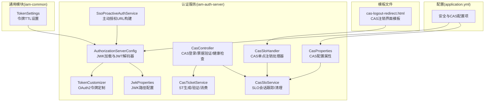
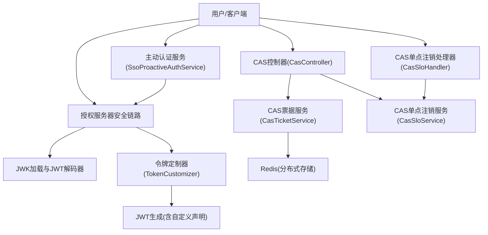
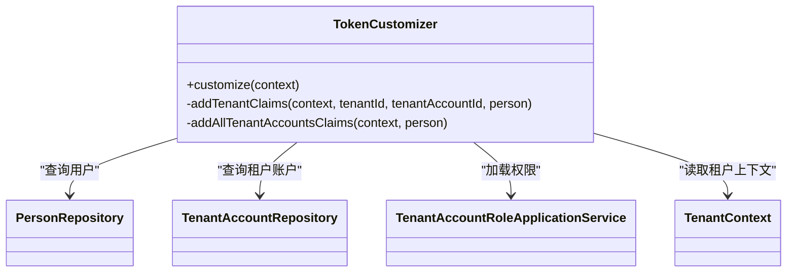
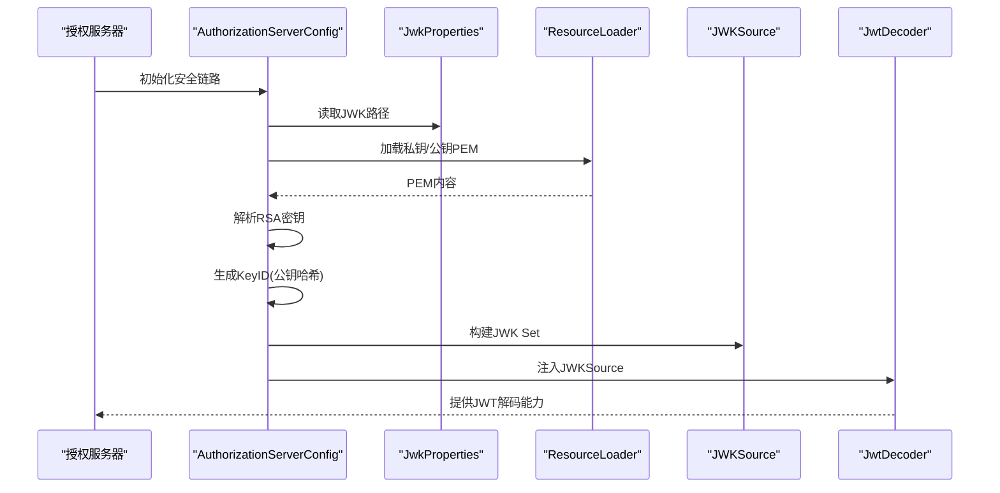
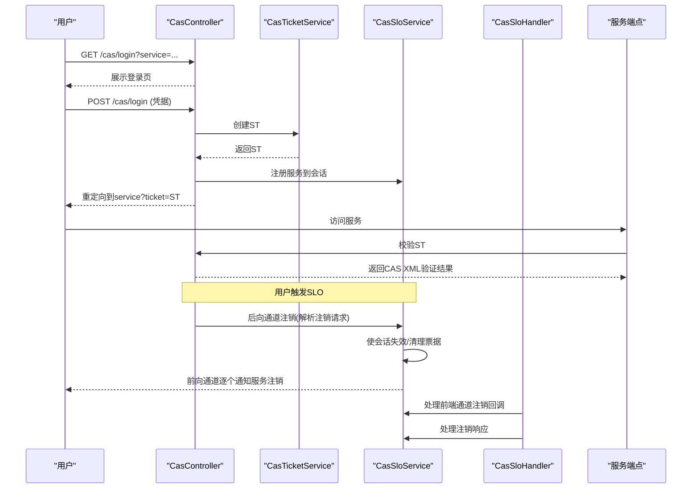
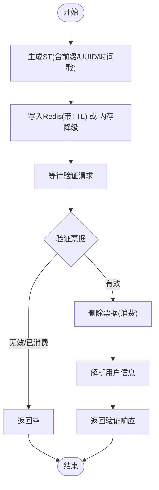
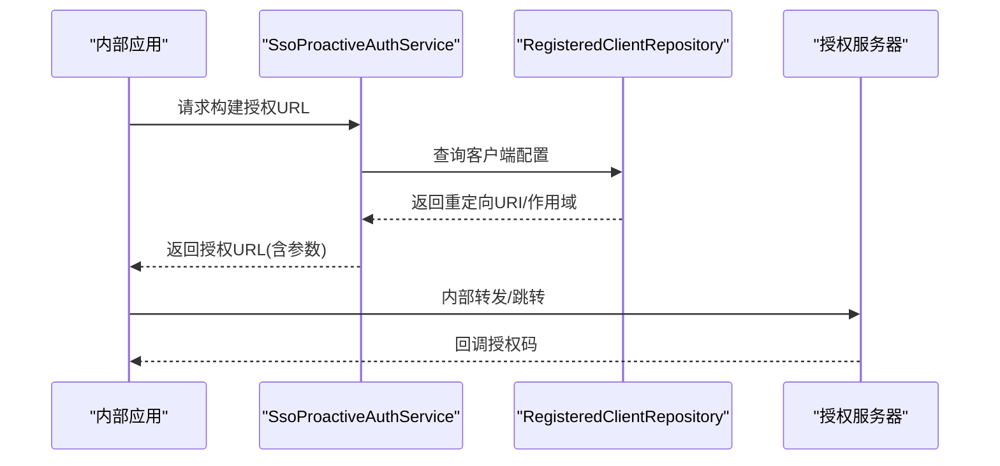
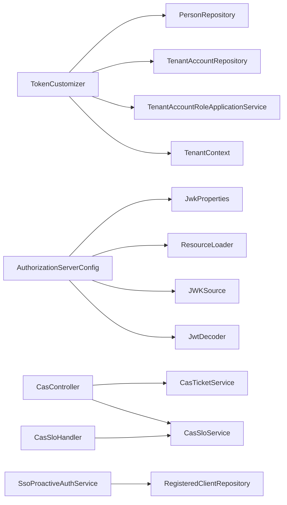

# 令牌管理

<cite>
**本文引用的文件**
- [TokenCustomizer.java](file://iam-auth-server/src/main/java/iam/platform/auth/infrastructure/security/TokenCustomizer.java)
- [AuthorizationServerConfig.java](file://iam-auth-server/src/main/java/iam/platform/auth/infrastructure/config/AuthorizationServerConfig.java)
- [JwkProperties.java](file://iam-auth-server/src/main/java/iam/platform/auth/infrastructure/config/JwkProperties.java)
- [TokenSettings.java](file://iam-common/src/main/java/iam/platform/common/model/valueobject/TokenSettings.java)
- [application.yml](file://iam-auth-server/src/main/resources/application.yml)
- [CasTicketService.java](file://iam-auth-server/src/main/java/iam/platform/auth/application/service/CasTicketService.java)
- [CasController.java](file://iam-auth-server/src/main/java/iam/platform/auth/interfaces/web/CasController.java)
- [CasSloService.java](file://iam-auth-server/src/main/java/iam/platform/auth/application/service/CasSloService.java)
- [CasSloHandler.java](file://iam-auth-server/src/main/java/iam/platform/auth/interfaces/web/CasSloHandler.java)
- [SsoProactiveAuthService.java](file://iam-auth-server/src/main/java/iam/platform/auth/application/service/SsoProactiveAuthService.java)
- [TenantAccount.java](file://iam-auth-server/src/main/java/iam/platform/auth/domain/model/entity/TenantAccount.java)
- [CasProperties.java](file://iam-auth-server/src/main/java/iam/platform/auth/infrastructure/config/CasProperties.java)
- [cas-logout-redirect.html](file://iam-auth-server/src/main/resources/templates/cas-logout-redirect.html)
</cite>

## 更新摘要
**变更内容**
- 完善了CAS控制器与单点注销的完整流程说明
- 新增了CAS单点注销处理器(CasSloHandler)的详细实现
- 补充了CAS模板文件和前端注销界面的说明
- 更新了CAS配置属性的完整说明
- 整合了原有的使用示例文档内容到现有技术文档中

## 目录
1. [引言](#引言)
2. [项目结构](#项目结构)
3. [核心组件](#核心组件)
4. [架构总览](#架构总览)
5. [详细组件分析](#详细组件分析)
6. [依赖分析](#依赖分析)
7. [性能考虑](#性能考虑)
8. [故障排查指南](#故障排查指南)
9. [结论](#结论)
10. [附录](#附录)

## 引言
本技术文档聚焦于IAM平台中的"令牌管理系统"，围绕以下目标展开：  
- JWT令牌的生成与验证机制（头部、载荷、签名），以及JWK（JSON Web Key）的加载与使用。  
- 令牌定制器的设计与实现，如何基于用户身份与多租户上下文动态注入声明（claims）。  
- CAS票据服务的实现，包括票据生成、一次性验证与撤销机制。  
- CAS单点注销的完整流程，包括前后通道注销、会话管理和服务协调。  
- 主动认证服务的工作原理，如何在用户登录时自动完成后续授权流程。  
- 令牌生命周期管理（过期时间、刷新策略、撤销列表等）。  
- 安全存储、传输加密与防重放攻击等安全措施。

## 项目结构
本项目采用多模块划分，认证相关的核心逻辑集中在 iam-auth-server 模块；通用模型与值对象位于 iam-common 模块；令牌定制、JWK配置、CAS控制器与单点注销均在认证服务中实现。

**图表来源**
- [AuthorizationServerConfig.java:1-130](file://iam-auth-server/src/main/java/iam/platform/auth/infrastructure/config/AuthorizationServerConfig.java#L1-L130)
- [TokenCustomizer.java:1-127](file://iam-auth-server/src/main/java/iam/platform/auth/infrastructure/security/TokenCustomizer.java#L1-L127)
- [CasController.java:1-170](file://iam-auth-server/src/main/java/iam/platform/auth/interfaces/web/CasController.java#L1-L170)
- [CasSloHandler.java:1-197](file://iam-auth-server/src/main/java/iam/platform/auth/interfaces/web/CasSloHandler.java#L1-L197)
- [CasTicketService.java:1-126](file://iam-auth-server/src/main/java/iam/platform/auth/application/service/CasTicketService.java#L1-L126)
- [CasSloService.java:1-302](file://iam-auth-server/src/main/java/iam/platform/auth/application/service/CasSloService.java#L1-L302)
- [SsoProactiveAuthService.java:1-90](file://iam-auth-server/src/main/java/iam/platform/auth/application/service/SsoProactiveAuthService.java#L1-L90)
- [JwkProperties.java:1-16](file://iam-auth-server/src/main/java/iam/platform/auth/infrastructure/config/JwkProperties.java#L1-L16)
- [CasProperties.java:1-45](file://iam-auth-server/src/main/java/iam/platform/auth/infrastructure/config/CasProperties.java#L1-L45)
- [TokenSettings.java:1-63](file://iam-common/src/main/java/iam/platform/common/model/valueobject/TokenSettings.java#L1-L63)
- [application.yml:1-157](file://iam-auth-server/src/main/resources/application.yml#L1-L157)
- [cas-logout-redirect.html:1-272](file://iam-auth-server/src/main/resources/templates/cas-logout-redirect.html#L1-L272)

**章节来源**
- [AuthorizationServerConfig.java:1-130](file://iam-auth-server/src/main/java/iam/platform/auth/infrastructure/config/AuthorizationServerConfig.java#L1-L130)
- [application.yml:1-157](file://iam-auth-server/src/main/resources/application.yml#L1-L157)

## 核心组件
- 令牌定制器（TokenCustomizer）：在JWT生成过程中动态注入用户基本信息、多租户上下文、角色与权限等声明，支持有租户上下文与无租户上下文两种模式。
- 授权服务器配置（AuthorizationServerConfig）：负责JWK加载、JWT解码器装配、授权服务器安全链路与OIDC默认配置。
- JWK属性（JwkProperties）：读取私钥与公钥位置，供授权服务器加载RSA密钥。
- 令牌设置（TokenSettings）：统一管理访问令牌与刷新令牌的TTL。
- CAS控制器（CasController）：提供CAS登录页面、登录处理、票据验证与健康检查接口。
- CAS票据服务（CasTicketService）：生成与验证CAS服务票据（ST），采用Redis分布式存储与TTL控制，支持降级到内存存储。
- CAS单点注销处理器（CasSloHandler）：处理前后通道注销请求，包括前端通道注销和后端通道注销。
- CAS单点注销服务（CasSloService）：维护会话与服务映射、注销请求解析、标记注销状态、会话失效与票据清理。
- 主动认证（SsoProactiveAuthService）：校验客户端配置并构造授权URL，用于内部转发至授权服务器完成授权码流程。

**章节来源**
- [TokenCustomizer.java:1-127](file://iam-auth-server/src/main/java/iam/platform/auth/infrastructure/security/TokenCustomizer.java#L1-L127)
- [AuthorizationServerConfig.java:1-130](file://iam-auth-server/src/main/java/iam/platform/auth/infrastructure/config/AuthorizationServerConfig.java#L1-L130)
- [JwkProperties.java:1-16](file://iam-auth-server/src/main/java/iam/platform/auth/infrastructure/config/JwkProperties.java#L1-L16)
- [TokenSettings.java:1-63](file://iam-common/src/main/java/iam/platform/common/model/valueobject/TokenSettings.java#L1-L63)
- [CasController.java:1-170](file://iam-auth-server/src/main/java/iam/platform/auth/interfaces/web/CasController.java#L1-L170)
- [CasTicketService.java:1-126](file://iam-auth-server/src/main/java/iam/platform/auth/application/service/CasTicketService.java#L1-L126)
- [CasSloHandler.java:1-197](file://iam-auth-server/src/main/java/iam/platform/auth/interfaces/web/CasSloHandler.java#L1-L197)
- [CasSloService.java:1-302](file://iam-auth-server/src/main/java/iam/platform/auth/application/service/CasSloService.java#L1-L302)
- [SsoProactiveAuthService.java:1-90](file://iam-auth-server/src/main/java/iam/platform/auth/application/service/SsoProactiveAuthService.java#L1-L90)

## 架构总览
下图展示了令牌生成与验证、JWK加载、CAS票据与SLO的整体交互：

**图表来源**
- [AuthorizationServerConfig.java:44-99](file://iam-auth-server/src/main/java/iam/platform/auth/infrastructure/config/AuthorizationServerConfig.java#L44-L99)
- [TokenCustomizer.java:33-61](file://iam-auth-server/src/main/java/iam/platform/auth/infrastructure/security/TokenCustomizer.java#L33-L61)
- [CasController.java:44-107](file://iam-auth-server/src/main/java/iam/platform/auth/interfaces/web/CasController.java#L44-L107)
- [CasTicketService.java:36-58](file://iam-auth-server/src/main/java/iam/platform/auth/application/service/CasTicketService.java#L36-L58)
- [CasSloHandler.java:21-29](file://iam-auth-server/src/main/java/iam/platform/auth/interfaces/web/CasSloHandler.java#L21-L29)
- [CasSloService.java:42-55](file://iam-auth-server/src/main/java/iam/platform/auth/application/service/CasSloService.java#L42-L55)
- [SsoProactiveAuthService.java:37-88](file://iam-auth-server/src/main/java/iam/platform/auth/application/service/SsoProactiveAuthService.java#L37-L88)

## 详细组件分析

### 令牌定制器（TokenCustomizer）
- 职责：在OAuth2授权服务器生成JWT时，根据当前认证主体与租户上下文动态添加声明，包括邮箱、昵称、人员ID、租户ID/账号ID、员工号、角色与权限集合等。
- 多租户策略：
  - 已建立租户上下文：仅注入当前租户的声明，并通过服务加载该账户的权限集合。
  - 未建立租户上下文：返回可选租户账户列表，便于客户端引导用户选择。
- 错误容错：权限加载失败时，不阻断令牌生成，权限声明回退为空集合。

**图表来源**
- [TokenCustomizer.java:27-126](file://iam-auth-server/src/main/java/iam/platform/auth/infrastructure/security/TokenCustomizer.java#L27-L126)

**章节来源**
- [TokenCustomizer.java:33-125](file://iam-auth-server/src/main/java/iam/platform/auth/infrastructure/security/TokenCustomizer.java#L33-L125)
- [TenantAccount.java:17-32](file://iam-auth-server/src/main/java/iam/platform/auth/domain/model/entity/TenantAccount.java#L17-L32)

### 授权服务器与JWK（AuthorizationServerConfig + JwkProperties）
- JWK加载：从资源路径读取PEM格式的RSA私钥与公钥，解析为Java密钥对象，生成JWK KeyID（基于公钥哈希的稳定标识），构建JWK Set并注入到JWT解码器。
- 安全配置：启用OAuth2授权服务器默认安全策略、OIDC支持、HTML登录入口、JWT资源服务器配置，并在过滤链中加入租户感知认证过滤器。
- 配置来源：JWK路径由JwkProperties读取，issuer由application.yml提供。

**图表来源**
- [AuthorizationServerConfig.java:67-99](file://iam-auth-server/src/main/java/iam/platform/auth/infrastructure/config/AuthorizationServerConfig.java#L67-L99)
- [JwkProperties.java:12-15](file://iam-auth-server/src/main/java/iam/platform/auth/infrastructure/config/JwkProperties.java#L12-L15)
- [application.yml:81-88](file://iam-auth-server/src/main/resources/application.yml#L81-L88)

**章节来源**
- [AuthorizationServerConfig.java:67-128](file://iam-auth-server/src/main/java/iam/platform/auth/infrastructure/config/AuthorizationServerConfig.java#L67-L128)
- [JwkProperties.java:12-15](file://iam-auth-server/src/main/java/iam/platform/auth/infrastructure/config/JwkProperties.java#L12-L15)
- [application.yml:81-88](file://iam-auth-server/src/main/resources/application.yml#L81-L88)

### CAS控制器与单点注销（CasController + CasSloHandler + CasSloService）
- 登录流程：展示CAS登录页，POST提交凭据后，若存在service参数则生成ST并重定向至服务回调；否则仅显示成功页。
- 票据验证：返回符合CAS 3.0协议的XML响应，包含用户与扩展属性。
- 单点注销（SLO）：
  - 会话服务注册：ST生成时将服务注册到会话集合，带TTL。
  - 后向通道注销：接收Base64编码的注销请求，提取会话索引并使会话失效，清理关联票据。
  - 前向通道注销：按顺序重定向各服务进行注销，使用Redis键标记已完成注销，完成后回到CAS登出页。
  - 注销处理器：提供完整的前后通道注销处理，包括前端通道注销回调和注销响应处理。

**图表来源**
- [CasController.java:44-149](file://iam-auth-server/src/main/java/iam/platform/auth/interfaces/web/CasController.java#L44-L149)
- [CasTicketService.java:36-106](file://iam-auth-server/src/main/java/iam/platform/auth/application/service/CasTicketService.java#L36-L106)
- [CasSloService.java:97-201](file://iam-auth-server/src/main/java/iam/platform/auth/application/service/CasSloService.java#L97-L201)
- [CasSloHandler.java:21-197](file://iam-auth-server/src/main/java/iam/platform/auth/interfaces/web/CasSloHandler.java#L21-L197)

**章节来源**
- [CasController.java:44-149](file://iam-auth-server/src/main/java/iam/platform/auth/interfaces/web/CasController.java#L44-L149)
- [CasSloHandler.java:21-197](file://iam-auth-server/src/main/java/iam/platform/auth/interfaces/web/CasSloHandler.java#L21-L197)
- [CasSloService.java:42-300](file://iam-auth-server/src/main/java/iam/platform/auth/application/service/CasSloService.java#L42-L300)

### CAS票据服务（CasTicketService）
- 票据生成：为认证结果与目标服务生成唯一ST，数据以"用户名|邮箱|昵称|服务"形式存储，带TTL；Redis不可用时降级到内存Map。
- 票据验证：一次性使用（消费即删），解析返回用户信息；格式异常或不存在返回空。
- 存储与容错：Redis操作异常时记录告警并切换内存存储，保证服务可用性。

**图表来源**
- [CasTicketService.java:36-106](file://iam-auth-server/src/main/java/iam/platform/auth/application/service/CasTicketService.java#L36-L106)

**章节来源**
- [CasTicketService.java:27-126](file://iam-auth-server/src/main/java/iam/platform/auth/application/service/CasTicketService.java#L27-L126)

### CAS配置属性（CasProperties）
- CAS服务器基础URL、票据有效期、票据前缀等基本配置。
- 单点注销开关、前后通道注销开关、注销请求TTL等高级配置。
- 登录URL、注销URL等路由配置。

**章节来源**
- [CasProperties.java:1-45](file://iam-auth-server/src/main/java/iam/platform/auth/infrastructure/config/CasProperties.java#L1-L45)

### CAS模板文件（cas-logout-redirect.html）
- 提供CAS单点注销的前端界面，包含进度条、服务列表和重定向信息。
- 使用Thymeleaf模板引擎渲染注销状态和进度。
- 包含JavaScript实现自动重定向和超时处理。

**章节来源**
- [cas-logout-redirect.html:1-272](file://iam-auth-server/src/main/resources/templates/cas-logout-redirect.html#L1-L272)

### 主动认证服务（SsoProactiveAuthService）
- 功能：校验客户端配置（客户端ID、重定向URI、作用域），拼装授权URL（支持state、nonce、PKCE），用于内部转发至授权服务器完成授权码流程。
- 场景：在用户登录后自动发起后续认证流程，提升用户体验。

**图表来源**
- [SsoProactiveAuthService.java:37-88](file://iam-auth-server/src/main/java/iam/platform/auth/application/service/SsoProactiveAuthService.java#L37-L88)

**章节来源**
- [SsoProactiveAuthService.java:26-88](file://iam-auth-server/src/main/java/iam/platform/auth/application/service/SsoProactiveAuthService.java#L26-L88)

### 令牌生命周期与安全策略
- 过期时间与刷新策略：TokenSettings提供访问令牌与刷新令牌TTL的统一配置，默认值分别为1小时与24小时；当refreshTtl为正数时，系统支持刷新流程。
- 密钥轮换与JWKS：AuthorizationServerConfig基于公钥生成稳定的KeyID，确保重启后KeyID不变，避免客户端缓存失效；密钥轮换时需更新私钥/公钥资源并滚动发布。
- 传输加密与防重放：
  - 传输加密：application.yml启用SSL/TLS，建议生产环境强制HTTPS。
  - 防重放：CAS票据采用一次性消费与TTL控制；JWT签名由JWK提供，客户端应校验签名与issuer；OIDC场景建议使用nonce与PKCE增强安全性。
- 撤销列表：CAS侧通过会话失效与票据清理实现撤销；JWT撤销可通过黑名单或短期TTL结合刷新令牌策略实现（需在客户端与授权服务器协同）。

**章节来源**
- [TokenSettings.java:17-48](file://iam-common/src/main/java/iam/platform/common/model/valueobject/TokenSettings.java#L17-L48)
- [AuthorizationServerConfig.java:80-88](file://iam-auth-server/src/main/java/iam/platform/auth/infrastructure/config/AuthorizationServerConfig.java#L80-L88)
- [application.yml:3-8](file://iam-auth-server/src/main/resources/application.yml#L3-L8)
- [CasTicketService.java:47-55](file://iam-auth-server/src/main/java/iam/platform/auth/application/service/CasTicketService.java#L47-L55)
- [CasSloService.java:252-278](file://iam-auth-server/src/main/java/iam/platform/auth/application/service/CasSloService.java#L252-L278)

## 依赖分析
- 组件耦合：
  - TokenCustomizer依赖领域仓储与业务服务，用于注入多租户与权限声明。
  - AuthorizationServerConfig依赖JwkProperties与ResourceLoader，负责JWK装配与JWT解码器。
  - CasController协调CasTicketService与CasSloService，形成CAS登录、票据验证与SLO闭环。
  - CasSloHandler作为SLO的统一入口，协调CasSloService处理前后通道注销。
  - SsoProactiveAuthService依赖RegisteredClientRepository，确保客户端配置正确。
- 外部依赖：
  - Redis用于CAS票据与会话状态的分布式存储。
  - Nimbus JOSE + JWT用于JWK与JWT处理。
  - Spring Security OAuth2 Authorization Server提供授权服务器能力。

**图表来源**
- [TokenCustomizer.java:29-31](file://iam-auth-server/src/main/java/iam/platform/auth/infrastructure/security/TokenCustomizer.java#L29-L31)
- [AuthorizationServerConfig.java:40-42](file://iam-auth-server/src/main/java/iam/platform/auth/infrastructure/config/AuthorizationServerConfig.java#L40-L42)
- [CasController.java:36-38](file://iam-auth-server/src/main/java/iam/platform/auth/interfaces/web/CasController.java#L36-L38)
- [CasSloHandler.java:31](file://iam-auth-server/src/main/java/iam/platform/auth/interfaces/web/CasSloHandler.java#L31)
- [SsoProactiveAuthService.java:24](file://iam-auth-server/src/main/java/iam/platform/auth/application/service/SsoProactiveAuthService.java#L24)

**章节来源**
- [TokenCustomizer.java:29-31](file://iam-auth-server/src/main/java/iam/platform/auth/infrastructure/security/TokenCustomizer.java#L29-L31)
- [AuthorizationServerConfig.java:40-42](file://iam-auth-server/src/main/java/iam/platform/auth/infrastructure/config/AuthorizationServerConfig.java#L40-L42)
- [CasController.java:36-38](file://iam-auth-server/src/main/java/iam/platform/auth/interfaces/web/CasController.java#L36-L38)
- [CasSloHandler.java:31](file://iam-auth-server/src/main/java/iam/platform/auth/interfaces/web/CasSloHandler.java#L31)
- [SsoProactiveAuthService.java:24](file://iam-auth-server/src/main/java/iam/platform/auth/application/service/SsoProactiveAuthService.java#L24)

## 性能考虑
- Redis命中率：CAS票据与会话映射使用Redis，建议合理设置TTL与容量，避免热点Key导致抖动。
- JWK热更新：KeyID稳定有助于客户端缓存复用；密钥轮换期间建议双Key并行验证，降低切换窗口风险。
- 令牌定制成本：权限加载可能带来额外查询开销，建议在TokenCustomizer中对权限加载失败进行降级处理，保障令牌生成可用性。
- CAS降级：Redis异常时的内存降级可保证功能可用，但需关注内存占用与持久化问题。
- SLO并发处理：前后通道注销可能涉及多个服务的并发处理，需要合理设置超时时间和重试机制。

## 故障排查指南
- JWT解码失败：
  - 检查JWK路径配置与PEM格式是否正确。
  - 确认KeyID稳定性与客户端JWKS缓存一致性。
- CAS票据无法验证：
  - 检查Redis连通性与TTL设置；确认票据已被消费。
  - 核对票据数据格式与字段顺序。
- SLO未生效：
  - 检查后向通道注销请求的Base64解码与SessionIndex提取。
  - 确认会话服务映射与注销状态键是否正确写入Redis。
  - 验证前端通道注销的回调处理是否正常。
- 主动认证URL错误：
  - 校验客户端ID是否存在且重定向URI已注册。
  - 确认state/nonce/PKCE参数拼装正确。
- CAS模板渲染问题：
  - 检查Thymeleaf模板语法和变量绑定。
  - 验证注销界面的JavaScript执行情况。

**章节来源**
- [AuthorizationServerConfig.java:101-128](file://iam-auth-server/src/main/java/iam/platform/auth/infrastructure/config/AuthorizationServerConfig.java#L101-L128)
- [CasTicketService.java:75-106](file://iam-auth-server/src/main/java/iam/platform/auth/application/service/CasTicketService.java#L75-L106)
- [CasSloService.java:97-141](file://iam-auth-server/src/main/java/iam/platform/auth/application/service/CasSloService.java#L97-L141)
- [CasSloHandler.java:76-110](file://iam-auth-server/src/main/java/iam/platform/auth/interfaces/web/CasSloHandler.java#L76-L110)
- [SsoProactiveAuthService.java:44-55](file://iam-auth-server/src/main/java/iam/platform/auth/application/service/SsoProactiveAuthService.java#L44-L55)

## 结论
本令牌管理系统在Spring Authorization Server之上，结合自定义TokenCustomizer实现多租户与权限的动态注入；通过JWK加载与JWT解码器保障签名与验证；CAS票据服务与SLO实现单点登录与注销；主动认证服务优化用户登录后的授权体验。CAS单点注销功能提供了完整的前后通道注销处理，包括会话管理、服务协调和注销状态跟踪。配合合理的TTL、密钥轮换策略与Redis分布式存储，系统在可用性、安全性与性能之间取得平衡。

## 附录
- 关键配置项参考：
  - JWK路径：security.jwk.rsa.private-key-location、security.jwk.rsa.public-key-location
  - Issuer：security.issuer-uri
  - CAS参数：sso.cas.*（票据有效期、前缀、SLO开关等）
  - SSL：server.ssl.*
- CAS注销流程：
  - 前端通道注销：通过浏览器重定向逐个通知服务注销
  - 后端通道注销：通过服务间通信批量处理注销
  - 注销状态跟踪：使用Redis键值对跟踪各服务注销状态

**章节来源**
- [application.yml:81-129](file://iam-auth-server/src/main/resources/application.yml#L81-L129)
- [CasProperties.java:15-44](file://iam-auth-server/src/main/java/iam/platform/auth/infrastructure/config/CasProperties.java#L15-L44)