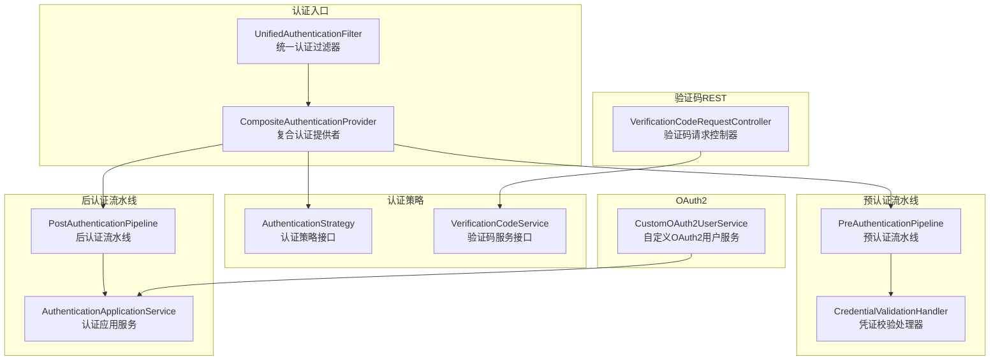
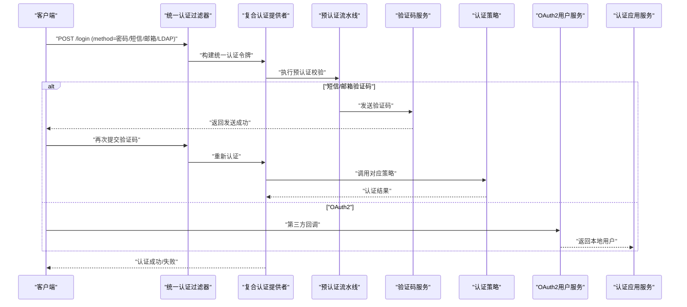
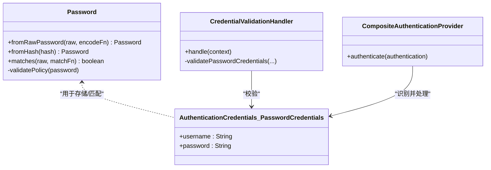
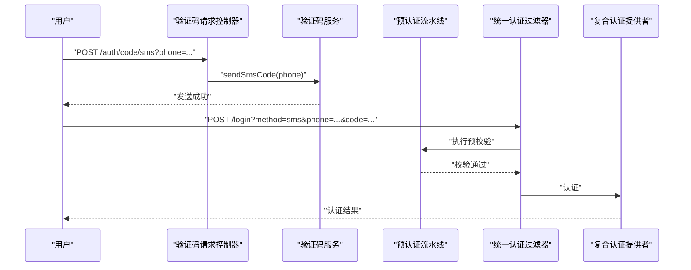
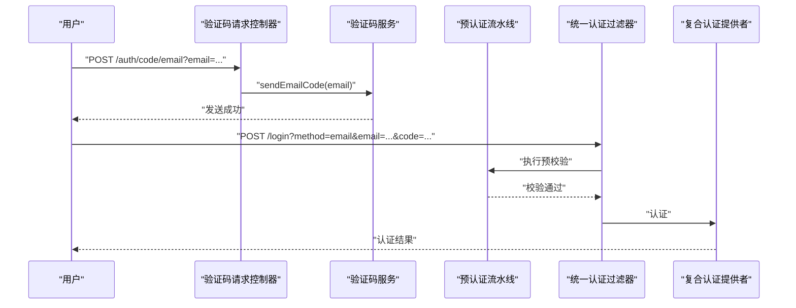
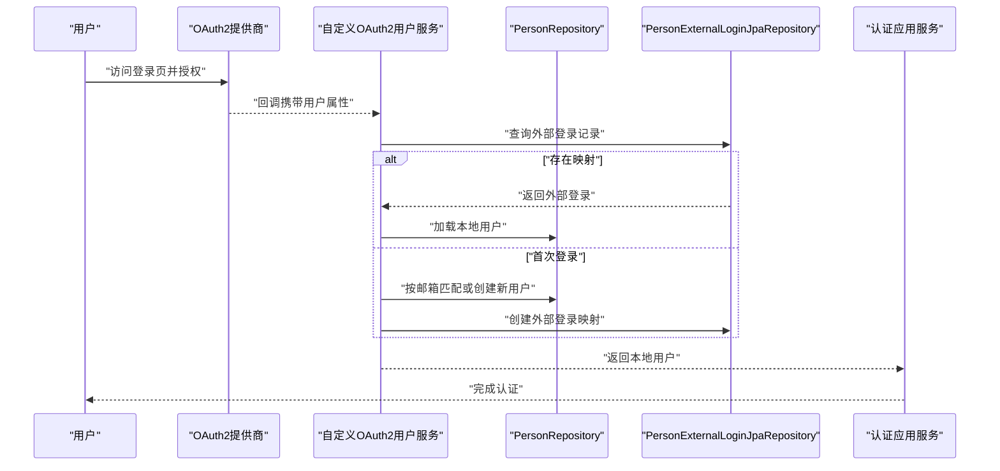
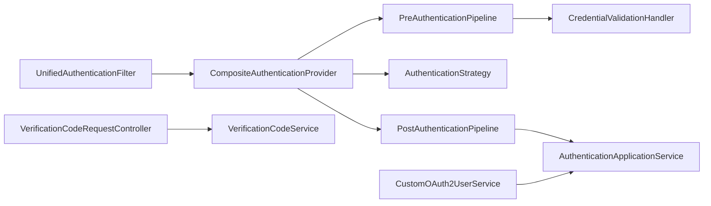

# 多因素认证

<cite>
**本文引用的文件**
- [VerificationCodeRequestController.java](file://iam-auth-server/src/main/java/iam/platform/auth/interfaces/rest/VerificationCodeRequestController.java)
- [VerificationCodeService.java](file://iam-auth-server/src/main/java/iam/platform/auth/domain/service/VerificationCodeService.java)
- [VerificationCodeServiceImpl.java](file://iam-auth-server/src/main/java/iam/platform/auth/domain/service/impl/VerificationCodeServiceImpl.java)
- [Password.java](file://iam-common/src/main/java/iam/platform/common/model/valueobject/Password.java)
- [AuthenticationCredentials.java](file://iam-auth-server/src/main/java/iam/platform/auth/domain/model/valueobject/AuthenticationCredentials.java)
- [UnifiedAuthenticationFilter.java](file://iam-auth-server/src/main/java/iam/platform/auth/infrastructure/security/UnifiedAuthenticationFilter.java)
- [CompositeAuthenticationProvider.java](file://iam-auth-server/src/main/java/iam/platform/auth/infrastructure/security/CompositeAuthenticationProvider.java)
- [PreAuthenticationPipeline.java](file://iam-auth-server/src/main/java/iam/platform/auth/application/service/pipeline/PreAuthenticationPipeline.java)
- [PostAuthenticationPipeline.java](file://iam-auth-server/src/main/java/iam/platform/auth/application/service/pipeline/PostAuthenticationPipeline.java)
- [CredentialValidationHandler.java](file://iam-auth-server/src/main/java/iam/platform/auth/application/service/pipeline/CredentialValidationHandler.java)
- [AuthenticationApplicationService.java](file://iam-auth-server/src/main/java/iam/platform/auth/application/service/AuthenticationApplicationService.java)
- [CustomOAuth2UserService.java](file://iam-auth-server/src/main/java/iam/platform/auth/infrastructure/security/CustomOAuth2UserService.java)
- [AuditLogEvent.java](file://iam-admin-server/src/main/java/iam/platform/admin/application/event/AuditLogEvent.java)
- [AuditLogAssembler.java](file://iam-admin-server/src/main/java/iam/platform/admin/application/assembler/AuditLogAssembler.java)
- [AuditLogRepository.java](file://iam-admin-server/src/main/java/iam/platform/admin/domain/repository/AuditLogRepository.java)
- [AuditLog.java](file://iam-admin-server/src/main/java/iam/platform/admin/domain/model/entity/AuditLog.java)
</cite>

## 目录
1. [简介](#简介)
2. [项目结构](#项目结构)
3. [核心组件](#核心组件)
4. [架构总览](#架构总览)
5. [详细组件分析](#详细组件分析)
6. [依赖分析](#依赖分析)
7. [性能考量](#性能考量)
8. [故障排查指南](#故障排查指南)
9. [结论](#结论)
10. [附录](#附录)

## 简介
本文件面向多因素认证（MFA）的实现与扩展，围绕以下主题展开：密码认证策略（含密码验证、盐值与哈希）、短信/邮箱验证码认证（生成、发送、校验、过期处理）、验证码服务设计（安全性与唯一性保障）、OAuth2 认证策略（第三方提供商集成、回调与用户信息获取）、认证策略扩展指南、用户体验优化、失败处理与安全审计最佳实践。内容基于仓库中实际代码进行梳理与可视化呈现。

## 项目结构
本项目采用多模块分层架构，认证相关能力主要集中在 iam-auth-server 模块，通用模型在 iam-common 模块，管理端审计在 iam-admin-server 模块。认证入口统一通过统一过滤器解析表单参数，路由到复合认证提供者，再由策略选择器分派至具体认证策略；验证码请求通过 REST 控制器进入验证码服务；OAuth2 登录由自定义用户服务完成第三方用户解析与本地账户映射。

图表来源
- [UnifiedAuthenticationFilter.java:18-80](file://iam-auth-server/src/main/java/iam/platform/auth/infrastructure/security/UnifiedAuthenticationFilter.java#L18-L80)
- [CompositeAuthenticationProvider.java:24-75](file://iam-auth-server/src/main/java/iam/platform/auth/infrastructure/security/CompositeAuthenticationProvider.java#L24-L75)
- [PreAuthenticationPipeline.java:14-61](file://iam-auth-server/src/main/java/iam/platform/auth/application/service/pipeline/PreAuthenticationPipeline.java#L14-L61)
- [CredentialValidationHandler.java:12-97](file://iam-auth-server/src/main/java/iam/platform/auth/application/service/pipeline/CredentialValidationHandler.java#L12-L97)
- [VerificationCodeRequestController.java:12-31](file://iam-auth-server/src/main/java/iam/platform/auth/interfaces/rest/VerificationCodeRequestController.java#L12-L31)
- [VerificationCodeService.java:5-21](file://iam-auth-server/src/main/java/iam/platform/auth/domain/service/VerificationCodeService.java#L5-L21)
- [PostAuthenticationPipeline.java:16-31](file://iam-auth-server/src/main/java/iam/platform/auth/application/service/pipeline/PostAuthenticationPipeline.java#L16-L31)
- [AuthenticationApplicationService.java:28-139](file://iam-auth-server/src/main/java/iam/platform/auth/application/service/AuthenticationApplicationService.java#L28-L139)
- [CustomOAuth2UserService.java:20-90](file://iam-auth-server/src/main/java/iam/platform/auth/infrastructure/security/CustomOAuth2UserService.java#L20-L90)

章节来源
- [UnifiedAuthenticationFilter.java:18-80](file://iam-auth-server/src/main/java/iam/platform/auth/infrastructure/security/UnifiedAuthenticationFilter.java#L18-L80)
- [CompositeAuthenticationProvider.java:24-75](file://iam-auth-server/src/main/java/iam/platform/auth/infrastructure/security/CompositeAuthenticationProvider.java#L24-L75)
- [PreAuthenticationPipeline.java:14-61](file://iam-auth-server/src/main/java/iam/platform/auth/application/service/pipeline/PreAuthenticationPipeline.java#L14-L61)
- [CredentialValidationHandler.java:12-97](file://iam-auth-server/src/main/java/iam/platform/auth/application/service/pipeline/CredentialValidationHandler.java#L12-L97)
- [VerificationCodeRequestController.java:12-31](file://iam-auth-server/src/main/java/iam/platform/auth/interfaces/rest/VerificationCodeRequestController.java#L12-L31)
- [VerificationCodeService.java:5-21](file://iam-auth-server/src/main/java/iam/platform/auth/domain/service/VerificationCodeService.java#L5-L21)
- [PostAuthenticationPipeline.java:16-31](file://iam-auth-server/src/main/java/iam/platform/auth/application/service/pipeline/PostAuthenticationPipeline.java#L16-L31)
- [AuthenticationApplicationService.java:28-139](file://iam-auth-server/src/main/java/iam/platform/auth/application/service/AuthenticationApplicationService.java#L28-L139)
- [CustomOAuth2UserService.java:20-90](file://iam-auth-server/src/main/java/iam/platform/auth/infrastructure/security/CustomOAuth2UserService.java#L20-L90)

## 核心组件
- 统一认证过滤器：解析表单参数，识别认证方法（密码/短信/邮箱/LDAP），封装为统一认证令牌，交由认证管理器处理。
- 复合认证提供者：执行预认证流水线，按凭证类型选择匹配的认证策略，调用策略执行认证，并在成功/失败时记录指标。
- 预认证流水线与凭证校验：对不同凭证类型进行格式与必填项校验，设置限流标识键，支持后续限流与锁定策略。
- 认证策略与验证码服务：策略接口负责具体认证逻辑；验证码服务接口定义短信/邮箱验证码的生成、发送、校验与用户查找/创建。
- 后认证流水线与认证应用服务：完成认证后的上下文装配（租户选择、权限加载、会话写入），输出统一认证结果。
- OAuth2 用户服务：从第三方属性中提取用户标识，尝试关联本地账户，不存在则创建新用户并建立外部登录映射。

章节来源
- [UnifiedAuthenticationFilter.java:31-78](file://iam-auth-server/src/main/java/iam/platform/auth/infrastructure/security/UnifiedAuthenticationFilter.java#L31-L78)
- [CompositeAuthenticationProvider.java:31-68](file://iam-auth-server/src/main/java/iam/platform/auth/infrastructure/security/CompositeAuthenticationProvider.java#L31-L68)
- [PreAuthenticationPipeline.java:26-60](file://iam-auth-server/src/main/java/iam/platform/auth/application/service/pipeline/PreAuthenticationPipeline.java#L26-L60)
- [CredentialValidationHandler.java:22-90](file://iam-auth-server/src/main/java/iam/platform/auth/application/service/pipeline/CredentialValidationHandler.java#L22-L90)
- [VerificationCodeService.java:5-21](file://iam-auth-server/src/main/java/iam/platform/auth/domain/service/VerificationCodeService.java#L5-L21)
- [PostAuthenticationPipeline.java:20-30](file://iam-auth-server/src/main/java/iam/platform/auth/application/service/pipeline/PostAuthenticationPipeline.java#L20-L30)
- [AuthenticationApplicationService.java:42-111](file://iam-auth-server/src/main/java/iam/platform/auth/application/service/AuthenticationApplicationService.java#L42-L111)
- [CustomOAuth2UserService.java:27-88](file://iam-auth-server/src/main/java/iam/platform/auth/infrastructure/security/CustomOAuth2UserService.java#L27-L88)

## 架构总览
下图展示统一认证入口到策略执行与后处理的整体流程，以及验证码请求与 OAuth2 登录的关键节点。

图表来源
- [UnifiedAuthenticationFilter.java:31-78](file://iam-auth-server/src/main/java/iam/platform/auth/infrastructure/security/UnifiedAuthenticationFilter.java#L31-L78)
- [CompositeAuthenticationProvider.java:31-68](file://iam-auth-server/src/main/java/iam/platform/auth/infrastructure/security/CompositeAuthenticationProvider.java#L31-L68)
- [PreAuthenticationPipeline.java:26-60](file://iam-auth-server/src/main/java/iam/platform/auth/application/service/pipeline/PreAuthenticationPipeline.java#L26-L60)
- [VerificationCodeRequestController.java:19-29](file://iam-auth-server/src/main/java/iam/platform/auth/interfaces/rest/VerificationCodeRequestController.java#L19-L29)
- [VerificationCodeService.java:5-21](file://iam-auth-server/src/main/java/iam/platform/auth/domain/service/VerificationCodeService.java#L5-L21)
- [CustomOAuth2UserService.java:27-49](file://iam-auth-server/src/main/java/iam/platform/auth/infrastructure/security/CustomOAuth2UserService.java#L27-L49)
- [AuthenticationApplicationService.java:42-111](file://iam-auth-server/src/main/java/iam/platform/auth/application/service/AuthenticationApplicationService.java#L42-L111)

## 详细组件分析

### 密码认证策略与密码模型
- 密码模型：以值对象形式封装密码哈希，提供从明文创建（带策略校验与哈希）、从存储哈希重建、以及与明文匹配的方法。策略校验包括长度、大小写字母、数字等要求。
- 密码验证流程：统一认证过滤器接收用户名/密码参数，封装为密码凭证；预认证流水线进行必填与格式校验；复合认证提供者选择密码策略执行认证；认证成功后进入后认证流水线。

图表来源
- [Password.java:17-89](file://iam-common/src/main/java/iam/platform/common/model/valueobject/Password.java#L17-L89)
- [AuthenticationCredentials.java:11-19](file://iam-auth-server/src/main/java/iam/platform/auth/domain/model/valueobject/AuthenticationCredentials.java#L11-L19)
- [CredentialValidationHandler.java:38-48](file://iam-auth-server/src/main/java/iam/platform/auth/application/service/pipeline/CredentialValidationHandler.java#L38-L48)
- [CompositeAuthenticationProvider.java:31-68](file://iam-auth-server/src/main/java/iam/platform/auth/infrastructure/security/CompositeAuthenticationProvider.java#L31-L68)

章节来源
- [Password.java:28-83](file://iam-common/src/main/java/iam/platform/common/model/valueobject/Password.java#L28-L83)
- [AuthenticationCredentials.java:11-19](file://iam-auth-server/src/main/java/iam/platform/auth/domain/model/valueobject/AuthenticationCredentials.java#L11-L19)
- [CredentialValidationHandler.java:38-48](file://iam-auth-server/src/main/java/iam/platform/auth/application/service/pipeline/CredentialValidationHandler.java#L38-L48)
- [CompositeAuthenticationProvider.java:31-68](file://iam-auth-server/src/main/java/iam/platform/auth/infrastructure/security/CompositeAuthenticationProvider.java#L31-L68)

### 短信验证码认证
- 凭证类型：短信验证码凭证包含手机号与验证码；预认证流水线对手机号格式与验证码必填进行校验，并设置限流标识键。
- 发送与校验：验证码请求控制器暴露短信验证码发送端点；验证码服务接口定义短信验证码发送与校验方法；策略实现负责与底层通道交互（生成、存储、下发、过期控制）。
- 用户查找：若未注册，可按手机号查找或创建用户。

图表来源
- [VerificationCodeRequestController.java:19-23](file://iam-auth-server/src/main/java/iam/platform/auth/interfaces/rest/VerificationCodeRequestController.java#L19-L23)
- [VerificationCodeService.java:7-14](file://iam-auth-server/src/main/java/iam/platform/auth/domain/service/VerificationCodeService.java#L7-L14)
- [CredentialValidationHandler.java:50-63](file://iam-auth-server/src/main/java/iam/platform/auth/application/service/pipeline/CredentialValidationHandler.java#L50-L63)
- [UnifiedAuthenticationFilter.java:48-55](file://iam-auth-server/src/main/java/iam/platform/auth/infrastructure/security/UnifiedAuthenticationFilter.java#L48-L55)
- [CompositeAuthenticationProvider.java:47-56](file://iam-auth-server/src/main/java/iam/platform/auth/infrastructure/security/CompositeAuthenticationProvider.java#L47-L56)

章节来源
- [VerificationCodeRequestController.java:19-23](file://iam-auth-server/src/main/java/iam/platform/auth/interfaces/rest/VerificationCodeRequestController.java#L19-L23)
- [VerificationCodeService.java:7-14](file://iam-auth-server/src/main/java/iam/platform/auth/domain/service/VerificationCodeService.java#L7-L14)
- [CredentialValidationHandler.java:50-63](file://iam-auth-server/src/main/java/iam/platform/auth/application/service/pipeline/CredentialValidationHandler.java#L50-L63)
- [UnifiedAuthenticationFilter.java:48-55](file://iam-auth-server/src/main/java/iam/platform/auth/infrastructure/security/UnifiedAuthenticationFilter.java#L48-L55)
- [CompositeAuthenticationProvider.java:47-56](file://iam-auth-server/src/main/java/iam/platform/auth/infrastructure/security/CompositeAuthenticationProvider.java#L47-L56)

### 邮箱验证码认证
- 凭证类型：邮箱验证码凭证包含邮箱与验证码；预认证流水线对邮箱格式与验证码必填进行校验，并设置限流标识键。
- 发送与校验：验证码请求控制器暴露邮箱验证码发送端点；验证码服务接口定义邮箱验证码发送与校验方法；策略实现负责与邮件通道交互（模板渲染、发送队列、过期控制）。
- 安全考虑：邮箱格式校验、验证码唯一性与一次性使用、过期时间控制、防刷机制（限流/锁定）。

图表来源
- [VerificationCodeRequestController.java:25-29](file://iam-auth-server/src/main/java/iam/platform/auth/interfaces/rest/VerificationCodeRequestController.java#L25-L29)
- [VerificationCodeService.java:9-14](file://iam-auth-server/src/main/java/iam/platform/auth/domain/service/VerificationCodeService.java#L9-L14)
- [CredentialValidationHandler.java:65-78](file://iam-auth-server/src/main/java/iam/platform/auth/application/service/pipeline/CredentialValidationHandler.java#L65-L78)
- [UnifiedAuthenticationFilter.java:54-55](file://iam-auth-server/src/main/java/iam/platform/auth/infrastructure/security/UnifiedAuthenticationFilter.java#L54-L55)
- [CompositeAuthenticationProvider.java:47-56](file://iam-auth-server/src/main/java/iam/platform/auth/infrastructure/security/CompositeAuthenticationProvider.java#L47-L56)

章节来源
- [VerificationCodeRequestController.java:25-29](file://iam-auth-server/src/main/java/iam/platform/auth/interfaces/rest/VerificationCodeRequestController.java#L25-L29)
- [VerificationCodeService.java:9-14](file://iam-auth-server/src/main/java/iam/platform/auth/domain/service/VerificationCodeService.java#L9-L14)
- [CredentialValidationHandler.java:65-78](file://iam-auth-server/src/main/java/iam/platform/auth/application/service/pipeline/CredentialValidationHandler.java#L65-L78)
- [UnifiedAuthenticationFilter.java:54-55](file://iam-auth-server/src/main/java/iam/platform/auth/infrastructure/security/UnifiedAuthenticationFilter.java#L54-L55)
- [CompositeAuthenticationProvider.java:47-56](file://iam-auth-server/src/main/java/iam/platform/auth/infrastructure/security/CompositeAuthenticationProvider.java#L47-L56)

### 验证码服务设计（安全性与唯一性）
- 接口职责：定义短信/邮箱验证码的发送与校验，以及按手机号/邮箱查找或创建用户的能力。
- 安全性保障建议（基于现有接口能力推导）：
  - 唯一性：验证码生成应具备高熵与唯一性，避免碰撞。
  - 一次性：验证码仅允许一次性使用，使用后立即失效。
  - 过期控制：设定合理有效期（如 5-10 分钟），过期即失效。
  - 防刷：结合预认证流水线中的限流与锁定策略，限制同一标识的发送频率与尝试次数。
  - 存储：验证码与关联标识、过期时间、状态等信息持久化，防止重放攻击。
- 实现位置：接口位于认证域服务层，具体实现位于实现类中（参考同包下实现文件路径）。

章节来源
- [VerificationCodeService.java:5-21](file://iam-auth-server/src/main/java/iam/platform/auth/domain/service/VerificationCodeService.java#L5-L21)

### OAuth2 认证策略
- 第三方集成：自定义 OAuth2 用户服务继承默认用户服务，从第三方属性中提取用户标识（如 unionId/openId/id），并根据 provider 与 providerUserId 关联本地 Person。
- 用户映射：优先通过外部登录记录定位本地用户，否则尝试通过邮箱匹配，仍失败则创建新用户并建立外部登录映射。
- 回调处理：统一认证成功处理器在认证完成后，将本地用户与权限、租户上下文装配，完成最终认证态。

图表来源
- [CustomOAuth2UserService.java:27-88](file://iam-auth-server/src/main/java/iam/platform/auth/infrastructure/security/CustomOAuth2UserService.java#L27-L88)
- [AuthenticationApplicationService.java:42-111](file://iam-auth-server/src/main/java/iam/platform/auth/application/service/AuthenticationApplicationService.java#L42-L111)

章节来源
- [CustomOAuth2UserService.java:27-88](file://iam-auth-server/src/main/java/iam/platform/auth/infrastructure/security/CustomOAuth2UserService.java#L27-L88)
- [AuthenticationApplicationService.java:42-111](file://iam-auth-server/src/main/java/iam/platform/auth/application/service/AuthenticationApplicationService.java#L42-L111)

### 认证策略扩展指南
- 新增认证方式步骤：
  1) 定义新的凭证类型：在认证凭证值对象中新增记录类型，包含必要字段与构造校验。
  2) 实现认证策略：实现认证策略接口，提供 supports(credentials) 与 authenticate(credentials) 方法。
  3) 注册策略：策略类需被 Spring 扫描并自动注入，复合认证提供者将自动发现并调度。
  4) 预校验：在预认证流水线中添加对应的凭证校验处理器，确保输入合法性与限流标识设置。
  5) 流水线编排：如需额外后处理（如审计、会话、租户选择），在后认证流水线中扩展相应处理器。
- 参考路径：
  - 凭证类型定义：[AuthenticationCredentials.java:9-59](file://iam-auth-server/src/main/java/iam/platform/auth/domain/model/valueobject/AuthenticationCredentials.java#L9-L59)
  - 策略接口：[CompositeAuthenticationProvider.java:24-75](file://iam-auth-server/src/main/java/iam/platform/auth/infrastructure/security/CompositeAuthenticationProvider.java#L24-L75)
  - 预校验处理器：[CredentialValidationHandler.java:12-97](file://iam-auth-server/src/main/java/iam/platform/auth/application/service/pipeline/CredentialValidationHandler.java#L12-L97)

章节来源
- [AuthenticationCredentials.java:9-59](file://iam-auth-server/src/main/java/iam/platform/auth/domain/model/valueobject/AuthenticationCredentials.java#L9-L59)
- [CompositeAuthenticationProvider.java:24-75](file://iam-auth-server/src/main/java/iam/platform/auth/infrastructure/security/CompositeAuthenticationProvider.java#L24-L75)
- [CredentialValidationHandler.java:12-97](file://iam-auth-server/src/main/java/iam/platform/auth/application/service/pipeline/CredentialValidationHandler.java#L12-L97)

### 用户体验优化、失败处理与安全审计
- 失败处理：预认证流水线在认证失败时记录失败事件（限流/锁定），成功时重置计数；统一认证失败处理器统一返回错误响应。
- 安全审计：后认证流水线可接入审计事件，记录认证结果、方法、时间、IP、用户标识等；管理端提供审计日志实体与仓储，便于追踪与合规。
- 用户体验：验证码发送与校验的明确提示、错误信息的友好化、登录态保持与租户选择的简化流程。

章节来源
- [PreAuthenticationPipeline.java:33-59](file://iam-auth-server/src/main/java/iam/platform/auth/application/service/pipeline/PreAuthenticationPipeline.java#L33-L59)
- [AuditLogEvent.java](file://iam-admin-server/src/main/java/iam/platform/admin/application/event/AuditLogEvent.java)
- [AuditLogAssembler.java](file://iam-admin-server/src/main/java/iam/platform/admin/application/assembler/AuditLogAssembler.java)
- [AuditLogRepository.java](file://iam-admin-server/src/main/java/iam/platform/admin/domain/repository/AuditLogRepository.java)
- [AuditLog.java](file://iam-admin-server/src/main/java/iam/platform/admin/domain/model/entity/AuditLog.java)

## 依赖分析
- 组件耦合：
  - 统一认证过滤器与复合认证提供者通过统一认证令牌解耦凭证类型与策略实现。
  - 预认证流水线与策略实现通过接口隔离，便于扩展与测试。
  - 验证码服务接口与实现分离，便于替换底层通道（短信/邮件）。
- 外部依赖：
  - OAuth2 用户服务依赖第三方属性映射与本地仓储。
  - 审计模块独立于认证核心，通过事件与装配器解耦。

图表来源
- [UnifiedAuthenticationFilter.java:18-80](file://iam-auth-server/src/main/java/iam/platform/auth/infrastructure/security/UnifiedAuthenticationFilter.java#L18-L80)
- [CompositeAuthenticationProvider.java:24-75](file://iam-auth-server/src/main/java/iam/platform/auth/infrastructure/security/CompositeAuthenticationProvider.java#L24-L75)
- [PreAuthenticationPipeline.java:14-61](file://iam-auth-server/src/main/java/iam/platform/auth/application/service/pipeline/PreAuthenticationPipeline.java#L14-L61)
- [CredentialValidationHandler.java:12-97](file://iam-auth-server/src/main/java/iam/platform/auth/application/service/pipeline/CredentialValidationHandler.java#L12-L97)
- [VerificationCodeRequestController.java:12-31](file://iam-auth-server/src/main/java/iam/platform/auth/interfaces/rest/VerificationCodeRequestController.java#L12-L31)
- [VerificationCodeService.java:5-21](file://iam-auth-server/src/main/java/iam/platform/auth/domain/service/VerificationCodeService.java#L5-L21)
- [PostAuthenticationPipeline.java:16-31](file://iam-auth-server/src/main/java/iam/platform/auth/application/service/pipeline/PostAuthenticationPipeline.java#L16-L31)
- [AuthenticationApplicationService.java:28-139](file://iam-auth-server/src/main/java/iam/platform/auth/application/service/AuthenticationApplicationService.java#L28-L139)
- [CustomOAuth2UserService.java:20-90](file://iam-auth-server/src/main/java/iam/platform/auth/infrastructure/security/CustomOAuth2UserService.java#L20-L90)

## 性能考量
- 预认证阶段尽早失败：通过格式校验与限流标识设置，减少无效认证请求对后端的压力。
- 并发与缓存：验证码存储与限流策略建议使用高性能缓存（如 Redis）以降低数据库压力。
- 异步发送：验证码发送建议异步化，避免阻塞认证主流程。
- 日志与监控：对认证成功率、失败率、耗时、限流触发等指标进行埋点，便于容量规划与问题定位。

## 故障排查指南
- 常见问题与定位：
  - 参数缺失：统一认证过滤器对必填参数进行校验，缺失时抛出凭据异常；检查表单 method 与对应字段是否正确传递。
  - 格式不合法：预认证流水线对手机号/邮箱进行正则校验，格式错误将直接失败；核对输入格式。
  - 未知认证方法：当 method 不在支持范围内时抛出异常；确认前端传参是否正确。
  - 认证失败：复合认证提供者在失败时记录失败事件；查看限流/锁定策略是否触发。
- 审计与追踪：通过审计事件与日志定位失败原因，结合租户上下文与会话信息复盘。

章节来源
- [UnifiedAuthenticationFilter.java:48-71](file://iam-auth-server/src/main/java/iam/platform/auth/infrastructure/security/UnifiedAuthenticationFilter.java#L48-L71)
- [CredentialValidationHandler.java:50-78](file://iam-auth-server/src/main/java/iam/platform/auth/application/service/pipeline/CredentialValidationHandler.java#L50-L78)
- [CompositeAuthenticationProvider.java:47-67](file://iam-auth-server/src/main/java/iam/platform/auth/infrastructure/security/CompositeAuthenticationProvider.java#L47-L67)

## 结论
本实现以统一过滤器与复合提供者为核心，结合预/后认证流水线，形成可扩展、可审计的认证体系。密码认证通过值对象封装哈希与策略校验；短信/邮箱验证码认证通过接口抽象与预校验保障安全；OAuth2 登录通过自定义用户服务实现第三方与本地账户的无缝衔接。通过策略扩展与流水线编排，可快速支持新的认证方式并满足 MFA 场景下的安全与体验需求。

## 附录
- 术语说明：
  - 凭证：用户提交的认证输入，如用户名/密码、手机号/验证码、邮箱/验证码等。
  - 统一认证令牌：封装凭证的认证对象，供认证管理器处理。
  - 预认证流水线：认证前的校验与风控环节集合。
  - 后认证流水线：认证后的上下文装配与结果产出集合。
- 参考文件路径（用于进一步阅读实现细节）：
  - [VerificationCodeServiceImpl.java](file://iam-auth-server/src/main/java/iam/platform/auth/domain/service/impl/VerificationCodeServiceImpl.java)
  - [UnifiedAuthenticationSuccessHandler.java](file://iam-auth-server/src/main/java/iam/platform/auth/infrastructure/security/UnifiedAuthenticationSuccessHandler.java)
  - [UnifiedAuthenticationFailureHandler.java](file://iam-auth-server/src/main/java/iam/platform/auth/infrastructure/security/UnifiedAuthenticationFailureHandler.java)
  - [RedisBasedRateLimiter.java](file://iam-auth-server/src/main/java/iam/platform/auth/infrastructure/security/RedisBasedRateLimiter.java)
  - [AccountLockoutManager.java](file://iam-auth-server/src/main/java/iam/platform/auth/infrastructure/security/AccountLockoutManager.java)