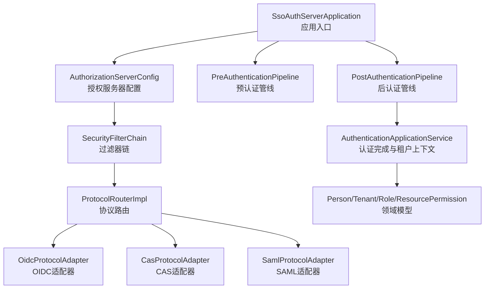
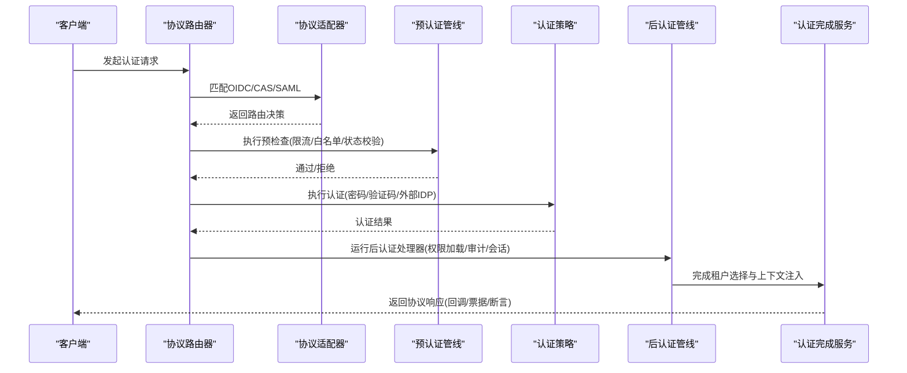
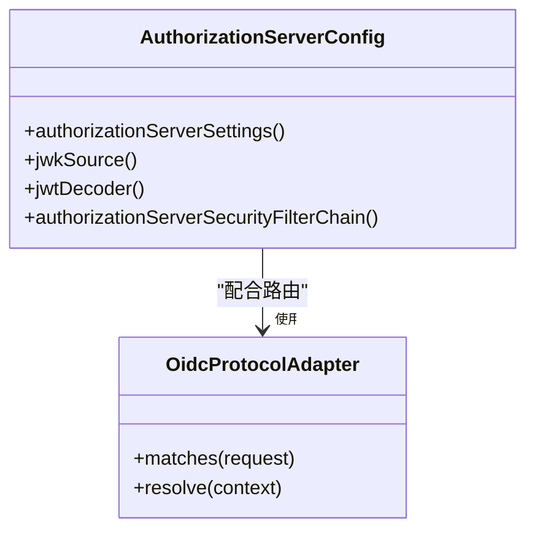
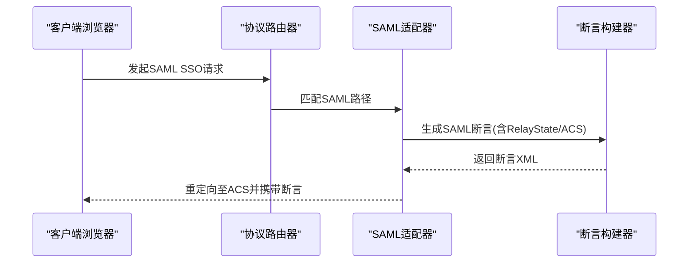
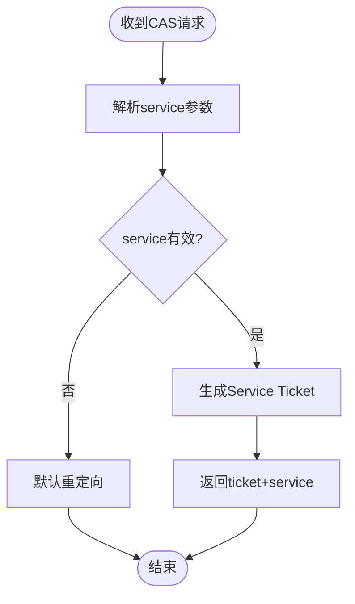
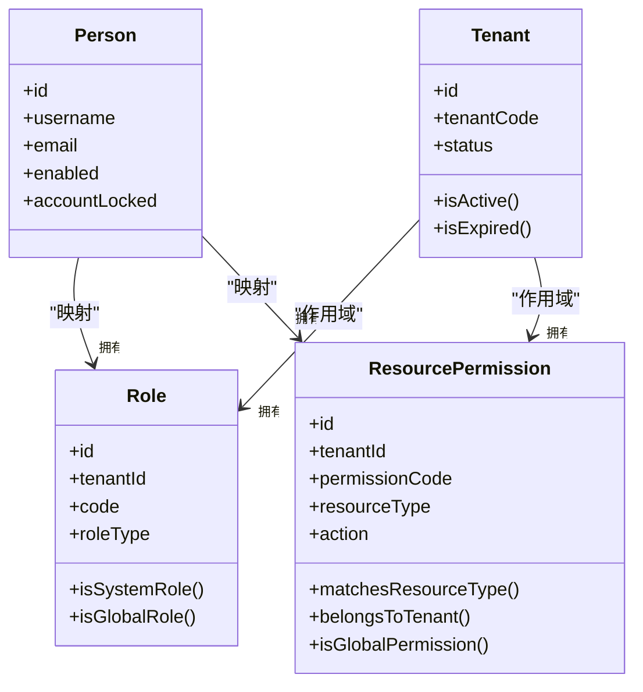
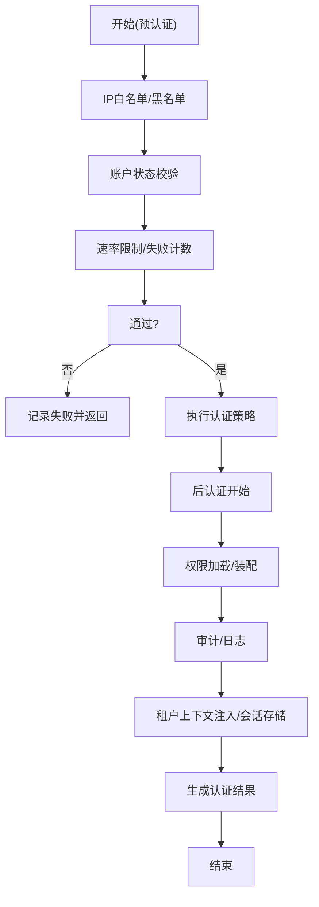
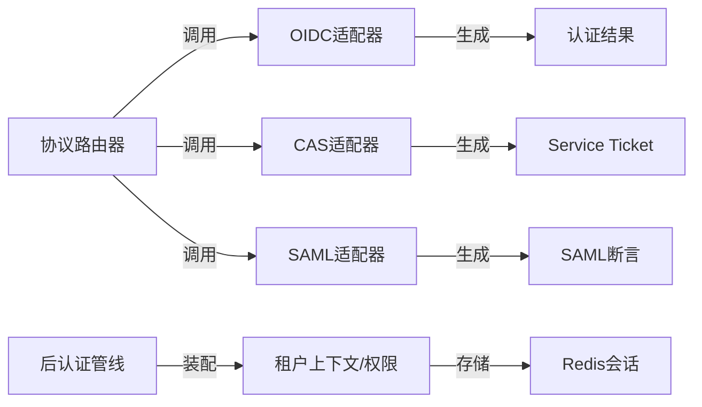

# 认证与授权

<cite>
**本文引用的文件**
- [SsoAuthServerApplication.java](file://iam-auth-server/src/main/java/iam/platform/auth/SsoAuthServerApplication.java)
- [AuthorizationServerConfig.java](file://iam-auth-server/src/main/java/iam/platform/auth/infrastructure/config/AuthorizationServerConfig.java)
- [ProtocolRouterImpl.java](file://iam-auth-server/src/main/java/iam/platform/auth/application/service/routing/ProtocolRouterImpl.java)
- [OidcProtocolAdapter.java](file://iam-auth-server/src/main/java/iam/platform/auth/application/service/routing/OidcProtocolAdapter.java)
- [CasProtocolAdapter.java](file://iam-auth-server/src/main/java/iam/platform/auth/application/service/routing/CasProtocolAdapter.java)
- [SamlProtocolAdapter.java](file://iam-auth-server/src/main/java/iam/platform/auth/application/service/routing/SamlProtocolAdapter.java)
- [PreAuthenticationPipeline.java](file://iam-auth-server/src/main/java/iam/platform/auth/application/service/pipeline/PreAuthenticationPipeline.java)
- [PostAuthenticationPipeline.java](file://iam-auth-server/src/main/java/iam/platform/auth/application/service/pipeline/PostAuthenticationPipeline.java)
- [AuthenticationApplicationService.java](file://iam-auth-server/src/main/java/iam/platform/auth/application/service/AuthenticationApplicationService.java)
- [Person.java](file://iam-auth-server/src/main/java/iam/platform/auth/domain/model/entity/Person.java)
- [Tenant.java](file://iam-auth-server/src/main/java/iam/platform/auth/domain/model/entity/Tenant.java)
- [Role.java](file://iam-auth-server/src/main/java/iam/platform/auth/domain/model/entity/Role.java)
- [ResourcePermission.java](file://iam-auth-server/src/main/java/iam/platform/auth/domain/model/entity/ResourcePermission.java)
- [application.yml](file://iam-auth-server/src/main/resources/application.yml)
</cite>

## 目录
1. [引言](#引言)
2. [项目结构](#项目结构)
3. [核心组件](#核心组件)
4. [架构总览](#架构总览)
5. [详细组件分析](#详细组件分析)
6. [依赖分析](#依赖分析)
7. [性能考虑](#性能考虑)
8. [故障排查指南](#故障排查指南)
9. [结论](#结论)
10. [附录：集成与配置指引](#附录集成与配置指引)

## 引言
本文件面向IAM平台的认证与授权机制，系统化梳理OAuth2.0与OpenID Connect协议实现、SAML协议支持、CAS单点登录、LDAP集成、RBAC权限模型、认证管道设计、令牌管理与生命周期、以及多客户端集成策略。文档以代码为依据，辅以图示帮助读者快速理解系统设计与实现要点。

## 项目结构
IAM平台采用多模块分层架构，认证与授权相关能力集中在认证服务模块（iam-auth-server），并通过统一的过滤器链、路由适配器、认证管线与领域模型协同工作。认证服务通过Spring Boot启动，启用JPA与Redis，并加载安全配置与协议适配器。

图表来源
- [SsoAuthServerApplication.java:1-19](file://iam-auth-server/src/main/java/iam/platform/auth/SsoAuthServerApplication.java#L1-L19)
- [AuthorizationServerConfig.java:44-64](file://iam-auth-server/src/main/java/iam/platform/auth/infrastructure/config/AuthorizationServerConfig.java#L44-L64)
- [ProtocolRouterImpl.java:24-50](file://iam-auth-server/src/main/java/iam/platform/auth/application/service/routing/ProtocolRouterImpl.java#L24-L50)
- [OidcProtocolAdapter.java:14-38](file://iam-auth-server/src/main/java/iam/platform/auth/application/service/routing/OidcProtocolAdapter.java#L14-L38)
- [CasProtocolAdapter.java:27-49](file://iam-auth-server/src/main/java/iam/platform/auth/application/service/routing/CasProtocolAdapter.java#L27-L49)
- [SamlProtocolAdapter.java:25-44](file://iam-auth-server/src/main/java/iam/platform/auth/application/service/routing/SamlProtocolAdapter.java#L25-L44)
- [PreAuthenticationPipeline.java:26-31](file://iam-auth-server/src/main/java/iam/platform/auth/application/service/pipeline/PreAuthenticationPipeline.java#L26-L31)
- [PostAuthenticationPipeline.java:22-29](file://iam-auth-server/src/main/java/iam/platform/auth/application/service/pipeline/PostAuthenticationPipeline.java#L22-L29)
- [AuthenticationApplicationService.java:42-44](file://iam-auth-server/src/main/java/iam/platform/auth/application/service/AuthenticationApplicationService.java#L42-L44)

章节来源
- [SsoAuthServerApplication.java:1-19](file://iam-auth-server/src/main/java/iam/platform/auth/SsoAuthServerApplication.java#L1-L19)
- [application.yml:10-144](file://iam-auth-server/src/main/resources/application.yml#L10-L144)

## 核心组件
- 授权服务器配置：定义OAuth2/OIDC过滤器链、JWT解码器、JWK源与发行者URI，集成租户感知过滤器。
- 协议路由与适配：根据请求来源自动识别OIDC、CAS、SAML流程，分别生成回调或断言。
- 预/后认证管线：在认证前后执行一系列策略（速率限制、账户锁定、审计、权限加载、会话建立等）。
- 领域模型：Person、Tenant、Role、ResourcePermission构成RBAC与租户上下文基础。
- 认证完成服务：完成租户选择、权限装配、上下文注入与会话存储。

章节来源
- [AuthorizationServerConfig.java:44-99](file://iam-auth-server/src/main/java/iam/platform/auth/infrastructure/config/AuthorizationServerConfig.java#L44-L99)
- [ProtocolRouterImpl.java:24-50](file://iam-auth-server/src/main/java/iam/platform/auth/application/service/routing/ProtocolRouterImpl.java#L24-L50)
- [PreAuthenticationPipeline.java:26-60](file://iam-auth-server/src/main/java/iam/platform/auth/application/service/pipeline/PreAuthenticationPipeline.java#L26-L60)
- [PostAuthenticationPipeline.java:22-29](file://iam-auth-server/src/main/java/iam/platform/auth/application/service/pipeline/PostAuthenticationPipeline.java#L22-L29)
- [AuthenticationApplicationService.java:42-111](file://iam-auth-server/src/main/java/iam/platform/auth/application/service/AuthenticationApplicationService.java#L42-L111)
- [Person.java:17-158](file://iam-auth-server/src/main/java/iam/platform/auth/domain/model/entity/Person.java#L17-L158)
- [Tenant.java:16-117](file://iam-auth-server/src/main/java/iam/platform/auth/domain/model/entity/Tenant.java#L16-L117)
- [Role.java:16-83](file://iam-auth-server/src/main/java/iam/platform/auth/domain/model/entity/Role.java#L16-L83)
- [ResourcePermission.java:16-77](file://iam-auth-server/src/main/java/iam/platform/auth/domain/model/entity/ResourcePermission.java#L16-L77)

## 架构总览
下图展示认证服务的整体交互：客户端发起认证请求，经由协议适配器识别协议类型，进入预认证与认证策略执行，随后进入后认证管线完成权限装配与租户上下文建立，最终返回协议特定的响应（OIDC回调、CAS票据、SAML断言）。

图表来源
- [ProtocolRouterImpl.java:24-50](file://iam-auth-server/src/main/java/iam/platform/auth/application/service/routing/ProtocolRouterImpl.java#L24-L50)
- [OidcProtocolAdapter.java:14-38](file://iam-auth-server/src/main/java/iam/platform/auth/application/service/routing/OidcProtocolAdapter.java#L14-L38)
- [CasProtocolAdapter.java:27-49](file://iam-auth-server/src/main/java/iam/platform/auth/application/service/routing/CasProtocolAdapter.java#L27-L49)
- [SamlProtocolAdapter.java:25-44](file://iam-auth-server/src/main/java/iam/platform/auth/application/service/routing/SamlProtocolAdapter.java#L25-L44)
- [PreAuthenticationPipeline.java:26-31](file://iam-auth-server/src/main/java/iam/platform/auth/application/service/pipeline/PreAuthenticationPipeline.java#L26-L31)
- [PostAuthenticationPipeline.java:22-29](file://iam-auth-server/src/main/java/iam/platform/auth/application/service/pipeline/PostAuthenticationPipeline.java#L22-L29)
- [AuthenticationApplicationService.java:42-111](file://iam-auth-server/src/main/java/iam/platform/auth/application/service/AuthenticationApplicationService.java#L42-L111)

## 详细组件分析

### OAuth2.0与OpenID Connect实现
- 授权服务器配置：启用默认安全配置与OIDC扩展，设置登录入口、资源服务器JWT解码器，并注入租户感知过滤器，确保多租户上下文贯穿认证流程。
- OIDC适配器：基于Referer与回调路径判断授权码流程来源，恢复原始请求URL进行重定向，或回退到默认重定向。
- JWT/JWK：从PEM文件加载RSA密钥对，生成JWK Set并计算稳定KeyID，保证重启后JWKS缓存可用性。

图表来源
- [AuthorizationServerConfig.java:44-99](file://iam-auth-server/src/main/java/iam/platform/auth/infrastructure/config/AuthorizationServerConfig.java#L44-L99)
- [OidcProtocolAdapter.java:14-38](file://iam-auth-server/src/main/java/iam/platform/auth/application/service/routing/OidcProtocolAdapter.java#L14-L38)

章节来源
- [AuthorizationServerConfig.java:44-99](file://iam-auth-server/src/main/java/iam/platform/auth/infrastructure/config/AuthorizationServerConfig.java#L44-L99)
- [OidcProtocolAdapter.java:14-38](file://iam-auth-server/src/main/java/iam/platform/auth/application/service/routing/OidcProtocolAdapter.java#L14-L38)

### SAML协议支持
- 协议适配器：检测SAML相关路径，从上下文提取ACS地址与RelayState，调用断言构建器生成SAML Assertion，返回给客户端。
- 断言构建：基于认证结果与目标ACS生成断言，RelayState用于会话关联。

图表来源
- [SamlProtocolAdapter.java:19-45](file://iam-auth-server/src/main/java/iam/platform/auth/application/service/routing/SamlProtocolAdapter.java#L19-L45)

章节来源
- [SamlProtocolAdapter.java:19-45](file://iam-auth-server/src/main/java/iam/platform/auth/application/service/routing/SamlProtocolAdapter.java#L19-L45)

### CAS单点登录实现
- 协议适配器：检测CAS路径，从保存请求中解析service参数，生成Service Ticket并返回给客户端。
- 配置项：支持服务端URL、票据有效期、前缀、单点注销开关、前后端通道注销、超时与全量注销策略。

图表来源
- [CasProtocolAdapter.java:27-78](file://iam-auth-server/src/main/java/iam/platform/auth/application/service/routing/CasProtocolAdapter.java#L27-L78)

章节来源
- [CasProtocolAdapter.java:27-78](file://iam-auth-server/src/main/java/iam/platform/auth/application/service/routing/CasProtocolAdapter.java#L27-L78)
- [application.yml:115-127](file://iam-auth-server/src/main/resources/application.yml#L115-L127)

### LDAP集成方案
- 配置项：支持开启LDAP、服务器地址、基础DN、绑定DN/密码、用户搜索基与过滤器、是否使用SSL等。
- 应用场景：可作为认证策略的一部分，结合认证管线实现域账号登录。

章节来源
- [application.yml:104-114](file://iam-auth-server/src/main/resources/application.yml#L104-L114)

### RBAC权限模型设计与实现
- 角色与权限：Role与ResourcePermission实体描述角色与资源权限，支持全局与租户级权限；权限编码采用“资源:动作”规范。
- 用户权限装配：认证完成后，按租户账户加载权限集合，装配为Spring Security的授权信息，注入租户上下文。

图表来源
- [Person.java:17-158](file://iam-auth-server/src/main/java/iam/platform/auth/domain/model/entity/Person.java#L17-L158)
- [Tenant.java:16-117](file://iam-auth-server/src/main/java/iam/platform/auth/domain/model/entity/Tenant.java#L16-L117)
- [Role.java:16-83](file://iam-auth-server/src/main/java/iam/platform/auth/domain/model/entity/Role.java#L16-L83)
- [ResourcePermission.java:16-77](file://iam-auth-server/src/main/java/iam/platform/auth/domain/model/entity/ResourcePermission.java#L16-L77)

章节来源
- [Role.java:16-83](file://iam-auth-server/src/main/java/iam/platform/auth/domain/model/entity/Role.java#L16-L83)
- [ResourcePermission.java:16-77](file://iam-auth-server/src/main/java/iam/platform/auth/domain/model/entity/ResourcePermission.java#L16-L77)
- [AuthenticationApplicationService.java:77-86](file://iam-auth-server/src/main/java/iam/platform/auth/application/service/AuthenticationApplicationService.java#L77-L86)

### 认证管道设计（预认证与后认证）
- 预认证：按顺序执行各处理器，包括IP白名单、账户状态校验、速率限制、失败/成功计数记录等。
- 后认证：按顺序执行处理器，装配权限、写入审计、建立租户上下文与会话、生成认证结果。

图表来源
- [PreAuthenticationPipeline.java:26-60](file://iam-auth-server/src/main/java/iam/platform/auth/application/service/pipeline/PreAuthenticationPipeline.java#L26-L60)
- [PostAuthenticationPipeline.java:22-29](file://iam-auth-server/src/main/java/iam/platform/auth/application/service/pipeline/PostAuthenticationPipeline.java#L22-L29)

章节来源
- [PreAuthenticationPipeline.java:26-60](file://iam-auth-server/src/main/java/iam/platform/auth/application/service/pipeline/PreAuthenticationPipeline.java#L26-L60)
- [PostAuthenticationPipeline.java:22-29](file://iam-auth-server/src/main/java/iam/platform/auth/application/service/pipeline/PostAuthenticationPipeline.java#L22-L29)

### 令牌管理机制（JWT/JWK）
- JWK与KeyID：从PEM读取RSA密钥，生成JWK Set并以公钥哈希生成稳定KeyID，避免重启导致JWKS缓存失效。
- 发行者URI：配置issuer，供客户端发现与验证。
- 过滤器链：启用OAuth2资源服务器与JWT解码器，拦截受保护资源访问。

章节来源
- [AuthorizationServerConfig.java:67-99](file://iam-auth-server/src/main/java/iam/platform/auth/infrastructure/config/AuthorizationServerConfig.java#L67-L99)
- [application.yml:81-88](file://iam-auth-server/src/main/resources/application.yml#L81-L88)

### 多种认证策略
- 密码认证：完成租户选择后，装配权限并建立租户感知认证令牌。
- 验证码登录：配置邮件/短信提供商，结合认证管线与路由完成登录。
- 外部IDP：示例配置钉钉授权码流程，支持第三方登录。

章节来源
- [AuthenticationApplicationService.java:42-111](file://iam-auth-server/src/main/java/iam/platform/auth/application/service/AuthenticationApplicationService.java#L42-L111)
- [application.yml:72-80](file://iam-auth-server/src/main/resources/application.yml#L72-L80)
- [application.yml:54-71](file://iam-auth-server/src/main/resources/application.yml#L54-L71)

## 依赖分析
- 组件耦合：协议适配器依赖认证结果与上下文；路由器聚合多个适配器；后认证管线依赖认证完成服务与权限加载服务；领域模型被认证与权限装配使用。
- 外部依赖：JPA仓库、Redis会话存储、数据库连接池、JWK密钥文件、LDAP服务器、CAS服务端等。

图表来源
- [ProtocolRouterImpl.java:24-50](file://iam-auth-server/src/main/java/iam/platform/auth/application/service/routing/ProtocolRouterImpl.java#L24-L50)
- [OidcProtocolAdapter.java:27-38](file://iam-auth-server/src/main/java/iam/platform/auth/application/service/routing/OidcProtocolAdapter.java#L27-L38)
- [CasProtocolAdapter.java:45-49](file://iam-auth-server/src/main/java/iam/platform/auth/application/service/routing/CasProtocolAdapter.java#L45-L49)
- [SamlProtocolAdapter.java:40-44](file://iam-auth-server/src/main/java/iam/platform/auth/application/service/routing/SamlProtocolAdapter.java#L40-L44)
- [PostAuthenticationPipeline.java:22-29](file://iam-auth-server/src/main/java/iam/platform/auth/application/service/pipeline/PostAuthenticationPipeline.java#L22-L29)

## 性能考虑
- 连接池与超时：数据库连接池最大并发与超时配置，避免高并发下的连接争用。
- Redis会话：使用Redis存储会话，降低内存占用与横向扩展成本。
- 限流与锁定：预认证阶段的速率限制与账户锁定阈值，防止暴力破解与滥用。
- JWKS稳定性：KeyID基于公钥指纹生成，减少重启导致的JWKS变更。

章节来源
- [application.yml:19-25](file://iam-auth-server/src/main/resources/application.yml#L19-L25)
- [application.yml:34-53](file://iam-auth-server/src/main/resources/application.yml#L34-L53)
- [application.yml:93-102](file://iam-auth-server/src/main/resources/application.yml#L93-L102)
- [AuthorizationServerConfig.java:117-128](file://iam-auth-server/src/main/java/iam/platform/auth/infrastructure/config/AuthorizationServerConfig.java#L117-L128)

## 故障排查指南
- 登录入口未生效：确认过滤器链已启用，默认HTML登录入口指向登录页。
- OIDC回调异常：检查保存请求与回调路径匹配逻辑，确保Referer或回调URI正确。
- CAS票据为空：核对service参数解析与认证结果非空。
- SAML断言缺失：确认ACS地址与RelayState来源，检查断言构建器输出。
- 租户选择失败：确认当前用户与租户账户归属一致且账户/租户处于激活状态。
- 速率限制误伤：调整窗口与阈值，必要时加入IP白名单。
- LDAP无法登录：核对LDAP配置项与网络连通性。

章节来源
- [AuthorizationServerConfig.java:53-57](file://iam-auth-server/src/main/java/iam/platform/auth/infrastructure/config/AuthorizationServerConfig.java#L53-L57)
- [OidcProtocolAdapter.java:20-24](file://iam-auth-server/src/main/java/iam/platform/auth/application/service/routing/OidcProtocolAdapter.java#L20-L24)
- [CasProtocolAdapter.java:35-43](file://iam-auth-server/src/main/java/iam/platform/auth/application/service/routing/CasProtocolAdapter.java#L35-L43)
- [SamlProtocolAdapter.java:30-33](file://iam-auth-server/src/main/java/iam/platform/auth/application/service/routing/SamlProtocolAdapter.java#L30-L33)
- [AuthenticationApplicationService.java:61-75](file://iam-auth-server/src/main/java/iam/platform/auth/application/service/AuthenticationApplicationService.java#L61-L75)
- [application.yml:93-102](file://iam-auth-server/src/main/resources/application.yml#L93-L102)
- [application.yml:104-114](file://iam-auth-server/src/main/resources/application.yml#L104-L114)

## 结论
该IAM平台以Spring Authorization Server为核心，结合自研协议适配器与认证管线，实现了OAuth2/OIDC、SAML、CAS的统一接入，并通过RBAC模型与租户上下文保障权限隔离与可扩展性。JWT/JWK机制与稳定KeyID策略提升了令牌系统的可靠性。配合限流、锁定与审计等安全策略，满足多客户端场景的安全与性能需求。

## 附录：集成与配置指引
- Web应用（OIDC授权码）：配置客户端注册与回调URI，使用OIDC适配器自动识别授权码流程并重定向。
- 移动应用（OIDC授权码/客户端凭证）：根据实际场景选择授权方式，确保scope与回调配置正确。
- 第三方系统（SAML/CAS）：按适配器要求提供ACS/Service参数，认证完成后接收断言或票据。
- 安全最佳实践：启用HTTPS、合理设置JWT发行者、定期轮换密钥、启用审计与监控、限制IP白名单、配置LDAP与CAS服务端参数。

章节来源
- [application.yml:54-80](file://iam-auth-server/src/main/resources/application.yml#L54-L80)
- [application.yml:104-127](file://iam-auth-server/src/main/resources/application.yml#L104-L127)
- [OidcProtocolAdapter.java:14-38](file://iam-auth-server/src/main/java/iam/platform/auth/application/service/routing/OidcProtocolAdapter.java#L14-L38)
- [SamlProtocolAdapter.java:19-45](file://iam-auth-server/src/main/java/iam/platform/auth/application/service/routing/SamlProtocolAdapter.java#L19-L45)
- [CasProtocolAdapter.java:27-78](file://iam-auth-server/src/main/java/iam/platform/auth/application/service/routing/CasProtocolAdapter.java#L27-L78)