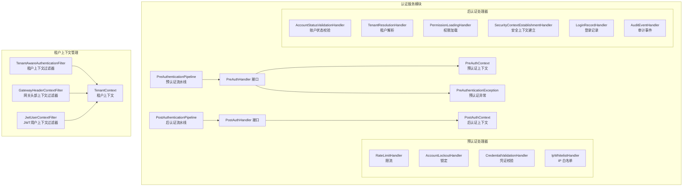
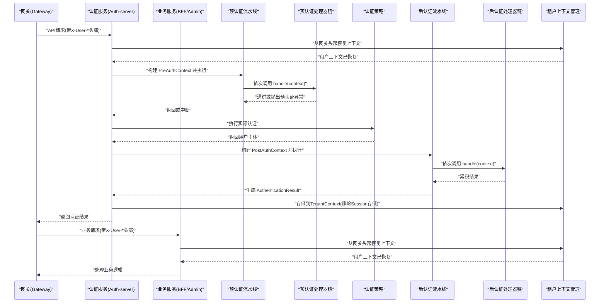
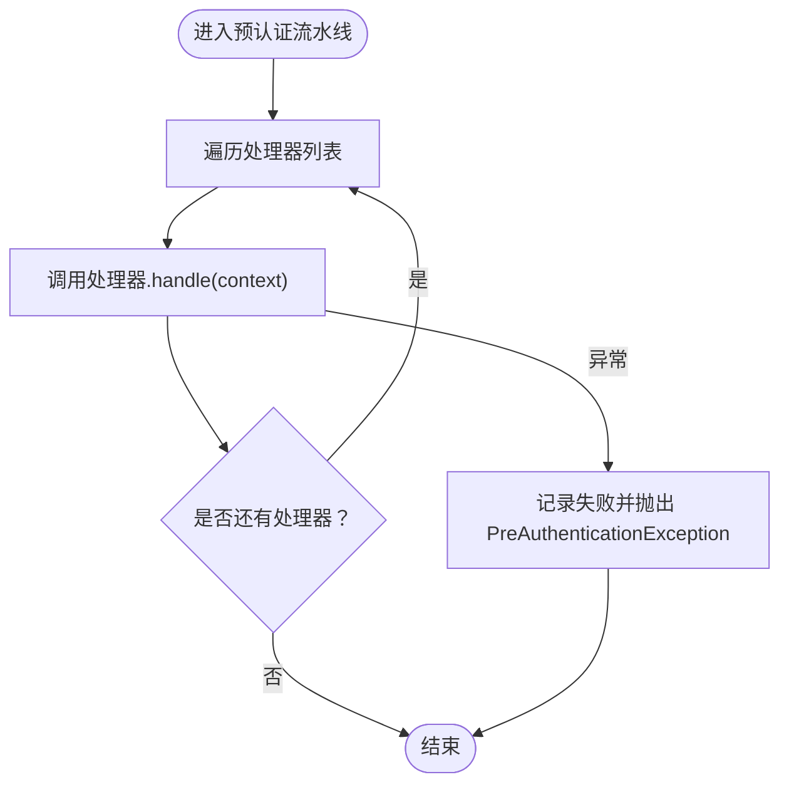
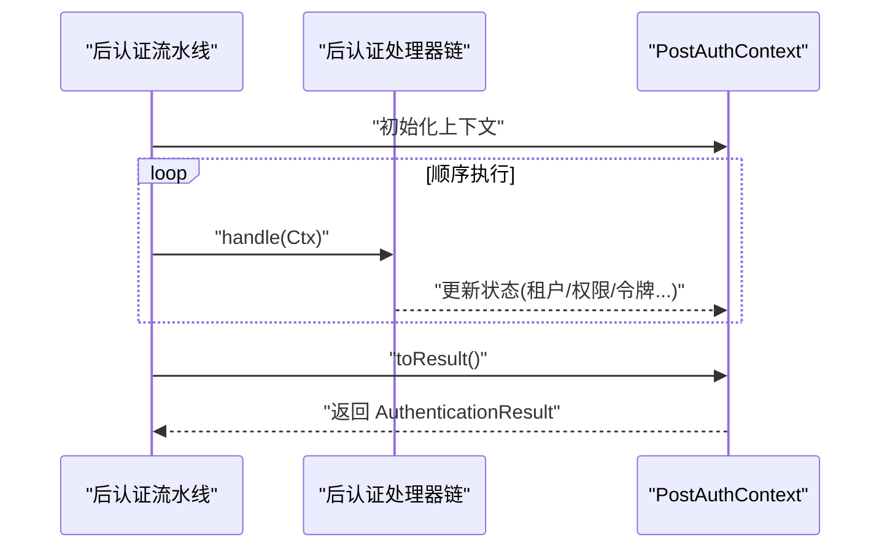
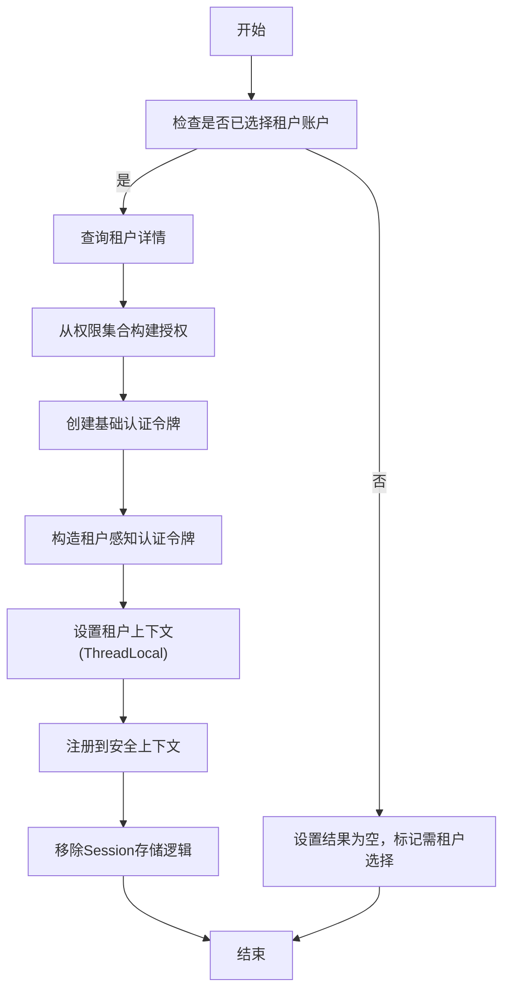
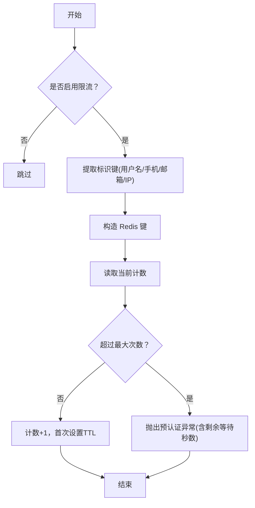
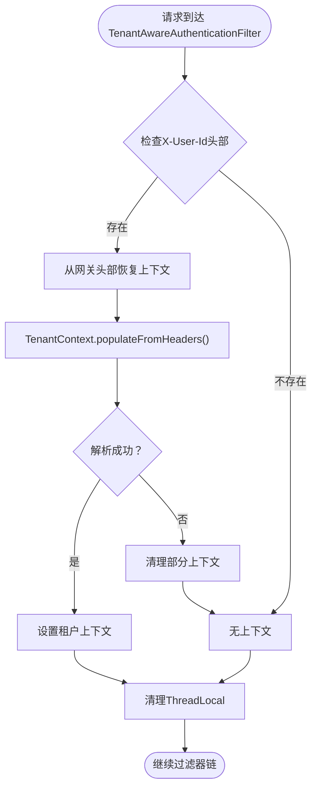
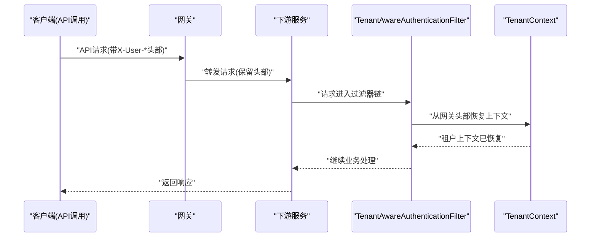
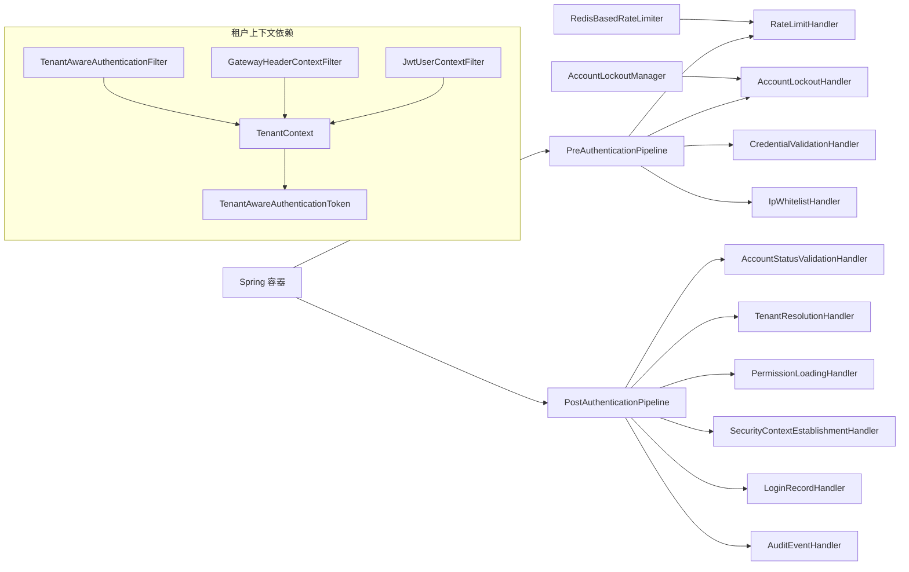

# 认证管道

<cite>
**本文引用的文件**
- [PreAuthenticationPipeline.java](file://iam-auth-server/src/main/java/iam/platform/auth/application/service/pipeline/PreAuthenticationPipeline.java)
- [PostAuthenticationPipeline.java](file://iam-auth-server/src/main/java/iam/platform/auth/application/service/pipeline/PostAuthenticationPipeline.java)
- [PreAuthHandler.java](file://iam-auth-server/src/main/java/iam/platform/auth/application/service/pipeline/PreAuthHandler.java)
- [PostAuthHandler.java](file://iam-auth-server/src/main/java/iam/platform/auth/application/service/pipeline/PostAuthHandler.java)
- [PreAuthContext.java](file://iam-auth-server/src/main/java/iam/platform/auth/application/service/pipeline/PreAuthContext.java)
- [PostAuthContext.java](file://iam-auth-server/src/main/java/iam/platform/auth/application/service/pipeline/PostAuthContext.java)
- [PreAuthenticationException.java](file://iam-auth-server/src/main/java/iam/platform/auth/application/service/pipeline/PreAuthenticationException.java)
- [IpWhitelistHandler.java](file://iam-auth-server/src/main/java/iam/platform/auth/application/service/pipeline/IpWhitelistHandler.java)
- [RateLimitHandler.java](file://iam-auth-server/src/main/java/iam/platform/auth/application/service/pipeline/RateLimitHandler.java)
- [AccountLockoutHandler.java](file://iam-auth-server/src/main/java/iam/platform/auth/application/service/pipeline/AccountLockoutHandler.java)
- [CredentialValidationHandler.java](file://iam-auth-server/src/main/java/iam/platform/auth/application/service/pipeline/CredentialValidationHandler.java)
- [SecurityContextEstablishmentHandler.java](file://iam-auth-server/src/main/java/iam/platform/auth/application/service/pipeline/SecurityContextEstablishmentHandler.java)
- [TenantResolutionHandler.java](file://iam-auth-server/src/main/java/iam/platform/auth/application/service/pipeline/TenantResolutionHandler.java)
- [AccountStatusValidationHandler.java](file://iam-auth-server/src/main/java/iam/platform/auth/application/service/pipeline/AccountStatusValidationHandler.java)
- [LoginRecordHandler.java](file://iam-auth-server/src/main/java/iam/platform/auth/application/service/pipeline/LoginRecordHandler.java)
- [PermissionLoadingHandler.java](file://iam-auth-server/src/main/java/iam/platform/auth/application/service/pipeline/PermissionLoadingHandler.java)
- [AuditEventHandler.java](file://iam-auth-server/src/main/java/iam/platform/auth/application/service/pipeline/AuditEventHandler.java)
- [RedisBasedRateLimiter.java](file://iam-auth-server/src/main/java/iam/platform/auth/infrastructure/security/RedisBasedRateLimiter.java)
- [TenantAwareAuthenticationFilter.java](file://iam-auth-server/src/main/java/iam/platform/auth/interfaces/web/filter/TenantAwareAuthenticationFilter.java)
- [TenantContext.java](file://iam-common/src/main/java/iam/platform/common/context/TenantContext.java)
- [GatewayHeaderContextFilter.java](file://iam-common/src/main/java/iam/platform/common/context/GatewayHeaderContextFilter.java)
- [AdminGatewayHeaderFilter.java](file://iam-admin-server/src/main/java/iam/platform/admin/infrastructure/filter/AdminGatewayHeaderFilter.java)
- [BffGatewayHeaderFilter.java](file://iam-bff-server/src/main/java/iam/platform/bff/infrastructure/filter/BffGatewayHeaderFilter.java)
- [JwtUserContextFilter.java](file://iam-admin-server/src/main/java/iam/platform/admin/infrastructure/security/JwtUserContextFilter.java)
</cite>

## 更新摘要
**变更内容**
- 移除了 TenantAwareAuthenticationFilter 中的 Session 恢复逻辑，简化了租户上下文管理流程
- 明确了 Session 仅用于 OAuth2 SavedRequest 和 CAS SLO 场景
- 强化了网关头部上下文的优先处理机制
- 完善了租户上下文的容错处理和内存清理机制

## 目录
1. [简介](#简介)
2. [项目结构](#项目结构)
3. [核心组件](#核心组件)
4. [架构总览](#架构总览)
5. [详细组件分析](#详细组件分析)
6. [租户上下文管理](#租户上下文管理)
7. [API优先认证流程](#api优先认证流程)
8. [依赖分析](#依赖分析)
9. [性能考虑](#性能考虑)
10. [故障排查指南](#故障排查指南)
11. [结论](#结论)
12. [附录：扩展开发指南](#附录扩展开发指南)

## 简介
本文件系统性阐述认证管道的设计与实现，覆盖预认证与后认证两条流水线。预认证阶段负责请求验证、参数解析与上下文建立，后认证阶段完成结果封装、会话与租户上下文建立、权限加载、审计与登录记录等。文档同时给出可插拔处理器的实现模式、安全上下文建立处理器的作用与最佳实践，并提供扩展开发指南与性能监控建议。

**更新** 本次更新重点移除了 TenantAwareAuthenticationFilter 中的 Session 恢复逻辑，简化了租户上下文管理流程，明确了 Session 仅用于 OAuth2 SavedRequest 和 CAS SLO 场景，强化了网关头部上下文的优先处理机制。

## 项目结构
认证管道位于认证服务模块中，采用"接口 + 上下文 + 处理器"的分层设计，通过 Spring 自动发现处理器并按顺序执行，保证扩展性与可维护性。新增的租户上下文管理组件提供了统一的跨服务租户信息传递机制。



**图表来源**
- [TenantAwareAuthenticationFilter.java:1-57](file://iam-auth-server/src/main/java/iam/platform/auth/interfaces/web/filter/TenantAwareAuthenticationFilter.java#L1-L57)
- [GatewayHeaderContextFilter.java:1-50](file://iam-common/src/main/java/iam/platform/common/context/GatewayHeaderContextFilter.java#L1-L50)
- [TenantContext.java:1-113](file://iam-common/src/main/java/iam/platform/common/context/TenantContext.java#L1-L113)
- [JwtUserContextFilter.java:1-97](file://iam-admin-server/src/main/java/iam/platform/admin/infrastructure/security/JwtUserContextFilter.java#L1-L97)

**章节来源**
- [PreAuthenticationPipeline.java:1-61](file://iam-auth-server/src/main/java/iam/platform/auth/application/service/pipeline/PreAuthenticationPipeline.java#L1-L61)
- [PostAuthenticationPipeline.java:1-31](file://iam-auth-server/src/main/java/iam/platform/auth/application/service/pipeline/PostAuthenticationPipeline.java#L1-L31)

## 核心组件
- 预认证流水线：顺序执行所有 PreAuthHandler，支持失败/成功计数记录，便于限流与锁定联动。
- 后认证流水线：顺序执行所有 PostAuthHandler，最终将上下文转为不可变的认证结果对象。
- 上下文对象：PreAuthContext 携带凭证、请求、客户端 IP、可选属性；PostAuthContext 负责累积租户选择、权限、认证令牌等。
- 处理器接口：PreAuthHandler/PostAuthHandler 实现有序执行与可插拔扩展。
- **更新** 租户上下文管理：通过 TenantContext 提供线程本地存储，支持跨服务的租户信息传递，移除了 Session 恢复逻辑。

**章节来源**
- [PreAuthHandler.java:1-18](file://iam-auth-server/src/main/java/iam/platform/auth/application/service/pipeline/PreAuthHandler.java#L1-L18)
- [PostAuthHandler.java:1-12](file://iam-auth-server/src/main/java/iam/platform/auth/application/service/pipeline/PostAuthHandler.java#L1-L12)
- [PreAuthContext.java:1-75](file://iam-auth-server/src/main/java/iam/platform/auth/application/service/pipeline/PreAuthContext.java#L1-L75)
- [PostAuthContext.java:1-71](file://iam-auth-server/src/main/java/iam/platform/auth/application/service/pipeline/PostAuthContext.java#L1-L71)
- [TenantContext.java:1-113](file://iam-common/src/main/java/iam/platform/common/context/TenantContext.java#L1-L113)

## 架构总览
认证流程分为两条流水线，分别在认证前与认证后执行，通过上下文对象在各处理器间传递数据。更新后的租户上下文管理机制确保了API调用和浏览器登录两种场景下的统一处理，移除了 Session 恢复逻辑，简化了上下文管理流程。



**图表来源**
- [TenantAwareAuthenticationFilter.java:32-55](file://iam-auth-server/src/main/java/iam/platform/auth/interfaces/web/filter/TenantAwareAuthenticationFilter.java#L32-L55)
- [GatewayHeaderContextFilter.java:24-48](file://iam-common/src/main/java/iam/platform/common/context/GatewayHeaderContextFilter.java#L24-L48)
- [PreAuthenticationPipeline.java:26-31](file://iam-auth-server/src/main/java/iam/platform/auth/application/service/pipeline/PreAuthenticationPipeline.java#L26-L31)
- [PostAuthenticationPipeline.java:22-29](file://iam-auth-server/src/main/java/iam/platform/auth/application/service/pipeline/PostAuthenticationPipeline.java#L22-L29)

## 详细组件分析

### 预认证流水线与上下文
- 预认证流水线顺序执行所有 PreAuthHandler，异常即中断。
- 支持对失败/成功进行计数记录，供限流与锁定处理器使用。
- 上下文从请求中提取客户端 IP（兼容代理头），并允许处理器设置标识键用于限流/锁定。



**图表来源**
- [PreAuthenticationPipeline.java:26-45](file://iam-auth-server/src/main/java/iam/platform/auth/application/service/pipeline/PreAuthenticationPipeline.java#L26-L45)
- [PreAuthContext.java:30-73](file://iam-auth-server/src/main/java/iam/platform/auth/application/service/pipeline/PreAuthContext.java#L30-L73)

**章节来源**
- [PreAuthenticationPipeline.java:1-61](file://iam-auth-server/src/main/java/iam/platform/auth/application/service/pipeline/PreAuthenticationPipeline.java#L1-L61)
- [PreAuthContext.java:1-75](file://iam-auth-server/src/main/java/iam/platform/auth/application/service/pipeline/PreAuthContext.java#L1-L75)

### 后认证流水线与结果封装
- 后认证流水线接收用户主体、认证方式与请求，构建 PostAuthContext 并顺序执行处理器。
- 最终将上下文转为不可变的 AuthenticationResult，包含用户、租户、权限、是否需要租户选择及认证时间等。



**图表来源**
- [PostAuthenticationPipeline.java:22-29](file://iam-auth-server/src/main/java/iam/platform/auth/application/service/pipeline/PostAuthenticationPipeline.java#L22-L29)
- [PostAuthContext.java:64-69](file://iam-auth-server/src/main/java/iam/platform/auth/application/service/pipeline/PostAuthContext.java#L64-L69)

**章节来源**
- [PostAuthenticationPipeline.java:1-31](file://iam-auth-server/src/main/java/iam/platform/auth/application/service/pipeline/PostAuthenticationPipeline.java#L1-L31)
- [PostAuthContext.java:1-71](file://iam-auth-server/src/main/java/iam/platform/auth/application/service/pipeline/PostAuthContext.java#L1-L71)

### 安全上下文建立处理器
- 在已选择租户账户时，基于权限构建授权集合，包装基础认证令牌，创建"租户感知"的认证令牌。
- 将当前人员、租户与租户账户 ID 写入线程本地的租户上下文，并注册到安全上下文。
- **更新** 移除了 Session 存储逻辑，仅通过 TenantContext 进行上下文传递。



**图表来源**
- [SecurityContextEstablishmentHandler.java:33-81](file://iam-auth-server/src/main/java/iam/platform/auth/application/service/pipeline/SecurityContextEstablishmentHandler.java#L33-L81)

**章节来源**
- [SecurityContextEstablishmentHandler.java:1-88](file://iam-auth-server/src/main/java/iam/platform/auth/application/service/pipeline/SecurityContextEstablishmentHandler.java#L1-L88)

### IP 白名单/黑名单处理器
- 优先检查黑名单，命中直接拒绝。
- 若配置了白名单，则仅允许白名单内的 IP。
- 支持精确匹配与 CIDR 表达式，解析失败时记录告警。

**章节来源**
- [IpWhitelistHandler.java:1-107](file://iam-auth-server/src/main/java/iam/platform/auth/application/service/pipeline/IpWhitelistHandler.java#L1-L107)

### 凭证格式校验处理器
- 对不同类型的凭证（用户名密码、短信验证码、邮箱验证码、LDAP）进行格式校验。
- 为后续限流/锁定设置标识键（用户名、手机号、邮箱）。

**章节来源**
- [CredentialValidationHandler.java:1-97](file://iam-auth-server/src/main/java/iam/platform/auth/application/service/pipeline/CredentialValidationHandler.java#L1-L97)

### 限流处理器与 Redis 实现
- 使用滑动窗口计数方式，键结构包含标识符与客户端 IP，避免同网段刷屏。
- Redis 不可用时"开窗放行"，保障可用性。
- 提供失败/成功计数记录方法，供流水线统一调用。



**图表来源**
- [RedisBasedRateLimiter.java:32-67](file://iam-auth-server/src/main/java/iam/platform/auth/infrastructure/security/RedisBasedRateLimiter.java#L32-L67)

**章节来源**
- [RateLimitHandler.java:1-42](file://iam-auth-server/src/main/java/iam/platform/auth/application/service/pipeline/RateLimitHandler.java#L1-L42)
- [RedisBasedRateLimiter.java:1-124](file://iam-auth-server/src/main/java/iam/platform/auth/infrastructure/security/RedisBasedRateLimiter.java#L1-L124)

### 账户锁定处理器
- 在预认证阶段检查账户是否被临时锁定。
- 提供失败/成功计数记录方法，与限流协同。

**章节来源**
- [AccountLockoutHandler.java:1-42](file://iam-auth-server/src/main/java/iam/platform/auth/application/service/pipeline/AccountLockoutHandler.java#L1-L42)

### 租户解析处理器
- 从请求头或查询参数提取租户编码，委托策略类解析用户可用的租户账户。
- 根据解析结果设置"自动选择""需要选择""无账户"三种状态。

**章节来源**
- [TenantResolutionHandler.java:1-66](file://iam-auth-server/src/main/java/iam/platform/auth/application/service/pipeline/TenantResolutionHandler.java#L1-L66)

### 权限加载处理器
- 若尚未选择租户，则先置空权限，待租户选择后再加载。
- 已选择租户时，从应用服务加载权限码集合并注入上下文。

**章节来源**
- [PermissionLoadingHandler.java:1-40](file://iam-auth-server/src/main/java/iam/platform/auth/application/service/pipeline/PermissionLoadingHandler.java#L1-L40)

### 登录记录处理器
- 成功认证后记录最近登录时间并持久化。

**章节来源**
- [LoginRecordHandler.java:1-29](file://iam-auth-server/src/main/java/iam/platform/auth/application/service/pipeline/LoginRecordHandler.java#L1-L29)

### 审计事件处理器
- 当前为占位实现，记录日志；未来可发布审计事件。

**章节来源**
- [AuditEventHandler.java:1-42](file://iam-auth-server/src/main/java/iam/platform/auth/application/service/pipeline/AuditEventHandler.java#L1-L42)

## 租户上下文管理

### TenantAwareAuthenticationFilter 重构
**更新** TenantAwareAuthenticationFilter 经过重大重构，移除了 Session 恢复逻辑，简化了租户上下文管理流程。

- **移除 Session 恢复**：完全移除了从 Session 恢复租户上下文的逻辑，简化了过滤器职责。
- **强化头部优先**：仅从网关头部（X-User-Id 等）恢复租户上下文，确保API优先认证流程的一致性。
- **容错机制**：如果网关头部解析失败，直接清理部分上下文并继续处理。
- **内存清理**：在请求结束后清理 ThreadLocal，防止内存泄漏。
- **职责明确**：主要负责从网关头部提取租户上下文，初始租户解析在认证阶段完成。



**图表来源**
- [TenantAwareAuthenticationFilter.java:32-55](file://iam-auth-server/src/main/java/iam/platform/auth/interfaces/web/filter/TenantAwareAuthenticationFilter.java#L32-L55)

**章节来源**
- [TenantAwareAuthenticationFilter.java:1-57](file://iam-auth-server/src/main/java/iam/platform/auth/interfaces/web/filter/TenantAwareAuthenticationFilter.java#L1-L57)

### GatewayHeaderContextFilter 通用过滤器
**更新** GatewayHeaderContextFilter 保持不变，继续提供通用的网关头部上下文提取机制。

- **早期执行**：注册顺序为最高优先级+1，确保在业务逻辑执行前完成上下文设置。
- **条件处理**：只有当存在网关头部时才进行上下文填充，允许匿名请求正常通过。
- **容错设计**：解析失败时记录错误但不中断请求。
- **统一接口**：所有下游服务共享相同的租户上下文提取逻辑。

**章节来源**
- [GatewayHeaderContextFilter.java:1-50](file://iam-common/src/main/java/iam/platform/common/context/GatewayHeaderContextFilter.java#L1-L50)

### TenantContext 线程本地存储
**更新** TenantContext 保持不变，继续提供完整的线程本地存储机制。

- **标准头部**：定义了标准的HTTP头部名称用于租户信息传递（X-User-Id、X-Tenant-Id等）。
- **容错解析**：数字解析失败时跳过该字段，不中断整个请求处理。
- **完整清理**：提供clear()方法确保ThreadLocal正确清理。
- **多服务共享**：作为公共组件被所有下游服务共享使用。

**章节来源**
- [TenantContext.java:1-113](file://iam-common/src/main/java/iam/platform/common/context/TenantContext.java#L1-L113)

### JwtUserContextFilter 集成
**更新** JwtUserContextFilter 保持不变，继续集成新的租户上下文管理机制。

- **头部解析**：从网关头部提取用户上下文信息。
- **权限构建**：解析角色和权限字符串，构建Spring Security所需的权限集合。
- **安全上下文**：创建Authentication对象并设置到SecurityContextHolder。
- **容错处理**：解析失败时继续执行，让Spring Security处理后续逻辑。

**章节来源**
- [JwtUserContextFilter.java:1-97](file://iam-admin-server/src/main/java/iam/platform/admin/infrastructure/security/JwtUserContextFilter.java#L1-L97)

## API优先认证流程

### 流程改进
**更新** 通过重构的 TenantAwareAuthenticationFilter，实现了更高效的API优先认证流程。



**图表来源**
- [TenantAwareAuthenticationFilter.java:36-47](file://iam-auth-server/src/main/java/iam/platform/auth/interfaces/web/filter/TenantAwareAuthenticationFilter.java#L36-L47)
- [GatewayHeaderContextFilter.java:28-40](file://iam-common/src/main/java/iam/platform/common/context/GatewayHeaderContextFilter.java#L28-L40)

### 优势特点
- **性能提升**：API调用直接从网关头部获取租户信息，避免了会话查找的开销。
- **一致性**：所有下游服务使用相同的租户上下文提取逻辑，确保行为一致。
- **容错性**：即使网关头部信息不完整，也能优雅地处理请求。
- **内存安全**：每个请求结束后自动清理ThreadLocal，防止内存泄漏。
- **简化流程**：移除了复杂的 Session 恢复逻辑，简化了上下文管理。

### 配置示例
**更新** 各服务的网关头部过滤器配置保持不变：

```java
// Admin服务配置
@Bean
public FilterRegistrationBean<GatewayHeaderContextFilter> gatewayHeaderContextFilter() {
    FilterRegistrationBean<GatewayHeaderContextFilter> registration = new FilterRegistrationBean<>();
    registration.setFilter(new GatewayHeaderContextFilter());
    registration.addUrlPatterns("/*");
    registration.setName("gatewayHeaderContextFilter");
    registration.setOrder(Ordered.HIGHEST_PRECEDENCE + 1);
    return registration;
}
```

**章节来源**
- [AdminGatewayHeaderFilter.java:1-30](file://iam-admin-server/src/main/java/iam/platform/admin/infrastructure/filter/AdminGatewayHeaderFilter.java#L1-L30)
- [BffGatewayHeaderFilter.java:1-28](file://iam-bff-server/src/main/java/iam/platform/bff/infrastructure/filter/BffGatewayHeaderFilter.java#L1-L28)

## 依赖分析
- 处理器通过 Spring 自动装配为 List 注入流水线，天然具备可插拔特性。
- 预认证流水线对限流与锁定提供统一的失败/成功计数入口，降低耦合。
- 安全上下文建立依赖租户仓储与线程本地租户上下文，确保后续请求可感知当前租户。
- **更新** 租户上下文管理组件通过公共依赖关系连接各个服务，实现统一的跨服务租户信息传递，移除了 Session 依赖。



**图表来源**
- [PreAuthenticationPipeline.java:18-59](file://iam-auth-server/src/main/java/iam/platform/auth/application/service/pipeline/PreAuthenticationPipeline.java#L18-L59)
- [PostAuthenticationPipeline.java:20-29](file://iam-auth-server/src/main/java/iam/platform/auth/application/service/pipeline/PostAuthenticationPipeline.java#L20-L29)
- [TenantAwareAuthenticationFilter.java:11](file://iam-auth-server/src/main/java/iam/platform/auth/interfaces/web/filter/TenantAwareAuthenticationFilter.java#L11)
- [GatewayHeaderContextFilter.java:9](file://iam-common/src/main/java/iam/platform/common/context/GatewayHeaderContextFilter.java#L9)

**章节来源**
- [PreAuthenticationPipeline.java:1-61](file://iam-auth-server/src/main/java/iam/platform/auth/application/service/pipeline/PreAuthenticationPipeline.java#L1-L61)
- [PostAuthenticationPipeline.java:1-31](file://iam-auth-server/src/main/java/iam/platform/auth/application/service/pipeline/PostAuthenticationPipeline.java#L1-L31)

## 性能考虑
- 限流与锁定采用 Redis 计数，具备高并发能力；Redis 不可用时"开窗放行"，避免级联故障。
- 客户端 IP 解析优先使用代理头，减少跨层识别误差。
- 处理器顺序通过 getOrder 控制，建议将轻量检查前置，重 IO 的租户解析与权限加载靠后。
- 安全上下文建立与会话写入应尽量避免阻塞操作，必要时异步化审计与日志。
- **更新** API优先认证流程通过网关头部直接传递租户信息，避免了会话查找的网络开销，提升了整体性能。
- **更新** 移除了复杂的 Session 恢复逻辑，减少了不必要的数据库或缓存访问。
- **更新** 租户上下文的容错处理确保了即使部分头部信息无效也不会影响请求的整体处理。

## 故障排查指南
- 预认证异常：当任一处理器抛出预认证异常时，流水线中断。常见原因包括 IP 黑/白名单、凭证格式不合法、触发限流或账户锁定。
- 限流告警：若出现"尝试次数过多，请等待 N 秒"提示，检查 Redis 连接与键空间清理策略。
- 登录未记录：确认登录记录处理器已启用且持久化成功。
- 审计缺失：当前审计为占位实现，需集成审计事件系统。
- **更新** 租户上下文问题：如果API调用无法获取正确的租户信息，检查网关是否正确设置了X-User-*头部，以及TenantAwareAuthenticationFilter的配置。
- **更新** 内存泄漏：如果观察到ThreadLocal相关的问题，检查过滤器是否正确清理了租户上下文。
- **更新** Session 相关问题：由于移除了 Session 恢复逻辑，不再需要检查 Session 中的租户信息。

**章节来源**
- [PreAuthenticationException.java:1-18](file://iam-auth-server/src/main/java/iam/platform/auth/application/service/pipeline/PreAuthenticationException.java#L1-L18)
- [RedisBasedRateLimiter.java:63-67](file://iam-auth-server/src/main/java/iam/platform/auth/infrastructure/security/RedisBasedRateLimiter.java#L63-L67)

## 结论
该认证管道以"上下文驱动 + 可插拔处理器"为核心，将请求验证、参数解析、上下文建立与结果封装解耦，既保证了安全性（限流、锁定、IP 白名单、账户状态校验），也兼顾了灵活性与可扩展性。通过明确的处理器顺序与统一的失败/成功计数接口，系统可在不修改核心逻辑的前提下快速扩展新的安全控制点。

**更新** 本次重构通过移除 TenantAwareAuthenticationFilter 中的 Session 恢复逻辑，简化了租户上下文管理流程，明确了 Session 仅用于 OAuth2 SavedRequest 和 CAS SLO 场景，强化了网关头部上下文的优先处理机制。新的架构更加简洁高效，既保持了向后兼容性，又为未来的扩展奠定了坚实的基础。

## 附录：扩展开发指南
- 新增预认证处理器
  - 实现预认证处理器接口，设置合理的执行顺序。
  - 在 handle 中读取 PreAuthContext，必要时抛出预认证异常。
  - 如需参与失败/成功计数，实现对应记录方法并在流水线中调用。
  - 示例参考：[CredentialValidationHandler.java:1-97](file://iam-auth-server/src/main/java/iam/platform/auth/application/service/pipeline/CredentialValidationHandler.java#L1-L97)，[RateLimitHandler.java:1-42](file://iam-auth-server/src/main/java/iam/platform/auth/application/service/pipeline/RateLimitHandler.java#L1-L42)

- 新增后认证处理器
  - 实现后认证处理器接口，设置合适的顺序。
  - 在 handle 中读取 PostAuthContext，累积状态（如租户、权限、令牌）。
  - 返回结果由流水线统一转换，无需手动封装。
  - **更新** 注意：移除了 Session 存储逻辑，不要在后认证处理器中尝试存储租户信息到 Session。
  - 示例参考：[TenantResolutionHandler.java:1-66](file://iam-auth-server/src/main/java/iam/platform/auth/application/service/pipeline/TenantResolutionHandler.java#L1-L66)，[SecurityContextEstablishmentHandler.java:1-88](file://iam-auth-server/src/main/java/iam/platform/auth/application/service/pipeline/SecurityContextEstablishmentHandler.java#L1-L88)

- **更新** 扩展租户上下文管理
  - 在 TenantContext 中添加新的头部常量定义。
  - 在 GatewayHeaderContextFilter 中添加相应的解析逻辑。
  - 确保所有下游服务都配置了相同的过滤器。
  - 示例参考：[TenantContext.java:17-22](file://iam-common/src/main/java/iam/platform/common/context/TenantContext.java#L17-L22)，[GatewayHeaderContextFilter.java:72-104](file://iam-common/src/main/java/iam/platform/common/context/GatewayHeaderContextFilter.java#L72-L104)

- 配置与最佳实践
  - 限流：启用后建议为不同凭证类型设置独立标识键，避免误伤。
  - IP 白名单：优先使用 CIDR 精确控制网段，避免误封。
  - 审计：尽快替换占位实现，接入统一审计事件系统。
  - 性能：将高延迟操作（如权限加载）置于后认证阶段，缩短关键路径。
  - **更新** API优先认证：确保网关正确设置X-User-*头部，所有下游服务都配置了GatewayHeaderContextFilter。
  - **更新** 内存管理：确保过滤器在finally块中调用TenantContext.clear()，防止ThreadLocal内存泄漏。
  - **更新** Session 使用：仅在 OAuth2 SavedRequest 和 CAS SLO 场景中使用 Session，其他场景请使用租户上下文。

**章节来源**
- [TenantContext.java:72-104](file://iam-common/src/main/java/iam/platform/common/context/TenantContext.java#L72-L104)
- [GatewayHeaderContextFilter.java:24-48](file://iam-common/src/main/java/iam/platform/common/context/GatewayHeaderContextFilter.java#L24-L48)
- [TenantAwareAuthenticationFilter.java:51-55](file://iam-auth-server/src/main/java/iam/platform/auth/interfaces/web/filter/TenantAwareAuthenticationFilter.java#L51-L55)