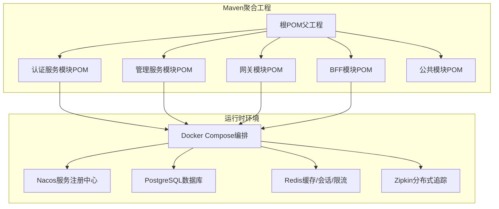
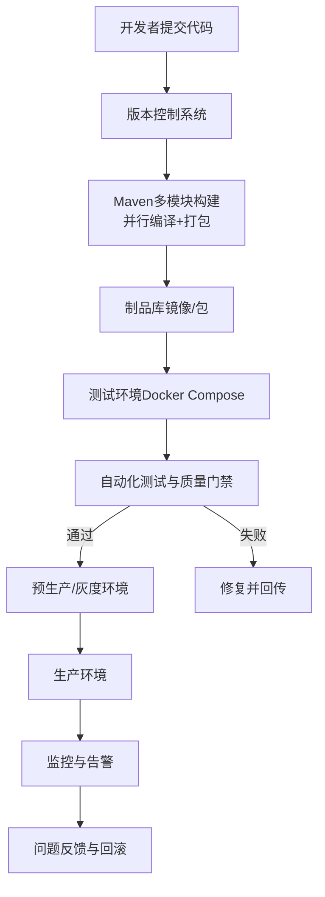
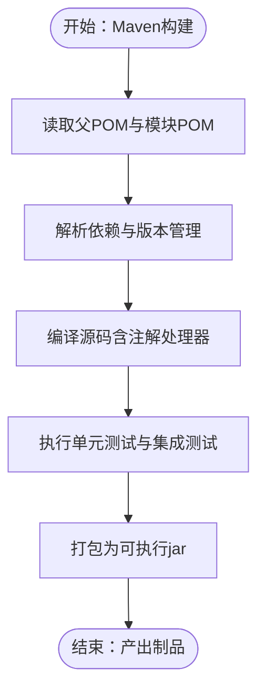
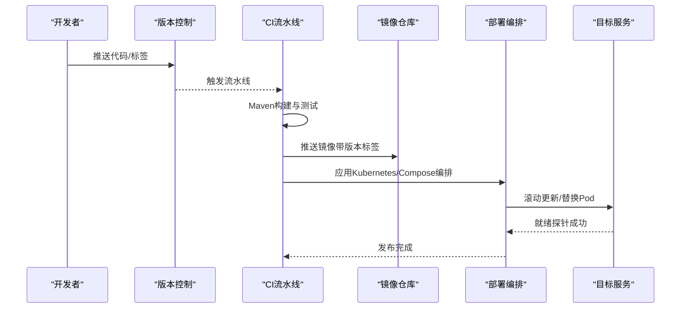
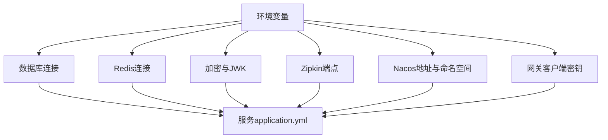
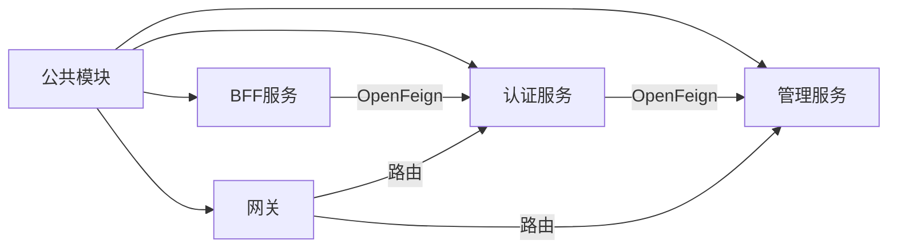

# CI/CD流水线

<cite>
**本文引用的文件**
- [根POM（父工程）](file://pom.xml)
- [认证服务模块POM](file://iam-auth-server/pom.xml)
- [管理服务模块POM](file://iam-admin-server/pom.xml)
- [网关模块POM](file://iam-gateway/pom.xml)
- [BFF模块POM](file://iam-bff-server/pom.xml)
- [公共模块POM](file://iam-common/pom.xml)
- [Docker Compose编排](file://docker-compose.yml)
- [认证服务应用配置](file://iam-auth-server/src/main/resources/application.yml)
- [管理服务应用配置](file://iam-admin-server/src/main/resources/application.yml)
- [网关应用配置](file://iam-gateway/src/main/resources/application.yml)
- [BFF应用配置](file://iam-bff-server/src/main/resources/application.yml)
- [认证服务SAML元数据测试](file://iam-auth-server/src/test/java/iam/platform/auth/application/service/SamlMetadataGeneratorTest.java)
- [Maven包装器属性](file://.mvn/wrapper/maven-wrapper.properties)
</cite>

## 目录
1. [简介](#简介)
2. [项目结构](#项目结构)
3. [核心组件](#核心组件)
4. [架构总览](#架构总览)
5. [详细组件分析](#详细组件分析)
6. [依赖关系分析](#依赖关系分析)
7. [性能考量](#性能考量)
8. [故障排查指南](#故障排查指南)
9. [结论](#结论)
10. [附录](#附录)

## 简介
本文件面向IAM平台的CI/CD流水线建设，系统性阐述自动化构建、测试与代码质量检查、持续集成策略、持续部署流水线、版本与发布管理、环境与密钥管理、自动化测试策略以及监控与告警集成。内容基于仓库中的Maven多模块结构、各服务的应用配置与容器编排，结合Spring Cloud生态与可观测性能力，形成可落地的流水线方案。

## 项目结构
IAM平台采用多模块Maven聚合工程，包含认证、管理、网关、BFF与公共模块，并通过Docker Compose进行本地开发与演示环境编排。整体以Spring Boot 3.2.5 + Java 21为基础，引入Spring Cloud与Spring Cloud Alibaba，启用Nacos服务注册发现、OpenFeign服务调用、Redis缓存与会话、PostgreSQL数据库、Zipkin分布式追踪等基础设施。

图表来源
- [根POM（父工程）:21-27](file://pom.xml#L21-L27)
- [认证服务模块POM:1-180](file://iam-auth-server/pom.xml#L1-L180)
- [管理服务模块POM:1-150](file://iam-admin-server/pom.xml#L1-L150)
- [网关模块POM:1-106](file://iam-gateway/pom.xml#L1-L106)
- [BFF模块POM:1-107](file://iam-bff-server/pom.xml#L1-L107)
- [公共模块POM](file://iam-common/pom.xml)
- [Docker Compose编排:1-190](file://docker-compose.yml#L1-L190)

章节来源
- [根POM（父工程）:1-226](file://pom.xml#L1-L226)
- [Docker Compose编排:1-190](file://docker-compose.yml#L1-L190)

## 核心组件
- 多模块Maven工程：统一版本、Java版本、插件与依赖管理，确保构建一致性与可维护性。
- Spring Cloud生态：Nacos服务注册与发现、OpenFeign声明式调用、Gateway路由与鉴权、负载均衡。
- 观测性：Actuator + Micrometer + Prometheus指标、Zipkin链路追踪、采样率100%便于问题定位。
- 安全与加密：JWK密钥对配置、加密密钥参数、会话存储至Redis、安全策略（速率限制、账户锁定、IP白黑名单）。
- 数据与迁移：Flyway数据库迁移（管理服务启用，认证服务禁用），PostgreSQL连接池参数优化。

章节来源
- [根POM（父工程）:29-41](file://pom.xml#L29-L41)
- [认证服务模块POM:69-73](file://iam-auth-server/pom.xml#L69-L73)
- [管理服务模块POM:78-80](file://iam-admin-server/pom.xml#L78-L80)
- [认证服务应用配置:39-39](file://iam-auth-server/src/main/resources/application.yml#L39-L39)
- [管理服务应用配置:38-41](file://iam-admin-server/src/main/resources/application.yml#L38-L41)

## 架构总览
下图展示CI/CD流水线在不同阶段的交互：代码提交触发构建，构建产物进入制品库，随后在测试环境进行自动化测试与质量门禁，最终进入预生产/生产环境进行灰度或全量发布，并配套监控与告警。

## 详细组件分析

### Maven构建与测试执行
- 构建配置
  - 父POM统一管理Spring Boot、Spring Cloud、Spring Cloud Alibaba版本，定义MapStruct、SpringDoc、Testcontainers、OpenSAML等依赖版本。
  - 编译插件启用UTF-8编码、显示警告、开启-Xlint，MapStruct注解处理器按需配置。
  - 模块POM继承父POM，按需引入Web、JPA、Redis、Actuator、Micrometer、Tracing、Nacos、OpenFeign、SAML/LDAP/CAS等依赖。
- 测试策略
  - 各模块均包含spring-boot-starter-test与spring-security-test，认证服务还包含Testcontainers用于PostgreSQL集成测试。
  - 提供SAML元数据生成的单元测试示例，验证XML输出格式与关键字段存在性。
- 资源与打包
  - 模块POM中spring-boot-maven-plugin与maven-compiler-plugin按模块启用，确保可执行jar与编译参数一致。

图表来源
- [根POM（父工程）:124-175](file://pom.xml#L124-L175)
- [认证服务模块POM:138-179](file://iam-auth-server/pom.xml#L138-L179)
- [管理服务模块POM:138-149](file://iam-admin-server/pom.xml#L138-L149)
- [网关模块POM:97-104](file://iam-gateway/pom.xml#L97-L104)
- [BFF模块POM:90-105](file://iam-bff-server/pom.xml#L90-L105)
- [认证服务SAML元数据测试:24-49](file://iam-auth-server/src/test/java/iam/platform/auth/application/service/SamlMetadataGeneratorTest.java#L24-L49)

章节来源
- [根POM（父工程）:124-175](file://pom.xml#L124-L175)
- [认证服务模块POM:138-179](file://iam-auth-server/pom.xml#L138-L179)
- [管理服务模块POM:138-149](file://iam-admin-server/pom.xml#L138-L149)
- [网关模块POM:97-104](file://iam-gateway/pom.xml#L97-L104)
- [BFF模块POM:90-105](file://iam-bff-server/pom.xml#L90-L105)
- [认证服务SAML元数据测试:1-51](file://iam-auth-server/src/test/java/iam/platform/auth/application/service/SamlMetadataGeneratorTest.java#L1-L51)

### 持续集成配置（分支策略、合并规则与自动化测试）
- 分支策略建议
  - develop：日常开发分支，所有功能开发在此分支进行。
  - feature/*：功能特性开发分支，从develop切分，完成后合并回develop。
  - release/*：预发布分支，用于小范围回归与最终校验，完成后合并至main并打标签。
  - hotfix/*：线上紧急修复分支，从main切分，修复后同时合并回main与develop。
- 合并规则建议
  - 必须通过CI流水线构建、单元测试与质量门禁。
  - 至少一名审查者批准。
  - 无冲突合并，优先使用squash合并保持主干整洁。
- 自动化测试
  - 单元测试：模块内spring-boot-starter-test覆盖。
  - 集成测试：认证服务使用Testcontainers启动PostgreSQL进行集成验证。
  - 端到端测试：建议在测试环境通过API网关与服务间调用进行场景化验证。

章节来源
- [认证服务模块POM:148-165](file://iam-auth-server/pom.xml#L148-L165)
- [认证服务SAML元数据测试:1-51](file://iam-auth-server/src/test/java/iam/platform/auth/application/service/SamlMetadataGeneratorTest.java#L1-L51)

### 持续部署流水线（镜像构建、多环境部署与回滚）
- Docker镜像构建
  - 使用Docker Compose在各服务目录下通过Dockerfile构建镜像，镜像标签由Maven Profile与docker.image.version决定。
  - 开发/测试/灰度/生产分别对应不同Profile与镜像标签后缀，便于区分与回滚。
- 多环境部署
  - 通过Nacos命名空间隔离不同环境（如iam-platform-dev、iam-platform-test、iam-platform-prod）。
  - 网关根据Host与Path进行路由，结合Redis限流与JWT资源服务器校验。
- 回滚机制
  - 采用镜像版本标签与滚动更新策略，失败时回退至上一个稳定版本镜像。
  - 关键配置通过环境变量注入，支持快速切换与回滚。

图表来源
- [根POM（父工程）:177-216](file://pom.xml#L177-L216)
- [Docker Compose编排:69-182](file://docker-compose.yml#L69-L182)
- [网关应用配置:14-54](file://iam-gateway/src/main/resources/application.yml#L14-L54)

章节来源
- [根POM（父工程）:177-216](file://pom.xml#L177-L216)
- [Docker Compose编排:69-182](file://docker-compose.yml#L69-L182)
- [网关应用配置:14-54](file://iam-gateway/src/main/resources/application.yml#L14-L54)

### 版本管理与发布策略（语义化版本、标签与变更日志）
- 版本号
  - 父POM定义项目版本号，docker.image.version默认等于项目版本，可通过命令行参数覆盖。
- 发布标签
  - 建议在release/*分支完成后打tag（如v1.2.0），作为发布基线。
- 变更日志
  - 建议在docs目录维护变更记录，记录每个版本的功能、修复与破坏性变更，便于回溯与审计。

章节来源
- [根POM（父工程）:16-16](file://pom.xml#L16-L16)
- [根POM（父工程）:39-40](file://pom.xml#L39-L40)

### 环境管理（环境变量、配置与密钥）
- 环境变量
  - 数据库：DB_HOST/DB_PORT/DB_NAME/DB_USERNAME/DB_PASSWORD
  - 缓存：REDIS_HOST/REDIS_PORT/REDIS_PASSWORD
  - 安全：ENCRYPTION_KEY/JWK密钥位置、OIDC Issuer URI
  - 追踪：ZIPKIN_ENDPOINT
  - 配置中心：NACOS_ADDR/NACOS_NAMESPACE
  - 网关：GATEWAY_CLIENT_SECRET
- 配置管理
  - 各服务application.yml通过占位符读取环境变量，支持dev/test/canary/prod多环境。
  - 管理服务启用Flyway迁移，认证服务禁用迁移（由管理服务统一治理）。
- 密钥管理
  - 建议通过密钥管理服务（如KMS/Secrets Manager）注入敏感信息，避免硬编码在配置中。

图表来源
- [认证服务应用配置:16-18](file://iam-auth-server/src/main/resources/application.yml#L16-L18)
- [管理服务应用配置:16-18](file://iam-admin-server/src/main/resources/application.yml#L16-L18)
- [网关应用配置:84-88](file://iam-gateway/src/main/resources/application.yml#L84-L88)
- [BFF应用配置:1-8](file://iam-bff-server/src/main/resources/application.yml#L1-L8)

章节来源
- [认证服务应用配置:16-18](file://iam-auth-server/src/main/resources/application.yml#L16-L18)
- [管理服务应用配置:16-18](file://iam-admin-server/src/main/resources/application.yml#L16-L18)
- [网关应用配置:84-88](file://iam-gateway/src/main/resources/application.yml#L84-L88)
- [BFF应用配置:1-8](file://iam-bff-server/src/main/resources/application.yml#L1-L8)

### 自动化测试策略（单元、集成与端到端）
- 单元测试
  - 使用JUnit 5与Spring Boot Test，覆盖业务逻辑与工具类。
- 集成测试
  - 认证服务使用Testcontainers启动PostgreSQL，验证数据库访问与迁移配置。
  - SAML元数据生成器具备单元测试，验证XML输出格式与关键字段。
- 端到端测试
  - 建议在测试环境通过API网关发起请求，覆盖登录、授权、会话、注销等完整链路。

章节来源
- [认证服务模块POM:148-165](file://iam-auth-server/pom.xml#L148-L165)
- [认证服务SAML元数据测试:24-49](file://iam-auth-server/src/test/java/iam/platform/auth/application/service/SamlMetadataGeneratorTest.java#L24-L49)

### 监控与告警集成（部署、性能与故障告警）
- 指标与追踪
  - Actuator暴露health、info、metrics、prometheus端点；Micrometer集成Prometheus；Zipkin桥接Brave进行链路追踪。
  - 网关额外暴露gateway端点，便于路由与限流指标观测。
- 采样与性能
  - 所有服务开启100%采样，便于问题复现；生产环境可根据流量调整采样率。
- 告警建议
  - 基于Prometheus Alertmanager配置告警规则（错误率、延迟、饱和度、健康检查失败）。
  - 结合Zipkin链路追踪定位慢调用与异常调用链。

章节来源
- [认证服务模块POM:118-135](file://iam-auth-server/pom.xml#L118-L135)
- [管理服务模块POM:88-104](file://iam-admin-server/pom.xml#L88-L104)
- [网关模块POM:60-81](file://iam-gateway/pom.xml#L60-L81)
- [BFF模块POM:57-69](file://iam-bff-server/pom.xml#L57-L69)
- [认证服务应用配置:128-144](file://iam-auth-server/src/main/resources/application.yml#L128-L144)
- [管理服务应用配置:76-92](file://iam-admin-server/src/main/resources/application.yml#L76-L92)
- [网关应用配置:93-108](file://iam-gateway/src/main/resources/application.yml#L93-L108)
- [BFF应用配置:33-48](file://iam-bff-server/src/main/resources/application.yml#L33-L48)

## 依赖关系分析
- 模块耦合
  - 公共模块被其他模块依赖，提供DTO、枚举、异常与通用工具。
  - 认证服务为OIDC/CAS/SAML/LDAP等认证协议提供统一入口，管理/BFF/网关通过OpenFeign调用认证服务。
- 外部依赖
  - Spring Cloud与Spring Cloud Alibaba版本由父POM统一管理；OpenSAML用于SAML；Testcontainers用于集成测试。
- 循环依赖
  - 当前结构未见循环依赖迹象，公共模块不依赖具体业务模块。

图表来源
- [根POM（父工程）:21-27](file://pom.xml#L21-L27)
- [认证服务模块POM:19-23](file://iam-auth-server/pom.xml#L19-L23)
- [管理服务模块POM:19-23](file://iam-admin-server/pom.xml#L19-L23)
- [BFF模块POM:19-23](file://iam-bff-server/pom.xml#L19-L23)
- [网关模块POM](file://iam-gateway/pom.xml)

章节来源
- [根POM（父工程）:21-27](file://pom.xml#L21-L27)

## 性能考量
- 数据库连接池
  - HikariCP连接池参数已设置最大池大小、最小空闲、连接超时、空闲超时与最大生命周期，有助于提升连接复用与稳定性。
- 缓存与会话
  - Redis用于会话存储、分布式会话与限流，建议结合持久化策略与内存上限配置。
- 追踪与采样
  - 100%采样便于问题定位，但高并发下应评估Zipkin与网络开销，必要时降低采样率。
- 网关限流
  - 基于Redis的RequestRateLimiter已在网关路由上配置，建议结合业务峰值动态调整配额。

章节来源
- [认证服务应用配置:19-24](file://iam-auth-server/src/main/resources/application.yml#L19-L24)
- [管理服务应用配置:19-24](file://iam-admin-server/src/main/resources/application.yml#L19-L24)
- [网关应用配置:25-41](file://iam-gateway/src/main/resources/application.yml#L25-L41)

## 故障排查指南
- 构建失败
  - 检查Maven Wrapper版本与Java版本是否匹配；确认父POM依赖版本与网络可达性。
- 测试失败
  - 认证服务集成测试依赖Testcontainers PostgreSQL，需确保容器可用与网络连通。
  - SAML元数据测试关注XML格式与关键节点是否存在。
- 运行时异常
  - 查看Actuator指标与Prometheus导出数据，结合Zipkin链路定位问题。
  - 网关路由与鉴权问题可通过调试日志级别提升定位效率。

章节来源
- [Maven包装器属性:1-4](file://.mvn/wrapper/maven-wrapper.properties#L1-L4)
- [认证服务模块POM:98-103](file://iam-auth-server/pom.xml#L98-L103)
- [认证服务SAML元数据测试:24-49](file://iam-auth-server/src/test/java/iam/platform/auth/application/service/SamlMetadataGeneratorTest.java#L24-L49)
- [网关应用配置:110-116](file://iam-gateway/src/main/resources/application.yml#L110-L116)

## 结论
本CI/CD流水线方案以Maven多模块为基础，结合Spring Cloud生态与可观测性能力，覆盖从构建、测试到部署与监控的全链路。通过明确的分支与合并规则、多环境配置与密钥管理、完善的测试策略与监控告警，能够有效保障IAM平台的交付质量与运行稳定性。

## 附录
- 建议补充项
  - 在CI中增加静态代码扫描（SpotBugs/Checkstyle/Spotless）与覆盖率报告。
  - 引入Kubernetes/Argo Rollouts进行蓝绿/金丝雀发布与自动回滚。
  - 建立变更日志模板与发布清单，规范发布流程。