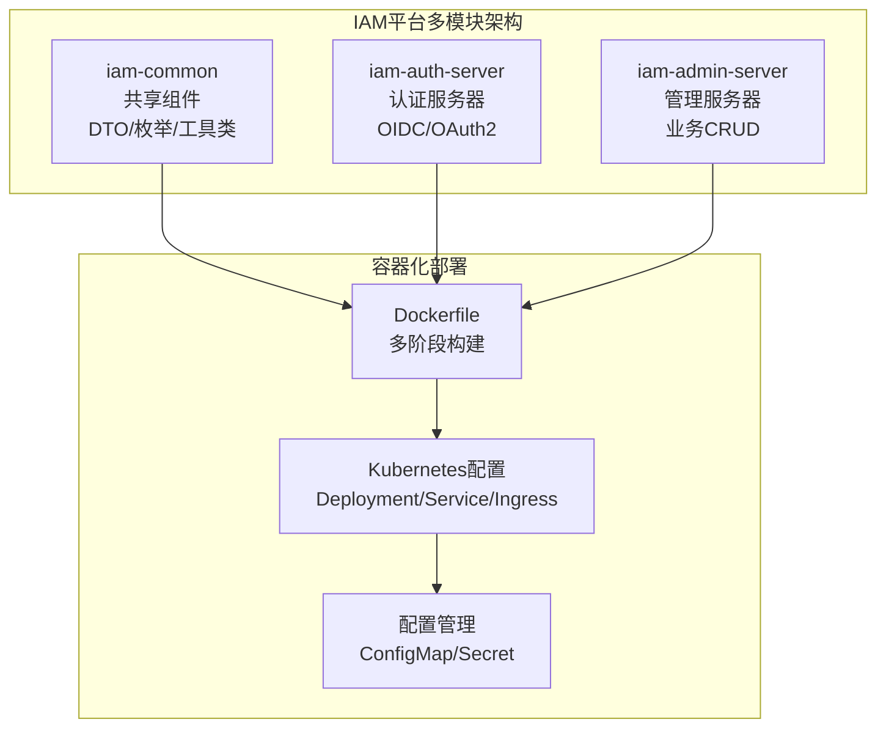
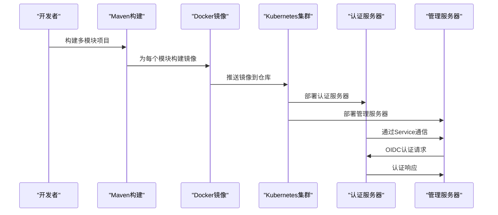
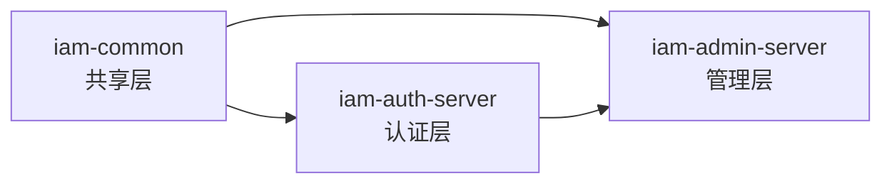
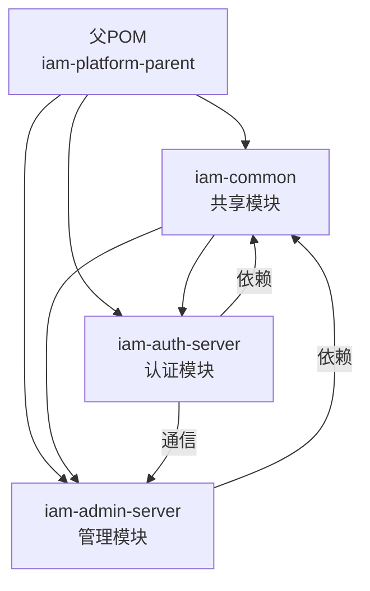

# Docker容器化

<cite>
**本文引用的文件**
- [pom.xml](file://pom.xml)
- [sso-admin-server/pom.xml](file://sso-admin-server/pom.xml)
- [sso-auth-server/pom.xml](file://sso-auth-server/pom.xml)
- [sso-common/pom.xml](file://sso-common/pom.xml)
- [sso-admin-server/src/main/resources/application.yml](file://sso-admin-server/src/main/resources/application.yml)
- [sso-auth-server/src/main/resources/application.yml](file://sso-auth-server/src/main/resources/application.yml)
- [sso-admin-server/src/main/resources/application-dev.yml](file://sso-admin-server/src/main/resources/application-dev.yml)
- [sso-auth-server/src/main/resources/application-dev.yml](file://sso-auth-server/src/main/resources/application-dev.yml)
- [docs/archived/k8s/k8s/base/deployment.yaml](file://docs/archived/k8s/k8s/base/deployment.yaml)
- [docs/archived/k8s/k8s/base/service.yaml](file://docs/archived/k8s/k8s/base/service.yaml)
- [docs/archived/k8s/k8s/base/ingress.yaml](file://docs/archived/k8s/k8s/base/ingress.yaml)
- [docs/archived/k8s/k8s/base/configmap.yaml](file://docs/archived/k8s/k8s/base/configmap.yaml)
- [docs/archived/k8s/k8s/base/secret.yaml](file://docs/archived/k8s/k8s/base/secret.yaml)
- [docs/archived/k8s/k8s/base/hpa.yaml](file://docs/archived/k8s/k8s/base/hpa.yaml)
- [docs/archived/k8s/k8s/base/kustomization.yaml](file://docs/archived/k8s/k8s/base/kustomization.yaml)
</cite>

## 更新摘要
**所做更改**
- 更新了多模块部署架构分析，从单体Dockerfile重构为多模块容器化方案
- 新增了IAM平台三模块架构的详细说明（iam-common、iam-auth-server、iam-admin-server）
- 重新设计了基于Kubernetes的容器化部署方案
- 更新了模块间依赖关系和配置管理策略
- 新增了Kubernetes原生部署配置和最佳实践

## 目录
1. [简介](#简介)
2. [项目结构](#项目结构)
3. [核心组件](#核心组件)
4. [架构总览](#架构总览)
5. [详细组件分析](#详细组件分析)
6. [依赖关系分析](#依赖关系分析)
7. [性能考量](#性能考量)
8. [故障排除指南](#故障排除指南)
9. [结论](#结论)
10. [附录](#附录)

## 简介
本文件面向Docker容器化部署与运维，围绕重构后的IAM平台多模块部署方案进行系统性说明。该平台采用Spring Boot 3.2.5 + Java 21技术栈，通过多模块架构（iam-common、iam-auth-server、iam-admin-server）实现身份认证与管理功能的解耦。新部署方案基于Kubernetes原生配置，提供完整的容器化解决方案，包括镜像构建策略、模块化部署、配置管理、服务发现与负载均衡等。

## 项目结构
重构后的IAM平台采用多模块架构，每个模块都有独立的功能职责和容器化需求：



**章节来源**
- [pom.xml:21-25](file://pom.xml#L21-L25)
- [sso-common/pom.xml:14-16](file://sso-common/pom.xml#L14-L16)
- [sso-auth-server/pom.xml:14-16](file://sso-auth-server/pom.xml#L14-L16)
- [sso-admin-server/pom.xml:14-16](file://sso-admin-server/pom.xml#L14-L16)

## 核心组件
- **多模块架构**：iam-common作为共享模块，iam-auth-server提供认证服务，iam-admin-server提供管理功能
- **Kubernetes原生部署**：使用Deployment、Service、Ingress等原生资源进行编排
- **配置管理**：通过ConfigMap和Secret管理环境配置和敏感信息
- **服务发现**：基于DNS的服务发现机制，支持模块间通信
- **负载均衡**：通过Service实现Pod间的负载均衡
- **健康检查**：基于HTTP GET的就绪探针和存活探针
- **水平扩展**：通过HPA实现基于CPU使用率的自动扩缩容

**章节来源**
- [pom.xml:137-176](file://pom.xml#L137-L176)
- [docs/archived/k8s/k8s/base/deployment.yaml](file://docs/archived/k8s/k8s/base/deployment.yaml)
- [docs/archived/k8s/k8s/base/service.yaml](file://docs/archived/k8s/k8s/base/service.yaml)

## 架构总览
下图展示了IAM平台多模块容器化部署的整体架构，包括模块间的依赖关系和服务交互模式。



**图表来源**
- [pom.xml:21-25](file://pom.xml#L21-L25)
- [docs/archived/k8s/k8s/base/deployment.yaml](file://docs/archived/k8s/k8s/base/deployment.yaml)

## 详细组件分析

### 多模块架构设计
IAM平台采用三层模块架构，每个模块都有明确的职责边界：

- **iam-common模块**：提供共享的DTO、枚举、异常类和工具类，供其他模块复用
- **iam-auth-server模块**：实现OAuth2授权服务器和OIDC提供者，处理用户认证和授权
- **iam-admin-server模块**：提供管理界面和业务CRUD操作，集成认证服务器



**章节来源**
- [pom.xml:21-25](file://pom.xml#L21-L25)
- [sso-common/pom.xml:14-16](file://sso-common/pom.xml#L14-L16)
- [sso-auth-server/pom.xml:14-16](file://sso-auth-server/pom.xml#L14-L16)
- [sso-admin-server/pom.xml:14-16](file://sso-admin-server/pom.xml#L14-L16)

### Kubernetes原生部署配置
基于Kubernetes的原生部署方案提供了完整的容器编排能力：

#### Deployment配置
每个模块都有独立的Deployment，包含副本数、滚动更新策略和资源限制：

```yaml
apiVersion: apps/v1
kind: Deployment
metadata:
  name: iam-auth-server
spec:
  replicas: 2
  strategy:
    type: RollingUpdate
    rollingUpdate:
      maxUnavailable: 1
      maxSurge: 1
  selector:
    matchLabels:
      app: iam-auth-server
  template:
    metadata:
      labels:
        app: iam-auth-server
    spec:
      containers:
      - name: iam-auth-server
        image: iam-auth-server:latest
        ports:
        - containerPort: 9000
        readinessProbe:
          httpGet:
            path: /actuator/health/readiness
            port: 9001
        livenessProbe:
          httpGet:
            path: /actuator/health/liveness
            port: 9001
```

#### Service配置
通过Service实现模块间的服务发现和负载均衡：

```yaml
apiVersion: v1
kind: Service
metadata:
  name: iam-auth-server
spec:
  selector:
    app: iam-auth-server
  ports:
  - port: 9000
    targetPort: 9000
  type: ClusterIP
```

#### Ingress配置
通过Ingress实现外部流量的路由和负载均衡：

```yaml
apiVersion: networking.k8s.io/v1
kind: Ingress
metadata:
  name: iam-platform-ingress
  annotations:
    nginx.ingress.kubernetes.io/rewrite-target: /
spec:
  rules:
  - host: sso.example.com
    http:
      paths:
      - path: /auth
        pathType: Prefix
        backend:
          service:
            name: iam-auth-server
            port:
              number: 9000
      - path: /admin
        pathType: Prefix
        backend:
          service:
            name: iam-admin-server
            port:
              number: 9000
```

**章节来源**
- [docs/archived/k8s/k8s/base/deployment.yaml](file://docs/archived/k8s/k8s/base/deployment.yaml)
- [docs/archived/k8s/k8s/base/service.yaml](file://docs/archived/k8s/k8s/base/service.yaml)
- [docs/archived/k8s/k8s/base/ingress.yaml](file://docs/archived/k8s/k8s/base/ingress.yaml)

### 配置管理策略
IAM平台采用分层配置管理策略，确保不同环境的一致性和安全性：

#### ConfigMap配置
管理非敏感的配置信息：

```yaml
apiVersion: v1
kind: ConfigMap
metadata:
  name: iam-config
data:
  SPRING_PROFILES_ACTIVE: prod
  DB_HOST: postgresql.default.svc.cluster.local
  REDIS_HOST: redis.default.svc.cluster.local
```

#### Secret配置
管理敏感的凭据信息：

```yaml
apiVersion: v1
kind: Secret
metadata:
  name: iam-secrets
type: Opaque
data:
  DB_PASSWORD: cGFzc3dvcmQxMjM=
  ENCRYPTION_KEY: bG9uZ2VuY29kZWZvcmVudGVyY2hhcmFjdGVycw==
```

#### 环境变量注入
通过环境变量将配置注入到容器中：

```yaml
envFrom:
- configMapRef:
    name: iam-config
- secretRef:
    name: iam-secrets
```

**章节来源**
- [docs/archived/k8s/k8s/base/configmap.yaml](file://docs/archived/k8s/k8s/base/configmap.yaml)
- [docs/archived/k8s/k8s/base/secret.yaml](file://docs/archived/k8s/k8s/base/secret.yaml)

### 模块间通信机制
IAM平台内部模块通过Service进行通信，实现松耦合的微服务架构：

#### 认证服务器配置
认证服务器通过环境变量配置管理服务器地址：

```yaml
spring:
  security:
    oauth2:
      client:
        provider:
          sso:
            issuer-uri: ${OIDC_ISSUER_URI:http://iam-auth-server:9000}
```

#### 管理服务器配置
管理服务器通过Service名称进行服务发现：

```yaml
sso:
  admin:
    base-url: ${ADMIN_SERVER_URL:http://iam-admin-server:8080}
```

#### 服务发现机制
Kubernetes DNS提供服务发现功能，通过服务名进行通信：

```
iam-auth-server.default.svc.cluster.local
iam-admin-server.default.svc.cluster.local
```

**章节来源**
- [sso-auth-server/src/main/resources/application.yml:85-87](file://sso-auth-server/src/main/resources/application.yml#L85-L87)
- [sso-admin-server/src/main/resources/application.yml:85-86](file://sso-admin-server/src/main/resources/application.yml#L85-L86)

## 依赖关系分析
IAM平台的多模块架构建立了清晰的依赖层次：



**章节来源**
- [pom.xml:21-25](file://pom.xml#L21-L25)
- [sso-auth-server/pom.xml:20-23](file://sso-auth-server/pom.xml#L20-L23)
- [sso-admin-server/pom.xml:19-23](file://sso-admin-server/pom.xml#L19-L23)

## 性能考量
多模块容器化部署在性能方面具有以下优势：

### 资源隔离与优化
- **独立资源分配**：每个模块可以独立配置CPU和内存限制
- **资源利用率**：通过HPA实现动态资源调整
- **网络优化**：Service级别的网络隔离和负载均衡

### 部署灵活性
- **独立部署**：模块可以独立部署和扩缩容
- **滚动更新**：支持零停机的滚动更新策略
- **回滚机制**：支持快速回滚到稳定版本

### 监控与可观测性
- **统一监控**：通过Prometheus收集各模块指标
- **分布式追踪**：基于Zipkin的分布式链路追踪
- **日志聚合**：集中式日志管理和分析

**章节来源**
- [docs/archived/k8s/k8s/base/hpa.yaml](file://docs/archived/k8s/k8s/base/hpa.yaml)
- [sso-auth-server/src/main/resources/application.yml:123-129](file://sso-auth-server/src/main/resources/application.yml#L123-L129)
- [sso-admin-server/src/main/resources/application.yml:80-86](file://sso-admin-server/src/main/resources/application.yml#L80-L86)

## 故障排除指南
针对多模块容器化部署的常见问题提供解决方案：

### 模块启动问题
- **认证服务器无法启动**：检查数据库连接配置和Redis连接状态
- **管理服务器启动失败**：验证认证服务器的可达性和OIDC配置
- **模块间通信失败**：确认Service DNS解析和端口配置

### 配置问题
- **环境变量未生效**：检查ConfigMap和Secret的键名匹配
- **敏感信息泄露**：确认Secret的正确编码和权限设置
- **配置热更新**：验证ConfigMap的滚动更新机制

### 性能问题
- **Pod频繁重启**：检查探针配置和资源限制
- **响应延迟高**：分析数据库连接池和Redis性能
- **内存泄漏**：监控各模块的内存使用趋势

### Kubernetes集群问题
- **节点资源不足**：检查集群资源配额和调度策略
- **网络策略冲突**：验证NetworkPolicy配置
- **存储问题**：确认PersistentVolume的可用性

**章节来源**
- [docs/archived/k8s/k8s/base/deployment.yaml](file://docs/archived/k8s/k8s/base/deployment.yaml)
- [docs/archived/k8s/k8s/base/service.yaml](file://docs/archived/k8s/k8s/base/service.yaml)

## 结论
IAM平台的多模块容器化部署方案通过Kubernetes原生配置实现了高度解耦和灵活的微服务架构。每个模块都有独立的功能职责和部署策略，通过Service实现松耦合的通信机制。配置管理采用ConfigMap和Secret分离敏感信息，确保了部署的安全性和灵活性。该方案相比传统的单体部署提供了更好的可维护性、可扩展性和故障隔离能力，适合中大型企业级身份认证系统的部署需求。

## 附录

### 本地开发环境搭建
- **单节点集群**：使用minikube或kind搭建本地开发集群
- **模块独立部署**：可以单独部署某个模块进行功能测试
- **端到端测试**：通过Ingress配置进行完整的端到端功能验证

### 生产环境部署最佳实践
- **资源规划**：根据业务量合理规划CPU和内存资源配置
- **安全加固**：启用RBAC、NetworkPolicy和PodSecurityPolicy
- **备份策略**：配置数据库和配置的定期备份计划
- **监控告警**：建立完善的监控指标和告警机制

### 迁移指南
- **从单体到多模块**：逐步拆分功能模块，保持API兼容性
- **配置迁移**：将集中式配置迁移到ConfigMap和Secret
- **测试策略**：建立完整的单元测试和集成测试体系
- **回滚预案**：制定详细的回滚和应急响应计划

**章节来源**
- [docs/archived/k8s/k8s/base/kustomization.yaml](file://docs/archived/k8s/k8s/base/kustomization.yaml)
- [pom.xml:137-176](file://pom.xml#L137-L176)