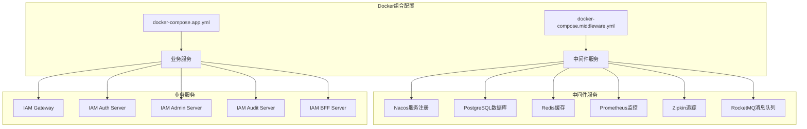
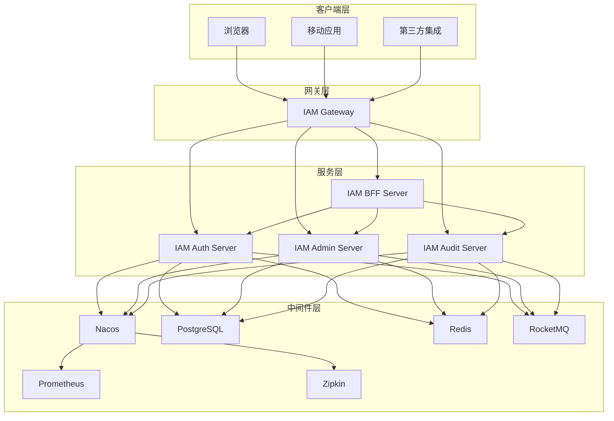
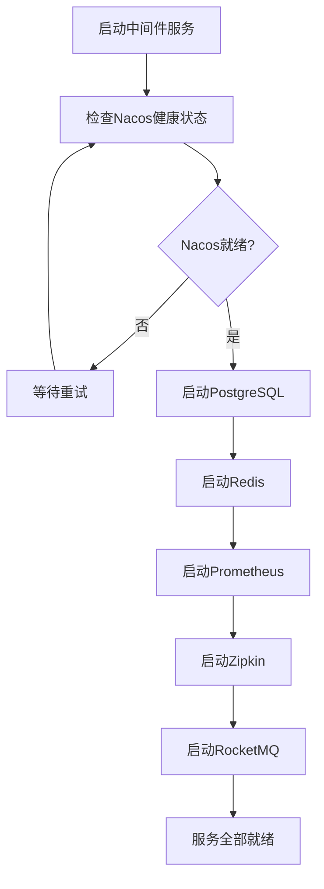
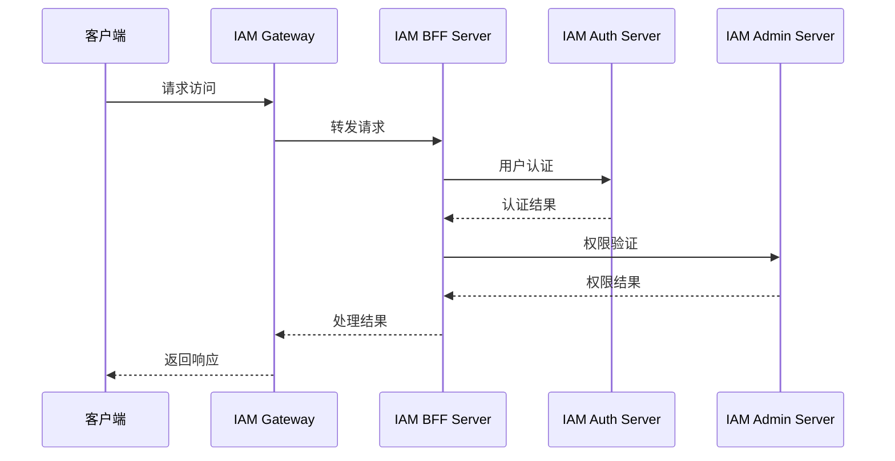
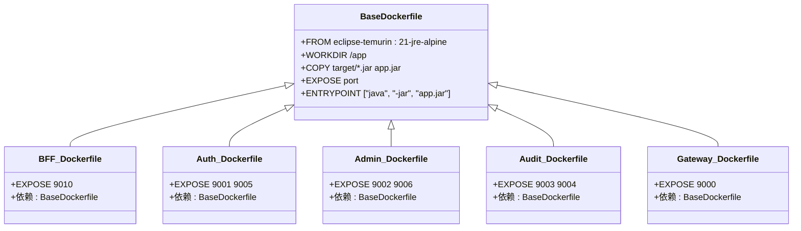
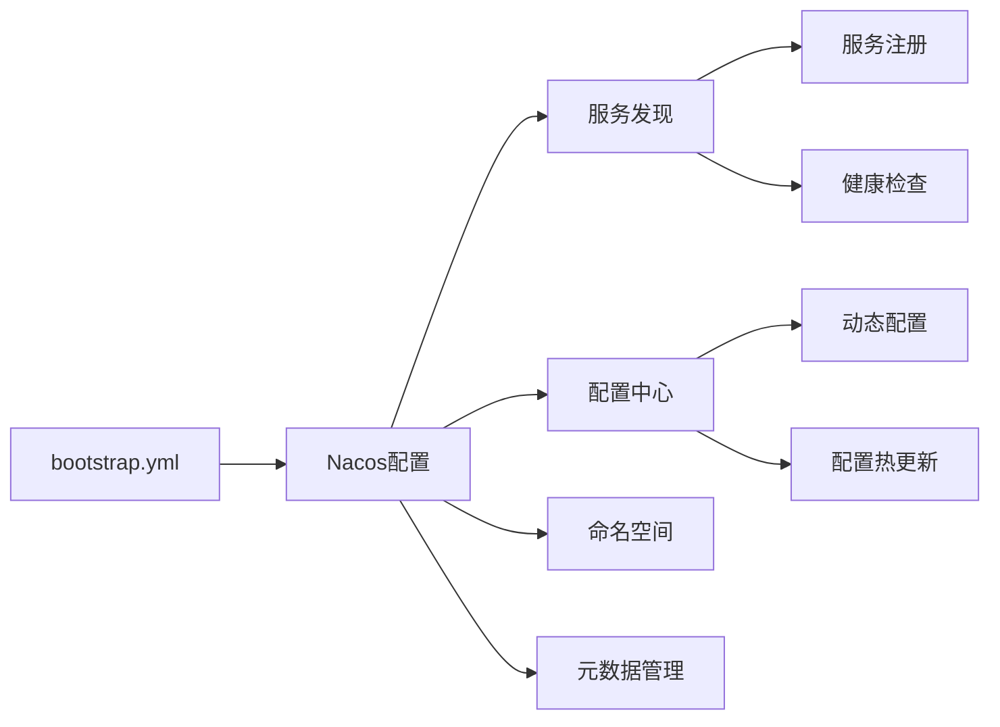
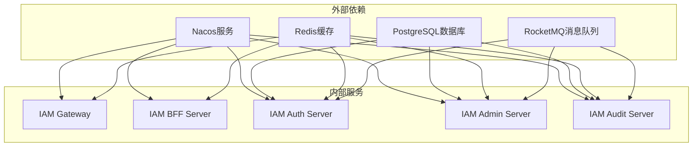
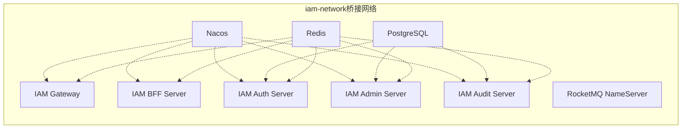
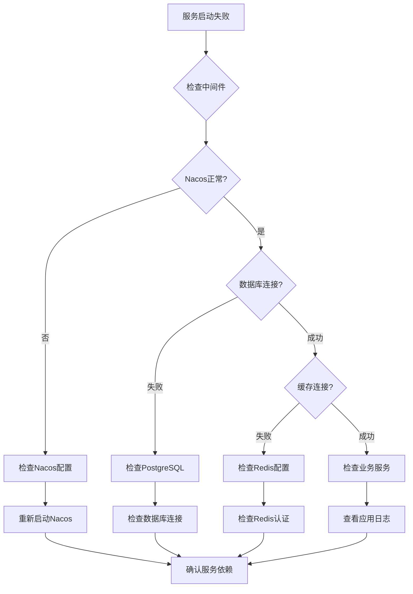

# Docker组合使用指南

<cite>
**本文档引用的文件**
- [DOCKER-COMPOSE-USAGE.md](file://DOCKER-COMPOSE-USAGE.md)
- [docker-compose.app.yml](file://docker-compose.app.yml)
- [docker-compose.middleware.yml](file://docker-compose.middleware.yml)
- [.dockerignore](file://.dockerignore)
- [iam-bff-server/Dockerfile](file://iam-bff-server/Dockerfile)
- [iam-auth-server/Dockerfile](file://iam-auth-server/Dockerfile)
- [iam-admin-server/Dockerfile](file://iam-admin-server/Dockerfile)
- [iam-audit-server/Dockerfile](file://iam-audit-server/Dockerfile)
- [iam-gateway/Dockerfile](file://iam-gateway/Dockerfile)
- [iam-bff-server/bootstrap.yml](file://iam-bff-server/bootstrap.yml)
- [iam-auth-server/bootstrap.yml](file://iam-auth-server/bootstrap.yml)
- [iam-admin-server/bootstrap.yml](file://iam-admin-server/bootstrap.yml)
- [iam-gateway/bootstrap.yml](file://iam-gateway/bootstrap.yml)
</cite>

## 目录
1. [简介](#简介)
2. [项目结构](#项目结构)
3. [核心组件](#核心组件)
4. [架构概览](#架构概览)
5. [详细组件分析](#详细组件分析)
6. [依赖关系分析](#依赖关系分析)
7. [性能考虑](#性能考虑)
8. [故障排除指南](#故障排除指南)
9. [结论](#结论)

## 简介

本指南详细介绍了IAM平台项目的Docker组合使用方法。该项目采用微服务架构，通过Docker Compose将中间件服务和业务服务进行分离部署，提供了完整的开发、测试和生产环境部署方案。

IAM平台包含五个核心服务：网关服务、认证授权服务、管理服务、审计服务和BFF服务，以及一套完整的中间件基础设施，包括服务注册与配置中心、数据库、缓存、监控和消息队列系统。

## 项目结构

项目采用分层的Docker部署策略，将服务按功能划分为两个主要部分：



**图表来源**
- [docker-compose.middleware.yml:1-150](file://docker-compose.middleware.yml#L1-L150)
- [docker-compose.app.yml:1-170](file://docker-compose.app.yml#L1-L170)

**章节来源**
- [DOCKER-COMPOSE-USAGE.md:1-157](file://DOCKER-COMPOSE-USAGE.md#L1-L157)
- [docker-compose.middleware.yml:1-150](file://docker-compose.middleware.yml#L1-L150)
- [docker-compose.app.yml:1-170](file://docker-compose.app.yml#L1-L170)

## 核心组件

### 中间件服务组件

中间件服务提供整个系统的基础设施支持，包括：

| 服务类型 | 服务名称 | 端口映射 | 主要功能 |
|---------|----------|----------|----------|
| 服务注册与配置中心 | Nacos | 8848, 9848 | 服务发现、配置管理 |
| 数据库 | PostgreSQL | 5432 | 关系型数据存储 |
| 缓存 | Redis | 6379 | 内存缓存、会话存储 |
| 监控 | Prometheus | 9090 | 指标收集与监控 |
| 追踪 | Zipkin | 9410, 9411 | 分布式链路追踪 |
| 消息队列 | RocketMQ | 9876, 10909, 10911, 10912 | 异步消息处理 |

### 业务服务组件

业务服务提供核心功能实现：

| 服务名称 | 容器端口 | 主要职责 |
|----------|----------|----------|
| IAM Gateway | 9000 | API网关、请求路由 |
| IAM Auth Server | 9001, 9005 | 认证授权、用户管理 |
| IAM Admin Server | 9002, 9006 | 管理控制台、权限管理 |
| IAM Audit Server | 9003, 9004 | 审计日志、合规管理 |
| IAM BFF Server | 9010 | 前端代理、服务聚合 |

**章节来源**
- [DOCKER-COMPOSE-USAGE.md:7-21](file://DOCKER-COMPOSE-USAGE.md#L7-L21)
- [DOCKER-COMPOSE-USAGE.md:103-127](file://DOCKER-COMPOSE-USAGE.md#L103-L127)

## 架构概览

系统采用微服务架构，通过Docker容器化部署，实现了服务间的松耦合和高可用性。



**图表来源**
- [docker-compose.app.yml:3-165](file://docker-compose.app.yml#L3-L165)
- [docker-compose.middleware.yml:3-146](file://docker-compose.middleware.yml#L3-L146)

## 详细组件分析

### Docker Compose配置分析

#### 中间件服务配置

中间件服务配置采用了独立的compose文件，确保基础设施服务的稳定性和可维护性：



**图表来源**
- [docker-compose.middleware.yml:24-28](file://docker-compose.middleware.yml#L24-L28)
- [docker-compose.middleware.yml:45-49](file://docker-compose.middleware.yml#L45-L49)
- [docker-compose.middleware.yml:64-68](file://docker-compose.middleware.yml#L64-L68)
- [docker-compose.middleware.yml:93-97](file://docker-compose.middleware.yml#L93-L97)

#### 业务服务配置

业务服务配置展示了服务间的依赖关系和通信模式：



**图表来源**
- [docker-compose.app.yml:16-17](file://docker-compose.app.yml#L16-L17)
- [docker-compose.app.yml:152-155](file://docker-compose.app.yml#L152-L155)

**章节来源**
- [docker-compose.middleware.yml:1-150](file://docker-compose.middleware.yml#L1-L150)
- [docker-compose.app.yml:1-170](file://docker-compose.app.yml#L1-L170)

### Dockerfile构建配置

所有服务都使用统一的基础镜像配置，确保构建的一致性和可维护性：



**图表来源**
- [iam-bff-server/Dockerfile:1-10](file://iam-bff-server/Dockerfile#L1-L10)
- [iam-auth-server/Dockerfile:1-10](file://iam-auth-server/Dockerfile#L1-L10)
- [iam-admin-server/Dockerfile:1-10](file://iam-admin-server/Dockerfile#L1-L10)
- [iam-audit-server/Dockerfile:1-10](file://iam-audit-server/Dockerfile#L1-L10)
- [iam-gateway/Dockerfile:1-10](file://iam-gateway/Dockerfile#L1-L10)

**章节来源**
- [iam-bff-server/Dockerfile:1-10](file://iam-bff-server/Dockerfile#L1-L10)
- [iam-auth-server/Dockerfile:1-10](file://iam-auth-server/Dockerfile#L1-L10)
- [iam-admin-server/Dockerfile:1-10](file://iam-admin-server/Dockerfile#L1-L10)
- [iam-audit-server/Dockerfile:1-10](file://iam-audit-server/Dockerfile#L1-L10)
- [iam-gateway/Dockerfile:1-10](file://iam-gateway/Dockerfile#L1-L10)

### 配置文件分析

Spring Cloud Nacos配置展示了服务发现和配置管理的实现：



**图表来源**
- [iam-bff-server/bootstrap.yml:1-10](file://iam-bff-server/bootstrap.yml#L1-L10)
- [iam-auth-server/bootstrap.yml:1-10](file://iam-auth-server/bootstrap.yml#L1-L10)
- [iam-admin-server/bootstrap.yml:1-10](file://iam-admin-server/bootstrap.yml#L1-L10)
- [iam-gateway/bootstrap.yml:1-10](file://iam-gateway/bootstrap.yml#L1-L10)

**章节来源**
- [iam-bff-server/bootstrap.yml:1-10](file://iam-bff-server/bootstrap.yml#L1-L10)
- [iam-auth-server/bootstrap.yml:1-10](file://iam-auth-server/bootstrap.yml#L1-L10)
- [iam-admin-server/bootstrap.yml:1-10](file://iam-admin-server/bootstrap.yml#L1-L10)
- [iam-gateway/bootstrap.yml:1-10](file://iam-gateway/bootstrap.yml#L1-L10)

## 依赖关系分析

### 服务依赖图



**图表来源**
- [docker-compose.app.yml:20-64](file://docker-compose.app.yml#L20-L64)
- [docker-compose.app.yml:88-138](file://docker-compose.app.yml#L88-L138)

### 网络拓扑

所有服务都运行在同一个Docker网络中，实现了服务间的直接通信：



**图表来源**
- [docker-compose.middleware.yml:167-170](file://docker-compose.middleware.yml#L167-L170)
- [docker-compose.app.yml:167-170](file://docker-compose.app.yml#L167-L170)

**章节来源**
- [docker-compose.middleware.yml:147-150](file://docker-compose.middleware.yml#L147-L150)
- [docker-compose.app.yml:167-170](file://docker-compose.app.yml#L167-L170)

## 性能考虑

### 资源配置优化

中间件服务采用了合理的资源配置策略：

- **Nacos**: 单机模式配置，适合开发环境使用
- **PostgreSQL**: 使用专用数据目录，确保数据持久化
- **Redis**: 配置了密码认证和持久化存储
- **Prometheus**: 独立的配置文件和数据目录
- **RocketMQ**: 分离的NameServer和Broker组件

### 启动顺序优化

Compose文件定义了明确的服务启动依赖关系：

1. **中间件服务优先启动**: 确保基础设施就绪
2. **业务服务按需启动**: 根据依赖关系启动
3. **健康检查机制**: 确保服务真正可用

## 故障排除指南

### 常见问题诊断



### 日志查看方法

```bash
# 查看特定服务日志
docker-compose -f docker-compose.app.yml logs -f iam-bff-service

# 查看认证服务日志
docker-compose -f docker-compose.app.yml logs -f iam-auth-server

# 查看所有服务状态
docker-compose -f docker-compose.app.yml ps
```

### 重启策略

```bash
# 重启单个服务
docker-compose -f docker-compose.app.yml restart iam-bff-service

# 重启所有业务服务
docker-compose -f docker-compose.app.yml restart
```

**章节来源**
- [DOCKER-COMPOSE-USAGE.md:81-101](file://DOCKER-COMPOSE-USAGE.md#L81-L101)
- [DOCKER-COMPOSE-USAGE.md:151-157](file://DOCKER-COMPOSE-USAGE.md#L151-L157)

## 结论

本Docker组合配置为IAM平台提供了完整的容器化部署解决方案。通过将中间件服务和业务服务分离，实现了更好的可维护性和扩展性。配置文件展示了现代化微服务架构的最佳实践，包括：

- 明确的服务分层和职责划分
- 完善的依赖管理和启动顺序
- 标准化的构建和部署流程
- 全面的监控和故障排除机制

该配置适用于开发、测试和生产环境，为IAM平台的持续集成和部署提供了坚实的基础。