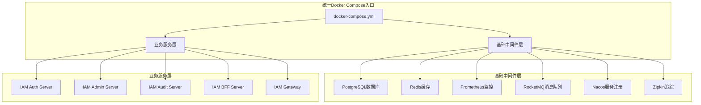
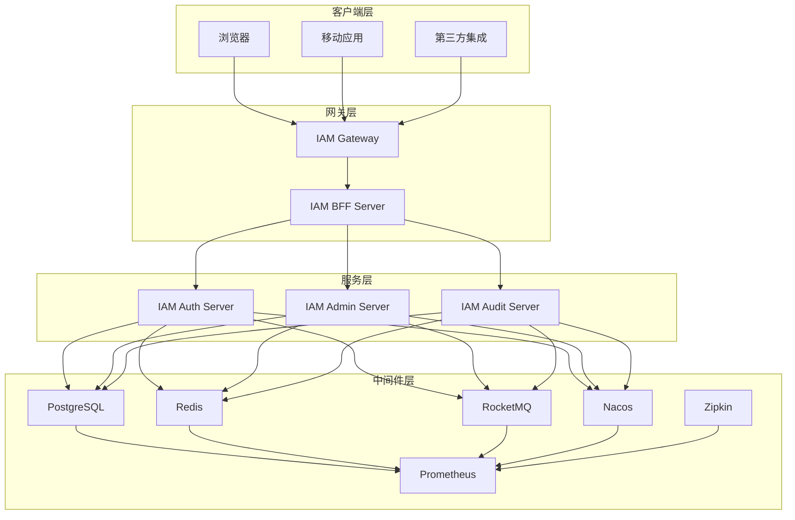
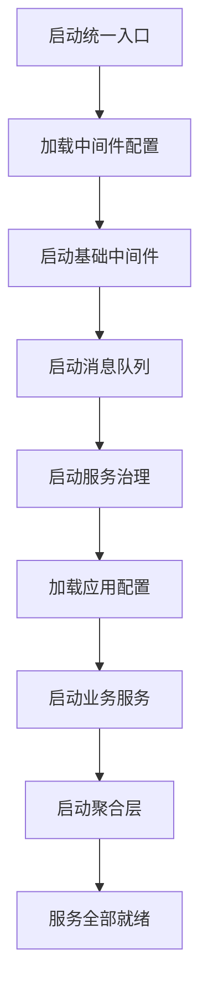
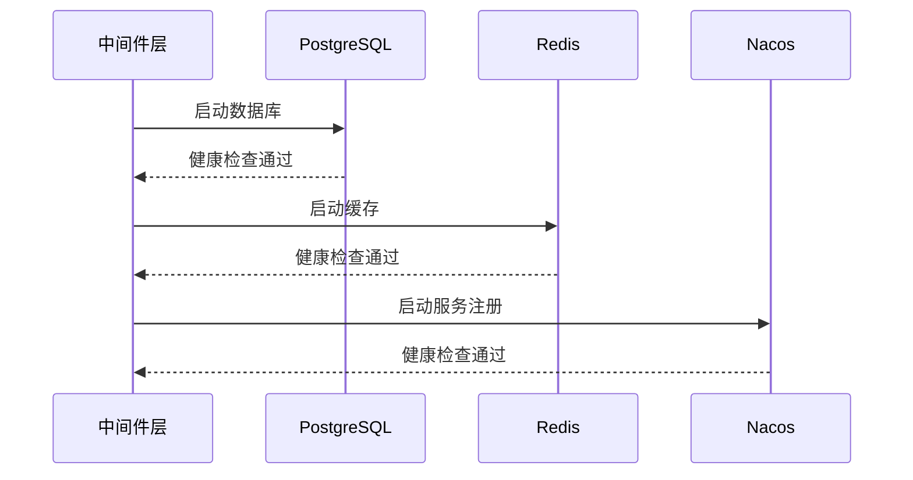
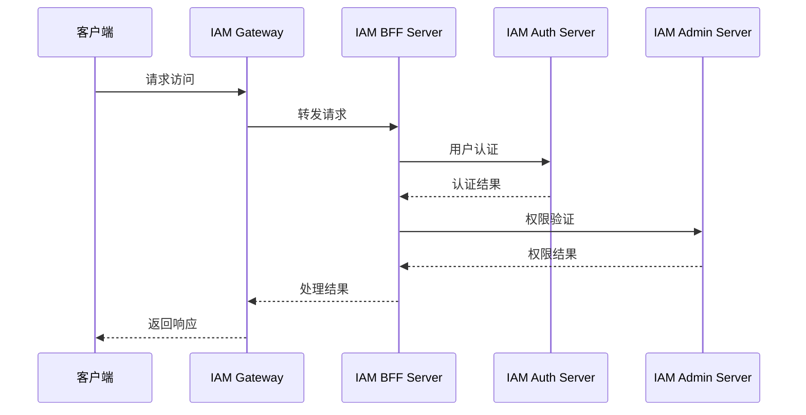
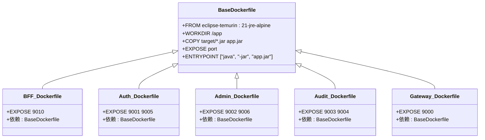
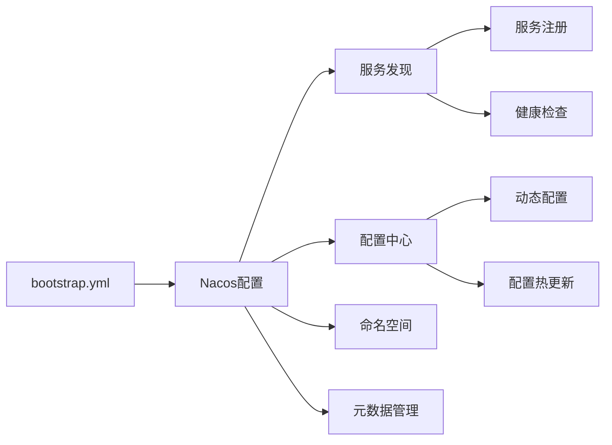
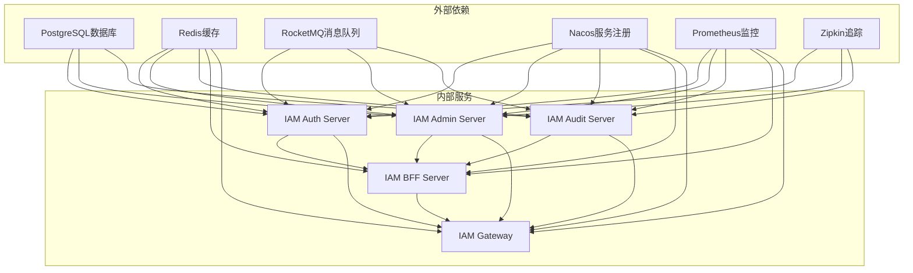
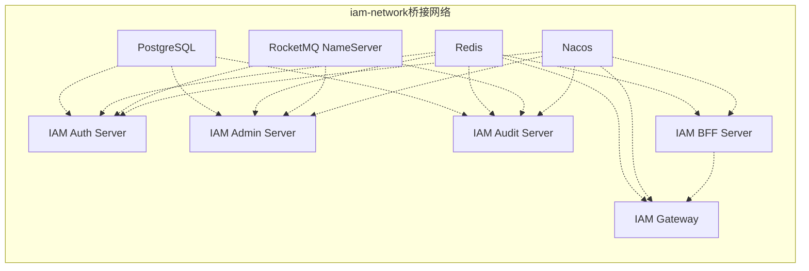
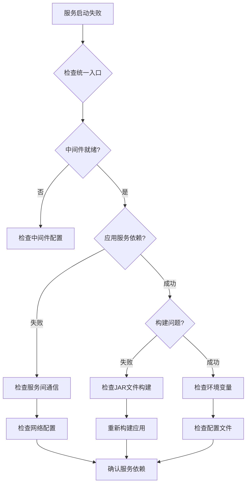

# Docker组合使用指南

<cite>
**本文档引用的文件**
- [docker-compose.yml](file://docker-compose.yml)
- [docker-compose.app.yml](file://docker-compose.app.yml)
- [docker-compose.middleware.yml](file://docker-compose.middleware.yml)
- [DOCKER-COMPOSE-USAGE.md](file://DOCKER-COMPOSE-USAGE.md)
- [.dockerignore](file://.dockerignore)
- [iam-bff-server/Dockerfile](file://iam-bff-server/Dockerfile)
- [iam-auth-server/Dockerfile](file://iam-auth-server/Dockerfile)
- [iam-admin-server/Dockerfile](file://iam-admin-server/Dockerfile)
- [iam-audit-server/Dockerfile](file://iam-audit-server/Dockerfile)
- [iam-gateway/Dockerfile](file://iam-gateway/Dockerfile)
- [iam-bff-server/bootstrap.yml](file://iam-bff-server/bootstrap.yml)
- [iam-auth-server/bootstrap.yml](file://iam-auth-server/bootstrap.yml)
- [iam-admin-server/bootstrap.yml](file://iam-admin-server/bootstrap.yml)
- [iam-gateway/bootstrap.yml](file://iam-gateway/bootstrap.yml)
</cite>

## 更新摘要
**所做更改**
- 更新了配置文件结构说明，反映统一入口文件的引入
- 修改了架构概览图，展示新的分层结构
- 更新了使用场景说明，强调统一入口文件的优势
- 修正了服务依赖关系图，体现新的配置组织方式
- 更新了故障排除指南，适应新的部署模式

## 目录
1. [简介](#简介)
2. [项目结构](#项目结构)
3. [核心组件](#核心组件)
4. [架构概览](#架构概览)
5. [详细组件分析](#详细组件分析)
6. [依赖关系分析](#依赖关系分析)
7. [性能考虑](#性能考虑)
8. [故障排除指南](#故障排除指南)
9. [结论](#结论)

## 简介

本指南详细介绍了IAM平台项目的Docker组合使用方法。该项目采用微服务架构，通过Docker Compose将中间件服务和业务服务进行分离部署，提供了完整的开发、测试和生产环境部署方案。

**更新** 项目现已采用统一的Docker Compose入口文件架构，通过`docker-compose.yml`作为单一入口协调中间件和应用服务的部署，同时保持原有独立配置文件的兼容性，为不同使用场景提供灵活的部署选项。

IAM平台包含五个核心服务：网关服务、认证授权服务、管理服务、审计服务和BFF服务，以及一套完整的中间件基础设施，包括服务注册与配置中心、数据库、缓存、监控和消息队列系统。

## 项目结构

项目采用分层的Docker部署策略，通过统一入口文件协调中间件服务和业务服务的部署：



**图表来源**
- [docker-compose.yml:9-82](file://docker-compose.yml#L9-L82)
- [docker-compose.middleware.yml:1-147](file://docker-compose.middleware.yml#L1-L147)
- [docker-compose.app.yml:1-119](file://docker-compose.app.yml#L1-L119)

**章节来源**
- [docker-compose.yml:1-82](file://docker-compose.yml#L1-L82)
- [docker-compose.middleware.yml:1-147](file://docker-compose.middleware.yml#L1-L147)
- [docker-compose.app.yml:1-119](file://docker-compose.app.yml#L1-L119)

## 核心组件

### 中间件服务组件

中间件服务提供整个系统的基础设施支持，包括：

| 服务类型 | 服务名称 | 端口映射 | 主要功能 |
|---------|----------|----------|----------|
| 数据库 | PostgreSQL | 5432 | 关系型数据存储 |
| 缓存 | Redis | 6379 | 内存缓存、会话存储 |
| 监控 | Prometheus | 9090 | 指标收集与监控 |
| 消息队列 | RocketMQ | 9876, 10909, 10911, 10912 | 异步消息处理 |
| 服务注册与配置中心 | Nacos | 8848, 9848 | 服务发现、配置管理 |
| 追踪 | Zipkin | 9410, 9411 | 分布式链路追踪 |

### 业务服务组件

业务服务提供核心功能实现：

| 服务名称 | 容器端口 | 主要职责 |
|----------|----------|----------|
| IAM Auth Server | 9001, 9005 | 认证授权、用户管理 |
| IAM Admin Server | 9002, 9006 | 管理控制台、权限管理 |
| IAM Audit Server | 9003, 9004 | 审计日志、合规管理 |
| IAM BFF Server | 9010 | 前端代理、服务聚合 |
| IAM Gateway | 9000 | API网关、请求路由 |

**章节来源**
- [docker-compose.middleware.yml:6-147](file://docker-compose.middleware.yml#L6-L147)
- [docker-compose.app.yml:6-119](file://docker-compose.app.yml#L6-L119)

## 架构概览

系统采用微服务架构，通过Docker容器化部署，实现了服务间的松耦合和高可用性。新的统一入口文件架构提供了更简洁的部署体验：



**图表来源**
- [docker-compose.yml:58-82](file://docker-compose.yml#L58-L82)
- [docker-compose.middleware.yml:6-147](file://docker-compose.middleware.yml#L6-L147)

## 详细组件分析

### Docker Compose配置分析

#### 统一入口文件配置

新的`docker-compose.yml`文件通过`extends`机制整合了中间件和应用服务配置：



**图表来源**
- [docker-compose.yml:14-47](file://docker-compose.yml#L14-L47)
- [docker-compose.yml:58-82](file://docker-compose.yml#L58-L82)

#### 中间件服务配置

中间件服务配置保持了原有的独立特性，确保基础设施的稳定性：



**图表来源**
- [docker-compose.middleware.yml:20-24](file://docker-compose.middleware.yml#L20-L24)
- [docker-compose.middleware.yml:37-41](file://docker-compose.middleware.yml#L37-L41)
- [docker-compose.middleware.yml:124-128](file://docker-compose.middleware.yml#L124-L128)

#### 业务服务配置

业务服务配置展示了服务间的依赖关系和通信模式：



**图表来源**
- [docker-compose.app.yml:82-98](file://docker-compose.app.yml#L82-L98)
- [docker-compose.app.yml:100-118](file://docker-compose.app.yml#L100-L118)

**章节来源**
- [docker-compose.yml:1-82](file://docker-compose.yml#L1-L82)
- [docker-compose.middleware.yml:1-147](file://docker-compose.middleware.yml#L1-L147)
- [docker-compose.app.yml:1-119](file://docker-compose.app.yml#L1-L119)

### Dockerfile构建配置

所有服务都使用统一的基础镜像配置，确保构建的一致性和可维护性：



**图表来源**
- [iam-bff-server/Dockerfile:1-10](file://iam-bff-server/Dockerfile#L1-L10)
- [iam-auth-server/Dockerfile:1-10](file://iam-auth-server/Dockerfile#L1-L10)
- [iam-admin-server/Dockerfile:1-10](file://iam-admin-server/Dockerfile#L1-L10)
- [iam-audit-server/Dockerfile:1-10](file://iam-audit-server/Dockerfile#L1-L10)
- [iam-gateway/Dockerfile:1-10](file://iam-gateway/Dockerfile#L1-L10)

**章节来源**
- [iam-bff-server/Dockerfile:1-10](file://iam-bff-server/Dockerfile#L1-L10)
- [iam-auth-server/Dockerfile:1-10](file://iam-auth-server/Dockerfile#L1-L10)
- [iam-admin-server/Dockerfile:1-10](file://iam-admin-server/Dockerfile#L1-L10)
- [iam-audit-server/Dockerfile:1-10](file://iam-audit-server/Dockerfile#L1-L10)
- [iam-gateway/Dockerfile:1-10](file://iam-gateway/Dockerfile#L1-L10)

### 配置文件分析

Spring Cloud Nacos配置展示了服务发现和配置管理的实现：



**图表来源**
- [iam-bff-server/bootstrap.yml:1-10](file://iam-bff-server/bootstrap.yml#L1-L10)
- [iam-auth-server/bootstrap.yml:1-10](file://iam-auth-server/bootstrap.yml#L1-L10)
- [iam-admin-server/bootstrap.yml:1-10](file://iam-admin-server/bootstrap.yml#L1-L10)
- [iam-gateway/bootstrap.yml:1-10](file://iam-gateway/bootstrap.yml#L1-L10)

**章节来源**
- [iam-bff-server/bootstrap.yml:1-10](file://iam-bff-server/bootstrap.yml#L1-L10)
- [iam-auth-server/bootstrap.yml:1-10](file://iam-auth-server/bootstrap.yml#L1-L10)
- [iam-admin-server/bootstrap.yml:1-10](file://iam-admin-server/bootstrap.yml#L1-L10)
- [iam-gateway/bootstrap.yml:1-10](file://iam-gateway/bootstrap.yml#L1-L10)

## 依赖关系分析

### 服务依赖图



**图表来源**
- [docker-compose.app.yml:6-119](file://docker-compose.app.yml#L6-L119)
- [docker-compose.middleware.yml:6-147](file://docker-compose.middleware.yml#L6-L147)

### 网络拓扑

所有服务都运行在同一个Docker网络中，实现了服务间的直接通信：



**图表来源**
- [docker-compose.middleware.yml:144-147](file://docker-compose.middleware.yml#L144-L147)
- [docker-compose.app.yml:100-119](file://docker-compose.app.yml#L100-L119)

**章节来源**
- [docker-compose.middleware.yml:144-147](file://docker-compose.middleware.yml#L144-L147)
- [docker-compose.app.yml:100-119](file://docker-compose.app.yml#L100-L119)

## 性能考虑

### 资源配置优化

中间件服务采用了合理的资源配置策略：

- **PostgreSQL**: 使用专用数据目录，确保数据持久化
- **Redis**: 配置了密码认证和持久化存储
- **Prometheus**: 独立的配置文件和数据目录
- **RocketMQ**: 分离的NameServer和Broker组件
- **Nacos**: 单机模式配置，适合开发环境使用

### 启动顺序优化

统一入口文件定义了明确的服务启动依赖关系：

1. **基础中间件优先启动**: PostgreSQL、Redis等核心基础设施
2. **消息队列服务启动**: RocketMQ集群组件
3. **服务治理组件启动**: Nacos、Zipkin等治理工具
4. **业务服务按需启动**: 根据依赖关系启动
5. **聚合层服务最后启动**: 确保上游服务完全就绪

## 故障排除指南

### 常见问题诊断



### 日志查看方法

```bash
# 查看统一入口的所有服务日志
docker-compose logs -f

# 查看中间件服务日志
docker-compose -f docker-compose.middleware.yml logs -f

# 查看应用服务日志
docker-compose -f docker-compose.app.yml logs -f

# 查看特定服务日志
docker-compose logs -f iam-gateway
docker-compose logs -f iam-auth-server
docker-compose logs -f nacos
```

### 重启策略

```bash
# 重启统一入口中的特定服务
docker-compose restart iam-gateway

# 重启所有应用服务
docker-compose -f docker-compose.app.yml restart

# 重启所有中间件服务
docker-compose -f docker-compose.middleware.yml restart
```

**章节来源**
- [DOCKER-COMPOSE-USAGE.md:136-165](file://DOCKER-COMPOSE-USAGE.md#L136-L165)
- [docker-compose.yml:1-82](file://docker-compose.yml#L1-L82)

## 结论

本Docker组合配置为IAM平台提供了完整的容器化部署解决方案。通过引入统一的`docker-compose.yml`入口文件，项目实现了部署方式的重大简化：

- **统一入口文件**: 通过`extends`机制整合中间件和应用配置
- **灵活部署选项**: 支持一键启动完整环境或独立部署中间件/应用
- **向后兼容**: 保持原有独立配置文件的兼容性
- **清晰的分层结构**: 明确的基础设施和服务层划分
- **简化的依赖管理**: 通过统一入口文件管理复杂的依赖关系

该配置适用于开发、测试和生产环境，为IAM平台的持续集成和部署提供了更加灵活和高效的解决方案。统一入口文件架构不仅简化了部署流程，还保持了系统的可维护性和扩展性，为未来的架构演进奠定了良好的基础。