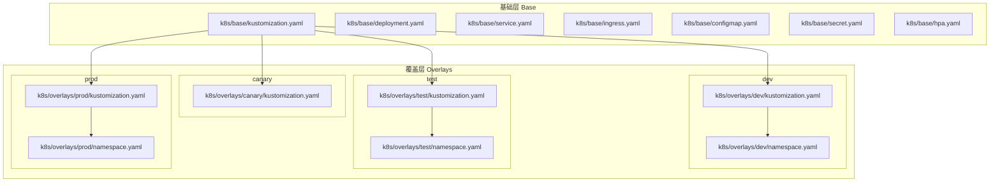
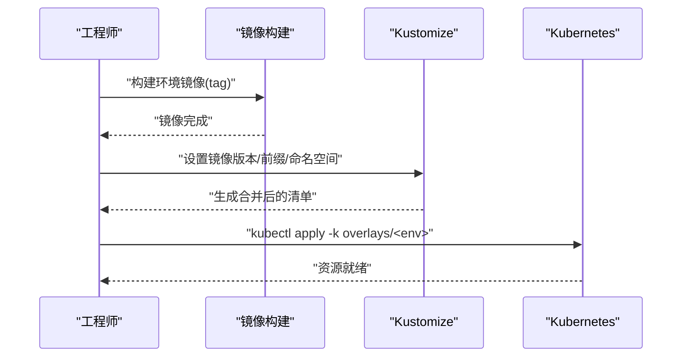
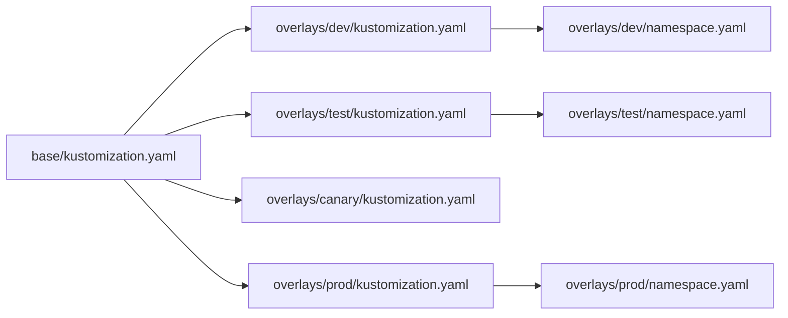

# Kubernetes部署

<cite>
**本文引用的文件**
- [k8s/base/kustomization.yaml](file://k8s/base/kustomization.yaml)
- [k8s/base/deployment.yaml](file://k8s/base/deployment.yaml)
- [k8s/base/service.yaml](file://k8s/base/service.yaml)
- [k8s/base/ingress.yaml](file://k8s/base/ingress.yaml)
- [k8s/base/configmap.yaml](file://k8s/base/configmap.yaml)
- [k8s/base/secret.yaml](file://k8s/base/secret.yaml)
- [k8s/base/hpa.yaml](file://k8s/base/hpa.yaml)
- [k8s/overlays/dev/kustomization.yaml](file://k8s/overlays/dev/kustomization.yaml)
- [k8s/overlays/dev/namespace.yaml](file://k8s/overlays/dev/namespace.yaml)
- [k8s/overlays/test/kustomization.yaml](file://k8s/overlays/test/kustomization.yaml)
- [k8s/overlays/test/namespace.yaml](file://k8s/overlays/test/namespace.yaml)
- [k8s/overlays/canary/kustomization.yaml](file://k8s/overlays/canary/kustomization.yaml)
- [k8s/overlays/prod/kustomization.yaml](file://k8s/overlays/prod/kustomization.yaml)
- [k8s/overlays/prod/namespace.yaml](file://k8s/overlays/prod/namespace.yaml)
- [DEPLOYMENT.md](file://DEPLOYMENT.md)
- [README.md](file://README.md)
</cite>

## 目录
1. [简介](#简介)
2. [项目结构](#项目结构)
3. [核心组件](#核心组件)
4. [架构总览](#架构总览)
5. [详细组件分析](#详细组件分析)
6. [依赖关系分析](#依赖关系分析)
7. [性能考虑](#性能考虑)
8. [故障排查指南](#故障排查指南)
9. [结论](#结论)
10. [附录](#附录)

## 简介
本文件面向在Kubernetes上部署与运维IAM Platform认证服务的工程团队，系统性阐述基于Kustomize的多环境配置管理策略（base层与overlays层）、多环境差异化配置（dev/test/canary/prod）、核心K8s资源（Deployment、Service、Ingress、ConfigMap、Secret、HPA）的配置要点，以及命名空间管理、资源配额与HPA自动扩缩容、服务网格与网络策略、安全上下文等高级主题。同时提供kubectl命令行操作指南与集群维护最佳实践。

## 项目结构
该仓库采用“base + overlays”的Kustomize目录结构组织多环境配置：
- base：所有环境共享的基础资源模板
- overlays：各环境的覆盖层，按需叠加差异化配置



图示来源
- [k8s/base/kustomization.yaml:1-11](file://k8s/base/kustomization.yaml#L1-L11)
- [k8s/overlays/dev/kustomization.yaml:1-23](file://k8s/overlays/dev/kustomization.yaml#L1-L23)
- [k8s/overlays/test/kustomization.yaml:1-23](file://k8s/overlays/test/kustomization.yaml#L1-L23)
- [k8s/overlays/canary/kustomization.yaml:1-29](file://k8s/overlays/canary/kustomization.yaml#L1-L29)
- [k8s/overlays/prod/kustomization.yaml:1-50](file://k8s/overlays/prod/kustomization.yaml#L1-L50)

章节来源
- [DEPLOYMENT.md:96-123](file://DEPLOYMENT.md#L96-L123)
- [README.md:333-347](file://README.md#L333-L347)

## 核心组件
本节聚焦于K8s核心资源的职责与配置要点，涵盖：
- Deployment：应用实例编排、探针、资源限制与安全上下文
- Service：服务暴露与端口映射
- Ingress：域名与路径路由至Service
- ConfigMap：非敏感配置注入
- Secret：敏感配置注入
- HPA：CPU/内存利用率驱动的自动扩缩容

章节来源
- [k8s/base/deployment.yaml:1-58](file://k8s/base/deployment.yaml#L1-L58)
- [k8s/base/service.yaml:1-18](file://k8s/base/service.yaml#L1-L18)
- [k8s/base/ingress.yaml:1-26](file://k8s/base/ingress.yaml#L1-L26)
- [k8s/base/configmap.yaml:1-14](file://k8s/base/configmap.yaml#L1-L14)
- [k8s/base/secret.yaml:1-11](file://k8s/base/secret.yaml#L1-L11)
- [k8s/base/hpa.yaml:1-25](file://k8s/base/hpa.yaml#L1-L25)

## 架构总览
下图展示Kustomize在多环境中的工作流：base提供通用模板，overlays按环境叠加命名空间、镜像标签、补丁与命名前缀，最终生成差异化清单并部署。

```mermaid
sequenceDiagram
participant Dev as "开发者"
participant Kust as "Kustomize CLI"
participant Base as "Base 模板"
participant Over as "Overlays 环境"
participant K8s as "Kubernetes API"
Dev->>Kust : "设置镜像版本/名称前缀/命名空间"
Kust->>Base : "读取基础资源清单"
Kust->>Over : "应用环境覆盖(kustomization/patches)"
Kust-->>Dev : "输出合并后的YAML"
Dev->>K8s : "kubectl apply -k overlays/<env>"
K8s-->>Dev : "创建/更新资源"
```

图示来源
- [k8s/base/kustomization.yaml:1-11](file://k8s/base/kustomization.yaml#L1-L11)
- [k8s/overlays/dev/kustomization.yaml:1-23](file://k8s/overlays/dev/kustomization.yaml#L1-L23)
- [k8s/overlays/test/kustomization.yaml:1-23](file://k8s/overlays/test/kustomization.yaml#L1-L23)
- [k8s/overlays/canary/kustomization.yaml:1-29](file://k8s/overlays/canary/kustomization.yaml#L1-L29)
- [k8s/overlays/prod/kustomization.yaml:1-50](file://k8s/overlays/prod/kustomization.yaml#L1-L50)

## 详细组件分析

### 基础层（Base）
- 资源聚合：通过base的kustomization聚合ConfigMap、Secret、Deployment、Service、Ingress、HPA
- Deployment：定义容器端口、探针、资源请求/限制、安全上下文；通过envFrom从ConfigMap与Secret注入环境变量
- Service：ClusterIP暴露HTTP与management端口
- Ingress：Nginx Ingress控制器的host与路径规则，区分业务与管理端点
- HPA：以CPU/内存利用率为目标的水平自动扩缩容

章节来源
- [k8s/base/kustomization.yaml:1-11](file://k8s/base/kustomization.yaml#L1-L11)
- [k8s/base/deployment.yaml:1-58](file://k8s/base/deployment.yaml#L1-L58)
- [k8s/base/service.yaml:1-18](file://k8s/base/service.yaml#L1-L18)
- [k8s/base/ingress.yaml:1-26](file://k8s/base/ingress.yaml#L1-L26)
- [k8s/base/configmap.yaml:1-14](file://k8s/base/configmap.yaml#L1-L14)
- [k8s/base/secret.yaml:1-11](file://k8s/base/secret.yaml#L1-L11)
- [k8s/base/hpa.yaml:1-25](file://k8s/base/hpa.yaml#L1-L25)

### 环境覆盖层（Overlays）

#### Dev 环境
- 命名空间：iam-platform-dev
- 名称前缀：dev-
- 镜像标签：1.0.0-SNAPSHOT-dev
- 补丁：将ConfigMap中活动Profile替换为dev

章节来源
- [k8s/overlays/dev/kustomization.yaml:1-23](file://k8s/overlays/dev/kustomization.yaml#L1-L23)
- [k8s/overlays/dev/namespace.yaml:1-5](file://k8s/overlays/dev/namespace.yaml#L1-L5)

#### Test 环境
- 命名空间：iam-platform-test
- 名称前缀：test-
- 镜像标签：1.0.0-SNAPSHOT-test
- 补丁：将ConfigMap中活动Profile替换为test

章节来源
- [k8s/overlays/test/kustomization.yaml:1-23](file://k8s/overlays/test/kustomization.yaml#L1-L23)
- [k8s/overlays/test/namespace.yaml:1-5](file://k8s/overlays/test/namespace.yaml#L1-L5)

#### Canary 环境
- 命名空间：iam-platform-prod（复用生产命名空间）
- 名称前缀：canary-
- 镜像标签：1.0.0-SNAPSHOT-canary
- 补丁：将ConfigMap中活动Profile替换为canary；为Deployment添加canary标签，便于分流与观测

章节来源
- [k8s/overlays/canary/kustomization.yaml:1-29](file://k8s/overlays/canary/kustomization.yaml#L1-L29)

#### Prod 环境
- 命名空间：iam-platform-prod
- 镜像标签：1.2.3（示例）
- 补丁：将ConfigMap中活动Profile替换为prod，并更新数据库与Redis主机、OIDC Issuer URI；提升Deployment副本数与资源请求/限制

章节来源
- [k8s/overlays/prod/kustomization.yaml:1-50](file://k8s/overlays/prod/kustomization.yaml#L1-L50)
- [k8s/overlays/prod/namespace.yaml:1-5](file://k8s/overlays/prod/namespace.yaml#L1-L5)

### 多环境部署流程（序列图）


图示来源
- [DEPLOYMENT.md:134-167](file://DEPLOYMENT.md#L134-L167)

### 多环境配置差异（表格）
- 环境命名空间与前缀：dev/test使用各自命名空间；canary复用prod命名空间并通过名称前缀区分；prod使用独立命名空间
- 镜像标签：各环境不同，便于追踪与回滚
- Profile与关键配置：通过Kustomize补丁覆盖ConfigMap中的活动Profile及数据库/缓存/Issuer等地址

章节来源
- [DEPLOYMENT.md:125-133](file://DEPLOYMENT.md#L125-L133)
- [DEPLOYMENT.md:200-223](file://DEPLOYMENT.md#L200-L223)
- [k8s/overlays/dev/kustomization.yaml:11-22](file://k8s/overlays/dev/kustomization.yaml#L11-L22)
- [k8s/overlays/test/kustomization.yaml:11-22](file://k8s/overlays/test/kustomization.yaml#L11-L22)
- [k8s/overlays/canary/kustomization.yaml:10-21](file://k8s/overlays/canary/kustomization.yaml#L10-L21)
- [k8s/overlays/prod/kustomization.yaml:10-31](file://k8s/overlays/prod/kustomization.yaml#L10-L31)

### 资源与安全配置要点
- Deployment
  - 探针：就绪/存活/启动探针分别指向管理端口的健康路径
  - 资源：requests/limits定义CPU与内存
  - 安全：非root运行、指定用户ID
- Service：ClusterIP暴露业务与管理端口
- Ingress：Nginx注解与host/path规则，区分业务与管理端点
- ConfigMap：非敏感配置（如Profile、DB/Redis/Zipkin等）
- Secret：敏感配置（如DB/Redis凭据、加密Key）
- HPA：以CPU/内存利用率为目标的扩缩容策略

章节来源
- [k8s/base/deployment.yaml:37-58](file://k8s/base/deployment.yaml#L37-L58)
- [k8s/base/service.yaml:8-18](file://k8s/base/service.yaml#L8-L18)
- [k8s/base/ingress.yaml:5-26](file://k8s/base/ingress.yaml#L5-L26)
- [k8s/base/configmap.yaml:5-14](file://k8s/base/configmap.yaml#L5-L14)
- [k8s/base/secret.yaml:6-11](file://k8s/base/secret.yaml#L6-L11)
- [k8s/base/hpa.yaml:12-25](file://k8s/base/hpa.yaml#L12-L25)

## 依赖关系分析
- 组件耦合：overlays对base的显式依赖通过resources引用；各环境仅通过patches与镜像覆盖实现差异化
- 外部依赖：Ingress控制器（Nginx）与HPA控制器
- 命名约定：Deployment/Service/Ingress同名，便于跨环境一致性管理



图示来源
- [k8s/base/kustomization.yaml:4-10](file://k8s/base/kustomization.yaml#L4-L10)
- [k8s/overlays/dev/kustomization.yaml:7-9](file://k8s/overlays/dev/kustomization.yaml#L7-L9)
- [k8s/overlays/test/kustomization.yaml:7-9](file://k8s/overlays/test/kustomization.yaml#L7-L9)
- [k8s/overlays/canary/kustomization.yaml:7-8](file://k8s/overlays/canary/kustomization.yaml#L7-L8)
- [k8s/overlays/prod/kustomization.yaml:6-8](file://k8s/overlays/prod/kustomization.yaml#L6-L8)

## 性能考虑
- HPA策略：以CPU/内存利用率为目标，结合副本数与资源配额，避免过度扩缩导致抖动
- 探针配置：合理设置initialDelaySeconds与periodSeconds，降低探针风暴对集群的影响
- 资源请求/限制：生产环境建议根据压测结果迭代优化，避免资源争抢
- Ingress代理体大小：针对上传场景适当增大代理体限制，避免客户端上传失败

章节来源
- [k8s/base/hpa.yaml:12-25](file://k8s/base/hpa.yaml#L12-L25)
- [k8s/base/deployment.yaml:37-54](file://k8s/base/deployment.yaml#L37-L54)
- [k8s/base/ingress.yaml:6-6](file://k8s/base/ingress.yaml#L6-L6)

## 故障排查指南
- 健康检查
  - 应用健康：通过管理端口的健康端点查看整体健康状态
  - 数据源/缓存：查看数据库连接池与Redis状态
  - 应用信息：获取应用版本与构建信息
- 日志
  - 使用kubectl查看Pod日志，支持时间范围与容器选择
- 资源监控
  - 使用top查看Pod/节点资源使用
- 回滚
  - 使用kubectl rollout undo回滚到历史版本
- 灰度验证
  - 通过canary标签筛选Pod，验证流量切换与指标变化

章节来源
- [DEPLOYMENT.md:242-289](file://DEPLOYMENT.md#L242-L289)
- [DEPLOYMENT.md:185-198](file://DEPLOYMENT.md#L185-L198)
- [DEPLOYMENT.md:169-183](file://DEPLOYMENT.md#L169-L183)

## 结论
本方案以Kustomize的base+overlays模式实现了多环境配置的高内聚低耦合管理，通过命名空间、镜像标签、名称前缀与补丁机制，清晰分离了dev/test/canary/prod四类环境的差异化需求。配合HPA、探针与Ingress注解，既保证了交付效率，也兼顾了生产可用性与可观测性。建议在CI/CD流水线中固化镜像构建与Kustomize合并步骤，并在生产环境引入资源配额与网络策略以进一步增强稳定性与安全性。

## 附录

### 命令行操作指南
- 构建镜像与部署（示例）
  - Dev：构建镜像后设置镜像版本并应用
  - Prod：构建镜像后设置镜像版本并应用
  - Canary：部署灰度版本，验证后再删除
- 回滚
  - 使用rollout undo回滚到指定版本
- 健康检查与日志
  - 健康端点、日志查看、资源使用查询

章节来源
- [DEPLOYMENT.md:134-198](file://DEPLOYMENT.md#L134-L198)
- [DEPLOYMENT.md:242-289](file://DEPLOYMENT.md#L242-L289)

### 多环境配置矩阵
- Profile与关键配置：通过Kustomize补丁覆盖ConfigMap中的活动Profile及数据库/缓存/Issuer等地址
- 环境差异：连接池大小、SQL显示、Swagger UI开关、日志级别、模板缓存等

章节来源
- [DEPLOYMENT.md:200-223](file://DEPLOYMENT.md#L200-L223)