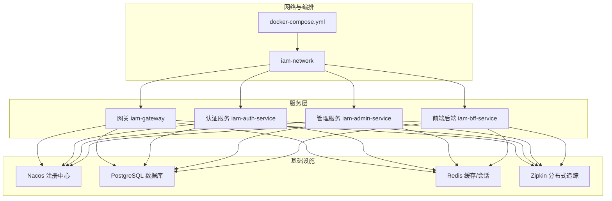
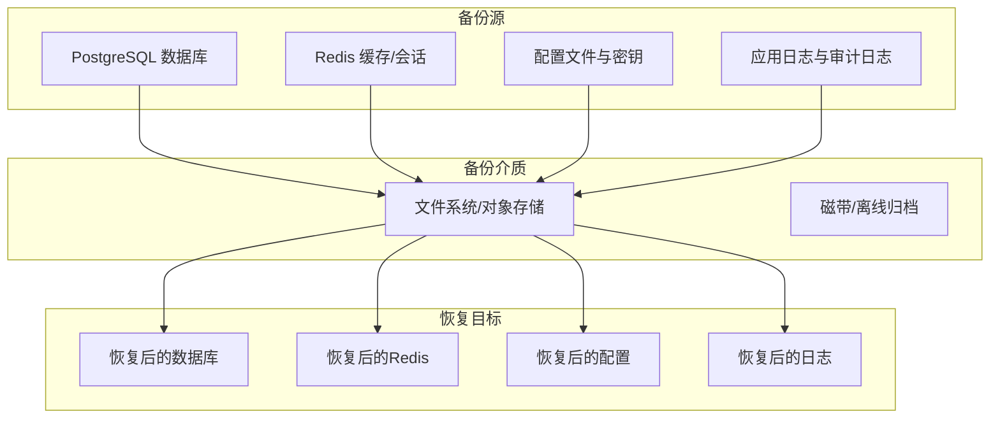
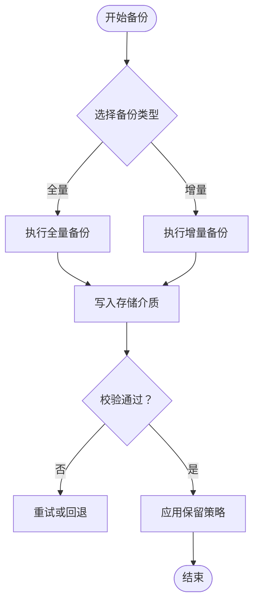
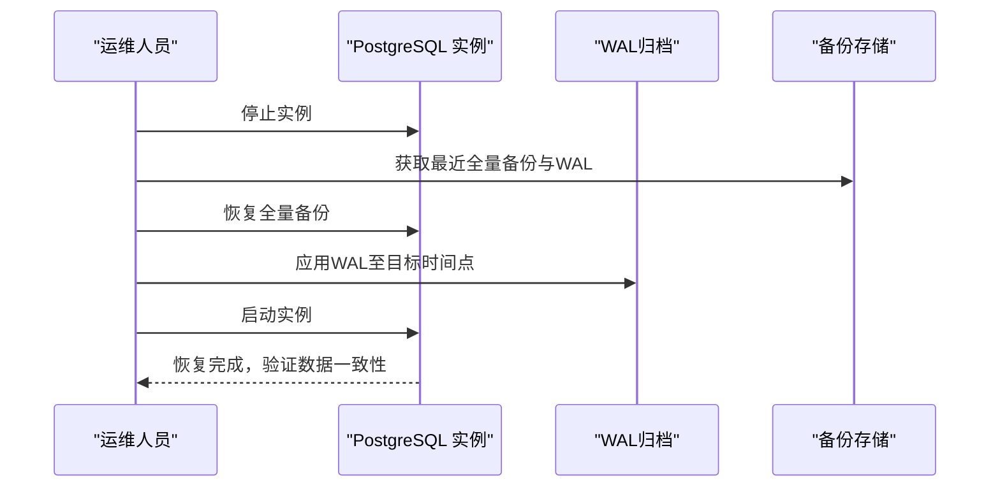
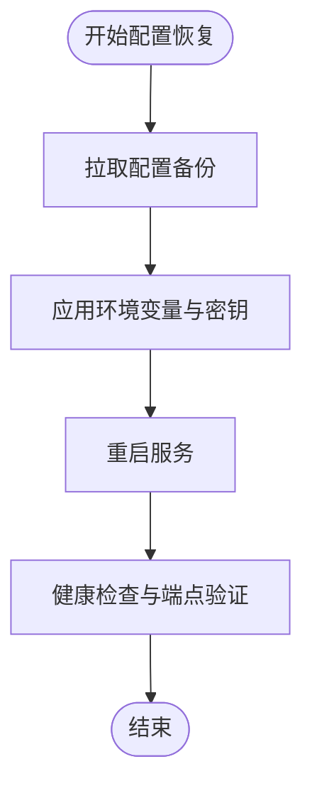
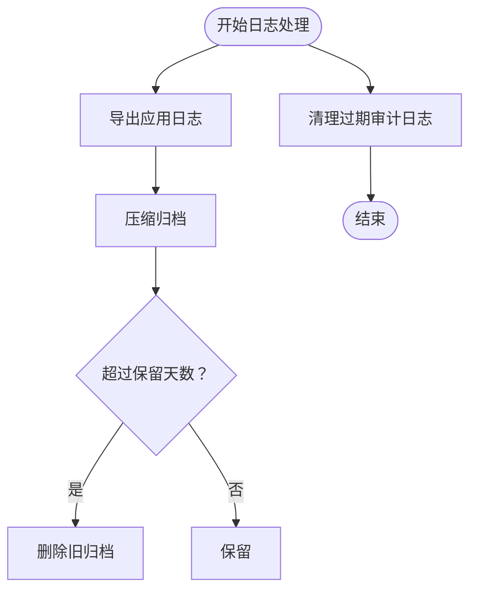
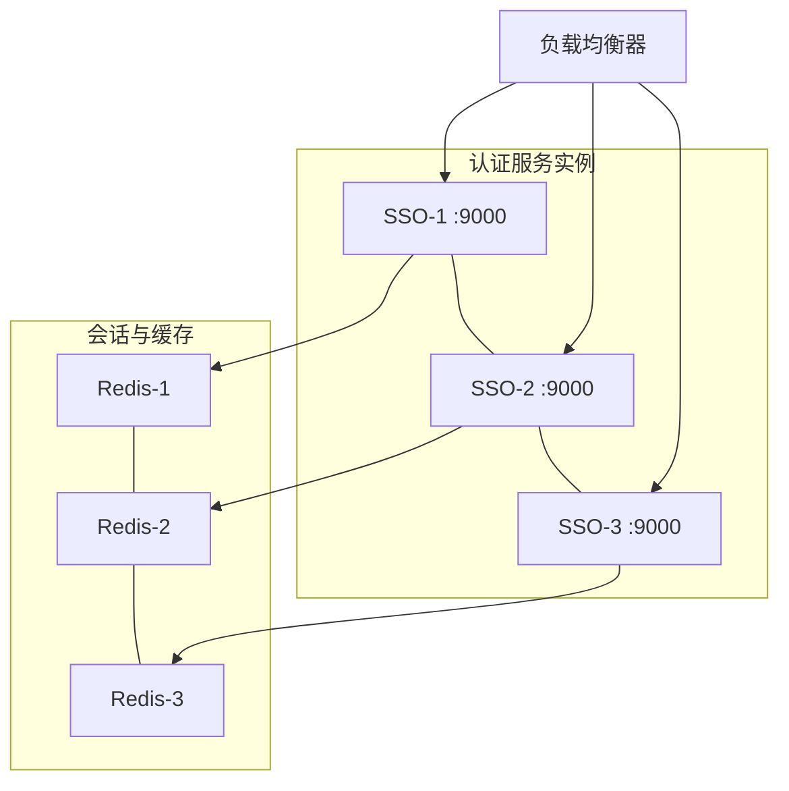
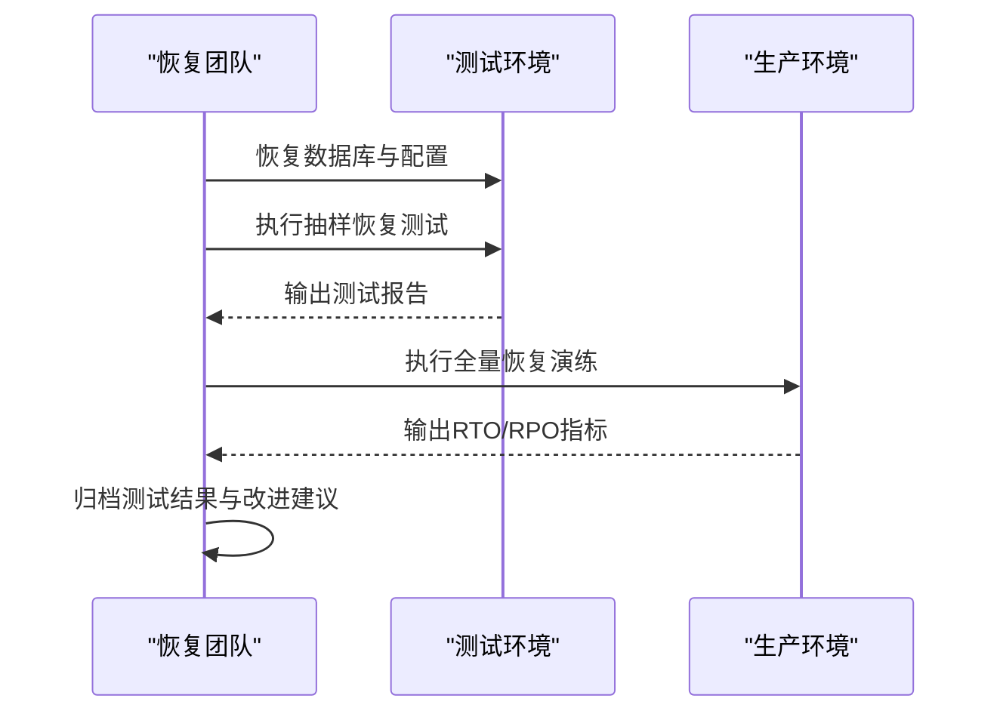
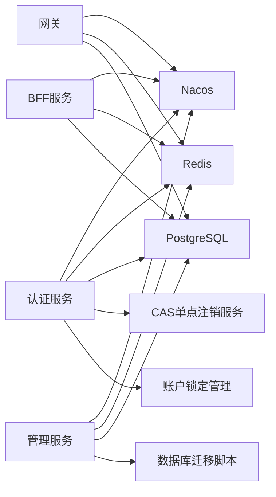

# 备份恢复

<cite>
**本文引用的文件**   
- [README.md](file://README.md)
- [docker-compose.yml](file://docker-compose.yml)
- [iam-admin-server/src/main/resources/application.yml](file://iam-admin-server/src/main/resources/application.yml)
- [iam-auth-server/src/main/resources/application.yml](file://iam-auth-server/src/main/resources/application.yml)
- [iam-bff-server/src/main/resources/application.yml](file://iam-bff-server/src/main/resources/application.yml)
- [iam-gateway/src/main/resources/application.yml](file://iam-gateway/src/main/resources/application.yml)
- [iam-admin-server/bootstrap.yml](file://iam-admin-server/bootstrap.yml)
- [iam-auth-server/bootstrap.yml](file://iam-auth-server/bootstrap.yml)
- [iam-bff-server/bootstrap.yml](file://iam-bff-server/bootstrap.yml)
- [iam-gateway/bootstrap.yml](file://iam-gateway/bootstrap.yml)
- [iam-admin-server/src/main/resources/db/migration/V1__complete_schema_initialization.sql](file://iam-admin-server/src/main/resources/db/migration/V1__complete_schema_initialization.sql)
- [iam-admin-server/src/main/java/iam/platform/admin/infrastructure/config/AuditProperties.java](file://iam-admin-server/src/main/java/iam/platform/admin/infrastructure/config/AuditProperties.java)
- [iam-admin-server/src/main/java/iam/platform/admin/infrastructure/config/AsyncConfig.java](file://iam-admin-server/src/main/java/iam/platform/admin/infrastructure/config/AsyncConfig.java)
- [iam-admin-server/src/main/java/iam/platform/admin/application/service/AuditApplicationService.java](file://iam-admin-server/src/main/java/iam/platform/admin/application/service/AuditApplicationService.java)
- [iam-auth-server/src/main/java/iam/platform/auth/application/service/CasSloService.java](file://iam-auth-server/src/main/java/iam/platform/auth/application/service/CasSloService.java)
- [iam-auth-server/src/main/java/iam/platform/auth/infrastructure/security/AccountLockoutManager.java](file://iam-auth-server/src/main/java/iam/platform/auth/infrastructure/security/AccountLockoutManager.java)
- [docs/archived/k8s/k8s/base/secret.yaml](file://docs/archived/k8s/k8s/base/secret.yaml)
- [.gitignore](file://.gitignore)
</cite>

## 目录
1. [简介](#简介)
2. [项目结构](#项目结构)
3. [核心组件](#核心组件)
4. [架构总览](#架构总览)
5. [详细组件分析](#详细组件分析)
6. [依赖关系分析](#依赖关系分析)
7. [性能考量](#性能考量)
8. [故障排查指南](#故障排查指南)
9. [结论](#结论)
10. [附录](#附录)

## 简介
本文件面向IAM平台的备份与恢复，围绕数据库、配置文件与日志三类关键资产，制定数据备份策略、备份频率与保留策略（含全量/增量/长期归档）、灾难恢复计划（RTO/RPO目标、恢复流程与验证程序）、数据库恢复技术（包含Point-in-Time Recovery与跨平台迁移思路）、配置恢复与环境重建流程（含Docker配置恢复与依赖服务重建）、业务连续性保障（高可用、故障切换与数据同步）、以及备份验证与恢复测试程序，确保备份数据的有效性与可恢复性。

## 项目结构
IAM平台采用多模块微服务架构，结合Docker Compose进行本地与开发环境编排，核心依赖PostgreSQL数据库与Redis缓存/会话存储。系统通过Nacos进行服务注册与发现，各服务通过Spring Profile隔离不同环境（dev/test/canary/prod）。数据库迁移由Flyway管理，审计日志具备异步写入与保留策略配置。

**图示来源**
- [docker-compose.yml:1-190](file://docker-compose.yml#L1-L190)

**章节来源**
- [README.md:95-108](file://README.md#L95-L108)
- [docker-compose.yml:1-190](file://docker-compose.yml#L1-L190)

## 核心组件
- 数据库：PostgreSQL 16（容器卷持久化），使用Flyway进行模式迁移与版本管理。
- 缓存与会话：Redis 7，用于分布式会话、速率限制与临时状态存储。
- 配置与密钥：Spring Profile与环境变量驱动；敏感配置通过Secret或外部密钥管理注入。
- 日志与审计：应用日志按文件输出；审计日志写入数据库并具备保留策略与异步线程池配置。
- 网关与服务：Spring Cloud Gateway路由至认证/管理服务；服务间通过Nacos注册发现。

**章节来源**
- [README.md:16-32](file://README.md#L16-L32)
- [iam-admin-server/src/main/resources/application.yml:10-51](file://iam-admin-server/src/main/resources/application.yml#L10-L51)
- [iam-auth-server/src/main/resources/application.yml:10-52](file://iam-auth-server/src/main/resources/application.yml#L10-L52)
- [iam-bff-server/src/main/resources/application.yml:10-24](file://iam-bff-server/src/main/resources/application.yml#L10-L24)
- [iam-gateway/src/main/resources/application.yml:10-91](file://iam-gateway/src/main/resources/application.yml#L10-L91)
- [docker-compose.yml:23-56](file://docker-compose.yml#L23-L56)

## 架构总览
下图展示备份与恢复涉及的关键数据流与依赖：

[此图为概念性示意，无需“图示来源”]

## 详细组件分析

### 数据库备份策略
- 备份范围：PostgreSQL数据库（包含所有业务表、OAuth2授权表、审计日志表等）。
- 备份类型：
  - 全量备份：每日一次，保留7天。
  - 增量备份：每小时一次，保留24小时。
  - 长期归档：每周全量与月度全量打包归档，保留12个月。
- 存储位置：本地文件系统或对象存储（建议S3兼容存储），分环境独立目录。
- 备份触发：CI/CD流水线或定时任务触发，失败告警。
- 验证：每次备份后执行校验与抽样恢复测试。

[此图为通用流程示意，无需“图示来源”]

**章节来源**
- [iam-admin-server/src/main/resources/db/migration/V1__complete_schema_initialization.sql:1-720](file://iam-admin-server/src/main/resources/db/migration/V1__complete_schema_initialization.sql#L1-L720)
- [docker-compose.yml:33-34](file://docker-compose.yml#L33-L34)

### 数据库恢复技术
- Point-in-Time Recovery（PITR）：
  - 利用PostgreSQL WAL归档与时间点定位，将数据库恢复到指定时间戳。
  - 步骤概要：停止实例、恢复全量备份、应用WAL至目标时间、启动实例。
- 跨平台迁移：
  - 在目标平台重建PostgreSQL实例，导入全量备份并应用WAL，验证业务表完整性与索引。
  - 注意：版本兼容性（如从14迁移到16）、字符集与时区设置一致性。

[此图为通用流程示意，无需“图示来源”]

**章节来源**
- [iam-admin-server/src/main/resources/db/migration/V1__complete_schema_initialization.sql:1-720](file://iam-admin-server/src/main/resources/db/migration/V1__complete_schema_initialization.sql#L1-L720)

### 配置文件备份与恢复
- 配置来源：
  - Spring Profile配置文件（application.yml）与引导配置（bootstrap.yml）。
  - Docker Compose环境变量与卷挂载。
  - Kubernetes Secret（如存在）。
- 备份内容：所有application-*.yml、bootstrap.yml、docker-compose.yml、Secret YAML等。
- 恢复流程：
  - 从备份中恢复配置文件与密钥。
  - 更新环境变量与容器参数，重启服务。
  - 验证服务连通性与关键端点（健康检查、OIDC发现、Swagger）。

[此图为通用流程示意，无需“图示来源”]

**章节来源**
- [iam-admin-server/src/main/resources/application.yml:10-102](file://iam-admin-server/src/main/resources/application.yml#L10-L102)
- [iam-auth-server/src/main/resources/application.yml:10-144](file://iam-auth-server/src/main/resources/application.yml#L10-L144)
- [iam-bff-server/src/main/resources/application.yml:10-54](file://iam-bff-server/src/main/resources/application.yml#L10-L54)
- [iam-gateway/src/main/resources/application.yml:10-116](file://iam-gateway/src/main/resources/application.yml#L10-L116)
- [iam-admin-server/bootstrap.yml:1-10](file://iam-admin-server/bootstrap.yml#L1-L10)
- [iam-auth-server/bootstrap.yml:1-10](file://iam-auth-server/bootstrap.yml#L1-L10)
- [iam-bff-server/bootstrap.yml:1-10](file://iam-bff-server/bootstrap.yml#L1-L10)
- [iam-gateway/bootstrap.yml:1-10](file://iam-gateway/bootstrap.yml#L1-L10)
- [docker-compose.yml:1-190](file://docker-compose.yml#L1-L190)
- [docs/archived/k8s/k8s/base/secret.yaml:1-10](file://docs/archived/k8s/k8s/base/secret.yaml#L1-L10)

### 日志文件备份与保留
- 日志来源：应用日志文件（按.gitignore规则排除敏感文件）、审计日志表。
- 备份策略：
  - 应用日志：按天压缩归档，保留30天；敏感日志（私钥、证书）不纳入常规备份。
  - 审计日志：数据库表保留180天，定期清理过期记录。
- 清理与保留：审计日志清理函数按保留天数自动删除过期记录。

[此图为通用流程示意，无需“图示来源”]

**章节来源**
- [.gitignore:4-97](file://.gitignore#L4-L97)
- [iam-admin-server/src/main/java/iam/platform/admin/infrastructure/config/AuditProperties.java:1-36](file://iam-admin-server/src/main/java/iam/platform/admin/infrastructure/config/AuditProperties.java#L1-L36)
- [iam-admin-server/src/main/resources/db/migration/V1__complete_schema_initialization.sql:560-576](file://iam-admin-server/src/main/resources/db/migration/V1__complete_schema_initialization.sql#L560-L576)

### 业务连续性保障
- 高可用与故障切换：
  - Redis集群化部署，会话集中存储，实现无状态水平扩展。
  - PostgreSQL主从复制或托管高可用方案，配合自动故障转移。
- 数据同步：
  - 通过Redis实现会话与速率限制的全局一致。
  - 数据库层面通过WAL与逻辑复制保持主从同步。
- 网关与服务：
  - Spring Cloud Gateway路由与限流策略，结合Redis实现全局限速。

[此图为概念性示意，无需“图示来源”]

**章节来源**
- [iam-auth-server/src/main/resources/application.yml:49-52](file://iam-auth-server/src/main/resources/application.yml#L49-L52)
- [iam-admin-server/src/main/resources/application.yml:47-50](file://iam-admin-server/src/main/resources/application.yml#L47-L50)
- [docs/design/Spring Authorization Server 原理与流程.md:202-222](file://docs/design/Spring Authorization Server 原理与流程.md#L202-L222)

### 备份验证与恢复测试
- 验证清单：
  - 数据库：校验备份完整性、索引与约束存在性、关键表数据条数一致性。
  - 配置：校验密钥与连接参数正确、服务可正常启动。
  - 日志：审计日志清理函数可执行、保留策略生效。
- 恢复测试：
  - 小规模抽样恢复（随机抽取10%业务表），验证查询与业务流程。
  - 全量恢复演练（按RTO目标进行），记录耗时与问题。
- 回归验证：
  - 健康检查端点、OIDC发现端点、Swagger UI、登录与授权流程。

[此图为通用流程示意，无需“图示来源”]

**章节来源**
- [iam-admin-server/src/main/java/iam/platform/admin/application/service/AuditApplicationService.java:168-191](file://iam-admin-server/src/main/java/iam/platform/admin/application/service/AuditApplicationService.java#L168-L191)
- [iam-admin-server/src/main/resources/db/migration/V1__complete_schema_initialization.sql:560-576](file://iam-admin-server/src/main/resources/db/migration/V1__complete_schema_initialization.sql#L560-L576)

## 依赖关系分析
- 服务依赖：
  - 网关依赖Redis与Nacos；认证/管理/BFF服务均依赖PostgreSQL与Redis。
  - 各服务通过bootstrap.yml接入Nacos命名空间与组。
- 数据依赖：
  - 数据库迁移脚本定义了完整的schema与种子数据，是恢复后初始化的基础。
  - 审计日志表与清理函数构成日志保留策略的技术基础。

**图示来源**
- [iam-gateway/bootstrap.yml:1-10](file://iam-gateway/bootstrap.yml#L1-L10)
- [iam-auth-server/bootstrap.yml:1-10](file://iam-auth-server/bootstrap.yml#L1-L10)
- [iam-admin-server/bootstrap.yml:1-10](file://iam-admin-server/bootstrap.yml#L1-L10)
- [iam-bff-server/bootstrap.yml:1-10](file://iam-bff-server/bootstrap.yml#L1-L10)
- [iam-admin-server/src/main/resources/db/migration/V1__complete_schema_initialization.sql:1-720](file://iam-admin-server/src/main/resources/db/migration/V1__complete_schema_initialization.sql#L1-L720)
- [iam-auth-server/src/main/java/iam/platform/auth/application/service/CasSloService.java:68-105](file://iam-auth-server/src/main/java/iam/platform/auth/application/service/CasSloService.java#L68-L105)
- [iam-auth-server/src/main/java/iam/platform/auth/infrastructure/security/AccountLockoutManager.java:95-134](file://iam-auth-server/src/main/java/iam/platform/auth/infrastructure/security/AccountLockoutManager.java#L95-L134)

**章节来源**
- [iam-gateway/src/main/resources/application.yml:10-91](file://iam-gateway/src/main/resources/application.yml#L10-L91)
- [iam-auth-server/src/main/resources/application.yml:10-52](file://iam-auth-server/src/main/resources/application.yml#L10-L52)
- [iam-admin-server/src/main/resources/application.yml:10-51](file://iam-admin-server/src/main/resources/application.yml#L10-L51)
- [iam-bff-server/src/main/resources/application.yml:10-24](file://iam-bff-server/src/main/resources/application.yml#L10-L24)

## 性能考量
- 备份性能：
  - 全量备份在业务低峰时段执行；增量备份频率根据数据变化率调整。
  - 使用并发与分片策略提升备份/恢复吞吐。
- 恢复性能：
  - 恢复顺序：先恢复数据库与Redis，再恢复配置，最后启动服务。
  - 预热：恢复后执行关键查询与登录流程以预热缓存。
- 可观测性：
  - 健康检查端点与指标暴露，便于监控备份/恢复状态。

[本节为通用指导，无需“章节来源”]

## 故障排查指南
- 数据库异常：
  - 检查PostgreSQL健康检查与WAL归档状态；核对备份文件完整性。
- 缓存异常：
  - 检查Redis连接参数与密码；确认会话存储可用。
- 配置异常：
  - 核对bootstrap.yml中的Nacos地址与命名空间；确认application-*.yml加载顺序。
- 审计日志异常：
  - 检查异步线程池配置与队列容量；确认保留天数设置合理。

**章节来源**
- [docker-compose.yml:37-41](file://docker-compose.yml#L37-L41)
- [docker-compose.yml:52-56](file://docker-compose.yml#L52-L56)
- [iam-admin-server/src/main/java/iam/platform/admin/infrastructure/config/AsyncConfig.java:1-30](file://iam-admin-server/src/main/java/iam/platform/admin/infrastructure/config/AsyncConfig.java#L1-L30)
- [iam-admin-server/src/main/java/iam/platform/admin/infrastructure/config/AuditProperties.java:1-36](file://iam-admin-server/src/main/java/iam/platform/admin/infrastructure/config/AuditProperties.java#L1-L36)

## 结论
通过明确的备份策略（全量/增量/归档）、严格的保留与验证流程、完善的数据库恢复技术（PITR与跨平台迁移）、可靠的配置与环境重建流程、以及业务连续性保障与恢复测试体系，IAM平台可在发生灾难时快速、准确地恢复服务，满足RTO/RPO目标，并持续提升恢复能力与稳定性。

[本节为总结性内容，无需“章节来源”]

## 附录
- 关键配置要点：
  - 数据库连接：主机、端口、用户名、密码、数据库名。
  - Redis连接：主机、端口、密码、命名空间。
  - Nacos注册：地址、命名空间、组。
  - 审计日志：保留天数、异步线程池大小与队列容量。
- 建议的备份保留策略：
  - 全量：7天
  - 增量：24小时
  - 长期归档：12个月
- RTO/RPO目标建议：
  - RTO：全量恢复不超过2小时，增量恢复不超过15分钟。
  - RPO：基于WAL归档与时间点恢复，目标为分钟级。

[本节为通用附录，无需“章节来源”]