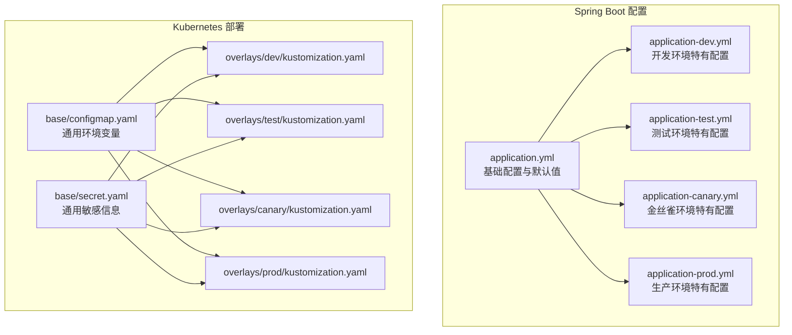
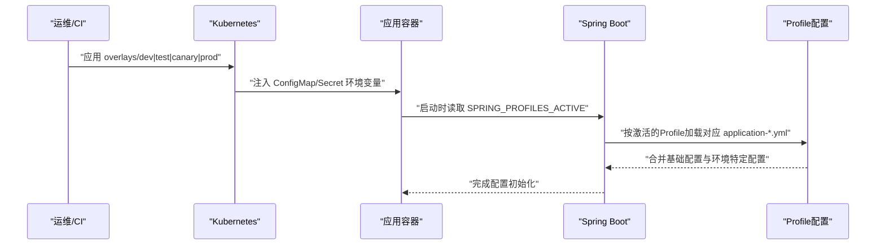
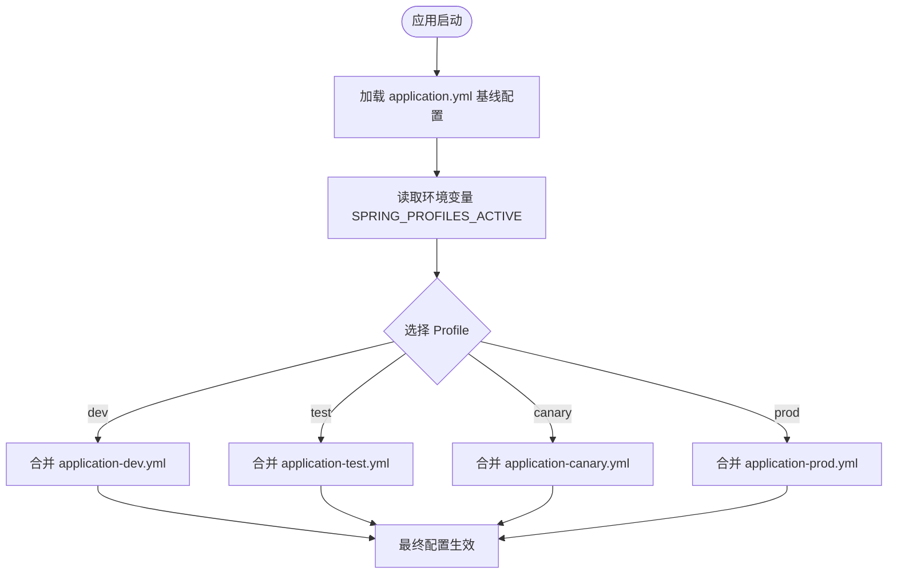
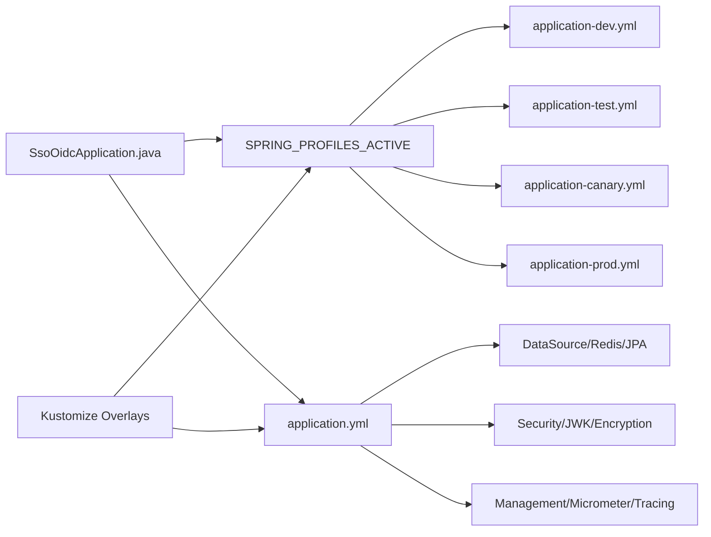

# 多环境配置

<cite>
**本文引用的文件**
- [application.yml](file://src/main/resources/application.yml)
- [application-dev.yml](file://src/main/resources/application-dev.yml)
- [application-test.yml](file://src/main/resources/application-test.yml)
- [application-canary.yml](file://src/main/resources/application-canary.yml)
- [application-prod.yml](file://src/main/resources/application-prod.yml)
- [SsoOidcApplication.java](file://src/main/java/sso/oidc/SsoOidcApplication.java)
- [RedisConfig.java](file://src/main/java/sso/oidc/infrastructure/config/RedisConfig.java)
- [JwkProperties.java](file://src/main/java/sso/oidc/infrastructure/config/JwkProperties.java)
- [EncryptedStringConverter.java](file://src/main/java/sso/oidc/infrastructure/persistence/converter/EncryptedStringConverter.java)
- [configmap.yaml](file://k8s/base/configmap.yaml)
- [secret.yaml](file://k8s/base/secret.yaml)
- [dev/kustomization.yaml](file://k8s/overlays/dev/kustomization.yaml)
- [test/kustomization.yaml](file://k8s/overlays/test/kustomization.yaml)
- [canary/kustomization.yaml](file://k8s/overlays/canary/kustomization.yaml)
- [prod/kustomization.yaml](file://k8s/overlays/prod/kustomization.yaml)
</cite>

## 目录
1. [简介](#简介)
2. [项目结构](#项目结构)
3. [核心组件](#核心组件)
4. [架构总览](#架构总览)
5. [详细组件分析](#详细组件分析)
6. [依赖分析](#依赖分析)
7. [性能考虑](#性能考虑)
8. [故障排除指南](#故障排除指南)
9. [结论](#结论)
10. [附录](#附录)

## 简介
本文件系统性阐述该SSO/OIDC服务的多环境配置管理方案，重点覆盖以下方面：
- Spring Profile的激活与优先级规则
- 各环境配置文件（dev/test/canary/prod）的差异与配置要点
- 配置属性覆盖机制、环境变量注入与密钥管理策略
- 高级配置技巧：配置热更新、配置加密、敏感信息保护
- 配置验证与故障排除方法

## 项目结构
该工程采用“Spring Boot配置文件 + Kubernetes Kustomize Overlay”的双层环境化设计：
- Spring Boot侧通过 application.yml 及其 profile 特定文件实现配置分层与覆盖
- Kubernetes侧通过 base 与 overlays 实现命名空间、镜像标签、资源副本与环境变量的差异化部署

图表来源
- [application.yml:1-78](file://src/main/resources/application.yml#L1-L78)
- [application-dev.yml:1-22](file://src/main/resources/application-dev.yml#L1-L22)
- [application-test.yml:1-16](file://src/main/resources/application-test.yml#L1-L16)
- [application-canary.yml:1-15](file://src/main/resources/application-canary.yml#L1-L15)
- [application-prod.yml:1-25](file://src/main/resources/application-prod.yml#L1-L25)
- [configmap.yaml:1-14](file://k8s/base/configmap.yaml#L1-L14)
- [secret.yaml:1-11](file://k8s/base/secret.yaml#L1-L11)
- [dev/kustomization.yaml:1-23](file://k8s/overlays/dev/kustomization.yaml#L1-L23)
- [test/kustomization.yaml:1-23](file://k8s/overlays/test/kustomization.yaml#L1-L23)
- [canary/kustomization.yaml:1-29](file://k8s/overlays/canary/kustomization.yaml#L1-L29)
- [prod/kustomization.yaml:1-50](file://k8s/overlays/prod/kustomization.yaml#L1-L50)

章节来源
- [application.yml:1-78](file://src/main/resources/application.yml#L1-L78)
- [configmap.yaml:1-14](file://k8s/base/configmap.yaml#L1-L14)
- [secret.yaml:1-11](file://k8s/base/secret.yaml#L1-L11)

## 核心组件
- 应用入口与Profile激活
  - 应用入口类负责启动Spring Boot应用，Profile由环境变量控制，未设置时默认为开发环境。
  - 关键路径：[SsoOidcApplication.java:1-13](file://src/main/java/sso/oidc/SsoOidcApplication.java#L1-L13)，[application.yml:7-8](file://src/main/resources/application.yml#L7-L8)

- 配置文件与覆盖机制
  - application.yml 定义基础配置与默认值；各profile文件仅声明差异项，遵循“后加载覆盖先加载”的原则。
  - 关键路径：[application.yml:1-78](file://src/main/resources/application.yml#L1-L78)，[application-dev.yml:1-22](file://src/main/resources/application-dev.yml#L1-L22)，[application-test.yml:1-16](file://src/main/resources/application-test.yml#L1-L16)，[application-canary.yml:1-15](file://src/main/resources/application-canary.yml#L1-L15)，[application-prod.yml:1-25](file://src/main/resources/application-prod.yml#L1-L25)

- 缓存与会话配置
  - Redis缓存管理器在运行期生效，受Spring配置影响。
  - 关键路径：[RedisConfig.java:1-34](file://src/main/java/sso/oidc/infrastructure/config/RedisConfig.java#L1-L34)，[application.yml:27-46](file://src/main/resources/application.yml#L27-L46)

- 密钥与JWK配置
  - JWK RSA私钥/公钥位置通过配置前缀绑定，支持从环境变量注入。
  - 关键路径：[JwkProperties.java:1-16](file://src/main/java/sso/oidc/infrastructure/config/JwkProperties.java#L1-L16)，[application.yml:48-55](file://src/main/resources/application.yml#L48-L55)

- 数据库字段加解密转换器
  - 使用系统环境变量中的对称密钥对数据库字段进行透明加解密。
  - 关键路径：[EncryptedStringConverter.java:1-52](file://src/main/java/sso/oidc/infrastructure/persistence/converter/EncryptedStringConverter.java#L1-L52)，[application.yml:53-54](file://src/main/resources/application.yml#L53-L54)

章节来源
- [SsoOidcApplication.java:1-13](file://src/main/java/sso/oidc/SsoOidcApplication.java#L1-L13)
- [application.yml:1-78](file://src/main/resources/application.yml#L1-L78)
- [RedisConfig.java:1-34](file://src/main/java/sso/oidc/infrastructure/config/RedisConfig.java#L1-L34)
- [JwkProperties.java:1-16](file://src/main/java/sso/oidc/infrastructure/config/JwkProperties.java#L1-L16)
- [EncryptedStringConverter.java:1-52](file://src/main/java/sso/oidc/infrastructure/persistence/converter/EncryptedStringConverter.java#L1-L52)

## 架构总览
下图展示从Kubernetes到Spring Boot的配置注入与生效路径，以及各环境的差异化点。

图表来源
- [configmap.yaml:1-14](file://k8s/base/configmap.yaml#L1-L14)
- [secret.yaml:1-11](file://k8s/base/secret.yaml#L1-L11)
- [dev/kustomization.yaml:15-22](file://k8s/overlays/dev/kustomization.yaml#L15-L22)
- [test/kustomization.yaml:15-22](file://k8s/overlays/test/kustomization.yaml#L15-L22)
- [canary/kustomization.yaml:14-21](file://k8s/overlays/canary/kustomization.yaml#L14-L21)
- [prod/kustomization.yaml:14-30](file://k8s/overlays/prod/kustomization.yaml#L14-L30)
- [application.yml:7-8](file://src/main/resources/application.yml#L7-L8)

## 详细组件分析

### Spring Profile 激活与优先级
- 激活方式
  - 通过环境变量 SPRING_PROFILES_ACTIVE 控制，未设置时默认 dev。
  - 关键路径：[application.yml:7-8](file://src/main/resources/application.yml#L7-L8)，[dev/kustomization.yaml:20-22](file://k8s/overlays/dev/kustomization.yaml#L20-L22)，[test/kustomization.yaml:20-22](file://k8s/overlays/test/kustomization.yaml#L20-L22)，[canary/kustomization.yaml:19-21](file://k8s/overlays/canary/kustomization.yaml#L19-L21)，[prod/kustomization.yaml:18-21](file://k8s/overlays/prod/kustomization.yaml#L18-L21)

- 加载顺序与覆盖规则
  - application.yml 作为默认基线，随后按激活的 profile 文件叠加覆盖。
  - 覆盖范围包括数据源、日志级别、缓存、Swagger、监控采样率等。
  - 关键路径：[application.yml:1-78](file://src/main/resources/application.yml#L1-L78)，[application-dev.yml:1-22](file://src/main/resources/application-dev.yml#L1-L22)，[application-test.yml:1-16](file://src/main/resources/application-test.yml#L1-L16)，[application-canary.yml:1-15](file://src/main/resources/application-canary.yml#L1-L15)，[application-prod.yml:1-25](file://src/main/resources/application-prod.yml#L1-L25)

图表来源
- [application.yml:7-8](file://src/main/resources/application.yml#L7-L8)
- [application-dev.yml:1-22](file://src/main/resources/application-dev.yml#L1-L22)
- [application-test.yml:1-16](file://src/main/resources/application-test.yml#L1-L16)
- [application-canary.yml:1-15](file://src/main/resources/application-canary.yml#L1-L15)
- [application-prod.yml:1-25](file://src/main/resources/application-prod.yml#L1-L25)

章节来源
- [application.yml:7-8](file://src/main/resources/application.yml#L7-L8)
- [application-dev.yml:1-22](file://src/main/resources/application-dev.yml#L1-L22)
- [application-test.yml:1-16](file://src/main/resources/application-test.yml#L1-L16)
- [application-canary.yml:1-15](file://src/main/resources/application-canary.yml#L1-L15)
- [application-prod.yml:1-25](file://src/main/resources/application-prod.yml#L1-L25)

### 开发环境(dev)
- 配置要点
  - 开启SQL输出与格式化，便于调试
  - Thymeleaf禁用缓存
  - Swagger UI启用
  - 日志级别提升，便于问题定位
- 关键路径：[application-dev.yml:1-22](file://src/main/resources/application-dev.yml#L1-L22)

章节来源
- [application-dev.yml:1-22](file://src/main/resources/application-dev.yml#L1-L22)

### 测试环境(test)
- 配置要点
  - 关闭SQL输出
  - Thymeleaf禁用缓存
  - Swagger UI启用
  - 日志级别适中
- 关键路径：[application-test.yml:1-16](file://src/main/resources/application-test.yml#L1-L16)

章节来源
- [application-test.yml:1-16](file://src/main/resources/application-test.yml#L1-L16)

### 金丝雀环境(canary)
- 配置要点
  - SQL输出关闭
  - Thymeleaf开启缓存
  - Swagger UI禁用
  - 日志级别收敛至INFO
- 关键路径：[application-canary.yml:1-15](file://src/main/resources/application-canary.yml#L1-L15)

章节来源
- [application-canary.yml:1-15](file://src/main/resources/application-canary.yml#L1-L15)

### 生产环境(prod)
- 配置要点
  - SQL输出关闭
  - Thymeleaf开启缓存
  - Swagger UI禁用
  - 日志级别收敛至INFO/WARN
  - 连接池参数优化
  - 监控采样率降低
- 关键路径：[application-prod.yml:1-25](file://src/main/resources/application-prod.yml#L1-L25)

章节来源
- [application-prod.yml:1-25](file://src/main/resources/application-prod.yml#L1-L25)

### 环境变量注入与Kubernetes集成
- ConfigMap
  - 提供非敏感的运行参数，如数据库主机、端口、Redis地址、Zipkin端点、Issuer URI等
  - 关键路径：[configmap.yaml:1-14](file://k8s/base/configmap.yaml#L1-L14)，[dev/kustomization.yaml:15-22](file://k8s/overlays/dev/kustomization.yaml#L15-L22)，[test/kustomization.yaml:15-22](file://k8s/overlays/test/kustomization.yaml#L15-L22)，[canary/kustomization.yaml:14-21](file://k8s/overlays/canary/kustomization.yaml#L14-L21)，[prod/kustomization.yaml:14-30](file://k8s/overlays/prod/kustomization.yaml#L14-L30)

- Secret
  - 存放敏感信息，如数据库凭据、Redis密码、加密密钥
  - 关键路径：[secret.yaml:1-11](file://k8s/base/secret.yaml#L1-L11)，[prod/kustomization.yaml:14-30](file://k8s/overlays/prod/kustomization.yaml#L14-L30)

- Overlay差异化
  - 不同Overlay仅变更SPRING_PROFILES_ACTIVE与少量环境变量，确保最小化差异
  - 关键路径：[dev/kustomization.yaml:1-23](file://k8s/overlays/dev/kustomization.yaml#L1-L23)，[test/kustomization.yaml:1-23](file://k8s/overlays/test/kustomization.yaml#L1-L23)，[canary/kustomization.yaml:1-29](file://k8s/overlays/canary/kustomization.yaml#L1-L29)，[prod/kustomization.yaml:1-50](file://k8s/overlays/prod/kustomization.yaml#L1-L50)

章节来源
- [configmap.yaml:1-14](file://k8s/base/configmap.yaml#L1-L14)
- [secret.yaml:1-11](file://k8s/base/secret.yaml#L1-L11)
- [dev/kustomization.yaml:1-23](file://k8s/overlays/dev/kustomization.yaml#L1-L23)
- [test/kustomization.yaml:1-23](file://k8s/overlays/test/kustomization.yaml#L1-L23)
- [canary/kustomization.yaml:1-29](file://k8s/overlays/canary/kustomization.yaml#L1-L29)
- [prod/kustomization.yaml:1-50](file://k8s/overlays/prod/kustomization.yaml#L1-L50)

### 配置属性覆盖机制与环境变量注入
- 覆盖链路
  - application.yml 默认值
  - 环境变量（Kubernetes注入）
  - 激活的 profile 文件
- 注入示例
  - 数据库连接：SPRING_PROFILES_ACTIVE、DB_HOST、DB_PORT、DB_NAME、DB_USERNAME、DB_PASSWORD
  - 缓存与会话：REDIS_HOST、REDIS_PORT、REDIS_PASSWORD
  - 安全与密钥：JWK RSA路径、ENCRYPTION_KEY
  - 监控与追踪：ZIPKIN_ENDPOINT
- 关键路径：[application.yml:1-78](file://src/main/resources/application.yml#L1-L78)，[configmap.yaml:1-14](file://k8s/base/configmap.yaml#L1-L14)，[secret.yaml:1-11](file://k8s/base/secret.yaml#L1-L11)

章节来源
- [application.yml:1-78](file://src/main/resources/application.yml#L1-L78)
- [configmap.yaml:1-14](file://k8s/base/configmap.yaml#L1-L14)
- [secret.yaml:1-11](file://k8s/base/secret.yaml#L1-L11)

### 密钥管理策略
- JWK密钥对
  - 私钥/公钥路径通过配置前缀绑定，支持从环境变量注入
  - 关键路径：[JwkProperties.java:1-16](file://src/main/java/sso/oidc/infrastructure/config/JwkProperties.java#L1-L16)，[application.yml:48-55](file://src/main/resources/application.yml#L48-L55)

- 数据库字段加密
  - 使用系统环境变量中的对称密钥对字段进行透明加解密
  - 关键路径：[EncryptedStringConverter.java:1-52](file://src/main/java/sso/oidc/infrastructure/persistence/converter/EncryptedStringConverter.java#L1-L52)，[application.yml:53-54](file://src/main/resources/application.yml#L53-L54)

- 最佳实践
  - 将密钥存储于Kubernetes Secret，并通过Overlay注入
  - 生产环境必须轮换密钥，避免硬编码
  - 对外暴露的Issuer URI需使用HTTPS

章节来源
- [JwkProperties.java:1-16](file://src/main/java/sso/oidc/infrastructure/config/JwkProperties.java#L1-L16)
- [EncryptedStringConverter.java:1-52](file://src/main/java/sso/oidc/infrastructure/persistence/converter/EncryptedStringConverter.java#L1-L52)
- [application.yml:48-55](file://src/main/resources/application.yml#L48-L55)

### 高级配置技巧

#### 配置热更新
- 建议方案
  - 使用Spring Cloud Config或Kubernetes ConfigMap热更新配合滚动重启
  - 对于不涉及进程重启的配置（如日志级别），可结合Actuator动态刷新端点
- 注意事项
  - 避免在运行时修改数据库连接、密钥等关键参数
  - 在金丝雀发布阶段逐步切换配置，观察指标与日志

#### 配置加密
- 字段级加密
  - 已实现基于系统环境变量的对称加密转换器，适用于敏感字段持久化
- 配置级加密
  - 建议引入Spring Cloud Vault或KMS服务对敏感配置进行加密存储与解密注入

#### 敏感信息保护
- 使用Kubernetes Secret管理数据库凭据、Redis密码、加密密钥
- 生产环境强制启用HTTPS与安全传输
- 审计与轮换：定期轮换密钥与凭据，最小权限访问

章节来源
- [EncryptedStringConverter.java:1-52](file://src/main/java/sso/oidc/infrastructure/persistence/converter/EncryptedStringConverter.java#L1-L52)
- [secret.yaml:1-11](file://k8s/base/secret.yaml#L1-L11)

## 依赖分析
- 组件耦合
  - 应用入口类与Spring Boot自动装配强耦合，Profile通过环境变量弱耦合
  - 配置类（如JwkProperties）与application.yml通过前缀绑定弱耦合
  - 加密转换器与系统环境变量弱耦合
- 外部依赖
  - Kubernetes ConfigMap/Secret用于环境变量注入
  - Kustomize Overlay用于环境差异化

图表来源
- [SsoOidcApplication.java:1-13](file://src/main/java/sso/oidc/SsoOidcApplication.java#L1-L13)
- [application.yml:1-78](file://src/main/resources/application.yml#L1-L78)
- [application-dev.yml:1-22](file://src/main/resources/application-dev.yml#L1-L22)
- [application-test.yml:1-16](file://src/main/resources/application-test.yml#L1-L16)
- [application-canary.yml:1-15](file://src/main/resources/application-canary.yml#L1-L15)
- [application-prod.yml:1-25](file://src/main/resources/application-prod.yml#L1-L25)
- [dev/kustomization.yaml:1-23](file://k8s/overlays/dev/kustomization.yaml#L1-L23)
- [test/kustomization.yaml:1-23](file://k8s/overlays/test/kustomization.yaml#L1-L23)
- [canary/kustomization.yaml:1-29](file://k8s/overlays/canary/kustomization.yaml#L1-L29)
- [prod/kustomization.yaml:1-50](file://k8s/overlays/prod/kustomization.yaml#L1-L50)

章节来源
- [SsoOidcApplication.java:1-13](file://src/main/java/sso/oidc/SsoOidcApplication.java#L1-L13)
- [application.yml:1-78](file://src/main/resources/application.yml#L1-L78)

## 性能考虑
- 连接池与缓存
  - 生产环境提高最大连接数与空闲连接数，合理设置TTL与序列化策略
  - 关键路径：[application.yml:13-18](file://src/main/resources/application.yml#L13-L18)，[RedisConfig.java:1-34](file://src/main/java/sso/oidc/infrastructure/config/RedisConfig.java#L1-L34)

- 日志与追踪
  - 生产环境降低日志级别与追踪采样率，减少开销
  - 关键路径：[application-prod.yml:1-25](file://src/main/resources/application-prod.yml#L1-L25)

- 模板与静态资源
  - 生产环境开启模板缓存，避免开发期频繁I/O
  - 关键路径：[application-canary.yml:1-15](file://src/main/resources/application-canary.yml#L1-L15)，[application-prod.yml:1-25](file://src/main/resources/application-prod.yml#L1-L25)

章节来源
- [application.yml:13-18](file://src/main/resources/application.yml#L13-L18)
- [RedisConfig.java:1-34](file://src/main/java/sso/oidc/infrastructure/config/RedisConfig.java#L1-L34)
- [application-prod.yml:1-25](file://src/main/resources/application-prod.yml#L1-L25)
- [application-canary.yml:1-15](file://src/main/resources/application-canary.yml#L1-L15)

## 故障排除指南
- Profile未生效
  - 检查环境变量 SPRING_PROFILES_ACTIVE 是否正确注入
  - 关键路径：[application.yml:7-8](file://src/main/resources/application.yml#L7-L8)，[dev/kustomization.yaml:20-22](file://k8s/overlays/dev/kustomization.yaml#L20-L22)

- 数据库连接失败
  - 核对DB_HOST/DB_PORT/DB_NAME/DB_USERNAME/DB_PASSWORD是否注入
  - 关键路径：[configmap.yaml:7-12](file://k8s/base/configmap.yaml#L7-L12)，[secret.yaml:7-10](file://k8s/base/secret.yaml#L7-L10)

- Redis连接异常
  - 核对REDIS_HOST/REDIS_PORT/REDIS_PASSWORD
  - 关键路径：[application.yml:28-31](file://src/main/resources/application.yml#L28-L31)，[configmap.yaml:10-11](file://k8s/base/configmap.yaml#L10-L11)

- JWK密钥加载失败
  - 核对JWK RSA私钥/公钥路径与权限
  - 关键路径：[application.yml:48-55](file://src/main/resources/application.yml#L48-L55)，[JwkProperties.java:1-16](file://src/main/java/sso/oidc/infrastructure/config/JwkProperties.java#L1-L16)

- 字段加密异常
  - 确认ENCRYPTION_KEY已注入且长度满足要求
  - 关键路径：[application.yml:53-54](file://src/main/resources/application.yml#L53-L54)，[EncryptedStringConverter.java:1-52](file://src/main/java/sso/oidc/infrastructure/persistence/converter/EncryptedStringConverter.java#L1-L52)

- Swagger不可用
  - 检查各环境Swagger开关状态
  - 关键路径：[application-dev.yml:19-21](file://src/main/resources/application-dev.yml#L19-L21)，[application-test.yml:13-15](file://src/main/resources/application-test.yml#L13-L15)，[application-canary.yml:12-14](file://src/main/resources/application-canary.yml#L12-L14)，[application-prod.yml:17-19](file://src/main/resources/application-prod.yml#L17-L19)

章节来源
- [application.yml:7-8](file://src/main/resources/application.yml#L7-L8)
- [configmap.yaml:7-12](file://k8s/base/configmap.yaml#L7-L12)
- [secret.yaml:7-10](file://k8s/base/secret.yaml#L7-L10)
- [JwkProperties.java:1-16](file://src/main/java/sso/oidc/infrastructure/config/JwkProperties.java#L1-L16)
- [EncryptedStringConverter.java:1-52](file://src/main/java/sso/oidc/infrastructure/persistence/converter/EncryptedStringConverter.java#L1-L52)
- [application-dev.yml:19-21](file://src/main/resources/application-dev.yml#L19-L21)
- [application-test.yml:13-15](file://src/main/resources/application-test.yml#L13-L15)
- [application-canary.yml:12-14](file://src/main/resources/application-canary.yml#L12-L14)
- [application-prod.yml:17-19](file://src/main/resources/application-prod.yml#L17-L19)

## 结论
本项目通过“Spring Boot Profile + Kustomize Overlay”的组合实现了清晰、可维护的多环境配置体系。建议在现有基础上进一步完善：
- 引入配置中心与密钥管理服务，实现配置与密钥的集中治理
- 在CI流程中增加配置校验步骤，确保关键参数完整性
- 对生产环境实施严格的变更审批与回滚预案

## 附录
- 快速对照表（关键参数）
  - Profile激活：SPRING_PROFILES_ACTIVE
  - 数据库：DB_HOST/DB_PORT/DB_NAME/DB_USERNAME/DB_PASSWORD
  - 缓存：REDIS_HOST/REDIS_PORT/REDIS_PASSWORD
  - 安全：JWK私钥/公钥路径、ENCRYPTION_KEY
  - 监控：ZIPKIN_ENDPOINT、采样概率
  - 关键路径：[application.yml:1-78](file://src/main/resources/application.yml#L1-L78)，[configmap.yaml:1-14](file://k8s/base/configmap.yaml#L1-L14)，[secret.yaml:1-11](file://k8s/base/secret.yaml#L1-L11)