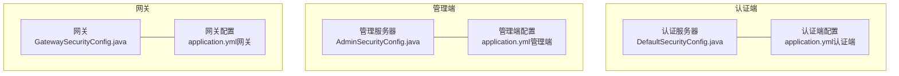
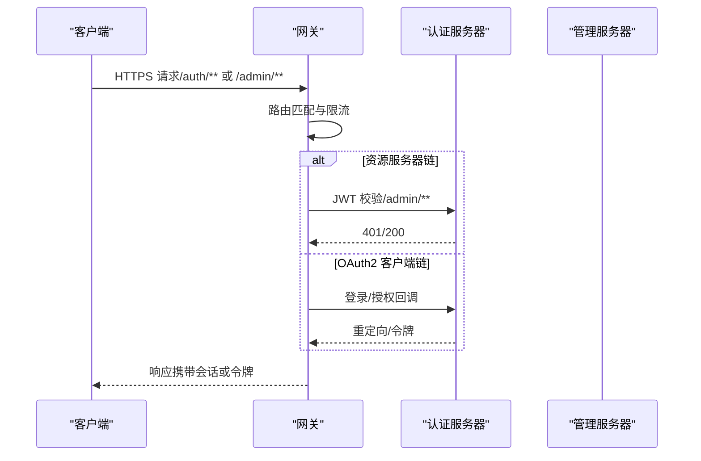
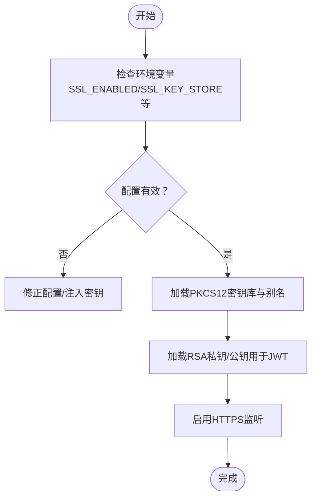
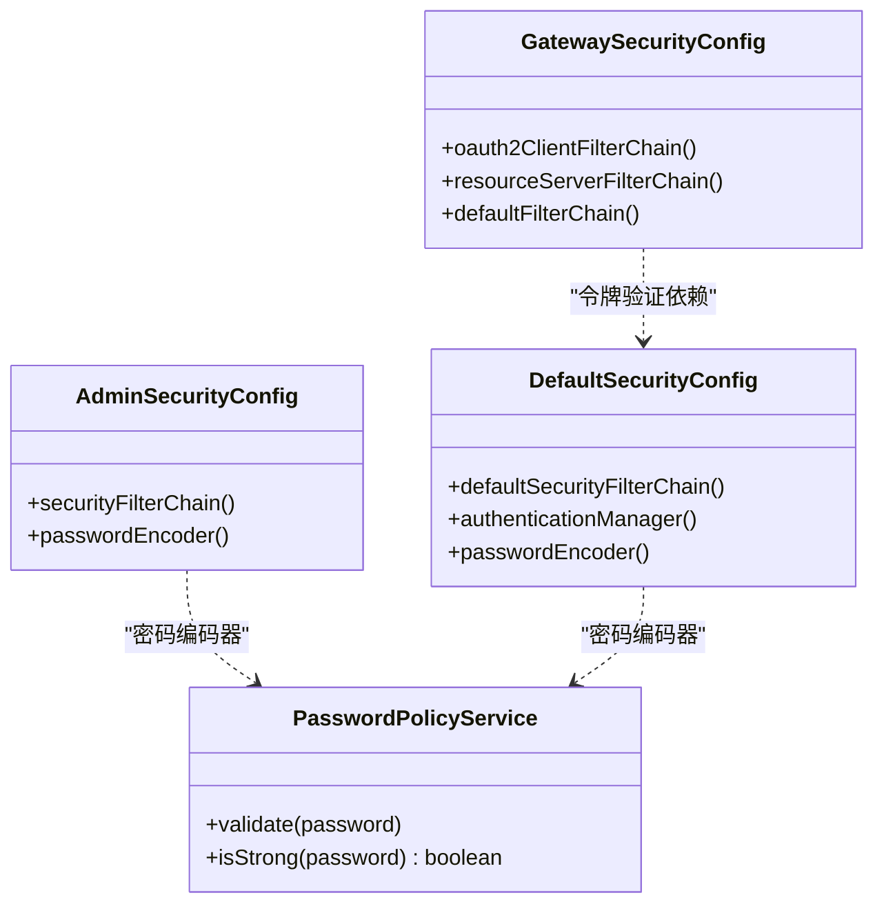
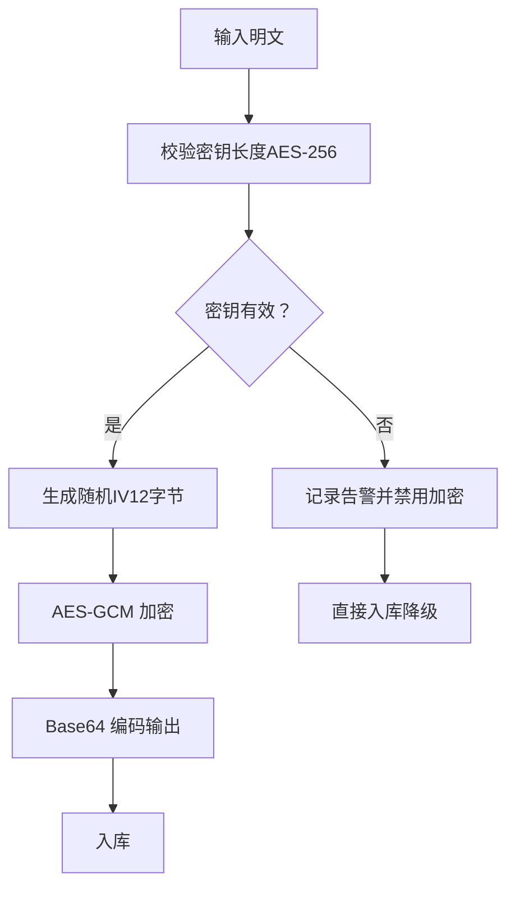
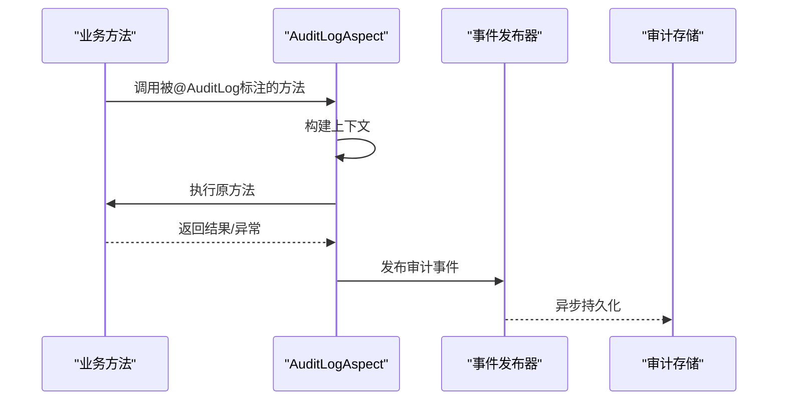
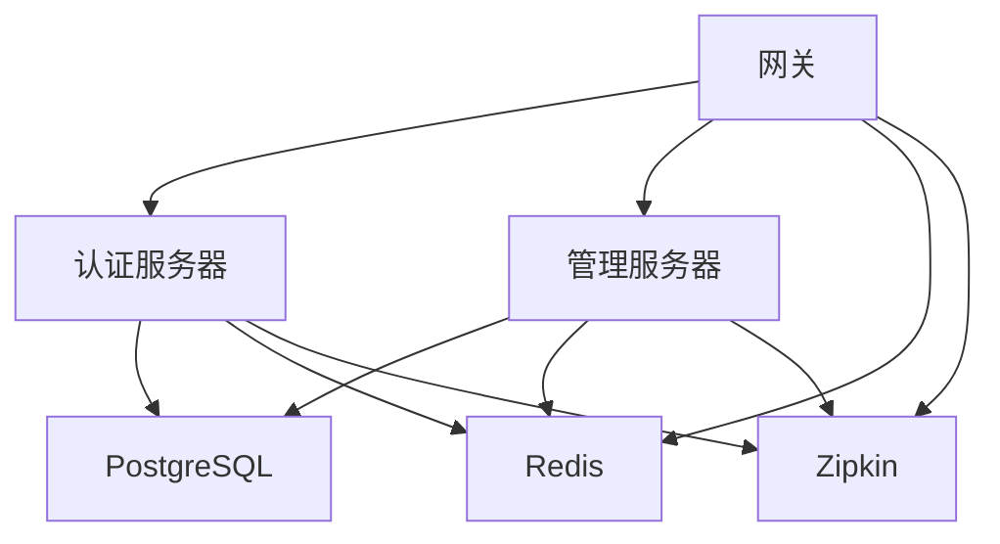

# 安全加固

<cite>
**本文引用的文件**
- [AdminSecurityConfig.java](file://iam-admin-server/src/main/java/iam/platform/admin/infrastructure/config/AdminSecurityConfig.java)
- [DefaultSecurityConfig.java](file://iam-auth-server/src/main/java/iam/platform/auth/infrastructure/config/DefaultSecurityConfig.java)
- [GatewaySecurityConfig.java](file://iam-gateway/src/main/java/iam/platform/gateway/infrastructure/security/GatewaySecurityConfig.java)
- [application.yml（管理端）](file://iam-admin-server/src/main/resources/application.yml)
- [application.yml（认证端）](file://iam-auth-server/src/main/resources/application.yml)
- [application.yml（网关）](file://iam-gateway/src/main/resources/application.yml)
- [PasswordPolicyService.java](file://iam-admin-server/src/main/java/iam/platform/admin/domain/service/PasswordPolicyService.java)
- [EncryptedStringConverter.java](file://iam-admin-server/src/main/java/iam/platform/admin/infrastructure/persistence/converter/EncryptedStringConverter.java)
- [EncryptionProperties.java（管理端）](file://iam-admin-server/src/main/java/iam/platform/admin/infrastructure/config/EncryptionProperties.java)
- [EncryptionProperties.java（认证端）](file://iam-auth-server/src/main/java/iam/platform/auth/infrastructure/config/EncryptionProperties.java)
- [AuditProperties.java](file://iam-admin-server/src/main/java/iam/platform/admin/infrastructure/config/AuditProperties.java)
- [AuditLogAspect.java](file://iam-admin-server/src/main/java/iam/platform/admin/infrastructure/aspect/AuditLogAspect.java)
- [RateLimitHandler.java](file://iam-auth-server/src/main/java/iam/platform/auth/application/service/pipeline/RateLimitHandler.java)
- [AccountLockoutHandler.java](file://iam-auth-server/src/main/java/iam/platform/auth/application/service/pipeline/AccountLockoutHandler.java)
- [enable-https.ps1](file://script/enable-https.ps1)
- [README.md（SSL）](file://ssl/README.md)
</cite>

## 目录
1. [简介](#简介)
2. [项目结构](#项目结构)
3. [核心组件](#核心组件)
4. [架构总览](#架构总览)
5. [详细组件分析](#详细组件分析)
6. [依赖分析](#依赖分析)
7. [性能考虑](#性能考虑)
8. [故障排查指南](#故障排查指南)
9. [结论](#结论)
10. [附录](#附录)

## 简介
本指南面向IAM平台的安全加固，围绕以下目标展开：SSL/TLS与HTTPS启用、证书生成与安装、自动续期机制；安全配置最佳实践（密码策略、会话管理、CSRF防护）；网络安全加固（防火墙、网络隔离、ACL）；数据加密策略（传输加密、静态数据加密、密钥管理）；安全审计与合规（审计日志、合规报告、事件响应）；以及渗透测试与漏洞扫描建议。文档基于仓库中现有配置与实现进行归纳总结，并提供可操作的落地步骤。

## 项目结构
IAM平台由多个子模块组成，包含认证服务器、管理服务器、网关与公共组件。安全相关的关键位置包括：
- 各服务的Spring Security配置类（启用/禁用CSRF、会话策略、过滤器链）
- SSL/TLS与JWK配置（application.yml中的server.ssl与security.jwk）
- 密码策略与静态数据加密（PasswordPolicyService、EncryptedStringConverter）
- 审计日志配置与AOP切面（AuditProperties、AuditLogAspect）
- 访问控制与速率限制（RateLimitHandler、AccountLockoutHandler）

图表来源
- [DefaultSecurityConfig.java:1-95](file://iam-auth-server/src/main/java/iam/platform/auth/infrastructure/config/DefaultSecurityConfig.java#L1-L95)
- [AdminSecurityConfig.java:1-41](file://iam-admin-server/src/main/java/iam/platform/admin/infrastructure/config/AdminSecurityConfig.java#L1-L41)
- [GatewaySecurityConfig.java:1-131](file://iam-gateway/src/main/java/iam/platform/gateway/infrastructure/security/GatewaySecurityConfig.java#L1-L131)
- [application.yml（认证端）:1-144](file://iam-auth-server/src/main/resources/application.yml#L1-L144)
- [application.yml（管理端）:1-102](file://iam-admin-server/src/main/resources/application.yml#L1-L102)
- [application.yml（网关）:1-116](file://iam-gateway/src/main/resources/application.yml#L1-L116)

章节来源
- [DefaultSecurityConfig.java:1-95](file://iam-auth-server/src/main/java/iam/platform/auth/infrastructure/config/DefaultSecurityConfig.java#L1-L95)
- [AdminSecurityConfig.java:1-41](file://iam-admin-server/src/main/java/iam/platform/admin/infrastructure/config/AdminSecurityConfig.java#L1-L41)
- [GatewaySecurityConfig.java:1-131](file://iam-gateway/src/main/java/iam/platform/gateway/infrastructure/security/GatewaySecurityConfig.java#L1-L131)
- [application.yml（认证端）:1-144](file://iam-auth-server/src/main/resources/application.yml#L1-L144)
- [application.yml（管理端）:1-102](file://iam-admin-server/src/main/resources/application.yml#L1-L102)
- [application.yml（网关）:1-116](file://iam-gateway/src/main/resources/application.yml#L1-L116)

## 核心组件
- 安全过滤链与会话策略：认证端与管理端均通过SecurityFilterChain定义请求授权规则、会话策略与CSRF设置；网关采用WebFlux Security链，区分OAuth2客户端链与资源服务器链。
- SSL/TLS与JWK：各服务在application.yml中启用server.ssl，并通过security.jwk配置RSA密钥对用于签发与验证JWT。
- 密码策略与静态加密：管理端提供PasswordPolicyService与EncryptedStringConverter，分别用于密码强度校验与数据库字段的AES-GCM静态加密。
- 审计日志：通过AuditProperties与AuditLogAspect实现方法级审计事件的异步发布与持久化。
- 访问控制与风控：认证端引入速率限制与账户锁定策略，防止暴力破解。

章节来源
- [DefaultSecurityConfig.java:35-88](file://iam-auth-server/src/main/java/iam/platform/auth/infrastructure/config/DefaultSecurityConfig.java#L35-L88)
- [AdminSecurityConfig.java:18-34](file://iam-admin-server/src/main/java/iam/platform/admin/infrastructure/config/AdminSecurityConfig.java#L18-L34)
- [GatewaySecurityConfig.java:28-73](file://iam-gateway/src/main/java/iam/platform/gateway/infrastructure/security/GatewaySecurityConfig.java#L28-L73)
- [application.yml（认证端）:3-8](file://iam-auth-server/src/main/resources/application.yml#L3-L8)
- [application.yml（认证端）:82-87](file://iam-auth-server/src/main/resources/application.yml#L82-L87)
- [application.yml（管理端）:3-8](file://iam-admin-server/src/main/resources/application.yml#L3-L8)
- [application.yml（网关）:3-8](file://iam-gateway/src/main/resources/application.yml#L3-L8)
- [PasswordPolicyService.java:11-24](file://iam-admin-server/src/main/java/iam/platform/admin/domain/service/PasswordPolicyService.java#L11-L24)
- [EncryptedStringConverter.java:28-41](file://iam-admin-server/src/main/java/iam/platform/admin/infrastructure/persistence/converter/EncryptedStringConverter.java#L28-L41)
- [AuditProperties.java:10-36](file://iam-admin-server/src/main/java/iam/platform/admin/infrastructure/config/AuditProperties.java#L10-L36)
- [AuditLogAspect.java:27-48](file://iam-admin-server/src/main/java/iam/platform/admin/infrastructure/aspect/AuditLogAspect.java#L27-L48)
- [RateLimitHandler.java:14-26](file://iam-auth-server/src/main/java/iam/platform/auth/application/service/pipeline/RateLimitHandler.java#L14-L26)
- [AccountLockoutHandler.java:14-26](file://iam-auth-server/src/main/java/iam/platform/auth/application/service/pipeline/AccountLockoutHandler.java#L14-L26)

## 架构总览
下图展示了HTTPS启用、认证与会话、审计与风控的整体交互：

图表来源
- [GatewaySecurityConfig.java:28-73](file://iam-gateway/src/main/java/iam/platform/gateway/infrastructure/security/GatewaySecurityConfig.java#L28-L73)
- [application.yml（网关）:18-54](file://iam-gateway/src/main/resources/application.yml#L18-L54)
- [application.yml（认证端）:54-87](file://iam-auth-server/src/main/resources/application.yml#L54-L87)

## 详细组件分析

### SSL证书配置与HTTPS启用
- 证书与密钥
  - 认证端与管理端在application.yml中通过server.ssl启用SSL，并指定PKCS12密钥库与别名。
  - 认证端额外通过security.jwk配置RSA私钥与公钥文件路径，用于JWK与JWT签发/验证。
- 自动续期
  - 仓库提供了enable-https.ps1脚本与ssl目录下的README，可用于生成与部署证书。
- 生产环境建议
  - 使用受信CA签发的证书，避免自签名导致的浏览器提示。
  - 将密钥库与JWK密钥置于安全存储（如KMS、Vault），并通过环境变量注入。
  - 在网关层统一终止TLS，后端服务间使用内网HTTP通信以降低复杂度。

图表来源
- [application.yml（认证端）:3-8](file://iam-auth-server/src/main/resources/application.yml#L3-L8)
- [application.yml（认证端）:82-87](file://iam-auth-server/src/main/resources/application.yml#L82-L87)
- [application.yml（管理端）:3-8](file://iam-admin-server/src/main/resources/application.yml#L3-L8)
- [application.yml（网关）:3-8](file://iam-gateway/src/main/resources/application.yml#L3-L8)
- [enable-https.ps1](file://script/enable-https.ps1)
- [README.md（SSL）](file://ssl/README.md)

章节来源
- [application.yml（认证端）:3-8](file://iam-auth-server/src/main/resources/application.yml#L3-L8)
- [application.yml（认证端）:82-87](file://iam-auth-server/src/main/resources/application.yml#L82-L87)
- [application.yml（管理端）:3-8](file://iam-admin-server/src/main/resources/application.yml#L3-L8)
- [application.yml（网关）:3-8](file://iam-gateway/src/main/resources/application.yml#L3-L8)
- [enable-https.ps1](file://script/enable-https.ps1)
- [README.md（SSL）](file://ssl/README.md)

### 安全配置最佳实践
- 密码策略
  - 管理端提供PasswordPolicyService，强制最小长度、大小写与数字要求。
- 会话管理
  - 管理端与认证端均采用无状态会话（STATELESS），结合JWT/OAuth2令牌。
  - 网关侧对OAuth2客户端链与资源服务器链分别处理，确保令牌验证与登录流程分离。
- CSRF防护
  - 管理端与网关在对应SecurityFilterChain中显式禁用CSRF，适用于无状态令牌场景。
  - 若未来引入表单登录，请为相应路径启用CSRF保护并配置同源策略。

图表来源
- [PasswordPolicyService.java:6-34](file://iam-admin-server/src/main/java/iam/platform/admin/domain/service/PasswordPolicyService.java#L6-L34)
- [AdminSecurityConfig.java:18-39](file://iam-admin-server/src/main/java/iam/platform/admin/infrastructure/config/AdminSecurityConfig.java#L18-L39)
- [DefaultSecurityConfig.java:35-93](file://iam-auth-server/src/main/java/iam/platform/auth/infrastructure/config/DefaultSecurityConfig.java#L35-L93)
- [GatewaySecurityConfig.java:28-73](file://iam-gateway/src/main/java/iam/platform/gateway/infrastructure/security/GatewaySecurityConfig.java#L28-L73)

章节来源
- [PasswordPolicyService.java:11-24](file://iam-admin-server/src/main/java/iam/platform/admin/domain/service/PasswordPolicyService.java#L11-L24)
- [AdminSecurityConfig.java:27-31](file://iam-admin-server/src/main/java/iam/platform/admin/infrastructure/config/AdminSecurityConfig.java#L27-L31)
- [DefaultSecurityConfig.java:39-62](file://iam-auth-server/src/main/java/iam/platform/auth/infrastructure/config/DefaultSecurityConfig.java#L39-L62)
- [GatewaySecurityConfig.java:30-57](file://iam-gateway/src/main/java/iam/platform/gateway/infrastructure/security/GatewaySecurityConfig.java#L30-L57)

### 网络安全加固
- 防火墙与暴露面
  - 网关对外暴露HTTP/HTTPS端口，内部服务间通过服务发现与负载均衡访问。
- 网络隔离
  - 建议将认证端、管理端与网关置于独立命名空间/子网，仅开放必要端口。
- 访问控制列表（ACL）
  - 网关已配置全局CORS，生产环境应收紧allowedOrigins并启用凭据白名单。
  - 可结合IP白名单/黑名单策略（见认证端sso.security.ip-whitelist/blacklist）限制来源。

章节来源
- [application.yml（网关）:55-68](file://iam-gateway/src/main/resources/application.yml#L55-L68)
- [application.yml（认证端）:101-102](file://iam-auth-server/src/main/resources/application.yml#L101-L102)

### 数据加密策略
- 传输加密
  - 通过server.ssl启用HTTPS；认证端同时配置JWK用于JWT签名与验证。
- 静态数据加密
  - 管理端使用EncryptedStringConverter对敏感字段（如客户端密钥）进行AES-GCM加密存储。
  - 加密开关取决于EncryptionProperties中的密钥长度是否满足AES-256要求。
- 密钥管理
  - 建议将ENCRYPTION_KEY置于安全密钥管理系统，定期轮换并限制访问范围。

图表来源
- [EncryptedStringConverter.java:28-41](file://iam-admin-server/src/main/java/iam/platform/admin/infrastructure/persistence/converter/EncryptedStringConverter.java#L28-L41)
- [EncryptedStringConverter.java:67-87](file://iam-admin-server/src/main/java/iam/platform/admin/infrastructure/persistence/converter/EncryptedStringConverter.java#L67-L87)
- [EncryptedStringConverter.java:89-107](file://iam-admin-server/src/main/java/iam/platform/admin/infrastructure/persistence/converter/EncryptedStringConverter.java#L89-L107)
- [EncryptionProperties.java（管理端）:12-14](file://iam-admin-server/src/main/java/iam/platform/admin/infrastructure/config/EncryptionProperties.java#L12-L14)
- [application.yml（认证端）:82-87](file://iam-auth-server/src/main/resources/application.yml#L82-L87)

章节来源
- [EncryptedStringConverter.java:17-41](file://iam-admin-server/src/main/java/iam/platform/admin/infrastructure/persistence/converter/EncryptedStringConverter.java#L17-L41)
- [EncryptedStringConverter.java:43-65](file://iam-admin-server/src/main/java/iam/platform/admin/infrastructure/persistence/converter/EncryptedStringConverter.java#L43-L65)
- [EncryptionProperties.java（管理端）:12-14](file://iam-admin-server/src/main/java/iam/platform/admin/infrastructure/config/EncryptionProperties.java#L12-L14)
- [EncryptionProperties.java（认证端）:12-14](file://iam-auth-server/src/main/java/iam/platform/auth/infrastructure/config/EncryptionProperties.java#L12-L14)
- [application.yml（认证端）:82-87](file://iam-auth-server/src/main/resources/application.yml#L82-L87)

### 安全审计与合规
- 审计日志
  - 通过AuditProperties配置开关、保留天数与异步线程池参数。
  - AuditLogAspect拦截标注@AuditLog的方法，在成功/失败后发布审计事件。
- 合规与事件响应
  - 建议将审计事件接入集中式日志系统（如SIEM），设置阈值告警与自动化处置流程。

图表来源
- [AuditLogAspect.java:27-48](file://iam-admin-server/src/main/java/iam/platform/admin/infrastructure/aspect/AuditLogAspect.java#L27-L48)
- [AuditLogAspect.java:50-58](file://iam-admin-server/src/main/java/iam/platform/admin/infrastructure/aspect/AuditLogAspect.java#L50-L58)
- [AuditProperties.java:10-36](file://iam-admin-server/src/main/java/iam/platform/admin/infrastructure/config/AuditProperties.java#L10-L36)

章节来源
- [AuditProperties.java:10-36](file://iam-admin-server/src/main/java/iam/platform/admin/infrastructure/config/AuditProperties.java#L10-L36)
- [AuditLogAspect.java:27-48](file://iam-admin-server/src/main/java/iam/platform/admin/infrastructure/aspect/AuditLogAspect.java#L27-L48)

### 渗透测试与漏洞扫描
- 建议流程
  - 范围确认：认证端、管理端、网关及依赖组件（Redis、PostgreSQL、Zipkin等）。
  - 工具选择：OWASP ZAP、Burp Suite、Nessus、Nmap等。
  - 关注点：弱密码、未授权访问、敏感信息泄露、会话劫持、CSRF（若启用表单登录）、SSRF、XSS、不安全的CORS配置。
- 结果与修复
  - 对发现的问题制定修复计划并回归测试，形成合规报告归档。

[本节为通用指导，无需特定文件引用]

## 依赖分析
- 模块耦合
  - 网关依赖认证端提供的OIDC Issuer URI进行JWT校验；管理端通过OAuth2客户端注册连接认证端。
  - 认证端与管理端共享公共模型与异常定义，减少重复实现。
- 外部依赖
  - Redis用于会话与速率限制；PostgreSQL存储业务数据；Zipkin用于分布式追踪。

图表来源
- [application.yml（网关）:18-54](file://iam-gateway/src/main/resources/application.yml#L18-L54)
- [application.yml（认证端）:15-37](file://iam-auth-server/src/main/resources/application.yml#L15-L37)
- [application.yml（管理端）:15-37](file://iam-admin-server/src/main/resources/application.yml#L15-L37)

章节来源
- [application.yml（网关）:18-54](file://iam-gateway/src/main/resources/application.yml#L18-L54)
- [application.yml（认证端）:15-37](file://iam-auth-server/src/main/resources/application.yml#L15-L37)
- [application.yml（管理端）:15-37](file://iam-admin-server/src/main/resources/application.yml#L15-L37)

## 性能考虑
- 会话与缓存
  - 使用Redis作为会话存储，避免内存碎片与集群扩展问题。
- 速率限制
  - 网关与认证端均提供速率限制能力，建议结合Redis实现跨节点一致性。
- 日志与审计
  - 审计日志异步化，合理配置线程池与队列容量，避免阻塞主业务。

[本节为通用指导，无需特定文件引用]

## 故障排查指南
- HTTPS无法启用
  - 检查SSL_ENABLED、SSL_KEY_STORE、SSL_KEY_STORE_PASSWORD与key-alias配置是否正确。
  - 确认密钥库格式与权限，参考enable-https.ps1与ssl/README。
- JWT校验失败
  - 核对security.jwk的私钥/公钥路径与权限；确认issuer-uri一致。
- 审计日志未落盘
  - 检查sso.audit.enabled与异步线程池配置；关注发布异常日志。
- 速率限制误伤
  - 调整认证端sso.security.rate-limit配置或临时放行测试IP。

章节来源
- [application.yml（认证端）:3-8](file://iam-auth-server/src/main/resources/application.yml#L3-L8)
- [application.yml（认证端）:82-87](file://iam-auth-server/src/main/resources/application.yml#L82-L87)
- [application.yml（网关）:90-91](file://iam-gateway/src/main/resources/application.yml#L90-L91)
- [AuditProperties.java:10-36](file://iam-admin-server/src/main/java/iam/platform/admin/infrastructure/config/AuditProperties.java#L10-L36)
- [application.yml（认证端）:90-102](file://iam-auth-server/src/main/resources/application.yml#L90-L102)

## 结论
本指南基于仓库现有实现，总结了IAM平台在HTTPS、会话与CSRF、加密、审计与风控等方面的加固要点。建议在生产环境中进一步完善密钥管理、网络隔离与访问控制、合规审计与事件响应流程，并持续开展渗透测试与漏洞扫描，确保系统整体安全基线达标。

## 附录
- 证书与HTTPS
  - 参考脚本与说明文件，完成证书生成、安装与自动续期。
- 密码与加密
  - 强制密码策略，启用AES-GCM静态加密，密钥安全存储与轮换。
- 审计与合规
  - 开启审计日志、设定保留周期与异步线程池，建立事件响应流程。

章节来源
- [enable-https.ps1](file://script/enable-https.ps1)
- [README.md（SSL）](file://ssl/README.md)
- [PasswordPolicyService.java:11-24](file://iam-admin-server/src/main/java/iam/platform/admin/domain/service/PasswordPolicyService.java#L11-L24)
- [EncryptedStringConverter.java:28-41](file://iam-admin-server/src/main/java/iam/platform/admin/infrastructure/persistence/converter/EncryptedStringConverter.java#L28-L41)
- [AuditProperties.java:10-36](file://iam-admin-server/src/main/java/iam/platform/admin/infrastructure/config/AuditProperties.java#L10-L36)