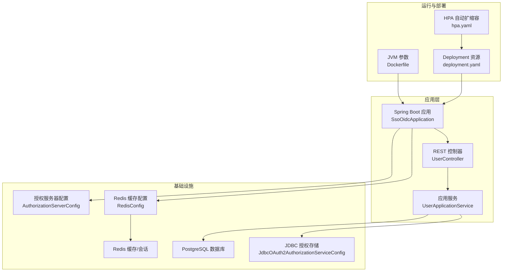
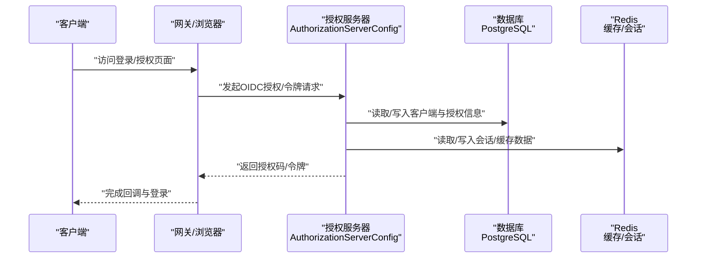
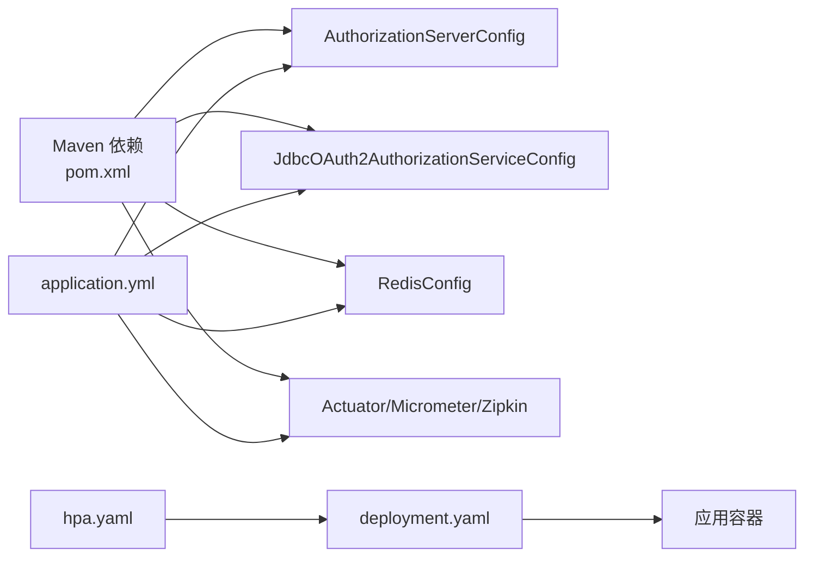
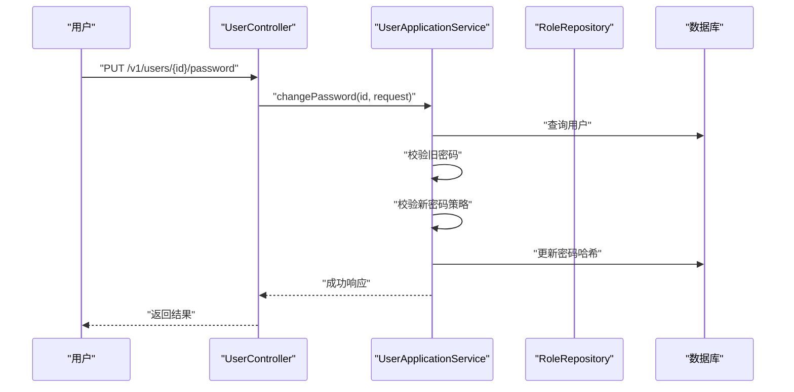

# 性能优化

<cite>
**本文引用的文件**
- [pom.xml](file://pom.xml)
- [Dockerfile](file://Dockerfile)
- [application.yml](file://src/main/resources/application.yml)
- [application-dev.yml](file://src/main/resources/application-dev.yml)
- [application-prod.yml](file://src/main/resources/application-prod.yml)
- [deployment.yaml](file://k8s/base/deployment.yaml)
- [hpa.yaml](file://k8s/base/hpa.yaml)
- [RedisConfig.java](file://src/main/java/sso/oidc/infrastructure/config/RedisConfig.java)
- [AuthorizationServerConfig.java](file://src/main/java/sso/oidc/infrastructure/config/AuthorizationServerConfig.java)
- [JdbcOAuth2AuthorizationServiceConfig.java](file://src/main/java/sso/oidc/infrastructure/security/JdbcOAuth2AuthorizationServiceConfig.java)
- [UserController.java](file://src/main/java/sso/oidc/interfaces/rest/UserController.java)
- [UserApplicationService.java](file://src/main/java/sso/oidc/application/service/UserApplicationService.java)
- [SsoOidcApplication.java](file://src/main/java/sso/oidc/SsoOidcApplication.java)
</cite>

## 目录
1. [简介](#简介)
2. [项目结构](#项目结构)
3. [核心组件](#核心组件)
4. [架构总览](#架构总览)
5. [详细组件分析](#详细组件分析)
6. [依赖关系分析](#依赖关系分析)
7. [性能考量与优化建议](#性能考量与优化建议)
8. [故障排查指南](#故障排查指南)
9. [结论](#结论)
10. [附录](#附录)

## 简介
本文件面向系统性能优化，结合仓库中的实际配置与实现，从JVM参数、数据库连接池、Redis缓存、异步处理、微服务性能瓶颈、负载与压力测试、容器资源与隔离、监控指标与持续优化等方面，提供可操作的分析与建议。内容严格基于仓库中已存在的配置与代码片段路径，避免臆测。

## 项目结构
该iam-platform服务采用Spring Boot 3 + Spring Security Authorization Server构建，使用PostgreSQL作为持久层，Redis用于会话与缓存，Prometheus+Micrometer+Zipkin进行可观测性，Kubernetes部署并配合HPA自动扩缩容。

图表来源
- [SsoOidcApplication.java:1-13](file://src/main/java/sso/oidc/SsoOidcApplication.java#L1-L13)
- [UserController.java:1-90](file://src/main/java/sso/oidc/interfaces/rest/UserController.java#L1-L90)
- [UserApplicationService.java:1-165](file://src/main/java/sso/oidc/application/service/UserApplicationService.java#L1-L165)
- [AuthorizationServerConfig.java:1-142](file://src/main/java/sso/oidc/infrastructure/config/AuthorizationServerConfig.java#L1-L142)
- [JdbcOAuth2AuthorizationServiceConfig.java:1-29](file://src/main/java/sso/oidc/infrastructure/security/JdbcOAuth2AuthorizationServiceConfig.java#L1-L29)
- [RedisConfig.java:1-31](file://src/main/java/sso/oidc/infrastructure/config/RedisConfig.java#L1-L31)
- [Dockerfile:1-60](file://Dockerfile#L1-L60)
- [deployment.yaml:1-58](file://k8s/base/deployment.yaml#L1-L58)
- [hpa.yaml:1-25](file://k8s/base/hpa.yaml#L1-L25)

章节来源
- [pom.xml:1-225](file://pom.xml#L1-L225)
- [application.yml:1-78](file://src/main/resources/application.yml#L1-L78)
- [application-dev.yml:1-22](file://src/main/resources/application-dev.yml#L1-L22)
- [application-prod.yml:1-25](file://src/main/resources/application-prod.yml#L1-L25)
- [Dockerfile:1-60](file://Dockerfile#L1-L60)
- [deployment.yaml:1-58](file://k8s/base/deployment.yaml#L1-L58)
- [hpa.yaml:1-25](file://k8s/base/hpa.yaml#L1-L25)

## 核心组件
- 应用入口与启动：Spring Boot应用入口负责加载配置与启动Web容器。
- 授权服务器：基于Authorization Server配置，提供OIDC/OAuth2能力。
- 数据访问与事务：JDBC授权服务与JPA/Hibernate访问数据库；生产环境关闭open-in-view以降低长事务风险。
- 缓存与会话：Redis缓存管理与分布式会话存储。
- 运行时与容器：容器内JVM参数启用容器感知与内存上限百分比；K8s部署定义资源请求/限制与探针。
- 可观测性：Actuator暴露健康、指标、Prometheus端点，Zipkin链路追踪采样可调。

章节来源
- [SsoOidcApplication.java:1-13](file://src/main/java/sso/oidc/SsoOidcApplication.java#L1-L13)
- [AuthorizationServerConfig.java:1-142](file://src/main/java/sso/oidc/infrastructure/config/AuthorizationServerConfig.java#L1-L142)
- [JdbcOAuth2AuthorizationServiceConfig.java:1-29](file://src/main/java/sso/oidc/infrastructure/security/JdbcOAuth2AuthorizationServiceConfig.java#L1-L29)
- [application.yml:1-78](file://src/main/resources/application.yml#L1-L78)
- [application-prod.yml:1-25](file://src/main/resources/application-prod.yml#L1-L25)
- [RedisConfig.java:1-31](file://src/main/java/sso/oidc/infrastructure/config/RedisConfig.java#L1-L31)
- [Dockerfile:1-60](file://Dockerfile#L1-L60)
- [deployment.yaml:1-58](file://k8s/base/deployment.yaml#L1-L58)

## 架构总览
下图展示从客户端到授权服务器、数据库与Redis的关键交互路径，以及容器与K8s的资源约束。

图表来源
- [AuthorizationServerConfig.java:50-67](file://src/main/java/sso/oidc/infrastructure/config/AuthorizationServerConfig.java#L50-L67)
- [JdbcOAuth2AuthorizationServiceConfig.java:16-27](file://src/main/java/sso/oidc/infrastructure/security/JdbcOAuth2AuthorizationServiceConfig.java#L16-L27)
- [RedisConfig.java:20-29](file://src/main/java/sso/oidc/infrastructure/config/RedisConfig.java#L20-L29)

## 详细组件分析

### JVM性能调优参数
- 容器支持与内存上限
  - 使用容器感知参数启用容器内存感知，结合“最大堆内存百分比”参数控制堆大小，避免JVM误判宿主机内存导致过度分配。
  - 同时设置随机数熵源，提升容器内安全随机生成性能。
- 建议
  - 在生产环境根据容器内存限制与GC行为调整“最大堆内存百分比”，平衡吞吐与停顿。
  - 结合Prometheus指标观察GC停顿时间与频率，动态微调。
  - 如需更低延迟，可评估G1或ZGC（取决于JDK版本），但需在容器环境下验证稳定性。

章节来源
- [Dockerfile:54-59](file://Dockerfile#L54-L59)
- [application.yml:63-78](file://src/main/resources/application.yml#L63-L78)

### 数据库连接池配置
- HikariCP参数
  - 开发环境默认池大小较小，便于本地调试；生产环境提高最大池大小与空闲阈值，减少连接等待。
  - 设置合理的连接超时、空闲超时与最大生存时间，避免连接泄漏与过期连接占用资源。
- 生产环境建议
  - 根据并发请求数与数据库最大连接数，逐步提升maximum-pool-size，并结合慢查询日志定位热点SQL。
  - 关闭open-in-view，避免长时间持有数据库连接导致池耗尽。

章节来源
- [application.yml:13-18](file://src/main/resources/application.yml#L13-L18)
- [application-prod.yml:7-9](file://src/main/resources/application-prod.yml#L7-L9)
- [application.yml:26-26](file://src/main/resources/application.yml#L26-L26)

### Redis缓存优化策略
- 缓存配置
  - 默认缓存TTL较短（分钟级），禁用空值缓存，键前缀简单，序列化为JSON，适合轻量场景。
- 优化建议
  - 针对热点数据设置更长TTL或独立缓存策略；对大对象考虑压缩或二进制序列化。
  - 使用Redis集群/分片应对高QPS；开启LRU淘汰策略并监控内存使用。
  - 将会话存储与业务缓存分离，避免相互影响。

章节来源
- [RedisConfig.java:20-29](file://src/main/java/sso/oidc/infrastructure/config/RedisConfig.java#L20-L29)
- [application.yml:28-31](file://src/main/resources/application.yml#L28-L31)
- [application.yml:46-46](file://src/main/resources/application.yml#L46-L46)

### 异步处理配置
- 当前实现
  - 用户相关接口为同步处理；业务服务未显式声明异步任务。
- 优化建议
  - 对非关键路径（如发送邮件、日志上报）引入异步队列或事件驱动，降低请求链路阻塞。
  - 在K8s中通过HPA与副本数扩展承载峰值流量，避免单实例成为瓶颈。

章节来源
- [UserController.java:35-88](file://src/main/java/sso/oidc/interfaces/rest/UserController.java#L35-L88)
- [UserApplicationService.java:36-149](file://src/main/java/sso/oidc/application/service/UserApplicationService.java#L36-L149)
- [hpa.yaml:1-25](file://k8s/base/hpa.yaml#L1-L25)

### 微服务架构下的性能瓶颈识别与解决
- 典型瓶颈
  - 认证/授权链路：密钥解析、JWT签发/校验、数据库访问。
  - 数据访问：未命中缓存的高频查询、长事务、锁竞争。
  - 缓存命中率低：TTL过短、键设计不合理、热点集中。
- 解决思路
  - 通过Zipkin采样与Span标签定位慢调用；结合Prometheus指标（HTTP请求时延、DB连接池状态、Redis命中率）进行根因分析。
  - 对热点实体增加只读副本或缓存；优化SQL索引与分页查询；拆分读写库或引入查询路由。

章节来源
- [AuthorizationServerConfig.java:93-118](file://src/main/java/sso/oidc/infrastructure/config/AuthorizationServerConfig.java#L93-L118)
- [JdbcOAuth2AuthorizationServiceConfig.java:16-27](file://src/main/java/sso/oidc/infrastructure/security/JdbcOAuth2AuthorizationServiceConfig.java#L16-L27)
- [application.yml:63-78](file://src/main/resources/application.yml#L63-L78)

### 负载测试方法、压力测试工具使用、性能基准对比
- 方法论
  - 明确目标：吞吐、P95/P99时延、错误率、资源利用率。
  - 分阶段：预热、稳定期、峰值、退坡。
  - 指标采集：应用侧Prometheus、K8s节点指标、数据库/Redis指标。
- 工具建议
  - 压力测试：JMeter/K6/Gatling等；针对OIDC流程模拟授权码/刷新令牌场景。
  - 观测：Prometheus + Grafana + Zipkin；K8s Dashboard/Top。
- 基准对比
  - 不同JVM参数、连接池大小、Redis配置组合下的对比实验，记录关键指标变化。

[本节为通用实践指导，不直接分析具体文件]

### 容器资源限制、CPU亲和性、内存隔离
- 资源限制
  - Deployment定义了CPU与内存请求/限制；HPA按CPU/内存利用率自动扩缩容。
- CPU亲和性与隔离
  - 可通过Pod的affinity与topologySpreadConstraints实现跨节点均匀分布；对关键工作负载设置资源配额与QoS。
- 内存隔离
  - 结合容器内存限制与JVM MaxRAMPercentage，避免OOM Killer触发；监控容器内存与RSS曲线。

章节来源
- [deployment.yaml:30-36](file://k8s/base/deployment.yaml#L30-L36)
- [hpa.yaml:12-24](file://k8s/base/hpa.yaml#L12-L24)
- [Dockerfile:54-59](file://Dockerfile#L54-L59)

### 性能监控指标解读与持续优化
- 指标清单
  - 应用：HTTP请求速率/时延/错误率、JVM GC时长/次数、线程数、堆/元空间使用。
  - 数据库：连接池活跃数/等待时间、慢查询数、锁等待。
  - 缓存：命中率/未命中率、内存使用、命令耗时。
  - K8s：CPU使用率/请求比例、内存使用率、重启次数、就绪/存活探针失败。
- 持续优化
  - 建立基线与告警阈值；定期复盘热点接口与慢调用；迭代JVM/GC/连接池/缓存配置。

章节来源
- [application.yml:63-78](file://src/main/resources/application.yml#L63-L78)
- [application-prod.yml:21-24](file://src/main/resources/application-prod.yml#L21-L24)

## 依赖关系分析
- 外部依赖
  - Spring Authorization Server提供OIDC/OAuth2能力；HikariCP提供高性能连接池；Redis用于缓存与会话；Micrometer+Prometheus+Zipkin提供可观测性。
- 组件耦合
  - 应用服务依赖JDBC授权服务与JPA仓储；Redis配置被应用层统一使用；K8s部署与HPA共同决定弹性伸缩。

图表来源
- [pom.xml:29-140](file://pom.xml#L29-L140)
- [application.yml:1-78](file://src/main/resources/application.yml#L1-L78)
- [deployment.yaml:1-58](file://k8s/base/deployment.yaml#L1-L58)
- [hpa.yaml:1-25](file://k8s/base/hpa.yaml#L1-L25)

章节来源
- [pom.xml:29-140](file://pom.xml#L29-L140)
- [application.yml:1-78](file://src/main/resources/application.yml#L1-L78)

## 性能考量与优化建议

### JVM与GC
- 参数要点
  - 容器感知与堆内存百分比：避免JVM误判物理内存；结合容器内存限制设定上限。
  - 随机熵源：改善容器内随机数生成性能。
- 建议
  - 生产环境按QPS与对象分配速率调整堆大小；关注GC停顿与晋升失败；必要时切换GC算法并做回归验证。

章节来源
- [Dockerfile:54-59](file://Dockerfile#L54-L59)

### 数据库与连接池
- 参数要点
  - 最大池大小、最小空闲、连接超时、空闲超时、最大生存时间。
- 建议
  - 以HPA与副本数承载并发；对热点表建立索引与分区；开启慢查询日志并定期分析。

章节来源
- [application.yml:13-18](file://src/main/resources/application.yml#L13-L18)
- [application-prod.yml:7-9](file://src/main/resources/application-prod.yml#L7-L9)

### 缓存与会话
- 配置要点
  - TTL、禁用空值缓存、键前缀、JSON序列化。
- 建议
  - 热点数据独立缓存策略；大对象压缩；会话与业务缓存分离；监控内存与命中率。

章节来源
- [RedisConfig.java:20-29](file://src/main/java/sso/oidc/infrastructure/config/RedisConfig.java#L20-L29)
- [application.yml:46-46](file://src/main/resources/application.yml#L46-L46)

### 异步与弹性
- 建议
  - 非关键路径异步化；利用HPA与副本数弹性扩容；对认证/授权链路做限流与熔断。

章节来源
- [hpa.yaml:1-25](file://k8s/base/hpa.yaml#L1-L25)
- [AuthorizationServerConfig.java:50-67](file://src/main/java/sso/oidc/infrastructure/config/AuthorizationServerConfig.java#L50-L67)

### 观测与基线
- 建议
  - 打开生产环境合理采样；建立Prometheus指标面板；定期做压测与回归；形成变更-指标-告警闭环。

章节来源
- [application.yml:63-78](file://src/main/resources/application.yml#L63-L78)
- [application-prod.yml:21-24](file://src/main/resources/application-prod.yml#L21-L24)

## 故障排查指南
- 启动与健康
  - 容器健康检查基于Actuator健康端点；若频繁重启，检查容器资源限制与JVM参数是否匹配。
- 连接池问题
  - 连接耗尽：增大池大小或缩短超时；慢查询：启用慢日志并优化SQL。
- 缓存问题
  - 命中率低：检查TTL与键设计；内存不足：评估容量与淘汰策略。
- 观测性
  - 通过Prometheus抓取指标，结合Zipkin查看链路耗时，定位异常环节。

章节来源
- [deployment.yaml:37-54](file://k8s/base/deployment.yaml#L37-L54)
- [application.yml:63-78](file://src/main/resources/application.yml#L63-L78)

## 结论
本项目在容器化与可观测性方面具备良好基础：容器内JVM参数、K8s资源与HPA、Prometheus与Zipkin均已配置。后续可在以下方向持续优化：JVM/GC参数精细化、连接池与数据库索引优化、缓存策略与容量规划、异步化与弹性扩容、以及系统化的压测与基线建设。

## 附录

### 关键流程时序示意：用户密码修改

图表来源
- [UserController.java:69-74](file://src/main/java/sso/oidc/interfaces/rest/UserController.java#L69-L74)
- [UserApplicationService.java:112-125](file://src/main/java/sso/oidc/application/service/UserApplicationService.java#L112-L125)