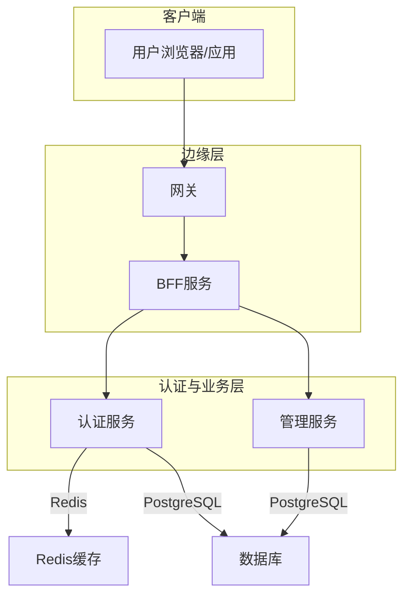
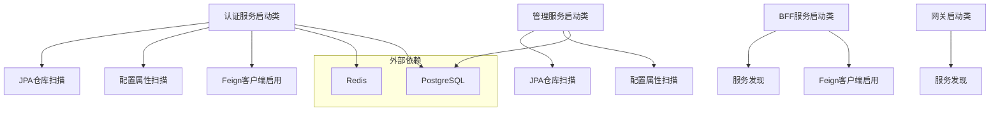
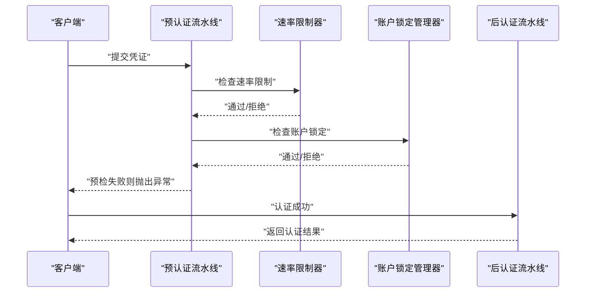
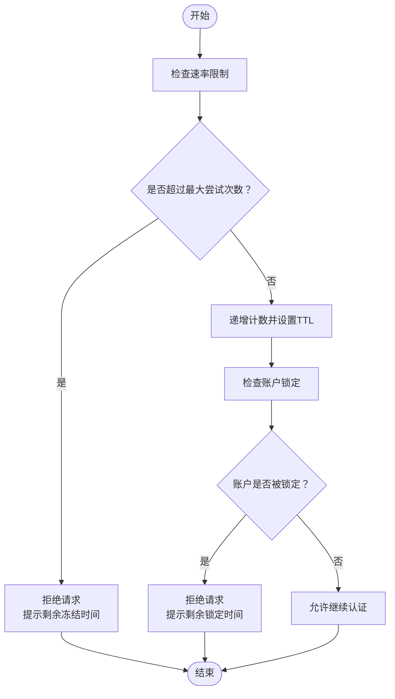
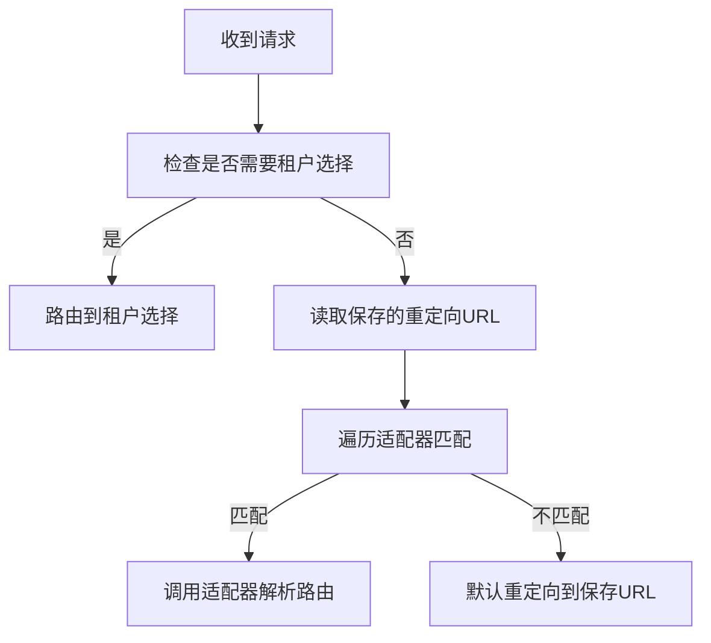
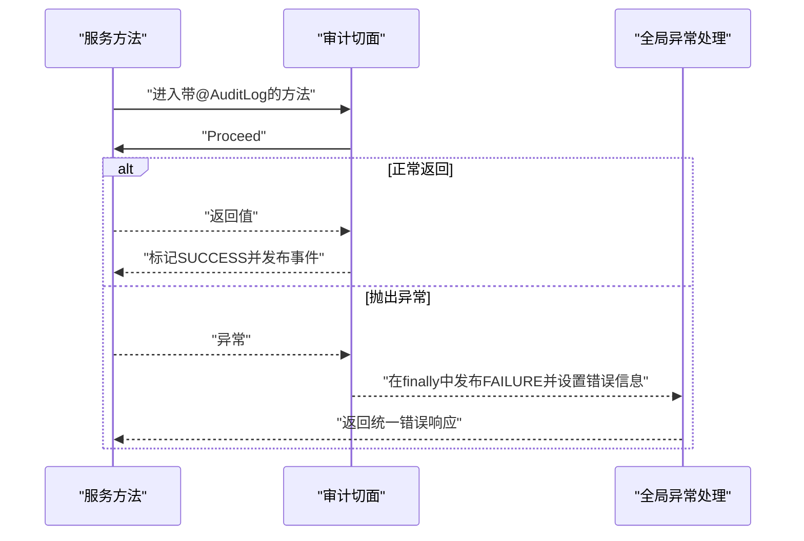
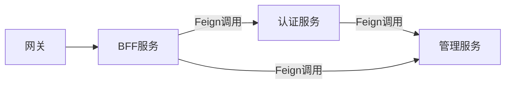

# 故障排查

<cite>
**本文引用的文件**
- [SsoAdminServerApplication.java](file://iam-admin-server/src/main/java/iam/platform/admin/SsoAdminServerApplication.java)
- [SsoAuthServerApplication.java](file://iam-auth-server/src/main/java/iam/platform/auth/SsoAuthServerApplication.java)
- [IamBffServerApplication.java](file://iam-bff-server/src/main/java/iam/platform/bff/IamBffServerApplication.java)
- [IamGatewayApplication.java](file://iam-gateway/src/main/java/iam/platform/gateway/IamGatewayApplication.java)
- [PreAuthenticationPipeline.java](file://iam-auth-server/src/main/java/iam/platform/auth/application/service/pipeline/PreAuthenticationPipeline.java)
- [PostAuthenticationPipeline.java](file://iam-auth-server/src/main/java/iam/platform/auth/application/service/pipeline/PostAuthenticationPipeline.java)
- [RedisBasedRateLimiter.java](file://iam-auth-server/src/main/java/iam/platform/auth/infrastructure/security/RedisBasedRateLimiter.java)
- [AccountLockoutManager.java](file://iam-auth-server/src/main/java/iam/platform/auth/infrastructure/security/AccountLockoutManager.java)
- [ProtocolRouterImpl.java](file://iam-auth-server/src/main/java/iam/platform/auth/application/service/routing/ProtocolRouterImpl.java)
- [AuditLogAspect.java](file://iam-admin-server/src/main/java/iam/platform/admin/infrastructure/aspect/AuditLogAspect.java)
- [AuthenticationController.java](file://iam-auth-server/src/main/java/iam/platform/auth/interfaces/rest/AuthenticationController.java)
- [GlobalExceptionHandler.java](file://iam-admin-server/src/main/java/iam/platform/admin/interfaces/rest/common/GlobalExceptionHandler.java)
- [application.yml（认证服务）](file://iam-auth-server/src/main/resources/application.yml)
- [application.yml（管理服务）](file://iam-admin-server/src/main/resources/application.yml)
- [application.yml（BFF服务）](file://iam-bff-server/src/main/resources/application.yml)
- [SecurityPolicyProperties.java](file://iam-auth-server/src/main/java/iam/platform/auth/infrastructure/config/SecurityPolicyProperties.java)
- [AuditProperties.java](file://iam-admin-server/src/main/java/iam/platform/admin/infrastructure/config/AuditProperties.java)
</cite>

## 目录
1. [简介](#简介)
2. [项目结构](#项目结构)
3. [核心组件](#核心组件)
4. [架构总览](#架构总览)
5. [详细组件分析](#详细组件分析)
6. [依赖分析](#依赖分析)
7. [性能考虑](#性能考虑)
8. [故障排查指南](#故障排查指南)
9. [结论](#结论)
10. [附录](#附录)

## 简介
本指南面向IAM平台的运维与开发人员，提供系统性的故障排查方法与工具，覆盖日志分析、性能分析、网络连通性检查、常见问题定位与修复、安全事件应急响应、服务降级与熔断机制以及运维脚本建议。平台采用多模块微服务架构，包含认证服务、管理服务、BFF服务与网关，并通过Redis进行速率限制与账户锁定控制，同时具备审计日志与统一异常处理能力。

## 项目结构
平台由四个核心子系统组成：
- 认证服务：负责用户认证、协议路由、速率限制、账户锁定等。
- 管理服务：提供审计日志、组织与权限管理等后台能力。
- BFF服务：前端门面，聚合后端服务接口。
- 网关：统一入口与发现。

图表来源
- [IamGatewayApplication.java:1-15](file://iam-gateway/src/main/java/iam/platform/gateway/IamGatewayApplication.java#L1-L15)
- [IamBffServerApplication.java:1-17](file://iam-bff-server/src/main/java/iam/platform/bff/IamBffServerApplication.java#L1-L17)
- [SsoAuthServerApplication.java:1-19](file://iam-auth-server/src/main/java/iam/platform/auth/SsoAuthServerApplication.java#L1-L19)
- [SsoAdminServerApplication.java:1-17](file://iam-admin-server/src/main/java/iam/platform/admin/SsoAdminServerApplication.java#L1-L17)

章节来源
- [IamGatewayApplication.java:1-15](file://iam-gateway/src/main/java/iam/platform/gateway/IamGatewayApplication.java#L1-L15)
- [IamBffServerApplication.java:1-17](file://iam-bff-server/src/main/java/iam/platform/bff/IamBffServerApplication.java#L1-L17)
- [SsoAuthServerApplication.java:1-19](file://iam-auth-server/src/main/java/iam/platform/auth/SsoAuthServerApplication.java#L1-L19)
- [SsoAdminServerApplication.java:1-17](file://iam-admin-server/src/main/java/iam/platform/admin/SsoAdminServerApplication.java#L1-L17)

## 核心组件
- 预认证流水线：在进入正式认证策略前执行一系列预检（如速率限制、账户锁定、IP白名单、审计记录等），失败时抛出预认证异常。
- 后认证流水线：认证成功后执行后续处理（如会话建立、审计事件发布、登录记录等）。
- 速率限制器：基于Redis滑动窗口计数，支持失败/成功计数重置与超时控制。
- 账户锁定管理器：基于Redis统计失败次数并在阈值触发时锁定账户，支持自动解锁。
- 协议路由：根据保存的请求URL与适配器匹配决定重定向或租户选择。
- 审计切面：拦截标注了审计注解的方法，统一记录成功/失败与错误信息。
- 全局异常处理：对业务异常、鉴权异常、访问拒绝、数据完整性冲突等进行统一响应。
- 配置属性：安全策略（速率限制、账户锁定、IP黑白名单）、审计异步线程池等。

章节来源
- [PreAuthenticationPipeline.java:1-61](file://iam-auth-server/src/main/java/iam/platform/auth/application/service/pipeline/PreAuthenticationPipeline.java#L1-L61)
- [PostAuthenticationPipeline.java:1-31](file://iam-auth-server/src/main/java/iam/platform/auth/application/service/pipeline/PostAuthenticationPipeline.java#L1-L31)
- [RedisBasedRateLimiter.java:1-124](file://iam-auth-server/src/main/java/iam/platform/auth/infrastructure/security/RedisBasedRateLimiter.java#L1-L124)
- [AccountLockoutManager.java:1-135](file://iam-auth-server/src/main/java/iam/platform/auth/infrastructure/security/AccountLockoutManager.java#L1-L135)
- [ProtocolRouterImpl.java:1-52](file://iam-auth-server/src/main/java/iam/platform/auth/application/service/routing/ProtocolRouterImpl.java#L1-L52)
- [AuditLogAspect.java:1-66](file://iam-admin-server/src/main/java/iam/platform/admin/infrastructure/aspect/AuditLogAspect.java#L1-L66)
- [GlobalExceptionHandler.java:1-101](file://iam-admin-server/src/main/java/iam/platform/admin/interfaces/rest/common/GlobalExceptionHandler.java#L1-L101)
- [SecurityPolicyProperties.java:1-37](file://iam-auth-server/src/main/java/iam/platform/auth/infrastructure/config/SecurityPolicyProperties.java#L1-L37)
- [AuditProperties.java:1-37](file://iam-admin-server/src/main/java/iam/platform/admin/infrastructure/config/AuditProperties.java#L1-L37)

## 架构总览
认证服务通过Spring Boot启动，启用JPA仓库与Feign客户端；管理服务同样启用JPA与配置扫描；BFF与网关启用服务发现与Feign客户端。认证服务与管理服务均配置了数据库与Redis连接，并开启Spring Boot Actuator的health、metrics、prometheus端点用于监控。

图表来源
- [SsoAuthServerApplication.java:1-19](file://iam-auth-server/src/main/java/iam/platform/auth/SsoAuthServerApplication.java#L1-L19)
- [SsoAdminServerApplication.java:1-17](file://iam-admin-server/src/main/java/iam/platform/admin/SsoAdminServerApplication.java#L1-L17)
- [IamBffServerApplication.java:1-17](file://iam-bff-server/src/main/java/iam/platform/bff/IamBffServerApplication.java#L1-L17)
- [IamGatewayApplication.java:1-15](file://iam-gateway/src/main/java/iam/platform/gateway/IamGatewayApplication.java#L1-L15)

## 详细组件分析

### 预认证流水线与后认证流水线
- 预认证流水线顺序执行所有预检处理器，支持记录失败/成功以驱动速率限制与账户锁定。
- 后认证流水线收集认证结果并转换为统一的认证结果对象，便于路由与后续处理。

图表来源
- [PreAuthenticationPipeline.java:1-61](file://iam-auth-server/src/main/java/iam/platform/auth/application/service/pipeline/PreAuthenticationPipeline.java#L1-L61)
- [RedisBasedRateLimiter.java:1-124](file://iam-auth-server/src/main/java/iam/platform/auth/infrastructure/security/RedisBasedRateLimiter.java#L1-L124)
- [AccountLockoutManager.java:1-135](file://iam-auth-server/src/main/java/iam/platform/auth/infrastructure/security/AccountLockoutManager.java#L1-L135)
- [PostAuthenticationPipeline.java:1-31](file://iam-auth-server/src/main/java/iam/platform/auth/application/service/pipeline/PostAuthenticationPipeline.java#L1-L31)

章节来源
- [PreAuthenticationPipeline.java:1-61](file://iam-auth-server/src/main/java/iam/platform/auth/application/service/pipeline/PreAuthenticationPipeline.java#L1-L61)
- [PostAuthenticationPipeline.java:1-31](file://iam-auth-server/src/main/java/iam/platform/auth/application/service/pipeline/PostAuthenticationPipeline.java#L1-L31)

### 速率限制与账户锁定（Redis）
- 速率限制：基于用户名/邮箱/手机号或IP构建键，滑动窗口计数，超过阈值则拒绝并提示剩余冻结时间；Redis不可用时“fail-open”。
- 账户锁定：失败计数与锁定键分离，超过阈值设置锁定键并自动过期；成功登录重置计数与锁定状态。

图表来源
- [RedisBasedRateLimiter.java:1-124](file://iam-auth-server/src/main/java/iam/platform/auth/infrastructure/security/RedisBasedRateLimiter.java#L1-L124)
- [AccountLockoutManager.java:1-135](file://iam-auth-server/src/main/java/iam/platform/auth/infrastructure/security/AccountLockoutManager.java#L1-L135)

章节来源
- [RedisBasedRateLimiter.java:1-124](file://iam-auth-server/src/main/java/iam/platform/auth/infrastructure/security/RedisBasedRateLimiter.java#L1-L124)
- [AccountLockoutManager.java:1-135](file://iam-auth-server/src/main/java/iam/platform/auth/infrastructure/security/AccountLockoutManager.java#L1-L135)

### 协议路由
- 根据保存的请求URL与适配器匹配，决定跳转到租户选择、特定协议页面或默认重定向。

图表来源
- [ProtocolRouterImpl.java:1-52](file://iam-auth-server/src/main/java/iam/platform/auth/application/service/routing/ProtocolRouterImpl.java#L1-L52)

章节来源
- [ProtocolRouterImpl.java:1-52](file://iam-auth-server/src/main/java/iam/platform/auth/application/service/routing/ProtocolRouterImpl.java#L1-L52)

### 审计日志与全局异常处理
- 审计切面：拦截带审计注解的方法，在方法前后记录上下文、结果与错误信息，并发布审计事件。
- 全局异常处理：对业务异常、参数校验失败、访问拒绝、认证失败、资源不存在、数据完整性冲突等进行统一响应码与消息封装。

图表来源
- [AuditLogAspect.java:1-66](file://iam-admin-server/src/main/java/iam/platform/admin/infrastructure/aspect/AuditLogAspect.java#L1-L66)
- [GlobalExceptionHandler.java:1-101](file://iam-admin-server/src/main/java/iam/platform/admin/interfaces/rest/common/GlobalExceptionHandler.java#L1-L101)

章节来源
- [AuditLogAspect.java:1-66](file://iam-admin-server/src/main/java/iam/platform/admin/infrastructure/aspect/AuditLogAspect.java#L1-L66)
- [GlobalExceptionHandler.java:1-101](file://iam-admin-server/src/main/java/iam/platform/admin/interfaces/rest/common/GlobalExceptionHandler.java#L1-L101)

## 依赖分析
- 认证服务：启用JPA仓库扫描与Feign客户端，连接PostgreSQL与Redis，暴露Actuator端点。
- 管理服务：启用JPA仓库扫描与配置属性扫描，连接PostgreSQL与Redis，启用审计异步线程池。
- BFF服务：启用服务发现与Feign客户端，连接认证与管理服务，暴露Actuator端点。
- 网关：启用服务发现，作为统一入口。

图表来源
- [SsoAuthServerApplication.java:1-19](file://iam-auth-server/src/main/java/iam/platform/auth/SsoAuthServerApplication.java#L1-L19)
- [IamBffServerApplication.java:1-17](file://iam-bff-server/src/main/java/iam/platform/bff/IamBffServerApplication.java#L1-L17)
- [IamGatewayApplication.java:1-15](file://iam-gateway/src/main/java/iam/platform/gateway/IamGatewayApplication.java#L1-L15)

章节来源
- [SsoAuthServerApplication.java:1-19](file://iam-auth-server/src/main/java/iam/platform/auth/SsoAuthServerApplication.java#L1-L19)
- [IamBffServerApplication.java:1-17](file://iam-bff-server/src/main/java/iam/platform/bff/IamBffServerApplication.java#L1-L17)
- [IamGatewayApplication.java:1-15](file://iam-gateway/src/main/java/iam/platform/gateway/IamGatewayApplication.java#L1-L15)

## 性能考虑
- 数据库连接池：HikariCP连接超时、空闲超时、最大生命周期等参数需结合负载与延迟调优。
- Redis：速率限制与账户锁定依赖Redis，需关注连接可用性与延迟；当Redis不可用时系统“fail-open”，应监控其可用性。
- 审计异步化：管理服务审计系统支持异步线程池配置，避免阻塞主业务路径。
- 监控与追踪：启用Actuator的health、metrics、prometheus端点，集成Zipkin进行分布式追踪。

章节来源
- [application.yml（认证服务）:1-144](file://iam-auth-server/src/main/resources/application.yml#L1-L144)
- [application.yml（管理服务）:1-102](file://iam-admin-server/src/main/resources/application.yml#L1-L102)
- [application.yml（BFF服务）:1-54](file://iam-bff-server/src/main/resources/application.yml#L1-L54)
- [AuditProperties.java:1-37](file://iam-admin-server/src/main/java/iam/platform/admin/infrastructure/config/AuditProperties.java#L1-L37)

## 故障排查指南

### 一、日志分析
- 认证服务与管理服务均开启Actuator端点，可通过/actuator/loggers查看与调整日志级别，定位异常堆栈与警告。
- 关键日志点：
  - 预认证流水线：记录每个处理器执行情况与失败/成功记录。
  - 速率限制器与账户锁定管理器：记录计数变化、锁定与解锁行为。
  - 审计切面：记录审计事件发布失败的日志。
  - 全局异常处理：记录各类异常的HTTP状态与消息。

建议步骤
1. 将根日志级别临时提升至DEBUG，复现问题后恢复。
2. 关注认证失败、速率限制触发、账户锁定、审计事件发布失败等关键字。
3. 结合Zipkin链路追踪定位跨服务调用瓶颈。

章节来源
- [PreAuthenticationPipeline.java:1-61](file://iam-auth-server/src/main/java/iam/platform/auth/application/service/pipeline/PreAuthenticationPipeline.java#L1-L61)
- [RedisBasedRateLimiter.java:1-124](file://iam-auth-server/src/main/java/iam/platform/auth/infrastructure/security/RedisBasedRateLimiter.java#L1-L124)
- [AccountLockoutManager.java:1-135](file://iam-auth-server/src/main/java/iam/platform/auth/infrastructure/security/AccountLockoutManager.java#L1-L135)
- [AuditLogAspect.java:1-66](file://iam-admin-server/src/main/java/iam/platform/admin/infrastructure/aspect/AuditLogAspect.java#L1-L66)
- [GlobalExceptionHandler.java:1-101](file://iam-admin-server/src/main/java/iam/platform/admin/interfaces/rest/common/GlobalExceptionHandler.java#L1-L101)

### 二、性能分析
- 指标采集：通过/actuator/metrics与/actuator/prometheus获取数据库连接池、JVM、HTTP请求耗时等指标。
- 慢查询定位：结合数据库慢查询日志与Zipkin链路时序，定位耗时SQL与跨服务调用。
- 内存与CPU：关注GC频率、堆使用率与线程池饱和度，必要时调整线程池与连接池参数。
- Redis性能：监控命令耗时、命中率与连接数，避免热点键导致抖动。

章节来源
- [application.yml（认证服务）:128-144](file://iam-auth-server/src/main/resources/application.yml#L128-L144)
- [application.yml（管理服务）:76-92](file://iam-admin-server/src/main/resources/application.yml#L76-L92)
- [application.yml（BFF服务）:33-49](file://iam-bff-server/src/main/resources/application.yml#L33-L49)

### 三、网络连通性检查
- 服务间连通：确认认证服务与管理服务可访问PostgreSQL与Redis；BFF服务可访问认证与管理服务。
- DNS与防火墙：确保容器/主机网络策略放行端口（默认端口见各服务application.yml）。
- SSL/TLS：若启用SSL，检查证书与密钥路径与权限。

章节来源
- [application.yml（认证服务）:1-144](file://iam-auth-server/src/main/resources/application.yml#L1-L144)
- [application.yml（管理服务）:1-102](file://iam-admin-server/src/main/resources/application.yml#L1-L102)
- [application.yml（BFF服务）:1-54](file://iam-bff-server/src/main/resources/application.yml#L1-L54)

### 四、常见问题与解决

#### 1) 认证失败
- 可能原因：凭据错误、预认证检查失败（速率限制、账户锁定、IP黑白名单）。
- 排查步骤：
  - 查看预认证流水线日志，确认具体失败处理器。
  - 检查Redis中对应键是否存在与过期时间。
  - 若为IP限制，核对IP白/黑名单配置。
- 处理建议：
  - 临时关闭速率限制或提高阈值验证问题。
  - 清理Redis中的计数与锁定键以解除误判。

章节来源
- [PreAuthenticationPipeline.java:1-61](file://iam-auth-server/src/main/java/iam/platform/auth/application/service/pipeline/PreAuthenticationPipeline.java#L1-L61)
- [RedisBasedRateLimiter.java:1-124](file://iam-auth-server/src/main/java/iam/platform/auth/infrastructure/security/RedisBasedRateLimiter.java#L1-L124)
- [AccountLockoutManager.java:1-135](file://iam-auth-server/src/main/java/iam/platform/auth/infrastructure/security/AccountLockoutManager.java#L1-L135)

#### 2) 权限拒绝
- 可能原因：访问被全局异常处理器映射为403 Forbidden。
- 排查步骤：
  - 检查异常日志与审计事件，确认权限评估是否失败。
  - 核对角色与资源权限映射。
- 处理建议：
  - 补充缺失权限或调整角色策略。

章节来源
- [GlobalExceptionHandler.java:1-101](file://iam-admin-server/src/main/java/iam/platform/admin/interfaces/rest/common/GlobalExceptionHandler.java#L1-L101)
- [AuditLogAspect.java:1-66](file://iam-admin-server/src/main/java/iam/platform/admin/infrastructure/aspect/AuditLogAspect.java#L1-L66)

#### 3) 数据库连接问题
- 可能原因：连接池耗尽、连接超时、DDL模式不匹配。
- 排查步骤：
  - 查看/actuator/metrics中数据库连接池指标。
  - 检查HikariCP超时与生命周期配置。
  - 确认JPA DDL模式与实际数据库结构一致。
- 处理建议：
  - 调整最大连接数、超时时间；优化SQL与索引。

章节来源
- [application.yml（认证服务）:15-32](file://iam-auth-server/src/main/resources/application.yml#L15-L32)
- [application.yml（管理服务）:15-41](file://iam-admin-server/src/main/resources/application.yml#L15-L41)

#### 4) Redis连接异常
- 可能原因：网络不通、密码错误、实例不可用。
- 排查步骤：
  - 使用Redis CLI或客户端工具测试连接。
  - 检查速率限制与账户锁定相关键空间。
  - 观察“fail-open”日志以确认Redis不可用时的行为。
- 处理建议：
  - 修复网络与认证配置；必要时切换高可用实例。

章节来源
- [application.yml（认证服务）:33-52](file://iam-auth-server/src/main/resources/application.yml#L33-L52)
- [application.yml（管理服务）:33-50](file://iam-admin-server/src/main/resources/application.yml#L33-L50)
- [RedisBasedRateLimiter.java:1-124](file://iam-auth-server/src/main/java/iam/platform/auth/infrastructure/security/RedisBasedRateLimiter.java#L1-L124)
- [AccountLockoutManager.java:1-135](file://iam-auth-server/src/main/java/iam/platform/auth/infrastructure/security/AccountLockoutManager.java#L1-L135)

### 五、安全事件应急响应
- 账户锁定误判：
  - 清理失败计数与锁定键，或临时关闭账户锁定策略验证。
- 异常登录检测：
  - 核对IP白名单与黑名单，必要时临时收紧策略。
- 攻击防护：
  - 提升速率限制阈值与窗口；启用IP黑名单；审查审计日志与异常处理响应。

章节来源
- [SecurityPolicyProperties.java:1-37](file://iam-auth-server/src/main/java/iam/platform/auth/infrastructure/config/SecurityPolicyProperties.java#L1-L37)
- [RedisBasedRateLimiter.java:1-124](file://iam-auth-server/src/main/java/iam/platform/auth/infrastructure/security/RedisBasedRateLimiter.java#L1-L124)
- [AccountLockoutManager.java:1-135](file://iam-auth-server/src/main/java/iam/platform/auth/infrastructure/security/AccountLockoutManager.java#L1-L135)
- [AuditLogAspect.java:1-66](file://iam-admin-server/src/main/java/iam/platform/admin/infrastructure/aspect/AuditLogAspect.java#L1-L66)

### 六、服务降级与熔断机制
- 当前实现：认证服务与管理服务未直接引入Hystrix；Redis不可用时采用“fail-open”策略，避免级联故障。
- 建议策略：
  - 对外部依赖（如短信/邮件、第三方LDAP）增加超时与重试策略。
  - 在Feign客户端层面增加超时与重试配置，必要时引入熔断器（如Resilience4j）。
  - 对高频接口增加本地缓存与限流，防止瞬时流量冲击。

章节来源
- [RedisBasedRateLimiter.java:1-124](file://iam-auth-server/src/main/java/iam/platform/auth/infrastructure/security/RedisBasedRateLimiter.java#L1-L124)
- [application.yml（BFF服务）:25-32](file://iam-bff-server/src/main/resources/application.yml#L25-L32)

### 七、运维工具与脚本建议
- 健康检查脚本（示例思路）
  - 检查端点：/actuator/health、/actuator/info
  - 返回码与响应体解析，判断数据库、Redis、磁盘、JVM状态
- 监控脚本（示例思路）
  - 抓取/actuator/metrics与/actuator/prometheus输出，解析数据库连接池、HTTP请求数、错误率、Redis延迟
- 故障恢复脚本（示例思路）
  - 清理Redis中认证相关键（计数与锁定键），重置速率限制与账户锁定状态
  - 重启服务或触发滚动更新以应用配置变更

说明：以上为通用运维脚本设计思路，具体实现需结合部署环境与监控体系。

## 结论
本指南提供了IAM平台从日志、性能、网络到安全与运维的全链路故障排查方法。通过理解认证流水线、Redis速率限制与账户锁定、审计与异常处理机制，结合Actuator与Zipkin监控，可快速定位并解决问题。建议在生产环境中完善熔断与缓存策略，强化Redis高可用与数据库性能优化，并持续完善审计与告警体系。

## 附录
- 关键端点与配置位置参考：
  - 认证服务：/actuator/health、/actuator/metrics、/actuator/prometheus、Zipkin端点
  - 管理服务：/actuator/health、/actuator/metrics、/actuator/prometheus、审计异步线程池
  - BFF服务：/actuator/health、/actuator/metrics、/actuator/prometheus、Feign超时配置

章节来源
- [application.yml（认证服务）:128-144](file://iam-auth-server/src/main/resources/application.yml#L128-L144)
- [application.yml（管理服务）:76-92](file://iam-admin-server/src/main/resources/application.yml#L76-L92)
- [application.yml（BFF服务）:33-49](file://iam-bff-server/src/main/resources/application.yml#L33-L49)