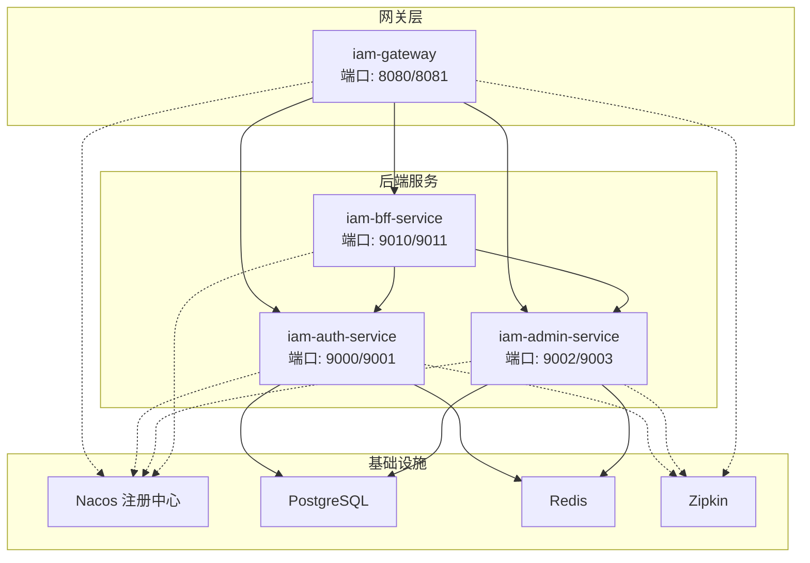
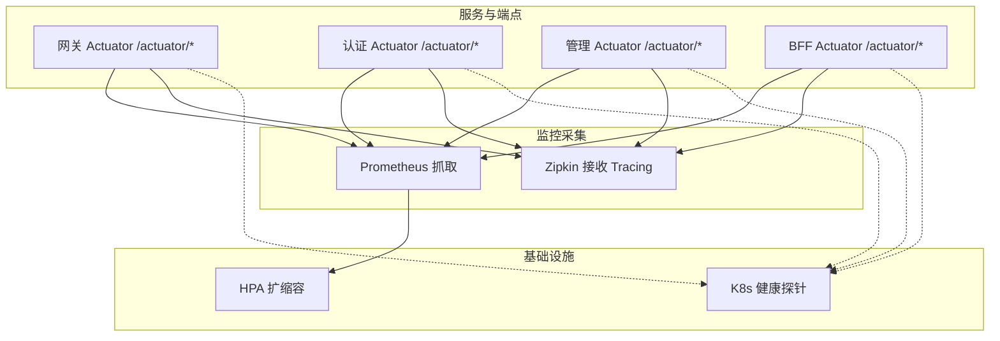
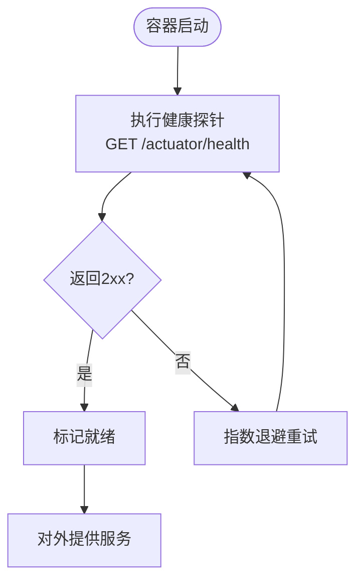
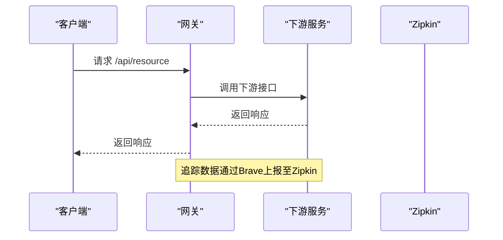
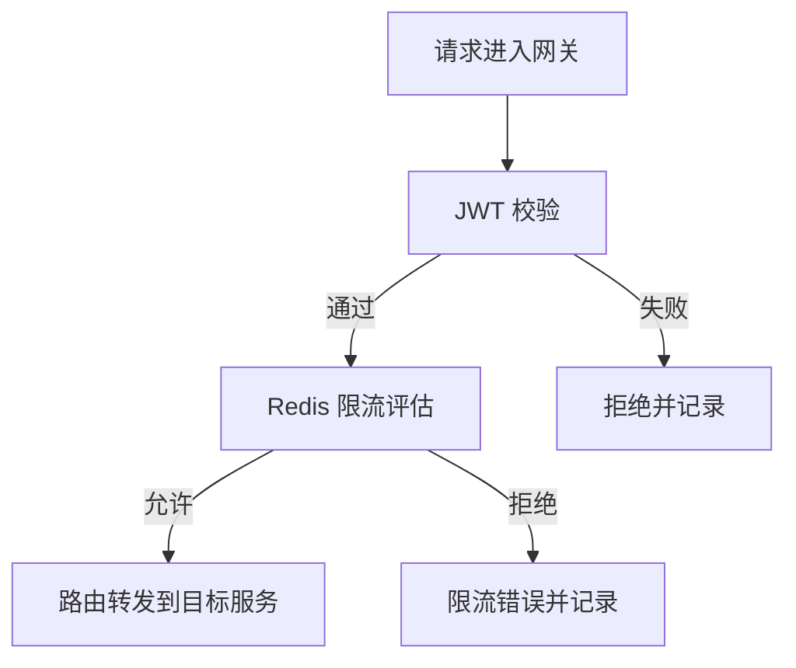
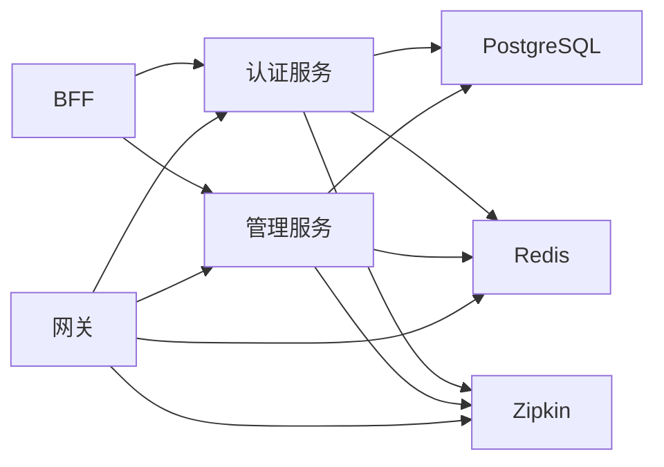

# 监控告警

<cite>
**本文引用的文件**
- [iam-admin-server/src/main/resources/application.yml](file://iam-admin-server/src/main/resources/application.yml)
- [iam-auth-server/src/main/resources/application.yml](file://iam-auth-server/src/main/resources/application.yml)
- [iam-bff-server/src/main/resources/application.yml](file://iam-bff-server/src/main/resources/application.yml)
- [iam-gateway/src/main/resources/application.yml](file://iam-gateway/src/main/resources/application.yml)
- [iam-admin-server/pom.xml](file://iam-admin-server/pom.xml)
- [iam-auth-server/pom.xml](file://iam-auth-server/pom.xml)
- [iam-gateway/pom.xml](file://iam-gateway/pom.xml)
- [docker-compose.yml](file://docker-compose.yml)
- [iam-gateway/src/main/java/iam/platform/gateway/infrastructure/config/GatewaySecurityConfig.java](file://iam-gateway/src/main/java/iam/platform/gateway/infrastructure/config/GatewaySecurityConfig.java)
- [iam-gateway/src/main/java/iam/platform/gateway/infrastructure/security/JwtAuthenticationConverter.java](file://iam-gateway/src/main/java/iam/platform/gateway/infrastructure/security/JwtAuthenticationConverter.java)
- [iam-gateway/src/main/java/iam/platform/gateway/infrastructure/security/GatewayAuthenticationSuccessHandler.java](file://iam-gateway/src/main/java/iam/platform/gateway/infrastructure/security/GatewayAuthenticationSuccessHandler.java)
- [iam-admin-server/src/main/java/iam/platform/admin/infrastructure/config/AsyncConfig.java](file://iam-admin-server/src/main/java/iam/platform/admin/infrastructure/config/AsyncConfig.java)
- [iam-admin-server/src/main/java/iam/platform/admin/infrastructure/aspect/AuditLogContextBuilder.java](file://iam-admin-server/src/main/java/iam/platform/admin/infrastructure/aspect/AuditLogContextBuilder.java)
- [iam-admin-server/src/main/java/iam/platform/admin/application/service/AuditApplicationService.java](file://iam-admin-server/src/main/java/iam/platform/admin/application/service/AuditApplicationService.java)
- [iam-auth-server/src/main/java/iam/platform/auth/infrastructure/config/SecurityPolicyProperties.java](file://iam-auth-server/src/main/java/iam/platform/auth/infrastructure/config/SecurityPolicyProperties.java)
- [iam-bff-server/src/main/java/iam/platform/bff/infrastructure/config/FeignClientConfig.java](file://iam-bff-server/src/main/java/iam/platform/bff/infrastructure/config/FeignClientConfig.java)
- [iam-common/src/main/java/iam/platform/common/model/enums/EventCategory.java](file://iam-common/src/main/java/iam/platform/common/model/enums/EventCategory.java)
- [iam-common/src/main/java/iam/platform/common/dto/response/AuditStatisticsResponse.java](file://iam-common/src/main/java/iam/platform/common/dto/response/AuditStatisticsResponse.java)
- [docs/archived/k8s/k8s/base/deployment.yaml](file://docs/archived/k8s/k8s/base/deployment.yaml)
- [docs/archived/k8s/k8s/base/hpa.yaml](file://docs/archived/k8s/k8s/base/hpa.yaml)
- [docs/archived/k8s/k8s/overlays/dev/dev-manifest.yaml](file://docs/archived/k8s/k8s/overlays/dev/dev-manifest.yaml)
</cite>

## 目录
1. [简介](#简介)
2. [项目结构](#项目结构)
3. [核心组件](#核心组件)
4. [架构总览](#架构总览)
5. [详细组件分析](#详细组件分析)
6. [依赖关系分析](#依赖关系分析)
7. [性能考量](#性能考量)
8. [故障排查指南](#故障排查指南)
9. [结论](#结论)
10. [附录](#附录)

## 简介
本文件面向IAM平台的监控告警体系，围绕应用健康检查、性能指标、日志采集与分析、告警规则以及分布式链路追踪进行系统化说明。结合项目中已启用的Spring Boot Actuator、Micrometer Prometheus、Zipkin等能力，给出可落地的配置与实践建议，并补充Kubernetes层面的健康探针与HPA扩缩容策略。

## 项目结构
IAM平台由多个微服务组成：网关、认证服务、管理服务、BFF服务；同时通过Nacos注册中心、PostgreSQL数据库、Redis缓存/会话/限流、Zipkin链路追踪等基础设施协同工作。各服务均开启Actuator健康与指标端点，并集成Prometheus与Zipkin以支撑监控与可观测性。

图表来源
- [docker-compose.yml:67-182](file://docker-compose.yml#L67-L182)
- [iam-gateway/src/main/resources/application.yml:10-116](file://iam-gateway/src/main/resources/application.yml#L10-L116)
- [iam-auth-server/src/main/resources/application.yml:10-144](file://iam-auth-server/src/main/resources/application.yml#L10-L144)
- [iam-admin-server/src/main/resources/application.yml:10-102](file://iam-admin-server/src/main/resources/application.yml#L10-L102)
- [iam-bff-server/src/main/resources/application.yml:10-54](file://iam-bff-server/src/main/resources/application.yml#L10-L54)

章节来源
- [docker-compose.yml:1-190](file://docker-compose.yml#L1-L190)
- [iam-gateway/src/main/resources/application.yml:10-116](file://iam-gateway/src/main/resources/application.yml#L10-L116)
- [iam-auth-server/src/main/resources/application.yml:10-144](file://iam-auth-server/src/main/resources/application.yml#L10-L144)
- [iam-admin-server/src/main/resources/application.yml:10-102](file://iam-admin-server/src/main/resources/application.yml#L10-L102)
- [iam-bff-server/src/main/resources/application.yml:10-54](file://iam-bff-server/src/main/resources/application.yml#L10-L54)

## 核心组件
- 应用健康检查与指标
  - 各服务均启用Actuator健康、信息、指标端点，并暴露Prometheus格式指标，便于统一采集。
  - 网关额外暴露gateway端点，便于网关维度指标采集。
- 分布式链路追踪
  - 通过Micrometer Tracing桥接到Brave，配合Zipkin Reporter上报span数据。
- 安全与审计
  - 网关侧基于JWT的资源服务器配置与认证成功处理器，保障入口安全。
  - 管理服务侧异步审计线程池与敏感字段脱敏工具，确保审计写入性能与合规。
- 外部依赖与限流
  - 网关内置Redis限流器，基于Redis实现全局请求速率限制。
  - Feign客户端配置包含连接与读取超时，有助于避免级联故障。

章节来源
- [iam-gateway/pom.xml:60-80](file://iam-gateway/pom.xml#L60-L80)
- [iam-auth-server/pom.xml:118-135](file://iam-auth-server/pom.xml#L118-L135)
- [iam-admin-server/pom.xml:88-104](file://iam-admin-server/pom.xml#L88-L104)
- [iam-gateway/src/main/resources/application.yml:93-108](file://iam-gateway/src/main/resources/application.yml#L93-L108)
- [iam-auth-server/src/main/resources/application.yml:128-143](file://iam-auth-server/src/main/resources/application.yml#L128-L143)
- [iam-admin-server/src/main/resources/application.yml:76-91](file://iam-admin-server/src/main/resources/application.yml#L76-L91)
- [iam-bff-server/src/main/resources/application.yml:33-48](file://iam-bff-server/src/main/resources/application.yml#L33-L48)
- [iam-gateway/src/main/java/iam/platform/gateway/infrastructure/config/GatewaySecurityConfig.java](file://iam-gateway/src/main/java/iam/platform/gateway/infrastructure/config/GatewaySecurityConfig.java)
- [iam-gateway/src/main/java/iam/platform/gateway/infrastructure/security/JwtAuthenticationConverter.java](file://iam-gateway/src/main/java/iam/platform/gateway/infrastructure/security/JwtAuthenticationConverter.java)
- [iam-gateway/src/main/java/iam/platform/gateway/infrastructure/security/GatewayAuthenticationSuccessHandler.java](file://iam-gateway/src/main/java/iam/platform/gateway/infrastructure/security/GatewayAuthenticationSuccessHandler.java)
- [iam-admin-server/src/main/java/iam/platform/admin/infrastructure/config/AsyncConfig.java:18-29](file://iam-admin-server/src/main/java/iam/platform/admin/infrastructure/config/AsyncConfig.java#L18-L29)
- [iam-admin-server/src/main/java/iam/platform/admin/infrastructure/aspect/AuditLogContextBuilder.java:91-127](file://iam-admin-server/src/main/java/iam/platform/admin/infrastructure/aspect/AuditLogContextBuilder.java#L91-L127)
- [iam-auth-server/src/main/java/iam/platform/auth/infrastructure/config/SecurityPolicyProperties.java:16-36](file://iam-auth-server/src/main/java/iam/platform/auth/infrastructure/config/SecurityPolicyProperties.java#L16-L36)
- [iam-bff-server/src/main/java/iam/platform/bff/infrastructure/config/FeignClientConfig.java:14-50](file://iam-bff-server/src/main/java/iam/platform/bff/infrastructure/config/FeignClientConfig.java#L14-L50)

## 架构总览
下图展示监控与告警的关键交互：各服务通过Actuator暴露指标，Prometheus定期抓取；Zipkin接收Tracing数据用于链路分析；Kubernetes健康探针保障容器存活与就绪；网关侧安全与限流策略在入口处拦截异常流量。

图表来源
- [iam-gateway/src/main/resources/application.yml:96-99](file://iam-gateway/src/main/resources/application.yml#L96-L99)
- [iam-auth-server/src/main/resources/application.yml:131-134](file://iam-auth-server/src/main/resources/application.yml#L131-L134)
- [iam-admin-server/src/main/resources/application.yml:79-82](file://iam-admin-server/src/main/resources/application.yml#L79-L82)
- [iam-bff-server/src/main/resources/application.yml:36-39](file://iam-bff-server/src/main/resources/application.yml#L36-L39)
- [docker-compose.yml:58-66](file://docker-compose.yml#L58-L66)
- [docs/archived/k8s/k8s/base/hpa.yaml:1-24](file://docs/archived/k8s/k8s/base/hpa.yaml#L1-L24)

## 详细组件分析

### 应用健康检查与外部依赖检查
- 健康检查端点
  - 网关：暴露health、info、metrics、gateway端点，便于网关维度健康与指标采集。
  - 认证/管理/BFF：暴露health、info、metrics、prometheus端点。
- 外部依赖
  - 数据库：PostgreSQL容器自带健康检查命令。
  - 缓存/会话/限流：Redis容器自带健康检查命令。
  - 注册中心：Nacos容器提供HTTP健康检查。
  - 链路追踪：Zipkin容器直接暴露端口。
- Kubernetes健康探针
  - 使用HTTP GET /actuator/health作为存活与就绪探针，周期与延迟参数已在清单中配置。

图表来源
- [docker-compose.yml:17-21](file://docker-compose.yml#L17-L21)
- [docker-compose.yml:37-41](file://docker-compose.yml#L37-L41)
- [docker-compose.yml:52-56](file://docker-compose.yml#L52-L56)
- [docs/archived/k8s/k8s/overlays/dev/dev-manifest.yaml:139-147](file://docs/archived/k8s/k8s/overlays/dev/dev-manifest.yaml#L139-L147)

章节来源
- [iam-gateway/src/main/resources/application.yml:96-99](file://iam-gateway/src/main/resources/application.yml#L96-L99)
- [iam-auth-server/src/main/resources/application.yml:131-134](file://iam-auth-server/src/main/resources/application.yml#L131-L134)
- [iam-admin-server/src/main/resources/application.yml:79-82](file://iam-admin-server/src/main/resources/application.yml#L79-L82)
- [iam-bff-server/src/main/resources/application.yml:36-39](file://iam-bff-server/src/main/resources/application.yml#L36-L39)
- [docker-compose.yml:17-21](file://docker-compose.yml#L17-L21)
- [docker-compose.yml:37-41](file://docker-compose.yml#L37-L41)
- [docker-compose.yml:52-56](file://docker-compose.yml#L52-L56)
- [docs/archived/k8s/k8s/overlays/dev/dev-manifest.yaml:139-147](file://docs/archived/k8s/k8s/overlays/dev/dev-manifest.yaml#L139-L147)

### 性能指标监控方案
- 指标采集
  - Prometheus端点：各服务通过management.endpoints.web.exposure.include启用metrics与prometheus。
  - 标签：通过management.metrics.tags.application为指标打上应用标签，便于多实例聚合与筛选。
  - 网关端点：gateway端点用于网关维度指标（路由、过滤器、断路器等）。
- 关键性能指标建议
  - 响应时间：HTTP客户端与WebMVC自动指标（如 http.server.requests.duration、http.client.requests.duration），结合分位数统计。
  - 吞吐量：每秒请求数（requests per second），可通过计数器或桶计数计算。
  - 错误率：HTTP 4xx/5xx比例，结合错误码分布。
  - 网关指标：路由匹配次数、过滤器耗时、断路器状态、Redis限流命中率。
  - 资源使用：JVM内存、GC、线程数；CPU使用率与内存使用率（需Prometheus Node Exporter）。
- Grafana仪表板建议
  - 服务概览面板：健康状态、CPU/内存、请求速率、错误率、P95/P99响应时间。
  - 网关面板：路由命中、平均/峰值延迟、错误分布、Redis限流统计。
  - 数据库面板：连接池使用、慢查询、事务回滚。
  - 链路面板：调用拓扑、热点接口、失败率、慢调用根因。

章节来源
- [iam-gateway/src/main/resources/application.yml:96-102](file://iam-gateway/src/main/resources/application.yml#L96-L102)
- [iam-auth-server/src/main/resources/application.yml:135-137](file://iam-auth-server/src/main/resources/application.yml#L135-L137)
- [iam-admin-server/src/main/resources/application.yml:83-85](file://iam-admin-server/src/main/resources/application.yml#L83-L85)
- [iam-bff-server/src/main/resources/application.yml:40-42](file://iam-bff-server/src/main/resources/application.yml#L40-L42)

### 日志收集与分析系统
- 日志采集
  - 服务日志输出到标准输出，容器编排环境（如Kubernetes）统一收集。
  - 建议使用集中式日志栈（如ELK/EFK）聚合容器日志，结合日志过滤与索引。
- 实时告警
  - 在日志系统中设置规则：高频错误、异常堆栈、特定关键词（如“authentication failed”、“SQL exception”）触发告警。
  - 结合业务审计事件（见下节）进行异常行为检测与告警。
- 审计与脱敏
  - 管理服务启用异步审计线程池，降低写入对主流程影响。
  - 审计上下文构建器支持对敏感字段进行脱敏处理，避免日志泄露。

章节来源
- [iam-admin-server/src/main/resources/application.yml:93-102](file://iam-admin-server/src/main/resources/application.yml#L93-L102)
- [iam-admin-server/src/main/java/iam/platform/admin/infrastructure/config/AsyncConfig.java:18-29](file://iam-admin-server/src/main/java/iam/platform/admin/infrastructure/config/AsyncConfig.java#L18-L29)
- [iam-admin-server/src/main/java/iam/platform/admin/infrastructure/aspect/AuditLogContextBuilder.java:91-127](file://iam-admin-server/src/main/java/iam/platform/admin/infrastructure/aspect/AuditLogContextBuilder.java#L91-L127)

### 审计日志与统计
- 审计事件分类
  - 支持认证、授权、账户、管理、会话等事件类别，便于按维度统计与分析。
- 统计模型
  - 提供审计统计响应模型，包含事件总数、按类别/结果计数、Top事件类型、时间范围等。
- 查询与详情
  - 支持按事件类型、分类、资源类型/ID、时间区间等条件查询审计列表与详情。

章节来源
- [iam-common/src/main/java/iam/platform/common/model/enums/EventCategory.java:6-12](file://iam-common/src/main/java/iam/platform/common/model/enums/EventCategory.java#L6-L12)
- [iam-common/src/main/java/iam/platform/common/dto/response/AuditStatisticsResponse.java:16-32](file://iam-common/src/main/java/iam/platform/common/dto/response/AuditStatisticsResponse.java#L16-L32)
- [iam-admin-server/src/main/java/iam/platform/admin/application/service/AuditApplicationService.java:64-90](file://iam-admin-server/src/main/java/iam/platform/admin/application/service/AuditApplicationService.java#L64-L90)

### 分布式链路追踪配置
- 配置要点
  - Micrometer Tracing桥接到Brave，Zipkin Reporter负责上报。
  - 采样概率默认1.0，适合开发与测试环境；生产环境建议根据流量调整采样率。
  - 各服务通过management.zipkin.tracing.endpoint指向Zipkin地址。
- 性能瓶颈分析
  - 通过Trace视图定位慢调用、高延迟阶段与跨服务调用链。
  - 结合Prometheus指标（如响应时间、错误率）与Trace数据进行交叉分析。

图表来源
- [iam-gateway/src/main/resources/application.yml:103-108](file://iam-gateway/src/main/resources/application.yml#L103-L108)
- [iam-auth-server/src/main/resources/application.yml:138-143](file://iam-auth-server/src/main/resources/application.yml#L138-L143)
- [iam-admin-server/src/main/resources/application.yml:86-91](file://iam-admin-server/src/main/resources/application.yml#L86-L91)
- [iam-bff-server/src/main/resources/application.yml:43-48](file://iam-bff-server/src/main/resources/application.yml#L43-L48)

章节来源
- [iam-gateway/pom.xml:72-80](file://iam-gateway/pom.xml#L72-L80)
- [iam-auth-server/pom.xml:127-134](file://iam-auth-server/pom.xml#L127-L134)
- [iam-admin-server/pom.xml:97-104](file://iam-admin-server/pom.xml#L97-L104)
- [iam-gateway/src/main/resources/application.yml:103-108](file://iam-gateway/src/main/resources/application.yml#L103-L108)
- [iam-auth-server/src/main/resources/application.yml:138-143](file://iam-auth-server/src/main/resources/application.yml#L138-L143)
- [iam-admin-server/src/main/resources/application.yml:86-91](file://iam-admin-server/src/main/resources/application.yml#L86-L91)
- [iam-bff-server/src/main/resources/application.yml:43-48](file://iam-bff-server/src/main/resources/application.yml#L43-L48)

### 网关安全与限流
- 安全策略
  - 资源服务器JWT校验，基于issuer-uri验证令牌有效性。
  - 认证成功处理器用于登录成功后的后续处理。
- 限流策略
  - 基于Redis的限流器，分别为认证与管理路由配置不同的速率与突发容量。
  - 可结合Prometheus指标观察限流命中情况与错误分布。

图表来源
- [iam-gateway/src/main/resources/application.yml:14-54](file://iam-gateway/src/main/resources/application.yml#L14-L54)
- [iam-gateway/src/main/java/iam/platform/gateway/infrastructure/config/GatewaySecurityConfig.java](file://iam-gateway/src/main/java/iam/platform/gateway/infrastructure/config/GatewaySecurityConfig.java)
- [iam-gateway/src/main/java/iam/platform/gateway/infrastructure/security/JwtAuthenticationConverter.java](file://iam-gateway/src/main/java/iam/platform/gateway/infrastructure/security/JwtAuthenticationConverter.java)
- [iam-gateway/src/main/java/iam/platform/gateway/infrastructure/security/GatewayAuthenticationSuccessHandler.java](file://iam-gateway/src/main/java/iam/platform/gateway/infrastructure/security/GatewayAuthenticationSuccessHandler.java)

章节来源
- [iam-gateway/src/main/resources/application.yml:14-54](file://iam-gateway/src/main/resources/application.yml#L14-L54)
- [iam-gateway/src/main/java/iam/platform/gateway/infrastructure/config/GatewaySecurityConfig.java](file://iam-gateway/src/main/java/iam/platform/gateway/infrastructure/config/GatewaySecurityConfig.java)
- [iam-gateway/src/main/java/iam/platform/gateway/infrastructure/security/JwtAuthenticationConverter.java](file://iam-gateway/src/main/java/iam/platform/gateway/infrastructure/security/JwtAuthenticationConverter.java)
- [iam-gateway/src/main/java/iam/platform/gateway/infrastructure/security/GatewayAuthenticationSuccessHandler.java](file://iam-gateway/src/main/java/iam/platform/gateway/infrastructure/security/GatewayAuthenticationSuccessHandler.java)

### 外部服务依赖检查与告警
- 依赖健康
  - PostgreSQL、Redis、Nacos、Zipkin均具备健康检查机制，可在监控系统中作为关键依赖健康度指标。
- 告警建议
  - 依赖不可用或健康检查失败立即告警。
  - 依赖延迟超过阈值触发预警（如Redis命令响应时间、数据库连接池空等）。

章节来源
- [docker-compose.yml:17-21](file://docker-compose.yml#L17-L21)
- [docker-compose.yml:37-41](file://docker-compose.yml#L37-L41)
- [docker-compose.yml:52-56](file://docker-compose.yml#L52-L56)
- [docker-compose.yml:17-21](file://docker-compose.yml#L17-L21)

## 依赖关系分析
- 服务间依赖
  - BFF服务依赖认证与管理服务；网关作为统一入口，路由到认证与管理服务。
- 外部依赖
  - 认证/管理服务依赖PostgreSQL与Redis；网关依赖Redis用于限流。
  - 所有服务均依赖Zipkin进行链路追踪。
- 观测性依赖
  - Prometheus采集各服务指标；Kubernetes健康探针保障容器健康。

图表来源
- [docker-compose.yml:67-182](file://docker-compose.yml#L67-L182)
- [iam-gateway/src/main/resources/application.yml:18-54](file://iam-gateway/src/main/resources/application.yml#L18-L54)
- [iam-auth-server/src/main/resources/application.yml:15-37](file://iam-auth-server/src/main/resources/application.yml#L15-L37)
- [iam-admin-server/src/main/resources/application.yml:15-37](file://iam-admin-server/src/main/resources/application.yml#L15-L37)

章节来源
- [docker-compose.yml:67-182](file://docker-compose.yml#L67-L182)
- [iam-gateway/src/main/resources/application.yml:18-54](file://iam-gateway/src/main/resources/application.yml#L18-L54)
- [iam-auth-server/src/main/resources/application.yml:15-37](file://iam-auth-server/src/main/resources/application.yml#L15-L37)
- [iam-admin-server/src/main/resources/application.yml:15-37](file://iam-admin-server/src/main/resources/application.yml#L15-L37)

## 性能考量
- 指标粒度与开销
  - 采样概率1.0便于全面观测，但会增加追踪数据量；生产环境建议按业务流量动态调整采样率。
- 网关限流
  - Redis限流器可有效防止突发流量冲击下游；建议结合Prometheus观察命中率与错误趋势。
- 审计写入
  - 异步线程池与队列容量配置可提升审计写入吞吐，避免阻塞主流程。

章节来源
- [iam-gateway/src/main/resources/application.yml:25-41](file://iam-gateway/src/main/resources/application.yml#L25-L41)
- [iam-admin-server/src/main/resources/application.yml:98-101](file://iam-admin-server/src/main/resources/application.yml#L98-L101)
- [iam-admin-server/src/main/java/iam/platform/admin/infrastructure/config/AsyncConfig.java:18-29](file://iam-admin-server/src/main/java/iam/platform/admin/infrastructure/config/AsyncConfig.java#L18-L29)

## 故障排查指南
- 健康检查失败
  - 检查容器健康探针配置与端口可达性；确认Actuator端点正常。
- 指标缺失
  - 确认management.endpoints.web.exposure.include包含metrics与prometheus；检查Prometheus抓取任务配置。
- 链路追踪异常
  - 检查management.zipkin.tracing.endpoint与采样率；确认Zipkin服务可用。
- 网关限流频繁
  - 检查Redis限流器配置与实际命中率；必要时调整速率参数。
- 审计日志异常
  - 检查异步线程池配置与队列容量；关注脱敏逻辑是否覆盖敏感字段。

章节来源
- [iam-gateway/src/main/resources/application.yml:96-108](file://iam-gateway/src/main/resources/application.yml#L96-L108)
- [iam-auth-server/src/main/resources/application.yml:131-143](file://iam-auth-server/src/main/resources/application.yml#L131-L143)
- [iam-admin-server/src/main/resources/application.yml:79-91](file://iam-admin-server/src/main/resources/application.yml#L79-L91)
- [iam-bff-server/src/main/resources/application.yml:36-48](file://iam-bff-server/src/main/resources/application.yml#L36-L48)
- [iam-gateway/src/main/resources/application.yml:25-41](file://iam-gateway/src/main/resources/application.yml#L25-L41)
- [iam-admin-server/src/main/java/iam/platform/admin/infrastructure/config/AsyncConfig.java:18-29](file://iam-admin-server/src/main/java/iam/platform/admin/infrastructure/config/AsyncConfig.java#L18-L29)
- [iam-admin-server/src/main/java/iam/platform/admin/infrastructure/aspect/AuditLogContextBuilder.java:91-127](file://iam-admin-server/src/main/java/iam/platform/admin/infrastructure/aspect/AuditLogContextBuilder.java#L91-L127)

## 结论
IAM平台已具备完善的监控与可观测性基础：Actuator健康与指标端点、Prometheus采集、Zipkin链路追踪、Kubernetes健康探针与HPA扩缩容。建议在此基础上完善Grafana仪表板、日志分析与实时告警规则，并针对生产环境优化采样率与限流策略，持续提升系统稳定性与可运维性。

## 附录
- Kubernetes健康探针与HPA
  - 健康探针：使用HTTP GET /actuator/health作为存活与就绪探针。
  - HPA：基于CPU与内存利用率进行自动扩缩容。

章节来源
- [docs/archived/k8s/k8s/overlays/dev/dev-manifest.yaml:139-147](file://docs/archived/k8s/k8s/overlays/dev/dev-manifest.yaml#L139-L147)
- [docs/archived/k8s/k8s/base/hpa.yaml:1-24](file://docs/archived/k8s/k8s/base/hpa.yaml#L1-L24)