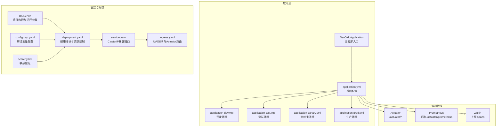
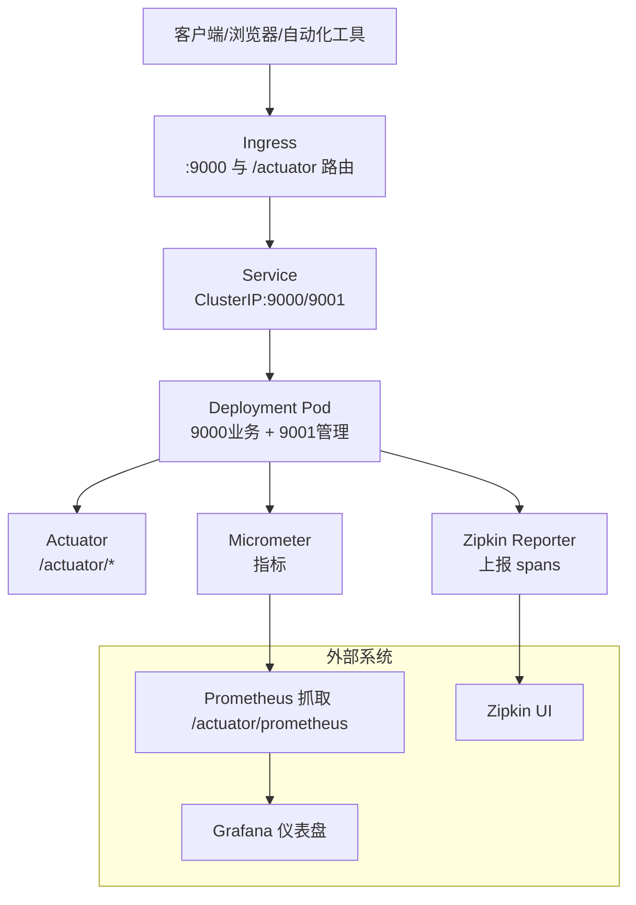
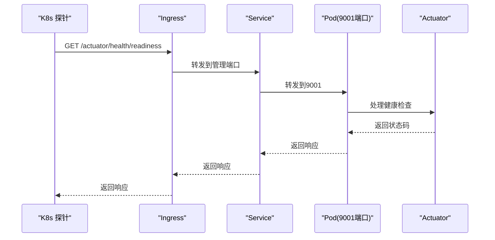
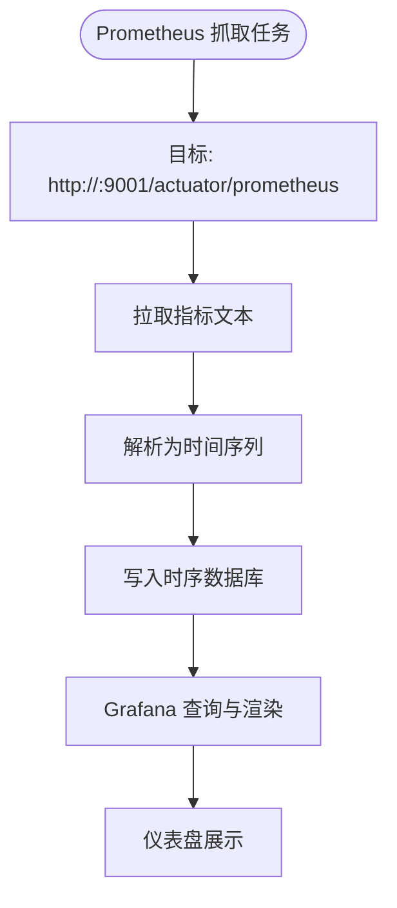
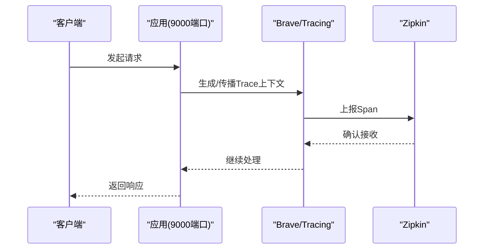
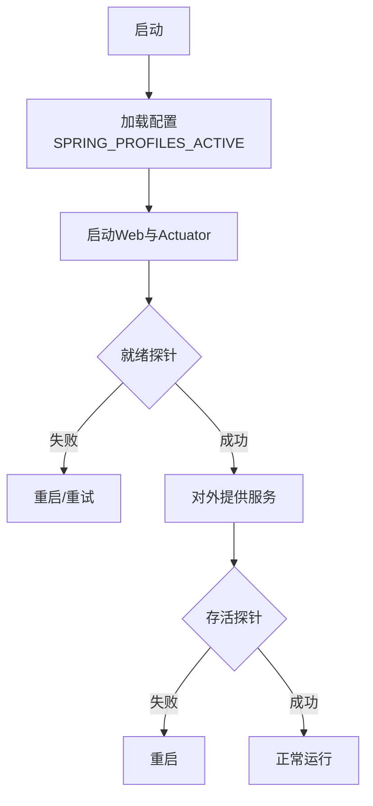
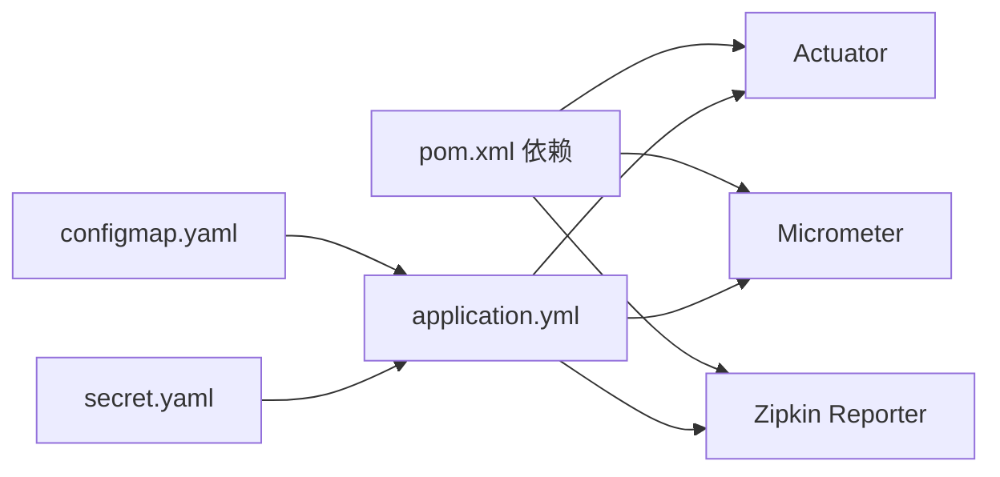

# 监控日志

<cite>
**本文引用的文件**
- [pom.xml](file://pom.xml)
- [application.yml](file://src/main/resources/application.yml)
- [application-dev.yml](file://src/main/resources/application-dev.yml)
- [application-test.yml](file://src/main/resources/application-test.yml)
- [application-canary.yml](file://src/main/resources/application-canary.yml)
- [application-prod.yml](file://src/main/resources/application-prod.yml)
- [Dockerfile](file://Dockerfile)
- [deployment.yaml](file://k8s/base/deployment.yaml)
- [service.yaml](file://k8s/base/service.yaml)
- [ingress.yaml](file://k8s/base/ingress.yaml)
- [configmap.yaml](file://k8s/base/configmap.yaml)
- [secret.yaml](file://k8s/base/secret.yaml)
- [SsoOidcApplication.java](file://src/main/java/sso/oidc/SsoOidcApplication.java)
</cite>

## 目录
1. [简介](#简介)
2. [项目结构](#项目结构)
3. [核心组件](#核心组件)
4. [架构总览](#架构总览)
5. [详细组件分析](#详细组件分析)
6. [依赖关系分析](#依赖关系分析)
7. [性能考量](#性能考量)
8. [故障排查指南](#故障排查指南)
9. [结论](#结论)
10. [附录](#附录)

## 简介
本文件面向运维与开发团队，系统化梳理该SSO/OIDC服务在Spring Boot生态下的监控与日志管理方案，覆盖以下主题：
- Spring Boot Actuator监控端点：健康检查、指标收集、应用信息展示
- Micrometer + Prometheus指标采集与Grafana可视化
- 日志聚合与查询（基于当前仓库未内置ELK，提供可落地的集成建议）
- 分布式链路追踪：Zipkin集成与采样策略
- 告警规则、性能基准与容量规划建议
- Kubernetes部署中的健康探针与端口暴露

## 项目结构
该项目采用Spring Boot 3 + Maven构建，Actuator、Micrometer、Brave/Zipkin已作为依赖引入；Kubernetes清单中暴露了业务端口与管理端口，并配置了健康探针。

图表来源
- [SsoOidcApplication.java:1-13](file://src/main/java/sso/oidc/SsoOidcApplication.java#L1-L13)
- [application.yml:63-77](file://src/main/resources/application.yml#L63-L77)
- [Dockerfile:38-59](file://Dockerfile#L38-L59)
- [deployment.yaml:17-54](file://k8s/base/deployment.yaml#L17-L54)
- [service.yaml:8-15](file://k8s/base/service.yaml#L8-L15)
- [ingress.yaml:19-25](file://k8s/base/ingress.yaml#L19-L25)
- [configmap.yaml:6-13](file://k8s/base/configmap.yaml#L6-L13)

章节来源
- [pom.xml:87-103](file://pom.xml#L87-L103)
- [application.yml:1-78](file://src/main/resources/application.yml#L1-L78)
- [Dockerfile:1-60](file://Dockerfile#L1-L60)
- [deployment.yaml:1-58](file://k8s/base/deployment.yaml#L1-L58)
- [service.yaml:1-18](file://k8s/base/service.yaml#L1-L18)
- [ingress.yaml:1-26](file://k8s/base/ingress.yaml#L1-L26)
- [configmap.yaml:1-14](file://k8s/base/configmap.yaml#L1-L14)
- [secret.yaml:1-11](file://k8s/base/secret.yaml#L1-L11)

## 核心组件
- Actuator与管理端口
  - 管理端口：9001，暴露健康、信息、指标、Prometheus端点
  - 端点白名单：health、info、metrics、prometheus
- 指标与标签
  - 全局指标标签包含应用名，便于多实例聚合
- 链路追踪
  - Brave桥接Micrometer与Zipkin，采样概率按环境配置
- 容器与Kubernetes
  - 业务端口9000，管理端口9001
  - 健康探针：readiness/liveness/startup均指向Actuator健康端点
  - Ingress将/actuator前缀路由到管理端口，便于外部访问

章节来源
- [application.yml:63-77](file://src/main/resources/application.yml#L63-L77)
- [deployment.yaml:37-54](file://k8s/base/deployment.yaml#L37-L54)
- [ingress.yaml:19-25](file://k8s/base/ingress.yaml#L19-L25)

## 架构总览
下图展示了从客户端到应用、再到观测系统的整体路径，以及Kubernetes网络与探针如何协同保障可用性。

图表来源
- [ingress.yaml:8-25](file://k8s/base/ingress.yaml#L8-L25)
- [service.yaml:8-15](file://k8s/base/service.yaml#L8-L15)
- [deployment.yaml:17-54](file://k8s/base/deployment.yaml#L17-L54)
- [application.yml:63-77](file://src/main/resources/application.yml#L63-L77)

## 详细组件分析

### Spring Boot Actuator监控端点
- 端点暴露
  - 管理服务器端口：9001
  - 暴露端点：health、info、metrics、prometheus
- 健康检查
  - 提供readiness/liveness/startup三类健康状态，用于Kubernetes探针
- 应用信息
  - info端点可用于注入构建元数据、版本信息等
- 指标收集
  - 默认暴露JVM、进程、HTTP请求、Tomcat线程池等指标
  - 可通过自定义Meter扩展业务指标

图表来源
- [deployment.yaml:37-54](file://k8s/base/deployment.yaml#L37-L54)
- [ingress.yaml:19-25](file://k8s/base/ingress.yaml#L19-L25)
- [application.yml:63-69](file://src/main/resources/application.yml#L63-L69)

章节来源
- [application.yml:63-69](file://src/main/resources/application.yml#L63-L69)
- [deployment.yaml:37-54](file://k8s/base/deployment.yaml#L37-L54)
- [ingress.yaml:19-25](file://k8s/base/ingress.yaml#L19-L25)

### Micrometer + Prometheus指标采集
- 依赖
  - spring-boot-starter-actuator、micrometer-registry-prometheus
- 配置
  - 管理端口9001，暴露/prometheus
  - 全局指标标签包含应用名
- 采集
  - Prometheus以固定间隔抓取 /actuator/prometheus
- 建议
  - 在Grafana中创建数据源并导入常用面板（JVM、Tomcat、HTTP、业务指标）

图表来源
- [application.yml:63-72](file://src/main/resources/application.yml#L63-L72)
- [pom.xml:87-103](file://pom.xml#L87-L103)

章节来源
- [pom.xml:87-103](file://pom.xml#L87-L103)
- [application.yml:63-72](file://src/main/resources/application.yml#L63-L72)

### 分布式链路追踪（Zipkin）
- 依赖
  - micrometer-tracing-bridge-brave、zipkin-reporter-brave
- 配置
  - 采样概率：开发环境1.0，生产环境0.1
  - Zipkin上报端点通过环境变量配置
- 建议
  - 在Grafana中添加Zipkin数据源，建立调用拓扑与延迟分析面板

图表来源
- [pom.xml:96-103](file://pom.xml#L96-L103)
- [application.yml:73-77](file://src/main/resources/application.yml#L73-L77)
- [application-prod.yml:21-24](file://src/main/resources/application-prod.yml#L21-L24)

章节来源
- [pom.xml:96-103](file://pom.xml#L96-L103)
- [application.yml:73-77](file://src/main/resources/application.yml#L73-L77)
- [application-prod.yml:21-24](file://src/main/resources/application-prod.yml#L21-L24)

### 日志管理与ELK集成（建议）
当前仓库未包含Logback XML或Logstash配置，但可按以下方式快速落地：
- Logback
  - 使用控制台输出，结合容器日志驱动（stdout/stderr）采集
  - 在不同环境调整根日志级别与包日志级别
- Elasticsearch
  - 建议按天滚动索引（如应用名-YYYY.MM.DD），设置生命周期策略（ILM）
- Kibana
  - 导入常用仪表盘与查询模板，聚焦认证失败、超时、异常堆栈等
- 建议的采集链路
  - 应用输出到stdout → 容器日志驱动 → Fluent Bit/Fluentd → Elasticsearch → Kibana

章节来源
- [application-dev.yml:12-17](file://src/main/resources/application-dev.yml#L12-L17)
- [application-test.yml:7-11](file://src/main/resources/application-test.yml#L7-L11)
- [application-canary.yml:7-11](file://src/main/resources/application-canary.yml#L7-L11)
- [application-prod.yml:11-15](file://src/main/resources/application-prod.yml#L11-L15)

### Kubernetes部署与健康探针
- 端口暴露
  - 9000：业务HTTP
  - 9001：管理HTTP（Actuator）
- 探针策略
  - readiness：访问 /actuator/health/readiness
  - liveness：访问 /actuator/health/liveness
  - startup：访问 /actuator/health
- Ingress
  - 将 /actuator 前缀路由到管理端口，便于外部访问管理端点
- 运行参数
  - 容器内通过环境变量激活Spring Profile
  - HEALTHCHECK命令直接调用管理端口健康端点

图表来源
- [deployment.yaml:37-54](file://k8s/base/deployment.yaml#L37-L54)
- [ingress.yaml:19-25](file://k8s/base/ingress.yaml#L19-L25)
- [Dockerfile:50-52](file://Dockerfile#L50-L52)

章节来源
- [deployment.yaml:17-54](file://k8s/base/deployment.yaml#L17-L54)
- [service.yaml:8-15](file://k8s/base/service.yaml#L8-L15)
- [ingress.yaml:19-25](file://k8s/base/ingress.yaml#L19-L25)
- [Dockerfile:50-52](file://Dockerfile#L50-L52)

## 依赖关系分析
- 观测性依赖
  - Actuator：提供管理端点
  - Micrometer + Prometheus：指标采集
  - Brave + Zipkin：链路追踪
- 环境差异
  - 开发：高采样（便于调试）
  - 生产：低采样（降低开销）
- 配置来源
  - ConfigMap：非敏感配置（数据库、Redis、Zipkin地址等）
  - Secret：敏感配置（数据库密码、加密密钥等）

图表来源
- [pom.xml:87-103](file://pom.xml#L87-L103)
- [application.yml:63-77](file://src/main/resources/application.yml#L63-L77)
- [configmap.yaml:5-13](file://k8s/base/configmap.yaml#L5-L13)
- [secret.yaml:6-10](file://k8s/base/secret.yaml#L6-L10)

章节来源
- [pom.xml:87-103](file://pom.xml#L87-L103)
- [application.yml:63-77](file://src/main/resources/application.yml#L63-L77)
- [configmap.yaml:1-14](file://k8s/base/configmap.yaml#L1-L14)
- [secret.yaml:1-11](file://k8s/base/secret.yaml#L1-L11)

## 性能考量
- 指标与追踪
  - 生产环境降低Zipkin采样率，避免追踪开销过大
  - 合理设置Prometheus抓取间隔，避免瞬时峰值导致抓取压力
- 数据库连接池
  - 生产环境提高Hikari最大池大小，配合Flyway与JPA使用
- JVM与容器
  - 容器内存限制与JVM参数匹配，避免GC抖动
- 探针频率
  - 探针周期与阈值需平衡探测灵敏度与对业务的影响

## 故障排查指南
- 健康检查失败
  - 检查 /actuator/health 的具体分项状态
  - 关注数据库连通性、Redis可用性、JWK文件读取
- 指标缺失
  - 确认管理端口可达且 /actuator/prometheus 可访问
  - 检查全局标签是否正确注入
- 链路追踪无数据
  - 核对采样概率与Zipkin上报端点
  - 检查容器网络连通性与防火墙策略
- 日志问题
  - 开发环境开启DEBUG级别，定位SQL与安全相关问题
  - 生产环境保持INFO/WARN，避免日志风暴

章节来源
- [application-dev.yml:12-17](file://src/main/resources/application-dev.yml#L12-L17)
- [application-prod.yml:11-15](file://src/main/resources/application-prod.yml#L11-L15)
- [deployment.yaml:37-54](file://k8s/base/deployment.yaml#L37-L54)
- [ingress.yaml:19-25](file://k8s/base/ingress.yaml#L19-L25)

## 结论
本项目已具备完善的Spring Boot观测性基础：Actuator端点、Micrometer指标、Zipkin链路追踪与Kubernetes健康探针。建议在生产环境中启用Prometheus抓取与Grafana可视化，并按需补充ELK日志聚合能力；同时结合容量规划与告警策略，持续优化系统稳定性与可观测性。

## 附录
- 环境变量与配置映射
  - SPRING_PROFILES_ACTIVE：dev/test/canary/prod
  - DB_*、REDIS_*：数据源与缓存配置
  - ZIPKIN_ENDPOINT：Zipkin上报地址
- 建议的Grafana仪表盘维度
  - JVM堆与GC、线程数、HTTP请求数与错误率、数据库连接池使用率、Zipkin延迟分布

章节来源
- [configmap.yaml:6-13](file://k8s/base/configmap.yaml#L6-L13)
- [application.yml:63-77](file://src/main/resources/application.yml#L63-L77)