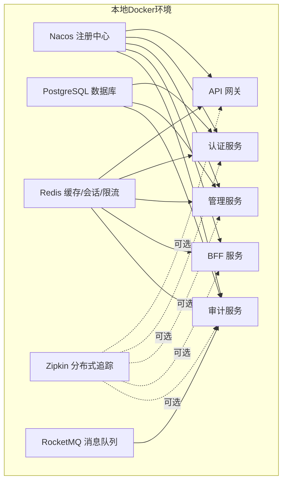
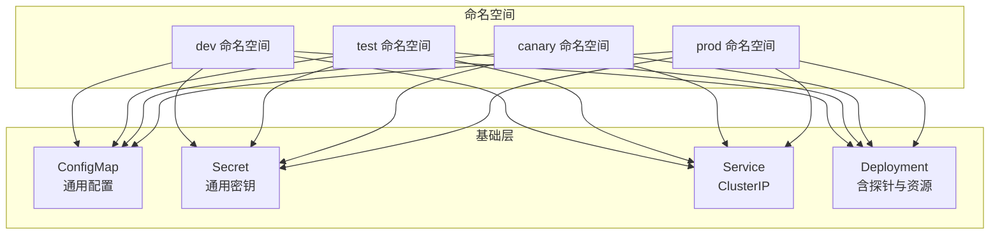
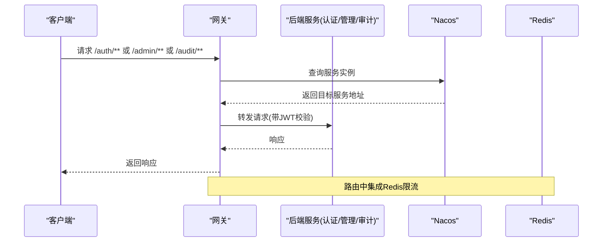
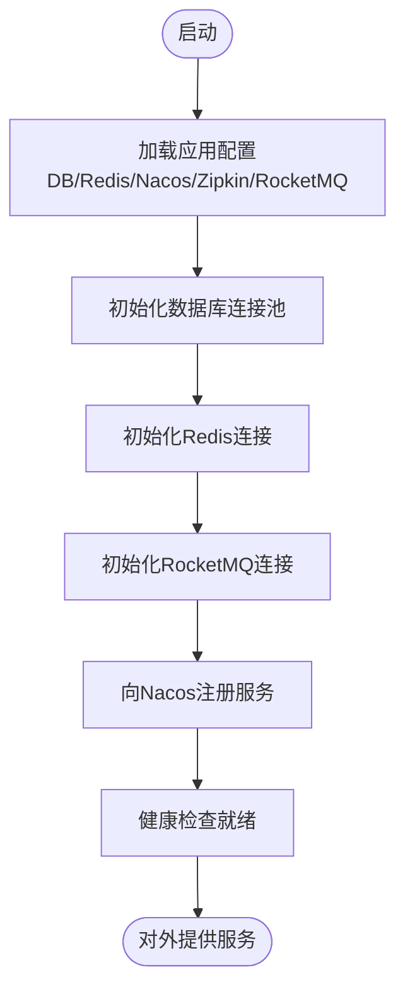
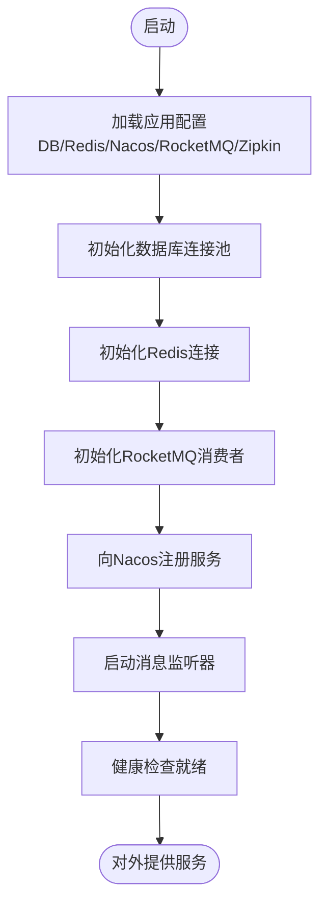
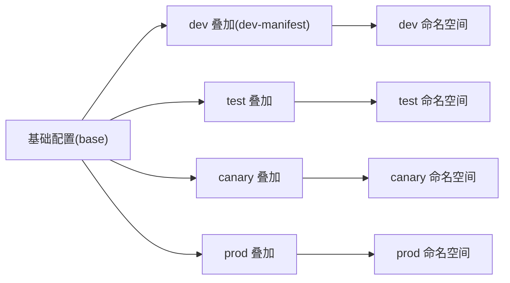
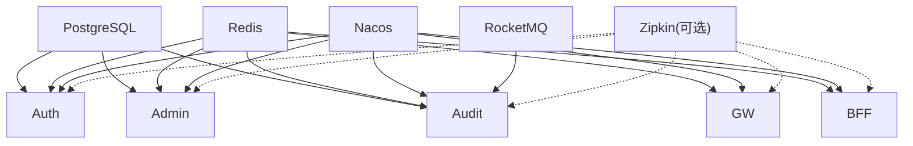

# 部署策略

<cite>
**本文引用的文件**
- [docker-compose.app.yml](file://docker-compose.app.yml)
- [docker-compose.middleware.yml](file://docker-compose.middleware.yml)
- [iam-audit-server/Dockerfile](file://iam-audit-server/Dockerfile)
- [iam-audit-server/pom.xml](file://iam-audit-server/pom.xml)
- [iam-audit-server/src/main/resources/application.yml](file://iam-audit-server/src/main/resources/application.yml)
- [iam-audit-server/src/main/resources/application-dev.yml](file://iam-audit-server/src/main/resources/application-dev.yml)
- [iam-audit-server/src/main/java/iam/platform/audit/AuditServerApplication.java](file://iam-audit-server/src/main/java/iam/platform/audit/AuditServerApplication.java)
- [iam-audit-server/src/main/java/iam/platform/audit/application/consumer/AuditEventConsumer.java](file://iam-audit-server/src/main/java/iam/platform/audit/application/consumer/AuditEventConsumer.java)
- [iam-audit-server/src/main/java/iam/platform/audit/interfaces/controller/AuditLogController.java](file://iam-audit-server/src/main/java/iam/platform/audit/interfaces/controller/AuditLogController.java)
- [iam-gateway/bootstrap.yml](file://iam-gateway/bootstrap.yml)
- [iam-auth-server/bootstrap.yml](file://iam-auth-server/bootstrap.yml)
- [iam-admin-server/bootstrap.yml](file://iam-admin-server/bootstrap.yml)
- [iam-bff-server/bootstrap.yml](file://iam-bff-server/bootstrap.yml)
- [docs/archived/k8s/k8s/base/deployment.yaml](file://docs/archived/k8s/k8s/base/deployment.yaml)
- [docs/archived/k8s/k8s/base/service.yaml](file://docs/archived/k8s/k8s/base/service.yaml)
- [docs/archived/k8s/k8s/base/configmap.yaml](file://docs/archived/k8s/k8s/base/configmap.yaml)
- [docs/archived/k8s/k8s/base/secret.yaml](file://docs/archived/k8s/k8s/base/secret.yaml)
- [docs/archived/k8s/k8s/overlays/dev/dev-manifest.yaml](file://docs/archived/k8s/k8s/overlays/dev/dev-manifest.yaml)
- [iam-gateway/src/main/resources/application.yml](file://iam-gateway/src/main/resources/application.yml)
- [iam-auth-server/src/main/resources/application.yml](file://iam-auth-server/src/main/resources/application.yml)
- [iam-admin-server/src/main/resources/application.yml](file://iam-admin-server/src/main/resources/application.yml)
- [iam-bff-server/src/main/resources/application.yml](file://iam-bff-server/src/main/resources/application.yml)
</cite>

## 更新摘要
**所做更改**
- 新增IAM审计服务（iam-audit-server）的完整部署配置
- 更新Docker Compose配置以包含新的审计服务
- 添加审计服务的环境变量配置说明
- 更新服务依赖关系图以反映新增的审计服务
- 扩展Kubernetes部署策略以支持审计服务
- 更新环境变量配置清单以包含审计服务相关配置

## 目录
1. [简介](#简介)
2. [项目结构](#项目结构)
3. [核心组件](#核心组件)
4. [架构总览](#架构总览)
5. [详细组件分析](#详细组件分析)
6. [依赖关系分析](#依赖关系分析)
7. [性能考虑](#性能考虑)
8. [故障排查指南](#故障排查指南)
9. [结论](#结论)
10. [附录](#附录)

## 简介
本部署策略文档面向IAM平台的容器化与Kubernetes部署，覆盖以下内容：
- Docker Compose本地开发与测试部署方案
- 四套环境（DEV、TEST、CANARY、PROD）的配置差异与切换机制
- 完整环境变量清单（数据库、Redis、加密密钥、Nacos服务注册、RocketMQ消息队列）
- 服务间依赖关系、启动顺序、健康检查与故障恢复
- 生产环境高可用部署建议（负载均衡、服务发现、自动扩缩容）
- **新增**：IAM审计服务的完整部署策略与配置说明

## 项目结构
IAM平台采用多模块微服务架构，包含网关、认证服务、管理服务、BFF、**审计服务**等服务，配合Nacos注册中心、PostgreSQL数据库、Redis缓存、RocketMQ消息队列与Zipkin链路追踪进行统一部署。

**图表来源**
- [docker-compose.app.yml:103-138](file://docker-compose.app.yml#L103-L138)
- [docker-compose.middleware.yml:100-133](file://docker-compose.middleware.yml#L100-L133)

**章节来源**
- [docker-compose.app.yml:1-170](file://docker-compose.app.yml#L1-L170)
- [docker-compose.middleware.yml:1-150](file://docker-compose.middleware.yml#L1-L150)

## 核心组件
- Nacos：服务注册与配置中心，提供服务发现与动态配置能力
- PostgreSQL：持久化存储，支持数据库迁移与连接池配置
- Redis：缓存、会话存储、速率限制
- Zipkin：分布式追踪（可选）
- RocketMQ：消息队列，用于审计事件的异步处理
- 网关（Gateway）：统一入口，基于路径/域名路由到后端服务，并集成限流
- 认证服务（Auth）：OAuth2/OIDC提供者，支持CAS/SAML/短信/邮箱登录策略
- 管理服务（Admin）：组织、人员、权限等管理能力
- BFF（Bff）：前端后端聚合层，封装后端接口
- **审计服务（Audit）**：集中式审计日志管理，负责接收、存储和查询审计事件

**章节来源**
- [docker-compose.app.yml:103-138](file://docker-compose.app.yml#L103-L138)
- [docker-compose.middleware.yml:100-133](file://docker-compose.middleware.yml#L100-L133)
- [iam-audit-server/src/main/resources/application.yml:1-90](file://iam-audit-server/src/main/resources/application.yml#L1-L90)

## 架构总览
下图展示四套环境在Kubernetes中的部署形态与差异点（命名空间隔离、配置与密钥差异化、副本数与探针参数）：

**图表来源**
- [docs/archived/k8s/k8s/base/configmap.yaml:1-14](file://docs/archived/k8s/k8s/base/configmap.yaml#L1-L14)
- [docs/archived/k8s/k8s/base/secret.yaml:1-11](file://docs/archived/k8s/k8s/base/secret.yaml#L1-L11)
- [docs/archived/k8s/k8s/base/service.yaml:1-18](file://docs/archived/k8s/k8s/base/service.yaml#L1-L18)
- [docs/archived/k8s/k8s/base/deployment.yaml:1-58](file://docs/archived/k8s/k8s/base/deployment.yaml#L1-L58)
- [docs/archived/k8s/k8s/overlays/dev/dev-manifest.yaml:1-160](file://docs/archived/k8s/k8s/overlays/dev/dev-manifest.yaml#L1-L160)

## 详细组件分析

### 网关（Gateway）部署策略
- 路由规则：基于路径与域名的双维度路由，结合全局跨域配置
- 限流：基于Redis的请求限流器，针对不同路由设置不同的配额
- 安全：集成OAuth2客户端与JWT资源服务器配置
- 探针：通过管理端口暴露健康检查端点
- 环境差异：通过Spring Profiles与Nacos命名空间实现环境切换

**图表来源**
- [iam-gateway/src/main/resources/application.yml:18-54](file://iam-gateway/src/main/resources/application.yml#L18-L54)
- [iam-gateway/bootstrap.yml:1-10](file://iam-gateway/bootstrap.yml#L1-L10)

**章节来源**
- [iam-gateway/src/main/resources/application.yml:1-116](file://iam-gateway/src/main/resources/application.yml#L1-L116)
- [iam-gateway/bootstrap.yml:1-10](file://iam-gateway/bootstrap.yml#L1-L10)

### 认证服务（Auth）部署策略
- 数据源：PostgreSQL连接配置与连接池参数
- 缓存：Redis会话与缓存配置
- 安全：JWK密钥位置、加密密钥、OIDC发行者URI
- 运维：管理端口、指标与Zipkin追踪
- 环境差异：Flyway启用与否、数据库凭据与密钥按环境注入

**图表来源**
- [iam-auth-server/src/main/resources/application.yml:10-53](file://iam-auth-server/src/main/resources/application.yml#L10-L53)
- [iam-auth-server/bootstrap.yml:1-10](file://iam-auth-server/bootstrap.yml#L1-L10)

**章节来源**
- [iam-auth-server/src/main/resources/application.yml:1-144](file://iam-auth-server/src/main/resources/application.yml#L1-L144)
- [iam-auth-server/bootstrap.yml:1-10](file://iam-auth-server/bootstrap.yml#L1-L10)

### 管理服务（Admin）部署策略
- 数据源：PostgreSQL连接配置
- 缓存：Redis会话存储
- 安全：OAuth2客户端配置，对接认证服务
- 运维：管理端口、指标与Zipkin追踪
- 环境差异：数据库凭据与密钥按环境注入

**章节来源**
- [iam-admin-server/src/main/resources/application.yml:1-102](file://iam-admin-server/src/main/resources/application.yml#L1-L102)
- [iam-admin-server/bootstrap.yml:1-10](file://iam-admin-server/bootstrap.yml#L1-L10)

### BFF（Bff）部署策略
- 前端聚合：模板引擎与静态资源
- 远程调用：OpenFeign客户端配置
- 运维：管理端口、指标与Zipkin追踪

**章节来源**
- [iam-bff-server/src/main/resources/application.yml:1-54](file://iam-bff-server/src/main/resources/application.yml#L1-L54)
- [iam-bff-server/bootstrap.yml:1-10](file://iam-bff-server/bootstrap.yml#L1-L10)

### 审计服务（Audit）部署策略
- **新增**：集中式审计日志管理服务
- 数据源：PostgreSQL连接配置与连接池参数
- 缓存：Redis会话与缓存配置
- 消息处理：RocketMQ消费者，监听audit-events主题
- 安全：加密配置用于敏感字段保护
- 运维：管理端口、指标与Zipkin追踪
- API：提供审计日志查询、统计和导出功能
- 环境差异：数据库凭据、密钥、消息队列地址按环境注入

**图表来源**
- [iam-audit-server/src/main/resources/application.yml:10-35](file://iam-audit-server/src/main/resources/application.yml#L10-L35)
- [iam-audit-server/src/main/java/iam/platform/audit/AuditServerApplication.java:1-15](file://iam-audit-server/src/main/java/iam/platform/audit/AuditServerApplication.java#L1-L15)

**章节来源**
- [iam-audit-server/src/main/resources/application.yml:1-90](file://iam-audit-server/src/main/resources/application.yml#L1-L90)
- [iam-audit-server/src/main/java/iam/platform/audit/AuditServerApplication.java:1-15](file://iam-audit-server/src/main/java/iam/platform/audit/AuditServerApplication.java#L1-L15)
- [iam-audit-server/src/main/java/iam/platform/audit/application/consumer/AuditEventConsumer.java:1-110](file://iam-audit-server/src/main/java/iam/platform/audit/application/consumer/AuditEventConsumer.java#L1-L110)
- [iam-audit-server/src/main/java/iam/platform/audit/interfaces/controller/AuditLogController.java:1-87](file://iam-audit-server/src/main/java/iam/platform/audit/interfaces/controller/AuditLogController.java#L1-L87)

### 四套环境（DEV/TEST/CANARY/PROD）配置与切换
- 命名空间隔离：各环境独立命名空间，避免服务冲突
- 配置差异化：
  - DEV：使用本地主机直连数据库与Redis，启用Flyway基线迁移，RocketMQ使用本地地址
  - TEST/CANARY/PROD：通过Overlay覆盖基础配置，替换为集群内服务地址与生产密钥
- 切换机制：通过Kustomization叠加与环境变量注入实现，无需修改基础模板

**图表来源**
- [docs/archived/k8s/k8s/base/configmap.yaml:1-14](file://docs/archived/k8s/k8s/base/configmap.yaml#L1-L14)
- [docs/archived/k8s/k8s/overlays/dev/dev-manifest.yaml:1-160](file://docs/archived/k8s/k8s/overlays/dev/dev-manifest.yaml#L1-L160)

**章节来源**
- [docs/archived/k8s/k8s/overlays/dev/dev-manifest.yaml:1-160](file://docs/archived/k8s/k8s/overlays/dev/dev-manifest.yaml#L1-L160)

## 依赖关系分析
- 服务发现：所有服务均通过Nacos进行注册与发现
- 数据依赖：认证、管理、**审计**服务依赖PostgreSQL；全部服务依赖Redis用于会话与限流
- 消息依赖：**审计服务依赖RocketMQ**进行审计事件的异步处理
- 网关依赖：网关依赖认证服务提供的OIDC发行者URI与JWT校验
- 启动顺序：数据库与缓存优先，随后Nacos，**然后RocketMQ**，最后业务服务；容器层面通过depends_on与健康检查保障

**图表来源**
- [docker-compose.app.yml:103-138](file://docker-compose.app.yml#L103-L138)
- [docker-compose.middleware.yml:100-133](file://docker-compose.middleware.yml#L100-L133)
- [iam-gateway/src/main/resources/application.yml:70-91](file://iam-gateway/src/main/resources/application.yml#L70-L91)
- [iam-auth-server/src/main/resources/application.yml:53-88](file://iam-auth-server/src/main/resources/application.yml#L53-L88)
- [iam-admin-server/src/main/resources/application.yml:51-64](file://iam-admin-server/src/main/resources/application.yml#L51-L64)
- [iam-audit-server/src/main/resources/application.yml:36-40](file://iam-audit-server/src/main/resources/application.yml#L36-L40)

**章节来源**
- [docker-compose.app.yml:103-138](file://docker-compose.app.yml#L103-L138)
- [docker-compose.middleware.yml:100-133](file://docker-compose.middleware.yml#L100-L133)

## 性能考虑
- 连接池与超时：数据库连接池参数与超时配置需根据并发与SLA调整
- 缓存命中率：合理设置Redis过期时间与键空间，避免热点Key
- 限流策略：网关与认证服务的限流参数需结合流量模型动态优化
- **消息处理性能**：**审计服务的消息消费需要合理配置RocketMQ消费者组和批量处理参数**
- 探针与扩缩容：健康检查路径与探针阈值需与业务启动时间匹配，避免误判
- 资源配额：生产环境建议为各服务设置明确的CPU/内存requests与limits，并结合HPA实现自动扩缩容

## 故障排查指南
- 健康检查失败
  - 网关：确认管理端口与健康检查路径可达，检查JWT与路由配置
  - 认证/管理/BFF/审计：确认数据库与Redis连通性，检查Nacos注册状态
  - **审计服务**：检查RocketMQ连接状态，确认消息消费者组正常工作
- 服务无法发现
  - 检查Nacos地址与命名空间是否正确，确认服务已注册且未被熔断
- 数据库迁移问题
  - 开发环境可启用Flyway基线迁移，生产环境需谨慎处理迁移脚本与回滚策略
- 密钥与证书
  - 确保加密密钥长度符合要求，SSL证书与别名配置正确
- **消息队列问题**
  - **检查RocketMQ NameServer和Broker状态，确认audit-events主题存在且消费者组正常**

**章节来源**
- [iam-gateway/src/main/resources/application.yml:93-108](file://iam-gateway/src/main/resources/application.yml#L93-L108)
- [iam-auth-server/src/main/resources/application.yml:128-144](file://iam-auth-server/src/main/resources/application.yml#L128-L144)
- [iam-admin-server/src/main/resources/application.yml:76-92](file://iam-admin-server/src/main/resources/application.yml#L76-L92)
- [iam-bff-server/src/main/resources/application.yml:33-48](file://iam-bff-server/src/main/resources/application.yml#L33-L48)
- [iam-audit-server/src/main/resources/application.yml:36-40](file://iam-audit-server/src/main/resources/application.yml#L36-L40)

## 结论
本部署策略以Docker Compose提供本地快速验证，以Kubernetes与Kustomization实现多环境标准化交付。通过Nacos统一服务治理、PostgreSQL与Redis提供数据与缓存支撑、**RocketMQ提供消息队列支撑**、Zipkin提供可观测性，结合完善的健康检查与限流策略，满足从开发到生产的全生命周期需求。**新增的审计服务提供了完整的审计日志管理能力，支持实时事件收集、存储和查询**。生产环境建议进一步完善网络策略、安全策略与自动扩缩容策略，确保高可用与弹性伸缩。

## 附录

### 环境变量配置清单（按服务）
- 通用
  - NACOS_ADDR：Nacos地址
  - NACOS_NAMESPACE：Nacos命名空间
  - ZIPKIN_ENDPOINT：Zipkin上报地址（可选）
  - SPRING_PROFILES_ACTIVE：激活的Spring Profile
- 网关
  - GATEWAY_CLIENT_SECRET：网关OAuth2客户端密钥
  - REDIS_HOST/REDIS_PORT/REDIS_PASSWORD：Redis连接信息
  - **AUDIT_SERVER_URL**：审计服务地址（新增）
- 认证服务
  - DB_HOST/DB_PORT/DB_NAME/DB_USERNAME/DB_PASSWORD：数据库连接
  - REDIS_HOST/REDIS_PORT/REDIS_PASSWORD：Redis连接
  - ENCRYPTION_KEY：加密密钥
  - OIDC_ISSUER_URI：OIDC发行者URI
  - JWK_RSA私钥/公钥文件路径：JWK密钥位置
  - **ROCKETMQ_NAMESRV**：RocketMQ名称服务器地址（新增）
- 管理服务
  - DB_HOST/DB_PORT/DB_NAME/DB_USERNAME/DB_PASSWORD：数据库连接
  - REDIS_HOST/REDIS_PORT/REDIS_PASSWORD：Redis连接
  - ENCRYPTION_KEY：加密密钥
  - ADMIN_CLIENT_ID/ADMIN_CLIENT_SECRET：OAuth2客户端信息
  - OIDC_ISSUER_URI：OIDC发行者URI
  - **ROCKETMQ_NAMESRV**：RocketMQ名称服务器地址（新增）
- BFF服务
  - REDIS_HOST/REDIS_PORT/REDIS_PASSWORD：Redis连接
  - ZIPKIN_ENDPOINT：Zipkin上报地址（可选）
- **审计服务（新增）**
  - DB_HOST/DB_PORT/DB_NAME/DB_USERNAME/DB_PASSWORD：数据库连接
  - REDIS_HOST/REDIS_PORT/REDIS_PASSWORD：Redis连接
  - ENCRYPTION_KEY：加密密钥（用于敏感字段加密）
  - **ROCKETMQ_NAMESRV**：RocketMQ名称服务器地址
  - SSL_ENABLED/SSL_KEY_STORE/SSL_KEY_STORE_PASSWORD：SSL配置（可选）
  - **ALERT_EMAIL_ENABLED/ALERT_EMAIL_TO**：告警邮件配置（可选）
  - **ALERT_WEBHOOK_ENABLED/ALERT_WEBHOOK_URL**：告警Webhook配置（可选）
  - **REPORT_STORAGE_PATH**：合规报告存储路径（可选）

**章节来源**
- [docker-compose.app.yml:109-121](file://docker-compose.app.yml#L109-L121)
- [docker-compose.app.yml:155](file://docker-compose.app.yml#L155)
- [iam-gateway/src/main/resources/application.yml:70-83](file://iam-gateway/src/main/resources/application.yml#L70-L83)
- [iam-auth-server/src/main/resources/application.yml:15-88](file://iam-auth-server/src/main/resources/application.yml#L15-L88)
- [iam-admin-server/src/main/resources/application.yml:15-68](file://iam-admin-server/src/main/resources/application.yml#L15-L68)
- [iam-bff-server/src/main/resources/application.yml:15-48](file://iam-bff-server/src/main/resources/application.yml#L15-L48)
- [iam-audit-server/src/main/resources/application.yml:15-79](file://iam-audit-server/src/main/resources/application.yml#L15-L79)
- [iam-audit-server/src/main/resources/application-dev.yml:1-7](file://iam-audit-server/src/main/resources/application-dev.yml#L1-L7)

### 审计服务API接口说明
- **审计日志查询**：GET /v1/audit/logs - 支持分页和过滤条件
- **审计日志详情**：GET /v1/audit/logs/{id} - 获取单条审计日志
- **用户审计日志**：GET /v1/audit/users/{userId}/logs - 获取指定用户的审计日志
- **资源审计日志**：GET /v1/audit/resources/{resourceType}/{resourceId}/logs - 获取指定资源的审计日志
- **审计统计**：GET /v1/audit/statistics - 获取指定时间段的审计统计信息
- **审计日志导出**：POST /v1/audit/logs/export - 将过滤后的审计日志导出为CSV文件

**章节来源**
- [iam-audit-server/src/main/java/iam/platform/audit/interfaces/controller/AuditLogController.java:28-85](file://iam-audit-server/src/main/java/iam/platform/audit/interfaces/controller/AuditLogController.java#L28-L85)

### Docker镜像构建配置
- **审计服务镜像**：基于Eclipse Temurin 21 JRE Alpine Linux
- **端口暴露**：9003（HTTP服务）、9004（管理端口）
- **启动命令**：java -jar app.jar
- **构建上下文**：iam-audit-server/target/*.jar

**章节来源**
- [iam-audit-server/Dockerfile:1-10](file://iam-audit-server/Dockerfile#L1-L10)
- [iam-audit-server/pom.xml:17-102](file://iam-audit-server/pom.xml#L17-L102)