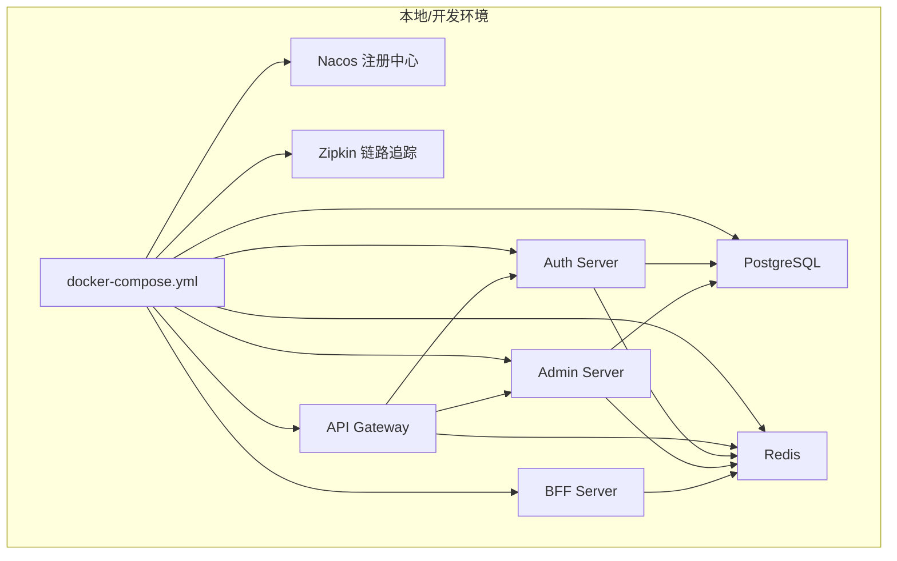
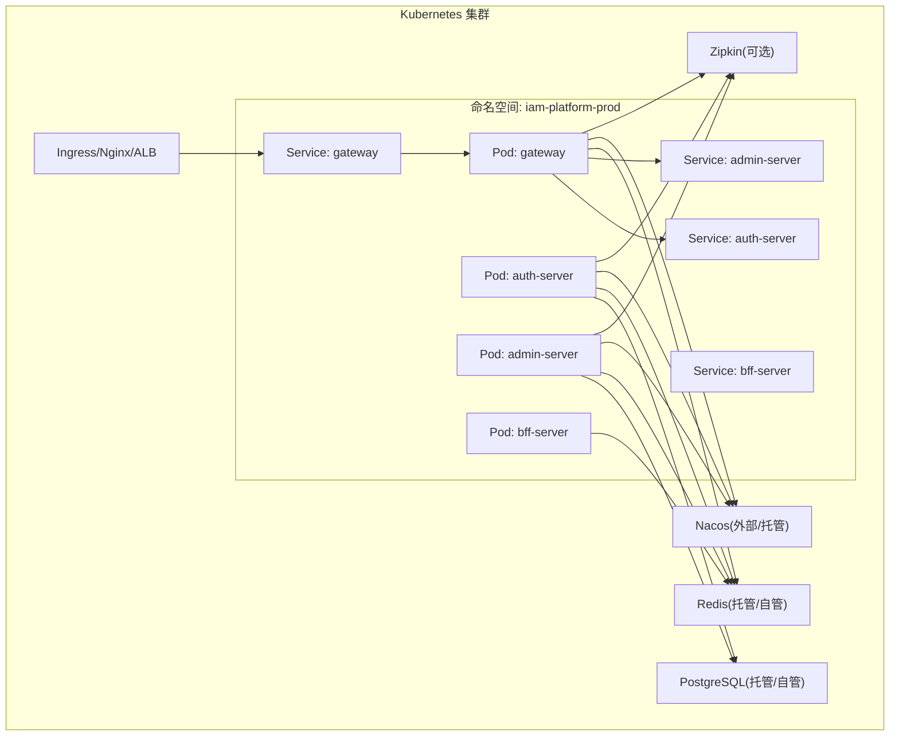
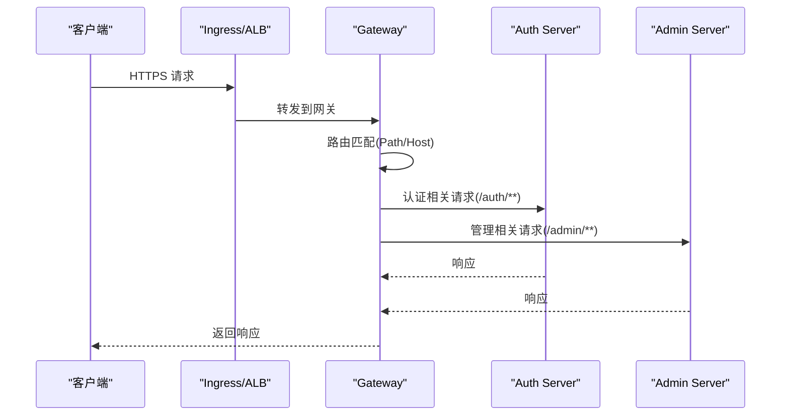
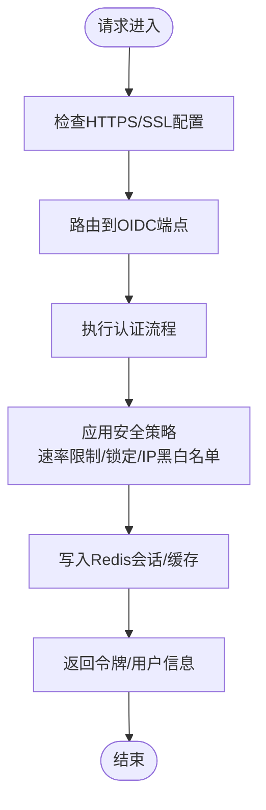
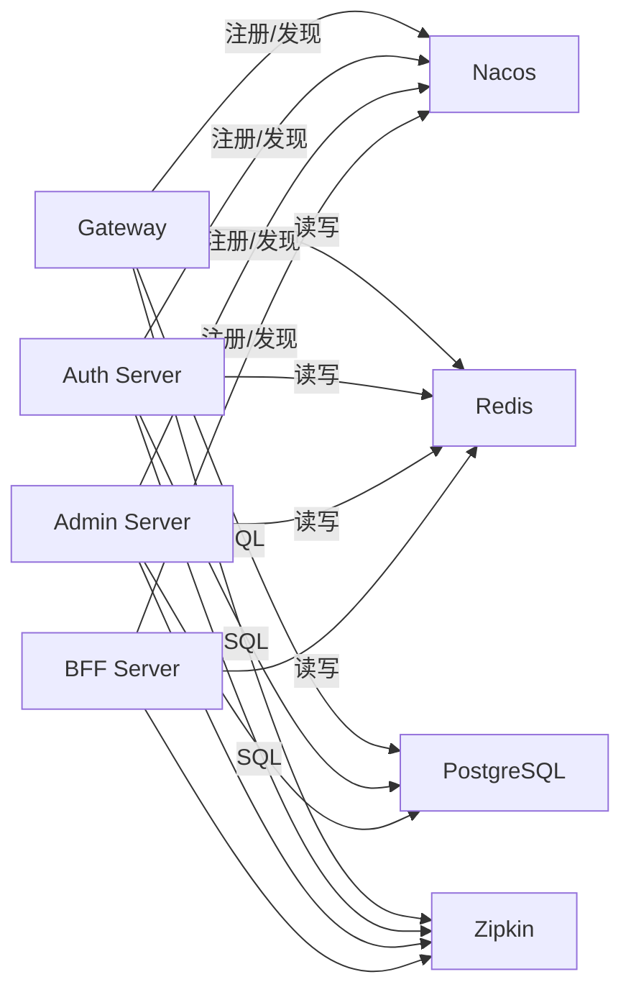

# 部署运维

<cite>
**本文引用的文件**
- [README.md](file://README.md)
- [docker-compose.yml](file://docker-compose.yml)
- [iam-admin-server/bootstrap.yml](file://iam-admin-server/bootstrap.yml)
- [iam-auth-server/bootstrap.yml](file://iam-auth-server/bootstrap.yml)
- [iam-bff-server/bootstrap.yml](file://iam-bff-server/bootstrap.yml)
- [iam-gateway/bootstrap.yml](file://iam-gateway/bootstrap.yml)
- [iam-admin-server/src/main/resources/application.yml](file://iam-admin-server/src/main/resources/application.yml)
- [iam-auth-server/src/main/resources/application.yml](file://iam-auth-server/src/main/resources/application.yml)
- [iam-bff-server/src/main/resources/application.yml](file://iam-bff-server/src/main/resources/application.yml)
- [iam-gateway/src/main/resources/application.yml](file://iam-gateway/src/main/resources/application.yml)
- [iam-admin-server/src/main/resources/application-dev.yml](file://iam-admin-server/src/main/resources/application-dev.yml)
- [iam-auth-server/src/main/resources/application-dev.yml](file://iam-auth-server/src/main/resources/application-dev.yml)
- [iam-bff-server/src/main/resources/application-dev.yml](file://iam-bff-server/src/main/resources/application-dev.yml)
- [iam-gateway/src/main/resources/application-dev.yml](file://iam-gateway/src/main/resources/application-dev.yml)
- [ssl/README.md](file://ssl/README.md)
- [script/enable-https.ps1](file://script/enable-https.ps1)
</cite>

## 目录
1. [简介](#简介)
2. [项目结构](#项目结构)
3. [核心组件](#核心组件)
4. [架构总览](#架构总览)
5. [详细组件分析](#详细组件分析)
6. [依赖关系分析](#依赖关系分析)
7. [性能考虑](#性能考虑)
8. [故障排查指南](#故障排查指南)
9. [结论](#结论)
10. [附录](#附录)

## 简介
本指南面向IAM平台在生产环境的部署与运维，覆盖Docker容器化、Kubernetes编排以及云平台部署策略；提供四套环境（DEV、TEST、CANARY、PROD）的配置差异与激活方式；介绍监控告警体系（健康检查、指标与日志）；详述SSL证书与HTTPS启用、安全加固要点；给出故障排查、备份恢复与灾备方案、CI/CD流水线与自动化回滚机制，以及运维最佳实践与工作流程。

## 项目结构
IAM平台采用多模块微服务架构，包含网关、认证服务、管理服务、BFF服务，并通过Nacos注册中心、PostgreSQL数据库、Redis缓存与Zipkin链路追踪构成基础运行环境。本地通过docker-compose快速拉起全量服务，便于开发与联调；生产环境建议以Kubernetes编排，结合云平台托管服务实现高可用与弹性伸缩。

图表来源
- [docker-compose.yml:1-190](file://docker-compose.yml#L1-L190)

章节来源
- [README.md:147-158](file://README.md#L147-L158)
- [docker-compose.yml:1-190](file://docker-compose.yml#L1-L190)

## 核心组件
- API Gateway：负责路由、鉴权、限流与跨域配置，连接认证与管理服务。
- Auth Server：OAuth2/OIDC提供方，负责用户认证、令牌签发、会话与安全策略。
- Admin Server：管理后台，提供组织、人员、权限、审计等管理能力。
- BFF Server：前端后端，聚合与适配后端服务，提供登录/注册/同意页等。
- 基础设施：Nacos注册中心、PostgreSQL数据库、Redis缓存、Zipkin链路追踪。

章节来源
- [iam-gateway/src/main/resources/application.yml:1-116](file://iam-gateway/src/main/resources/application.yml#L1-L116)
- [iam-auth-server/src/main/resources/application.yml:1-144](file://iam-auth-server/src/main/resources/application.yml#L1-L144)
- [iam-admin-server/src/main/resources/application.yml:1-102](file://iam-admin-server/src/main/resources/application.yml#L1-L102)
- [iam-bff-server/src/main/resources/application.yml:1-54](file://iam-bff-server/src/main/resources/application.yml#L1-L54)

## 架构总览
下图展示生产环境推荐的Kubernetes编排思路：每个服务独立部署，通过Ingress暴露服务，Nacos用于服务发现，PostgreSQL与Redis由云平台托管或自管集群提供，Zipkin用于分布式追踪。

图表来源
- [iam-gateway/src/main/resources/application.yml:10-116](file://iam-gateway/src/main/resources/application.yml#L10-L116)
- [iam-auth-server/src/main/resources/application.yml:10-144](file://iam-auth-server/src/main/resources/application.yml#L10-L144)
- [iam-admin-server/src/main/resources/application.yml:10-102](file://iam-admin-server/src/main/resources/application.yml#L10-L102)
- [iam-bff-server/src/main/resources/application.yml:10-54](file://iam-bff-server/src/main/resources/application.yml#L10-L54)

## 详细组件分析

### 网关（Gateway）
- 路由规则：基于路径与域名的路由，分别指向认证与管理服务；支持全局跨域配置。
- 安全：内置OAuth2客户端配置，对接OIDC提供方；资源服务器JWT校验指向认证服务。
- 性能：集成Redis限流过滤器，按服务维度配置速率参数。
- 指标与追踪：暴露健康、指标、网关等端点，支持Zipkin与采样。

图表来源
- [iam-gateway/src/main/resources/application.yml:18-54](file://iam-gateway/src/main/resources/application.yml#L18-L54)
- [iam-gateway/src/main/resources/application.yml:90-108](file://iam-gateway/src/main/resources/application.yml#L90-L108)

章节来源
- [iam-gateway/src/main/resources/application.yml:1-116](file://iam-gateway/src/main/resources/application.yml#L1-L116)
- [iam-gateway/bootstrap.yml:1-10](file://iam-gateway/bootstrap.yml#L1-L10)

### 认证服务（Auth Server）
- OIDC提供方：支持授权码+PKCE、刷新令牌、JWKS、用户信息等。
- 数据源：PostgreSQL，Flyway迁移开关按环境配置。
- 会话与缓存：Redis存储会话与分布式能力。
- 安全策略：速率限制、账户锁定、IP白黑名单、LDAP/SAML/CAS集成开关。
- 日志与监控：健康检查、指标、Zipkin采样。

图表来源
- [iam-auth-server/src/main/resources/application.yml:90-127](file://iam-auth-server/src/main/resources/application.yml#L90-L127)

章节来源
- [iam-auth-server/src/main/resources/application.yml:1-144](file://iam-auth-server/src/main/resources/application.yml#L1-L144)
- [iam-auth-server/bootstrap.yml:1-10](file://iam-auth-server/bootstrap.yml#L1-L10)

### 管理服务（Admin Server）
- 管理能力：组织、人员、角色、权限、审计等。
- 安全：内置OAuth2客户端，对接OIDC提供方；会话存储于Redis。
- 监控：健康检查、指标、Zipkin采样。

章节来源
- [iam-admin-server/src/main/resources/application.yml:1-102](file://iam-admin-server/src/main/resources/application.yml#L1-L102)
- [iam-admin-server/bootstrap.yml:1-10](file://iam-admin-server/bootstrap.yml#L1-L10)

### BFF服务（BFF Server）
- 前后端协作：模板渲染、登录/注册/同意页；通过Feign调用后端服务。
- 监控：健康检查、指标、Zipkin采样。

章节来源
- [iam-bff-server/src/main/resources/application.yml:1-54](file://iam-bff-server/src/main/resources/application.yml#L1-L54)
- [iam-bff-server/bootstrap.yml:1-10](file://iam-bff-server/bootstrap.yml#L1-L10)

## 依赖关系分析
- 服务发现：各服务通过bootstrap.yml中的Nacos地址与命名空间接入注册中心。
- 数据依赖：认证与管理服务依赖PostgreSQL；所有服务依赖Redis用于会话与限流。
- 链路追踪：各服务均配置Zipkin端点与采样率。
- 环境隔离：通过SPRING_PROFILES_ACTIVE切换环境，配合各模块application-{env}.yml覆盖差异化配置。

图表来源
- [iam-gateway/bootstrap.yml:1-10](file://iam-gateway/bootstrap.yml#L1-L10)
- [iam-auth-server/bootstrap.yml:1-10](file://iam-auth-server/bootstrap.yml#L1-L10)
- [iam-admin-server/bootstrap.yml:1-10](file://iam-admin-server/bootstrap.yml#L1-L10)
- [iam-bff-server/bootstrap.yml:1-10](file://iam-bff-server/bootstrap.yml#L1-L10)

章节来源
- [docker-compose.yml:1-190](file://docker-compose.yml#L1-L190)

## 性能考虑
- 连接池与超时：数据库连接池参数已在各服务中配置，建议根据并发与延迟目标调整最大池大小、空闲与生命周期。
- 会话与缓存：Redis作为会话存储与限流基础，建议开启持久化与主从复制，确保高可用。
- 限流策略：网关已集成Redis限流，建议按服务维度精细化配置，避免相互影响。
- 指标与采样：生产环境建议降低Zipkin采样率以降低成本，同时保留关键路径追踪。

## 故障排查指南
- 健康检查
  - 网关：/actuator/health
  - 认证服务：/actuator/health
  - 管理服务：/actuator/health
  - BFF服务：/actuator/health
- 常见问题
  - 无法连接数据库：检查DB_HOST/DB_PORT/DB_NAME/DB_USERNAME/DB_PASSWORD与网络连通性。
  - Redis连接失败：核对REDIS_HOST/REDIS_PORT/REDIS_PASSWORD与密码正确性。
  - Nacos不可达：核对NACOS_ADDR与命名空间，确认注册中心可用。
  - HTTPS异常：检查SSL_ENABLED、key-store、key-store-password与证书有效期。
- 性能问题
  - 高延迟：查看Zipkin链路耗时，定位慢查询与慢接口；评估数据库索引与连接池参数。
  - 限流触发：检查网关与服务侧限流配置，必要时扩容或调整阈值。
- 安全事件
  - 账户锁定与IP封禁：核查安全策略配置与日志，及时解封白名单IP。
  - 审计日志：确认审计系统开启与保留天数，定期归档与轮转。

章节来源
- [iam-gateway/src/main/resources/application.yml:93-108](file://iam-gateway/src/main/resources/application.yml#L93-L108)
- [iam-auth-server/src/main/resources/application.yml:128-144](file://iam-auth-server/src/main/resources/application.yml#L128-L144)
- [iam-admin-server/src/main/resources/application.yml:76-92](file://iam-admin-server/src/main/resources/application.yml#L76-L92)
- [iam-bff-server/src/main/resources/application.yml:33-48](file://iam-bff-server/src/main/resources/application.yml#L33-L48)

## 结论
通过Docker容器化与Kubernetes编排，IAM平台可在生产环境中实现高可用、可观测与可扩展的统一认证能力。结合完善的监控告警、严格的SSL与安全策略、标准化的CI/CD与回滚机制，可有效保障业务连续性与安全性。

## 附录

### 四套环境配置与激活方式
- 环境划分与标签
  - DEV：开发环境，默认激活，启用SQL打印、模板缓存关闭、Swagger可用。
  - TEST：测试环境，启用Flyway迁移、SQL打印、模板缓存关闭。
  - CANARY：灰度环境，启用生产级配置与安全策略。
  - PROD：生产环境，启用生产级配置、安全策略与最小暴露端点。
- 激活方式
  - 通过SPRING_PROFILES_ACTIVE指定环境，例如dev/test/canary/prod。
  - 各模块提供application-{env}.yml覆盖差异化配置（如SQL打印、模板缓存、Swagger开关等）。

章节来源
- [README.md:147-158](file://README.md#L147-L158)
- [iam-admin-server/src/main/resources/application-dev.yml:1-26](file://iam-admin-server/src/main/resources/application-dev.yml#L1-L26)
- [iam-auth-server/src/main/resources/application-dev.yml:1-34](file://iam-auth-server/src/main/resources/application-dev.yml#L1-L34)
- [iam-bff-server/src/main/resources/application-dev.yml:1-10](file://iam-bff-server/src/main/resources/application-dev.yml#L1-L10)
- [iam-gateway/src/main/resources/application-dev.yml:1-22](file://iam-gateway/src/main/resources/application-dev.yml#L1-L22)

### 监控告警与日志
- 健康检查：/actuator/health
- 指标端点：/actuator/metrics 或 Prometheus导出端点
- 网关指标：/actuator/gateway
- 日志：按模块设置INFO/DEBUG级别，建议生产环境统一INFO并按需临时提升。
- 链路追踪：Zipkin端点与采样率配置。

章节来源
- [iam-gateway/src/main/resources/application.yml:93-108](file://iam-gateway/src/main/resources/application.yml#L93-L108)
- [iam-auth-server/src/main/resources/application.yml:128-144](file://iam-auth-server/src/main/resources/application.yml#L128-L144)
- [iam-admin-server/src/main/resources/application.yml:76-92](file://iam-admin-server/src/main/resources/application.yml#L76-L92)
- [iam-bff-server/src/main/resources/application.yml:33-48](file://iam-bff-server/src/main/resources/application.yml#L33-L48)

### SSL证书与HTTPS启用
- 启用HTTPS：设置SSL_ENABLED=true，并提供有效的key-store与密码。
- 证书位置：通过SSL_KEY_STORE与SSL_KEY_STORE_PASSWORD配置。
- 证书生成：可使用仓库提供的脚本辅助生成与启用HTTPS。
- OIDC与JWT：确保issuer-uri与证书一致，避免客户端校验失败。

章节来源
- [iam-admin-server/src/main/resources/application.yml:3-8](file://iam-admin-server/src/main/resources/application.yml#L3-L8)
- [iam-auth-server/src/main/resources/application.yml:3-8](file://iam-auth-server/src/main/resources/application.yml#L3-L8)
- [iam-bff-server/src/main/resources/application.yml:3-8](file://iam-bff-server/src/main/resources/application.yml#L3-L8)
- [iam-gateway/src/main/resources/application.yml:3-8](file://iam-gateway/src/main/resources/application.yml#L3-L8)
- [ssl/README.md](file://ssl/README.md)
- [script/enable-https.ps1](file://script/enable-https.ps1)

### 安全加固要点
- 密码与密钥：使用强随机密钥，定期轮换；敏感配置通过环境变量注入。
- 传输安全：强制HTTPS，禁用弱密码套件；启用HSTS（建议在反向代理层）。
- 访问控制：最小暴露端点，仅开放必需端口；启用IP白名单策略。
- 速率限制与账户保护：启用速率限制与账户锁定策略，防止暴力破解。
- 审计与合规：开启审计日志并设置合理保留期，定期归档与审查。

章节来源
- [iam-auth-server/src/main/resources/application.yml:90-127](file://iam-auth-server/src/main/resources/application.yml#L90-L127)
- [iam-admin-server/src/main/resources/application.yml:93-102](file://iam-admin-server/src/main/resources/application.yml#L93-L102)

### 备份恢复与灾备
- 数据库备份：定期逻辑备份（如pg_dump）与增量备份策略，验证恢复流程。
- 缓存备份：Redis持久化（RDB/AOF）与快照策略，确保主从同步。
- 配置备份：Nacos配置与Kubernetes ConfigMap/Secret备份。
- 灾难恢复：建立跨可用区/跨区域容灾，演练恢复时间与数据一致性目标。

### CI/CD流水线与自动化回滚
- 构建与打包：Maven多模块构建，生成镜像并推送至镜像仓库。
- 部署策略：Kubernetes滚动更新，结合就绪/存活探针与水平扩展。
- 回滚机制：记录发布版本，支持一键回滚至上一个稳定版本。
- 发布门禁：代码审查、单元测试、集成测试与安全扫描通过后方可发布。

### 运维最佳实践与工作流程
- 变更管理：遵循Git Flow，变更通过分支合并与评审。
- 发布节奏：DEV→TEST→CANARY→PROD分阶段发布，灰度流量逐步扩大。
- 监控告警：建立SLO/SLI，设置阈值与通知渠道，快速响应。
- 应急预案：制定故障分级与处置流程，定期演练与复盘。