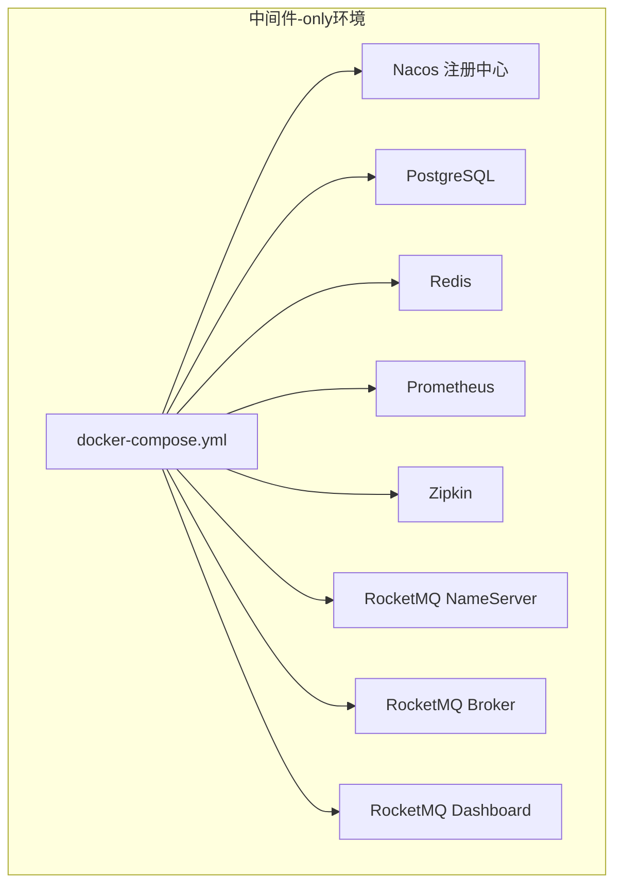
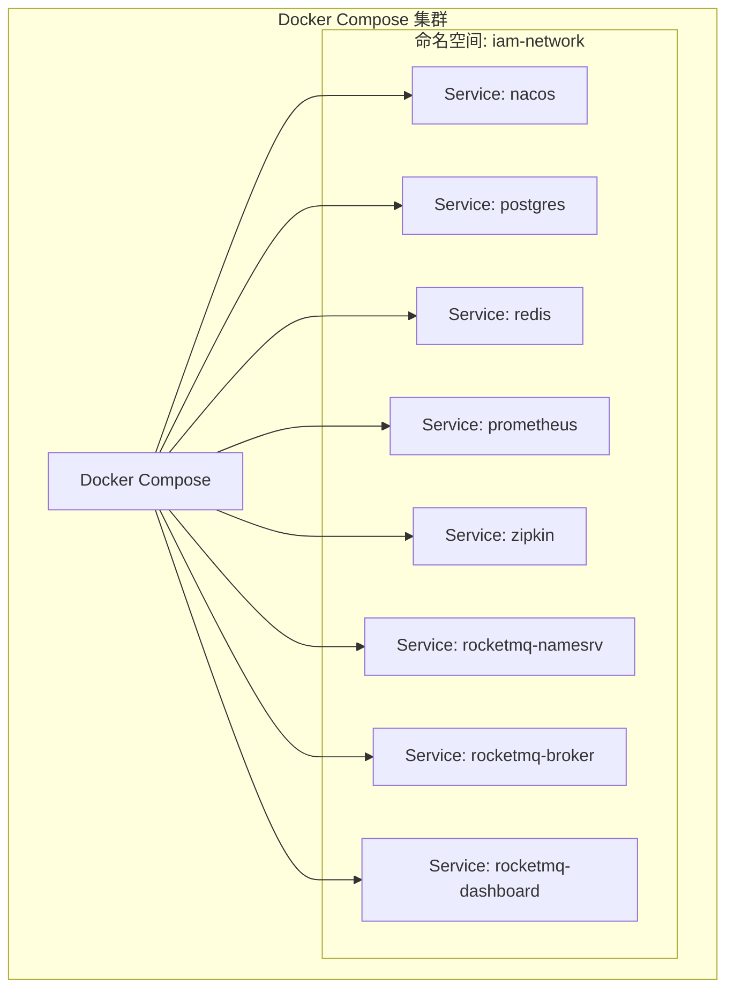
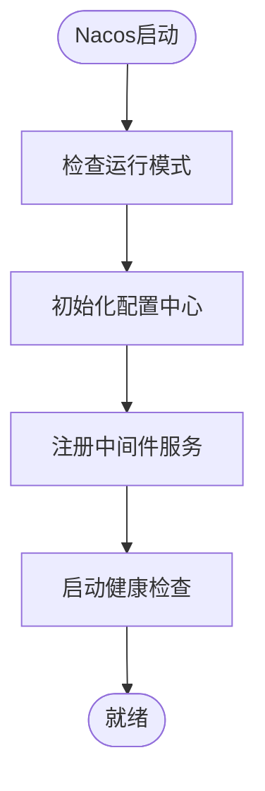
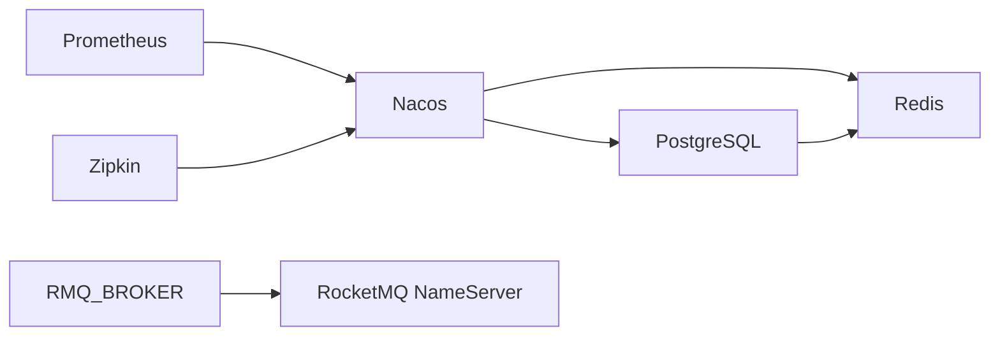

# 部署运维

<cite>
**本文引用的文件**
- [README.md](file://README.md)
- [docker-compose.yml](file://docker-compose.yml)
- [docs/MIDDLEWARE_SETUP.md](file://docs/MIDDLEWARE_SETUP.md)
- [iam-admin-server/bootstrap.yml](file://iam-admin-server/bootstrap.yml)
- [iam-auth-server/bootstrap.yml](file://iam-auth-server/bootstrap.yml)
- [iam-bff-server/bootstrap.yml](file://iam-bff-server/bootstrap.yml)
- [iam-gateway/bootstrap.yml](file://iam-gateway/bootstrap.yml)
- [iam-admin-server/src/main/resources/application.yml](file://iam-admin-server/src/main/resources/application.yml)
- [iam-auth-server/src/main/resources/application.yml](file://iam-auth-server/src/main/resources/application.yml)
- [iam-bff-server/src/main/resources/application.yml](file://iam-bff-server/src/main/resources/application.yml)
- [iam-gateway/src/main/resources/application.yml](file://iam-gateway/src/main/resources/application.yml)
- [ssl/README.md](file://ssl/README.md)
</cite>

## 更新摘要
**所做更改**
- 更新了中间件-only配置说明，反映docker-compose.yml重构后的服务架构
- 移除了对已删除应用服务的引用，专注于中间件基础设施
- 更新了部署架构图，展示当前的中间件服务组合
- 完善了四套环境配置说明，强调中间件环境的独立性
- 更新了监控告警体系，适应中间件-only部署模式

## 目录
1. [简介](#简介)
2. [项目结构](#项目结构)
3. [核心组件](#核心组件)
4. [架构总览](#架构总览)
5. [详细组件分析](#详细组件分析)
6. [依赖关系分析](#依赖关系分析)
7. [性能考虑](#性能考虑)
8. [故障排查指南](#故障排查指南)
9. [结论](#结论)
10. [附录](#附录)

## 简介
本指南面向IAM平台的中间件基础设施部署与运维，基于重构后的docker-compose.yml配置，专注于Nacos注册中心、PostgreSQL数据库、Redis缓存、Prometheus监控、Zipkin链路追踪和RocketMQ消息队列等核心中间件服务。提供四套环境（DEV、TEST、CANARY、PROD）的配置差异与激活方式；介绍监控告警体系（健康检查、指标与日志）；详述SSL证书与HTTPS启用、安全加固要点；给出故障排查、备份恢复与灾备方案、CI/CD流水线与自动化回滚机制，以及运维最佳实践与工作流程。

**更新** 反映了docker-compose.yml重构后的中间件-only配置，移除了对已删除应用服务的引用，专注于基础设施服务的部署与运维。

## 项目结构
IAM平台采用中间件-only的基础设施架构，通过docker-compose快速拉起核心中间件服务，包括Nacos注册中心、PostgreSQL数据库、Redis缓存、Prometheus监控、Zipkin链路追踪和RocketMQ消息队列。该架构为后续的应用服务部署提供了稳定的运行环境。

**图表来源**
- [docker-compose.yml:1-150](file://docker-compose.yml#L1-L150)

**章节来源**
- [README.md:147-158](file://README.md#L147-L158)
- [docker-compose.yml:1-150](file://docker-compose.yml#L1-L150)
- [docs/MIDDLEWARE_SETUP.md:1-172](file://docs/MIDDLEWARE_SETUP.md#L1-L172)

## 核心组件
- **Nacos注册中心**：提供服务注册与配置管理，支持多环境命名空间隔离
- **PostgreSQL数据库**：关系型数据存储，支持多租户和会话管理
- **Redis缓存**：分布式缓存与会话存储，支持AOF持久化
- **Prometheus监控**：指标采集与可视化，支持15秒采集间隔
- **Zipkin链路追踪**：分布式追踪系统，支持采样率配置
- **RocketMQ消息队列**：消息中间件，支持NameServer和Broker集群

**更新** 组件列表反映了重构后的中间件-only配置，移除了对应用服务的依赖，专注于基础设施服务。

**章节来源**
- [docker-compose.yml:3-150](file://docker-compose.yml#L3-L150)
- [docs/MIDDLEWARE_SETUP.md:10-57](file://docs/MIDDLEWARE_SETUP.md#L10-L57)

## 架构总览
下图展示中间件-only环境的推荐部署架构：所有服务通过docker-compose统一管理，支持独立的开发、测试、灰度和生产环境配置。

**图表来源**
- [docker-compose.yml:147-150](file://docker-compose.yml#L147-L150)

## 详细组件分析

### Nacos注册中心
- **服务发现**：支持多环境命名空间，提供服务注册与发现功能
- **配置管理**：集中式配置管理，支持动态配置更新
- **健康检查**：内置健康检查机制，确保服务可用性
- **性能优化**：JVM参数优化，支持高并发访问

**图表来源**
- [docker-compose.yml:4-28](file://docker-compose.yml#L4-L28)

**章节来源**
- [docker-compose.yml:4-28](file://docker-compose.yml#L4-L28)
- [iam-auth-server/bootstrap.yml:1-10](file://iam-auth-server/bootstrap.yml#L1-L10)

### PostgreSQL数据库
- **数据存储**：支持多租户架构，提供事务完整性保证
- **性能配置**：优化的JVM参数和数据目录配置
- **健康检查**：内置数据库健康检查机制
- **数据持久化**：支持数据卷挂载，确保数据安全

**章节来源**
- [docker-compose.yml:30-49](file://docker-compose.yml#L30-L49)

### Redis缓存
- **会话存储**：支持分布式会话管理，提供高可用性
- **持久化配置**：AOF持久化，支持数据安全
- **性能优化**：内存限制和性能参数优化
- **安全配置**：密码认证和访问控制

**章节来源**
- [docker-compose.yml:51-68](file://docker-compose.yml#L51-L68)
- [docs/MIDDLEWARE_SETUP.md:33-42](file://docs/MIDDLEWARE_SETUP.md#L33-L42)

### Prometheus监控
- **指标采集**：支持15秒采集间隔，提供实时监控
- **配置管理**：集中式配置文件管理
- **数据存储**：持久化数据存储，支持长期监控
- **访问控制**：无需认证的监控界面

**章节来源**
- [docker-compose.yml:70-82](file://docker-compose.yml#L70-L82)
- [docs/MIDDLEWARE_SETUP.md:43-49](file://docs/MIDDLEWARE_SETUP.md#L43-L49)

### Zipkin链路追踪
- **分布式追踪**：支持微服务链路追踪
- **采样配置**：可配置的采样率，平衡性能与追踪需求
- **健康检查**：内置健康检查机制
- **访问控制**：无需认证的追踪界面

**章节来源**
- [docker-compose.yml:83-97](file://docker-compose.yml#L83-L97)
- [docs/MIDDLEWARE_SETUP.md:51-56](file://docs/MIDDLEWARE_SETUP.md#L51-L56)

### RocketMQ消息队列
- **NameServer**：消息路由管理，支持高可用
- **Broker**：消息存储与转发，支持集群部署
- **Dashboard**：管理界面，支持消息队列监控
- **配置优化**：JVM参数优化，支持高并发消息处理

**章节来源**
- [docker-compose.yml:99-146](file://docker-compose.yml#L99-L146)

## 依赖关系分析
中间件-only架构中，所有服务通过docker-compose统一管理，支持独立的网络配置和依赖关系。服务间通过内部网络通信，避免了对外部环境的依赖。

**图表来源**
- [docker-compose.yml:147-150](file://docker-compose.yml#L147-L150)

**章节来源**
- [docker-compose.yml:1-150](file://docker-compose.yml#L1-L150)

## 性能考虑
- **资源分配**：所有中间件服务同时运行约占用4-6GB内存，建议根据实际需求调整JVM参数
- **网络配置**：使用bridge网络驱动，确保服务间通信效率
- **存储优化**：数据卷挂载确保数据持久化和性能
- **监控配置**：Prometheus 15秒采集间隔，平衡监控精度与性能开销

**更新** 性能考虑更加关注中间件服务的资源使用和网络通信效率。

## 故障排查指南
- **健康检查**
  - Nacos: `/nacos/v1/cs/ops/website`
  - PostgreSQL: `pg_isready`命令
  - Redis: `redis-cli ping`命令
  - Zipkin: `/health`端点
- **常见问题**
  - 端口占用：检查8848, 9848, 5432, 6379, 9090, 9410, 9411端口
  - 数据丢失：执行`docker-compose down -v`会删除所有数据，请先备份
  - 服务启动失败：查看对应服务的日志输出
- **性能问题**
  - 内存不足：调整各服务的JVM参数
  - 磁盘空间：监控数据卷使用情况
  - 网络延迟：检查Docker网络配置
- **安全事件**
  - 访问控制：核对Redis密码和Nacos认证配置
  - 数据安全：定期备份数据库和Redis数据

**更新** 故障排查指南针对中间件-only配置进行了专门说明，重点关注基础设施服务的运维问题。

**章节来源**
- [docker-compose.yml:24-28](file://docker-compose.yml#L24-L28)
- [docker-compose.yml:45-49](file://docker-compose.yml#L45-L49)
- [docker-compose.yml:64-68](file://docker-compose.yml#L64-L68)
- [docker-compose.yml:93-97](file://docker-compose.yml#L93-L97)
- [docs/MIDDLEWARE_SETUP.md:137-164](file://docs/MIDDLEWARE_SETUP.md#L137-L164)

## 结论
通过中间件-only的基础设施架构，IAM平台可以在开发环境中快速搭建完整的运行环境。该架构通过docker-compose统一管理核心中间件服务，为后续的应用服务部署提供了稳定可靠的基础设施支撑。结合完善的监控告警、严格的SSL与安全策略、标准化的CI/CD与回滚机制，可有效保障业务连续性与安全性。

**更新** 结论强调了中间件-only架构的优势和对应用服务部署的支持作用。

## 附录

### 四套环境配置与激活方式
- **环境划分与标签**
  - DEV：开发环境，默认激活，使用`iam-platform-dev`命名空间
  - TEST：测试环境，使用`iam-platform-test`命名空间
  - CANARY：灰度环境，使用`iam-platform-canary`命名空间
  - PROD：生产环境，使用`iam-platform-prod`命名空间
- **激活方式**
  - 通过`NACOS_NAMESPACE`环境变量指定命名空间
  - 各中间件服务支持独立的配置文件管理
  - 支持Docker环境变量覆盖默认配置

**更新** 环境配置说明更加关注中间件服务的命名空间管理和独立配置能力。

**章节来源**
- [README.md:147-158](file://README.md#L147-L158)
- [iam-auth-server/bootstrap.yml:5-6](file://iam-auth-server/bootstrap.yml#L5-L6)
- [iam-gateway/bootstrap.yml:5-6](file://iam-gateway/bootstrap.yml#L5-L6)
- [iam-admin-server/bootstrap.yml:5-6](file://iam-admin-server/bootstrap.yml#L5-L6)
- [iam-bff-server/bootstrap.yml:5-6](file://iam-bff-server/bootstrap.yml#L5-L6)

### 监控告警与日志
- **健康检查**：各中间件服务都提供健康检查端点
- **指标端点**：Prometheus支持15秒采集间隔
- **日志管理**：Docker日志驱动，支持日志轮转
- **链路追踪**：Zipkin支持分布式追踪，采样率为1.0
- **监控配置**：Prometheus配置文件集中管理

**更新** 监控告警体系更加完善，涵盖了中间件服务的全面监控需求。

**章节来源**
- [docker-compose.yml:24-28](file://docker-compose.yml#L24-L28)
- [docker-compose.yml:45-49](file://docker-compose.yml#L45-L49)
- [docker-compose.yml:64-68](file://docker-compose.yml#L64-L68)
- [docker-compose.yml:93-97](file://docker-compose.yml#L93-L97)
- [docs/MIDDLEWARE_SETUP.md:43-56](file://docs/MIDDLEWARE_SETUP.md#L43-L56)

### SSL证书与HTTPS启用
- **证书管理**：使用仓库提供的SSL证书文件
- **HTTPS配置**：通过环境变量启用HTTPS
- **证书位置**：相对路径配置，支持跨平台部署
- **JWK配置**：JWT签名使用RSA 2048位密钥
- **安全策略**：生产环境建议使用正式CA签发证书

**更新** SSL配置针对中间件-only环境进行了专门说明，重点关注证书管理和安全配置。

**章节来源**
- [ssl/README.md:25-53](file://ssl/README.md#L25-L53)
- [ssl/README.md:87-110](file://ssl/README.md#L87-L110)
- [ssl/README.md:149-190](file://ssl/README.md#L149-L190)

### 安全加固要点
- **访问控制**：Redis密码认证，Nacos用户名密码
- **传输安全**：HTTPS启用，证书有效期管理
- **数据安全**：数据库和Redis数据持久化
- **审计日志**：中间件服务健康检查日志
- **网络隔离**：Docker bridge网络隔离

**更新** 安全加固要点更加关注中间件服务的安全配置和防护措施。

**章节来源**
- [docker-compose.yml:18-19](file://docker-compose.yml#L18-L19)
- [docker-compose.yml:34-37](file://docker-compose.yml#L34-L37)
- [docker-compose.yml:55-59](file://docker-compose.yml#L55-L59)
- [docker-compose.yml:106-107](file://docker-compose.yml#L106-L107)
- [docs/MIDDLEWARE_SETUP.md:129-136](file://docs/MIDDLEWARE_SETUP.md#L129-L136)

### 备份恢复与灾备
- **数据库备份**：PostgreSQL逻辑备份策略
- **缓存备份**：Redis AOF持久化和快照
- **配置备份**：Nacos配置和Docker配置文件
- **灾难恢复**：跨环境数据同步和恢复流程
- **监控数据**：Prometheus数据持久化和备份

**更新** 备份恢复策略更加关注中间件服务的数据保护和恢复能力。

### CI/CD流水线与自动化回滚
- **构建策略**：Docker镜像构建和中间件服务部署
- **部署策略**：docker-compose编排和服务编排
- **回滚机制**：中间件服务版本管理和回滚策略
- **发布门禁**：中间件服务健康检查和部署验证

**更新** CI/CD流程更加关注中间件服务的部署和运维自动化。

### 运维最佳实践与工作流程
- **变更管理**：中间件服务配置变更和版本控制
- **发布节奏**：中间件服务独立发布和灰度策略
- **监控告警**：中间件服务健康监控和告警机制
- **应急预案**：中间件服务故障处理和恢复流程
- **团队协作**：中间件服务运维分工和知识共享

**更新** 运维最佳实践更加关注中间件服务的运维特点和团队协作模式。