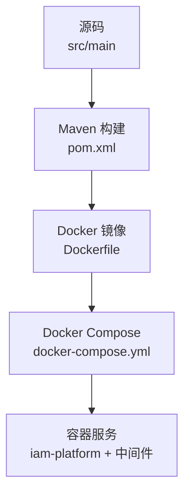
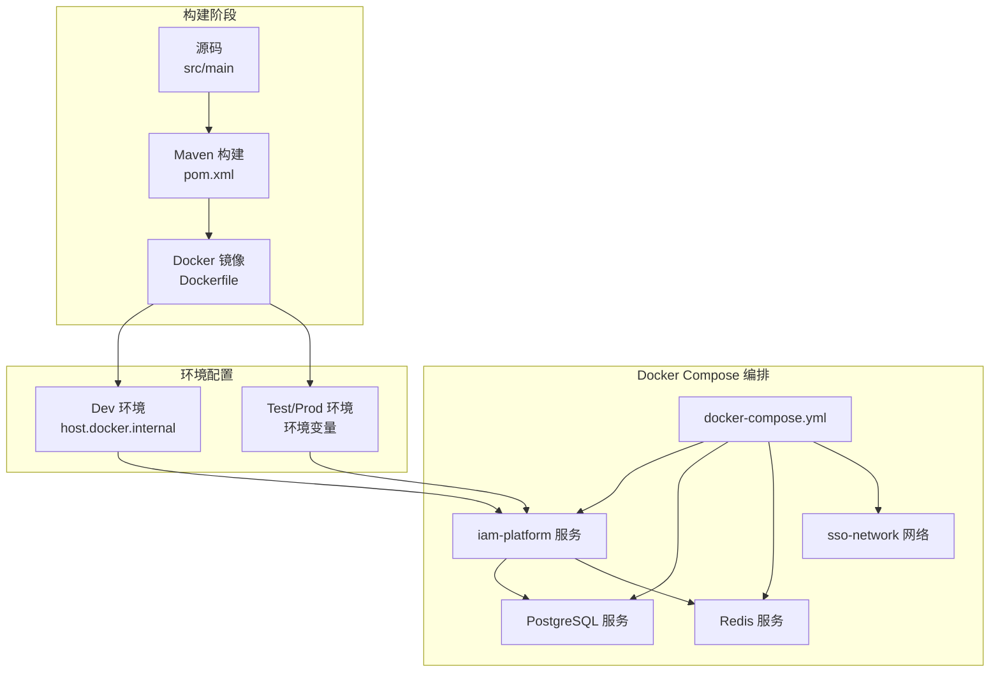
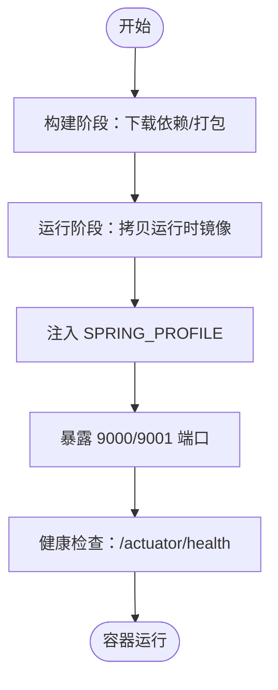
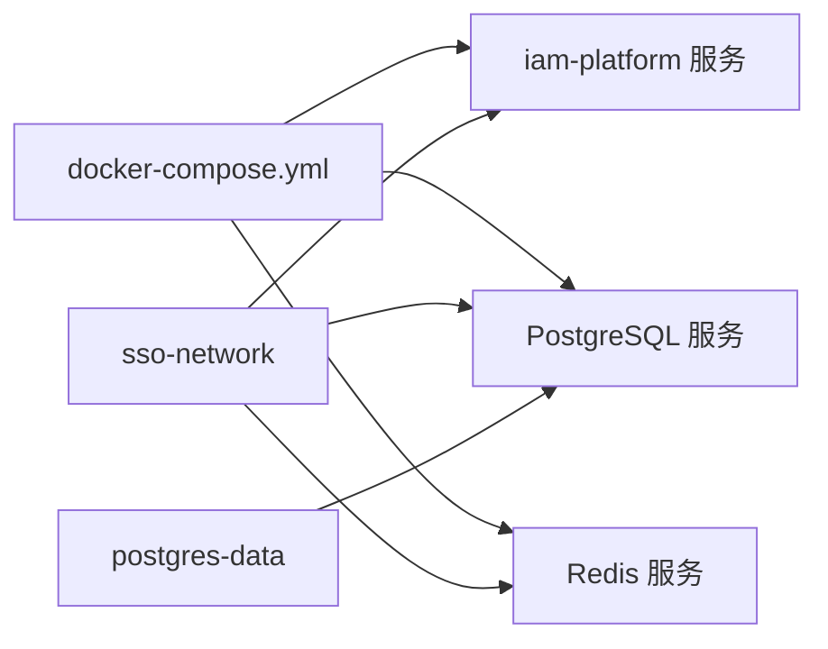
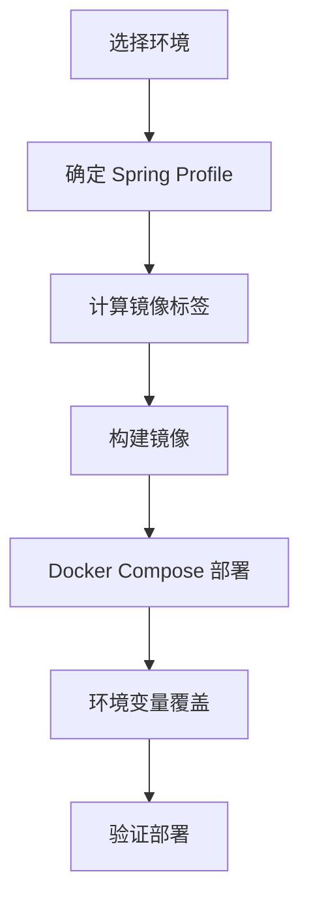
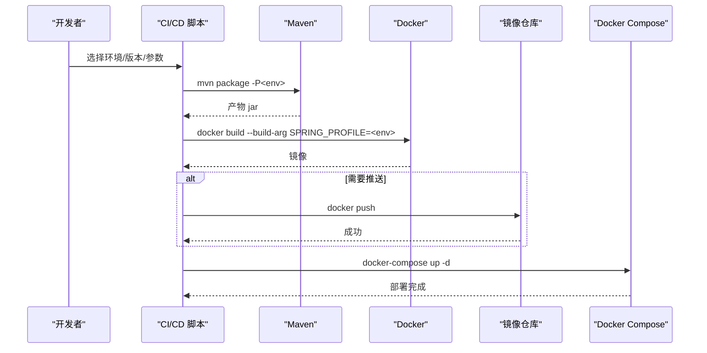
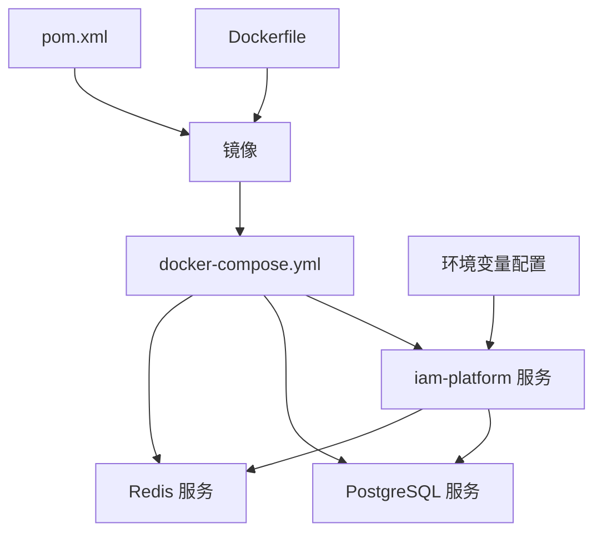

# 部署运维

<cite>
**本文引用的文件**
- [Dockerfile](file://Dockerfile)
- [docker-compose.yml](file://docker-compose.yml)
- [DEPLOYMENT.md](file://DEPLOYMENT.md)
- [README.md](file://README.md)
- [pom.xml](file://pom.xml)
- [ci-build.ps1](file://ci-build.ps1)
- [build.ps1](file://build.ps1)
- [application.yml](file://src/main/resources/application.yml)
- [application-dev.yml](file://src/main/resources/application-dev.yml)
- [application-prod.yml](file://src/main/resources/application-prod.yml)
</cite>

## 更新摘要
**变更内容**
- 从Kubernetes部署策略完全转向Docker Compose部署
- 移除所有K8s相关配置文件和文档引用
- 新增完整的Docker容器化部署文档和操作指南
- 更新部署架构图为Docker Compose模式
- 保留Spring Profile多环境配置机制

## 目录
1. [简介](#简介)
2. [项目结构](#项目结构)
3. [核心组件](#核心组件)
4. [架构总览](#架构总览)
5. [详细组件分析](#详细组件分析)
6. [依赖关系分析](#依赖关系分析)
7. [性能考虑](#性能考虑)
8. [故障排除指南](#故障排除指南)
9. [结论](#结论)
10. [附录](#附录)

## 简介
本文件面向运维与平台工程团队，系统性阐述 IAM Platform 认证服务的 Docker 容器化部署与运维方案，涵盖 Docker 多阶段构建、Docker Compose 编排部署、多环境配置管理（Dev/Test/Canary/Prod）、CI/CD 自动化流水线、监控与日志、性能优化与容量规划、以及故障排除与最佳实践。

## 项目结构
该仓库采用"源码 + Docker 配置 + 部署文档"的组织方式，核心目录与职责如下：
- src/main：Java/Spring Boot 应用源码，包含应用层、领域层、基础设施层、接口层
- Dockerfile：多阶段构建，支持 Spring Profile 参数化与健康检查
- docker-compose.yml：Docker Compose 编排配置，定义服务依赖和网络
- pom.xml：Maven 构建与多 Profile（dev/test/canary/prod）镜像标签策略
- DEPLOYMENT.md：完整的 Docker 部署与运维指南
- README.md：技术栈、快速开始、OIDC 端点、多环境配置说明
- ci-build.ps1：CI/CD 构建与部署脚本，支持版本解析、镜像构建/推送、Docker Compose 部署
- build.ps1：本地编译与告警检查脚本

**图表来源**
- [Dockerfile:1-60](file://Dockerfile#L1-L60)
- [pom.xml:196-235](file://pom.xml#L196-L235)
- [docker-compose.yml:1-43](file://docker-compose.yml#L1-L43)

**章节来源**
- [README.md:160-169](file://README.md#L160-L169)
- [DEPLOYMENT.md:123-183](file://DEPLOYMENT.md#L123-L183)

## 核心组件
- 容器镜像与运行时
  - 多阶段构建，JDK 构建、JRE 运行，减少镜像体积
  - 支持通过构建参数 SPRING_PROFILE 切换环境
  - 暴露业务端口 9000 与管理端口 9001，内置健康检查
- Docker Compose 编排
  - iam-platform 服务：应用容器，依赖 PostgreSQL 和 Redis
  - PostgreSQL 服务：数据库容器，持久化存储
  - Redis 服务：缓存容器，支持密码认证
  - 自定义网络：sso-network，服务间通信
- 多环境配置
  - Dev：默认环境，使用 host.docker.internal 连接宿主机中间件
  - Test/Canary/Prod：通过环境变量覆盖配置
  - 支持外部中间件部署在宿主机或容器中
- CI/CD 脚本
  - 自动解析版本（Git Tag 或 pom.xml），构建镜像，可选推送与部署
  - 通过 Docker Compose 进行一键部署

**章节来源**
- [Dockerfile:34-59](file://Dockerfile#L34-L59)
- [docker-compose.yml:3-43](file://docker-compose.yml#L3-L43)
- [ci-build.ps1:194-247](file://ci-build.ps1#L194-L247)

## 架构总览
下图展示从源码到容器镜像再到 Docker Compose 部署的端到端流程，以及多环境的差异化配置。

**图表来源**
- [Dockerfile:1-60](file://Dockerfile#L1-L60)
- [pom.xml:196-235](file://pom.xml#L196-L235)
- [docker-compose.yml:1-43](file://docker-compose.yml#L1-L43)

## 详细组件分析

### Docker 容器化与运行
- 多阶段构建
  - 构建阶段使用 eclipse-temurin:21-jdk-alpine，配置阿里云 Maven 镜像，利用 BuildKit 缓存 Maven 本地仓库
  - 源码复制后执行打包，跳过测试以加速构建
  - 运行阶段使用 eclipse-temurin:21-jre-alpine，仅包含运行时
- 运行参数与安全
  - 通过构建参数 SPRING_PROFILE 注入 Spring Profile
  - 非 Root 用户运行，设置 JVM 容器支持参数与随机种子
  - 暴露 9000/9001 端口，内置健康检查（Actuator health）
- 健康检查
  - 管理端口 9001 提供 /actuator/health，容器健康检查基于该端点

**图表来源**
- [Dockerfile:24-31](file://Dockerfile#L24-L31)
- [Dockerfile:34-59](file://Dockerfile#L34-L59)
- [Dockerfile:50-52](file://Dockerfile#L50-L52)

**章节来源**
- [Dockerfile:1-60](file://Dockerfile#L1-L60)
- [DEPLOYMENT.md:125-179](file://DEPLOYMENT.md#L125-L179)

### Docker Compose 编排策略
- 服务定义
  - iam-platform：应用服务，支持环境变量覆盖和健康检查
  - postgres：PostgreSQL 16，数据持久化到卷
  - redis：Redis 7，支持密码认证
- 网络与存储
  - 自定义桥接网络 sso-network，服务间通信
  - PostgreSQL 数据卷 postgres-data，持久化存储
- 环境配置
  - Dev 环境：使用 host.docker.internal 连接宿主机中间件
  - Test/Prod 环境：通过环境变量覆盖配置
  - 支持外部中间件部署在宿主机或容器中

**图表来源**
- [docker-compose.yml:3-43](file://docker-compose.yml#L3-L43)

**章节来源**
- [docker-compose.yml:1-43](file://docker-compose.yml#L1-L43)
- [DEPLOYMENT.md:181-214](file://DEPLOYMENT.md#L181-L214)

### 多环境配置管理（Spring Profile + Docker）
- Spring Profile
  - dev/test/canary/prod 四套 Profile，分别对应不同镜像标签与行为差异
  - 通过 Docker 构建参数 SPRING_PROFILE 注入，或在 Docker Compose 中覆盖
- 环境变量与密钥
  - 非敏感：DB_HOST/PORT/NAME、REDIS_HOST/PORT、OIDC_ISSUER_URI、ZIPKIN_ENDPOINT
  - 敏感：DB_USERNAME/PASSWORD、REDIS_PASSWORD、ENCRYPTION_KEY
  - 建议在 CI/CD 中注入 Secret，避免明文提交
- 环境差异（示例）
  - 连接池大小、Show SQL、Swagger UI、日志级别、Thymeleaf 缓存等

**图表来源**
- [pom.xml:196-235](file://pom.xml#L196-L235)
- [Dockerfile:37-39](file://Dockerfile#L37-L39)
- [docker-compose.yml:11-26](file://docker-compose.yml#L11-26)

**章节来源**
- [README.md:147-158](file://README.md#L147-L158)
- [DEPLOYMENT.md:218-241](file://DEPLOYMENT.md#L218-L241)

### CI/CD 流水线与自动化部署
- 版本解析
  - 优先使用 Git Tag（去除 v 前缀），否则回退到 pom.xml 的 version
- 构建步骤
  - Maven 打包（可跳过测试），Docker 构建（传入 SPRING_PROFILE），可选推送
  - 支持 Docker Compose 一键部署到目标环境
- 常用命令
  - 一键构建并部署到 Dev/Test/Prod，或仅构建镜像
  - 支持显式版本与注册表参数

**图表来源**
- [ci-build.ps1:142-173](file://ci-build.ps1#L142-L173)
- [ci-build.ps1:194-247](file://ci-build.ps1#L194-L247)

**章节来源**
- [ci-build.ps1:1-263](file://ci-build.ps1#L1-L263)
- [build.ps1:1-14](file://build.ps1#L1-L14)

### 监控与日志
- 健康检查
  - 应用健康：/actuator/health
  - 详细健康：/actuator/health/datasource,redis
  - 连接池：/actuator/hikaricp
  - 应用信息：/actuator/info
- 指标导出
  - Prometheus：/actuator/prometheus
- 日志与排障
  - Docker 日志查看、时间范围过滤、容器选择
  - 资源使用：docker stats

**章节来源**
- [DEPLOYMENT.md:257-303](file://DEPLOYMENT.md#L257-L303)

## 依赖关系分析
- 组件耦合
  - Dockerfile 依赖 Maven 构建产物；Docker Compose 依赖 Docker 镜像标签
  - iam-platform 服务依赖 PostgreSQL 和 Redis 容器
  - 环境变量配置影响服务启动和功能特性
- 外部依赖
  - PostgreSQL、Redis 作为后端存储与缓存
  - Prometheus Micrometer 采集指标
- 潜在风险
  - 镜像版本与 Docker Compose 配置不一致会导致部署失败
  - 环境变量缺失或错误会导致服务启动异常
  - 网络配置错误会导致服务间通信失败

**图表来源**
- [Dockerfile:1-60](file://Dockerfile#L1-L60)
- [pom.xml:196-235](file://pom.xml#L196-L235)
- [docker-compose.yml:1-43](file://docker-compose.yml#L1-L43)

**章节来源**
- [pom.xml:196-235](file://pom.xml#L196-L235)
- [docker-compose.yml:1-43](file://docker-compose.yml#L1-L43)

## 性能考虑
- JVM 与容器
  - 启用容器支持参数与最大堆百分比，结合 Docker 资源限制避免 OOM
- 数据库与缓存
  - 根据环境调整连接池大小（Dev 小、Prod 大）
  - Redis 作为分布式会话与缓存，建议独立实例与高可用
- 探针与扩缩容
  - 合理设置启动/存活/就绪探针阈值，避免误判
- 网络与存储
  - Docker 网络性能优于虚拟网络
  - PostgreSQL 数据卷持久化，避免数据丢失

## 故障排除指南
- 常见问题定位
  - 容器无法启动：检查健康检查端口与路径、日志输出
  - 无法连接数据库/Redis：核对环境变量配置、网络连通性
  - 部署失败：核对镜像版本与 Docker Compose 配置是否一致
- 回滚策略
  - 使用 docker-compose down 删除服务，重新部署指定版本
  - 清理数据卷：docker volume rm postgres-data

**章节来源**
- [DEPLOYMENT.md:114-122](file://DEPLOYMENT.md#L114-L122)

## 结论
本方案通过"多阶段 Docker 构建 + Docker Compose 编排 + CI/CD 自动化"的组合，实现了 IAM Platform 认证服务在多环境的一致化交付与运维。相比 Kubernetes 方案，Docker Compose 提供了更简洁的部署体验和更低的运维复杂度，特别适合中小型团队和开发测试环境。配合完善的监控与日志体系，能够有效保障服务的稳定性与可维护性。

## 附录

### A. 环境命名与端口对照
- 环境：Dev/Test/Canary/Prod
- 端口：业务 9000、管理 9001
- 默认网络：sso-network

**章节来源**
- [DEPLOYMENT.md:125-133](file://DEPLOYMENT.md#L125-L133)
- [docker-compose.yml:27-29](file://docker-compose.yml#L27-L29)

### B. 关键配置项清单
- 非敏感：DB_HOST/PORT/NAME、REDIS_HOST/PORT、OIDC_ISSUER_URI、ZIPKIN_ENDPOINT、SPRING_PROFILES_ACTIVE
- 敏感：DB_USERNAME/PASSWORD、REDIS_PASSWORD、ENCRYPTION_KEY

**章节来源**
- [docker-compose.yml:11-26](file://docker-compose.yml#L11-L26)
- [application.yml:10-31](file://application.yml#L10-L31)

### C. OIDC 端点参考
- 发现端点：/.well-known/openid-configuration
- 授权端点：/oauth2/authorize
- 令牌端点：/oauth2/token
- 用户信息：/userinfo
- JWKS：/oauth2/jwks
- 令牌撤销：/oauth2/revoke
- 令牌内省：/oauth2/introspect

**章节来源**
- [README.md:88-93](file://README.md#L88-L93)