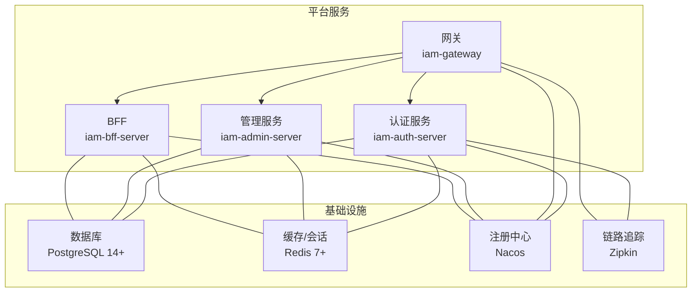
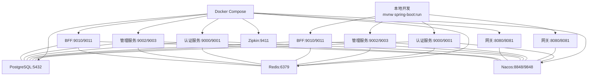
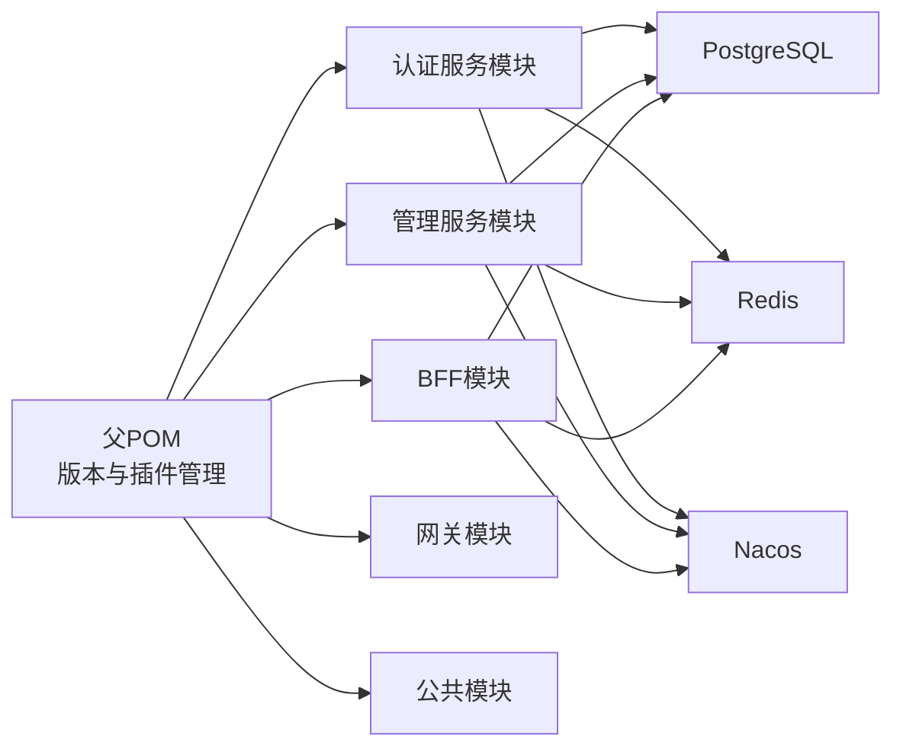

# 快速开始

<cite>
**本文引用的文件**
- [README.md](file://README.md)
- [pom.xml](file://pom.xml)
- [docker-compose.yml](file://docker-compose.yml)
- [iam-admin-server/src/main/resources/application.yml](file://iam-admin-server/src/main/resources/application.yml)
- [iam-admin-server/src/main/resources/application-dev.yml](file://iam-admin-server/src/main/resources/application-dev.yml)
- [iam-auth-server/src/main/resources/application.yml](file://iam-auth-server/src/main/resources/application.yml)
- [iam-auth-server/src/main/resources/application-dev.yml](file://iam-auth-server/src/main/resources/application-dev.yml)
- [ssl/README.md](file://ssl/README.md)
- [iam-gateway/src/main/resources/application.yml](file://iam-gateway/src/main/resources/application.yml)
</cite>

## 目录
1. [简介](#简介)
2. [项目结构](#项目结构)
3. [核心组件](#核心组件)
4. [架构总览](#架构总览)
5. [详细组件分析](#详细组件分析)
6. [依赖分析](#依赖分析)
7. [性能考虑](#性能考虑)
8. [故障排除指南](#故障排除指南)
9. [结论](#结论)
10. [附录](#附录)

## 简介
本指南面向首次接触 IAM 平台项目的开发者，帮助你在本地快速完成环境准备、安装与配置，并提供 Docker 一键部署方案、启动流程、验证方法以及常见问题排查。平台基于 OpenID Connect 1.0 协议，提供统一身份认证与授权能力，采用多模块 Maven 工程组织，包含认证服务、管理服务、网关与 BFF 等子系统。

## 项目结构
项目采用多模块聚合工程，父 POM 统一管理版本与插件；各子模块职责清晰：
- iam-common：公共 API、DTO、异常与通用模型
- iam-auth-server：OAuth2/OIDC 认证服务器（授权码、客户端凭证、PKCE、Discovery、JWKS、UserInfo、Token Revocation）
- iam-admin-server：管理后台应用，提供组织、人员、角色、权限等管理 API
- iam-gateway：API 网关，负责路由与鉴权前置
- iam-bff-server：面向前端的后端服务，整合登录、注册、租户选择等交互

图表来源
- [docker-compose.yml:1-190](file://docker-compose.yml#L1-L190)
- [iam-auth-server/src/main/resources/application.yml:1-144](file://iam-auth-server/src/main/resources/application.yml#L1-L144)
- [iam-admin-server/src/main/resources/application.yml:1-102](file://iam-admin-server/src/main/resources/application.yml#L1-L102)
- [iam-gateway/src/main/resources/application.yml](file://iam-gateway/src/main/resources/application.yml)

章节来源
- [pom.xml:21-27](file://pom.xml#L21-L27)
- [README.md:95-108](file://README.md#L95-L108)

## 核心组件
- 认证服务（iam-auth-server）
  - 提供 OIDC 发现、JWKS、UserInfo、Token Revocation、CAS 支持
  - 内置登录页模板与验证码登录配置
  - 使用 PostgreSQL 存储、Redis 缓存与分布式会话
- 管理服务（iam-admin-server）
  - 提供组织、人员、角色、权限、审计日志等管理 API
  - 支持审计日志异步写入与保留策略
- 网关（iam-gateway）
  - 统一入口，结合 JWT 转换与安全配置
- BFF（iam-bff-server）
  - 面向前端的后端聚合，提供登录、注册、同意页、租户选择等
- 基础设施
  - PostgreSQL 14+、Redis 7+、Nacos 注册中心、Zipkin 链路追踪

章节来源
- [iam-auth-server/src/main/resources/application.yml:1-144](file://iam-auth-server/src/main/resources/application.yml#L1-L144)
- [iam-admin-server/src/main/resources/application.yml:1-102](file://iam-admin-server/src/main/resources/application.yml#L1-L102)
- [docker-compose.yml:1-190](file://docker-compose.yml#L1-L190)

## 架构总览
下图展示本地开发与 Docker 一键部署两种场景下的组件关系与端口映射：

图表来源
- [docker-compose.yml:1-190](file://docker-compose.yml#L1-L190)
- [iam-auth-server/src/main/resources/application.yml:1-144](file://iam-auth-server/src/main/resources/application.yml#L1-L144)
- [iam-admin-server/src/main/resources/application.yml:1-102](file://iam-admin-server/src/main/resources/application.yml#L1-L102)
- [iam-gateway/src/main/resources/application.yml](file://iam-gateway/src/main/resources/application.yml)

## 详细组件分析

### 环境准备与安装
- JDK 21+
  - 使用 Maven 插件与编译配置指定 Java 21
- PostgreSQL 14+
  - 认证与管理服务均通过 JDBC 连接，默认使用 localhost:5432
- Redis 7+
  - 用于缓存、分布式会话与限流
- Maven 3.8+
  - 父 POM 管理依赖与插件版本

章节来源
- [pom.xml:29-41](file://pom.xml#L29-L41)
- [iam-auth-server/src/main/resources/application.yml:16-18](file://iam-auth-server/src/main/resources/application.yml#L16-L18)
- [iam-admin-server/src/main/resources/application.yml:15-18](file://iam-admin-server/src/main/resources/application.yml#L15-L18)

### 本地开发环境搭建
- 步骤概览
  1) 安装 JDK 21+、PostgreSQL 14+、Redis 7+、Maven 3.8+
  2) 启动数据库与缓存（或使用 Docker Compose）
  3) 在项目根目录执行编译与启动命令
  4) 访问服务端点进行验证
- 命令行操作
  - 编译：在项目根目录执行编译命令
  - 启动：在项目根目录执行启动命令
- 配置说明
  - 认证服务与管理服务的数据库连接、Redis 连接、JPA/Hibernate、Flyway、OpenAPI 文档、Actuator 等配置均在各自 application.yml 中定义
  - 开发环境配置（application-dev.yml）开启 SQL 输出、模板缓存关闭、日志级别提升、Swagger UI 开启等

章节来源
- [README.md:67-82](file://README.md#L67-L82)
- [iam-auth-server/src/main/resources/application.yml:1-144](file://iam-auth-server/src/main/resources/application.yml#L1-L144)
- [iam-auth-server/src/main/resources/application-dev.yml:1-34](file://iam-auth-server/src/main/resources/application-dev.yml#L1-L34)
- [iam-admin-server/src/main/resources/application.yml:1-102](file://iam-admin-server/src/main/resources/application.yml#L1-L102)
- [iam-admin-server/src/main/resources/application-dev.yml:1-26](file://iam-admin-server/src/main/resources/application-dev.yml#L1-L26)

### Docker 部署方式与优势
- 一键部署
  - 使用 Docker Compose 启动 Nacos、PostgreSQL、Redis、Zipkin 以及四个服务容器
  - 服务间通过内部网络通信，端口映射便于本地访问
- 优势
  - 环境一致性、减少本地配置差异
  - 快速拉起基础设施与业务服务
  - 易于扩展与集成注册中心、链路追踪等中间件

章节来源
- [docker-compose.yml:1-190](file://docker-compose.yml#L1-L190)
- [README.md:160-169](file://README.md#L160-L169)

### 启动流程（编译、运行、验证）
- 编译
  - 在项目根目录执行编译命令
- 运行
  - 本地运行：在项目根目录执行启动命令
  - Docker 运行：在项目根目录执行 Docker Compose 命令
- 验证
  - 访问认证服务 OIDC 发现端点
  - 访问 Swagger UI 文档
  - 访问登录页面
  - 访问 Actuator 健康检查端点

章节来源
- [README.md:74-94](file://README.md#L74-L94)
- [iam-auth-server/src/main/resources/application.yml:70-75](file://iam-auth-server/src/main/resources/application.yml#L70-L75)
- [iam-admin-server/src/main/resources/application.yml:70-75](file://iam-admin-server/src/main/resources/application.yml#L70-L75)

### 基本使用示例与测试方法
- OIDC 发现与 JWKS
  - 访问 OIDC 元数据与 JWKS 端点，确认服务正常
- 登录与会话
  - 通过登录页面发起授权码流程，验证回调与会话存储
- 管理 API
  - 使用 Swagger UI 调用管理服务 API，验证权限与审计日志
- 性能与可观测性
  - 通过 Actuator 指标与 Zipkin 链路追踪验证系统运行状态

章节来源
- [README.md:84-94](file://README.md#L84-L94)
- [iam-auth-server/src/main/resources/application.yml:128-144](file://iam-auth-server/src/main/resources/application.yml#L128-L144)
- [iam-admin-server/src/main/resources/application.yml:76-92](file://iam-admin-server/src/main/resources/application.yml#L76-L92)

## 依赖分析
- 技术栈与版本
  - Java 21、Spring Boot 3.2.5、Spring Authorization Server 1.2.5、PostgreSQL 14+、Redis 7+、Flyway、Maven 3.8+、Lombok、MapStruct、Thymeleaf、Springdoc、Testcontainers
- 多环境配置
  - 通过 Maven Profile 与 Spring Profile 切换 dev/test/canary/prod 环境，镜像标签随环境变化
- 服务间依赖
  - 认证服务、管理服务、BFF 通过 Nacos 注册发现，共享数据库与 Redis

图表来源
- [pom.xml:21-27](file://pom.xml#L21-L27)
- [docker-compose.yml:1-190](file://docker-compose.yml#L1-L190)

章节来源
- [README.md:16-32](file://README.md#L16-L32)
- [pom.xml:177-216](file://pom.xml#L177-L216)

## 性能考虑
- 连接池与缓存
  - HikariCP 连接池参数、Redis 连接与命名空间配置影响吞吐与延迟
- 会话与限流
  - Redis 会话存储与速率限制策略降低重复登录与暴力破解风险
- 监控与采样
  - Actuator 指标、Zipkin 链路追踪采样概率建议按环境调整

章节来源
- [iam-auth-server/src/main/resources/application.yml:19-24](file://iam-auth-server/src/main/resources/application.yml#L19-L24)
- [iam-admin-server/src/main/resources/application.yml:20-24](file://iam-admin-server/src/main/resources/application.yml#L20-L24)
- [iam-auth-server/src/main/resources/application.yml:93-102](file://iam-auth-server/src/main/resources/application.yml#L93-L102)
- [iam-auth-server/src/main/resources/application.yml:138-143](file://iam-auth-server/src/main/resources/application.yml#L138-L143)

## 故障排除指南
- 证书与 HTTPS
  - 使用提供的脚本或环境变量启用 HTTPS；若证书缺失或路径错误，按文档指引生成或修正
- SSL 握手失败
  - 检查密钥库密码与证书有效性
- 路径解析失败
  - 确认当前工作目录与相对路径解析
- JWT 签名失败
  - 检查私钥文件与 JWK 配置
- 证书过期
  - 查看证书有效期并按需轮换
- 数据库连接
  - 确认数据库主机、端口、用户名、密码与数据库名
- Redis 连接
  - 确认主机、端口与密码
- 网关与注册中心
  - 确认 Nacos 地址与命名空间配置

章节来源
- [ssl/README.md:306-361](file://ssl/README.md#L306-L361)
- [iam-auth-server/src/main/resources/application.yml:16-18](file://iam-auth-server/src/main/resources/application.yml#L16-L18)
- [iam-admin-server/src/main/resources/application.yml:15-18](file://iam-admin-server/src/main/resources/application.yml#L15-L18)
- [docker-compose.yml:44-56](file://docker-compose.yml#L44-L56)

## 结论
通过本快速开始指南，你可以在本地完成环境准备与安装，选择本地或 Docker 方式启动服务，并使用标准端点进行验证。建议在本地验证完成后，进一步探索 API 文档、功能扩展与性能优化路径，逐步完善开发与运维实践。

## 附录
- 常用端点
  - Swagger UI（开发/测试环境）
  - OIDC 元数据
  - 登录页面
  - Actuator 健康检查
- 多环境配置
  - 通过 Maven Profile 与 Spring Profile 切换不同环境
- Docker 一键部署
  - 使用 Compose 启动全部服务与基础设施

章节来源
- [README.md:84-94](file://README.md#L84-L94)
- [pom.xml:177-216](file://pom.xml#L177-L216)
- [docker-compose.yml:1-190](file://docker-compose.yml#L1-L190)