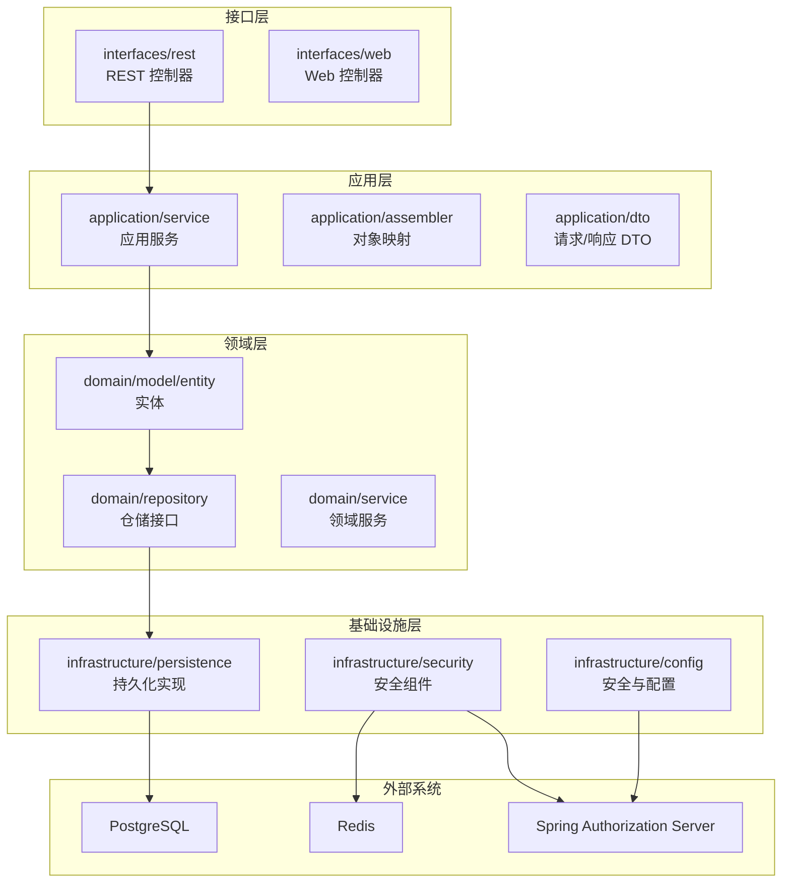
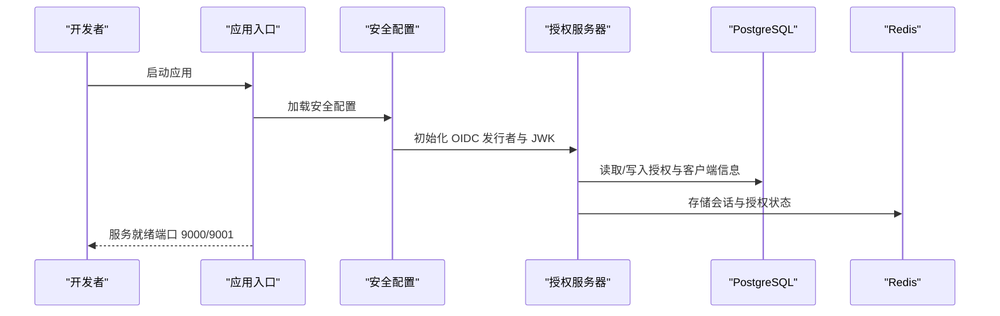
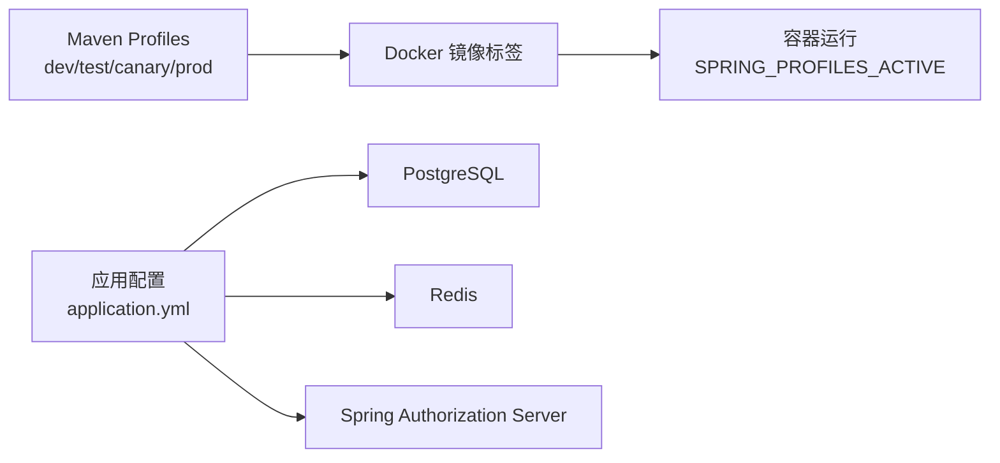

# 快速开始指南

<cite>
**本文引用的文件**
- [README.md](file://README.md)
- [pom.xml](file://pom.xml)
- [application.yml](file://src/main/resources/application.yml)
- [application-dev.yml](file://src/main/resources/application-dev.yml)
- [application-prod.yml](file://src/main/resources/application-prod.yml)
- [Dockerfile](file://Dockerfile)
- [DEPLOYMENT.md](file://DEPLOYMENT.md)
- [SsoOidcApplication.java](file://src/main/java/sso/oidc/SsoOidcApplication.java)
- [AuthorizationServerConfig.java](file://src/main/java/sso/oidc/infrastructure/config/AuthorizationServerConfig.java)
- [UserController.java](file://src/main/java/sso/oidc/interfaces/rest/UserController.java)
- [V1__init_schema.sql](file://src/main/resources/db/migration/V1__init_schema.sql)
- [V2__seed_default_roles.sql](file://src/main/resources/db/migration/V2__seed_default_roles.sql)
- [mock_data.sql](file://src/main/resources/db/dev/mock_data.sql)
</cite>

## 目录
1. [简介](#简介)
2. [项目结构](#项目结构)
3. [核心组件](#核心组件)
4. [架构总览](#架构总览)
5. [详细组件分析](#详细组件分析)
6. [依赖关系分析](#依赖关系分析)
7. [性能考虑](#性能考虑)
8. [故障排查指南](#故障排查指南)
9. [结论](#结论)
10. [附录](#附录)

## 简介
本指南面向新开发者，帮助你在最短时间内完成 IAM Platform 认证服务项目的本地环境搭建与运行，涵盖环境要求、依赖准备、数据库与缓存配置、多种运行方式（Maven 直接运行、指定环境运行、Docker 部署）、API 文档与 OIDC 发现端点的使用方法，并提供常见启动问题排查与简单 Hello World 示例。

## 项目结构
项目采用分层架构（应用层、领域层、基础设施层、接口层），并使用 Spring Boot 3.2.5 + Spring Authorization Server 1.2.5 提供 OIDC 能力；数据库为 PostgreSQL，缓存为 Redis；通过 Flyway 管理数据库迁移；使用 Springdoc/OpenAPI 提供 API 文档；支持多环境配置与容器化部署。

图表来源
- [SsoOidcApplication.java:1-13](file://src/main/java/sso/oidc/SsoOidcApplication.java#L1-L13)
- [AuthorizationServerConfig.java:1-144](file://src/main/java/sso/oidc/infrastructure/config/AuthorizationServerConfig.java#L1-L144)
- [UserController.java:1-90](file://src/main/java/sso/oidc/interfaces/rest/UserController.java#L1-L90)

章节来源
- [README.md:104-139](file://README.md#L104-L139)

## 核心组件
- 应用入口与运行
  - 应用入口类负责启动 Spring Boot 应用。
  - 章节来源
    - [SsoOidcApplication.java:1-13](file://src/main/java/sso/oidc/SsoOidcApplication.java#L1-L13)

- OIDC 授权服务器配置
  - 配置 OIDC 发行者 URI、JWK 密钥、客户端注册、过滤链与资源服务器 JWT 解码器。
  - 章节来源
    - [AuthorizationServerConfig.java:1-144](file://src/main/java/sso/oidc/infrastructure/config/AuthorizationServerConfig.java#L1-L144)

- REST API 控制器
  - 提供用户管理相关接口（创建、查询、更新、删除、分配角色、修改密码等）。
  - 章节来源
    - [UserController.java:1-90](file://src/main/java/sso/oidc/interfaces/rest/UserController.java#L1-L90)

- 多环境配置
  - 默认通过 application.yml 激活 dev 环境；可通过 Spring Profile 切换 test/canary/prod。
  - 章节来源
    - [application.yml:1-78](file://src/main/resources/application.yml#L1-L78)
    - [application-dev.yml:1-22](file://src/main/resources/application-dev.yml#L1-L22)
    - [application-prod.yml:1-25](file://src/main/resources/application-prod.yml#L1-L25)

- 数据库与迁移
  - 使用 Flyway 管理迁移脚本，初始化 schema 并在 DEV 环境插入模拟数据。
  - 章节来源
    - [V1__init_schema.sql:1-180](file://src/main/resources/db/migration/V1__init_schema.sql#L1-L180)
    - [V2__seed_default_roles.sql:1-9](file://src/main/resources/db/migration/V2__seed_default_roles.sql#L1-L9)
    - [mock_data.sql:1-38](file://src/main/resources/db/dev/mock_data.sql#L1-L38)

## 架构总览
下图展示了应用启动与 OIDC 授权服务器的关键交互，以及数据库与缓存的依赖关系。

图表来源
- [SsoOidcApplication.java:1-13](file://src/main/java/sso/oidc/SsoOidcApplication.java#L1-L13)
- [AuthorizationServerConfig.java:1-144](file://src/main/java/sso/oidc/infrastructure/config/AuthorizationServerConfig.java#L1-L144)
- [application.yml:1-78](file://src/main/resources/application.yml#L1-L78)

## 详细组件分析

### 环境要求与前置条件
- JDK 21+
- PostgreSQL 14+
- Redis 7+
- Docker（可选，用于容器化部署）

章节来源
- [README.md:50-56](file://README.md#L50-L56)

### 本地开发环境搭建步骤
- 克隆仓库与编译
  - 使用 Maven Wrapper 编译项目。
  - 章节来源
    - [README.md:59-68](file://README.md#L59-L73)

- 数据库与缓存准备
  - 启动 PostgreSQL 与 Redis（可使用 Docker Compose）。
  - 章节来源
    - [DEPLOYMENT.md:54-94](file://DEPLOYMENT.md#L54-L94)

- 配置文件与环境变量
  - 默认使用 dev 环境；可通过环境变量覆盖数据库与 Redis 连接信息。
  - 章节来源
    - [application.yml:1-78](file://src/main/resources/application.yml#L1-L78)

- 运行方式一：Maven 直接运行
  - 在项目根目录执行 Maven Spring Boot 插件运行命令。
  - 章节来源
    - [README.md:67-68](file://README.md#L67-L68)

- 运行方式二：指定环境运行
  - 通过 Maven Profile 切换 test/prod 环境。
  - 章节来源
    - [README.md:70-72](file://README.md#L70-L72)

- 运行方式三：Docker 部署
  - 构建镜像并运行容器，或使用 Docker Compose 启动完整环境。
  - 章节来源
    - [Dockerfile:1-60](file://Dockerfile#L1-L60)
    - [DEPLOYMENT.md:33-52](file://DEPLOYMENT.md#L33-L52)
    - [DEPLOYMENT.md:54-94](file://DEPLOYMENT.md#L54-L94)

### API 文档与 OIDC 发现端点
- API 文档
  - DEV 与 TEST 环境启用 Swagger UI；CANARY 与 PROD 环境关闭。
  - 访问地址：http://localhost:9000/swagger-ui.html
  - 章节来源
    - [README.md:90-96](file://README.md#L90-L96)
    - [application-dev.yml:19-22](file://src/main/resources/application-dev.yml#L19-L22)
    - [application-prod.yml:17-20](file://src/main/resources/application-prod.yml#L17-L20)

- OIDC 发现端点
  - 访问地址：http://localhost:9000/.well-known/openid-configuration
  - 章节来源
    - [README.md:98-102](file://README.md#L98-L102)

### Hello World 示例：基础认证授权测试
- 步骤概述
  - 使用浏览器访问登录页面（Thymeleaf 渲染），或通过 OIDC 授权码流程发起认证。
  - 使用 Swagger UI 调用用户管理接口进行基本 CRUD 测试。
  - 验证 OIDC 发现端点返回元数据。
- 具体参考
  - 登录页面控制器与模板位于 interfaces/web 目录。
  - 用户管理接口位于 interfaces/rest，路径前缀为 /v1/users。
  - OIDC 发现端点路径为 /.well-known/openid-configuration。
  - 章节来源
    - [README.md:360-388](file://README.md#L360-L388)
    - [UserController.java:27-90](file://src/main/java/sso/oidc/interfaces/rest/UserController.java#L27-L90)

## 依赖关系分析
- 技术栈与版本
  - JDK 21、Spring Boot 3.2.5、Spring Authorization Server 1.2.5、PostgreSQL、Redis、Flyway、Springdoc、Testcontainers 等。
  - 章节来源
    - [README.md:5-22](file://README.md#L5-L22)
    - [pom.xml:1-225](file://pom.xml#L1-L225)

- 多环境配置与标签
  - 通过 Maven Profiles 与 Docker 构建参数区分 dev/test/canary/prod 环境。
  - 章节来源
    - [pom.xml:184-223](file://pom.xml#L184-L223)
    - [Dockerfile:37-39](file://Dockerfile#L37-L39)

图表来源
- [pom.xml:184-223](file://pom.xml#L184-L223)
- [Dockerfile:37-39](file://Dockerfile#L37-L39)
- [application.yml:1-78](file://src/main/resources/application.yml#L1-L78)

## 性能考虑
- 连接池与缓存
  - HikariCP 连接池大小与 Redis 缓存命中率直接影响性能；生产环境建议根据并发与延迟目标调优。
- 日志与可观测性
  - 开启 Actuator、Prometheus 指标与 Zipkin 链路追踪，便于定位性能瓶颈。
- 章节来源
  - [application.yml:13-18](file://src/main/resources/application.yml#L13-L18)
  - [application-prod.yml:8-10](file://src/main/resources/application-prod.yml#L8-L10)
  - [DEPLOYMENT.md:242-289](file://DEPLOYMENT.md#L242-L289)

## 故障排查指南
- 无法连接数据库
  - 检查数据库主机、端口、凭据与网络连通性；确认 Flyway 迁移已执行。
  - 章节来源
    - [application.yml:9-18](file://src/main/resources/application.yml#L9-L18)
    - [V1__init_schema.sql:1-180](file://src/main/resources/db/migration/V1__init_schema.sql#L1-L180)

- Redis 连接失败
  - 检查 Redis 主机、端口与密码；确认会话存储与分布式会话配置正确。
  - 章节来源
    - [application.yml:27-31](file://src/main/resources/application.yml#L27-L31)

- OIDC 发现端点返回 404
  - 确认应用已启动至 9000 端口；检查授权服务器配置与发行者 URI。
  - 章节来源
    - [AuthorizationServerConfig.java:120-124](file://src/main/java/sso/oidc/infrastructure/config/AuthorizationServerConfig.java#L120-L124)
    - [application.yml:55-55](file://src/main/resources/application.yml#L55-L55)

- Swagger UI 不显示
  - 确认当前环境允许启用 Swagger UI（dev/test 开启，canary/prod 关闭）。
  - 章节来源
    - [application-dev.yml:19-22](file://src/main/resources/application-dev.yml#L19-L22)
    - [application-prod.yml:17-20](file://src/main/resources/application-prod.yml#L17-L20)

- Docker 容器启动后健康检查失败
  - 使用健康检查端点验证服务状态，检查数据库与 Redis 是否可用。
  - 章节来源
    - [Dockerfile:50-52](file://Dockerfile#L50-L52)
    - [DEPLOYMENT.md:244-258](file://DEPLOYMENT.md#L244-L258)

## 结论
通过本指南，你可以快速完成环境准备、应用启动与基本功能验证。建议在本地使用 Docker Compose 启动完整环境，结合 Swagger UI 与 OIDC 发现端点进行端到端测试，并在生产环境遵循安全与可观测性最佳实践。

## 附录

### 端点一览
- OIDC 发现端点
  - 路径：/.well-known/openid-configuration
  - 章节来源
    - [README.md:360-370](file://README.md#L360-L370)

- 用户管理 API（示例）
  - 路径：/v1/users
  - 章节来源
    - [UserController.java:27-90](file://src/main/java/sso/oidc/interfaces/rest/UserController.java#L27-L90)

### 数据库迁移与种子数据
- 迁移脚本
  - V1：初始化 schema
  - V2：初始化默认角色
  - 章节来源
    - [V1__init_schema.sql:1-180](file://src/main/resources/db/migration/V1__init_schema.sql#L1-L180)
    - [V2__seed_default_roles.sql:1-9](file://src/main/resources/db/migration/V2__seed_default_roles.sql#L1-L9)

- 开发环境模拟数据
  - 章节来源
    - [mock_data.sql:1-38](file://src/main/resources/db/dev/mock_data.sql#L1-L38)