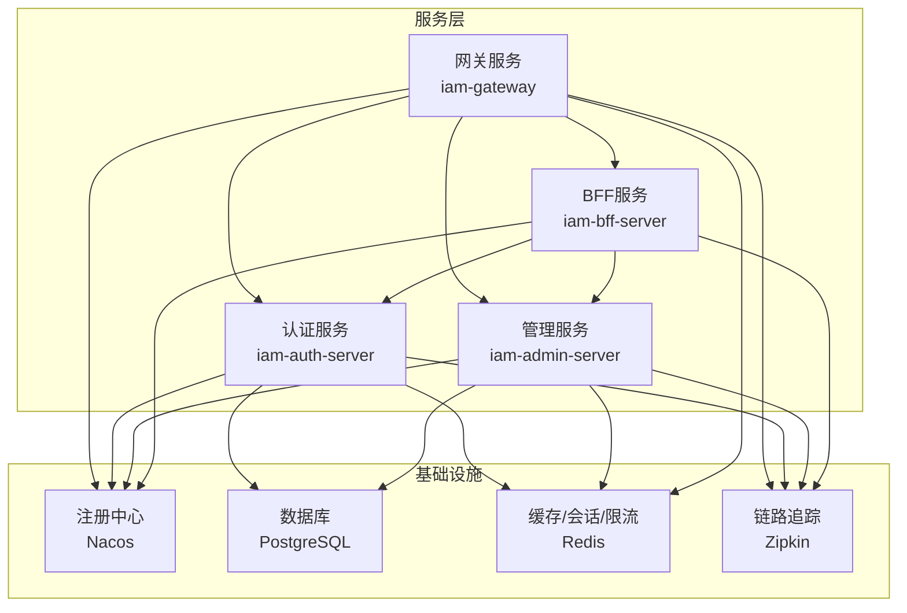
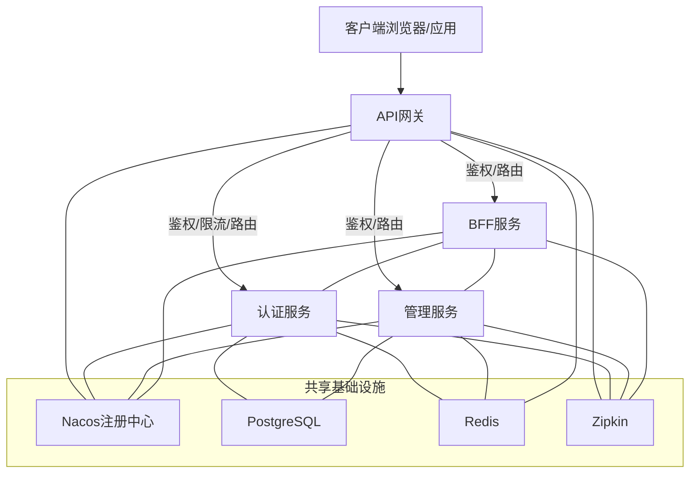
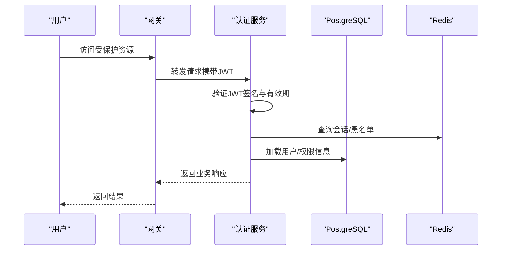
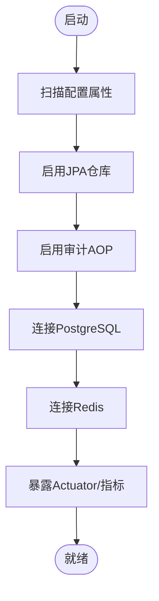
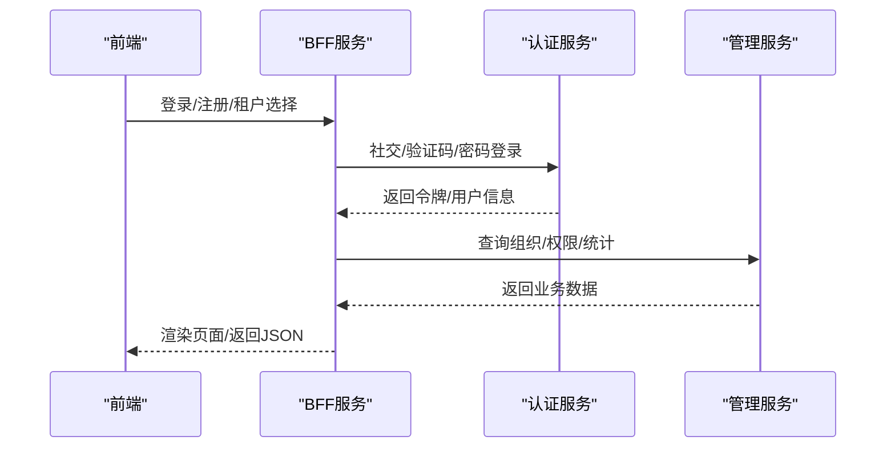
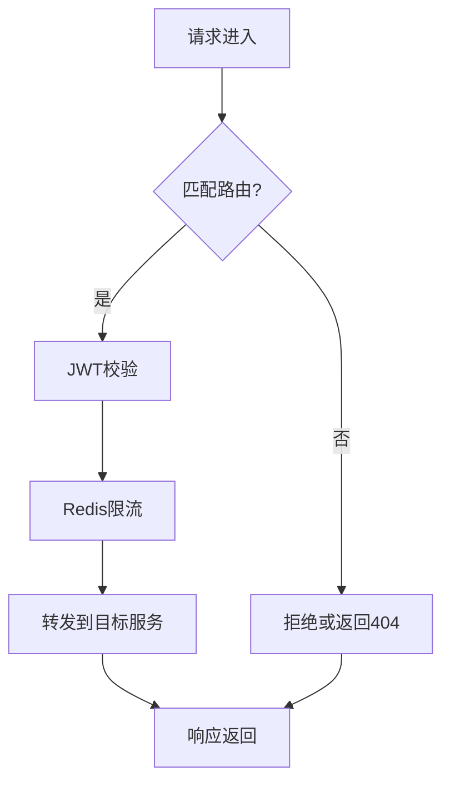
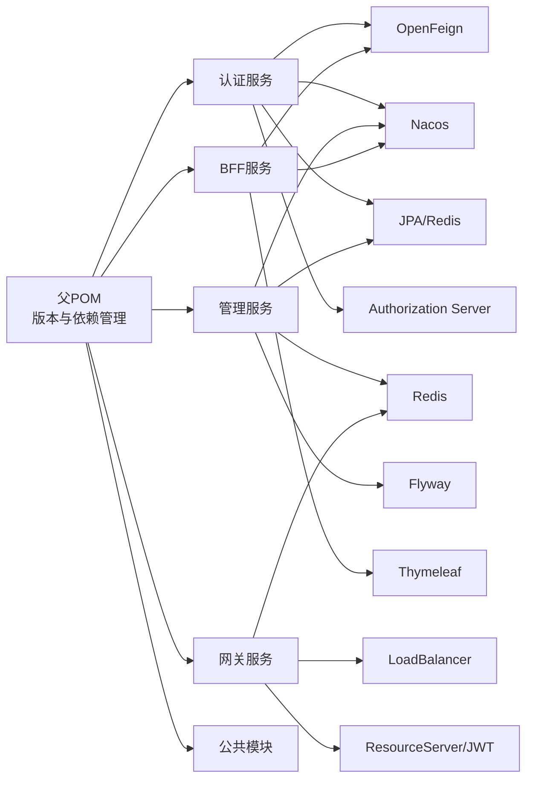

# 技术栈

<cite>
**本文引用的文件**
- [pom.xml](file://pom.xml)
- [iam-admin-server/pom.xml](file://iam-admin-server/pom.xml)
- [iam-auth-server/pom.xml](file://iam-auth-server/pom.xml)
- [iam-bff-server/pom.xml](file://iam-bff-server/pom.xml)
- [iam-gateway/pom.xml](file://iam-gateway/pom.xml)
- [docker-compose.yml](file://docker-compose.yml)
- [iam-admin-server/src/main/resources/application.yml](file://iam-admin-server/src/main/resources/application.yml)
- [iam-auth-server/src/main/resources/application.yml](file://iam-auth-server/src/main/resources/application.yml)
- [iam-bff-server/src/main/resources/application.yml](file://iam-bff-server/src/main/resources/application.yml)
- [iam-gateway/src/main/resources/application.yml](file://iam-gateway/src/main/resources/application.yml)
- [iam-admin-server/src/main/java/iam/platform/admin/SsoAdminServerApplication.java](file://iam-admin-server/src/main/java/iam/platform/admin/SsoAdminServerApplication.java)
- [iam-auth-server/src/main/java/iam/platform/auth/SsoAuthServerApplication.java](file://iam-auth-server/src/main/java/iam/platform/auth/SsoAuthServerApplication.java)
- [iam-bff-server/src/main/java/iam/platform/bff/IamBffServerApplication.java](file://iam-bff-server/src/main/java/iam/platform/bff/IamBffServerApplication.java)
- [iam-gateway/src/main/java/iam/platform/gateway/IamGatewayApplication.java](file://iam-gateway/src/main/java/iam/platform/gateway/IamGatewayApplication.java)
- [iam-common/src/main/java/iam/platform/common/api/ApiResponse.java](file://iam-common/src/main/java/iam/platform/common/api/ApiResponse.java)
</cite>

## 目录
1. [引言](#引言)
2. [项目结构](#项目结构)
3. [核心组件](#核心组件)
4. [架构总览](#架构总览)
5. [详细组件分析](#详细组件分析)
6. [依赖关系分析](#依赖关系分析)
7. [性能考量](#性能考量)
8. [故障排查指南](#故障排查指南)
9. [结论](#结论)
10. [附录](#附录)

## 引言
本技术栈文档面向IAM平台项目，系统性介绍后端微服务架构所采用的核心技术选型与协作机制。重点覆盖以下方面：
- 核心技术栈：Java 21、Spring Boot 3.2.5、Spring Authorization Server 1.2.5、Spring Cloud生态、OpenSAML、PostgreSQL、Redis、Zipkin、Docker Compose等
- 微服务组件职责：网关（Gateway）、认证服务（Auth Server）、管理服务（Admin Server）、BFF（Bff Server）
- 技术组合的协同机制：统一认证与授权、分布式会话、缓存与限流、可观测性与可运维性
- 关键第三方库：Lombok、MapStruct、Springdoc、Flyway、Testcontainers等
- 技术选型权衡与学习路径建议

## 项目结构
项目采用多模块Maven聚合工程组织，包含公共模块与四个独立服务模块：
- iam-common：通用API响应模型、DTO、枚举、异常与工具
- iam-auth-server：OAuth2/OIDC认证服务器，支持CAS/SAML/LDAP/社交登录等
- iam-admin-server：业务管理服务，负责组织、人员、权限等CRUD与审计
- iam-bff-server：前端后端服务，聚合调用后端服务并提供模板页面
- iam-gateway：API网关，统一入口、路由、鉴权、限流与跨域

图表来源
- [docker-compose.yml:1-190](file://docker-compose.yml#L1-L190)
- [iam-gateway/src/main/resources/application.yml:1-116](file://iam-gateway/src/main/resources/application.yml#L1-L116)
- [iam-auth-server/src/main/resources/application.yml:1-144](file://iam-auth-server/src/main/resources/application.yml#L1-L144)
- [iam-admin-server/src/main/resources/application.yml:1-102](file://iam-admin-server/src/main/resources/application.yml#L1-L102)
- [iam-bff-server/src/main/resources/application.yml:1-54](file://iam-bff-server/src/main/resources/application.yml#L1-L54)

章节来源
- [pom.xml:21-27](file://pom.xml#L21-L27)
- [iam-gateway/pom.xml:1-106](file://iam-gateway/pom.xml#L1-L106)
- [iam-auth-server/pom.xml:1-180](file://iam-auth-server/pom.xml#L1-L180)
- [iam-admin-server/pom.xml:1-150](file://iam-admin-server/pom.xml#L1-L150)
- [iam-bff-server/pom.xml:1-107](file://iam-bff-server/pom.xml#L1-L107)

## 核心组件
- Java 21：提供更强的性能、更好的内存管理和语言特性，适配Spring Boot 3.x与现代化开发体验
- Spring Boot 3.2.5：统一依赖管理、自动配置与生产就绪能力（Actuator、健康检查、指标暴露）
- Spring Authorization Server 1.2.5：标准OIDC Provider，支撑OAuth2授权流程、令牌签发与JWK管理
- Spring Cloud生态：OpenFeign、LoadBalancer、Nacos Discovery、Gateway、Brave/Zipkin
- 数据持久化：PostgreSQL + Hibernate/JPA + Flyway（版本迁移）
- 缓存与会话：Redis（缓存、分布式会话、限流）
- 文档与工具：Springdoc（OpenAPI）、Lombok（简化代码）、MapStruct（对象映射）、Testcontainers（测试）
- 容器化与编排：Docker Compose一键拉起网关、认证、管理、BFF、数据库、缓存、追踪

章节来源
- [pom.xml:29-41](file://pom.xml#L29-L41)
- [iam-auth-server/pom.xml:69-73](file://iam-auth-server/pom.xml#L69-L73)
- [iam-admin-server/pom.xml:32-37](file://iam-admin-server/pom.xml#L32-L37)
- [iam-gateway/pom.xml:18-28](file://iam-gateway/pom.xml#L18-L28)
- [docker-compose.yml:1-190](file://docker-compose.yml#L1-L190)

## 架构总览
IAM平台采用“网关+多服务”的微服务体系，结合统一认证与授权、分布式缓存与会话、服务发现与负载均衡、链路追踪与指标监控，形成高性能、高可用、易维护的整体架构。

图表来源
- [docker-compose.yml:1-190](file://docker-compose.yml#L1-L190)
- [iam-gateway/src/main/resources/application.yml:18-54](file://iam-gateway/src/main/resources/application.yml#L18-L54)
- [iam-auth-server/src/main/resources/application.yml:15-37](file://iam-auth-server/src/main/resources/application.yml#L15-L37)
- [iam-admin-server/src/main/resources/application.yml:15-37](file://iam-admin-server/src/main/resources/application.yml#L15-L37)
- [iam-bff-server/src/main/resources/application.yml:10-23](file://iam-bff-server/src/main/resources/application.yml#L10-L23)

## 详细组件分析

### 认证服务（Auth Server）
- 职责：OAuth2/OIDC授权服务器，支持CAS、SAML、LDAP、社交登录（如钉钉），内置验证码登录、速率限制、账户锁定策略
- 关键配置：数据库连接、Redis会话、JWK密钥、安全策略、CAS/SAML参数、LDAP配置、管理端口与指标
- 启动入口：扫描配置包、启用JPA仓库、开启Feign客户端以调用管理服务

图表来源
- [iam-gateway/src/main/resources/application.yml:90-92](file://iam-gateway/src/main/resources/application.yml#L90-L92)
- [iam-auth-server/src/main/resources/application.yml:15-37](file://iam-auth-server/src/main/resources/application.yml#L15-L37)
- [iam-auth-server/src/main/java/iam/platform/auth/SsoAuthServerApplication.java:9-12](file://iam-auth-server/src/main/java/iam/platform/auth/SsoAuthServerApplication.java#L9-L12)

章节来源
- [iam-auth-server/src/main/resources/application.yml:1-144](file://iam-auth-server/src/main/resources/application.yml#L1-L144)
- [iam-auth-server/src/main/java/iam/platform/auth/SsoAuthServerApplication.java:1-19](file://iam-auth-server/src/main/java/iam/platform/auth/SsoAuthServerApplication.java#L1-L19)

### 管理服务（Admin Server）
- 职责：组织、人员、角色、权限等业务CRUD，审计日志切面，分布式会话管理
- 关键配置：数据库连接、Redis会话、Flyway迁移、OpenAPI文档、管理端口与指标、审计策略
- 启动入口：扫描配置包、启用JPA仓库、开启AOP审计

图表来源
- [iam-admin-server/src/main/java/iam/platform/admin/SsoAdminServerApplication.java:8-11](file://iam-admin-server/src/main/java/iam/platform/admin/SsoAdminServerApplication.java#L8-L11)
- [iam-admin-server/src/main/resources/application.yml:15-51](file://iam-admin-server/src/main/resources/application.yml#L15-L51)

章节来源
- [iam-admin-server/src/main/resources/application.yml:1-102](file://iam-admin-server/src/main/resources/application.yml#L1-L102)
- [iam-admin-server/src/main/java/iam/platform/admin/SsoAdminServerApplication.java:1-17](file://iam-admin-server/src/main/java/iam/platform/admin/SsoAdminServerApplication.java#L1-L17)

### BFF服务（Bff Server）
- 职责：聚合调用认证与管理服务，提供模板页面与前端交互
- 关键配置：Thymeleaf模板、OpenFeign超时、管理端口与指标、日志级别
- 启动入口：启用服务发现与Feign客户端

图表来源
- [iam-bff-server/src/main/resources/application.yml:25-32](file://iam-bff-server/src/main/resources/application.yml#L25-L32)
- [iam-bff-server/src/main/java/iam/platform/bff/IamBffServerApplication.java:8-11](file://iam-bff-server/src/main/java/iam/platform/bff/IamBffServerApplication.java#L8-L11)

章节来源
- [iam-bff-server/src/main/resources/application.yml:1-54](file://iam-bff-server/src/main/resources/application.yml#L1-L54)
- [iam-bff-server/src/main/java/iam/platform/bff/IamBffServerApplication.java:1-17](file://iam-bff-server/src/main/java/iam/platform/bff/IamBffServerApplication.java#L1-L17)

### 网关（Gateway）
- 职责：统一入口、基于路径/域名的路由、全局跨域、JWT资源服务器校验、Redis限流
- 关键配置：路由规则、限流参数、CORS、JWT issuer、管理端口与指标、日志级别

图表来源
- [iam-gateway/src/main/resources/application.yml:18-68](file://iam-gateway/src/main/resources/application.yml#L18-L68)
- [iam-gateway/src/main/java/iam/platform/gateway/IamGatewayApplication.java:7-9](file://iam-gateway/src/main/java/iam/platform/gateway/IamGatewayApplication.java#L7-L9)

章节来源
- [iam-gateway/src/main/resources/application.yml:1-116](file://iam-gateway/src/main/resources/application.yml#L1-L116)
- [iam-gateway/src/main/java/iam/platform/gateway/IamGatewayApplication.java:1-15](file://iam-gateway/src/main/java/iam/platform/gateway/IamGatewayApplication.java#L1-L15)

### 公共模块（iam-common）
- 职责：统一API响应模型、分页响应、领域注解、枚举、异常体系、值对象与守卫工具
- 作用：规范接口输出格式，降低重复代码，提升契约一致性

章节来源
- [iam-common/src/main/java/iam/platform/common/api/ApiResponse.java:1-61](file://iam-common/src/main/java/iam/platform/common/api/ApiResponse.java#L1-L61)

## 依赖关系分析
- 版本与依赖管理：父POM集中管理Spring Boot、Spring Cloud、OpenSAML、MapStruct、Springdoc、Testcontainers等版本
- 模块间依赖：各服务模块依赖iam-common；认证/BFF/网关模块引入OpenFeign/Nacos；认证/管理模块引入Redis/JPA；均接入Actuator/Micrometer/Zipkin
- 运行时依赖：PostgreSQL驱动、Flyway、Lombok、MapStruct处理器、Testcontainers

图表来源
- [pom.xml:43-122](file://pom.xml#L43-L122)
- [iam-auth-server/pom.xml:63-73](file://iam-auth-server/pom.xml#L63-L73)
- [iam-admin-server/pom.xml:53-57](file://iam-admin-server/pom.xml#L53-L57)
- [iam-bff-server/pom.xml:43-55](file://iam-bff-server/pom.xml#L43-L55)
- [iam-gateway/pom.xml:18-28](file://iam-gateway/pom.xml#L18-L28)

章节来源
- [pom.xml:1-226](file://pom.xml#L1-L226)
- [iam-auth-server/pom.xml:1-180](file://iam-auth-server/pom.xml#L1-L180)
- [iam-admin-server/pom.xml:1-150](file://iam-admin-server/pom.xml#L1-L150)
- [iam-bff-server/pom.xml:1-107](file://iam-bff-server/pom.xml#L1-L107)
- [iam-gateway/pom.xml:1-106](file://iam-gateway/pom.xml#L1-L106)

## 性能考量
- 连接池与数据库：HikariCP连接池参数（最大池大小、空闲超时、最大生命周期）有助于控制并发与资源占用
- 缓存与会话：Redis作为缓存与分布式会话，显著降低数据库压力与会话查找开销
- 限流与降载：网关基于Redis的限流过滤器，按服务维度设置补充速率与突发容量，避免雪崩
- 序列化与时区：Jackson日期格式与时区统一，减少序列化差异带来的性能与解析问题
- 观测性：Prometheus指标与Zipkin链路追踪，便于定位热点与瓶颈

章节来源
- [iam-admin-server/src/main/resources/application.yml:19-24](file://iam-admin-server/src/main/resources/application.yml#L19-L24)
- [iam-gateway/src/main/resources/application.yml:24-41](file://iam-gateway/src/main/resources/application.yml#L24-L41)
- [iam-auth-server/src/main/resources/application.yml:40-44](file://iam-auth-server/src/main/resources/application.yml#L40-L44)

## 故障排查指南
- 健康检查与指标：通过Actuator暴露health、info、metrics、prometheus端点，结合Prometheus/Grafana进行监控
- 链路追踪：Zipkin收集Span，采样概率100%，便于端到端问题定位
- 日志级别：网关与安全组件可调整DEBUG级别，辅助排查路由与鉴权问题
- 数据库与缓存：确认PostgreSQL/Redis健康检查与连接参数，避免因连接失败导致的级联故障
- 服务发现：确保Nacos健康可用，服务实例可被正确注册与发现

章节来源
- [iam-gateway/src/main/resources/application.yml:93-108](file://iam-gateway/src/main/resources/application.yml#L93-L108)
- [iam-auth-server/src/main/resources/application.yml:128-144](file://iam-auth-server/src/main/resources/application.yml#L128-L144)
- [iam-admin-server/src/main/resources/application.yml:76-92](file://iam-admin-server/src/main/resources/application.yml#L76-L92)
- [docker-compose.yml:17-56](file://docker-compose.yml#L17-L56)

## 结论
本技术栈通过“Java 21 + Spring Boot 3.2.5 + Spring Authorization Server 1.2.5 + Spring Cloud生态”的组合，实现了统一认证与授权、灵活的多协议支持（OIDC/CAS/SAML/LDAP）、完善的可观测性与可运维性。配合PostgreSQL、Redis、Zipkin与Docker Compose，构建了高性能、高可用、易维护的IAM平台后端架构。模块化设计与公共模块复用，进一步提升了系统的可扩展性与一致性。

## 附录

### 技术选型与优势
- Java 21：更强的性能、更好的GC与语言特性，适合高并发场景
- Spring Boot 3.2.5：自动配置与生产就绪能力，简化部署与运维
- Spring Authorization Server 1.2.5：标准OIDC Provider，易于集成与扩展
- Spring Cloud：统一的服务治理、负载均衡、网关与链路追踪
- PostgreSQL：成熟的关系型数据库，事务与ACID保证
- Redis：高性能缓存、会话与限流，支撑高并发访问
- OpenSAML：标准化SAML 2.0支持，满足企业集成需求
- Lombok/MapStruct/Springdoc：提升开发效率与API可读性

### 关键第三方库的作用
- Lombok：减少样板代码，提升开发效率
- MapStruct：零拷贝对象映射，提升转换性能
- Springdoc：自动生成OpenAPI文档，便于前后端协作
- Flyway：数据库版本迁移，保障演进一致性
- Testcontainers：集成测试环境隔离与自动化

### 对比与权衡
- 与传统SSO方案对比：采用Spring Authorization Server替代自研OIDC，降低维护成本并提升安全性
- 与单体架构对比：微服务拆分清晰，职责单一，利于团队协作与弹性伸缩
- 与无状态方案对比：引入Redis会话与限流，兼顾用户体验与系统稳定性

### 学习路径与参考资料
- Spring Boot与Spring Cloud官方文档
- Spring Authorization Server官方指南
- OpenSAML官方文档与示例
- PostgreSQL与Hibernate/JPA最佳实践
- Redis使用手册与限流策略
- Micrometer与Zipkin链路追踪
- Docker与Compose编排实践