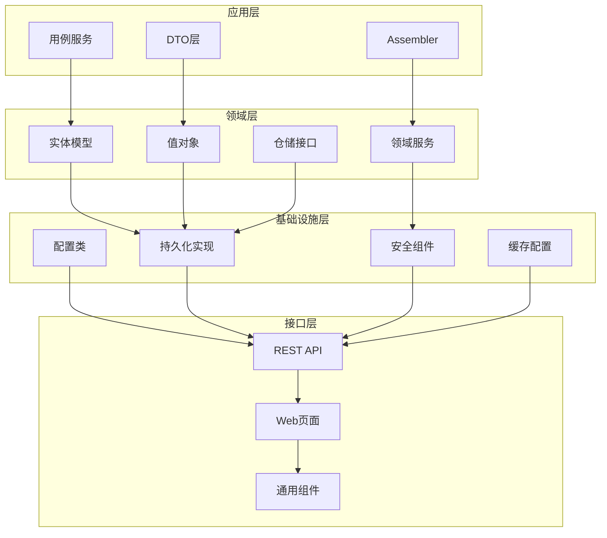
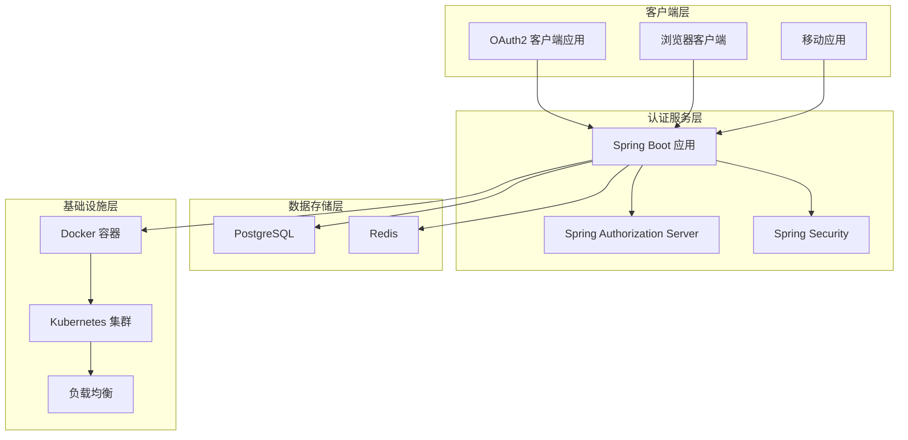
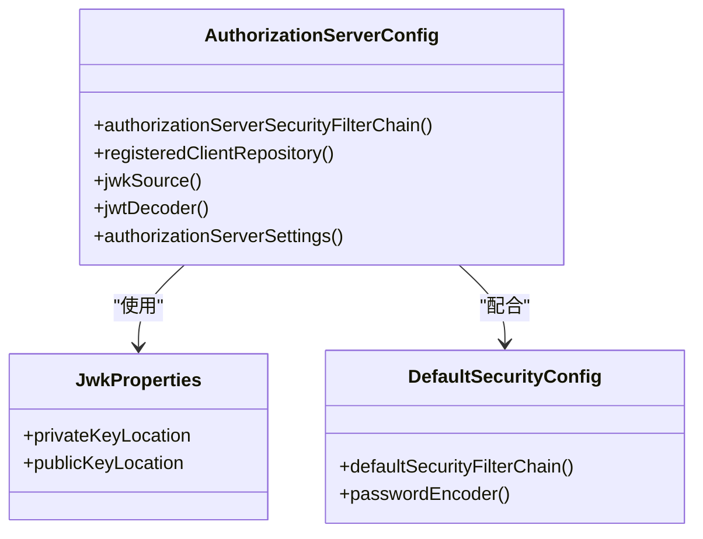
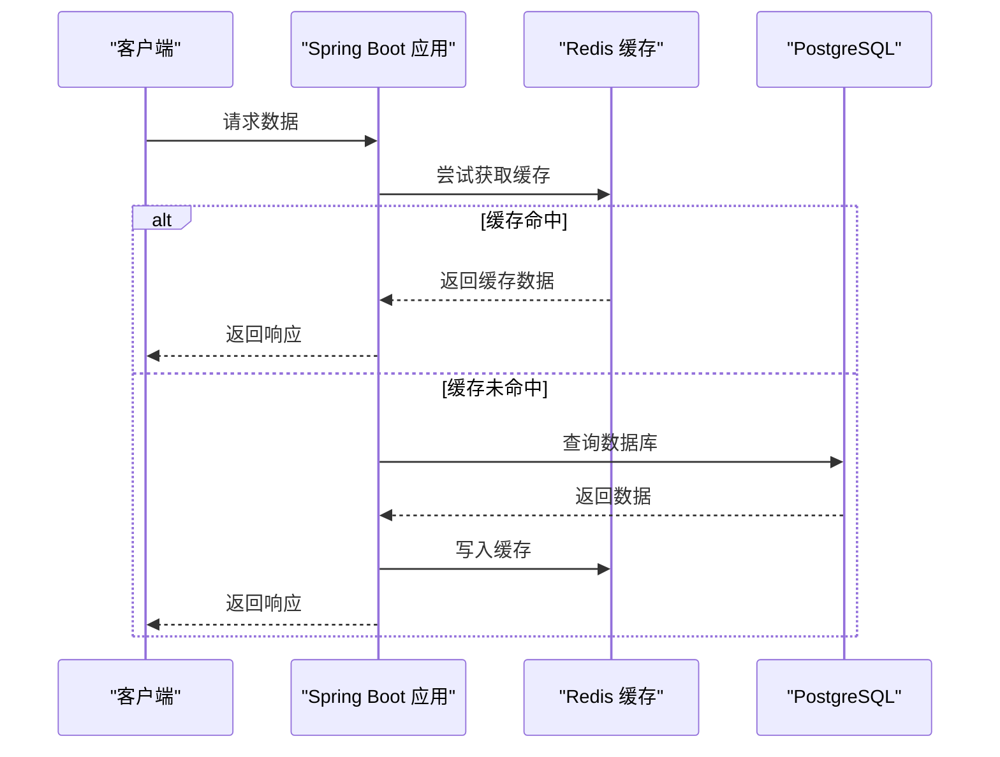
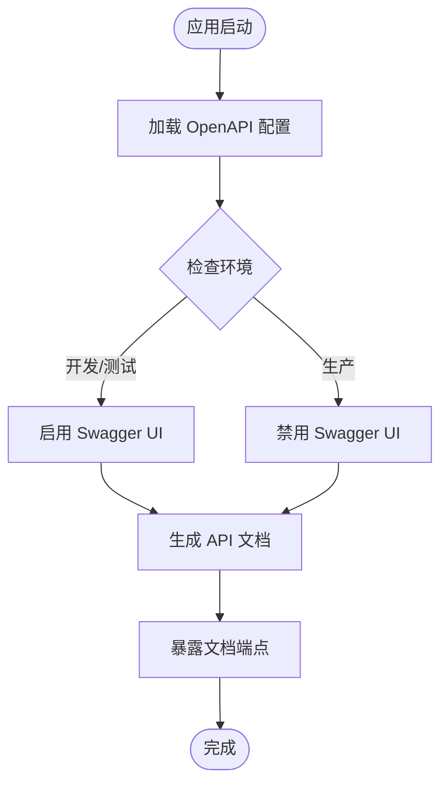
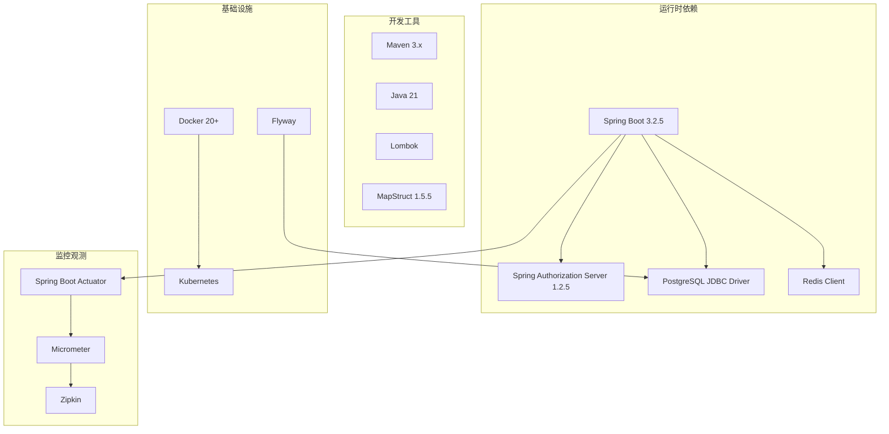
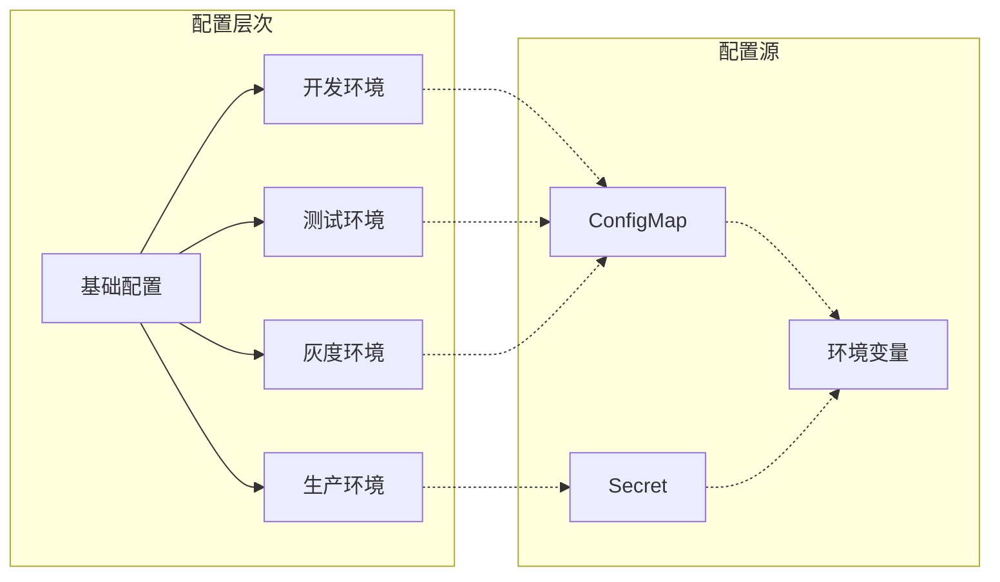

# 技术栈介绍

<cite>
**本文引用的文件列表**
- [pom.xml](file://pom.xml)
- [application.yml](file://src/main/resources/application.yml)
- [Dockerfile](file://Dockerfile)
- [README.md](file://README.md)
- [DEPLOYMENT.md](file://DEPLOYMENT.md)
- [SsoOidcApplication.java](file://src/main/java/sso/oidc/SsoOidcApplication.java)
- [AuthorizationServerConfig.java](file://src/main/java/sso/oidc/infrastructure/config/AuthorizationServerConfig.java)
- [DefaultSecurityConfig.java](file://src/main/java/sso/oidc/infrastructure/config/DefaultSecurityConfig.java)
- [RedisConfig.java](file://src/main/java/sso/oidc/infrastructure/config/RedisConfig.java)
- [OpenApiConfig.java](file://src/main/java/sso/oidc/infrastructure/config/OpenApiConfig.java)
- [JwkProperties.java](file://src/main/java/sso/oidc/infrastructure/config/JwkProperties.java)
- [deployment.yaml](file://k8s/base/deployment.yaml)
- [kustomization.yaml](file://k8s/base/kustomization.yaml)
- [dev-kustomization.yaml](file://k8s/overlays/dev/kustomization.yaml)
</cite>

## 目录
1. [简介](#简介)
2. [项目结构](#项目结构)
3. [核心技术组件](#核心技术组件)
4. [架构总览](#架构总览)
5. [详细组件分析](#详细组件分析)
6. [依赖关系分析](#依赖关系分析)
7. [性能考量](#性能考量)
8. [故障排查指南](#故障排查指南)
9. [结论](#结论)

## 简介
本项目是一个基于 OpenID Connect 1.0 协议的统一身份认证服务（SSO），为微服务架构提供集中式认证授权能力。项目采用现代化技术栈，结合 Spring Boot 3.2.5、Spring Authorization Server 1.2.5、PostgreSQL、Redis、Docker、Kubernetes 等基础设施，构建高性能、高可用、可扩展的 OIDC Provider。

## 项目结构
项目采用分层架构设计，包含应用层、领域层、基础设施层和接口层四个主要层次，配合 Spring Security 提供完整的认证授权能力。

**图表来源**
- [SsoOidcApplication.java:1-13](file://src/main/java/sso/oidc/SsoOidcApplication.java#L1-L13)
- [AuthorizationServerConfig.java:1-143](file://src/main/java/sso/oidc/infrastructure/config/AuthorizationServerConfig.java#L1-L143)

**章节来源**
- [README.md:104-139](file://README.md#L104-L139)

## 核心技术组件
本项目采用业界主流技术栈，确保系统在性能、安全性、可维护性方面的最佳平衡。

### Java 21
- **版本**: 21
- **选择原因**: 
  - 长期支持版本（LTS），提供稳定性和长期维护保障
  - 性能优化，包括垃圾回收器改进和JIT编译器优化
  - 新特性支持，如密封类、记录类等现代语言特性
- **技术价值**: 为整个应用提供高性能的运行时环境，支持现代化并发编程模式

### Spring Boot 3.2.5
- **版本**: 3.2.5
- **核心作用**:
  - 提供自动配置和开箱即用的开发体验
  - 集成丰富的 Starter 依赖，简化配置复杂度
  - 内置嵌入式服务器，便于部署和测试
- **技术优势**:
  - 与 Spring 生态系统深度集成
  - 强大的 Actuator 监控能力
  - 优秀的测试支持和开发工具链

### Spring Authorization Server 1.2.5
- **版本**: 1.2.5
- **核心功能**:
  - 实现完整的 OIDC Provider 能力
  - 支持授权码流程、客户端凭证流程等多种授权模式
  - 提供 JWKS、用户信息、令牌撤销等标准端点
- **技术价值**:
  - 企业级 OAuth2/OIDC 实现，符合行业标准
  - 灵活的客户端管理和令牌配置
  - 完善的安全策略和合规性支持

### PostgreSQL 数据库
- **核心作用**: 主要数据存储，支持用户、角色、OAuth2 客户端等核心业务数据
- **技术优势**:
  - ACID 事务保证数据一致性
  - 强大的 SQL 查询能力和扩展性
  - 优秀的性能表现和稳定性
- **配置特点**:
  - 使用 HikariCP 连接池，优化数据库连接性能
  - Flyway 数据库迁移，确保 schema 版本管理

### Redis 缓存
- **双重用途**:
  - 分布式会话存储（Spring Session）
  - 应用级缓存（Spring Cache）
- **技术价值**:
  - 提升系统响应速度和吞吐量
  - 支持水平扩展和高可用部署
  - 简化的分布式状态管理

### API 文档 (Springdoc 2.3.0)
- **版本**: 2.3.0
- **核心功能**:
  - 自动生成 OpenAPI 3.0 规范
  - 提供交互式 Swagger UI
  - 支持多环境配置（开发环境启用，生产环境禁用）
- **技术优势**:
  - 与 Spring MVC 完美集成
  - 实时同步代码注释和接口定义
  - 支持复杂的 API 文档组织

### 容器化 (Docker)
- **技术特点**:
  - 多阶段构建，优化镜像体积
  - Alpine Linux 基础镜像，减少攻击面
  - 健康检查和资源限制
- **部署优势**:
  - 环境一致性，避免"在我机器上能运行"
  - 快速部署和弹性伸缩
  - 与 Kubernetes 无缝集成

### Kubernetes 部署
- **架构设计**:
  - Kustomize 基于 Base + Overlay 模式的多环境管理
  - 支持 DEV/TEST/CANARY/PROD 四套环境
  - 自动扩缩容和滚动更新
- **运维价值**:
  - 生产级容器编排能力
  - 完善的监控和可观测性
  - 支持灰度发布和蓝绿部署

**章节来源**
- [pom.xml:20-27](file://pom.xml#L20-L27)
- [README.md:5-22](file://README.md#L5-L22)
- [application.yml:1-78](file://src/main/resources/application.yml#L1-L78)

## 架构总览
项目采用分层架构和微服务设计理念，结合 Spring Security 提供完整的认证授权解决方案。

**图表来源**
- [AuthorizationServerConfig.java:42-66](file://src/main/java/sso/oidc/infrastructure/config/AuthorizationServerConfig.java#L42-L66)
- [DefaultSecurityConfig.java:13-37](file://src/main/java/sso/oidc/infrastructure/config/DefaultSecurityConfig.java#L13-L37)
- [deployment.yaml:17-58](file://k8s/base/deployment.yaml#L17-L58)

## 详细组件分析

### Spring Authorization Server 配置
负责实现 OIDC Provider 的核心功能，包括授权流程、令牌管理、JWK 密钥管理等。

**图表来源**
- [AuthorizationServerConfig.java:42-143](file://src/main/java/sso/oidc/infrastructure/config/AuthorizationServerConfig.java#L42-L143)
- [JwkProperties.java:1-16](file://src/main/java/sso/oidc/infrastructure/config/JwkProperties.java#L1-L16)
- [DefaultSecurityConfig.java:13-44](file://src/main/java/sso/oidc/infrastructure/config/DefaultSecurityConfig.java#L13-L44)

### Redis 缓存配置
实现应用级缓存和分布式会话管理，提升系统性能和可扩展性。

**图表来源**
- [RedisConfig.java:19-32](file://src/main/java/sso/oidc/infrastructure/config/RedisConfig.java#L19-L32)

### API 文档配置
基于 Springdoc OpenAPI 实现自动化 API 文档生成，支持多环境差异化配置。

**图表来源**
- [OpenApiConfig.java:12-21](file://src/main/java/sso/oidc/infrastructure/config/OpenApiConfig.java#L12-L21)
- [application.yml:57-61](file://src/main/resources/application.yml#L57-L61)

**章节来源**
- [AuthorizationServerConfig.java:1-143](file://src/main/java/sso/oidc/infrastructure/config/AuthorizationServerConfig.java#L1-L143)
- [RedisConfig.java:1-34](file://src/main/java/sso/oidc/infrastructure/config/RedisConfig.java#L1-L34)
- [OpenApiConfig.java:1-22](file://src/main/java/sso/oidc/infrastructure/config/OpenApiConfig.java#L1-L22)

## 依赖关系分析
项目技术栈之间形成清晰的依赖关系，确保系统的模块化和可维护性。

**图表来源**
- [pom.xml:29-140](file://pom.xml#L29-L140)
- [Dockerfile:4-60](file://Dockerfile#L4-L60)

### 环境配置依赖
项目通过 Spring Profiles 和 Kustomize 实现多环境配置隔离，确保不同环境下的配置一致性。

**图表来源**
- [application.yml:7-8](file://src/main/resources/application.yml#L7-L8)
- [kustomization.yaml:1-11](file://k8s/base/kustomization.yaml#L1-L11)
- [dev-kustomization.yaml:15-23](file://k8s/overlays/dev/kustomization.yaml#L15-L23)

**章节来源**
- [pom.xml:184-224](file://pom.xml#L184-L224)
- [DEPLOYMENT.md:200-223](file://DEPLOYMENT.md#L200-L223)

## 性能考量
项目在多个层面进行了性能优化设计，确保系统在高并发场景下的稳定运行。

### 连接池优化
- **数据库连接池**: HikariCP，最大连接数 10，连接超时 30 秒
- **Redis 连接**: 默认连接池配置，支持连接复用
- **线程池**: Spring Boot 自动配置，可根据需求调整

### 缓存策略
- **Redis 缓存**: 默认 TTL 5 分钟，JSON 序列化，禁用空值缓存
- **Spring Session**: Redis 分布式会话，支持集群部署
- **数据库查询**: 合理使用缓存减少数据库压力

### 容器化优化
- **镜像分层**: 多阶段构建，最终镜像仅包含运行时必需组件
- **资源限制**: CPU 200m-1，内存 512Mi-1Gi，防止资源滥用
- **健康检查**: 多层次健康检查，确保服务可用性

### 监控指标
- **Prometheus**: 指标收集和导出
- **Zipkin**: 分布式追踪
- **Actuator**: 健康检查、指标暴露、配置信息

**章节来源**
- [application.yml:13-18](file://src/main/resources/application.yml#L13-L18)
- [RedisConfig.java:20-32](file://src/main/java/sso/oidc/infrastructure/config/RedisConfig.java#L20-L32)
- [deployment.yaml:30-36](file://k8s/base/deployment.yaml#L30-L36)

## 故障排查指南
针对常见问题提供系统性的排查方法和解决方案。

### 启动失败排查
1. **端口占用**: 检查 9000 和 9001 端口是否被占用
2. **数据库连接**: 验证 PostgreSQL 连接字符串和凭据
3. **Redis 连接**: 确认 Redis 服务可达性和密码配置
4. **JWK 密钥**: 检查 RSA 私钥和公钥文件是否存在且格式正确

### 认证授权问题
1. **OIDC Discovery**: 访问 `/.well-known/openid-configuration` 确认配置
2. **令牌获取**: 检查客户端配置和授权码流程
3. **用户信息**: 验证用户信息端点和 JWT claims
4. **JWKS 端点**: 确认公钥端点返回正确的 JWK Set

### 性能问题诊断
1. **数据库性能**: 监控 HikariCP 连接池状态
2. **缓存命中率**: 检查 Redis 缓存使用情况
3. **内存使用**: 监控 JVM 内存和 GC 情况
4. **网络延迟**: 使用 curl 测试各端点响应时间

### Kubernetes 部署问题
1. **Pod 状态**: 使用 `kubectl describe pod` 查看详细状态
2. **日志查看**: `kubectl logs -f` 实时查看应用日志
3. **资源限制**: 检查 CPU 和内存限制是否合理
4. **健康检查**: 验证 readiness 和 liveness probe 配置

**章节来源**
- [DEPLOYMENT.md:242-289](file://DEPLOYMENT.md#L242-L289)
- [application.yml:63-78](file://src/main/resources/application.yml#L63-L78)

## 结论
本项目的技术栈选择体现了现代企业级应用的最佳实践，通过 Spring Boot 3.2.5 提供稳定的运行时环境，Spring Authorization Server 1.2.5 实现标准的 OIDC 协议，结合 PostgreSQL 和 Redis 确保数据一致性和性能，Docker 和 Kubernetes 提供现代化的部署和运维能力。

技术选型的优势体现在：
- **性能**: Java 21 + Spring Boot 3 的性能优化，合理的缓存和连接池配置
- **安全**: 完整的 OAuth2/OIDC 实现，JWK 密钥管理和 HTTPS 支持
- **可维护性**: 清晰的分层架构，完善的监控和可观测性
- **可扩展性**: 容器化和 Kubernetes 部署，支持水平扩展和灰度发布

这套技术栈为微服务架构提供了可靠的统一身份认证基础，能够满足企业级应用对安全性、性能和可维护性的严格要求。