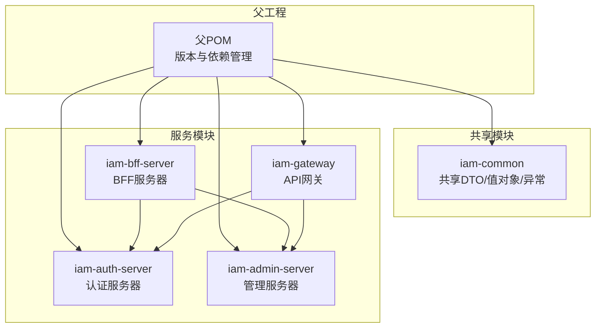
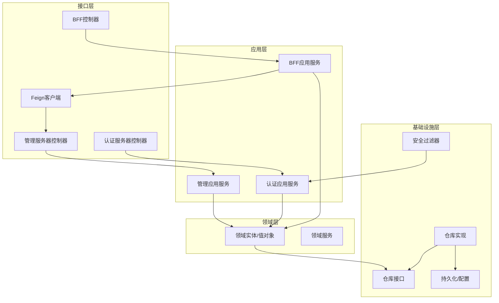
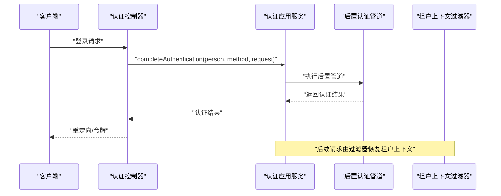
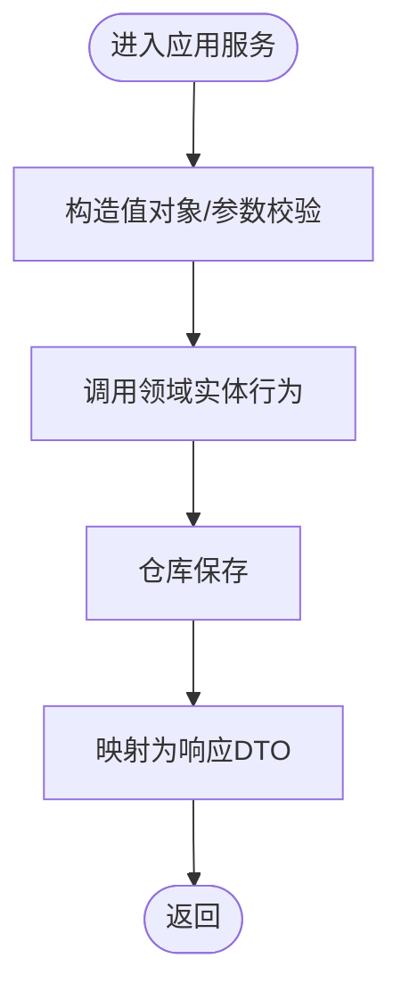
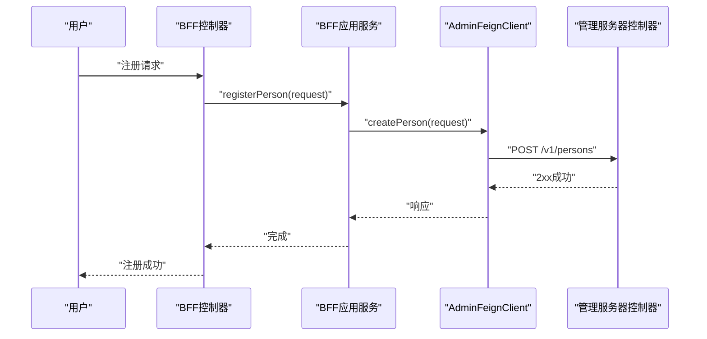
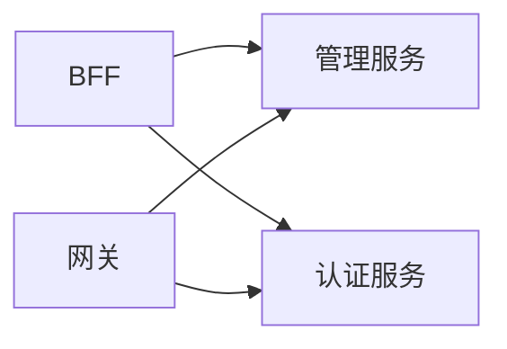

# 清洁架构设计

<cite>
**本文档引用的文件**
- [SsoAdminServerApplication.java](file://iam-admin-server/src/main/java/iam/platform/admin/SsoAdminServerApplication.java)
- [SsoAuthServerApplication.java](file://iam-auth-server/src/main/java/iam/platform/auth/SsoAuthServerApplication.java)
- [IamBffServerApplication.java](file://iam-bff-server/src/main/java/iam/platform/bff/IamBffServerApplication.java)
- [IamGatewayApplication.java](file://iam-gateway/src/main/java/iam/platform/gateway/IamGatewayApplication.java)
- [ApplicationApplicationService.java](file://iam-admin-server/src/main/java/iam/platform/admin/application/service/ApplicationApplicationService.java)
- [Application.java](file://iam-auth-server/src/main/java/iam/platform/auth/domain/model/entity/Application.java)
- [ApplicationRepository.java](file://iam-admin-server/src/main/java/iam/platform/admin/domain/repository/ApplicationRepository.java)
- [ApplicationRepositoryImpl.java](file://iam-admin-server/src/main/java/iam/platform/admin/infrastructure/persistence/impl/ApplicationRepositoryImpl.java)
- [TenantAwareAuthenticationFilter.java](file://iam-auth-server/src/main/java/iam/platform/auth/infrastructure/security/TenantAwareAuthenticationFilter.java)
- [AuthenticationApplicationService.java](file://iam-auth-server/src/main/java/iam/platform/auth/application/service/AuthenticationApplicationService.java)
- [AdminFeignClient.java](file://iam-bff-server/src/main/java/iam/platform/bff/infrastructure/client/AdminFeignClient.java)
- [BffRegistrationService.java](file://iam-bff-server/src/main/java/iam/platform/bff/application/service/BffRegistrationService.java)
- [CreateApplicationRequest.java](file://iam-common/src/main/java/iam/platform/common/dto/request/CreateApplicationRequest.java)
- [pom.xml](file://pom.xml)
</cite>

## 目录
1. [引言](#引言)
2. [项目结构](#项目结构)
3. [核心组件](#核心组件)
4. [架构总览](#架构总览)
5. [详细组件分析](#详细组件分析)
6. [依赖分析](#依赖分析)
7. [性能考虑](#性能考虑)
8. [故障排除指南](#故障排除指南)
9. [结论](#结论)
10. [附录](#附录)

## 引言
本文件系统化阐述IAM平台的Clean Architecture设计与实现，围绕应用层、领域层、基础设施层与接口层的职责划分，结合认证服务器、管理服务器、BFF服务器与API网关四个服务模块，说明如何通过依赖倒置原则实现层间解耦，并在架构中融入领域驱动设计（DDD）思想，包括实体、值对象与领域服务的设计模式。文档同时给出数据流与依赖关系图示，帮助读者快速把握系统的关注点分离与可维护性。

## 项目结构
项目采用多模块Maven聚合工程组织，父POM统一管理版本与插件，四个子模块分别承担不同职责：
- iam-common：共享DTO、枚举、值对象、异常与工具类
- iam-auth-server：认证与授权核心，支持OIDC/SAML/CAS等协议适配
- iam-admin-server：租户内管理能力，提供应用、人员、权限等管理接口
- iam-bff-server：前端统一入口，编排后端服务调用
- iam-gateway：API网关，负责路由与安全前置

图表来源
- [pom.xml:21-27](file://pom.xml#L21-L27)

章节来源
- [pom.xml:21-27](file://pom.xml#L21-L27)

## 核心组件
本节从Clean Architecture视角，逐层解析各模块的职责与边界：

- 应用层（Application Layer）
  - 职责：协调用例执行，编排领域模型与外部资源；负责事务边界与审计日志等横切关注点
  - 示例：管理服务器的应用服务负责应用生命周期管理与权限管理；认证服务器的应用服务负责完成认证上下文建立与租户选择
  - 参考路径：
    - [ApplicationApplicationService.java:35-62](file://iam-admin-server/src/main/java/iam/platform/admin/application/service/ApplicationApplicationService.java#L35-L62)
    - [AuthenticationApplicationService.java:42-45](file://iam-auth-server/src/main/java/iam/platform/auth/application/service/AuthenticationApplicationService.java#L42-L45)

- 领域层（Domain Layer）
  - 职责：封装业务规则与不变量，定义实体、值对象与领域服务；对外暴露行为而非状态
  - 示例：应用实体负责注册、密钥轮换、状态变更与元数据更新；值对象承载不可变业务概念
  - 参考路径：
    - [Application.java:48-78](file://iam-auth-server/src/main/java/iam/platform/auth/domain/model/entity/Application.java#L48-L78)
    - [Application.java:86-92](file://iam-auth-server/src/main/java/iam/platform/auth/domain/model/entity/Application.java#L86-L92)
    - [Application.java:99-125](file://iam-auth-server/src/main/java/iam/platform/auth/domain/model/entity/Application.java#L99-L125)

- 基础设施层（Infrastructure Layer）
  - 职责：提供技术实现细节，如持久化、缓存、消息、安全过滤器等；向上层暴露仓库接口
  - 示例：管理服务器的仓库实现负责PO/DO转换与JPA交互；认证服务器的安全过滤器负责租户上下文恢复
  - 参考路径：
    - [ApplicationRepositoryImpl.java:25-30](file://iam-admin-server/src/main/java/iam/platform/admin/infrastructure/persistence/impl/ApplicationRepositoryImpl.java#L25-L30)
    - [TenantAwareAuthenticationFilter.java:28-44](file://iam-auth-server/src/main/java/iam/platform/auth/infrastructure/security/TenantAwareAuthenticationFilter.java#L28-L44)

- 接口层（Interfaces Layer）
  - 职责任一：REST/Web控制器暴露业务能力；记录请求/响应DTO
  - 职责任二：客户端Feign接口编排下游服务调用
  - 示例：BFF通过Feign客户端调用管理服务；管理服务器控制器处理应用管理请求
  - 参考路径：
    - [AdminFeignClient.java:13-24](file://iam-bff-server/src/main/java/iam/platform/bff/infrastructure/client/AdminFeignClient.java#L13-L24)
    - [CreateApplicationRequest.java:17-43](file://iam-common/src/main/java/iam/platform/common/dto/request/CreateApplicationRequest.java#L17-L43)

章节来源
- [ApplicationApplicationService.java:35-62](file://iam-admin-server/src/main/java/iam/platform/admin/application/service/ApplicationApplicationService.java#L35-L62)
- [AuthenticationApplicationService.java:42-45](file://iam-auth-server/src/main/java/iam/platform/auth/application/service/AuthenticationApplicationService.java#L42-L45)
- [Application.java:48-78](file://iam-auth-server/src/main/java/iam/platform/auth/domain/model/entity/Application.java#L48-L78)
- [ApplicationRepositoryImpl.java:25-30](file://iam-admin-server/src/main/java/iam/platform/admin/infrastructure/persistence/impl/ApplicationRepositoryImpl.java#L25-L30)
- [TenantAwareAuthenticationFilter.java:28-44](file://iam-auth-server/src/main/java/iam/platform/auth/infrastructure/security/TenantAwareAuthenticationFilter.java#L28-L44)
- [AdminFeignClient.java:13-24](file://iam-bff-server/src/main/java/iam/platform/bff/infrastructure/client/AdminFeignClient.java#L13-L24)
- [CreateApplicationRequest.java:17-43](file://iam-common/src/main/java/iam/platform/common/dto/request/CreateApplicationRequest.java#L17-L43)

## 架构总览
下图展示了Clean Architecture四层之间的依赖方向与服务交互关系。应用层仅依赖领域层；基础设施层实现领域层约定的仓库接口；接口层依赖应用层以暴露业务能力；跨服务调用通过Feign客户端实现。

图表来源
- [SsoAdminServerApplication.java:8-11](file://iam-admin-server/src/main/java/iam/platform/admin/SsoAdminServerApplication.java#L8-L11)
- [SsoAuthServerApplication.java:9-12](file://iam-auth-server/src/main/java/iam/platform/auth/SsoAuthServerApplication.java#L9-L12)
- [IamBffServerApplication.java:8-11](file://iam-bff-server/src/main/java/iam/platform/bff/IamBffServerApplication.java#L8-L11)
- [IamGatewayApplication.java:7-9](file://iam-gateway/src/main/java/iam/platform/gateway/IamGatewayApplication.java#L7-L9)
- [ApplicationApplicationService.java:32-33](file://iam-admin-server/src/main/java/iam/platform/admin/application/service/ApplicationApplicationService.java#L32-L33)
- [AuthenticationApplicationService.java:32-36](file://iam-auth-server/src/main/java/iam/platform/auth/application/service/AuthenticationApplicationService.java#L32-L36)
- [ApplicationRepository.java:8-24](file://iam-admin-server/src/main/java/iam/platform/admin/domain/repository/ApplicationRepository.java#L8-L24)
- [ApplicationRepositoryImpl.java:21-23](file://iam-admin-server/src/main/java/iam/platform/admin/infrastructure/persistence/impl/ApplicationRepositoryImpl.java#L21-L23)
- [TenantAwareAuthenticationFilter.java:23-27](file://iam-auth-server/src/main/java/iam/platform/auth/infrastructure/security/TenantAwareAuthenticationFilter.java#L23-L27)
- [AdminFeignClient.java:13-17](file://iam-bff-server/src/main/java/iam/platform/bff/infrastructure/client/AdminFeignClient.java#L13-L17)

## 详细组件分析

### 认证服务器（iam-auth-server）
- 依赖倒置与接口抽象
  - 应用服务通过领域仓库接口访问数据，不直接依赖具体实现
  - 安全过滤器通过上下文工具恢复租户信息，避免硬编码依赖
- DDD实践
  - 实体：应用实体集中管理注册、密钥轮换与状态生命周期
  - 值对象：令牌设置等不可变业务概念
- 数据流
  - 认证完成后由应用服务驱动后置管道，构建带租户上下文的认证令牌并写入会话

图表来源
- [AuthenticationApplicationService.java:42-45](file://iam-auth-server/src/main/java/iam/platform/auth/application/service/AuthenticationApplicationService.java#L42-L45)
- [TenantAwareAuthenticationFilter.java:28-44](file://iam-auth-server/src/main/java/iam/platform/auth/infrastructure/security/TenantAwareAuthenticationFilter.java#L28-L44)

章节来源
- [AuthenticationApplicationService.java:42-45](file://iam-auth-server/src/main/java/iam/platform/auth/application/service/AuthenticationApplicationService.java#L42-L45)
- [TenantAwareAuthenticationFilter.java:28-44](file://iam-auth-server/src/main/java/iam/platform/auth/infrastructure/security/TenantAwareAuthenticationFilter.java#L28-L44)
- [Application.java:48-78](file://iam-auth-server/src/main/java/iam/platform/auth/domain/model/entity/Application.java#L48-L78)

### 管理服务器（iam-admin-server）
- 依赖倒置与接口抽象
  - 应用服务注入领域仓库接口，持久化细节由实现类承担
  - PO/DO转换在基础设施层完成，保持领域模型纯净
- DDD实践
  - 实体：应用实体封装业务行为；应用权限实体承载资源与动作
  - 值对象：令牌设置等
- 数据流
  - 应用服务接收请求DTO，委托实体完成状态变更与持久化

图表来源
- [ApplicationApplicationService.java:37-62](file://iam-admin-server/src/main/java/iam/platform/admin/application/service/ApplicationApplicationService.java#L37-L62)
- [ApplicationRepositoryImpl.java:68-106](file://iam-admin-server/src/main/java/iam/platform/admin/infrastructure/persistence/impl/ApplicationRepositoryImpl.java#L68-L106)

章节来源
- [ApplicationApplicationService.java:37-62](file://iam-admin-server/src/main/java/iam/platform/admin/application/service/ApplicationApplicationService.java#L37-L62)
- [ApplicationRepositoryImpl.java:68-106](file://iam-admin-server/src/main/java/iam/platform/admin/infrastructure/persistence/impl/ApplicationRepositoryImpl.java#L68-L106)

### BFF服务器（iam-bff-server）
- 依赖倒置与接口抽象
  - 通过Feign客户端抽象下游服务，应用服务只依赖接口
- 数据流
  - BFF应用服务编排注册流程，转发请求至管理服务器

图表来源
- [BffRegistrationService.java:23-29](file://iam-bff-server/src/main/java/iam/platform/bff/application/service/BffRegistrationService.java#L23-L29)
- [AdminFeignClient.java:13-24](file://iam-bff-server/src/main/java/iam/platform/bff/infrastructure/client/AdminFeignClient.java#L13-L24)

章节来源
- [BffRegistrationService.java:23-29](file://iam-bff-server/src/main/java/iam/platform/bff/application/service/BffRegistrationService.java#L23-L29)
- [AdminFeignClient.java:13-24](file://iam-bff-server/src/main/java/iam/platform/bff/infrastructure/client/AdminFeignClient.java#L13-L24)

### API网关（iam-gateway）
- 作为统一入口，负责路由与安全前置
- 与认证/管理服务协作，实现协议转换与鉴权

章节来源
- [IamGatewayApplication.java:7-9](file://iam-gateway/src/main/java/iam/platform/gateway/IamGatewayApplication.java#L7-L9)

## 依赖分析
- 模块依赖
  - BFF依赖管理与认证服务；网关路由到认证与管理服务
- 层内依赖
  - 应用服务依赖领域接口；仓库接口由基础设施实现
- 外部依赖
  - Spring Cloud OpenFeign用于服务编排；Spring Authorization Server用于OIDC

图表来源
- [AdminFeignClient.java:13-17](file://iam-bff-server/src/main/java/iam/platform/bff/infrastructure/client/AdminFeignClient.java#L13-L17)
- [SsoAuthServerApplication.java:12](file://iam-auth-server/src/main/java/iam/platform/auth/SsoAuthServerApplication.java#L12)
- [IamGatewayApplication.java:9](file://iam-gateway/src/main/java/iam/platform/gateway/IamGatewayApplication.java#L9)

章节来源
- [AdminFeignClient.java:13-17](file://iam-bff-server/src/main/java/iam/platform/bff/infrastructure/client/AdminFeignClient.java#L13-L17)
- [SsoAuthServerApplication.java:12](file://iam-auth-server/src/main/java/iam/platform/auth/SsoAuthServerApplication.java#L12)
- [IamGatewayApplication.java:9](file://iam-gateway/src/main/java/iam/platform/gateway/IamGatewayApplication.java#L9)

## 性能考虑
- 事务边界控制：应用服务在需要时开启事务，减少不必要的数据库往返
- DTO与值对象：通过共享DTO与值对象降低序列化开销与重复逻辑
- 缓存与限流：认证侧可利用Redis限流与会话存储，减轻数据库压力
- 并发与线程安全：租户上下文使用ThreadLocal，确保清理防止内存泄漏

## 故障排除指南
- 认证上下文丢失
  - 现象：后续请求无法识别当前租户
  - 排查：确认安全过滤器是否正确恢复会话中的租户标识
  - 参考路径：[TenantAwareAuthenticationFilter.java:49-66](file://iam-auth-server/src/main/java/iam/platform/auth/infrastructure/security/TenantAwareAuthenticationFilter.java#L49-L66)
- 注册失败
  - 现象：BFF调用管理服务返回非2xx
  - 排查：检查Feign客户端配置与目标服务可用性
  - 参考路径：[BffRegistrationService.java:26-28](file://iam-bff-server/src/main/java/iam/platform/bff/application/service/BffRegistrationService.java#L26-L28)
- 应用状态不一致
  - 现象：应用状态变更未持久化或回滚
  - 排查：确认应用服务事务边界与仓库实现的PO/DO转换
  - 参考路径：[ApplicationApplicationService.java:126-134](file://iam-admin-server/src/main/java/iam/platform/admin/application/service/ApplicationApplicationService.java#L126-L134)，[ApplicationRepositoryImpl.java:25-30](file://iam-admin-server/src/main/java/iam/platform/admin/infrastructure/persistence/impl/ApplicationRepositoryImpl.java#L25-L30)

章节来源
- [TenantAwareAuthenticationFilter.java:49-66](file://iam-auth-server/src/main/java/iam/platform/auth/infrastructure/security/TenantAwareAuthenticationFilter.java#L49-L66)
- [BffRegistrationService.java:26-28](file://iam-bff-server/src/main/java/iam/platform/bff/application/service/BffRegistrationService.java#L26-L28)
- [ApplicationApplicationService.java:126-134](file://iam-admin-server/src/main/java/iam/platform/admin/application/service/ApplicationApplicationService.java#L126-L134)
- [ApplicationRepositoryImpl.java:25-30](file://iam-admin-server/src/main/java/iam/platform/admin/infrastructure/persistence/impl/ApplicationRepositoryImpl.java#L25-L30)

## 结论
本项目通过Clean Architecture实现了清晰的关注点分离：领域模型承载业务不变量，应用服务编排用例，接口层暴露能力，基础设施层提供实现细节。依赖倒置原则贯穿始终，使上层不依赖下层实现，便于测试与演进。结合DDD实践，实体与值对象提升了模型表达力与可维护性。通过Feign客户端与共享DTO进一步降低了服务间耦合，整体架构具备良好的扩展性与稳定性。

## 附录
- 最佳实践清单
  - 用例优先：应用服务只编排领域行为，不做业务判断
  - 接口先行：仓库接口定义在领域层，实现下沉到基础设施层
  - 值对象不可变：将强一致性与业务含义封装在值对象中
  - DTO复用：在共享模块定义请求/响应DTO，避免重复定义
  - 过滤器与上下文：使用ThreadLocal承载租户上下文，务必在finally中清理
  - 事务边界：仅在必要处开启事务，避免长事务阻塞