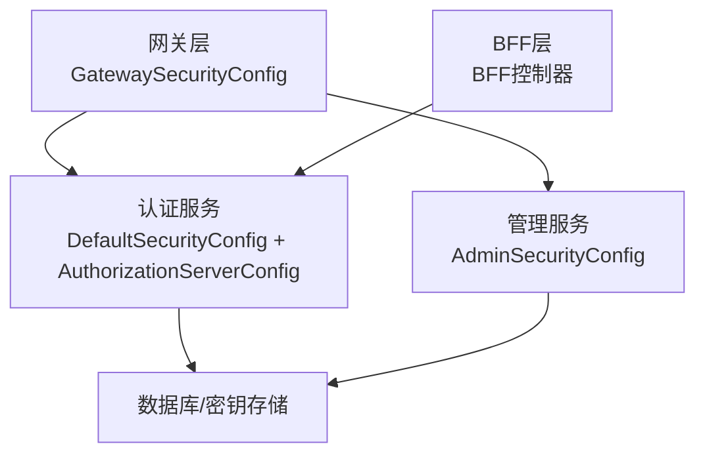
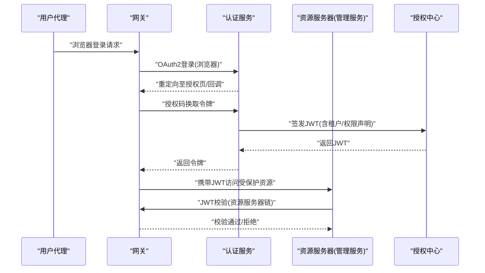
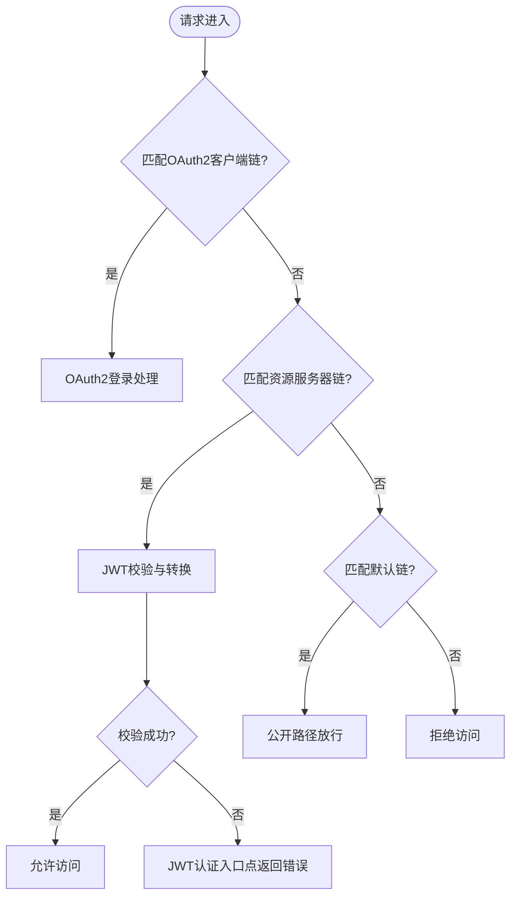
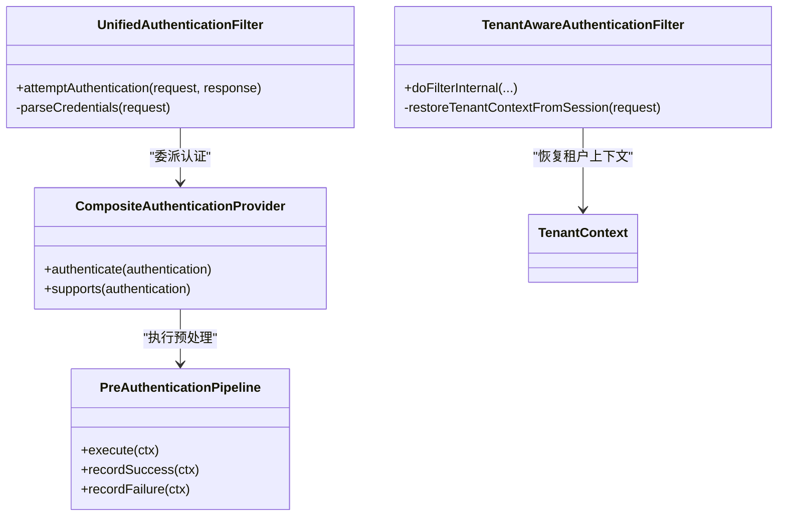
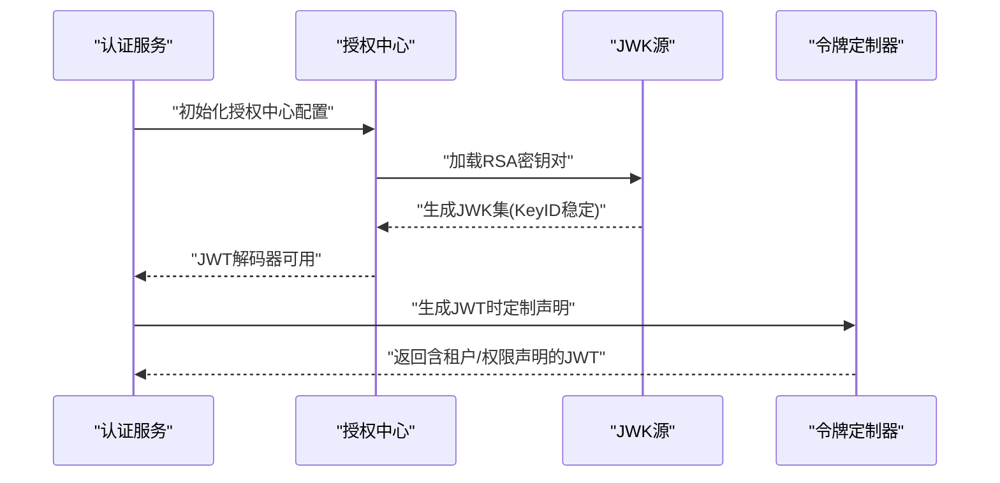
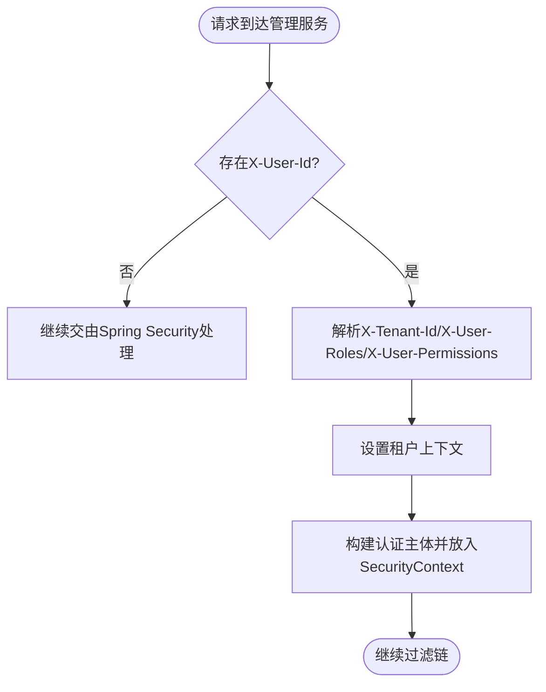
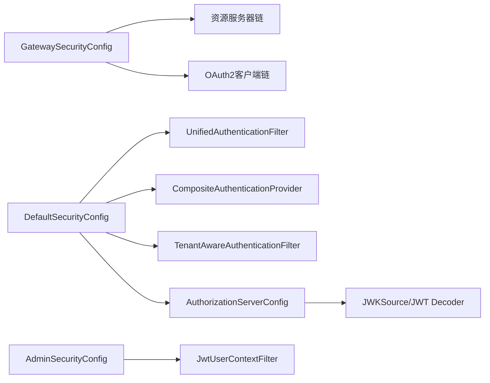

# 安全架构设计

<cite>
**本文引用的文件**
- [SsoAdminServerApplication.java](file://iam-admin-server/src/main/java/iam/platform/admin/SsoAdminServerApplication.java)
- [SsoAuthServerApplication.java](file://iam-auth-server/src/main/java/iam/platform/auth/SsoAuthServerApplication.java)
- [IamBffServerApplication.java](file://iam-bff-server/src/main/java/iam/platform/bff/IamBffServerApplication.java)
- [IamGatewayApplication.java](file://iam-gateway/src/main/java/iam/platform/gateway/IamGatewayApplication.java)
- [AdminSecurityConfig.java](file://iam-admin-server/src/main/java/iam/platform/admin/infrastructure/config/AdminSecurityConfig.java)
- [DefaultSecurityConfig.java](file://iam-auth-server/src/main/java/iam/platform/auth/infrastructure/config/DefaultSecurityConfig.java)
- [AuthorizationServerConfig.java](file://iam-auth-server/src/main/java/iam/platform/auth/infrastructure/config/AuthorizationServerConfig.java)
- [GatewaySecurityConfig.java](file://iam-gateway/src/main/java/iam/platform/gateway/infrastructure/security/GatewaySecurityConfig.java)
- [JwtUserContextFilter.java](file://iam-admin-server/src/main/java/iam/platform/admin/infrastructure/security/JwtUserContextFilter.java)
- [TenantAwareAuthenticationFilter.java](file://iam-auth-server/src/main/java/iam/platform/auth/infrastructure/security/TenantAwareAuthenticationFilter.java)
- [UnifiedAuthenticationFilter.java](file://iam-auth-server/src/main/java/iam/platform/auth/infrastructure/security/UnifiedAuthenticationFilter.java)
- [CompositeAuthenticationProvider.java](file://iam-auth-server/src/main/java/iam/platform/auth/infrastructure/security/CompositeAuthenticationProvider.java)
- [TokenCustomizer.java](file://iam-auth-server/src/main/java/iam/platform/auth/infrastructure/security/TokenCustomizer.java)
- [RegisteredClientRepositoryAdapter.java](file://iam-auth-server/src/main/java/iam/platform/auth/infrastructure/security/RegisteredClientRepositoryAdapter.java)
- [EncryptedStringConverter.java](file://iam-admin-server/src/main/java/iam/platform/admin/infrastructure/persistence/converter/EncryptedStringConverter.java)
- [EncryptionProperties.java](file://iam-admin-server/src/main/java/iam/platform/admin/infrastructure/config/EncryptionProperties.java)
</cite>

## 目录
1. [引言](#引言)
2. [项目结构](#项目结构)
3. [核心组件](#核心组件)
4. [架构总览](#架构总览)
5. [详细组件分析](#详细组件分析)
6. [依赖分析](#依赖分析)
7. [性能考虑](#性能考虑)
8. [故障排查指南](#故障排查指南)
9. [结论](#结论)
10. [附录](#附录)

## 引言
本文件面向IAM平台的安全架构设计，围绕“认证安全、授权控制、数据加密与传输安全”等维度，系统梳理多层安全防护体系。重点覆盖OAuth2/OIDC协议在本项目中的实现要点（令牌管理、会话控制、CSRF防护策略）、多租户场景下的安全隔离机制（租户间数据隔离与权限控制）、加密机制（密码加密、敏感数据加密、通信加密）、安全配置最佳实践（安全头、CORS与安全过滤器）、安全审计与监控、以及安全漏洞防护与应急响应策略。

## 项目结构
IAM平台采用多服务分层架构：网关层负责统一入口与资源服务器校验；认证服务负责身份认证与授权中心；BFF层提供前端友好的会话与协议适配；管理服务负责后台治理与审计；各模块均内置独立的安全配置与过滤链，形成“网关鉴权+服务内控”的纵深防御。

图表来源
- [GatewaySecurityConfig.java:28-73](file://iam-gateway/src/main/java/iam/platform/gateway/infrastructure/security/GatewaySecurityConfig.java#L28-L73)
- [DefaultSecurityConfig.java:35-63](file://iam-auth-server/src/main/java/iam/platform/auth/infrastructure/config/DefaultSecurityConfig.java#L35-L63)
- [AuthorizationServerConfig.java:44-64](file://iam-auth-server/src/main/java/iam/platform/auth/infrastructure/config/AuthorizationServerConfig.java#L44-L64)
- [AdminSecurityConfig.java:18-34](file://iam-admin-server/src/main/java/iam/platform/admin/infrastructure/config/AdminSecurityConfig.java#L18-L34)

章节来源
- [SsoAdminServerApplication.java:8-16](file://iam-admin-server/src/main/java/iam/platform/admin/SsoAdminServerApplication.java#L8-L16)
- [SsoAuthServerApplication.java:9-18](file://iam-auth-server/src/main/java/iam/platform/auth/SsoAuthServerApplication.java#L9-L18)
- [IamBffServerApplication.java:8-16](file://iam-bff-server/src/main/java/iam/platform/bff/IamBffServerApplication.java#L8-L16)
- [IamGatewayApplication.java:7-9](file://iam-gateway/src/main/java/iam/platform/gateway/IamGatewayApplication.java#L7-L9)

## 核心组件
- 网关安全链：区分OAuth2客户端链、资源服务器链与默认链，统一处理浏览器登录、JWT校验与公开路径放行，并通过自定义认证入口点返回标准化错误。
- 认证服务安全链：统一封装表单登录与OAuth2登录，替换默认过滤器，引入统一认证过滤器与租户感知过滤器，结合预/后置认证流水线实现多因子与策略化认证。
- 授权中心：基于Spring Authorization Server，启用OIDC默认配置，加载JWK源与JWT解码器，注入租户感知过滤器，支持动态客户端注册适配与令牌定制。
- 管理服务安全链：无状态会话策略，禁用CSRF，通过网关透传的用户上下文头建立认证主体，结合权限注解与切面进行访问控制。
- 加密与密钥：客户端密钥采用AES-256-GCM加密存储，密钥长度校验与优雅降级；JWK采用RSA密钥对，KeyID基于公钥指纹稳定生成，保障JWKS缓存一致性。

章节来源
- [GatewaySecurityConfig.java:28-131](file://iam-gateway/src/main/java/iam/platform/gateway/infrastructure/security/GatewaySecurityConfig.java#L28-L131)
- [DefaultSecurityConfig.java:35-94](file://iam-auth-server/src/main/java/iam/platform/auth/infrastructure/config/DefaultSecurityConfig.java#L35-L94)
- [AuthorizationServerConfig.java:44-130](file://iam-auth-server/src/main/java/iam/platform/auth/infrastructure/config/AuthorizationServerConfig.java#L44-L130)
- [AdminSecurityConfig.java:18-40](file://iam-admin-server/src/main/java/iam/platform/admin/infrastructure/config/AdminSecurityConfig.java#L18-L40)
- [EncryptedStringConverter.java:25-108](file://iam-admin-server/src/main/java/iam/platform/admin/infrastructure/persistence/converter/EncryptedStringConverter.java#L25-L108)

## 架构总览
下图展示了从网关到认证服务再到管理服务的端到端安全流，涵盖OAuth2/OIDC令牌发放、JWT校验、租户上下文传递与权限声明注入。

图表来源
- [GatewaySecurityConfig.java:28-59](file://iam-gateway/src/main/java/iam/platform/gateway/infrastructure/security/GatewaySecurityConfig.java#L28-L59)
- [DefaultSecurityConfig.java:39-62](file://iam-auth-server/src/main/java/iam/platform/auth/infrastructure/config/DefaultSecurityConfig.java#L39-L62)
- [AuthorizationServerConfig.java:44-64](file://iam-auth-server/src/main/java/iam/platform/auth/infrastructure/config/AuthorizationServerConfig.java#L44-L64)
- [TokenCustomizer.java:33-61](file://iam-auth-server/src/main/java/iam/platform/auth/infrastructure/security/TokenCustomizer.java#L33-L61)

## 详细组件分析

### 网关安全链与资源服务器校验
- 分层设计：OAuth2客户端链（浏览器登录流程）、资源服务器链（JWT校验）、默认链（公开路径放行）。
- 认证入口点：自定义JWT认证入口点，统一返回JSON错误响应，按异常类型分类错误类型（过期、签名无效、发行者无效、缺失令牌等）。
- CSRF策略：在上述链路中显式禁用CSRF，配合无状态令牌模型与同源策略降低风险。

图表来源
- [GatewaySecurityConfig.java:28-131](file://iam-gateway/src/main/java/iam/platform/gateway/infrastructure/security/GatewaySecurityConfig.java#L28-L131)

章节来源
- [GatewaySecurityConfig.java:28-131](file://iam-gateway/src/main/java/iam/platform/gateway/infrastructure/security/GatewaySecurityConfig.java#L28-L131)

### 认证服务安全链与统一认证
- 统一登录入口：通过统一认证过滤器接收多种认证方式（密码、短信验证码、邮箱验证码、LDAP），解析隐藏method参数选择策略。
- 认证策略委派：复合认证提供者根据凭证类型选择对应策略，执行预认证流水线（IP白名单、速率限制、账户状态验证、审计记录等），再调用具体策略完成认证。
- 租户上下文恢复：登录后将租户ID/账号ID写入会话，后续请求由租户感知过滤器恢复上下文，确保后续业务逻辑的多租户隔离。

图表来源
- [UnifiedAuthenticationFilter.java:18-79](file://iam-auth-server/src/main/java/iam/platform/auth/infrastructure/security/UnifiedAuthenticationFilter.java#L18-L79)
- [CompositeAuthenticationProvider.java:24-75](file://iam-auth-server/src/main/java/iam/platform/auth/infrastructure/security/CompositeAuthenticationProvider.java#L24-L75)
- [TenantAwareAuthenticationFilter.java:21-67](file://iam-auth-server/src/main/java/iam/platform/auth/infrastructure/security/TenantAwareAuthenticationFilter.java#L21-L67)

章节来源
- [DefaultSecurityConfig.java:35-94](file://iam-auth-server/src/main/java/iam/platform/auth/infrastructure/config/DefaultSecurityConfig.java#L35-L94)
- [UnifiedAuthenticationFilter.java:18-79](file://iam-auth-server/src/main/java/iam/platform/auth/infrastructure/security/UnifiedAuthenticationFilter.java#L18-L79)
- [CompositeAuthenticationProvider.java:24-75](file://iam-auth-server/src/main/java/iam/platform/auth/infrastructure/security/CompositeAuthenticationProvider.java#L24-L75)
- [TenantAwareAuthenticationFilter.java:21-67](file://iam-auth-server/src/main/java/iam/platform/auth/infrastructure/security/TenantAwareAuthenticationFilter.java#L21-L67)

### 授权中心与令牌定制
- 授权中心配置：启用OAuth2默认安全与OIDC配置，设置HTML登录入口点，接入JWT资源服务器，注入租户感知过滤器。
- JWK与JWT解码：从资源文件加载RSA私钥/公钥，生成JWK集，KeyID基于公钥SHA-256指纹的前128位，保证重启后KeyID稳定，避免客户端JWKS缓存失效。
- 令牌定制：向JWT添加用户基础信息与多租户上下文（当前租户ID/账号ID/编码、角色列表、权限集合），或在未选择租户时提供可选租户账号清单，便于客户端引导选择。

图表来源
- [AuthorizationServerConfig.java:44-99](file://iam-auth-server/src/main/java/iam/platform/auth/infrastructure/config/AuthorizationServerConfig.java#L44-L99)
- [TokenCustomizer.java:33-125](file://iam-auth-server/src/main/java/iam/platform/auth/infrastructure/security/TokenCustomizer.java#L33-L125)

章节来源
- [AuthorizationServerConfig.java:44-130](file://iam-auth-server/src/main/java/iam/platform/auth/infrastructure/config/AuthorizationServerConfig.java#L44-L130)
- [TokenCustomizer.java:25-127](file://iam-auth-server/src/main/java/iam/platform/auth/infrastructure/security/TokenCustomizer.java#L25-L127)

### 管理服务安全与租户上下文透传
- 无状态策略：禁用会话状态，通过网关透传的用户上下文头（用户ID、租户ID、角色、权限）重建认证主体。
- 权限解析：从头中解析JSON数组格式的角色与权限，构造授权实体，若为空则回退为普通用户角色。
- 租户上下文：从头中提取租户ID并设置到当前线程上下文，确保后续业务操作按租户隔离。

图表来源
- [JwtUserContextFilter.java:27-86](file://iam-admin-server/src/main/java/iam/platform/admin/infrastructure/security/JwtUserContextFilter.java#L27-L86)

章节来源
- [AdminSecurityConfig.java:18-34](file://iam-admin-server/src/main/java/iam/platform/admin/infrastructure/config/AdminSecurityConfig.java#L18-L34)
- [JwtUserContextFilter.java:27-86](file://iam-admin-server/src/main/java/iam/platform/admin/infrastructure/security/JwtUserContextFilter.java#L27-L86)

### 多租户安全隔离机制
- 数据隔离：租户ID/账号ID在登录后写入会话并在后续请求中恢复，所有业务查询与变更均基于当前租户上下文进行过滤，确保跨租户数据不可见。
- 权限控制：令牌定制器在JWT中注入当前租户的角色与权限集合；当未选择租户时，提供可选租户账号清单，客户端引导用户选择，避免越权访问。
- 会话控制：租户感知过滤器在请求结束时清理线程上下文，防止内存泄漏与上下文串扰。

章节来源
- [TenantAwareAuthenticationFilter.java:21-67](file://iam-auth-server/src/main/java/iam/platform/auth/infrastructure/security/TenantAwareAuthenticationFilter.java#L21-L67)
- [TokenCustomizer.java:63-125](file://iam-auth-server/src/main/java/iam/platform/auth/infrastructure/security/TokenCustomizer.java#L63-L125)

### 加密机制与密钥管理
- 客户端密钥加密：使用AES-256-GCM对称加密存储客户端密钥，转换器在持久化前加密、读取时解密；密钥长度校验失败时记录警告并优雅降级。
- 通信加密：授权中心使用RSA密钥对生成JWK集，KeyID基于公钥指纹稳定生成，保障JWKS缓存稳定性；客户端与服务端通过HTTPS传输令牌。
- 密码加密：服务端使用BCrypt进行密码编码与校验，符合安全最佳实践。

章节来源
- [EncryptedStringConverter.java:25-108](file://iam-admin-server/src/main/java/iam/platform/admin/infrastructure/persistence/converter/EncryptedStringConverter.java#L25-L108)
- [EncryptionProperties.java:12-14](file://iam-admin-server/src/main/java/iam/platform/admin/infrastructure/config/EncryptionProperties.java#L12-L14)
- [AuthorizationServerConfig.java:67-99](file://iam-auth-server/src/main/java/iam/platform/auth/infrastructure/config/AuthorizationServerConfig.java#L67-L99)
- [DefaultSecurityConfig.java:90-94](file://iam-auth-server/src/main/java/iam/platform/auth/infrastructure/config/DefaultSecurityConfig.java#L90-L94)
- [AdminSecurityConfig.java:36-40](file://iam-admin-server/src/main/java/iam/platform/admin/infrastructure/config/AdminSecurityConfig.java#L36-L40)

### OAuth2/OIDC协议实现与CSRF防护
- 协议实现：启用OIDC默认配置，授权中心与资源服务器链路完整；客户端注册适配器支持动态客户端配置与令牌生命周期设置。
- 令牌管理：令牌定制器在JWT中注入多租户上下文与权限声明，支持一次性选择租户或在客户端引导选择。
- CSRF防护：在网关与各服务的安全链中显式禁用CSRF，配合无状态令牌模型与同源策略，降低CSRF风险。

章节来源
- [AuthorizationServerConfig.java:44-64](file://iam-auth-server/src/main/java/iam/platform/auth/infrastructure/config/AuthorizationServerConfig.java#L44-L64)
- [DefaultSecurityConfig.java:39-62](file://iam-auth-server/src/main/java/iam/platform/auth/infrastructure/config/DefaultSecurityConfig.java#L39-L62)
- [GatewaySecurityConfig.java:36-38](file://iam-gateway/src/main/java/iam/platform/gateway/infrastructure/security/GatewaySecurityConfig.java#L36-L38)
- [TokenCustomizer.java:33-125](file://iam-auth-server/src/main/java/iam/platform/auth/infrastructure/security/TokenCustomizer.java#L33-L125)

### 安全配置最佳实践
- 安全头与CORS：建议在网关与服务侧统一设置安全响应头（如X-Content-Type-Options、X-Frame-Options、Referrer-Policy等），并结合CORS策略仅开放必要域名与方法。
- 过滤器使用：优先使用Spring Security提供的过滤链与WebFlux安全链，避免自定义绕过默认安全约束；在需要时通过过滤器链注入租户上下文与统一认证。
- 令牌与会话：生产环境禁用CSRF（无状态令牌模型）；严格控制令牌有效期与刷新策略；对敏感接口启用细粒度权限控制与审计。

章节来源
- [GatewaySecurityConfig.java:28-73](file://iam-gateway/src/main/java/iam/platform/gateway/infrastructure/security/GatewaySecurityConfig.java#L28-L73)
- [DefaultSecurityConfig.java:35-63](file://iam-auth-server/src/main/java/iam/platform/auth/infrastructure/config/DefaultSecurityConfig.java#L35-L63)
- [AdminSecurityConfig.java:18-34](file://iam-admin-server/src/main/java/iam/platform/admin/infrastructure/config/AdminSecurityConfig.java#L18-L34)

### 安全审计与监控
- 审计事件：通过切面与事件监听捕获关键安全事件（登录、登出、权限变更、账户锁定等），并封装为审计日志实体持久化。
- 上下文构建：审计上下文构建器收集请求来源、用户标识、租户信息与操作详情，确保审计可追溯。
- 监控指标：建议结合网关与服务侧的访问日志与指标（认证成功率、令牌校验失败率、异常堆栈统计）进行实时告警。

章节来源
- [AuditLogAssembler.java](file://iam-admin-server/src/main/java/iam/platform/admin/application/assembler/AuditLogAssembler.java)
- [AuditLogEvent.java](file://iam-admin-server/src/main/java/iam/platform/admin/application/event/AuditLogEvent.java)
- [AuditLogEventListener.java](file://iam-admin-server/src/main/java/iam/platform/admin/application/event/AuditLogEventListener.java)
- [AuditLogContext.java](file://iam-admin-server/src/main/java/iam/platform/admin/infrastructure/aspect/AuditLogContext.java)
- [AuditLogContextBuilder.java](file://iam-admin-server/src/main/java/iam/platform/admin/infrastructure/aspect/AuditLogContextBuilder.java)

### 安全漏洞防护与应急响应
- 账户安全：预认证流水线包含IP白名单、速率限制、账户状态验证与登录记录，有效缓解暴力破解与滥用风险。
- 客户端密钥：采用AES-256-GCM加密存储，密钥长度校验失败时记录警告并优雅降级，避免因配置错误导致明文泄露。
- 应急响应：建议建立快速处置流程（令牌吊销、密钥轮换、IP封禁、账户冻结）与演练机制，结合审计日志与监控告警实现闭环。

章节来源
- [AccountLockoutHandler.java](file://iam-auth-server/src/main/java/iam/platform/auth/application/service/pipeline/AccountLockoutHandler.java)
- [IpWhitelistHandler.java](file://iam-auth-server/src/main/java/iam/platform/auth/application/service/pipeline/IpWhitelistHandler.java)
- [RateLimitHandler.java](file://iam-auth-server/src/main/java/iam/platform/auth/application/service/pipeline/RateLimitHandler.java)
- [EncryptedStringConverter.java:25-41](file://iam-admin-server/src/main/java/iam/platform/admin/infrastructure/persistence/converter/EncryptedStringConverter.java#L25-L41)

## 依赖分析
- 组件耦合：认证服务通过复合提供者与预/后置流水线实现高内聚低耦合；网关与管理服务分别承担入口与无状态鉴权职责，彼此通过令牌与上下文头交互。
- 外部依赖：Spring Authorization Server、Spring Security Web/MVC/WebFlux、JWK库与BCrypt密码编码器；密钥与证书通过资源文件加载。

图表来源
- [GatewaySecurityConfig.java:28-73](file://iam-gateway/src/main/java/iam/platform/gateway/infrastructure/security/GatewaySecurityConfig.java#L28-L73)
- [DefaultSecurityConfig.java:35-63](file://iam-auth-server/src/main/java/iam/platform/auth/infrastructure/config/DefaultSecurityConfig.java#L35-L63)
- [AuthorizationServerConfig.java:44-64](file://iam-auth-server/src/main/java/iam/platform/auth/infrastructure/config/AuthorizationServerConfig.java#L44-L64)
- [AdminSecurityConfig.java:18-34](file://iam-admin-server/src/main/java/iam/platform/admin/infrastructure/config/AdminSecurityConfig.java#L18-L34)

## 性能考虑
- 令牌定制成本：令牌定制器需查询用户与租户账号信息，建议在高并发场景下对常用字段进行缓存或延迟加载，避免阻塞令牌生成。
- JWK缓存：KeyID基于公钥指纹稳定生成，可减少客户端JWKS频繁更新带来的开销。
- 过滤链顺序：合理安排过滤器顺序，减少重复鉴权与上下文切换，提升整体吞吐。

## 故障排查指南
- JWT校验失败：检查网关资源服务器链是否正确配置JWT转换器与认证入口点，确认错误分类与响应体格式。
- 登录失败：检查统一认证过滤器参数解析、复合认证提供者的策略匹配与预认证流水线记录，定位具体失败环节。
- 租户上下文丢失：确认租户感知过滤器在登录后正确写入会话并在后续请求中恢复，注意请求结束后清理线程上下文。
- 客户端密钥异常：检查加密转换器的密钥长度校验与异常日志，确保密钥配置正确且满足AES-256要求。

章节来源
- [GatewaySecurityConfig.java:78-129](file://iam-gateway/src/main/java/iam/platform/gateway/infrastructure/security/GatewaySecurityConfig.java#L78-L129)
- [DefaultSecurityConfig.java:66-79](file://iam-auth-server/src/main/java/iam/platform/auth/infrastructure/config/DefaultSecurityConfig.java#L66-L79)
- [CompositeAuthenticationProvider.java:31-68](file://iam-auth-server/src/main/java/iam/platform/auth/infrastructure/security/CompositeAuthenticationProvider.java#L31-L68)
- [TenantAwareAuthenticationFilter.java:28-44](file://iam-auth-server/src/main/java/iam/platform/auth/infrastructure/security/TenantAwareAuthenticationFilter.java#L28-L44)
- [EncryptedStringConverter.java:33-41](file://iam-admin-server/src/main/java/iam/platform/admin/infrastructure/persistence/converter/EncryptedStringConverter.java#L33-L41)

## 结论
本IAM平台通过“网关统一入口+服务内控”的多层安全设计，实现了OAuth2/OIDC协议的规范落地、多租户场景下的强隔离与细粒度权限控制、敏感数据与通信加密的系统化方案，以及完善的审计与监控能力。建议在生产环境中进一步强化安全头策略、CORS白名单与密钥轮换流程，并持续完善应急响应与演练机制，以构建更稳健的零信任安全体系。

## 附录
- 客户端注册适配器：将应用实体映射为RegisteredClient，支持授权码与密码两种授权模式、回调地址与作用域配置、令牌生命周期设置与PKCE开关。
- 安全配置扫描：应用启动时扫描安全配置包，确保属性注入与Bean装配生效。

章节来源
- [RegisteredClientRepositoryAdapter.java:24-99](file://iam-auth-server/src/main/java/iam/platform/auth/infrastructure/security/RegisteredClientRepositoryAdapter.java#L24-L99)
- [SsoAdminServerApplication.java:9-10](file://iam-admin-server/src/main/java/iam/platform/admin/SsoAdminServerApplication.java#L9-L10)
- [SsoAuthServerApplication.java:10-12](file://iam-auth-server/src/main/java/iam/platform/auth/SsoAuthServerApplication.java#L10-L12)