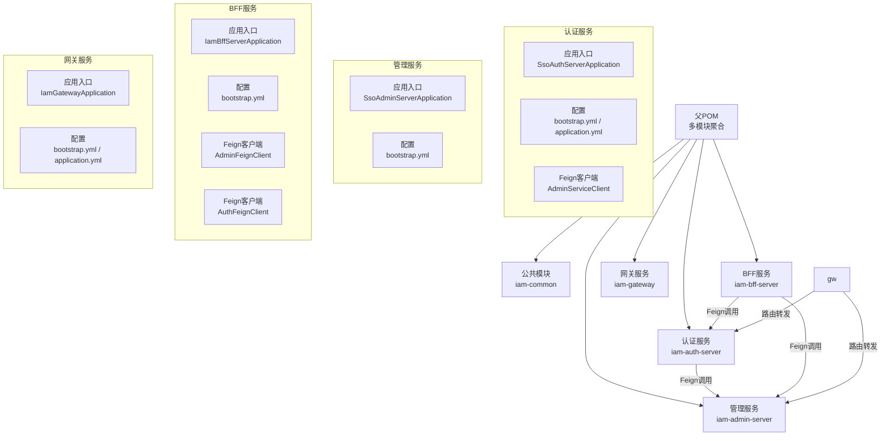
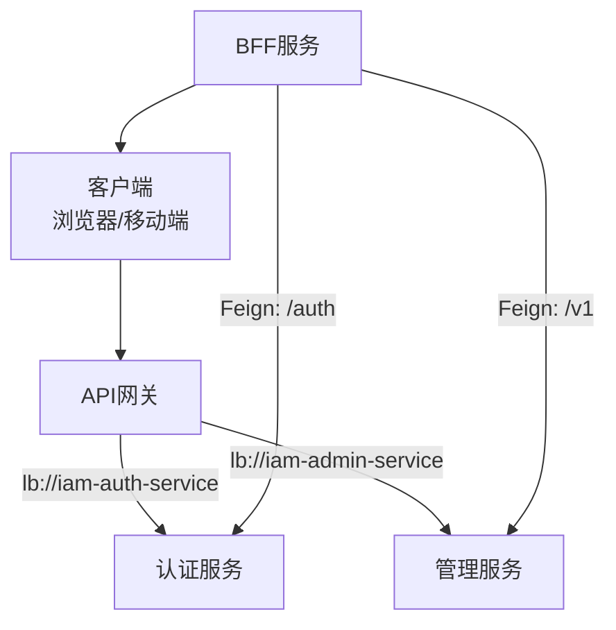
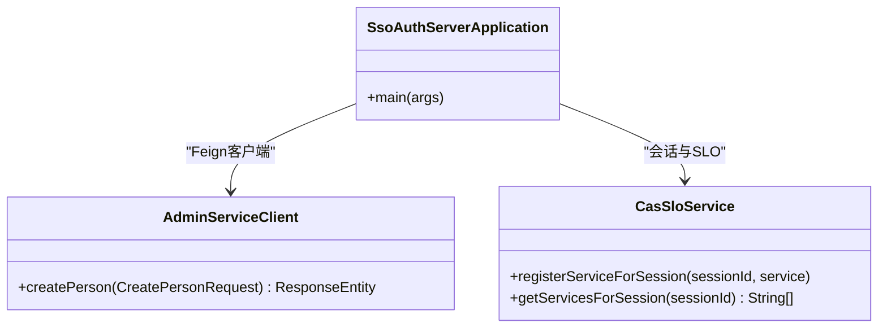
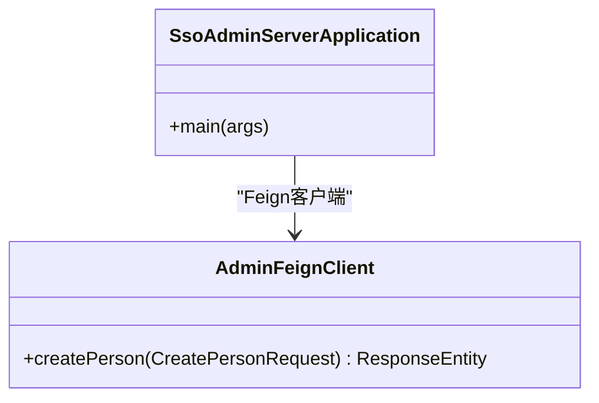
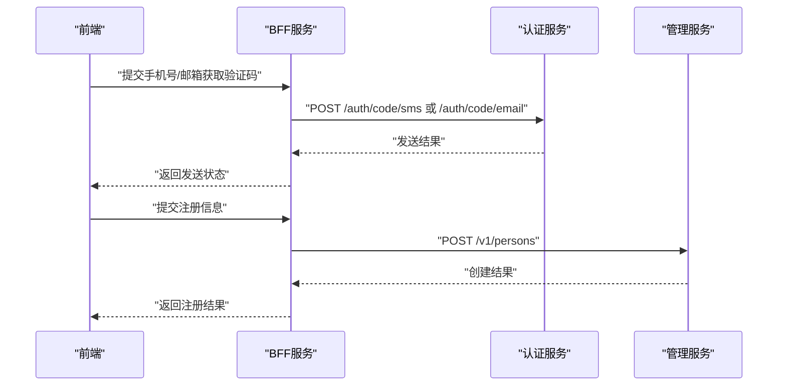
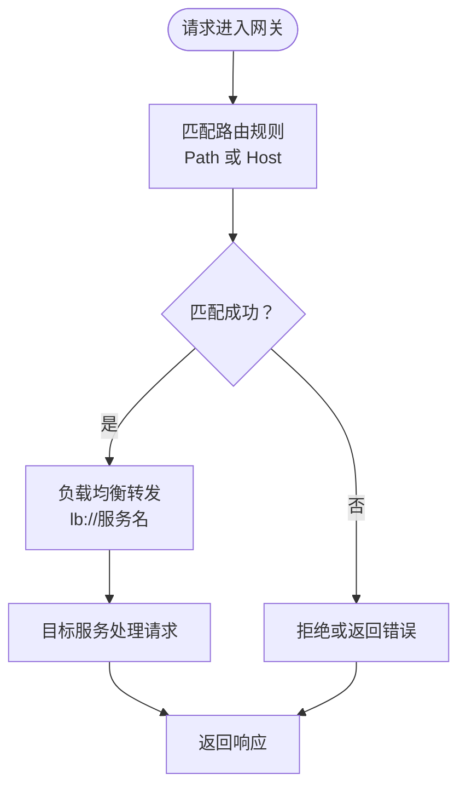
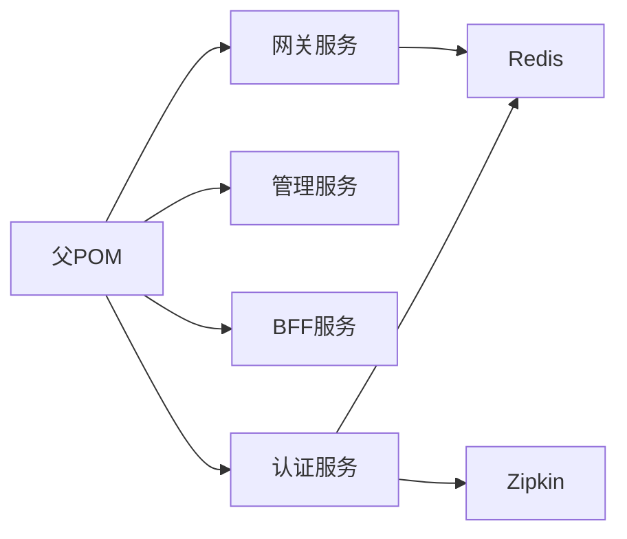

# 微服务架构设计

<cite>
**本文引用的文件**
- [SsoAuthServerApplication.java](file://iam-auth-server/src/main/java/iam/platform/auth/SsoAuthServerApplication.java)
- [SsoAdminServerApplication.java](file://iam-admin-server/src/main/java/iam/platform/admin/SsoAdminServerApplication.java)
- [IamBffServerApplication.java](file://iam-bff-server/src/main/java/iam/platform/bff/IamBffServerApplication.java)
- [IamGatewayApplication.java](file://iam-gateway/src/main/java/iam/platform/gateway/IamGatewayApplication.java)
- [pom.xml](file://pom.xml)
- [bootstrap.yml（认证服务）](file://iam-auth-server/bootstrap.yml)
- [application.yml（认证服务）](file://iam-auth-server/src/main/resources/application.yml)
- [bootstrap.yml（管理服务）](file://iam-admin-server/bootstrap.yml)
- [bootstrap.yml（BFF服务）](file://iam-bff-server/bootstrap.yml)
- [bootstrap.yml（网关）](file://iam-gateway/bootstrap.yml)
- [AdminFeignClient.java](file://iam-bff-server/src/main/java/iam/platform/bff/infrastructure/client/AdminFeignClient.java)
- [AuthFeignClient.java](file://iam-bff-server/src/main/java/iam/platform/bff/infrastructure/client/AuthFeignClient.java)
- [AdminServiceClient.java](file://iam-auth-server/src/main/java/iam/platform/auth/interfaces/client/AdminServiceClient.java)
- [application.yml（网关）](file://iam-gateway/src/main/resources/application.yml)
- [CasSloService.java](file://iam-auth-server/src/main/java/iam/platform/auth/application/service/CasSloService.java)
</cite>

## 目录
1. [引言](#引言)
2. [项目结构](#项目结构)
3. [核心组件](#核心组件)
4. [架构总览](#架构总览)
5. [详细组件分析](#详细组件分析)
6. [依赖分析](#依赖分析)
7. [性能考虑](#性能考虑)
8. [故障排查指南](#故障排查指南)
9. [结论](#结论)
10. [附录](#附录)

## 引言
本文件系统性阐述IAM平台的微服务架构设计，围绕认证服务器、管理服务器、BFF服务器与API网关四大核心服务模块，说明其职责边界、服务间通信机制（REST API、Feign客户端、服务发现与负载均衡）、数据一致性策略（分布式事务与最终一致性）、部署与监控方案，以及在实践中如何平衡微服务的优势与挑战，并总结最佳实践与故障处理策略。

## 项目结构
IAM平台采用多模块Maven聚合工程组织，包含公共模块与四个独立微服务模块：认证服务、管理服务、BFF服务、网关服务。父POM统一管理Spring Cloud与Spring Cloud Alibaba版本、依赖与构建插件，并通过profile支持多环境部署。

图表来源
- [pom.xml:21-27](file://pom.xml#L21-L27)
- [SsoAuthServerApplication.java:13-18](file://iam-auth-server/src/main/java/iam/platform/auth/SsoAuthServerApplication.java#L13-L18)
- [SsoAdminServerApplication.java:11-16](file://iam-admin-server/src/main/java/iam/platform/admin/SsoAdminServerApplication.java#L11-L16)
- [IamBffServerApplication.java:11-16](file://iam-bff-server/src/main/java/iam/platform/bff/IamBffServerApplication.java#L11-L16)
- [IamGatewayApplication.java:9-14](file://iam-gateway/src/main/java/iam/platform/gateway/IamGatewayApplication.java#L9-L14)

章节来源
- [pom.xml:21-27](file://pom.xml#L21-L27)

## 核心组件
- 认证服务器（iam-auth-server）
  - 职责：提供OIDC/SAML/CAS协议支持、用户认证、会话与票据管理、第三方登录对接、验证码发送等。
  - 关键特性：启用Feign客户端扫描、JPA仓库扫描、配置属性扫描；内置Redis用于会话与速率限制；支持Zipkin链路追踪。
- 管理服务器（iam-admin-server）
  - 职责：面向管理员的业务能力，如人员、组织、角色、权限、审计日志等管理接口。
  - 关键特性：启用JPA仓库扫描、配置属性扫描；通过Feign与认证服务交互。
- BFF服务器（iam-bff-server）
  - 职责：前端无状态或弱状态的“前端后端之耦合”层，聚合后端服务接口、封装协议差异、处理前端特定流程（注册、登录、同意页等）。
  - 关键特性：启用服务发现与Feign客户端；通过Feign调用认证与管理服务。
- API网关（iam-gateway）
  - 职责：统一入口、路由分发、鉴权与限流、跨域处理、全局安全策略。
  - 关键特性：基于路径与域名的路由规则；手动路由配置；全局CORS；Redis限流；资源服务器JWT校验。

章节来源
- [SsoAuthServerApplication.java:10-12](file://iam-auth-server/src/main/java/iam/platform/auth/SsoAuthServerApplication.java#L10-L12)
- [SsoAdminServerApplication.java:9-10](file://iam-admin-server/src/main/java/iam/platform/admin/SsoAdminServerApplication.java#L9-L10)
- [IamBffServerApplication.java:9-10](file://iam-bff-server/src/main/java/iam/platform/bff/IamBffServerApplication.java#L9-L10)
- [IamGatewayApplication.java:7-8](file://iam-gateway/src/main/java/iam/platform/gateway/IamGatewayApplication.java#L7-L8)

## 架构总览
IAM平台采用“网关+BFF+微服务”的分层架构：
- 网关负责统一入口与路由，结合Redis进行请求限流与跨域控制；
- BFF作为前后端协作的适配层，聚合认证与管理服务；
- 认证服务提供OIDC/SAML/CAS协议与会话票据能力；
- 管理服务提供后台管理能力并与认证服务协作。

图表来源
- [application.yml（网关）:18-54](file://iam-gateway/src/main/resources/application.yml#L18-L54)
- [bootstrap.yml（网关）:3-9](file://iam-gateway/bootstrap.yml#L3-L9)
- [bootstrap.yml（认证服务）:3-10](file://iam-auth-server/bootstrap.yml#L3-L10)
- [bootstrap.yml（管理服务）:3-10](file://iam-admin-server/bootstrap.yml#L3-L10)
- [bootstrap.yml（BFF服务）:3-10](file://iam-bff-server/bootstrap.yml#L3-L10)

## 详细组件分析

### 认证服务器（iam-auth-server）
- 应用入口与配置
  - 启用Feign客户端扫描、JPA仓库扫描、配置属性扫描，确保服务内聚与外部集成能力。
- 数据与安全
  - 使用PostgreSQL存储领域模型；Redis用于会话存储与速率限制；支持JWK密钥与加密配置；启用Zipkin链路追踪。
- 协议与会话
  - 支持OIDC、SAML、CAS协议；提供CAS单点注销（SLO）服务，使用Redis存储会话关联的服务列表，异常时回退到内存集合。
- 外部集成
  - 通过Feign客户端调用管理服务以完成自注册场景下的人员创建。

图表来源
- [SsoAuthServerApplication.java:13-18](file://iam-auth-server/src/main/java/iam/platform/auth/SsoAuthServerApplication.java#L13-L18)
- [AdminServiceClient.java:14-26](file://iam-auth-server/src/main/java/iam/platform/auth/interfaces/client/AdminServiceClient.java#L14-L26)
- [CasSloService.java:42-69](file://iam-auth-server/src/main/java/iam/platform/auth/application/service/CasSloService.java#L42-L69)

章节来源
- [SsoAuthServerApplication.java:10-12](file://iam-auth-server/src/main/java/iam/platform/auth/SsoAuthServerApplication.java#L10-L12)
- [application.yml（认证服务）:15-38](file://iam-auth-server/src/main/resources/application.yml#L15-L38)
- [application.yml（认证服务）:128-144](file://iam-auth-server/src/main/resources/application.yml#L128-L144)
- [AdminServiceClient.java:14-26](file://iam-auth-server/src/main/java/iam/platform/auth/interfaces/client/AdminServiceClient.java#L14-L26)
- [CasSloService.java:42-69](file://iam-auth-server/src/main/java/iam/platform/auth/application/service/CasSloService.java#L42-L69)

### 管理服务器（iam-admin-server）
- 应用入口与配置
  - 启用JPA仓库扫描与配置属性扫描，聚焦后台管理能力。
- 服务交互
  - 通过Feign客户端与认证服务交互，例如在自注册流程中创建人员实体。

图表来源
- [SsoAdminServerApplication.java:11-16](file://iam-admin-server/src/main/java/iam/platform/admin/SsoAdminServerApplication.java#L11-L16)
- [AdminFeignClient.java:13-25](file://iam-bff-server/src/main/java/iam/platform/bff/infrastructure/client/AdminFeignClient.java#L13-L25)

章节来源
- [SsoAdminServerApplication.java:9-10](file://iam-admin-server/src/main/java/iam/platform/admin/SsoAdminServerApplication.java#L9-L10)
- [AdminFeignClient.java:13-25](file://iam-bff-server/src/main/java/iam/platform/bff/infrastructure/client/AdminFeignClient.java#L13-L25)

### BFF服务器（iam-bff-server）
- 应用入口与配置
  - 启用服务发现与Feign客户端，面向前端提供聚合接口。
- 服务交互
  - 通过Feign客户端分别调用认证服务（发送短信/邮箱验证码）与管理服务（自注册创建人员）。

图表来源
- [IamBffServerApplication.java:9-10](file://iam-bff-server/src/main/java/iam/platform/bff/IamBffServerApplication.java#L9-L10)
- [AuthFeignClient.java:12-30](file://iam-bff-server/src/main/java/iam/platform/bff/infrastructure/client/AuthFeignClient.java#L12-L30)
- [AdminFeignClient.java:13-25](file://iam-bff-server/src/main/java/iam/platform/bff/infrastructure/client/AdminFeignClient.java#L13-L25)

章节来源
- [IamBffServerApplication.java:9-10](file://iam-bff-server/src/main/java/iam/platform/bff/IamBffServerApplication.java#L9-L10)
- [AuthFeignClient.java:12-30](file://iam-bff-server/src/main/java/iam/platform/bff/infrastructure/client/AuthFeignClient.java#L12-L30)
- [AdminFeignClient.java:13-25](file://iam-bff-server/src/main/java/iam/platform/bff/infrastructure/client/AdminFeignClient.java#L13-L25)

### API网关（iam-gateway）
- 路由与负载均衡
  - 基于路径与域名的路由规则，统一转发至认证与管理服务；使用lb://前缀配合服务发现与负载均衡。
- 安全与限流
  - 全局CORS配置；基于Redis的请求限流过滤器；资源服务器JWT校验；全局日志级别配置便于调试。
- 配置要点
  - 手动路由配置优于自动定位，便于精细化控制；暴露健康、指标、网关自身端点。

图表来源
- [application.yml（网关）:18-54](file://iam-gateway/src/main/resources/application.yml#L18-L54)
- [application.yml（网关）:55-68](file://iam-gateway/src/main/resources/application.yml#L55-L68)
- [application.yml（网关）:93-108](file://iam-gateway/src/main/resources/application.yml#L93-L108)

章节来源
- [application.yml（网关）:18-54](file://iam-gateway/src/main/resources/application.yml#L18-L54)
- [application.yml（网关）:55-68](file://iam-gateway/src/main/resources/application.yml#L55-L68)
- [application.yml（网关）:93-108](file://iam-gateway/src/main/resources/application.yml#L93-L108)

## 依赖分析
- 模块依赖
  - 父POM统一引入Spring Cloud与Spring Cloud Alibaba版本，确保各微服务依赖一致。
  - 认证服务引入Spring Authorization Server以支持OIDC协议。
- 运行时依赖
  - 认证服务与网关均依赖Redis用于会话与限流；认证服务配置Zipkin链路追踪。
- 服务发现与配置中心
  - 四个服务均通过bootstrap.yml配置Nacos服务发现与命名空间，便于多环境隔离。

图表来源
- [pom.xml:43-62](file://pom.xml#L43-L62)
- [application.yml（认证服务）:34-37](file://iam-auth-server/src/main/resources/application.yml#L34-L37)
- [application.yml（网关）:84-88](file://iam-gateway/src/main/resources/application.yml#L84-L88)
- [application.yml（认证服务）:139-143](file://iam-auth-server/src/main/resources/application.yml#L139-L143)

章节来源
- [pom.xml:43-62](file://pom.xml#L43-L62)
- [bootstrap.yml（认证服务）:3-10](file://iam-auth-server/bootstrap.yml#L3-L10)
- [bootstrap.yml（管理服务）:3-10](file://iam-admin-server/bootstrap.yml#L3-L10)
- [bootstrap.yml（BFF服务）:3-10](file://iam-bff-server/bootstrap.yml#L3-L10)
- [bootstrap.yml（网关）:3-10](file://iam-gateway/bootstrap.yml#L3-L10)

## 性能考虑
- 服务发现与负载均衡
  - 网关与BFF侧均启用服务发现，结合lb://前缀实现客户端负载均衡，降低单点压力。
- 限流与降载
  - 网关使用Redis限流过滤器对不同路由设置不同的补充速率与突发容量，避免热点接口被压垮。
- 缓存与会话
  - 认证服务使用Redis存储会话与速率限制，提升高并发下的响应速度。
- 链路追踪
  - 认证服务启用Zipkin，便于定位慢调用与跨服务延迟瓶颈。

章节来源
- [application.yml（网关）:24-41](file://iam-gateway/src/main/resources/application.yml#L24-L41)
- [application.yml（认证服务）:34-52](file://iam-auth-server/src/main/resources/application.yml#L34-L52)
- [application.yml（认证服务）:139-143](file://iam-auth-server/src/main/resources/application.yml#L139-L143)

## 故障排查指南
- 服务发现与连通性
  - 检查bootstrap.yml中的Nacos地址与命名空间是否正确；确认服务已注册到Nacos且健康检查通过。
- 路由与负载均衡
  - 网关路由未命中时，确认Path或Host谓词是否匹配；检查lb://服务名是否与服务实际名称一致。
- 限流与熔断
  - 若出现大量429/503，检查Redis限流配置与Redis可用性；评估突发流量阈值是否合理。
- 会话与CAS SLO
  - CAS单点注销失败时，关注Redis不可用回退逻辑；检查会话注册与过期时间配置。
- 链路追踪
  - 若Zipkin无法收集数据，检查Zipkin端点配置与采样概率。

章节来源
- [bootstrap.yml（网关）:3-10](file://iam-gateway/bootstrap.yml#L3-L10)
- [application.yml（网关）:18-54](file://iam-gateway/src/main/resources/application.yml#L18-L54)
- [application.yml（认证服务）:139-143](file://iam-auth-server/src/main/resources/application.yml#L139-L143)
- [CasSloService.java:42-69](file://iam-auth-server/src/main/java/iam/platform/auth/application/service/CasSloService.java#L42-L69)

## 结论
IAM平台通过“网关+BFF+微服务”的架构实现了清晰的职责边界与可演进的扩展能力。认证与管理服务解耦，BFF聚合前后端交互，网关统一治理与安全控制。结合服务发现、负载均衡、Redis限流与Zipkin链路追踪，平台在性能与可观测性方面具备良好基础。后续可在分布式事务与最终一致性策略上进一步完善，以支撑更复杂的业务一致性需求。

## 附录
- 最佳实践建议
  - 明确服务边界与契约，优先使用异步与事件驱动降低耦合。
  - 在网关层统一接入鉴权与限流，减少重复实现。
  - 对关键链路开启链路追踪与指标采集，建立告警与根因分析机制。
  - 使用配置文件与环境变量分离敏感信息，结合密文存储与最小权限原则。
- 数据一致性策略
  - 分布式事务：对强一致场景采用Saga或TCC模式，对最终一致性场景通过事件驱动与补偿机制保障。
  - 幂等设计：对外部接口调用与关键写操作增加幂等键，避免重复执行。
  - 本地消息表/事件溯源：在跨服务写入时保证至少一次投递与消费幂等。
- 部署与监控
  - 使用容器化与编排工具（如Kubernetes）实现弹性伸缩与蓝绿/金丝雀发布。
  - 通过Prometheus/Grafana与日志体系构建全栈可观测性。
  - 为每个服务配置独立的健康检查、指标暴露与日志输出，便于快速定位问题。