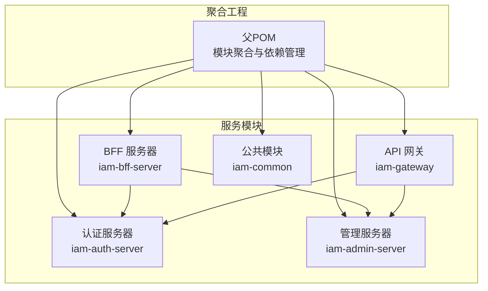
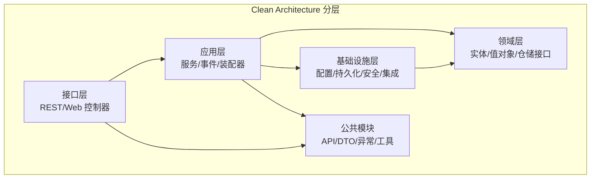
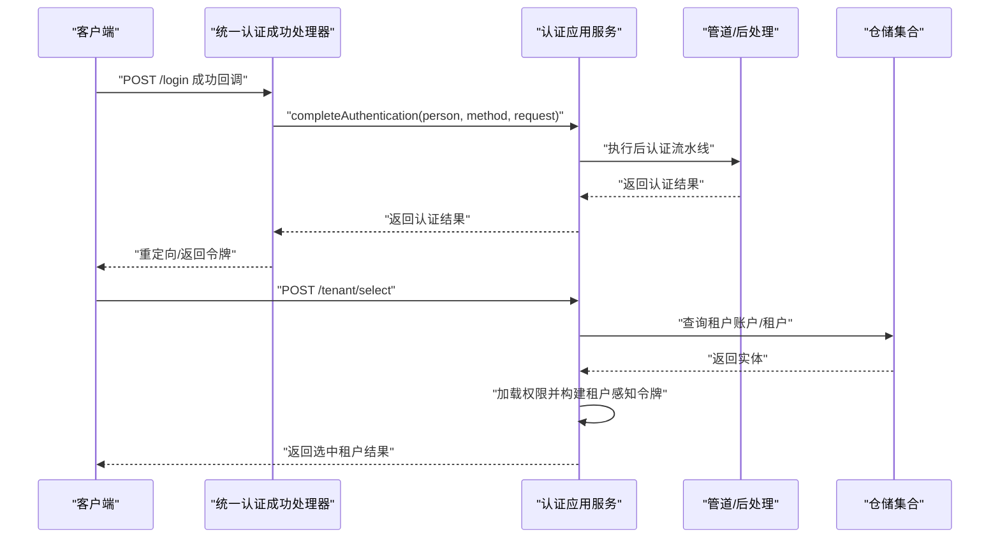
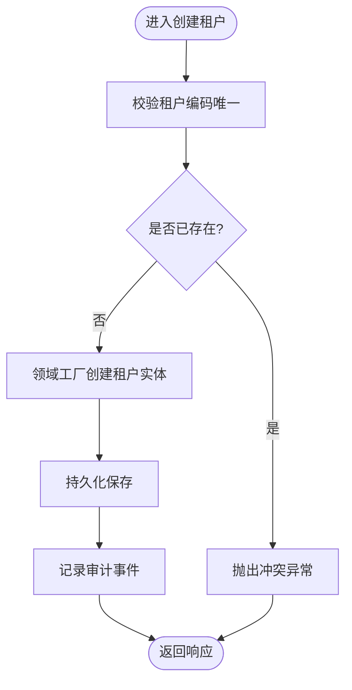
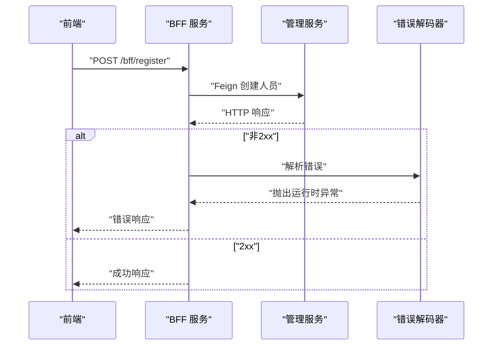
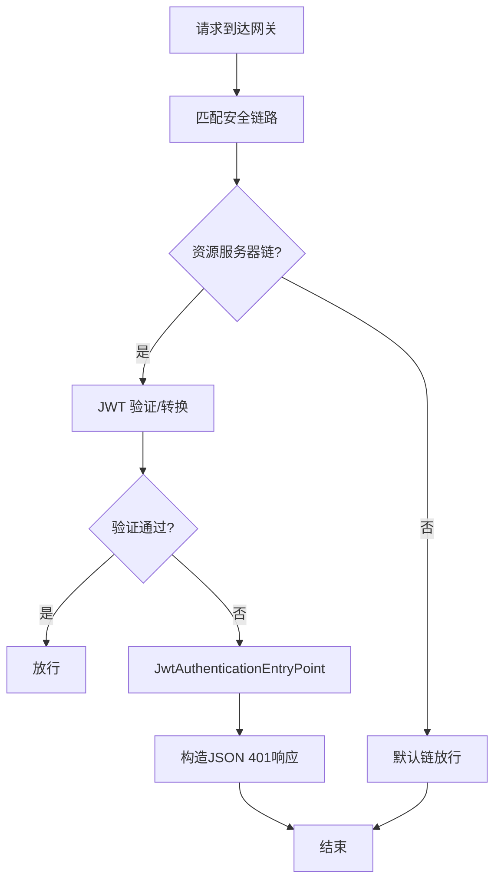
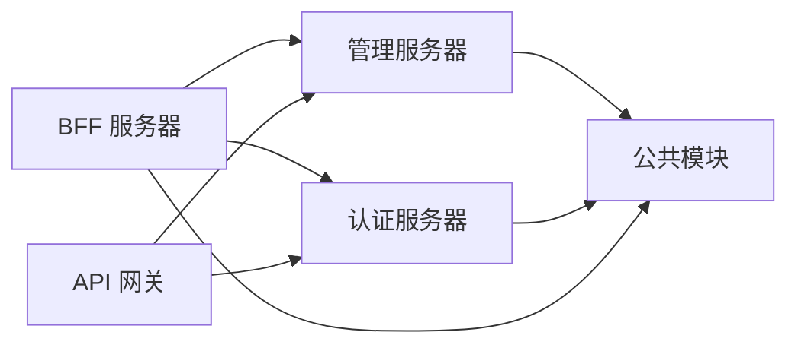

# 架构概览

<cite>
**本文引用的文件**
- [README.md](file://README.md)
- [pom.xml](file://pom.xml)
- [SsoAdminServerApplication.java](file://iam-admin-server/src/main/java/iam/platform/admin/SsoAdminServerApplication.java)
- [SsoAuthServerApplication.java](file://iam-auth-server/src/main/java/iam/platform/auth/SsoAuthServerApplication.java)
- [IamBffServerApplication.java](file://iam-bff-server/src/main/java/iam/platform/bff/IamBffServerApplication.java)
- [IamGatewayApplication.java](file://iam-gateway/src/main/java/iam/platform/gateway/IamGatewayApplication.java)
- [Application.java](file://iam-admin-server/src/main/java/iam/platform/admin/domain/model/entity/Application.java)
- [Person.java](file://iam-auth-server/src/main/java/iam/platform/auth/domain/model/entity/Person.java)
- [CreatePersonRequest.java](file://iam-common/src/main/java/iam/platform/common/dto/request/CreatePersonRequest.java)
- [TenantApplicationService.java](file://iam-admin-server/src/main/java/iam/platform/admin/application/service/TenantApplicationService.java)
- [AuthenticationApplicationService.java](file://iam-auth-server/src/main/java/iam/platform/auth/application/service/AuthenticationApplicationService.java)
- [BffRegistrationService.java](file://iam-bff-server/src/main/java/iam/platform/bff/application/service/BffRegistrationService.java)
- [AdminSecurityConfig.java](file://iam-admin-server/src/main/java/iam/platform/admin/infrastructure/config/AdminSecurityConfig.java)
- [AuthorizationServerConfig.java](file://iam-auth-server/src/main/java/iam/platform/auth/infrastructure/config/AuthorizationServerConfig.java)
- [FeignClientConfig.java](file://iam-bff-server/src/main/java/iam/platform/bff/infrastructure/config/FeignClientConfig.java)
- [GatewaySecurityConfig.java](file://iam-gateway/src/main/java/iam/platform/gateway/infrastructure/security/GatewaySecurityConfig.java)
- [TenantRepository.java](file://iam-admin-server/src/main/java/iam/platform/admin/domain/repository/TenantRepository.java)
- [PersonRepository.java](file://iam-auth-server/src/main/java/iam/platform/auth/domain/repository/PersonRepository.java)
</cite>

## 目录
1. [简介](#简介)
2. [项目结构](#项目结构)
3. [核心组件](#核心组件)
4. [架构总览](#架构总览)
5. [详细组件分析](#详细组件分析)
6. [依赖分析](#依赖分析)
7. [性能考量](#性能考量)
8. [故障排查指南](#故障排查指南)
9. [结论](#结论)
10. [附录](#附录)

## 简介
本项目是一个基于 Spring Boot 3 的微服务身份认证与权限管理平台，采用 Clean Architecture（整洁架构）与 Domain-Driven Design（领域驱动设计）相结合的方式组织代码，围绕认证服务器、管理服务器、BFF 服务器与 API 网关四大核心组件构建统一身份认证与授权体系。系统遵循关注点分离、依赖倒置与领域驱动原则，强调业务领域模型的内聚性与稳定性，并通过分层解耦实现横切关注点的可插拔。

在安全方面，系统以 Spring Authorization Server 作为 OIDC Provider，提供标准的授权码（含 PKCE）、客户端凭证、刷新令牌、发现端点、JWKS、用户信息与令牌吊销等能力；同时结合 BCrypt、AES-256-GCM、RS256 等加密与签名策略，保障密码、客户端密钥与 JWT 的安全性。系统支持多环境配置与容器化部署，具备良好的扩展性与可观测性。

章节来源
- [README.md:95-108](file://README.md#L95-L108)

## 项目结构
项目采用多模块聚合工程结构，父 POM 统一管理版本与依赖，子模块按职责拆分为：
- iam-common：公共 API、DTO、枚举、异常与通用工具
- iam-auth-server：认证服务器（OIDC Provider、会话与租户上下文）
- iam-admin-server：管理服务器（租户、人员、应用、权限等管理）
- iam-bff-server：前端代理与编排（调用后端服务、简化前端交互）
- iam-gateway：API 网关（路由、鉴权、资源服务器链）

图表来源
- [pom.xml:21-27](file://pom.xml#L21-L27)
- [SsoAdminServerApplication.java:8-11](file://iam-admin-server/src/main/java/iam/platform/admin/SsoAdminServerApplication.java#L8-L11)
- [SsoAuthServerApplication.java:9-12](file://iam-auth-server/src/main/java/iam/platform/auth/SsoAuthServerApplication.java#L9-L12)
- [IamBffServerApplication.java:8-10](file://iam-bff-server/src/main/java/iam/platform/bff/IamBffServerApplication.java#L8-L10)
- [IamGatewayApplication.java:7-9](file://iam-gateway/src/main/java/iam/platform/gateway/IamGatewayApplication.java#L7-L9)

章节来源
- [pom.xml:21-27](file://pom.xml#L21-L27)
- [README.md:95-108](file://README.md#L95-L108)

## 核心组件
- 认证服务器（iam-auth-server）
  - 提供 OIDC 发现、授权码（PKCE）、客户端凭证、刷新令牌、JWKS、用户信息与令牌吊销
  - 统一认证成功/失败处理、租户感知认证、会话与上下文管理
- 管理服务器（iam-admin-server）
  - 租户、人员、应用、角色与权限的管理与审计
  - 应用层服务编排业务用例，仓储接口抽象持久化
- BFF 服务器（iam-bff-server）
  - 面向前端的编排与代理，调用管理与认证服务，统一页签与交互体验
- API 网关（iam-gateway）
  - 基于 WebFlux 的安全链路：OAuth2 客户端链（浏览器登录）、资源服务器链（JWT 验证）、默认放行链
- 公共模块（iam-common）
  - DTO、请求/响应模型、枚举、异常与通用注解与工具

章节来源
- [README.md:36-64](file://README.md#L36-L64)
- [AuthorizationServerConfig.java:46-64](file://iam-auth-server/src/main/java/iam/platform/auth/infrastructure/config/AuthorizationServerConfig.java#L46-L64)
- [GatewaySecurityConfig.java:30-59](file://iam-gateway/src/main/java/iam/platform/gateway/infrastructure/security/GatewaySecurityConfig.java#L30-L59)

## 架构总览
系统采用 Clean Architecture 分层与 DDD 领域模型结合，核心分层如下：
- 领域层（domain）：实体、值对象、领域服务与仓储接口，承载核心业务规则与不变量
- 应用层（application）：用例编排、DTO、Assembler、事件与横切逻辑（审计、权限校验等）
- 基础设施层（infrastructure）：配置、持久化实现、安全过滤器、外部集成（Feign、Redis、数据库）
- 接口层（interfaces）：REST 控制器与 Web 层，面向用户或前端交互
- 公共模块（common）：跨服务共享的 API、DTO、异常与工具

图表来源
- [README.md:97-106](file://README.md#L97-L106)
- [Application.java:21-211](file://iam-admin-server/src/main/java/iam/platform/admin/domain/model/entity/Application.java#L21-L211)
- [Person.java:17-158](file://iam-auth-server/src/main/java/iam/platform/auth/domain/model/entity/Person.java#L17-L158)

章节来源
- [README.md:97-106](file://README.md#L97-L106)

## 详细组件分析

### 认证服务器（iam-auth-server）
- 应用服务
  - 统一认证完成与租户选择：在认证成功后加载权限、封装租户感知认证令牌、写入会话与上下文
- 领域模型
  - Person 实体：用户注册、资料更新、状态变更、登录记录与凭证变更
- 安全配置
  - OIDC 授权服务器链路、JWKS 生成与 JWT 解码、租户感知过滤器注入
- 关键流程（认证完成与租户选择）

图表来源
- [AuthenticationApplicationService.java:42-111](file://iam-auth-server/src/main/java/iam/platform/auth/application/service/AuthenticationApplicationService.java#L42-L111)
- [AuthorizationServerConfig.java:46-64](file://iam-auth-server/src/main/java/iam/platform/auth/infrastructure/config/AuthorizationServerConfig.java#L46-L64)

章节来源
- [AuthenticationApplicationService.java:28-139](file://iam-auth-server/src/main/java/iam/platform/auth/application/service/AuthenticationApplicationService.java#L28-L139)
- [PersonRepository.java:9-34](file://iam-auth-server/src/main/java/iam/platform/auth/domain/repository/PersonRepository.java#L9-L34)

### 管理服务器（iam-admin-server）
- 应用服务
  - 租户管理：创建、查询、更新、删除、启用/暂停、列表分页
  - 审计与事务：通过注解与装配器实现审计日志与领域行为
- 领域模型
  - Application 实体：应用注册、凭据轮换、状态生命周期、OAuth 设置与令牌 TTL 更新
- 关键流程（租户创建）

图表来源
- [TenantApplicationService.java:31-48](file://iam-admin-server/src/main/java/iam/platform/admin/application/service/TenantApplicationService.java#L31-L48)
- [Application.java:48-78](file://iam-admin-server/src/main/java/iam/platform/admin/domain/model/entity/Application.java#L48-L78)

章节来源
- [TenantApplicationService.java:24-130](file://iam-admin-server/src/main/java/iam/platform/admin/application/service/TenantApplicationService.java#L24-L130)
- [Application.java:21-211](file://iam-admin-server/src/main/java/iam/platform/admin/domain/model/entity/Application.java#L21-L211)

### BFF 服务器（iam-bff-server）
- 应用服务
  - 注册编排：调用管理服务创建人员，统一封装错误处理
- 集成配置
  - Feign 请求拦截器添加来源标识，自定义错误解码器处理 4xx/5xx
- 关键流程（BFF 注册）

图表来源
- [BffRegistrationService.java:23-29](file://iam-bff-server/src/main/java/iam/platform/bff/application/service/BffRegistrationService.java#L23-L29)
- [FeignClientConfig.java:36-50](file://iam-bff-server/src/main/java/iam/platform/bff/infrastructure/config/FeignClientConfig.java#L36-L50)

章节来源
- [BffRegistrationService.java:13-31](file://iam-bff-server/src/main/java/iam/platform/bff/application/service/BffRegistrationService.java#L13-L31)
- [FeignClientConfig.java:11-52](file://iam-bff-server/src/main/java/iam/platform/bff/infrastructure/config/FeignClientConfig.java#L11-L52)

### API 网关（iam-gateway）
- 安全链路
  - OAuth2 客户端链：处理浏览器登录流程
  - 资源服务器链：JWT 验证与转换，统一 401 错误入口点
  - 默认链：放行公开路径（健康检查、发现端点、静态资源等）
- 关键流程（JWT 认证失败）

图表来源
- [GatewaySecurityConfig.java:47-59](file://iam-gateway/src/main/java/iam/platform/gateway/infrastructure/security/GatewaySecurityConfig.java#L47-L59)
- [GatewaySecurityConfig.java:78-129](file://iam-gateway/src/main/java/iam/platform/gateway/infrastructure/security/GatewaySecurityConfig.java#L78-L129)

章节来源
- [GatewaySecurityConfig.java:23-131](file://iam-gateway/src/main/java/iam/platform/gateway/infrastructure/security/GatewaySecurityConfig.java#L23-L131)

### 公共模块（iam-common）
- 请求/响应模型与校验：如创建人员请求 DTO 的字段约束
- 枚举与值对象：如密码、邮箱、人员编号、令牌设置等
- 异常体系：业务异常、冲突、无效凭据、租户/角色/组织不存在等
- 注解与工具：审计注解、守卫工具等

章节来源
- [CreatePersonRequest.java:15-36](file://iam-common/src/main/java/iam/platform/common/dto/request/CreatePersonRequest.java#L15-L36)

## 依赖分析
- 模块间依赖
  - BFF 依赖管理与认证服务进行远程调用
  - 网关依赖认证与管理服务进行路由与鉴权
  - 管理与认证服务均依赖公共模块
- 外部依赖
  - Spring Authorization Server、Spring Security、OpenSAML、MapStruct、Flyway、Redis、PostgreSQL 等

图表来源
- [pom.xml:63-68](file://pom.xml#L63-L68)
- [SsoAuthServerApplication.java:12](file://iam-auth-server/src/main/java/iam/platform/auth/SsoAuthServerApplication.java#L12)
- [IamBffServerApplication.java:10](file://iam-bff-server/src/main/java/iam/platform/bff/IamBffServerApplication.java#L10)

章节来源
- [pom.xml:43-122](file://pom.xml#L43-L122)

## 性能考量
- 认证与授权
  - 使用租户感知认证与权限集合，减少重复查询
  - JWT 解码与 JWKS 管理，避免频繁远程校验
- 缓存与会话
  - Redis 用于分布式会话与速率限制
- 并发与异步
  - 异步配置与线程池策略（在管理服务中可见）
- 数据访问
  - JPA 分页查询与仓储接口抽象，避免 N+1 问题
- 网关与 BFF
  - Feign 客户端错误解码与来源标记，便于可观测与限流

章节来源
- [AdminSecurityConfig.java:36-39](file://iam-admin-server/src/main/java/iam/platform/admin/infrastructure/config/AdminSecurityConfig.java#L36-L39)
- [AuthorizationServerConfig.java:67-99](file://iam-auth-server/src/main/java/iam/platform/auth/infrastructure/config/AuthorizationServerConfig.java#L67-L99)
- [FeignClientConfig.java:17-31](file://iam-bff-server/src/main/java/iam/platform/bff/infrastructure/config/FeignClientConfig.java#L17-L31)

## 故障排查指南
- 认证失败
  - 检查租户账户状态与权限集合是否正确加载
  - 核对租户上下文是否正确写入会话
- 网关 401
  - 查看 JwtAuthenticationEntryPoint 的错误分类与响应体
  - 确认 JWT 是否过期、签名是否有效、发行者是否匹配
- BFF 注册失败
  - 检查 Feign 错误解码器输出的状态码
  - 确认管理服务端点可达与响应格式
- 安全配置
  - 管理服务使用无状态会话策略，确保网关信任其头部
  - 认证服务启用 OIDC 并注入租户感知过滤器

章节来源
- [AuthenticationApplicationService.java:51-111](file://iam-auth-server/src/main/java/iam/platform/auth/application/service/AuthenticationApplicationService.java#L51-L111)
- [GatewaySecurityConfig.java:78-129](file://iam-gateway/src/main/java/iam/platform/gateway/infrastructure/security/GatewaySecurityConfig.java#L78-L129)
- [BffRegistrationService.java:23-29](file://iam-bff-server/src/main/java/iam/platform/bff/application/service/BffRegistrationService.java#L23-L29)
- [AdminSecurityConfig.java:18-34](file://iam-admin-server/src/main/java/iam/platform/admin/infrastructure/config/AdminSecurityConfig.java#L18-L34)
- [AuthorizationServerConfig.java:46-64](file://iam-auth-server/src/main/java/iam/platform/auth/infrastructure/config/AuthorizationServerConfig.java#L46-L64)

## 结论
本项目以 Clean Architecture 与 DDD 为核心，围绕认证、管理、BFF 与网关四大组件构建统一身份认证与授权体系。通过明确的分层与职责边界、依赖倒置与领域内聚，系统在可维护性、可扩展性与安全性方面具备良好基础。结合 OIDC、JWT、加密与速率限制等安全机制，以及多环境配置与容器化部署能力，系统能够支撑企业级身份管理场景，并为后续演进提供清晰路径。

## 附录
- 多环境配置
  - 通过 Spring Profile 切换 dev/test/canary/prod，父 POM 统一管理镜像标签
- 安全规范
  - 密码 BCrypt、客户端密钥 AES-256-GCM、JWT RS256、PKCE 强制、Token 生命周期
- 集成指南
  - 资源服务通过 Issuer URI 与 Spring Security OAuth2 Resource Server 集成

章节来源
- [pom.xml:177-216](file://pom.xml#L177-L216)
- [README.md:130-139](file://README.md#L130-L139)
- [README.md:185-201](file://README.md#L185-L201)